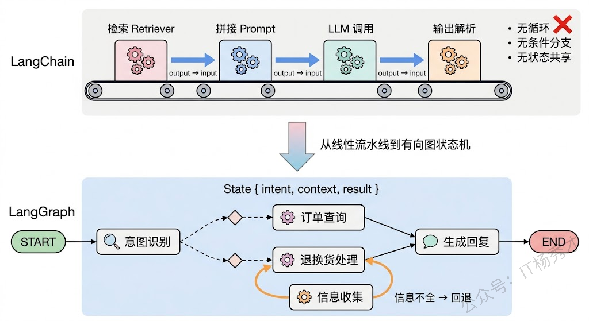
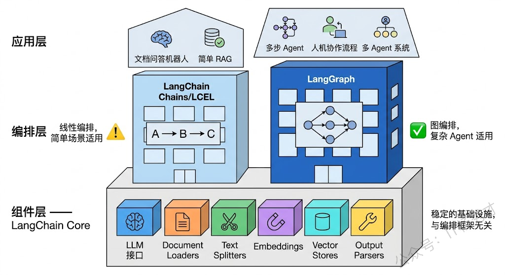
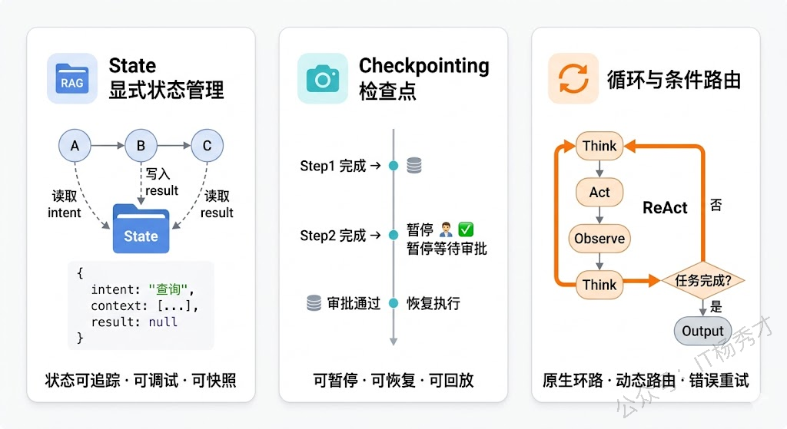
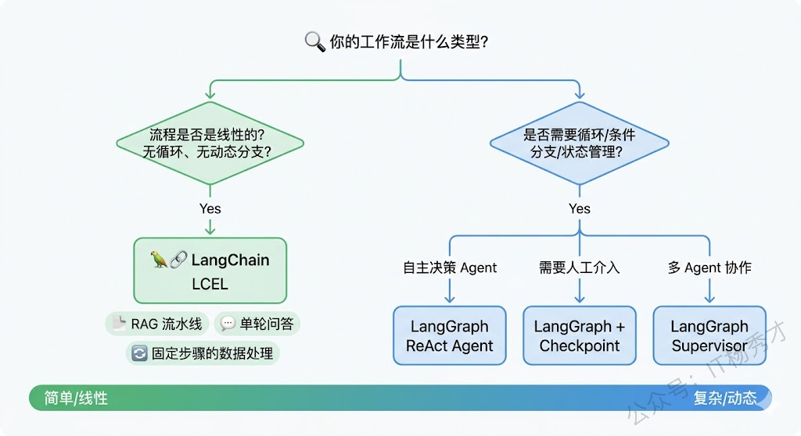
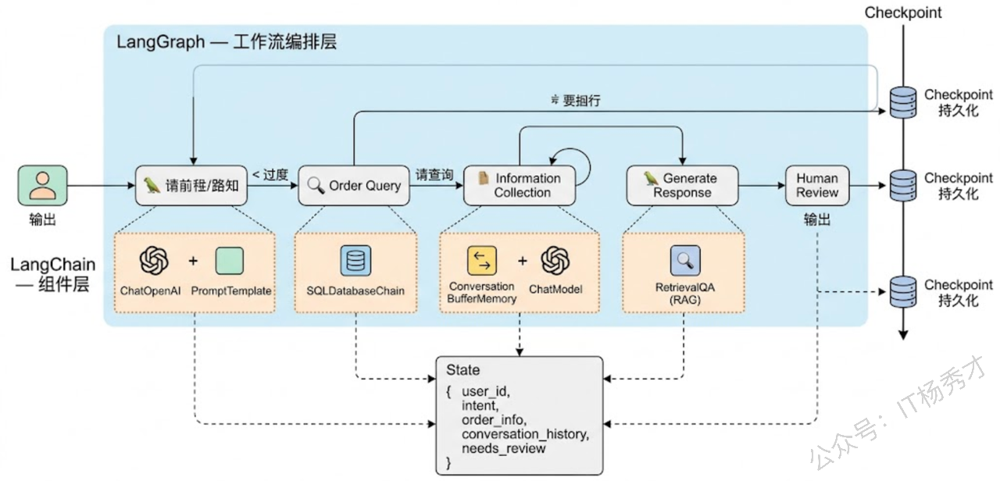

## **1. 题目分析**

LangChain 用起来确实很方便，刚开始你一定会觉得它封装得很好，写个 RAG、串个 Chain 几行代码就搞定了；但一旦需求复杂起来——比如 Agent 要根据中间结果走不同分支、某个步骤失败了要回退重试、多轮工具调用之间要共享状态——就会发现怎么写都别扭，处处受限。LangGraph 就是在这个背景下诞生的：它不是 LangChain 的替代品，而是 LangChain 团队自己意识到 Chain 抽象的局限后，用一套全新的计算模型来解决"复杂 Agent 编排"这个问题。

理解这两个框架的关系和区别，关键不在于记住它们各有哪些 API，而在于抓住一个核心问题：**为什么"链"这种抽象不够用了，"图"能解决什么"链"解决不了的问题？**

### **1.1 从 Chain 到 Graph**

LangChain 的核心抽象是 **Chain（链）**——把一系列处理步骤像流水线一样串起来，前一步的输出直接灌进下一步的输入。这个抽象简洁直观，非常适合数据单向流动的场景。你想构建一个 RAG 流程？检索文档 → 拼接 Prompt → 调用 LLM → 格式化输出，四步串成一条链就行了。想做更复杂的编排？用 SequentialChain 把多条链串起来，或者用 RouterChain 做简单的条件分发。

但问题就出在简单二字上。真实的 Agent 工作流程几乎不可能是一条直线走到底。一个典型的客服 Agent 可能是这样运行的：先理解用户意图，如果是查询订单就调订单接口，如果是退换货就进入退换货子流程，退换货过程中可能还需要用户补充信息于是要跳回信息收集步骤，最后还要根据处理结果决定是直接回复用户还是转人工。这里面有**条件分支**（根据意图走不同路径）、有**循环**（信息不全就回去重新收集）、有**动态路由**（根据运行时状态决定下一步走哪里）。这些控制流模式，用链式抽象来表达就非常勉强。

LangGraph 的出发点完全不同。它把工作流建模成一个**有向图（Graph）**：每个处理步骤是图中的一个 **Node（节点）**，步骤之间的流转关系是 **Edge（边）**，整个系统运行的中间数据存放在一个全局的 **State（状态）** 对象里。节点可以读写 State，边可以是无条件的（永远走这条路）也可以是条件边（根据 State 中的某个字段决定走哪条路）。

这意味着，在 LangGraph 里你可以非常自然地表达：

* 条件分支：一条条件边根据 `state["intent"]` 的值指向不同的节点

* 循环：一条边从节点 B 指回节点 A，当某个条件满足时才跳出循环

* 并行：从一个节点同时发出多条边到不同节点，它们并行执行后汇聚

* 人工介入：在某个节点暂停执行，等待人类审批后再继续

这不是换了个 API 的问题，而是底层计算模型的根本转变——从"流水线"变成了"状态机"。

### **1.2 LangChain 到底擅长什么**

说了这么多 LangGraph 的优势，是不是意味着 LangChain 已经过时了？完全不是。理解 LangChain 的价值，需要把它拆成两层来看。

**第一层是组件层**。LangChain 提供了大量开箱即用的模块：各家 LLM 的统一接口（ChatOpenAI、ChatAnthropic 等）、文档加载器（PDF、网页、数据库）、文本切分器、Embedding 模型封装、向量数据库集成、输出解析器等等。这些组件是和任何编排框架无关的基础设施——哪怕你用 LangGraph 来编排工作流，底层调用的大概率还是 LangChain 的这些组件。这一层的价值是持久的。

**第二层是编排层**，也就是 Chain、Agent 这些抽象。这一层是 LangChain 饱受争议的部分。早期的 AgentExecutor 把 Agent 的整个执行循环封装成了一个黑箱，对于简单场景很方便，但一旦你想定制执行逻辑——比如在某一步加个审批、失败后走不同的降级策略——就发现根本插不进去手。后来的 LCEL（LangChain Expression Language）用管道运算符 `|` 来组合链，写法更优雅了，但本质上还是线性组合，对复杂控制流的支持依然有限。

所以准确地说，LangGraph 替代的不是 LangChain 整体，而是 LangChain 编排层中那些力不从心的部分。两者更多是互补关系：LangChain 负责提供"积木"，LangGraph 负责决定"怎么搭"。

### **1.3 LangGraph 的三个核心设计**

深入理解 LangGraph，有三个设计理念值得重点关注。

**第一是显式的状态管理**。在 LangChain 的 Chain 里，数据是通过参数传递的——上一步返回什么，下一步就收到什么。这种隐式的数据流在步骤少的时候没问题，但步骤一多就很难追踪"某个数据是从哪来的、在哪被改过"。LangGraph 用一个集中式的 State 对象来管理所有状态。你用 TypedDict 或 Pydantic Model 定义好 State 的结构，每个节点函数接收当前 State、返回需要更新的字段，由框架引擎统一合并。这带来的好处是巨大的：状态变化有迹可循，调试时可以在任意节点查看完整的状态快照，甚至可以从某个中间状态重新运行整个图。

**第二是 Checkpointing（检查点机制）**。LangGraph 内置了持久化支持，可以在每个节点执行后自动保存一份完整的状态快照。这个特性打开了好几扇门：对话中途用户关掉了页面？下次回来可以从上次的检查点恢复继续执行。某个步骤需要人工审批？图执行到这个节点时暂停，人类审批通过后从检查点恢复继续往下走。线上出了问题想复现？拿到当时的检查点状态，原样重放整个执行过程。这种"可暂停、可恢复、可回放"的能力，对于生产级的 Agent 应用来说价值极大。

**第三是原生的循环和条件路由支持**。LangGraph 的图天然支持环（cycle），这意味着 Agent 的经典 ReAct 循环——思考→行动→观察→再思考——可以直接建模成图中的一个环路，不需要任何 hack。条件边则让你可以根据运行时状态动态决定下一步走哪里，这在错误处理、降级策略、分支逻辑等场景中极为常用。

### **1.4 场景选型**

说了这么多设计理念，落到实际选型上其实可以用一个非常简单的判断标准：**你的工作流里有没有"循环"或"条件分支"？**

如果你的需求是一个线性流程——文档加载→切分→Embedding→存储→检索→生成，或者用户输入→意图分类→模板化回复——那用 LangChain 的 LCEL 完全足够，代码量少、概念简单、调试方便。强行用 LangGraph 反而增加了不必要的复杂度。

如果你的需求涉及以下任何一个特征，LangGraph 就是更合适的选择：

> Agent 需要自主决策下一步做什么。经典的 ReAct Agent、Function Calling Agent，它们的执行过程本质上就是一个"调用工具→观察结果→决定下一步"的循环，LangGraph 把这个循环建模为图中的环路，控制清晰、易于扩展。

> 流程中有人工介入点。需要人类审核 Agent 的决策后再继续？LangGraph 的 Checkpoint 机制让你可以在任意节点暂停并恢复，而不需要自己维护复杂的状态持久化逻辑。

> 多 Agent 协作。当你的系统包含多个各有专长的 Agent 时——比如一个负责搜索、一个负责分析、一个负责综合——LangGraph 的 Supervisor 模式可以用一个协调节点来分配任务、汇总结果，Agent 之间通过共享 State 通信。这比用纯 LangChain 自己手写协调逻辑要清晰得多。

> 需要复杂的错误处理和降级策略。某个 API 调用失败了，是重试三次、换一个备用数据源、还是降级到缓存结果？条件边让你可以根据错误类型走不同的恢复路径。

### **1.5 认知误区**

最后提一个很多人都踩过的坑：把 LangChain 和 LangGraph 理解成同一层级的"竞品"。实际上它们处在不同的抽象层级，解决的也不是同一个问题。LangChain 解决的是"怎么方便地调用各种 LLM 和工具"，LangGraph 解决的是"怎么编排复杂的 Agent 工作流"。一个处理"连接"，一个处理"流程"。在真实项目中，它们几乎总是一起使用的——用 LangChain 的组件层提供基础能力，用 LangGraph 来编排这些能力的执行顺序和逻辑。

甚至可以说，LangGraph 的诞生恰恰印证了 LangChain 团队对自身局限的清醒认知：与其在链式抽象上修修补补，不如用一个更具表达力的计算模型从根本上解决问题。这种"自我颠覆"的思路，在技术选型中也值得我们学习——不是所有问题都应该在老架构上打补丁，有时候换一个抽象层级来思考才是正解。

***

## **2. 参考回答**

LangChain 和 LangGraph 本质上处在不同的抽象层级，解决的是不同问题。LangChain 的核心价值分两层来看：组件层提供了 LLM 调用、文档加载、向量检索、输出解析等一整套开箱即用的基础设施，这一层是和编排框架无关的；编排层则是它的 Chain 和 LCEL 抽象，本质上是一个线性流水线模型，前一步的输出直接灌进下一步的输入，适合数据单向流动的场景，比如 RAG 流程、固定步骤的数据处理。

LangGraph 解决的是 Chain 抽象力不从心的场景。它把工作流建模成有向图——Node 是处理步骤，Edge 是流转关系，State 是全局共享状态。这个模型天然支持条件分支、循环和动态路由，所以像 ReAct Agent 的"思考→行动→观察"循环可以直接建模为图中的环路，不需要任何 hack。它还内置了 Checkpointing 机制，能在每个节点保存状态快照，实现流程暂停恢复和人工介入，这对生产级 Agent 来说非常关键。

实际选型的判断标准很简单：如果流程是线性的、没有循环和动态分支，用 LangChain 的 LCEL 就够了，简单直接；如果涉及 Agent 自主决策、人工审批、多 Agent 协作或者复杂的错误处理降级，LangGraph 是更合适的选择。在我们的项目中，这两者几乎总是一起用的——LangChain 提供底层组件能力，LangGraph 负责编排这些能力的执行逻辑，一个管"连接"，一个管"流程"。

## **学习交流**

> 如果您觉得文章有帮助，可以关注下秀才的<strong style="color: red;">公众号：IT杨秀才</strong>，后续更多优质的文章都会在公众号第一时间发布，不一定会及时同步到网站。点个关注👇，优质内容不错过

