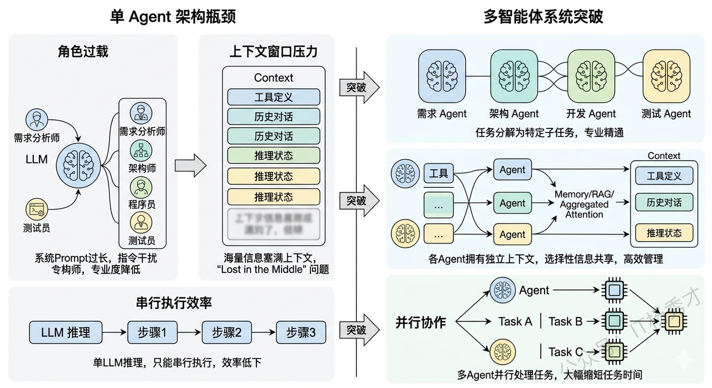
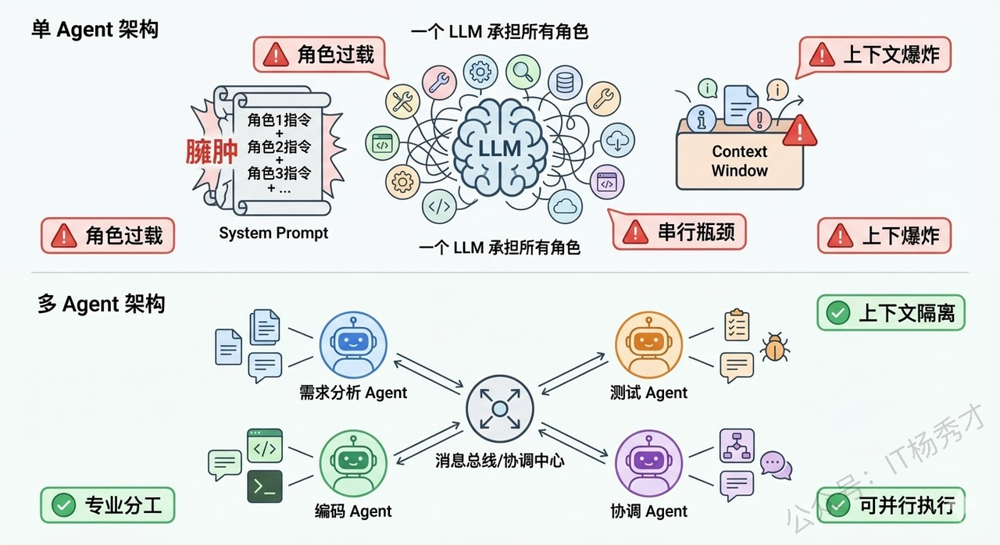
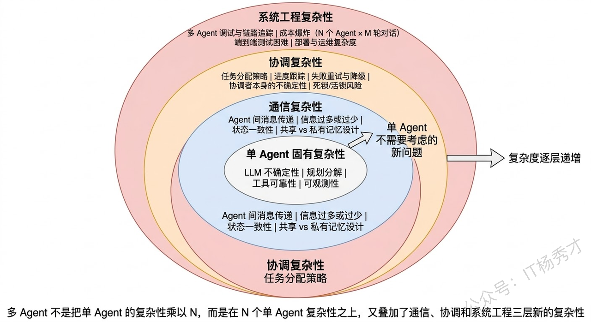
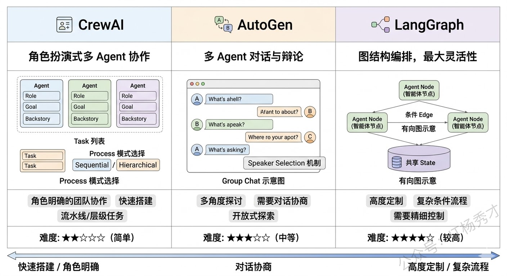

## **1. 题目分析**

这道题问了三个层次的东西：是什么、有什么好、有什么难。面试官想看到的不是你把 Multi-Agent 的定义背一遍，而是你能不能讲清楚"为什么需要从单 Agent 走向多 Agent"——这个演进背后的技术驱动力是什么，带来了哪些收益，同时又引入了哪些单 Agent 时代不存在的新问题。最好还能结合具体框架或项目经验来说，让面试官觉得你不是纸上谈兵

### **1.1 单 Agent 的瓶颈**

要理解多智能体系统，最好的切入点是先搞清楚：**单个 Agent 到底在什么时候不够用了？**

回顾单 Agent 的架构——一个 LLM 作为中枢大脑，配上工具、记忆、规划能力，通过 ReAct 等框架来完成任务。这套架构在很多场景下确实好用，但随着任务复杂度的提升，它会遇到几个瓶颈。

第一个瓶颈是**角色过载**。当你让一个 Agent 同时扮演"需求分析师 + 架构师 + 程序员 + 测试员"时，它的 System Prompt 会变得又长又复杂，各种角色的指令互相干扰，模型很难在一个上下文里同时保持多种角色的专业能力。就像现实中一个人同时做四份工作，每份都做不精。

第二个瓶颈是**上下文窗口的压力**。一个复杂任务涉及大量的工具定义、历史对话、中间推理状态，全部塞进一个 Agent 的上下文窗口，很快就撑满了。即使窗口够大，信息太多也会导致"Lost in the Middle"问题，关键信息被淹没。

第三个瓶颈是**串行执行的效率问题**。单 Agent 只有一个 LLM 在推理，所有步骤只能串行执行。如果任务中有可以并行的部分（比如同时分析三个竞品），单 Agent 也只能一个一个来。

多智能体系统就是为了突破这些瓶颈而出现的。

### **1.2 什么是多智能体系统**

多智能体系统（Multi-Agent System，MAS）是指**多个具有不同角色、专长或职责的 Agent 组成一个协作网络，通过互相通信和配合来共同完成一个复杂任务**。

你可以把它类比为一个公司的团队协作。单 Agent 就像一个全栈的"独行侠"，什么都自己干。而多智能体系统就像一个有明确分工的项目团队——有产品经理负责理解需求、架构师负责设计方案、程序员负责写代码、测试负责验证质量，每个人都专注于自己最擅长的领域，通过沟通协作来完成整个项目。

在技术实现层面，多智能体系统的每个 Agent 本质上还是由 LLM 驱动的，但每个 Agent 有自己独立的 **System Prompt**（定义角色和职责）、**工具集**（只挂载与自己职责相关的工具）、以及 **记忆空间**（可以有私有记忆也可以共享部分记忆）。Agent 之间通过某种**通信机制**（消息传递、共享黑板、管道等）来交换信息和协调行动。

### **1.3 多 Agent 协作的核心优势**

理解了"为什么需要多 Agent"之后，优势就很自然了：

**专业化分工带来的质量提升**是最大的优势。每个 Agent 只负责一个明确的角色，它的 System Prompt 可以写得非常精确和专注，挂载的工具也只需要和它的职责相关。这样 LLM 在推理时的"认知负荷"大幅降低，做出高质量决策的概率明显提高。就像你不会让一个前端工程师去写数据库优化 SQL 一样，专业的事交给专业的 Agent。

实验也验证了这一点——在代码生成任务中，让一个 Agent 同时写代码和审核代码的效果，明显不如让一个"Coder Agent"写代码然后让一个独立的"Reviewer Agent"做代码审查。因为后者在审查时不会带有"这是我自己写的代码"的认知偏见。

**上下文隔离带来的效率提升**也非常显著。每个 Agent 只需要在自己的上下文中保留与自身职责相关的信息，不需要装载其他 Agent 的工具定义和历史记录。这不仅降低了单个 Agent 的 token 消耗，也避免了信息过多导致的注意力分散。

**并行执行带来的速度提升**在很多场景下都很有价值。多个 Agent 可以同时处理任务的不同部分——比如在一个数据分析场景中，一个 Agent 在查询销售数据的同时，另一个 Agent 可以去查询用户反馈数据，最后由一个汇总 Agent 把两边的结果合并分析。这比单 Agent 串行执行两次查询要快得多。

**容错和鲁棒性**也得到了改善。多个 Agent 可以互相检查和验证对方的输出——一个 Agent 写了代码，另一个 Agent 来测试；一个 Agent 做了分析，另一个 Agent 来验证逻辑是否自洽。这种"交叉检验"的机制在单 Agent 架构中很难实现。

### **1.4 主流的多 Agent 协作模式**

在实际工程中，多 Agent 之间的协作方式不是随意的，而是有几种成熟的模式。理解这些模式对于面试和实际项目设计都很重要。

**中心化协调模式（Orchestrator Pattern）** 是最常见的模式。有一个"协调 Agent"（也叫 Supervisor / Manager）作为中枢，它负责接收用户任务、分配子任务给各个专业 Agent、收集结果、做最终汇总。其他 Agent 不直接互相通信，而是都和协调 Agent 交互。这种模式结构清晰、容易控制，但协调 Agent 是单点瓶颈——如果它的判断出错，整个团队都会被带偏。

**去中心化对话模式（Debate / Discussion Pattern）** 允许多个 Agent 之间直接对话讨论。比如让一个"正方 Agent"和一个"反方 Agent"围绕一个问题展开辩论，最后由一个"裁判 Agent"做总结。这种模式在需要多角度分析的场景中很有效，但对话管理更复杂。

**流水线模式（Pipeline Pattern）** 是把任务拆成多个阶段，每个阶段由一个 Agent 负责，上一个 Agent 的输出是下一个 Agent 的输入，形成一条流水线。比如"需求分析 Agent → 设计 Agent → 编码 Agent → 测试 Agent"，就是一条典型的软件开发流水线。这种模式适合阶段明确、前后依赖关系清晰的任务。

**层级模式（Hierarchical Pattern）** 是中心化模式的扩展。顶层有一个总协调 Agent，它把任务分配给几个中层 Manager Agent，每个 Manager 再管理自己下属的 Worker Agent。这种模式适合规模更大、层次更深的复杂任务。

### **1.4 多 Agent 引入的新复杂性**

多 Agent 不是银弹，它在解决单 Agent 瓶颈的同时，也引入了一系列单 Agent 时代完全不存在的新问题。

**通信开销与信息一致性**是第一个大问题。多个 Agent 之间需要互相传递信息，但传什么、传多少、什么时候传，都需要精心设计。传少了，下游 Agent 缺乏足够的上下文做出好的决策；传多了，又变成了变相把所有信息塞进一个超大上下文的老问题。更棘手的是**信息一致性**——Agent A 在第 3 步更新了对任务的理解，但 Agent B 可能还在基于第 1 步的旧信息工作，这种信息不同步会导致协作混乱。

实际项目中，常见的做法是设计一个**共享状态空间（Shared State）**——所有 Agent 都可以读写的公共黑板。LangGraph 中的 State 就是这个思路，每个 Node（Agent）读取 State 中自己需要的字段、写回自己产出的结果，由图引擎保证状态的一致性。

**任务分配与协调成本**是第二个问题。谁来决定把哪个子任务分给哪个 Agent？分完之后怎么知道各个 Agent 的执行进度？某个 Agent 失败了怎么重试或换人？这些在人类团队中靠项目经理和日会来解决的问题，在多 Agent 系统中需要靠一个可靠的"协调机制"来处理。而这个协调者本身也是一个 LLM 驱动的 Agent，它的决策同样有不确定性——可能分配错任务、可能误判执行进度、可能做出不合理的重新规划。

**调试难度的指数级增长**是第三个问题，也是在实际项目中感知最强烈的痛点。单 Agent 的调试已经够难了——推理链长、不可复现、黑箱不透明。多 Agent 把这个难度又放大了一个量级：你需要追踪多个 Agent 之间的消息流、理解每个 Agent 独立的推理链、还要排查它们之间的交互是否正确。当一个多 Agent 系统给出了错误结果时，可能是 Agent A 的分析有误、也可能是 Agent B 在传递信息时丢了关键细节、也可能是协调 Agent 在汇总时做了错误的判断——定位问题的空间比单 Agent 大得多。

**成本控制**也是一个现实挑战。多 Agent 意味着多次 LLM 调用，而且 Agent 之间的通信本身也常常需要 LLM 来做"翻译"和"理解"。一个 3 个 Agent 的系统完成一次任务，总 LLM 调用次数可能是单 Agent 的 3-5 倍甚至更多。在 token 单价还没有降到足够低的阶段，这在很多 B2C 场景中是不可接受的成本。

### **1.5 主流框架和工程选型**

了解了原理和挑战之后，面试中如果能结合框架来谈就很有说服力了。

**CrewAI** 是目前最流行的多 Agent 框架之一，它用 Role-Based 的方式定义 Agent——每个 Agent 有自己的 Role（角色）、Goal（目标）、Backstory（背景故事），像定义一个角色扮演游戏的角色一样。支持 Sequential（流水线）和 Hierarchical（层级）两种协作模式，上手非常简单。

**AutoGen**（微软出品）侧重于多 Agent 对话场景，支持 Group Chat 模式让多个 Agent 在一个对话组里讨论问题，非常适合需要多角度探讨的场景。

**LangGraph** 虽然不是专门的多 Agent 框架，但它的图编排能力天然适合构建多 Agent 系统——每个 Node 可以是一个独立的 Agent，Node 之间的边定义了通信和数据流转，通过 State 做共享状态管理。它的灵活性最高，但上手门槛也最高。

选型原则很简单：**如果你的任务可以分成几个明确的角色用流水线或层级方式协作，CrewAI 是最快的选择；如果需要 Agent 之间自由讨论辩论，AutoGen 更合适；如果需要高度定制的复杂协作流程，LangGraph 给你最大的控制力。**

## **2. 参考回答**

多智能体系统是指多个具有不同角色和专长的 Agent 组成协作网络，通过通信和分工来共同完成复杂任务。

它的出现本质上是为了解决单 Agent 的三个瓶颈：**第一是角色过载**，一个 Agent 同时承担多种角色时 Prompt 臃肿、角色指令互相干扰，质量下降明显；**第二是上下文压力**，大量工具定义和推理历史撑满窗口；**第三是串行瓶颈**，单 Agent 无法并行处理任务的不同部分。

多 Agent 对应带来了几个核心优势：专业化分工让每个 Agent 的 Prompt 精简且专注，决策质量显著提升，而且独立的"审查 Agent"可以避免自我确认偏见；上下文隔离让每个 Agent 只关注自己职责范围内的信息；可并行执行的子任务交给不同 Agent 同时处理也大幅缩短整体耗时。在协作模式上，主要有**中心化协调**（Supervisor 分配任务，CrewAI 和 LangGraph 都支持）、**去中心化对话**（Agent 之间直接讨论，AutoGen 的 Group Chat）、**流水线**和**层级**四种模式，根据任务特点选择。

但多 Agent 也引入了单 Agent 时代不存在的新复杂性：**通信层面**，Agent 间传递什么信息、传多少、如何保持状态一致性都需要精心设计，LangGraph 用 Shared State 来解决这个问题；**协调层面**，任务怎么分、进度怎么跟、失败怎么重试都依赖协调者的判断，而协调者本身也有 LLM 不确定性；**工程层面**，调试难度是指数级增长的——多个 Agent 的推理链交织在一起，定位问题空间比单 Agent 大得多；还有**成本问题**，N 个 Agent 通信 M 轮意味着 LLM 调用次数成倍增长。

我的实际经验是，多 Agent 不应该是默认选择，而应该是**单 Agent 确实遇到瓶颈后的升级方案**——能用单 Agent 搞定的就不要上多 Agent，因为复杂性本身就是成本。

## **学习交流**

> 如果您觉得文章有帮助，可以关注下秀才的<strong style="color: red;">公众号：IT杨秀才</strong>，后续更多优质的文章都会在公众号第一时间发布，不一定会及时同步到网站。点个关注👇，优质内容不错过

