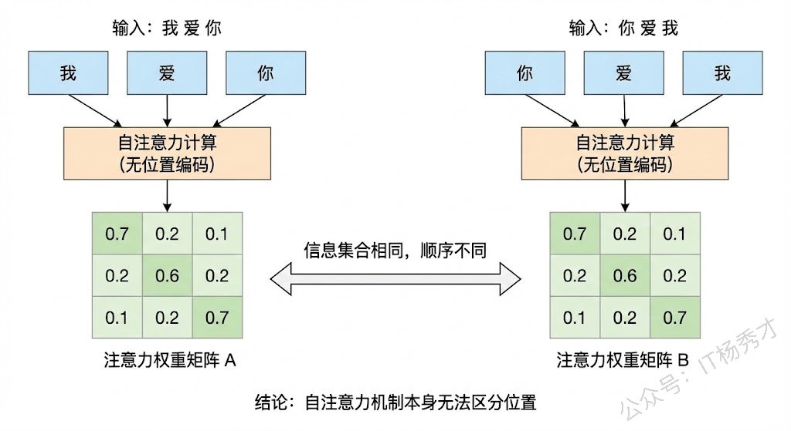
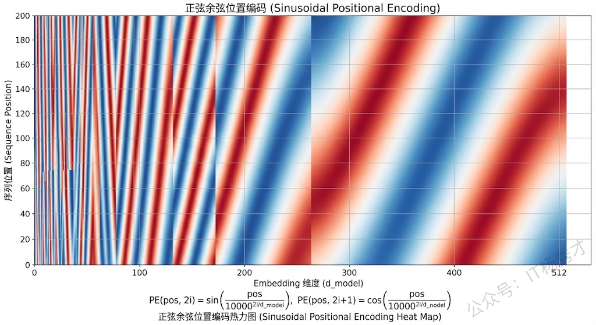
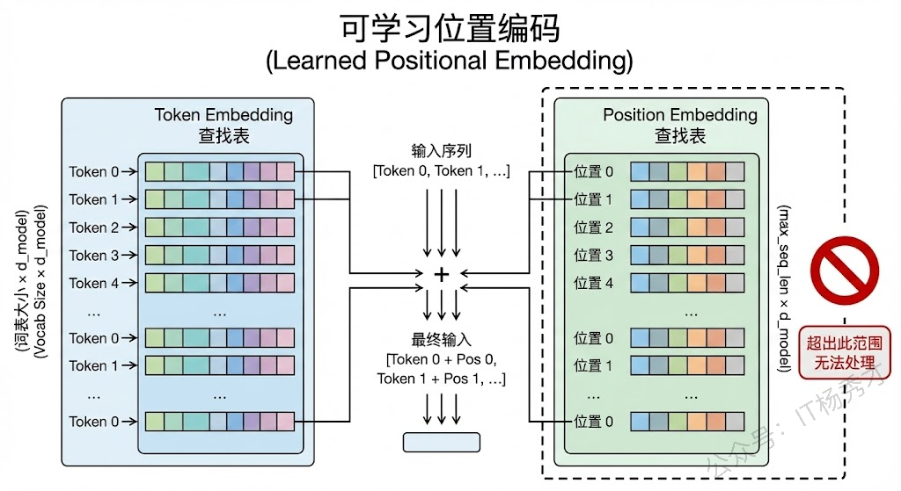
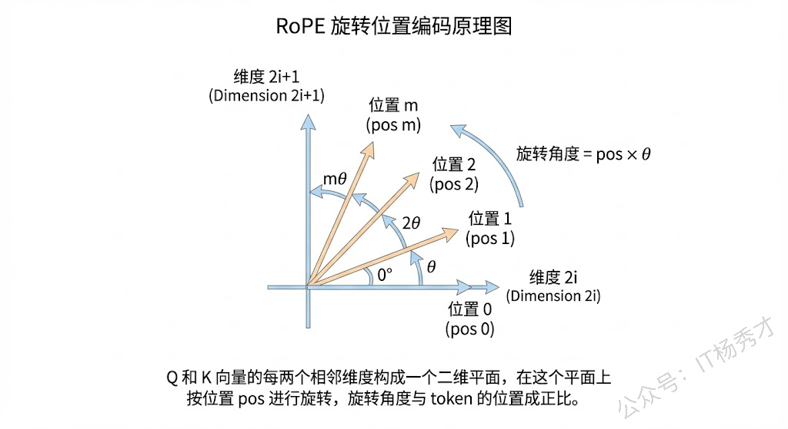
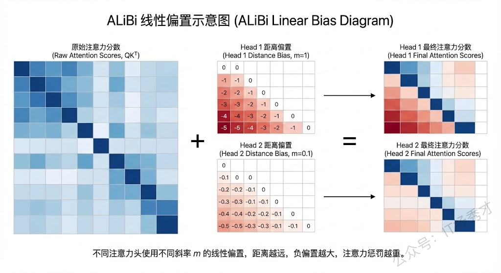
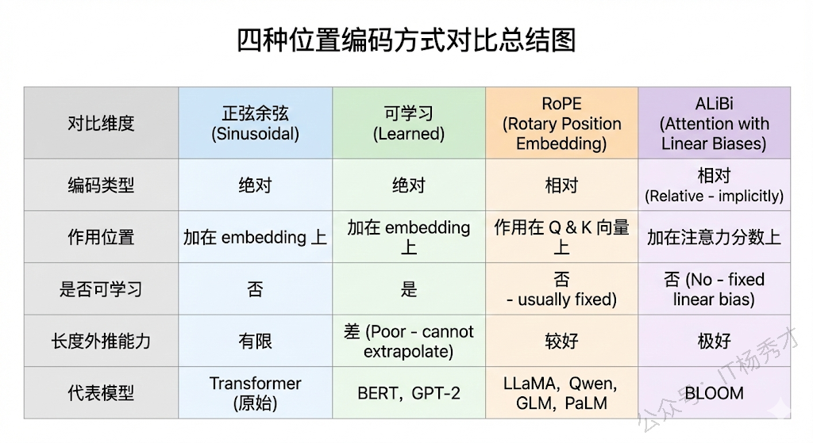

## **1. 题目分析**

这道题看起来简单，但其实考察的层次很丰富。面试官不仅想听你说出几种位置编码的名字，更想看你是否理解"为什么 Transformer 需要位置编码"这个根本性问题，以及你对不同位置编码方案设计思路的理解深度。我们从"为什么需要"出发，然后逐一讲清楚主流的实现方式。

### **1.1 为什么 Transformer 必须有位置编码**

要理解这个问题，我们得先回到 Transformer 的核心——自注意力机制的本质。自注意力的计算过程是：每个 token 的 Query 和所有 token 的 Key 做点积，然后加权求和 Value。你仔细想一下这个过程，会发现一个关键的事实：这整个计算跟 token 的位置没有任何关系。不管你把"我爱你"输入成"我爱你"还是"你爱我"，如果不加任何位置信息，自注意力算出来的结果是完全一样的（只是 token 的排列顺序变了，但每个 token 看到的"全局信息集合"是相同的）。

换句话说，自注意力本质上是一个**集合操作（Set Operation）**，它把输入当成一个无序的集合来处理，天然不具备感知顺序的能力。但语言是有严格顺序含义的，"我爱你"和"你爱我"的语义完全不同。所以我们必须通过某种方式把位置信息显式地注入到模型中，让模型知道每个 token 处在序列的什么位置，这就是位置编码存在的根本原因。



这里值得对比一下 RNN 和 CNN。RNN 天然具备位置感知能力，因为它是按顺序逐步处理 token 的，第几步处理的就是第几个 token，时间步本身就隐含了位置信息。CNN 通过卷积核的滑动窗口，也能天然捕获局部的相对位置关系。只有 Transformer 的自注意力是纯粹的"全局集合运算"，所以它是唯一一个必须显式引入位置编码的架构。

### **1.2 正弦余弦位置编码**

这是 2017 年原始论文 "Attention Is All You Need" 中提出的方案，也是最经典的位置编码方式。它的核心思想非常巧妙：用不同频率的正弦和余弦函数来为每个位置生成一个唯一的编码向量。

具体来说，位置编码向量的每个维度都由一个三角函数决定，偶数维度用 sin，奇数维度用 cos，公式是：

```java
PE(pos, 2i) = sin(pos / 10000^(2i/d_model))
PE(pos, 2i+1) = cos(pos / 10000^(2i/d_model))
```

其中 pos 是 token 在序列中的位置，i 是维度索引，d\_model 是模型的隐藏层维度。

为什么用三角函数？因为三角函数有一个非常好的数学性质：任意位置 pos+k 的编码可以表示为位置 pos 编码的线性变换。这意味着模型理论上可以通过线性运算来学习"相对位置"的概念——它不仅知道每个 token 在哪，还能感知到两个 token 之间的距离关系。

这种编码方式是**固定的、不可学习的**，在训练之前就已经确定了。它的好处是不引入额外的参数，而且理论上可以外推到训练时没见过的更长序列（因为三角函数对任意位置都有定义）。但实际效果上，外推能力比较有限。



### **1.3 可学习的位置编码**

这是 BERT、GPT-2 等模型采用的方式，思路非常直接：为每个位置分配一个可训练的 embedding 向量，跟词向量一样，在训练过程中通过反向传播来学习最优的位置表示。

实际上就是维护一个形状为 (max\_seq\_len, d\_model) 的参数矩阵，位置 0 对应矩阵的第 0 行，位置 1 对应第 1 行，以此类推。输入的时候把 token embedding 和对应位置的 position embedding 直接相加，就注入了位置信息。

这种方式的优点是足够灵活，模型可以自动学习到数据中最合适的位置表示模式，在训练长度范围内通常效果略好于固定的正弦余弦编码。但它有一个明显的缺陷：**无法处理超过训练长度的序列**。因为超出 max\_seq\_len 的位置在参数矩阵中根本不存在，没有对应的 embedding。这就是为什么 BERT 的最大输入长度被限制在 512 的原因之一。



### **1.4 旋转位置编码**

RoPE 是目前大模型时代最主流的位置编码方案，被 LLaMA、Qwen、GLM 等几乎所有主流开源大模型采用。它的设计思路和前两种有本质的不同。

前面两种方式——无论是正弦余弦还是可学习的——都是**绝对位置编码**，它们直接给每个位置分配一个编码，然后加到 token embedding 上。而 RoPE 的核心理念是：**我们真正需要的不是"每个 token 在哪"，而是"两个 token 之间的距离是多少"**。也就是说，位置信息应该体现在 token 之间的相对关系上，而不是绝对坐标上。

RoPE 的实现方式非常优雅：它不是加在 embedding 上，而是作用在注意力计算的 Q 和 K 向量上。具体来说，它把 Q 和 K 向量按相邻两个维度一组进行分组，对每一组应用一个二维旋转变换，旋转角度与 token 的位置成正比。这样做之后，当两个 token 的 Q 和 K 做点积时，结果只取决于它们之间的相对位置差，而不是各自的绝对位置。



RoPE 的优势非常突出。首先，相对位置信息天然融入了注意力分数的计算中，不需要额外的加法操作。其次，它的长度外推能力远好于前两种方案，虽然直接外推到远超训练长度的序列仍有挑战，但配合 NTK-aware 缩放、YaRN 等外推技术后，可以实现比较好的长度泛化。这也是为什么现在百万级上下文窗口的大模型（如 Kimi、Claude）能做到超长文本处理的基础技术之一。

### **1.5 ALiBi**

ALiBi 是另一种值得了解的位置编码方案，被 BLOOM 等模型采用。它的思路更加简洁粗暴：完全不修改 Q、K、V 的计算，而是直接在注意力分数上加一个与距离成正比的线性偏置。两个 token 距离越远，加的负偏置越大，相当于直接惩罚远距离的注意力。

ALiBi 的优点是实现极其简单，而且长度外推能力非常好——因为线性偏置对任意距离都有定义，不依赖训练时见过的长度。但它也有局限，就是这种"距离越远注意力越低"的硬性先验假设，在某些需要长距离强依赖的任务上可能会损失一些表达能力。



最后我们把上面四种位置编码方案放在一起做一个横向对比。从编码类型来看，正弦余弦和可学习位置编码都属于绝对位置编码，直接告诉模型"你在第几个位置"；而 RoPE 和 ALiBi 则属于相对位置编码的思路，关注的是"两个 token 之间隔了多远"。从作用位置来看，前两者都是加在输入的 embedding 上，RoPE 是作用在 Q 和 K 的向量上做旋转，ALiBi 则是直接加在注意力分数矩阵上。从长度外推能力来看，可学习位置编码最差（超出训练长度直接失效），正弦余弦理论上可以但实际效果一般，RoPE 配合外推技术表现良好，ALiBi 的外推能力最为天然。从实际应用来看，当前大模型时代 RoPE 是绝对的主流选择，几乎所有一线开源大模型都采用了这个方案。



## **2. 参考回答**

位置编码是为了解决 Transformer 自注意力机制天然不具备位置感知能力这个问题而设计的。自注意力的本质是一个集合操作，它对输入序列做的是全局的无序加权求和，不管 token 怎么排列，只要集合相同，计算结果就相同。但语言是有严格语序含义的，"我爱你"和"你爱我"语义完全不同，所以必须通过位置编码显式注入位置信息，让模型能区分 token 的先后顺序。

主流的实现方式我了解比较深的有这么几种。第一种是原始 Transformer 的正弦余弦位置编码，用不同频率的 sin 和 cos 函数为每个位置生成固定的编码向量，利用三角函数的线性变换性质让模型能感知相对距离，优点是不增加参数，缺点是实际外推能力有限。第二种是 BERT、GPT-2 用的可学习位置编码，就是为每个位置维护一个可训练的 embedding，灵活度高，但无法处理超过训练长度的序列。第三种是现在大模型时代最主流的 RoPE 旋转位置编码，它作用在 Q 和 K 上，通过对向量做与位置成正比的旋转变换，使得注意力分数天然只依赖相对位置差，LLaMA、Qwen 等主流模型都在用，配合 YaRN 等技术可以实现很好的长度外推。另外还有 ALiBi 这种方案，直接在注意力分数上加线性距离偏置，实现简单且外推能力强，BLOOM 模型用的就是这种。目前业界的共识是 RoPE 综合表现最优，是大模型的首选方案。

<div style="background-color: #f0f9eb; padding: 10px 15px; border-radius: 4px; border-left: 5px solid #67c23a; margin: 20px 0; color:rgb(64, 147, 255);">

## <span style="color: #006400;">**学习交流**</span>
<span style="color:rgb(4, 4, 4);">
> 如果您觉得文章有帮助，可以关注下秀才的<strong style="color: red;">公众号：IT杨秀才</strong>，后续更多优质的文章都会在公众号第一时间发布，不一定会及时同步到网站。点个关注👇，优质内容不错过
</span>


</div>

