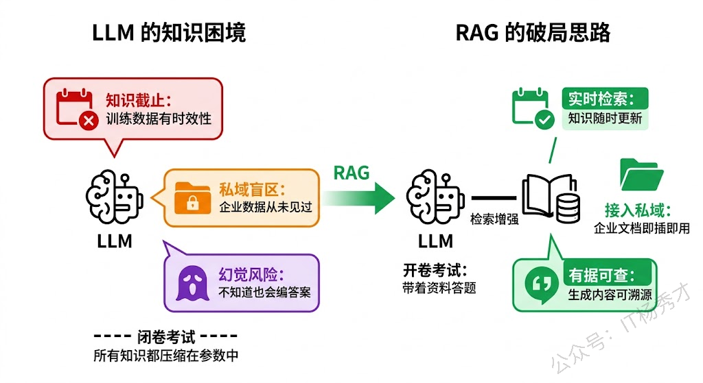
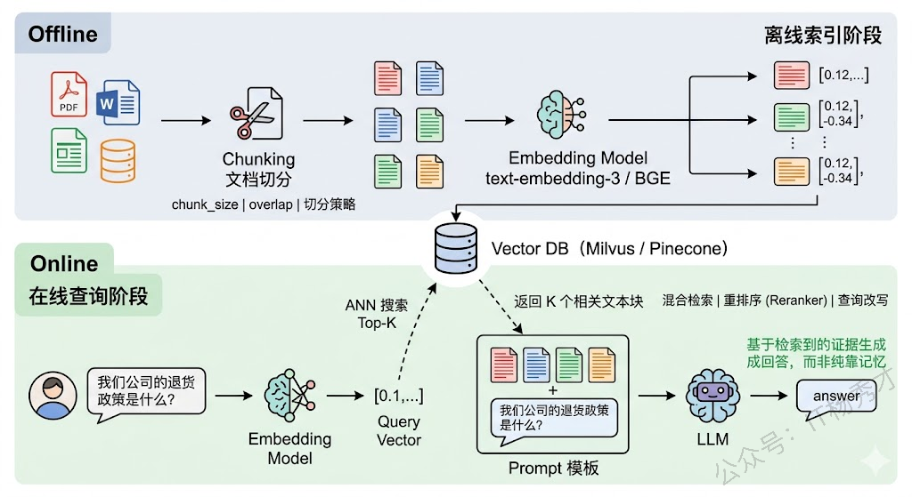
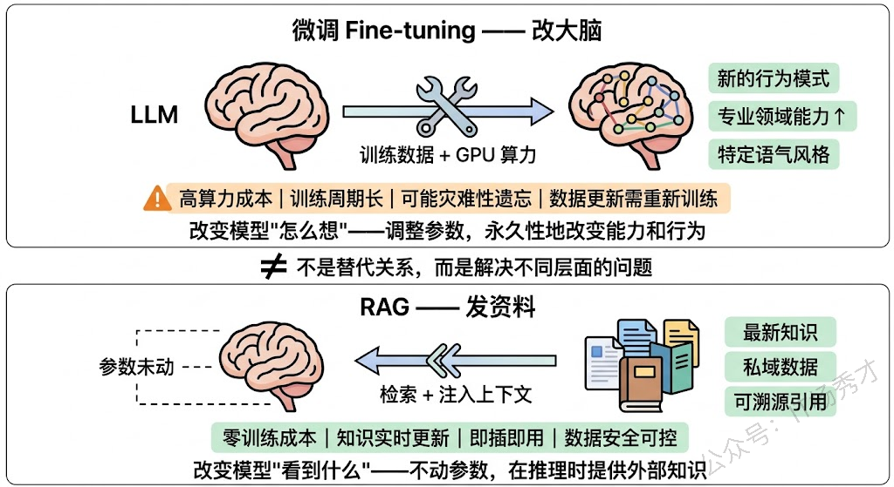
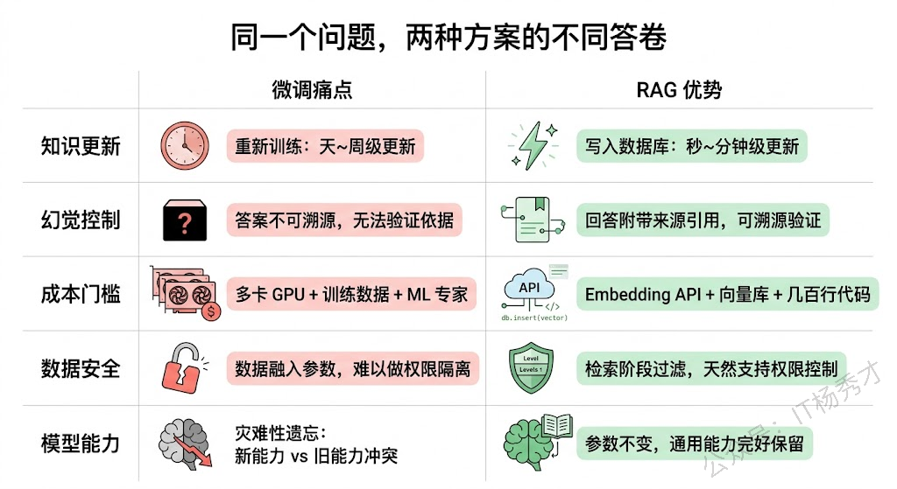
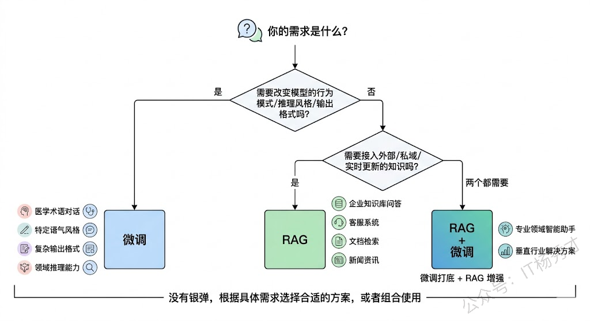

## **1. 题目分析**

这道题看似基础，实则是一块很好的试金石。面试官不是想听你把 RAG 的定义解释一遍。他真正想考察的是：你对 RAG 的理解是否深入、它在工程中到底怎么跑的、以及你能不能跳出 RAG 本身，站在更高的视角去对比 RAG 和微调各自解决了什么层面的问题。一个好的回答应该从 LLM 的根本局限性出发，自然地引出 RAG 的设计动机，再深入到它的技术流程，最后落到和微调的系统性对比上。

### **1.1 为什么需要 RAG**

要理解 RAG，首先得理解它要解决的痛点。大语言模型的知识来源于预训练阶段吃过的语料，这套"参数化知识"有三个致命的缺陷。

> **第一，知识有截止日期**。GPT-4 的训练数据截止到某个时间点，之后发生的事情它一无所知。你问它"2024 年诺贝尔物理学奖给了谁"，它只能坦白说不知道，或者更糟——编一个看起来很像真的但完全错误的答案。这在企业场景中尤其致命，因为业务数据每天都在更新，产品文档随时在迭代，法规政策可能上个月刚改。

> **第二，缺乏私域知识**。LLM 训练用的是公开互联网数据，你公司内部的技术文档、客户档案、会议纪要、产品规格书——这些私有数据 LLM 从未见过。你不可能指望一个"只读过互联网"的模型来回答"我们公司的退货政策是什么"。

> **第三，幻觉问题**。当 LLM 对某个问题没有足够的知识储备时，它不会老实说"我不知道"，而是会"一本正经地胡说八道"——用流畅自信的语言生成看起来合理但事实上错误的内容。这是因为 LLM 的本质是一个概率语言模型，它优化的目标是"下一个 token 的概率"，而不是"事实的准确性"。这种幻觉在需要高准确性的场景（法律、医疗、金融）中是不可接受的。

面对这三个缺陷，直觉上你可能会想：那把最新的数据、私域文档全部喂给模型重新训练不就好了？这就是微调的思路。但微调有很高的门槛——需要 GPU 算力、需要整理训练数据、需要处理灾难性遗忘、训练完还要重新部署。而且每次数据更新都要重新微调，成本和周期都不现实。RAG 的诞生，本质上就是在说：**能不能不动模型本身，而是在推理阶段给它"开卷考试"的机会？** 不要求模型记住所有知识，而是在需要的时候从外部知识库中检索相关信息，把检索结果作为上下文塞给模型，让它"带着资料回答问题"。

### **1.2 RAG 的完整工作流程**

理解了动机之后，我们来看 RAG 在技术上到底是怎么运转的。一个标准的 RAG 系统可以拆成两个阶段：**离线索引阶段**和**在线查询阶段**。

**离线索引阶段**是"备考"的过程，目的是把原始文档变成可以被高效检索的形式。具体来说，分为三步：

第一步是**文档加载与切分（Chunking）**。原始文档可能是 PDF、Word、网页、数据库记录等各种格式，首先要把它们统一解析成纯文本。然后，由于文档通常很长，而后续的 Embedding 模型和 LLM 的上下文窗口都有长度限制，需要把长文档切分成较小的文本块（Chunk）。切分策略是 RAG 工程中第一个需要仔细调优的点——切太大，检索精度下降（一个大 chunk 里可能只有一小段是相关的，其他全是噪声）；切太小，语义完整性被破坏（一句话被从中间截断，失去了上下文）。常见的策略包括按固定长度切分并设置重叠（Overlap）、按自然段落或章节切分、以及基于语义相似度的动态切分。

第二步是**向量化（Embedding）**。用一个 Embedding 模型（如 OpenAI 的 text-embedding-3、BGE、E5 等）把每个文本块转换成一个高维向量。这个向量是文本块语义信息的数学表示——语义相近的文本块在向量空间中的距离也相近。这一步的关键是 Embedding 模型的质量，它直接决定了后续检索的准确率。

第三步是**存入向量数据库**。把所有文本块的向量及其对应的原文存入向量数据库（如 Milvus、Pinecone、Weaviate、Chroma 等）。向量数据库的核心能力是**近似最近邻搜索（ANN）**——给定一个查询向量，能在毫秒级别从百万甚至亿级的向量中找到最相似的 Top-K 个。

**在线查询阶段**是"开卷考试"的过程，用户提出一个问题后，系统实时检索相关知识并交给 LLM 生成回答。同样分为三步：

第一步是**查询向量化**。用同一个 Embedding 模型把用户的问题转换成向量。注意这里必须用和索引阶段相同的模型，否则向量空间不一致，检索就会失效。

第二步是**相似度检索**。用问题向量在向量数据库中进行 ANN 搜索，找到 Top-K 个最相似的文本块。这些文本块就是系统认为和用户问题最相关的"参考资料"。实际工程中，这一步往往还会叠加一些增强策略，比如混合检索（同时用向量检索和关键词检索，取并集）、重排序（用一个 Cross-encoder 模型对 Top-K 结果做精排）、查询改写（用 LLM 对用户原始问题做扩展或改写以提高召回率）等。

第三步是**上下文增强生成**。把检索到的文本块拼接到 Prompt 中，连同用户的原始问题一起发给 LLM。LLM 基于这些"参考资料"来生成最终回答，而不是纯靠自己的参数化知识。

### **1.3 RAG vs 微调**

要理解RAG 和微调的对比，我们可以用一个形象的比喻。**微调就像是给一个人"补课"**——你改变的是他脑子里的知识结构和思维方式。微调后的模型，它的参数被永久性地更新了，它"记住"了新的知识或"学会"了新的行为模式。**RAG 则像是给一个人"发参考资料"**——你没有改变他的能力，而是在他答题的时候递给他一叠相关材料，让他照着材料来回答。

这个区别意味着它们擅长解决的问题完全不同：

> **微调擅长改变模型的"行为模式"和"专业能力"**。比如你想让一个通用模型学会用医学术语对话、学会用特定的语气风格回答、学会遵循某种复杂的输出格式、或者让它在某个专业领域（如法律条文解读）的推理能力更强——这些是微调的强项。因为这些本质上是在改变模型的"思维方式"，需要调整模型参数才能实现。

> **RAG 擅长解决"知识获取"层面的问题**。即模型需要用到的事实性信息——最新的数据、私域文档、具体的产品参数等。这些信息的特点是"需要查的，而不是需要学的"。你不需要让模型把你公司所有产品的参数都背下来，你只需要在用户问到某个产品时，帮它从数据库里检索出相关参数就好了。

在明确了 RAG 和微调解决不同层面问题之后，我们来系统梳理 RAG 相比微调在"知识获取"这个层面的具体优势。

**优势一：知识实时更新，无需重新训练**。这是 RAG 最直接、最有杀伤力的优势。微调一次模型，从准备数据到训练完成到部署上线，可能需要数天甚至数周。如果你的知识库每天都在变化——比如新闻资讯、产品价格、库存信息、法规更新——微调的更新频率根本跟不上。而 RAG 的知识更新只需要往向量数据库里写入新数据，几分钟甚至几秒钟就完成了，不需要动模型一根毫毛。

**优势二：大幅降低幻觉，生成内容可溯源**。RAG 通过在 Prompt 中提供明确的参考信息，把 LLM 的生成从"凭记忆编"变成了"照资料写"。模型有了事实依据，胡编乱造的空间就大大缩小了。更重要的是，RAG 天然支持引用溯源——你可以让系统在回答中标注"该信息来源于XX文档第X页"，用户可以验证信息的准确性。这在法律、医疗、金融等对准确性要求极高的场景中是刚需。微调出来的模型给你一个答案，你很难知道这个答案是从哪条训练数据中"学到"的。

**优势三：成本低、门槛低、落地快**。微调需要 GPU（通常是多卡甚至集群）、需要精心整理的训练数据集、需要调超参、需要处理过拟合和灾难性遗忘等问题，对团队的 ML 能力有要求。RAG 的门槛低得多：一个 Embedding API、一个向量数据库、一个 LLM API，加上几百行代码，就能搭起一个可用的原型。这也是为什么 RAG 成为了当前 LLM 应用落地最主流的范式——它让没有深厚 ML 背景的开发团队也能快速构建知识增强的 AI 应用。

**优势四：数据安全和权限控制**。在企业场景中，不同用户有权访问的数据范围是不同的。RAG 天然支持这种权限控制——在检索阶段就可以根据用户身份过滤可访问的文档范围，确保模型只能"看到"该用户有权看到的资料。如果把所有数据都微调到模型参数里，你很难阻止模型在回答 A 用户的问题时泄露 B 用户的数据。

**优势五：避免灾难性遗忘**。在新数据上微调后，模型可能会"忘记"之前学到的通用能力。比如你用医学数据微调了一个模型，它在医学领域变强了，但通用的对话能力、逻辑推理能力可能会退化。RAG 完全没有这个问题，因为它根本不动模型参数，通用能力完好无损。

### **1.4 RAG的局限性**

一个成熟的回答不应该只讲优势而回避局限。RAG 也有它的短板，面试中主动提到这些会展示你的工程判断力。

**检索质量是天花板**。RAG 的效果高度依赖检索的准确率——如果检索到的文本块和问题不相关甚至矛盾，LLM 会基于错误的上下文生成错误的答案，这有时会比没有 RAG 更危险（因为模型"有理有据地说错话"，用户更容易相信）。这就是为什么 RAG 工程化中，检索优化（Chunking 策略、Embedding 模型选型、混合检索、Reranker 重排序）占了最大的工作量。

**上下文窗口的瓶颈**。检索出来的文本块要塞进 Prompt，受限于 LLM 的上下文长度。如果相关信息分散在很多文档中，你可能塞不下所有相关内容，导致信息丢失。虽然现在长上下文模型（128K 甚至更长）在一定程度上缓解了这个问题，但"长上下文≠好利用"——研究表明 LLM 对超长上下文中间部分的注意力会下降（Lost in the Middle 现象）。

**不擅长改变模型行为**。前面说了，RAG 解决的是"知识获取"问题，而不是"行为模式"问题。如果你想让模型学会一种新的推理风格、适应一种特定的输出格式、或在某个专业领域具备更强的理解力——这些需要微调来解决，RAG 帮不上忙。

**实际上，RAG 和微调最好的关系是互补而非互斥**。在很多生产级系统中，两者是一起用的：先微调让模型具备领域专业能力和特定行为模式，再用 RAG 为它提供实时的、可更新的事实性知识。这种"微调打底 + RAG 增强"的组合拳，才是目前业界最成熟的实践方案。

## **2. 参考回答**

RAG 的核心思路其实很直观——它要解决的是大语言模型知识层面的三大先天缺陷：**训练数据有截止日期导致知识过时、缺乏企业私域知识、以及在知识不足时容易产生幻觉**。RAG 的做法不是去改变模型本身，而是在推理阶段给模型补充知识的机会。

具体的工作流程分两个阶段。离线阶段：先把文档切分成合适大小的文本块，通过 Embedding 模型转成语义向量，存入向量数据库。在线阶段：用户提问后，先用同一个 Embedding 模型把问题向量化，在向量数据库中做近似最近邻搜索找到最相关的 Top-K 文本块，然后把这些文本块作为上下文和用户问题一起塞进 Prompt 发给 LLM，让它基于这些"参考资料"来生成回答。实际工程中还会叠加混合检索、Reranker 重排序、查询改写等优化手段来提升检索质量。

和微调相比，**两者解决的问题层面完全不同**。微调是"改大脑"——通过更新模型参数来改变它的行为模式和专业能力，比如让模型学会医学术语对话或遵循特定输出格式。RAG 是"发资料"——不动模型参数，在推理时提供外部知识。所以 RAG 的优势集中在知识获取层面：第一，知识可以实时更新，往向量库里写条数据就行，不用重新训练模型；第二，大幅降低幻觉，因为生成有了事实依据，而且天然支持引用溯源，用户能验证答案来源；第三，成本低门槛低，一个 Embedding API 加一个向量库加几百行代码就能跑起来，不需要 GPU 集群和 ML 专家；第四，天然支持数据权限控制，在检索阶段就能按用户身份过滤文档范围；第五，不存在灾难性遗忘的风险，模型通用能力完好保留。

当然 RAG 也不是万能的，它的效果高度依赖检索质量，如果检索到了不相关的内容反而会误导模型。在实际项目中，我认为**最成熟的方案是 RAG 和微调配合使用**——微调让模型具备领域专业能力，RAG 为它提供实时可更新的事实性知识，两者互补而非互斥。

## **学习交流**

> 如果您觉得文章有帮助，可以关注下秀才的<strong style="color: red;">公众号：IT杨秀才</strong>，后续更多优质的文章都会在公众号第一时间发布，不一定会及时同步到网站。点个关注👇，优质内容不错过

