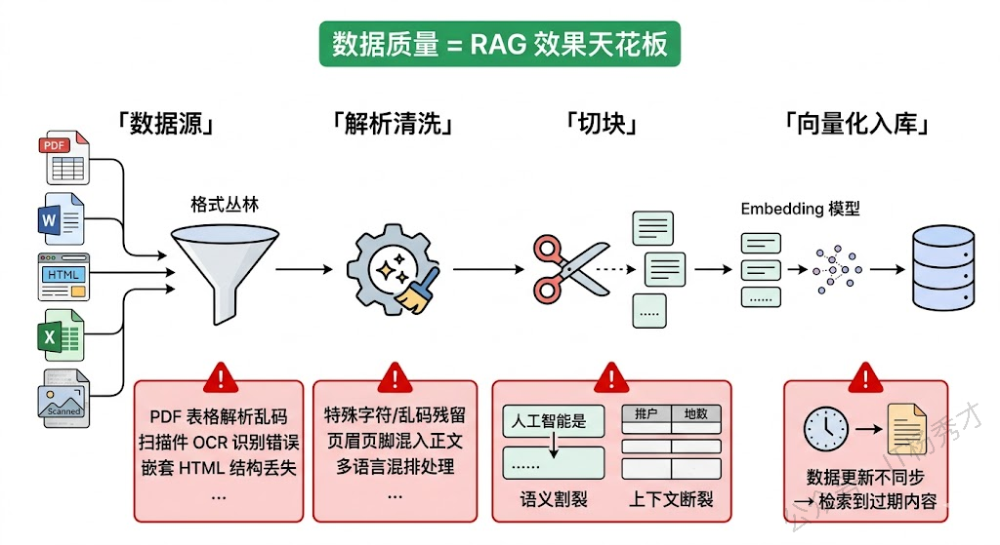
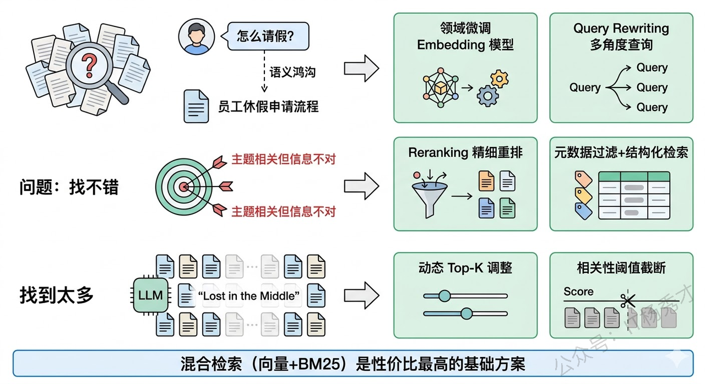
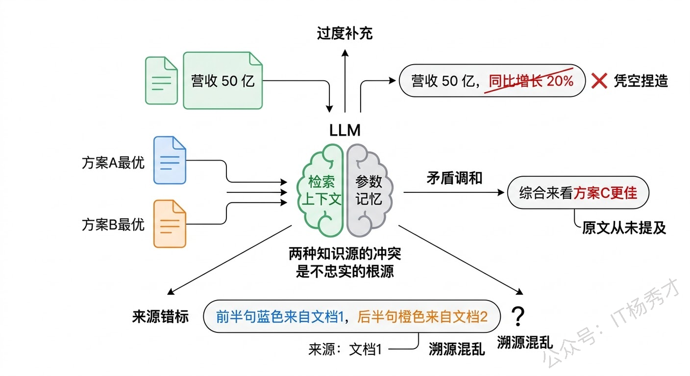
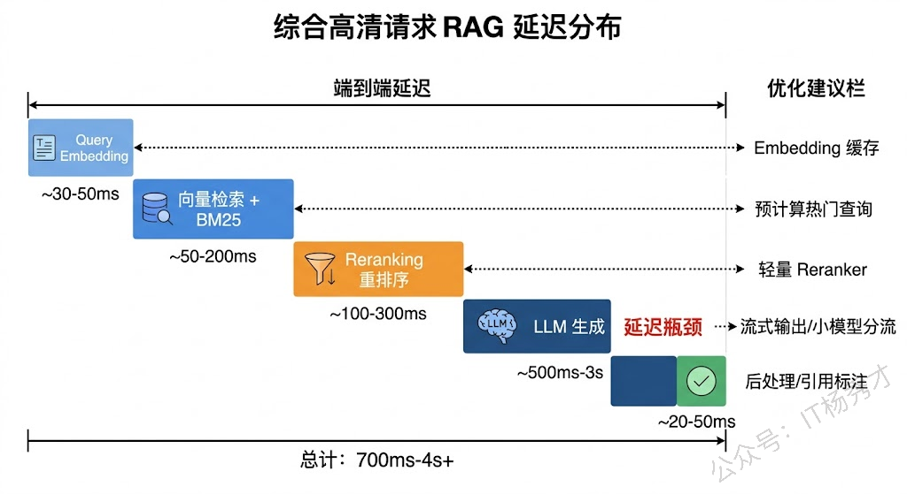
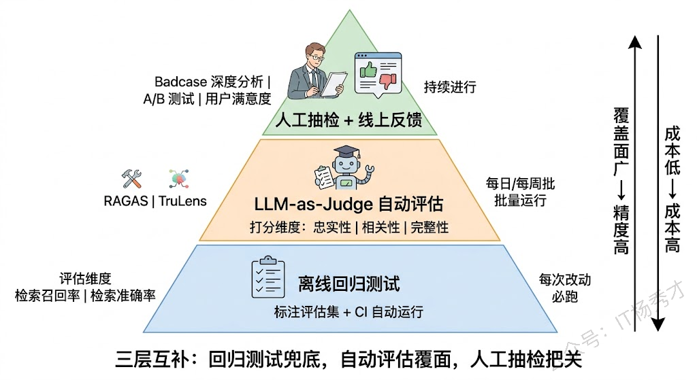
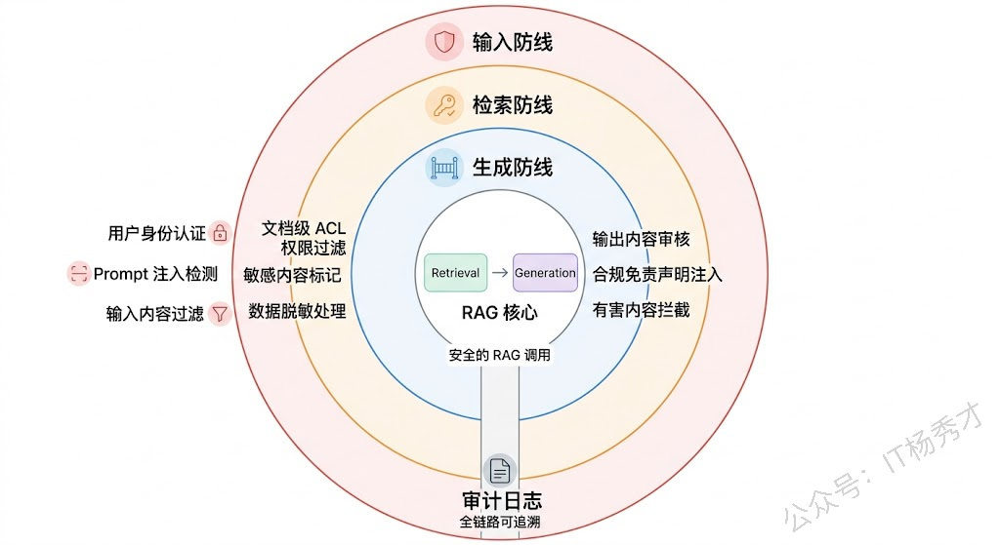

## **1. 问题分析**

几乎每个做大模型应用的团队都搭过 RAG 原型。用 LangChain 跑个 demo，把文档灌进向量数据库，接上 LLM，效果看着还不错，准备上线。然后问题就来了。

RAG 从原型到生产之间有着巨大的鸿沟：demo 阶段暴露不出来的问题，会在真实用户、真实数据、真实规模面前集中爆发。回答这道题，如果只停留在"检索不准、生成幻觉"这种泛泛而谈的层面，很难打动面试官。你得能说出那些真正在生产中折磨过你的具体问题，以及你是怎么一步步解决的。

### **1.1 数据处理**

RAG 的效果上限不是由模型决定的，而是由你灌进去的数据质量决定的。这一点在 demo 阶段很容易被忽略——用几份干净的 PDF 文档做测试当然效果好，但真实业务场景中的数据源远没那么理想。

首先是**格式多样性**。企业级 RAG 要处理的绝不只是纯文本，而是 PDF、Word、PPT、HTML、扫描件、Excel 表格、甚至图片中的文字。每种格式的解析逻辑完全不同，而且解析质量参差不齐。PDF 是重灾区——有些 PDF 是文字版的，解析还好；有些是扫描件，需要 OCR；有些里面有复杂的表格和公式，现有的解析工具一碰就乱。一个表格被解析成一堆散乱的文字，后续的检索和生成质量可想而知。

然后是**切块策略的选择**。文档不可能整篇塞进 LLM 的上下文窗口，必须切成小块（Chunk）存入向量数据库。但怎么切是个工程难题：按固定长度切，可能把一句完整的话从中间劈开，上下文全丢了；按语义段落切，又很难定义什么是一个"语义完整"的段落；对于表格数据，你总不能把表头和表体切成两个不同的 chunk 吧？实际项目中往往需要针对不同类型的文档设计不同的切块策略，还要调整 chunk 大小和重叠比例，这个过程充满了反复试验。

还有一个经常被低估的问题是**数据更新**。企业的知识库不是静态的——文档会修改、会删除、会新增。每次数据变动时，对应的向量怎么同步？如果一份文档更新了，但向量数据库里还存着旧版本的 chunk，检索出来的就是过期信息。建一套可靠的增量更新管道，保证向量库和源数据之间的一致性，这本身就是一个不小的工程挑战。

### **1.2 检索质量**

数据处理好了只是第一步。用户提了一个问题，系统能不能从成千上万的 chunk 里把最相关的那几条找出来，这是 RAG 效果的命脉。检索质量的问题可以用三个词概括：找不到、找不准、找太多。

**找不到**，通常是因为用户的提问方式和文档中的表述方式差异太大。用户问"怎么请假"，文档里写的是"员工休假申请流程"。语义上这两句话是一个意思，但如果 Embedding 模型对这类领域性表述的语义映射能力不够强，检索就会漏掉这条最关键的内容。这在垂直领域尤其严重——医疗、法律、金融等行业有大量专业术语和特殊表达，通用 Embedding 模型对这些领域的语义理解能力往往不足。

**找不准**，是指检索到的内容和问题有点关系但不是用户真正想要的。比如用户问"公司差旅报销的上限是多少"，系统检索到了一段关于差旅报销流程的介绍，里面提到了报销步骤但没有给出金额上限。表面上看，"差旅报销"这个主题是匹配的，但它没有回答用户的具体问题。纯向量相似度检索很容易犯这种"主题相关但信息不对"的错误，因为向量距离衡量的是语义空间里的整体相似度，它不擅长处理这种精确的信息需求匹配。

**找太多**，是指把大量相关度不高的内容塞进了 LLM 的上下文。Top-K 设大了，噪声一多，LLM 可能被无关信息干扰，反而生成了错误的答案。这就是所谓的"Lost in the Middle"现象——LLM 倾向于关注上下文的头部和尾部内容，中间的信息容易被忽略。

应对检索质量的手段已经有很多成熟的实践。**混合检索（Hybrid Search）** 把向量检索和关键词检索（如 BM25）结合起来，前者擅长语义匹配，后者擅长精确匹配，互补短板。**重排序（Reranking）** 在初步检索结果的基础上，用一个更精细的 Cross-Encoder 模型对结果重新打分排序，大幅提升排序精度。**查询改写（Query Rewriting）** 让 LLM 先把用户的原始问题改写成更适合检索的形式，或者生成多个角度的查询去分别检索再合并结果。

### **1.3 生成阶段**

很多人以为 RAG 能解决 LLM 的幻觉问题——毕竟我都把正确答案喂给模型了，它照着说不就行了？现实远没有这么简单。

即使检索到了正确的上下文，LLM 依然可能**不忠实于检索结果**。最常见的情况是模型"过度发挥"——它在检索到的内容基础上，用自己的参数知识做了补充和延伸，而这些补充的内容可能是错的。比如文档里说"公司 2023 年营收 50 亿"，模型可能会"好心"地补一句"同比增长 20%"，而这个增长率完全是编的。更隐蔽的情况是，当检索到的多条 chunk 之间有矛盾时，模型可能会自行"调和"这些矛盾，生成一个看似合理但实际上哪条原文都没说过的结论。

另一个生产环境中的棘手问题是**引用溯源**。用户不仅需要答案，还需要知道答案来自哪里——这在法律、金融、医疗等合规性要求高的场景中几乎是硬性要求。但让 LLM 准确标注"这句话来自哪个文档的哪一段"，比想象中难很多。模型可能标错来源，或者把两段不同来源的内容混在一句话里，让溯源变得不可能。

工程上常见的缓解手段包括：在 Prompt 中明确要求模型"只根据提供的上下文回答，不要使用自己的知识"，并要求逐条引用来源；对生成结果做**事实一致性检查**，用 NLI（Natural Language Inference）模型判断生成的每句话是否能从上下文中推导出来；以及设计"无法回答"机制——当检索到的内容不足以回答问题时，模型应该坦诚说"我没有找到相关信息"而不是编造答案。

### **1.4 规模化带来的工程挑战**

RAG 原型通常处理几百篇文档，而生产环境可能是几十万甚至上百万篇。数据规模放大一到两个数量级，原来不是问题的事情都变成了问题。

**向量数据库的选型和性能调优**是第一道坎。百万级向量的近似最近邻（ANN）检索需要合适的索引结构（HNSW、IVF 等），索引参数如何配置直接影响检索精度和延迟之间的平衡。不同向量数据库（Milvus、Pinecone、Qdrant、Weaviate 等）在不同规模下的表现差异很大，选型需要根据实际数据量和查询模式来做 benchmark，不能拍脑袋。

**延迟问题**也很尖锐。一次完整的 RAG 请求至少包含三步：Query Embedding（几十毫秒）→ 向量检索（几十到几百毫秒）→ LLM 生成（几百毫秒到几秒）。如果还加上 Reranking、多路召回合并等环节，总延迟可能达到几秒甚至更久。对于需要实时响应的场景（比如客服机器人），这个延迟可能不可接受，需要在每个环节做精细的延迟优化——比如预计算热门查询、Embedding 缓存、流式输出等。

**成本控制**同样不容忽视。Embedding 调用、向量存储、LLM 推理调用，每一项在大规模场景下都会产生可观的成本。特别是当 RAG 系统服务大量并发用户时，LLM API 的调用费用可能成为最大的成本项。缓存策略（对相同或相似问题缓存结果）、模型分级（简单问题用小模型）、批量化处理等手段是控制成本的常见做法。

### **1.5 评估与迭代**

RAG 系统上线之后，怎么评估它的效果？怎么知道某次改动是让系统变好了还是变差了？这个问题比想象中棘手，因为 RAG 的评估不是单维度的，而是需要在多个环节独立评估。

**检索环节**需要评估召回率（该找到的找到了没有）和准确率（找到的是不是真相关的）。这要求你有一个标注好的评估数据集——一组问题和对应的"标准答案 chunk"。在冷启动阶段，这个评估集往往需要人工构建，成本不低。

**生成环节**需要评估答案的准确性、完整性和忠实性。这里最大的挑战是"什么算对"——对于事实性问题可以和标准答案比对，但对于开放性问题，不同的合理回答之间很难分出优劣。目前主流的做法是用 LLM-as-Judge（拿另一个 LLM 当评审打分），配合人工抽检来做质量评估。RAGAS 和 TruLens 等评估框架把这个流程标准化了不少，但评估结果的可靠性仍然取决于评估 Prompt 和评判标准的设计质量。

**端到端评估**还需要关注用户体验层面的指标：响应时间、用户满意度、问题解决率等。这些指标没法在离线环境中完全评估，必须结合线上 A/B 测试和用户反馈来持续迭代。

实际项目中，一个健康的评估体系通常是三层结合：离线评估集做回归测试，防止改动导致效果劣化；LLM-as-Judge 做大规模自动化评估，覆盖各种边界情况；人工抽检做最终的质量把关和 badcase 分析。这三层缺一不可。

### **1.6 安全与合规**

在企业级部署中，安全和合规不是可选项，而是硬约束。RAG 系统引入了几个特殊的安全关切。

**数据泄露风险**——如果知识库中包含不同权限级别的文档（比如高管薪资信息和普通员工手册混在一起），而检索时没有做权限过滤，普通员工就可能通过 RAG 系统间接获取到不该看到的信息。这要求 RAG 系统具备文档级甚至 chunk 级的权限控制能力。

**Prompt 注入攻击**——恶意用户可能通过精心构造的提问，诱导 LLM 忽略系统 Prompt 的约束、泄露知识库内容，甚至执行非预期操作。更隐蔽的是，攻击者还可能在文档中埋入恶意指令（间接注入），当这些文档被检索到后，LLM 在处理上下文时可能执行其中的恶意指令。

**合规性要求**——在金融、医疗等受监管行业，RAG 系统的输出可能涉及投资建议、医疗建议等敏感内容，需要添加合规免责声明，需要审计每一次问答的完整链路，需要确保模型不会给出可能造成伤害的回答。

***

## **2. 参考回答**

RAG 系统从 demo 到生产有一道很宽的鸿沟，我在实际项目中感受最深的挑战有五个方面。

首先是数据处理层面，这是整个系统效果的天花板。企业场景中的数据源格式非常多样，PDF、扫描件、表格的解析质量参差不齐，尤其是复杂 PDF 的表格解析经常出问题。切块策略也需要反复调优，固定长度切割容易破坏语义完整性，还要考虑数据更新时向量库和源数据的同步一致性问题。

其次是检索质量，这是 RAG 的命脉。常见的问题可以归纳为找不到、找不准、找太多三类。用户表述和文档表述之间的语义鸿沟导致召回不全，纯向量检索容易出现"主题相关但信息不对"的情况，Top-K 过大又会引入噪声。工程上一般用混合检索解决召回问题，用 Reranking 解决排序问题，用 Query Rewriting 桥接表述差异。

第三个挑战是生成忠实性。即使检索到了正确信息，LLM 仍然可能用参数知识"过度补充"、调和矛盾的多条检索结果生成原文没有的结论、或者错标引用来源。我们在项目中的做法是在 Prompt 里显式约束"仅基于上下文回答"，并用 NLI 模型做事实一致性校验。

第四是规模化后的工程问题。百万级文档场景下，向量数据库的索引配置、ANN 检索的精度延迟平衡、端到端延迟优化、以及 LLM 调用成本控制，每一项都需要精细的工程投入。我们主要通过 Embedding 缓存、热门查询预计算、模型分级路由来控制成本和延迟。

最后是评估体系的建设。RAG 不像传统软件可以写单元测试验证正确性，需要建一套三层评估体系——离线回归测试防劣化、LLM-as-Judge 做自动化大规模评估、人工抽检做 badcase 深度分析，三层互补才能持续保障效果。安全合规方面，权限控制和 Prompt 注入防护也是企业级部署的硬要求。

## **学习交流**

> 如果您觉得文章有帮助，可以关注下秀才的<strong style="color: red;">公众号：IT杨秀才</strong>，后续更多优质的文章都会在公众号第一时间发布，不一定会及时同步到网站。点个关注👇，优质内容不错过

