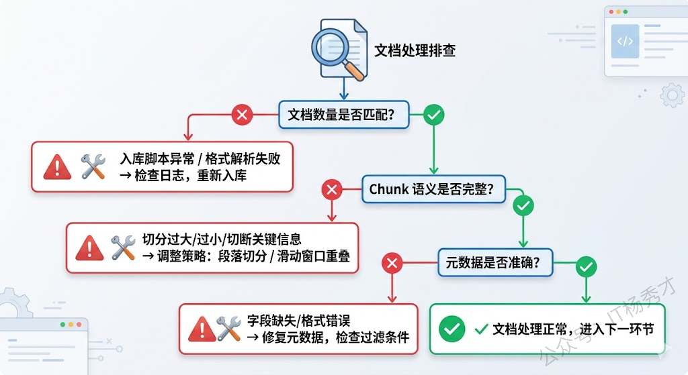
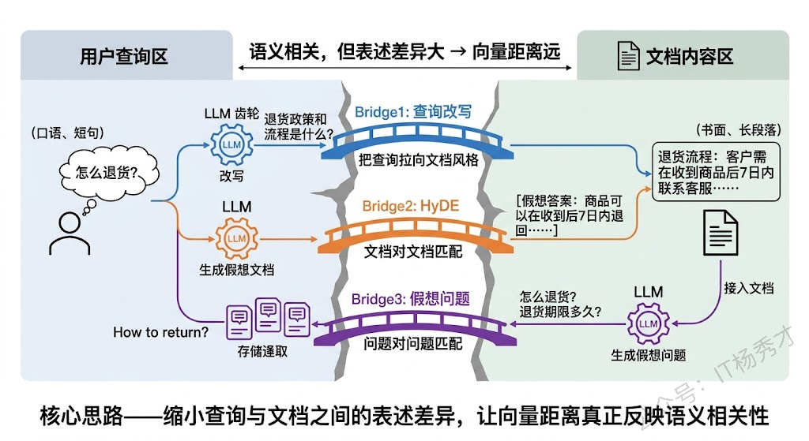
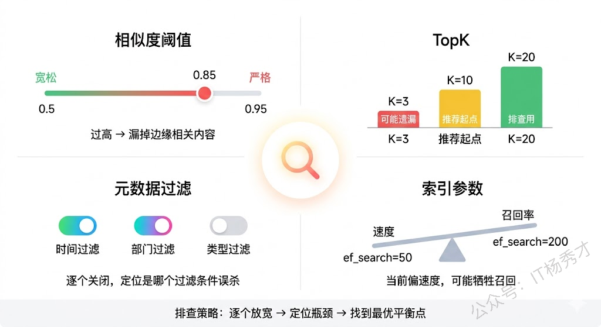
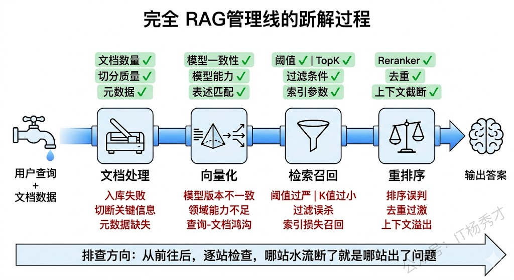
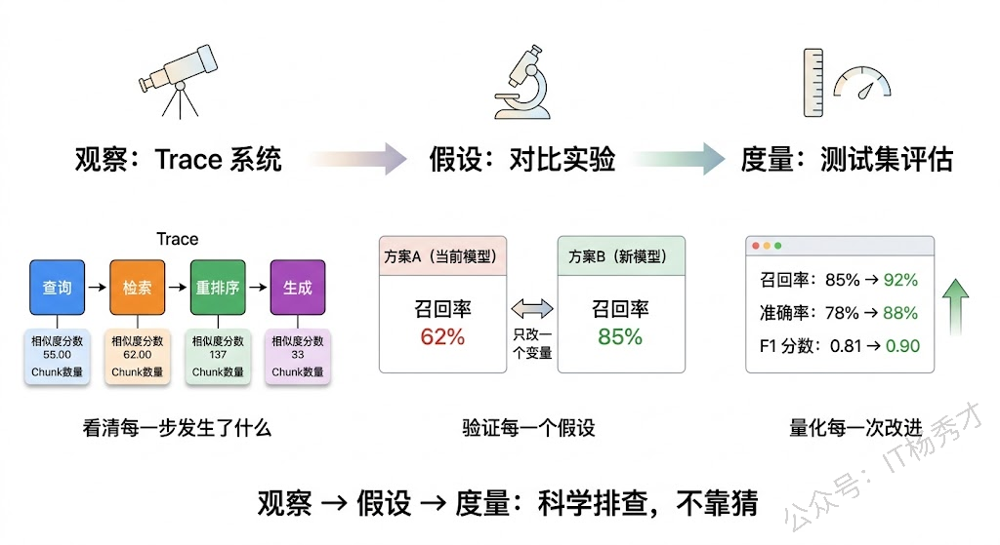

## **1. 题目分析**

做过 RAG 系统的人都知道，上线之后最头疼的不是模型幻觉，而是检索不到想要的东西。"我明明上传了这个文档，为什么问不出来"。检索不到，意味着后面的生成环节再强也是徒劳。而这个问题之所以难排查，是因为 RAG 的检索链路是一条多环节串联的管道——文档处理、向量化、检索召回、结果过滤，任何一个环节出了问题，最终表现都是一样的：用户问了，系统答不上来。

所以排查的核心思路是**沿着数据流方向，从前往后逐层定位**。像查水管漏水一样，从水源开始一段一段检查，哪段没水就是哪段出了问题。

### **1.1 先看源头：文档到底进来了没有**

很多时候根因出奇地简单——文档压根没有正确入库。入库脚本跑挂了、某些 PDF 解析失败静默跳过了、或者入库过程中途异常退出只进了一半，这些情况在生产环境中比想象的常见得多。

排查方法很直接：去向量数据库里查文档总数，和预期对比。如果数量不对，翻入库日志找报错。

数量对了也不能放心，还要看**切分（Chunking）质量**。切分策略直接决定了每个 Chunk 的语义完整性——切得太大，一个 Chunk 里混了好几个主题，语义不聚焦；切得太小，上下文丢失，单个 Chunk 读起来都不知道在说什么。最坑的是把关键信息切断了，比如一个完整的表格被劈成两半，用户问相关问题时两个 Chunk 单独看都不完整，自然匹配不上。实际操作中随机抽几个 Chunk 看看内容是否连贯，基本就能判断切分策略有没有问题。

还有一个容易踩的坑是**元数据（Metadata）错误**。如果系统在检索时加了元数据过滤（比如按时间、按部门筛选），而文档的元数据字段缺失或格式不对，本该被检索到的内容就会被静默过滤掉。用户问"2024年的销售数据"，但文档的时间戳字段是空的——这种 bug 不看元数据根本发现不了。

### **1.2 再看向量化：语义表示对不对**

文档入库没问题，下一步看向量化环节。这个环节的核心问题是：文档和查询是否被正确地映射到了同一个语义空间。

最低级但最常见的错误是**模型不一致**。文档入库时用的 text-embedding-ada-002，后来升级换成了 bge-large-zh，但存量文档没有重新向量化——新查询和老文档在两个完全不同的向量空间里，相似度计算毫无意义。这种问题在系统迁移或模型升级时特别容易出现，排查时第一件事就是确认入库和查询用的是同一个模型、同一个版本。

模型一致了，还要看**模型能力是否匹配场景**。通用 Embedding 模型在专业领域（医疗、法律、金融）的表现往往不够好，因为这些领域有大量专业术语和特定的语义关系，通用模型没见过或者理解不准确。中文场景用英文为主的模型也会打折扣。解决方案是换更适合的模型（中文场景 bge、m3e 系列表现不错），或者用领域数据对 Embedding 模型做 fine-tune。

还有一种更隐蔽的问题：**查询和文档的表述方式差异太大**。用户问"怎么退货"，文档里写的是"退货流程：客户需在收到商品后7日内联系客服……"。语义是相关的，但一个是口语化的短问句，一个是正式的书面长段落，向量距离可能比预期大得多。

应对这个问题有几个经典策略。**查询改写（Query Rewriting）**，用 LLM 把口语化查询改写成更接近文档风格的表述再去检索。**HyDE（Hypothetical Document Embeddings）**，让 LLM 先根据查询生成一段假想的答案文档，用这段假想文档的向量去检索——"文档对文档"的匹配通常比"问题对文档"更准确。或者反过来，在入库时对每个 Chunk 生成**假想问题**，检索时用"问题对问题"的方式匹配。

### **1.3 三看检索召回：找到了但排不上来**

向量化没问题，但结果还是不理想，问题往往出在检索参数配置上。这一层的排查思路是**逐个放宽限制，看哪个参数卡住了召回**。

**相似度阈值**是第一个嫌疑人。很多系统会设一个阈值，只返回相似度高于阈值的结果。阈值设得太高（比如 0.85），一些相关但不是完全匹配的内容就被过滤掉了。排查时把阈值临时调低到 0.5 或 0.6，看是否能检索到——如果能，说明阈值过严。

**TopK** 是第二个。TopK 设为 3，但相关内容排在第 5 位，用户就看不到。把 TopK 调到 20，看相关内容是否出现在后面的位置。如果出现了，问题不是"检索不到"而是"排序不够靠前"，这时候需要优化的是排序策略而不是检索本身。

**元数据过滤条件**也要检查。临时去掉所有过滤条件做一次纯向量检索，如果能找到内容，说明是过滤条件把它排除掉了。

最后是**索引参数**。向量数据库的近似最近邻索引（HNSW、IVF 等）为了加速检索会牺牲一定的召回率。如果 HNSW 的 ef\_search 或 IVF 的 nprobe 设置过小，可能漏掉相关内容。对比精确检索（暴力遍历）和索引检索的结果，就能判断是不是索引参数的问题。

### **1.4 最后看重排序和后处理**

前面都没问题，还有一个容易被忽略的环节——**Rerank 和结果后处理**。

很多 RAG 系统在向量检索之后会用 Reranker 模型对结果重新排序。如果 Reranker 判断失误，可能把真正相关的内容降到很后面。排查方法是对比重排序前后的结果列表，看相关内容的排名变化是否合理。

**去重逻辑过于激进**也是一个常见坑。多个 Chunk 来自同一文档的不同段落，去重逻辑可能只保留了第一个，把其他相关 Chunk 都丢掉了。

还有一个容易被忽视的点：**送入 LLM 的上下文被截断**。检索到了 10 个相关 Chunk，但因为上下文窗口限制只送了前 3 个进去，真正回答问题的内容在第 7 个 Chunk 里——用户觉得"检索不到"，其实是检索到了但 LLM 没看到。

### **1.5 排查的工具和方法论**

有了排查思路，还需要趁手的工具。

Trace 系统是最基础的保障。每次检索都应该记录完整链路：原始查询、改写后的查询、检索到的 TopK 结果（含相似度分数和 Chunk 内容）、重排序后的结果、最终送入 LLM 的上下文。LangSmith、LangFuse 都能做到这一点。有了 Trace，排查时不用猜，直接看数据就知道问题出在哪一步。

同时最好还要有对比实验。怀疑 Embedding 模型不行？换一个跑同样的查询对比。怀疑切分策略有问题？用不同策略重新入库对比效果。每次只改一个变量，就能精确定位问题。

最后当然可能还需要人工标注测试集。准备一批典型查询，标注每个查询应该检索到哪些文档，用这个测试集跑召回率和准确率。这样优化前后的效果对比就有了客观依据，而不是凭感觉说"好像好了一点"。

***

## **2. 参考回答**

RAG 检索不到时，我的排查思路是沿着数据流方向从前往后逐层定位。首先看文档处理环节，确认文档是否正确入库、Chunk 切分是否合理、元数据是否完整，这一层的问题最致命也最容易被忽视。然后看向量化环节，重点检查入库和查询用的 Embedding 模型是否一致，模型能力是否匹配场景，以及查询和文档的表述差异是否过大——如果是表述差异问题，可以用查询改写、HyDE 或假想问题生成来缓解。接着看检索召回环节，逐个放宽相似度阈值、TopK、元数据过滤条件和索引参数，定位是哪个参数卡住了召回。最后看重排序和后处理，对比 Rerank 前后的结果看是否有误判，检查去重逻辑和上下文截断问题。工具层面，我会依赖 Trace 系统记录每次检索的全链路数据，用对比实验验证假设，用人工标注的测试集量化评估效果。整体原则就是每层都有明确的检查点和验证方法，靠数据定位而不是靠猜。

## **学习交流**

> 如果您觉得文章有帮助，可以关注下秀才的<strong style="color: red;">公众号：IT杨秀才</strong>，后续更多优质的文章都会在公众号第一时间发布，不一定会及时同步到网站。点个关注👇，优质内容不错过

