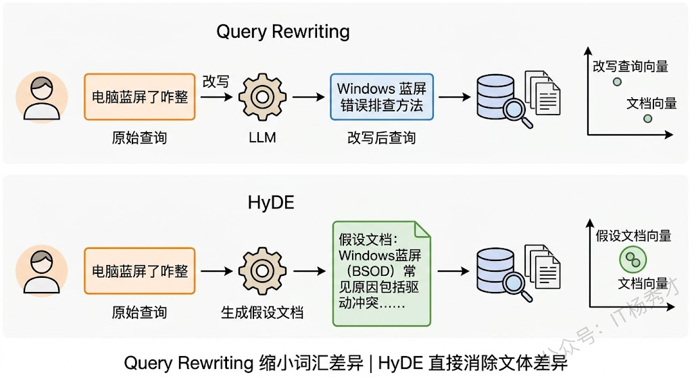
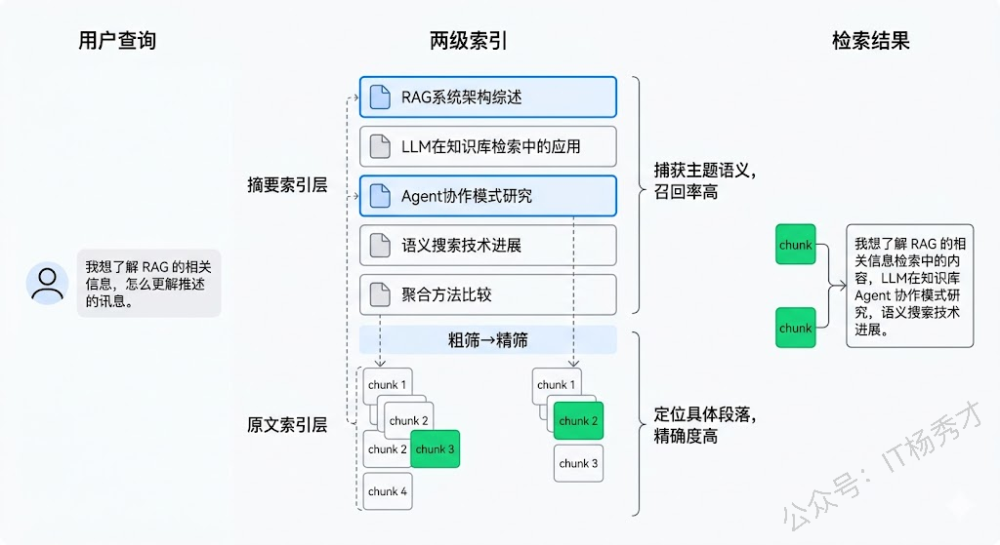
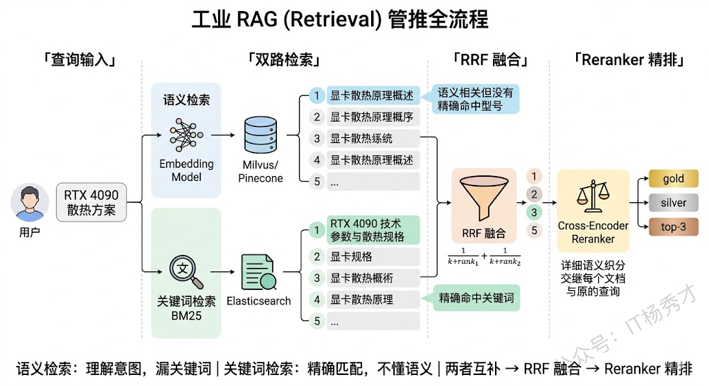
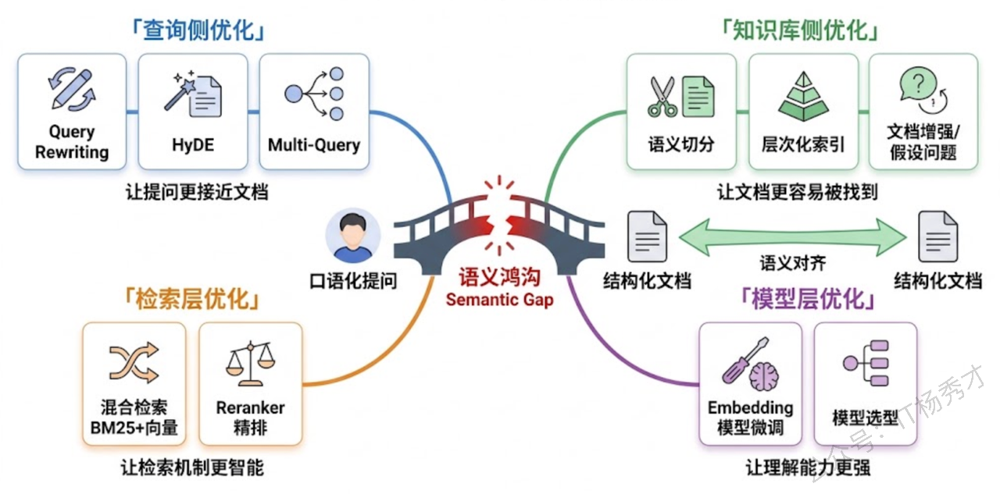
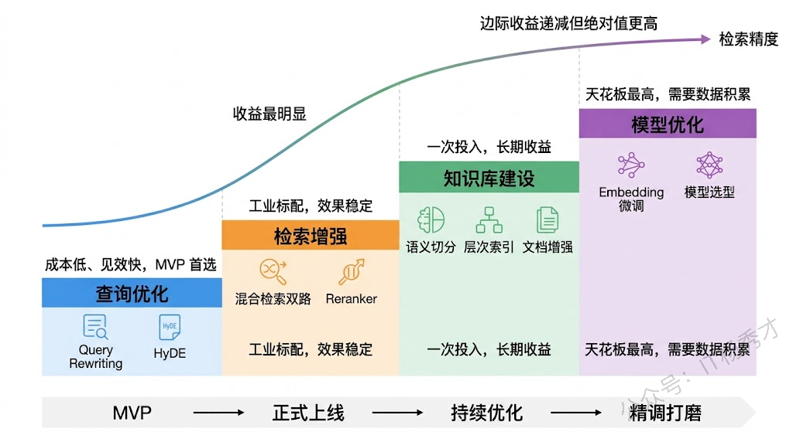

## **1. 题目分析**

用过 RAG 的人大概都有这种经历：明明知识库里存着答案，用户一问，检索回来的全是不相干的东西。比如用户问"怎么退货"，知识库里的文档标题写的是"商品售后服务流程"——两者说的是一回事，但 Embedding 向量之间的余弦相似度可能低得离谱。这就是 RAG 系统中最普遍也最棘手的问题：**语义鸿沟**。

语义鸿沟之所以难搞，根源在于用户的提问方式和知识库的文档表述之间天然存在"语言风格差"。用户提问是口语化的、模糊的、带有隐含意图的，而知识库文档往往是书面化的、结构化的、术语密集的。Embedding 模型虽然号称"语义理解"，但它本质上还是在做向量空间中的距离计算——当两段文字的表面形式差异太大时，即使语义相同，向量距离也可能超出合理的召回阈值。

理解清楚这个问题的本质之后，解决思路其实可以从一个很直觉的框架来组织：**既然用户说的话和知识库里的话"对不上"，那要么改用户这边，要么改知识库那边，要么在中间加一个翻译层**。沿着这三个方向展开，就能覆盖目前业界几乎所有主流的解决方案。

### **1.1 查询优化**

最直接的思路是：用户的原始提问不适合直接拿去做向量检索，那就先把它变成更适合检索的形式。这个方向下有几种经典技术。

**Query Rewriting（查询改写）** 是最基础也最实用的一招。在用户提问进入检索流程之前，先让 LLM 对查询做一次改写——补全省略的信息、消除歧义、把口语化表达转成更接近知识库文档风格的书面表达。比如用户问"苹果太贵了怎么办"，LLM 可以改写成"iPhone 产品价格过高时有哪些优惠方案或替代选择"，既消除了"苹果"的歧义，又把口语变成了更精准的检索语句。工程上通常就是在检索前插入一个 LLM 调用，prompt 类似于"请将以下用户问题改写为更适合在知识库中检索的查询语句"。成本不高，但效果立竿见影。

**HyDE（Hypothetical Document Embeddings）** 则更进一步，思路非常巧妙：既然用户的提问和文档之间有语义鸿沟，那就**让 LLM 先"假装"回答用户的问题，生成一段假设性的文档，然后用这段假设文档的向量去检索**。为什么这样有效？因为 LLM 生成的"假设答案"在语言风格上天然接近知识库中的文档——都是陈述性的、结构化的书面语。这样一来，用来检索的向量就从"口语化提问的向量"变成了"类文档风格文本的向量"，和知识库文档在向量空间中的距离大幅缩短。

举个具体例子：用户问"电脑蓝屏了咋整"，LLM 生成的假设文档可能是"Windows 操作系统出现蓝屏错误（BSOD）的常见原因包括驱动程序冲突、内存故障和系统文件损坏，排查步骤如下……"。这段文本和知识库里真正的蓝屏排查文档在向量空间中会非常接近。

**Multi-Query（多查询扩展）** 走的是另一条路：不是把一个查询改写成一个更好的查询，而是把一个查询拆分或扩展成多个不同角度的子查询，分别去检索，最后把结果合并去重。这样即使某一个角度的查询没命中，其他角度可能会命中。比如用户问"新能源汽车的优缺点"，可以扩展成"电动汽车的优势有哪些"、"新能源车有什么缺点和不足"、"燃油车和电动车对比"三个子查询。LangChain 的 `MultiQueryRetriever` 就是这个思路的现成实现。

这三种查询侧技术可以单独使用，也可以组合——比如先做 Query Rewriting 消除歧义，再做 Multi-Query 扩展覆盖面。在实际项目中，Query Rewriting 几乎是标配，HyDE 在文档风格差异大的场景效果特别好，Multi-Query 则在用户问题比较宽泛时更有价值。

### **1.2 知识库优化**

查询侧的优化是"运行时"的，每次用户提问都要做。而知识库侧的优化则是"离线"的，在文档入库阶段一次性完成，运行时零成本。

**文档切分策略**是最容易被低估的环节。很多人随手按固定字数切分文档（比如每 512 个 token 一个 chunk），结果一个完整的知识点被切成了两半——前半段在 chunk A，后半段在 chunk B，两个 chunk 单独看都回答不了用户的问题。好的切分应该按语义边界来：按段落、按章节、按小标题来切，确保每个 chunk 都是一个语义自洽的单元。此外 chunk 之间设置适当的 overlap（重叠）也很有帮助，能缓解边界处信息被截断的问题。

更高级的做法是**层次化索引（Hierarchical Indexing）**。每个文档先生成一段摘要，摘要和原文分别建立索引。检索时先在摘要层做粗筛，锁定相关文档，再在原文层做精筛，找到具体的段落。这种两级检索在长文档场景中效果非常好——摘要能捕获文档的整体主题，原文能提供具体细节。

还有一招叫**文档增强（Document Enrichment）**：在文档入库时，用 LLM 为每个 chunk 生成若干"假设问题"——也就是"用户可能会用什么方式来问这个 chunk 里的知识"。然后把这些假设问题和原始 chunk 一起存入向量库。这其实是 HyDE 的反向操作：HyDE 是用查询生成假设文档，Document Enrichment 是用文档生成假设查询。两者的共同目标都是缩小查询和文档之间的语言风格差异。

### **1.3 检索优化**

前两个方向分别优化了查询和文档，第三个方向则是优化检索本身的机制。

**混合检索（Hybrid Search）** 是目前工程实践中最普遍的方案。核心思路是：不要只依赖向量语义检索，同时引入传统的关键词检索（BM25），两路结果融合后再排序。为什么这样做有效？因为向量检索和关键词检索的优劣势恰好互补——向量检索擅长语义理解但对精确关键词不敏感（比如产品型号"RTX 4090"），关键词检索对精确匹配很强但不理解语义（"退货"搜不到"售后流程"）。两者结合，能覆盖更多场景。

融合两路结果的常用方法是 **RRF（Reciprocal Rank Fusion）**，原理很简单：把每个文档在两路检索中的排名取倒数相加，作为最终得分。这种方法不需要调参，鲁棒性好，在多数场景下效果都不错。

**Reranker（重排序模型）** 是另一个杀手锏。Embedding 模型在做向量检索时用的是"双塔"架构——查询和文档分别编码成向量，再算相似度。这种架构效率高但精度有限，因为查询和文档之间没有交互。而 Reranker 通常是一个 Cross-Encoder，它把查询和文档拼在一起输入模型，让两者在每一层 Transformer 中充分交互，输出一个精细的相关性分数。精度远高于双塔模型，但计算成本也高得多，所以只能用在召回后的少量候选文档上做精排——这就是"先粗筛再精排"的工业级标准流程。

常用的 Reranker 包括 Cohere Rerank、bge-reranker 系列，以及直接用 LLM 做 reranking（把候选文档和查询一起扔给 GPT-4/Claude，让它打分排序）。

### **1.4 Embedding 模型优化**

前面三个方向都是在不换 Embedding 模型的前提下做优化。但如果语义鸿沟的根源是 Embedding 模型本身对你的领域理解不够好，那再怎么优化查询和检索管线，效果都有天花板。

**领域微调（Fine-tuning）** 是最直接的方案。拿你业务场景下的真实查询-文档对作为训练数据，对 Embedding 模型做微调，让它学会在你特定领域内什么查询和什么文档是语义匹配的。这就像教一个通用翻译官学会你公司的内部术语和行话一样。微调后的模型在领域内的检索精度通常会有显著提升。

但微调需要标注数据，成本不低。一个更轻量的替代方案是**选择更好的通用 Embedding 模型**。这两年 Embedding 模型迭代很快，从最早的 OpenAI `text-embedding-ada-002` 到后来的 `text-embedding-3-large`、BGE 系列、Jina Embeddings 等，中文场景下 BGE 和 M3E 的效果都不错。选对模型有时候比优化检索管线更重要。

### **1.5 工程组合拳**

实际项目里没人只用一招。一个成熟的 RAG 系统解决语义鸿沟的方案通常是多层防线的组合：

第一层，**查询阶段**：先做 Query Rewriting 消歧义和补全信息，视场景加入 HyDE 或 Multi-Query。第二层，**检索阶段**：用混合检索（向量 + BM25），融合后走 Reranker 精排。第三层，**知识库建设**：文档按语义切分，建立层次化索引，高频场景做文档增强。第四层，**持续优化**：基于线上 bad case 分析，对 Embedding 模型做领域微调，定期更新知识库。

这四层防线是递进关系——第一层成本最低、见效最快，适合 MVP 阶段快速上线；后面的层次投入更大，但效果天花板也更高，适合产品成熟后持续打磨。

还有一个容易忽略但非常重要的环节：**构建评估体系**。你得知道你的优化到底有没有效。标准做法是积累一批"查询-期望文档"的标注测试集，用 Recall@K、MRR（Mean Reciprocal Rank）等指标来量化检索效果，每次迭代都跑一遍回归测试。没有度量就没有改进——这话在 RAG 优化里尤其成立。

***

## **2. 参考回答**

RAG 的语义鸿沟问题本质上是用户的口语化提问和知识库的书面化文档在向量空间中距离过大，解决思路可以从四个方向来讲。

首先是查询侧优化，最基础的是 Query Rewriting，让 LLM 在检索前把用户的模糊提问改写成更精准的检索语句，消除歧义、补全信息；更进一步是 HyDE，让 LLM 先生成一段假设性的回答文档，用这段文档的向量去检索，因为生成的文本在风格上天然接近知识库文档，所以能大幅缩小向量距离；还有 Multi-Query，把一个问题扩展成多个角度的子查询分别检索再合并结果。

其次是知识库侧，关键是按语义边界做文档切分而不是机械地按字数切，可以建层次化索引做先粗后精的两级检索，还可以给每个 chunk 预生成假设问题来弥合文体差异。

第三是检索层的优化，工程上最普遍的做法是混合检索——向量检索和 BM25 关键词检索双路并行、RRF 融合，然后用 Cross-Encoder Reranker 做精排，因为向量检索和关键词检索的优劣势恰好互补。

最后是 Embedding 模型本身，如果通用模型对你的领域术语理解不够好，可以拿业务场景的查询-文档对做微调。在实际项目中这些方案通常是组合使用的，我们的经验是按投入产出比递进来做：先上 Query Rewriting 加混合检索快速见效，再逐步建设层次化索引和 Reranker 精排，最后根据线上 bad case 做 Embedding 微调持续打磨。

## **学习交流**

> 如果您觉得文章有帮助，可以关注下秀才的<strong style="color: red;">公众号：IT杨秀才</strong>，后续更多优质的文章都会在公众号第一时间发布，不一定会及时同步到网站。点个关注👇，优质内容不错过

