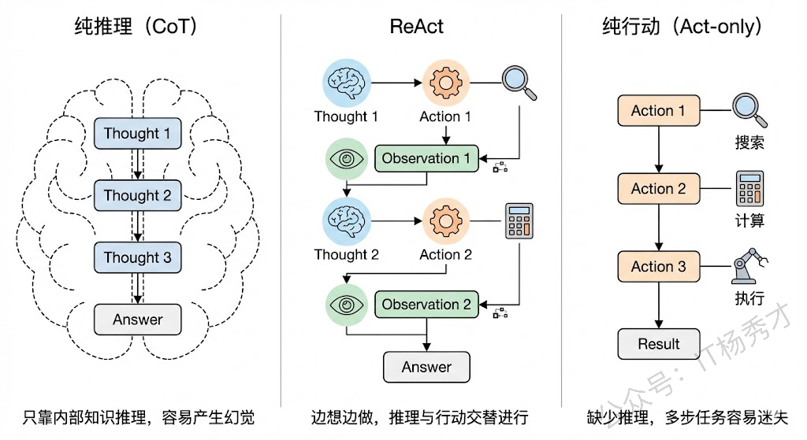
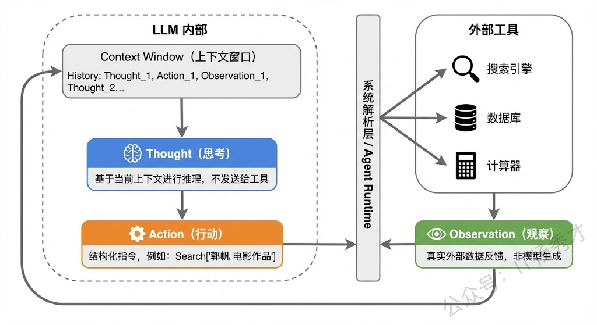

## **1. 题目分析**

这道题考察的是对大模型 Agent 核心推理范式的理解。ReAct 是目前几乎所有主流 Agent 框架（如 LangChain、LlamaIndex）的底层推理模式，可以说理解了 ReAct，就理解了 Agent 是怎么"思考并行动"的。面试官问这道题，本质上是想看你对 Agent 的工作原理有没有真正吃透，而不是停留在"会调 API"的层面。

### **1.1 ReAct 的由来和核心思想**

要理解 ReAct，我们先要知道它解决了什么问题。在 ReAct 之前，大模型在处理复杂任务时主要有两条路线：一条是以 Chain-of-Thought（CoT，思维链）为代表的**纯推理路线**，另一条是以 WebGPT、SayCan 等为代表的**纯行动路线**。

纯推理路线的问题在于，模型只能依赖自身内部的参数知识来一步步推导，一旦遇到需要实时信息、精确计算或者外部数据的场景，它就容易"幻觉"——也就是一本正经地胡说八道。比如你问它"今天北京天气怎么样"，它没有联网能力，只能瞎编一个答案。

纯行动路线的问题则相反，模型直接映射到动作空间去执行操作，但缺少中间的推理过程，导致它不知道"为什么要做这个动作"、"做完之后下一步该怎么办"，面对复杂的多步任务时就很容易迷失方向。

ReAct 的核心思想其实非常朴素：**让大模型像人一样，边想边做**。人在解决复杂问题的时候，不会先把所有事情想清楚再动手，也不会不过脑子就蛮干，而是想一步、做一步、看一步，根据每一步的反馈来调整下一步的计划。ReAct 就是把这种"交替进行推理和行动"的过程形式化了。



### **1.2 ReAct 的工作流程**

ReAct 框架的名字本身就说明了一切：**Re**asoning + **Act**ing，推理加行动。它的工作流程可以用一个循环来概括：**Thought → Action → Observation → Thought → Action → Observation → ... → Finish**。

我们用一个具体例子来说明。假设用户问："《流浪地球》的导演还执导过哪些电影？这些电影中评分最高的是哪一部？"

这个问题对人来说不难，但需要分步骤完成。ReAct 的处理过程大致是这样的：

**第一轮：**

* **Thought（思考）**：我需要先查一下《流浪地球》的导演是谁。

* **Action（行动）**：调用搜索工具，搜索"流浪地球 导演"。

* **Observation（观察）**：搜索结果返回——导演是郭帆。

**第二轮：**

* **Thought（思考）**：好的，导演是郭帆。接下来我需要查一下郭帆还导演过哪些电影。

* **Action（行动）**：调用搜索工具，搜索"郭帆 导演 电影作品"。

* **Observation（观察）**：搜索结果返回——郭帆导演的电影有《流浪地球》《流浪地球2》《同桌的你》《李献计历险记》等。

**第三轮：**

* **Thought（思考）**：现在我知道了他的作品列表，接下来需要比较这些电影的评分，找出最高的。

* **Action（行动）**：调用搜索工具，搜索这些电影的评分信息。

* **Observation（观察）**：返回评分数据。

**第四轮：**

* **Thought（思考）**：根据评分数据，《流浪地球2》评分最高。我现在可以给出最终答案了。

* **Action（行动）**：Finish，输出最终答案。

可以看到，整个过程中，模型的每一次行动都有明确的推理依据，每次获得新信息后都会重新思考下一步该怎么走。这就是 ReAct 的精髓——**推理指导行动，行动反馈推理，二者交替螺旋式推进，直到任务完成**。


### **1.3 Thought、Action、Observation 各自的角色**

在 ReAct 的三元组中，每个部分承担着不同的职责：

**Thought** 是模型的"内心独白"，它不会被发送给外部工具，而是留在推理链中供模型自己参考。Thought 的作用非常关键，它负责分解任务、分析当前进度、决定下一步策略。可以说 Thought 就是 CoT 思维链在 ReAct 中的体现，它让模型的决策过程变得可解释、可追溯。

**Action** 是模型与外部世界交互的桥梁。Action 通常是对某个外部工具的调用，比如搜索引擎、计算器、数据库查询、API 调用等。Action 的关键在于它是结构化的，通常包含工具名��和调用参数，这样系统才能解析并执行。

**Observation** 是外部环境给模型的反馈，也就是 Action 执行后返回的结果。Observation 不是模型生成的，而是真实的外部数据，这就保证了模型的推理过程是"接地气"的，基于真实信息而非臆想。

这三者的协同关系，本质上构成了一个**闭环反馈系统**：Thought 基于当前上下文做出判断，Action 将判断转化为具体操作，Observation 将操作结果反馈回来更新上下文，然后新一轮的 Thought 再基于更新后的上下文继续推理。



### **1.4 ReAct 与 Prompt 工程的关系**

在实际实现中，ReAct 的核心机制是通过精心设计的 Prompt 来驱动的。一个典型的 ReAct Prompt 模板大致包含以下几个部分：

```python
你是一个智能助手，可以使用以下工具来回答问题：
1. Search[query] - 搜索相关信息
2. Lookup[term] - 在文档中查找特定内容
3. Finish[answer] - 给出最终答案

请按照以下格式交替进行思考和行动：
Thought: 你的思考过程
Action: 工具名[参数]
Observation: 工具返回的结果
...（重复以上过程）
Thought: 我现在可以给出答案了
Action: Finish[最终答案]
```

通过这种 Prompt 模板，我们实际上是在用 few-shot 或 instruction 的方式"教会"大模型按照 Thought-Action-Observation 的固定格式来输出。模型生成到 Action 时，系统会截断模型输出、解析 Action 内容、调用相应工具、获取结果，然后将 Observation 拼接回上下文，再让模型继续生成下一轮的 Thought。

这也是为什么说 ReAct 是一个**框架**而非一个模型——它是一种组织大模型推理和行动的协议和流程，可以套用在任何足够强的大模型上。

### **1.5 ReAct 的优势和局限**

ReAct 的优势主要体现在三个方面：

1. 第一，**可解释性强**，因为每一步行动之前都有明确的推理过程，出了问题可以回溯到具体是哪一步的思考出了偏差；

2. 第二，**减少幻觉**，通过调用外部工具获取真实数据，而不是让模型凭空编造，大大提高了事实准确性；

3. 第三，**泛化能力好**，同一套 ReAct 框架可以对接不同的工具集，适用于问答、数据分析、代码生成等多种场景。

但 ReAct 也有明显的局限性。首先是**效率问题**，每一轮 Thought-Action-Observation 都需要一次 LLM 调用加一次工具调用，对于简单任务来说开销过大；其次是**错误累积**，如果中间某一步的推理或工具调用出错，后续步骤可能会在错误的基础上越走越偏；最后是**对模型能力的依赖**，ReAct 需要模型有较强的指令遵循能力和格式控制能力，弱模型很容易输出不符合格式要求的内容导致解析失败。

### **1.6 ReAct 在现代 Agent 框架中的演进**

在理解了 ReAct 的基本原理之后，还需要知道它在实际工程中的演进。现在主流的 Agent 框架基本都是在 ReAct 的基础上做了增强和扩展。

比如 LangChain 中的 AgentExecutor 就是 ReAct 的典型实现，它的 Agent 循环本质就是不断地让 LLM 生成 Thought 和 Action，然后执行工具获取 Observation，直到 LLM 输出 Final Answer。再比如更新的框架像 LangGraph，它把 ReAct 的线性循环扩展成了**图结构**，允许更复杂的分支和条件跳转，但底层的 Thought-Action-Observation 三元组逻辑依然没变。

另外还有一些变体和增强方案值得关注，比如 **Reflexion** 在 ReAct 的基础上加入了自我反思机制，当任务失败时模型会回顾整个推理过程并总结经验教训，下次再遇到类似问题时可以避免犯同样的错误。**Plan-and-Execute** 则是先做全局规划再分步执行，适合更长链路的复杂任务。


## **2. 参考回答**

ReAct 的全称是 Reasoning and Acting，它是一种大模型推理框架，核心思想是让模型交替进行推理和行动来完成复杂任务。

在 ReAct 之前，大模型处理复杂问题主要有两条路：一条是 Chain-of-Thought 这种纯推理路线，模型只在内部一步步思考，但容易产生幻觉，因为它没有办法获取外部真实信息；另一条是纯行动路线，直接让模型调用工具，但缺少推理过程，面对复杂多步任务很容易迷失方向。ReAct 把这两者结合了起来，形成了 **Thought-Action-Observation** 的循环机制。每一轮中，模型先通过 Thought 进行推理分析当前状态和下一步策略，然后通过 Action 调用外部工具，工具执行后返回 Observation 作为真实反馈，模型再基于这个新信息进行下一轮思考。这个循环不断迭代，直到模型判断可以给出最终答案为止。这种设计有三个显著优势：**第一**是推理指导行动，每次工具调用都有明确的推理依据，可解释性很强；**第二**是行动反馈推理，通过外部工具获取真实数据来辅助推理，大幅减少了幻觉；**第三**是这套框架与具体工具解耦，泛化性很好。

在实际落地层面，像 LangChain 的 AgentExecutor 本质上就是 ReAct 循环的工程实现，而更新的 LangGraph 则是把 ReAct 的线性循环扩展成了图结构以支持更复杂的流程控制。当然 ReAct 也有局限，比如多轮调用带来的延迟开销、中间步骤错误可能导致的错误累积、以及对模型指令遵循能力的强依赖，这些在实际工程中都需要针对性地去优化。


<div style="background-color: #f0f9eb; padding: 10px 15px; border-radius: 4px; border-left: 5px solid #67c23a; margin: 20px 0; color:rgb(64, 147, 255);">

## <span style="color: #006400;">**学习交流**</span>
<span style="color:rgb(4, 4, 4);">
> 如果您觉得文章有帮助，可以关注下秀才的<strong style="color: red;">公众号：IT杨秀才</strong>，后续更多优质的文章都会在公众号第一时间发布，不一定会及时同步到网站。点个关注👇，优质内容不错过
</span>


</div>