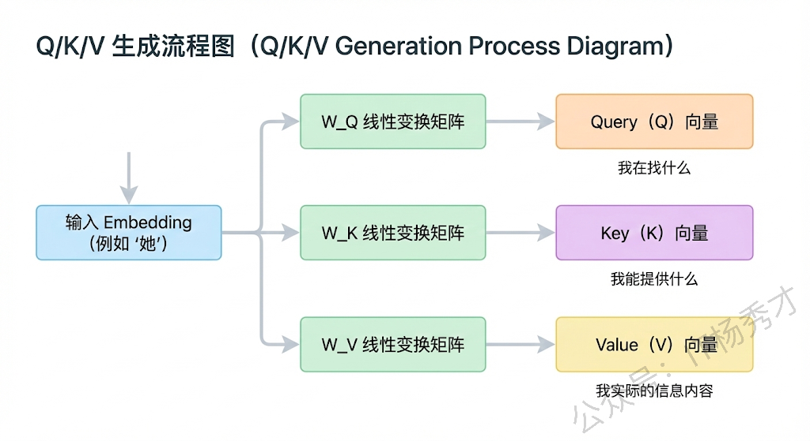
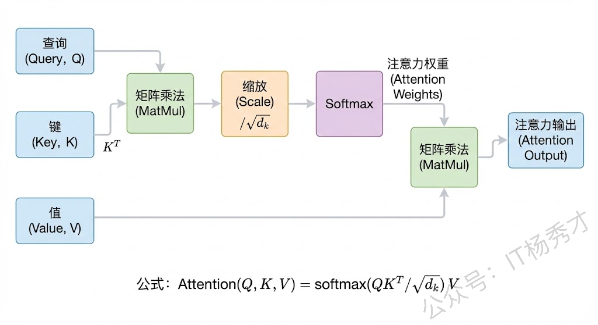
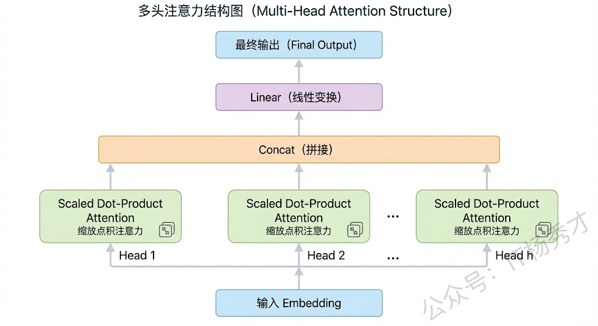
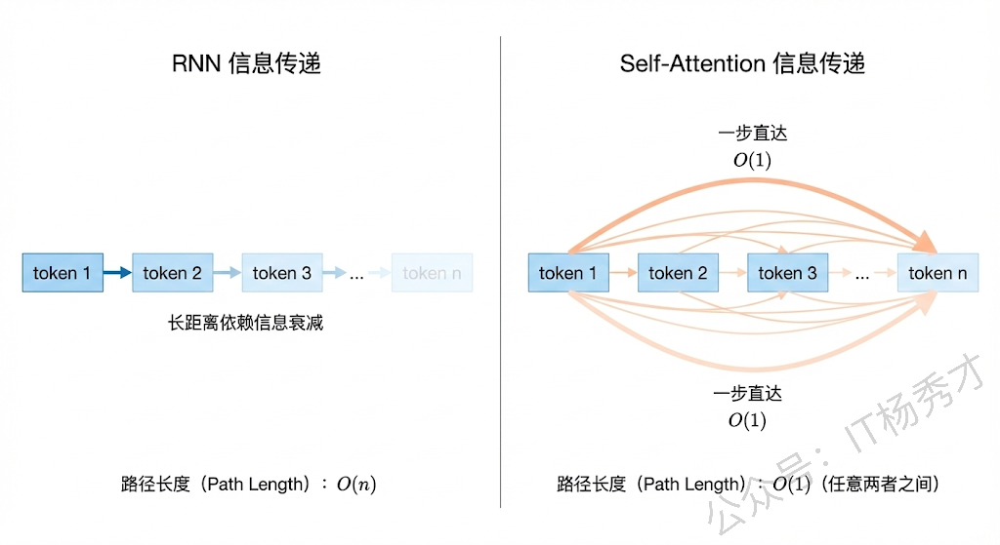
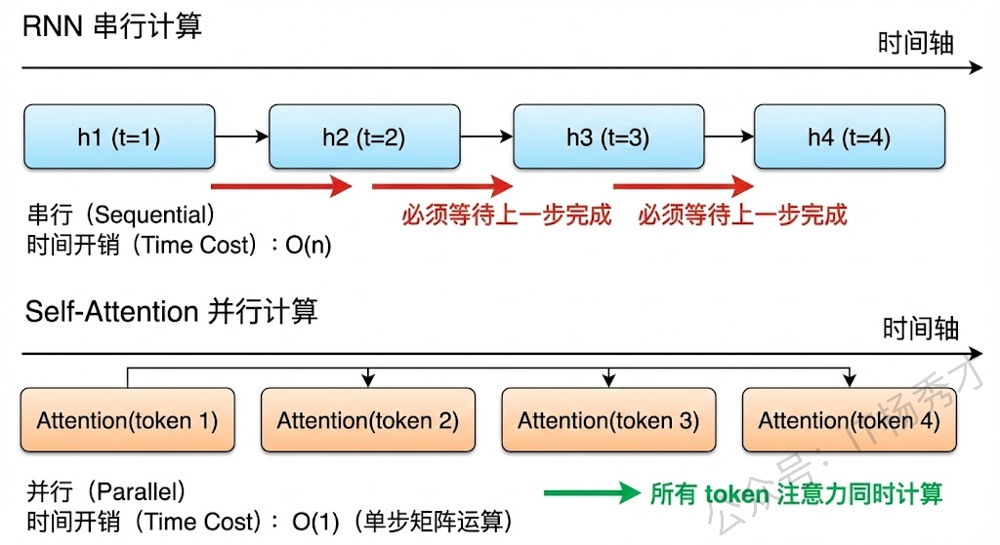

## **1. 题目分析**

这道题是大模型面试中非常高频的基础题，考察的是候选人对 Transformer 架构核心机制的理解深度。面试官想听到的不是背诵公式，而是你真正理解自注意力机制在做什么、为什么这么设计。下面我们把这道题拆成两个部分来深入理解，然后给出一个真实面试场景下的参考回答

### **1.1 自注意力机制到底在做什么**

要理解自注意力（Self-Attention），我们先想一个直觉性的问题：当我们读一句话"小明把苹果递给了小红，因为她饿了"的时候，我们是怎么知道"她"指的是"小红"而不是"小明"的？本质上是因为我们的大脑在处理"她"这个词的时候，会回头去看整句话中所有的词，然后判断哪个词跟"她"的关联最强。自注意力机制做的就是完全一样的事情——让序列中的每个词都能"看到"序列中所有其他词，并且根据相关性来决定应该重点关注谁。

具体的工作流程是这样的：输入序列中的每个 token 的 embedding 会通过三个不同的线性变换矩阵，分别映射成三个向量——Query（查询）、Key（键）和 Value（值）。你可以把 Query 理解为"我在找什么"，Key 理解为"我能提供什么"，Value 理解为"我实际的信息内容"。然后用每个 token 的 Query 去和所有 token 的 Key 做点积运算，这个点积的结果反映的就是两个 token 之间的相关程度。点积值越大，说明这两个 token 之间的关系越紧密。

接下来，点积结果会除以 Key 向量维度的平方根（即 $\sqrt{d_k}$），这一步叫做缩放（Scaled），目的是防止点积值过大导致 Softmax 函数进入梯度极小的饱和区，影响训练稳定性。缩放之后通过 Softmax 归一化，得到注意力权重分布，这个分布本质上就是一个概率分布，表示当前 token 对序列中每个 token 应该分配多少注意力。最后用这个权重分布对所有 token 的 Value 向量做加权求和，就得到了当前 token 融合了全局上下文信息的新表示。

用公式表达就是：Attention(Q, K, V) = softmax(QK^T / $\sqrt{d_k}$) V

这里还要提到**多头注意力（Multi-Head Attention）**的设计。Transformer 并不是只用一组 Q、K、V 来做注意力计算，而是把 embedding 拆分成多个子空间，每个子空间独立做一次自注意力，最后再把结果拼接起来。这么做的好处是不同的注意力头可以学习到不同类型的关系模式，比如有的头可能学习到语法关系，有的头学习到语义关系，有的头学习到位置关系，这样模型的表达能力就丰富很多了。

### **1.2 为什么自注意力比 RNN 更适合处理长序列**

RNN 处理序列的方式是逐步递进的，第一个 token 处理完把隐藏状态传给第二个，第二个处理完传给第三个，以此类推。这种"串行传递"的方式带来了两个根本性问题。

第一个问题是**长距离依赖的信息衰减**。当序列很长的时候，前面 token 的信息需要经过很多步的传递才能到达后面的 token，每传递一步信息就会衰减一些。虽然 LSTM 和 GRU 通过门控机制缓解了这个问题，但并没有从根本上解决。当序列长度达到几百甚至上千的时候，早期的信息仍然会严重丢失。而自注意力机制完全不存在这个问题，因为任意两个 token 之间都是直接计算注意力的，不需要经过中间 token 的传递。无论序列多长，第一个 token 和最后一个 token 之间的信息传递路径长度始终是 O(1)，这就是自注意力在捕获长距离依赖上的根本优势。

第二个问题是**无法并行计算**。RNN 的计算必须严格按照序列顺序，第 t 步的计算依赖第 t-1 步的隐藏状态输出，这意味着整个序列的处理是串行的，无法利用 GPU 的并行计算能力。而自注意力机制中，所有 token 之间的注意力计算是相互独立的，QK^T 本质上就是一个大矩阵乘法，天然适合 GPU 并行加速。这使得 Transformer 在训练效率上远超 RNN，这也是为什么大模型时代几乎全部采用 Transformer 架构的重要原因之一。

当然，自注意力也有自己的短板，就是计算复杂度是 O(n²)，其中 n 是序列长度，因为每个 token 都需要和所有其他 token 计算注意力。当序列特别长的时候（比如长文档处理），这个二次方复杂度会成为瓶颈。所以后来才有了各种改进方案，比如稀疏注意力（Sparse Attention）、线性注意力（Linear Attention）、FlashAttention 等，都是在尝试降低这个计算开销。但即便如此，自注意力相比 RNN 在长序列上的优势仍然是压倒性的。

另外还有一点值得一提，Transformer 本身是不包含位置信息的，因为自注意力的计算是集合操作（set operation），跟 token 的顺序无关。所以 Transformer 需要额外引入位置编码（Positional Encoding）来注入序列的位置信息。原始 Transformer 用的是正弦余弦函数的固定位置编码，而现在主流的大模型基本都采用旋转位置编码（RoPE），它能更好地表达 token 之间的相对位置关系，也更容易外推到训练时没见过的长度。

## **2. 参考回答**

自注意力机制的核心思想是让序列中的每一个 token 都能直接关注到序列中所有其他 token，从而捕获全局的上下文信息。具体来说，输入序列的每个 token 通过三个线性变换分别映射成 Query、Key、Value 三个向量，然后用 Query 和所有 Key 做点积来计算相关性分数，经过除以 $\sqrt{d_k}$ 的缩放防止梯度消失，再通过 Softmax 归一化得到注意力权重，最后用这个权重对 Value 做加权求和，就得到了融合了上下文信息的输出表示。实际使用中还会用多头注意力，把 embedding 拆成多个子空间分别做注意力再拼接，这样不同的头可以捕获不同类型的语义关系，丰富模型的表达能力。

至于为什么比 RNN 更适合处理长序列，主要有两个原因。第一，RNN 是串行传递隐藏状态的，信息要从前面的 token 逐步传到后面，距离越远信息衰减越严重，即使 LSTM 也无法根本解决，而自注意力中任意两个 token 之间的路径长度是 O(1)，直接计算注意力，天然擅长捕捉长距离依赖。第二，RNN 的计算是严格串行的，每一步依赖上一步的输出，无法并行，而自注意力的核心操作是矩阵乘法，天然支持 GPU 并行，训练效率大幅提升，这也是大模型时代全面采用 Transformer 的关键原因。当然自注意力也有 O(n²) 的计算复杂度问题，后续也有 FlashAttention、稀疏注意力等优化方案来应对超长序列场景。

## **学习交流**

> 如果您觉得文章有帮助，可以关注下秀才的<strong style="color: red;">公众号：IT杨秀才</strong>，后续更多优质的文章都会在公众号第一时间发布，不一定会及时同步到网站。点个关注👇，优质内容不错过

