今天我们继续来聊聊缓存相关的话题，因为它实在是太重要了。说实话，仅仅通过缓存这一问题就能瞬间检验出候选人是只懂 CRUD 的码农，还是对系统架构有深刻理解的工程师。

上一篇文章我们拆解了 Cache Aside、Write Back 等经典缓存模式，但是无论哪种缓存模式：这些“标准答案”在极端并发下，要么丢数据，要么会出现短暂的数据错乱。那么：**到底有没有一种方案，能像瑞士银行一样，保证数据库和缓存绝对的一致？**

今天，秀才就把自己多年架构设计中踩过的坑做个总结，带你彻底把“缓存一致性”这个硬骨头彻底搞清楚。接下来我们会从最基础的并发模式讲起，一直聊到那些能让面试官眼前一亮的终极架构方案。

为了能看懂后面那些神操作，我们得先复习一个并发编程里的“基本功”——**Double-Check（双重检查）**。

## **1. Double-Check模式**

Double-Check 并非单例模式的专属，它是所有高并发系统设计中平衡“性能”与“安全”的通用法则。其核心逻辑可以概括为八个字：**检查、加锁、再次检查**。

为什么要有两次检查？因为加锁是很贵的（性能损耗大）。我们希望在不加锁的情况下先快速判断一次，如果条件满足直接返回，这样能扛住 99% 的流量；只有那 1% 的特殊情况，我们才加锁处理。

来看一段伪代码，感受一下它的精髓：

```go
// Double-Check 模式深度演示
// 场景：我们需要获取某个关键配置或热点数据，如果内存里没有，需要去加载
func doubleCheck() {
    // 第一步：第一次检查（First Check）
    // 这里我们先加一把“读锁”。读锁是共享的，大家都能进，性能很高。
    rlock() 
    if !checkSomething() {
        // 如果发现数据不存在，或者条件不满足，我们需要做变更（比如加载数据）。
        // 读锁是不能升级为写锁的，所以必须先释放读锁。
        runlock() 

        // 第二步：加写锁（Locking）
        // 此时进入“独占”模式，同一时刻只有一个线程能执行下面的代码。
        lock()
        
        // 第三步：第二次检查（Second Check）—— 这是灵魂所在！
        // 千万别忘了这一步！因为在你释放读锁、去抢写锁的这个微小时间差里，
        // 可能已经有别的线程捷足先登，把数据加载好了。
        // 如果你不查，直接覆盖，就可能做重复劳动，甚至覆盖掉最新的数据。
        if !checkSomething() {
            // 只有确认数据真的不存在，才执行昂贵的加载逻辑
            // 比如查询数据库、复杂计算等
            doHeavyBusinessLogic()
            return
        }
        
        // 如果第二次检查发现数据有了，说明我们躺赢了，直接释放锁即可。
        
        unlock() // 释放写锁
    } else {
        // 数据本来就有，直接释放读锁返回，性能损耗极小
        runlock()
    }
}
```

举个实战的例子：我们要读取一个商品的详情，ID 是 8848。

1. 你先加读锁，看本地缓存里有没有 8848。

2. 如果有，直接返回。

3. 如果没有，你释放读锁，去抢写锁。

4. 抢到写锁后，**必须再次看一眼缓存里有没有 8848**。因为可能有一百个线程同时发现没有，你是第一百个抢到锁的，前面九十九个已经把活干完了。

5. 如果还是没有，你再去查库、回写缓存。

这个模式还有两个常见的变种，大家在架构设计中要灵活运用：

1. **无锁初检**：第一次检查时不加任何锁。这在**分布式锁**场景下特别常见，因为分布式锁通常没有“读锁”的概念，或者加锁网络开销太大。直接裸读，读不到再去抢分布式锁。

2. **原子操作替代**：如果检查的逻辑非常简单（比如只是判断一个 int 状态），可以用 CAS 等原子操作来替代读锁，进一步压榨性能。

把这个模式记在心里，它是我们后面解决复杂一致性问题的钥匙。

## **2. 面试准备**

在深入技术细节前，我想聊聊面试技巧。当面试官抛出“怎么保证缓存一致性”这个问题时，他其实是在钓鱼。如果你上来就背诵“延时双删”，那你就上钩了。

真正的高手，会先通过几个反问，把问题的边界圈定清楚：

* **现状盘点**：“在讨论方案前，我想确认一下，咱们现在的业务场景里，缓存是用在什么地方？是全量数据缓存，还是只缓存热点？”

* **容忍度分析**：“业务方对不一致的容忍度是多少？是必须要毫秒级一致（强一致），还是说允许几秒钟的延迟（最终一致）？如果是价格数据，可能要求高；如果是点赞数，可能要求低。”

* **兜底机制**：“如果真的出现了不一致（比如 Redis 挂了），我们有多久能发现？有没有后台的对账程序（Reconciliation）在自动修复？”

这三个问题一抛，面试官立马就会觉得：**这个人懂架构，知道抛开业务谈技术都是耍流氓。**

> 实际上，**越追求强一致性，系统的性能损耗（Latency）和架构复杂度（Complexity）就越高**。我们做架构设计的目的，不是为了追求完美的“强一致”，而是要清楚地知道不一致的风险在哪里，并告诉业务方：我们能做到什么程度，以及在最坏情况下，数据会在多久内达成一致。

接下来，我们就像剥洋葱一样，一层层揭开数据不一致的根源。

## **3. 不一致的两个根因**

当你分析任何数据不一致问题时，都可以将其归结为两大核心根因：

1. **源自操作的部分失败（Partial Failure）**

2. **源自并发操作的时序错乱（Race Condition）**

如果你能在面试中开篇明义地指出这两点，绝对是一个巨大的亮点。因为大多数人只盯着“并发”看，而忽略了分布式环境下“部分失败”这个客观存在的物理定律。

### **3.1 部分操作失败**

这是最难解决的硬伤。在微服务和分布式系统中，原子性（Atomicity）是一个极其奢侈的属性。比如一个最简单的“更新用户积分”的操作，在架构层面实际上包含了两个独立的网络调用：

1. **更新数据库**（MySQL）

2. **更新缓存**（Redis）

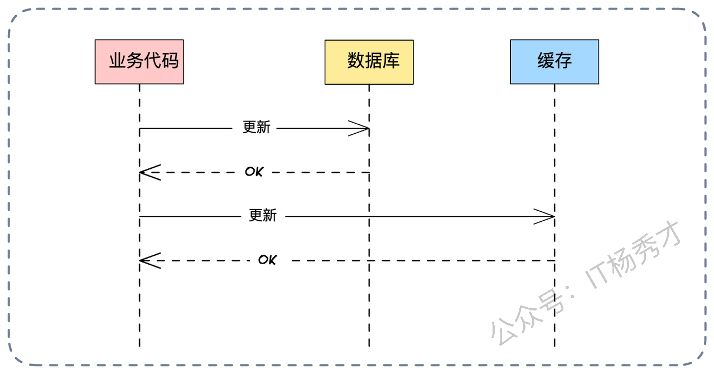

理论上，为了保证一致性，我们要求这两个动作要么同时成功，要么同时失败。这本质上就是一个**分布式事务**问题。

然而现实很骨感。绝大多数缓存中间件（如 Redis、Memcached）并不支持标准的 XA 分布式事务协议。这意味着，你没法让 MySQL 和 Redis 在一个事务里同生共死。

一旦数据库更新成功了，但在发起 Redis 更新请求时网络断了，或者 Redis 突然宕机了，那么数据库里就是新积分，缓存里就是旧积分。这时候，数据就不一致了。所以在现有的技术条件下，对于“部分失败”导致的不一致，结论是：**不可避免**。

我们能做的，是尽最大努力去补救。比如通过重试机制、将失败的操作写入消息队列进行异步补偿、或者通过定期的后台脚本校对数据。这里的目标是**最终一致性**。

### **3.2 并发操作失败**

相比于部分失败，并发操作导致的不一致是更有技术含量，也是可以通过精妙的架构设计来解决的。

上一篇文章我们分析的 Cache Aside 模式中的很多坑，都是并发引起的。解决这类问题，核心思想只有一个：**序列化（Serialization）**。说白了，就是让并行的操作，乖乖排队，或者逻辑上互斥。

我们来看一个典型的并发导致不一致的场景：

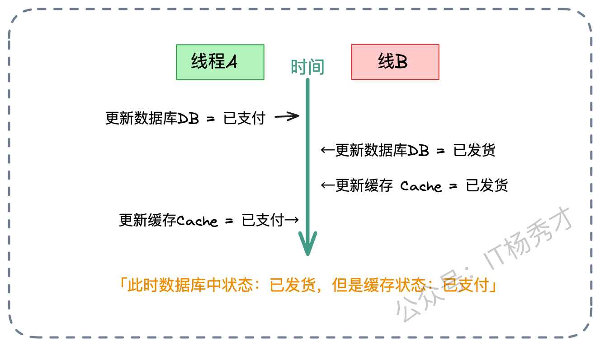

假设有两个线程，线程 A 和线程 B，它们都要修改同一个订单的状态：

1. **线程 A** 想要把状态从“待支付”改为“已支付”。它先成功更新了数据库（DB=已支付）。

2. **线程 B** 紧接着想要把状态从“已支付”改为“已发货”。它也更新了数据库（DB=已发货）。

3. 按理说，缓存最后应该也是“已发货”。

4. 但是，由于网络延迟或 CPU 调度，线程 B 的动作比较快，它先更新了缓存（Cache=已发货）。

5. **线程 A** 此时才姗姗来迟，执行了它的第二步操作——更新缓存（Cache=已支付）。

结果就是：**数据库里是“已发货”（新状态），缓存里是“已支付”（旧状态）**。只要缓存不过期，用户看到的状态永远是错的。针对这种并发乱序，我们可以祭出四把武器：**消息队列**、**版本号**、**多级缓存策略**，以及大杀器**分布式锁**。

## **4. 核心解决方案**

既然“部分失败”只能靠重试和补偿，那我们今天的重点就是攻克“并发更新”带来的难题。

### **4.1 方案一：消息队列**

既然我们要把并发转为串行，那最自然的思路就是——**排队**。我们可以引入消息队列（Kafka、RocketMQ 等），利用其天然的**有序性**。

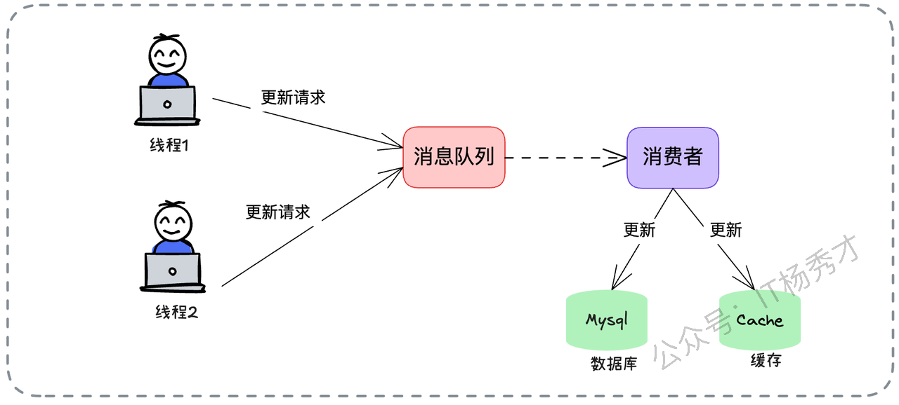

具体流程如下：

1. 所有的写请求（Update），不直接操作数据库，而是封装成消息发送给 MQ。

2. 确保针对同一个业务 ID（比如订单 ID）的消息，被路由到同一个 Partition（分区）。

3. 消费端启动一个消费者，按顺序从队列里取出消息。

4. 消费者依次执行“更新数据库”和“更新缓存”的操作。

这样，哪怕前端有 1000 个并发请求打进来，到了消费端这里，也变成了流水线上的一个个任务，严格按照先后顺序执行。并发问题瞬间就迎刃而解了。但是，这个方案也有局限性：它把同步操作变成了异步，实时性会下降。如果业务要求写完必须立马读到，这个方案就不太适用了。

#### **4.1.1 变种方案：先更库，再发消息**

还有一种常见的变种：为了保证数据库的实时性，业务线程先同步更新数据库，然后发一个消息给 MQ，让消费者去异步更新缓存。

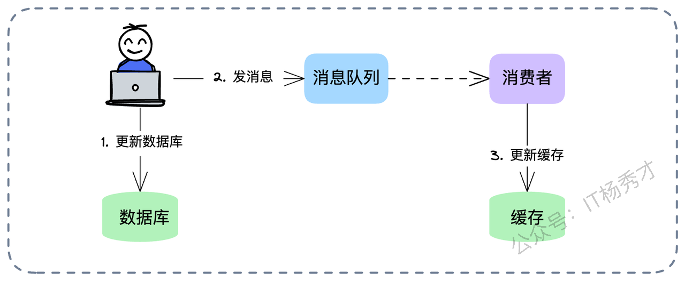

这个方案看似完美，其实藏着一个巨大的**并发陷阱**。如果消费者**完全依赖消息体里的数据**去更新缓存，依然会有问题。因为“更新数据库”和“发消息”这两个动作之间不是原子的，而且消息在网络传输中可能会乱序。

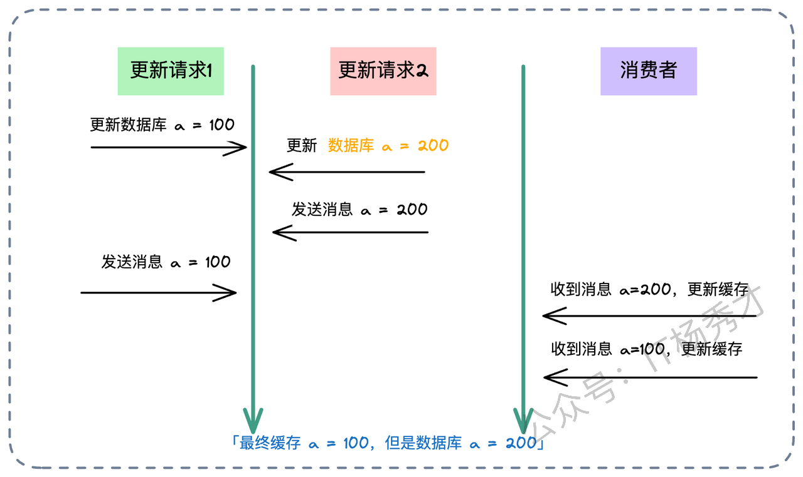

比如：

1. 线程 A 把库改成了 100，发消息 M1（内容：100）。

2. 线程 B 把库改成了 200，发消息 M2（内容：200）。

3. 如果消费者先收到了 M2，把缓存改成了 200。

4. 紧接着收到了 M1，把缓存改成了 100。

5. **最终状态：库是 200，缓存是 100。** 又是脏数据！

> **架构师的建议**： 在这种方案下，最好把 MQ 当作一&#x4E2A;**“信号触发器”，**&#x800C;不是“数据载体”**。 消费者收到消息“ID=5 的数据变了”之后，不要直接用消息里的值，而是**去查一遍数据库的最新状态\*\*，然后再回填缓存。或者，更进一步，使用像 **Canal** 这样的组件监听 MySQL Binlog，将数据库变更自动同步到缓存，这其实就是 **Refresh Ahead** 模式的工程化实践，效果更佳。

### **4.2 方案二：乐观锁与版本号**

另一种解决并发的经典手段是引入**版本号（Versioning）**，也就是我们常说的乐观锁思想。我们在数据表中增加一个 `version` 字段。每次更新数据时，`version` 必须 + 1。 更新缓存时，我们比较数据的版本号：只有当**新数据的版本号 > 缓存中已有数据的版本号**时，才进行覆盖；否则说明是旧数据，直接丢弃。

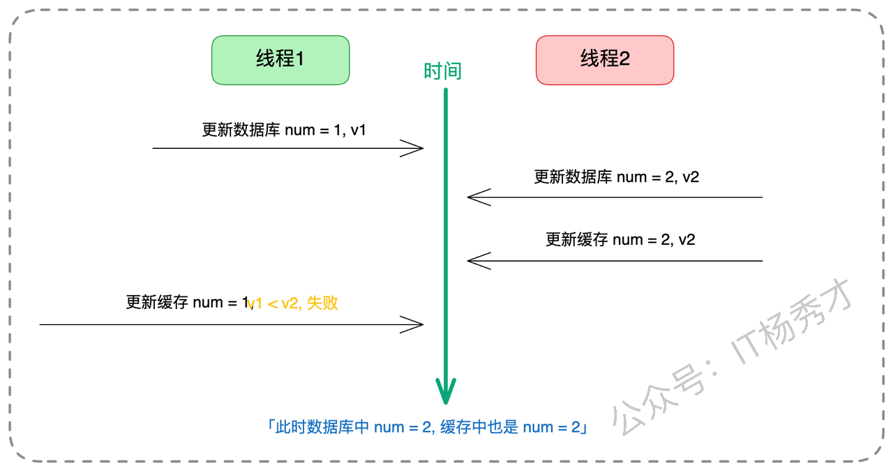

在这个机制下，哪怕线程 A 的旧数据（v1）因为网络拥堵，比线程 B 的新数据（v2）晚到，缓存更新逻辑也会发现：`v1 < v2`，这是一条过期的数据，我不接受。从而完美保护了缓存的正确性。

在工程实践中，维护一个专门的 version 字段可能比较麻烦。我们也可以用**数据的最后更新时间戳（Last Updated Time）**&#x6765;代替版本号。如果是 Redis，可以通过 Lua 脚本来实现“比较版本并更新”的原子操作，确保检查和写入是原子的，防止中间被插队。

## **5. 进阶场景：多级缓存更新策略**

在如今的高性能后端系统中，为了追求极致的响应速度，我们通常不会只用一层缓存，而是采用 **本地缓存（Local Cache，如 Caffeine） + 分布式缓存（Remote Cache，如 Redis） + 数据库（Database）** 的三级架构。

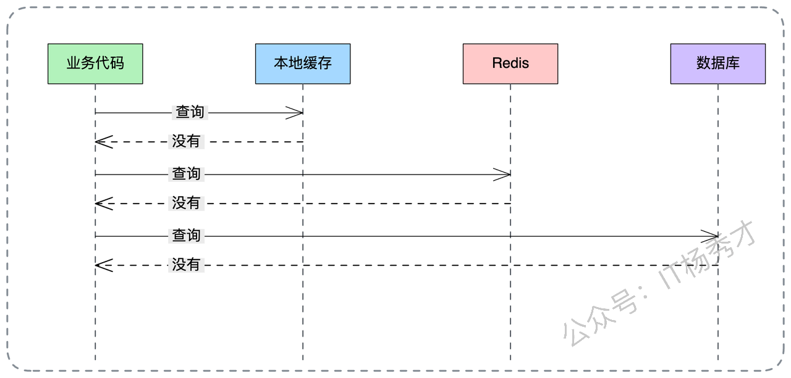

在这种复杂的“套娃”架构下，更新顺序就变得非常有讲究，稍微搞错一步，数据就乱了。首先确立一个绝对原则：**数据库永远是 Source of Truth（真理之源）**。所以，无论怎么排，第一步必须是**更新数据库**。剩下的问题是：先更本地缓存，还是先更 Redis？

我的建议是：**先本地，后 Redis**。 即：**Update DB -> Update Local Cache -> Update Redis**。让我们深入分析一下为什么要这么做：

1. **高可靠性**：更新本地缓存是在当前 JVM 进程内存中操作，几乎不会失败。把最稳的操作先做了，至少保证了当前这台机器的数据是对的。

2. **用户体验优先**：读取链路通常是 **先查本地 -> 再查 Redis**。先更新本地缓存，能保证当前应用实例上的用户立马看到最新数据，实现了“Read Your Writes”的一致性体验。

3. **防脏读兜底**：假设 Redis 更新失败了（比如网络抖动），或者 Redis 里的数据还没来得及同步。当请求进来时，只要命中了本地缓存，就直接返回最新值了，根本不会去 Redis 读那个旧数据。本地缓存充当了一个临时的“正确数据避风港”。

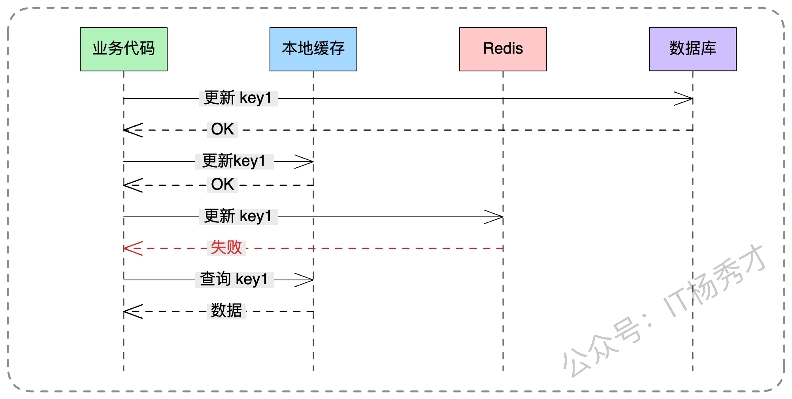

当然，引入多级缓存后，数据不一致的概率从理论上是成倍增加的。比如，机器 A 更新了数据库和自己的本地缓存，但机器 B 的本地缓存还是旧的。这时候用户请求如果打到了机器 B，看到的还是旧数据。这需要配合\*\*广播机制（如 Redis Pub/Sub）\*\*来通知所有节点失效本地缓存，但在通知到达之前，短暂的不一致是必须容忍的。

## **6. 亮点方案**

如果你想在面试中脱颖而出，拿到 S 级的评价，光讲上面的常规方案可能还不够。下面这两个方案，能展示你对架构深度的掌控力，属于面试中的“大招”。

### **6.1 亮点一：一致性哈希 + Singleflight**

我们在微服务负载均衡中常提到**一致性哈希（Consistent Hashing）**。通常是为了数据分片，但在这里，我们可以把它和缓存更新巧妙结合起来。核心思路是：利用一致性哈希负载均衡算法，让针对**同一个 Key 的所有请求（无论是读还是写）**，都**路由到同一个服务节点**上处理。


这样做的好处是什么？ 它把一个棘手的**分布式并发问题**，降级为了简单的**单机并发问题**。 既然针对 `Product ID=100` 的所有请求都在 `Node A` 这一台机器上处理，我们就不需要分布式锁了，直接使用单机并发控制手段即可。

这时候，我们可以引入 Go 语言中著名的 **Singleflight** 模式（Java 中也有类似的实现）。 Singleflight 的作用是“请求合并”。当有 100 个请求同时要读取 key=100 的数据时，Singleflight 保证只会有一个请求去查库，其他 99 个请求等待结果共享。 在更新场景下，我们可以利用类似的机制，控制让这一个节点内的更新请求**串行化**，或者合并更新。

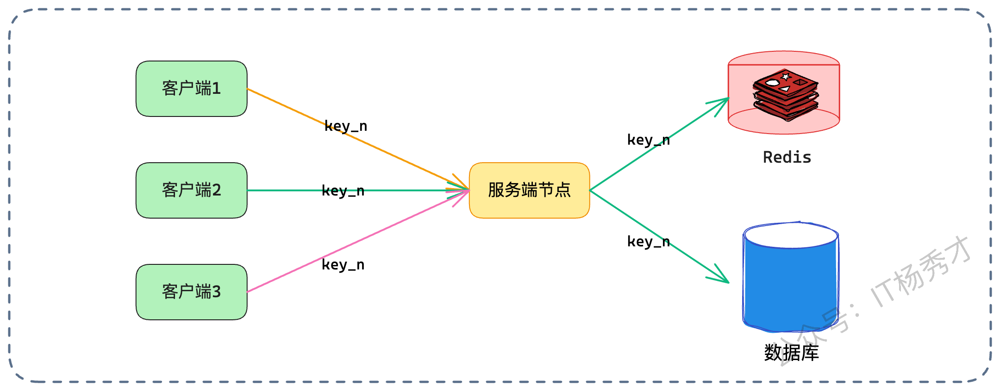

#### **6.1.1 节点扩缩容导致不一致**

这个方案看起来很美，但最大的软肋在于**节点变动**。 当服务扩容（新节点上线）或者缩容（节点下线）时，哈希环会发生变化，一部分 Key 的流量会从老节点漂移到新节点。 这就导致了在切换的短时间内，可能有新老两个节点同时在处理同一个 Key。两个节点之间没有锁同步，分布式并发问题就会“死灰复燃”。

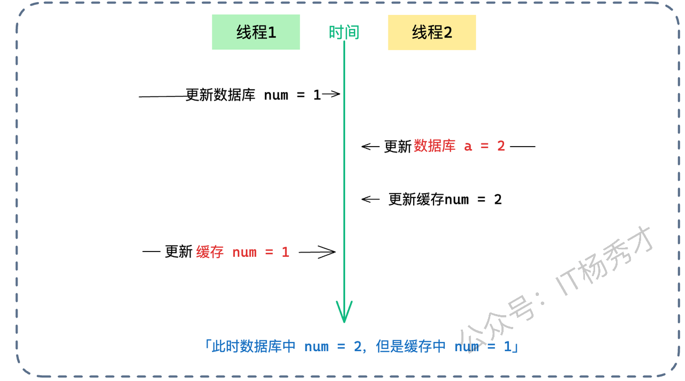

怎么解？ 这里有个很“贼”、但也非常实用的思路：**新节点“静默”机制**。

当新节点上线后的最初一小段时间内（比如前 2 秒），它对于缓存采取\*\*“只读不写”**，或者甚至**“直接穿透”\*\*的策略。

* 如果是读请求，直接查数据库，不走缓存，也不回写缓存。

* 如果是写请求，只更库，不更缓存。

* 等待网络中残留的、或者老节点正在处理的请求自然结束。

虽然在这两秒内，该节点的响应时间会变慢（因为请求全部穿透到数据库），但完美避开了新老节点并发写缓存导致的数据不一致风险。这个思路体现了架构设计中的**折中（Trade-off）艺术**——用短暂的性能损耗，换取数据的一致性安全。

### **6.2 亮点二：分布式锁**

分布式锁是解决并发的万金油，但怎么用好它，大有文章可做。很多人只知道加锁，却不知道怎么加才对。我们来看两个流派。

#### **6.2.1 先本地事务，后分布式锁（常规打法）**

这是一个比较中规中矩的思路：

1. 开启本地事务。

2. 执行数据库更新。

3. 提交事务。

4. **加分布式锁** -> 删除缓存 -> 释放分布式锁。


这个方案看似严谨，但其实有个**致命漏洞**：**并发读写导致的“读-写不一致”**。 也就是我们常说的“Cache Aside 模式的并发缺陷”。请看下图推演：

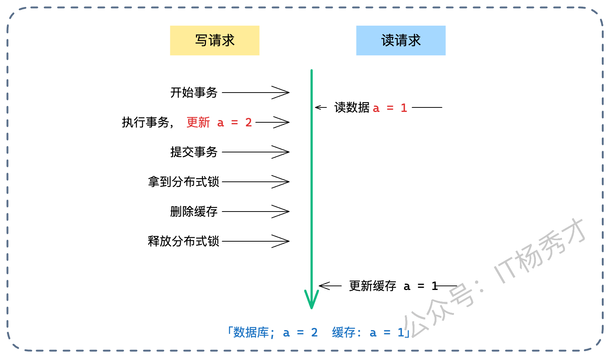

1. **读请求**：发现缓存没了，去查库。注意，此时写请求的事务还没提交，读请求读到的是**旧值**。

2. **写请求**：提交事务，更新了库（新值）。

3. **写请求**：获取分布式锁，删除了缓存（虽然此时缓存本来就是空的，删了个寂寞）。释放锁。

4. **读请求**：这时候才慢吞吞地把自己刚才读到的**旧值**写回缓存。

结果：数据库是新值，缓存是旧值。而且因为写请求已经删过缓存了，这个脏数据会一直存在，直到过期。

为了补这个漏洞，我们需要在**读请求回查数据库**的阶段，也加上分布式锁，形成互斥。

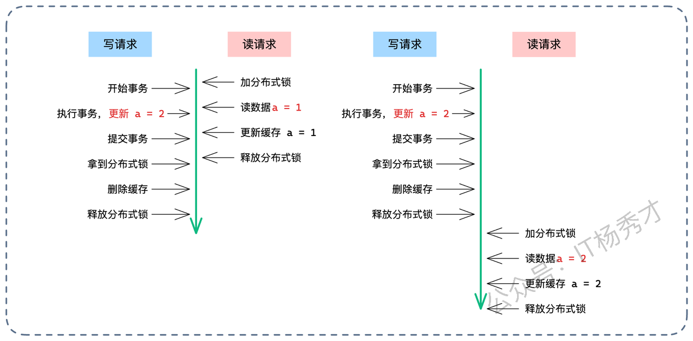

**优化后的读请求逻辑**：

1. 读缓存，Miss。

2. **加分布式锁**。

3. **再读一次缓存（Double-Check）**：这一步至关重要！因为在我不加锁的时候，可能别人已经把数据加载进去了。

4. 如果还是没有，读库。

5. 写缓存。

6. 释放锁。


利用 Double-Check 机制，我们最大程度减少了加锁对读性能的影响。只有在缓存真正击穿的时候，才需要排队。

#### **6.2.2 先删缓存，再提交**

这是一种更激进的思路，试图在数据库事务提交前就搞定缓存，从而达成一种“近似强一致”的效果。

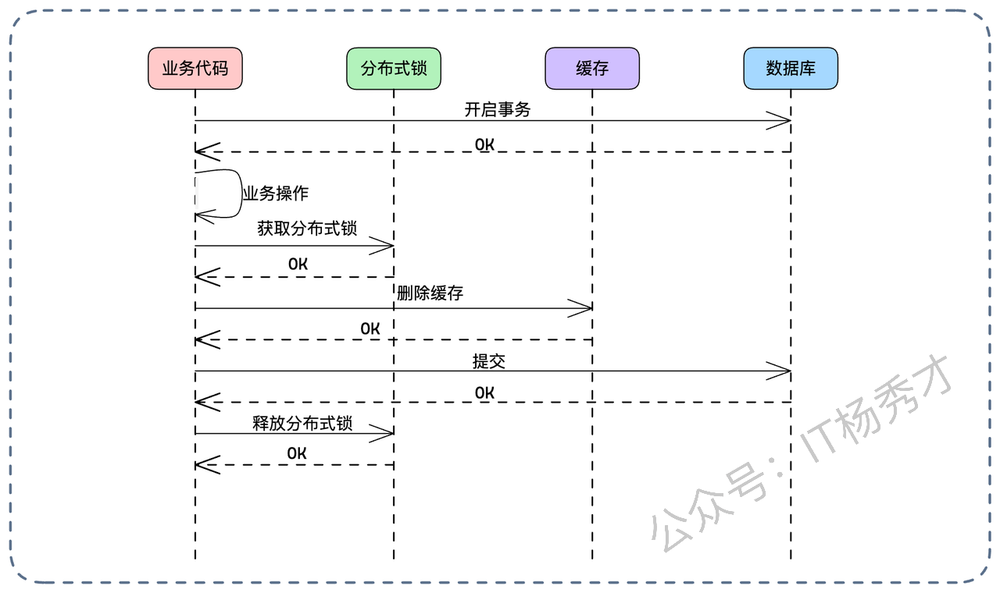

**流程如下**：

1. 开启本地事务。

2. 执行业务逻辑（Update DB）。

3. **获取分布式锁**。

4. **删除缓存**。

5. **提交本地事务**。

6. 释放分布式锁。

为什么说它接近强一致？我们来推演各种失败场景：

* **Case 1：删除缓存失败**。没关系，分布式锁还没释放，事务也没提交。直接回滚事务。数据库和缓存都没变，一致。

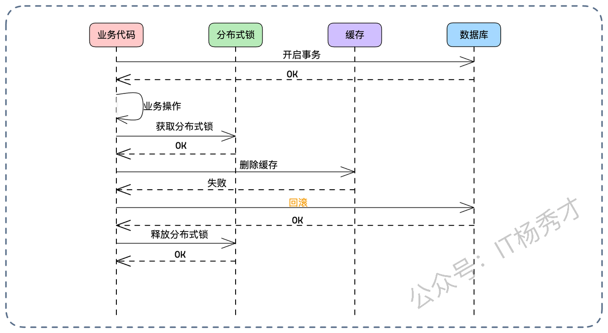

* **Case 2：删除缓存成功，但事务提交失败**。缓存没了，数据库没变（回滚了）。下一次读请求进来，发现缓存空了，去查库（查到旧值），回填缓存。数据依然一致（只是多了一次 Cache Miss，无伤大雅）。


只要满足以下两个条件，这个方案就是强一致的：

1. 分布式锁本身是可靠的（互斥性）。

2. 删除缓存的操作通过重试机制保证最终成功（防止删了一半网络断了）。

**核心风险点**： 这个方案最大的敌人是**超时**。 我们在数据库事务的内部，持有了分布式锁，并进行了网络调用（删缓存）。 如果分布式锁被别人抢占了，当前线程就要等待；或者删除缓存的网络请求卡住了。这都会导致**本地事务持有时间过长**。 长事务是数据库的大忌，会导致连接池耗尽、锁竞争加剧，甚至引发大规模的超时回滚。

**优化变种**： 为了缓解事务超时，可以把“获取分布式锁”这一步提到事务外面：

1. **获取分布式锁**（先占坑）。

2. 开启本地事务 -> 执行 -> 删缓存 -> 提交。

3. 释放分布式锁。

但这又导致了分布式锁的持有时间变长，影响了系统的并发吞吐量。所以，这依然是一个在“一致性”和“性能”之间走钢丝的方案，需要架构师根据具体的业务并发量来权衡。

## **7. 小结**

回顾我们的缓存一致性方案设计之旅，一路从微观的 Double-Check 的代码实现，再到分布式锁编排的宏观架构。

* **基础**：Double-Check 是并发优化的万金油，理解它才能理解后续的优化。

* **根源**：一切不一致都源于“部分失败”和“并发乱序”。前者靠补偿，后者靠序列化。

* **常规解法**：消息队列（要当信号用）、版本号（乐观锁）是解决并发的利器。

* **高级解法**：一致性哈希结合 Singleflight 可以降维打击；而分布式锁的不同加锁顺序，则是在“数据准确性”和“系统可用性”之间做极限拉扯。

最后，还是那句话：**&#x20;架构设计没有银弹。** 不要试图寻找一个既简单、又高性能、还能保证强一致的方案。架构设计永远是做选择题，而不是填空题。你要做的，是在业务允许的范围内，选择那个代价最小的方案。希望这篇文章能帮你打通缓存一致性的任督二脉，在下一次架构面试中，面对面试官的刁钻提问，你能从容不迫，侃侃而谈！

<div style="background-color: #f0f9eb; padding: 10px 15px; border-radius: 4px; border-left: 5px solid #67c23a; margin: 20px 0; color:rgb(64, 147, 255);">

## <span style="color: #006400;">**学习交流**</span>
<span style="color:rgb(4, 4, 4);">
> 如果您觉得文章有帮助，可以关注下秀才的<strong style="color: red;">公众号：IT杨秀才</strong>，后续更多优质的文章都会在公众号第一时间发布，不一定会及时同步到网站。点个关注👇，优质内容不错过
</span>


</div>
