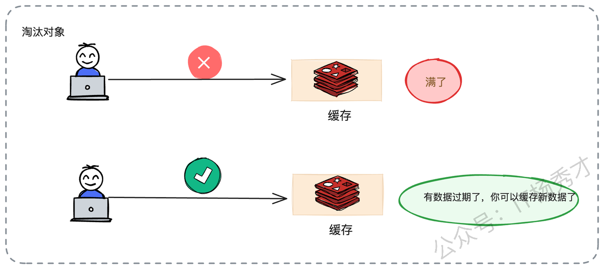
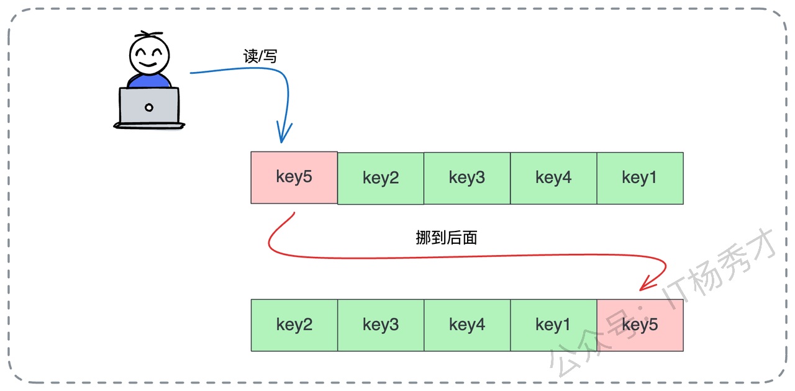
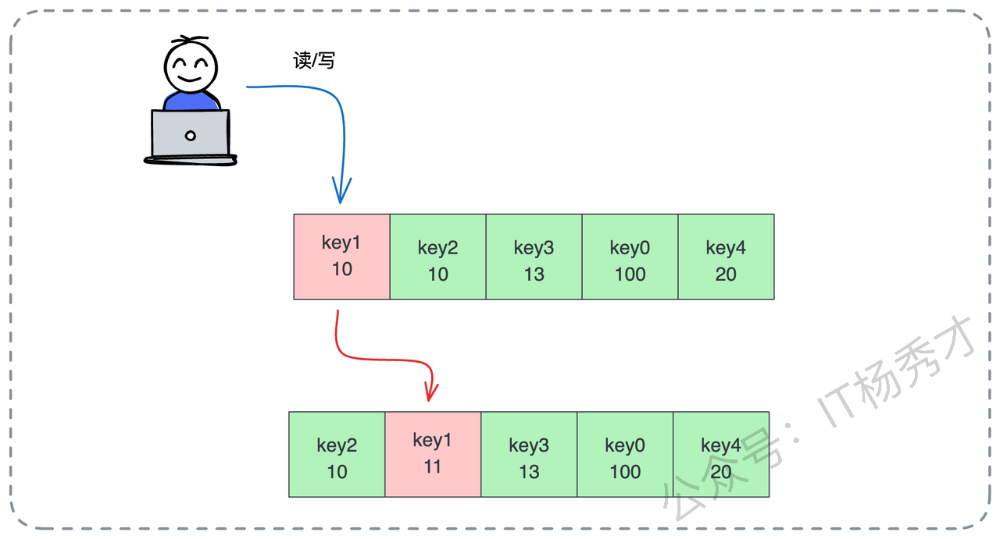
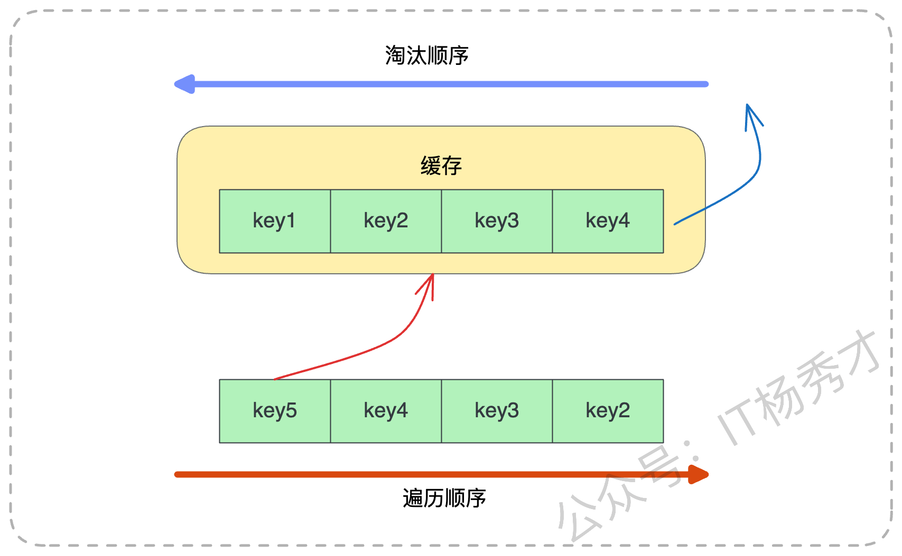
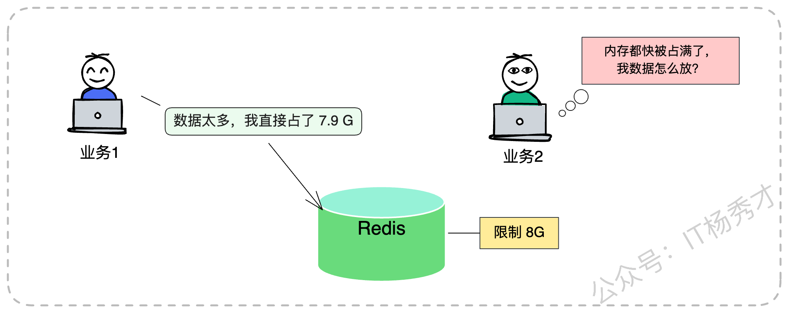
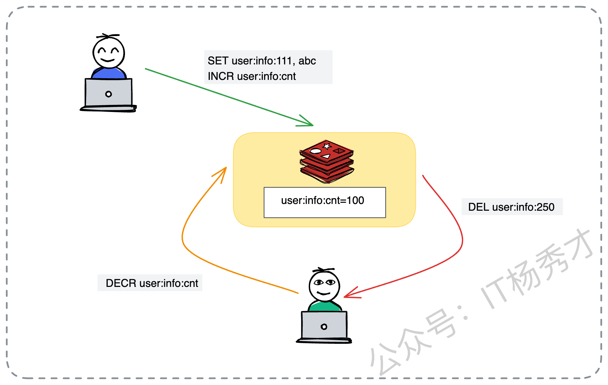
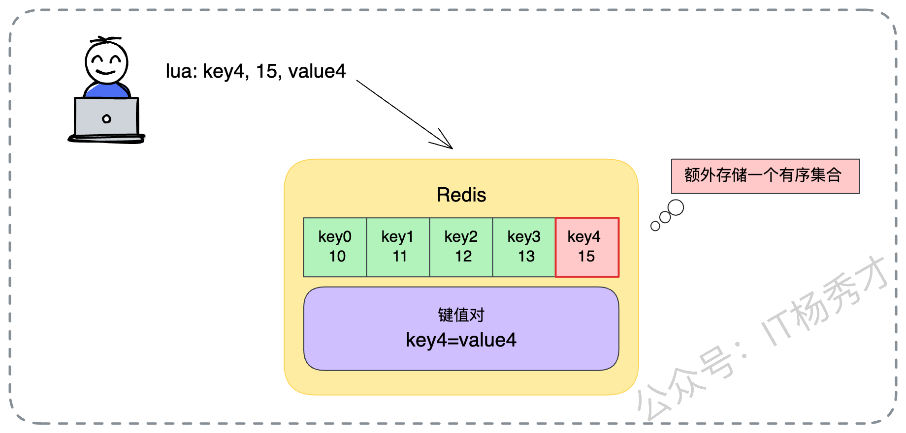
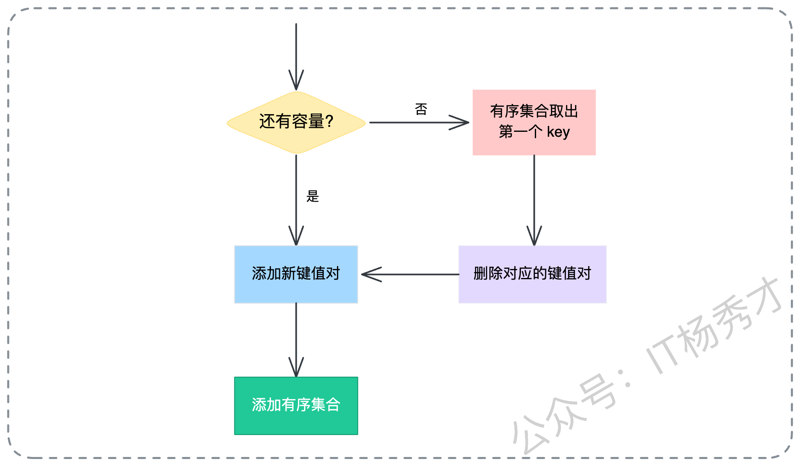

在做后端架构设计中，缓存一直是我优化系统性能手里的头号策略。无论是在高并发的互联网大厂，还是在传统企业的数字化转型项目中，缓存的设计都至关重要。今天我们就来来深度探讨一个在面试中必问，在实际工作中又极容易被忽视的核心话题——**缓存淘汰策略**

很多同学在面试时，提到这个问题，张嘴就是“LRU 是最近最少使用，LFU 是最近最不常使用”，背得滚瓜烂熟。但这样的回答充其量只能算是个“及格分”。如果你想在高级职位的面试中脱颖而出，或者在实际架构设计中解决真正的痛点，你需要展示的是如何根据千变万化的业务场景，设计出“字合适的解决方案。

如果你能在面试中，不仅讲清楚基础算法，还能抛出一套基于业务优先级的组合淘汰方案，那绝对能给面试官留下极其深刻的专业印象。今天，我们就从架构师的视角，把这个话题彻底拆解开来。

## **1. 为什么我们需要淘汰？**

在深入研究各种花哨的算法之前，我们先回到原点，思考一个本质问题：**为什么我们的缓存系统需要淘汰机制？**

大家在日常开发中引入缓存，初衷都是为了提升读写性能。但是，资源永远是有限的，特别是对于应用进程内的本地缓存（Local Cache），内存更是寸土寸金。我之前接手过一个遗留系统，上线初期跑得好好的，但运行一段时间后，运维团队频频报警，说应用服务器的内存占用率飙升，甚至偶尔会出现 OOM（Out Of Memory）导致服务重启。排查下来发现，开发同学在代码里写了一个简单的 Map 做缓存，只顾着往里塞数据，压根没考虑过内存也会有被吃光的一天。对于 Java 这种带 GC 的语言来说，缓存对象过多还会导致频繁的 Full GC，让系统时不时“卡顿”一下，性能不升反降。

所以，作为架构师，我们在设计缓存系统时，必须设定一条红线：**控制内存的使用上限**。这就引出了一个非常现实的问题：**当内存满了，达到了我们设定的上限，业务侧又源源不断地有新数据要写入，这时候该怎么办？**

最简单粗暴的做法，就是直接报错，告诉业务方：“满了，写不进去了”。但这显然太“硬”了，不符合高可用系统的设计原则。除非你的业务能接受新数据无法缓存，只能等待老数据自然过期腾出空间。



但在绝大多数互联网业务场景下，我们是不能接受这种方案的。因为我们通常认为，虽然缓存里的老数据还没过期，但它们现在的价值可能已经不如那条正要写入的新数据高了。所以，更合理的做法是：淘汰老数据，腾空位置。即使旧数据没过期，我们也得忍痛割爱，把它清理出去，给更有价值的新数据腾位置。

**淘汰的本质，就是一种在资源有限的情况下的价值权衡：剔除价值较低的旧数据，接纳价值较高的新数据，从而维持缓存整体的高命中率。**

## **2. 经典缓存淘汰算法**

在缓存淘汰的算法界，有两位主流算法统治了很多年，它们就是 **LRU** 和 **LFU**。此外还有 FIFO（先进先出）和 OPT（最佳置换）等，但实战中应用最广的还得是前两位。

### **2.1 LRU**

LRU 的全称是 Least Recently Used，翻译过来就是**最近最少使用**。它的核心逻辑非常符合直觉：**如果一个数据在最近一段时间内从未被访问过，那么它在未来被访问的概率通常也很低。反之，刚刚被访问过的数据，大概率还会再被用到。** 这种基于时间局部性原理的假设，在大多数业务场景下都是成立的。

从实现的角度来看，LRU 其实并不复杂。我们可以想象一个链表，每当有数据被读取或写入时，我们就把它摘下来，移到链表的头部（或者是尾部，看你定义的顺序）。

这样一来，链表的顺序就代表了访问的时间顺序。链表的一头是最近刚被访问过的热数据，而另一头自然就是那个最久未被访问的老数据。当空间不足需要淘汰时，我们只需要把链表尾部的那个数据踢掉就可以了。

在 Java 的生态里，`LinkedHashMap` 其实就是天生的 LRU 实现胚子，它内部维护的双向链表机制，稍微配置一下就能实现这个逻辑。



这里需要注意一个架构细节：所谓的“访问”，通常既包含读操作，也包含写操作。但在一些特殊的写多读少，或者对写入数据热度要求更高的场景下，我们也可以做一个变种：只在“写”操作时才更新数据位置，以此来保护那些高频写入的热点数据。

### **2.2 LFU**

如果说 LRU 关注的是时间，那么 LFU（Least Frequently Used）关注的就是频率。LFU 的核心思想是：**过去被访问次数最少的数据，将来被访问的可能性也最小。** 它是根据数据的**热度**来排座次的，谁的人气低，谁就出局。

实现 LFU 时，我们需要给每个数据对象挂一个计数器。每次读写操作，计数器就加 1。当需要淘汰时，我们就遍历所有数据，把那个计数器数值最小的踢出去。当然，实战中可能会遇到并列的情况：如果两个数据的访问次数一样少，踢谁？通常的做法是看谁先来的踢谁，或者随机踢一个，甚至可以结合 LRU 的规则，踢掉那个更久未被访问的。



不过，LFU 在实际落地时，也有它的局限性。它最大的问题在于**过去的热度不能代表现在**。举个例子，比如某个热点新闻，刚出来的时候访问量巨大，计数器瞬间飙升到 100 万。但过了两天，新闻过气了，没人看了。可是因为它历史累计的访问次数太高了，导致它一直霸占着缓存空间，死活不肯走。而新来的数据可能刚开始计数器只有 1，直接被淘汰了。

为了解决这个问题，进阶版的 LFU 通常会引入“**时间衰减**”机制。比如只统计最近 1 小时内的频率，或者定期让所有数据的计数器减半，让历史的高热度随时间慢慢冷却，给新数据上位的机会。

### **2.3 策略选择**

在绝大多数通用场景下，作为架构师，我会推荐你优先考虑 LRU。因为它简单、高效，且完美契合了大部分业务的访问规律。

但是，我们必须清楚它的软肋。LRU 最怕的就是**大规模的冷数据遍历**。这在实际生产环境中太常见了。想象一下，你的电商系统平时运行得好好的，热点商品的缓存命中率很高。突然有一天，运营部门说要导出一份半年前的历史订单数据做分析，或者后台有一个定时任务要全量扫描一遍所有商品数据。

这些历史数据可能几百年才用一次，但在遍历的那一刻，它们被疯狂地读取。在 LRU 算法眼里，这些数据就是“刚被访问的热点”，于是它们被一股脑地塞进缓存头部。

后果是什么？原本真正高频使用的热点数据（比如当天的秒杀商品），因为位置被挤占，全部被淘汰出了缓存。等你遍历完了，留下一堆没用的冷数据占着茅坑，而真正的用户流量进来时，缓存全空，请求直接打透到数据库，数据库 CPU 瞬间飙升。这就是典型的缓存污染。



如图所示，当遍历发生时，`key5`、`key4` 这些新来键值的会把 `key1`、`key2` 这些原本的键值无情淘汰。等你需要再用 `key1` 时，必须重新回源加载。

## **3. Redis 中的缓存淘汰策略**

聊完了理论，我们来看看工业界的标准组件——Redis 是怎么落地这些策略的。

Redis 提供了 `maxmemory` 参数来限制最大内存，并通过 `maxmemory_policy` 来指定具体的淘汰策略。它的工具箱里不仅有 LRU 和 LFU，还有更多花样。面试时，面试官可能会问你 Redis 支持哪些策略，这时候你可以如数家珍地列举出来：

* **volatile-lru**：在那些**设置了过期时间**（TTL）的键值对中，使用 LRU 算法进行淘汰。这是最常用的策略之一，因为它只清理那些本来就会过期的数据。

* **volatile-lfu**：同样是在**设置了过期时间**的数据中，使用 LFU 算法。

* **volatile-random**：在**设置了过期时间**的数据中，随机选一个淘汰。听起来很随意，但在某些场景下效率很高。

* **volatile-ttl**：优先淘汰那些 TTL（剩余存活时间）最短的数据，也就是“快要死”的那些先走，让它们早死早超生。

* **allkeys-lru**：在**所有数据**（不管有没有设置过期时间）中，使用 LRU 算法。这个策略很激进，如果你的 Redis 既做缓存又做持久化存储，要慎用，否则可能会把你的持久化数据给删了。

* **allkeys-lfu**：在**所有数据**中，使用 LFU 算法。

* **allkeys-random**：在**所有数据**中，随机淘汰。

* **noeviction**：铁公鸡模式，不淘汰任何数据。内存满了直接报错，拒绝写入。保证数据一条都不少，但可用性就牺牲了。

### **3.1 共享环境下的缓存淘汰问题**

在深入使用 Redis 时，架构师需要关注一个更宏观的问题：**全局视角的局限性**。

Redis 的淘汰策略是全局生效的。它无法精细控制只淘汰 A 业务的数据，保留 B 业务的数据。在很多公司，Redis 都是作为一个公共的基础设施，往往是一个大的 Cluster 集群供多个业务线共用。这就带来了一个经典的架构难题：缓存共享淘汰。

假设你的核心交易业务（我们称为业务 A）和隔壁组的一个日志分析业务（业务 B）共用一个 Redis 实例。隔壁组的开发同学写代码不讲究，疯狂往 Redis 里塞体积巨大的 Key，瞬间把 8G 的内存配额吃掉了 7.9G。

这时候，你的交易业务哪怕只存几个极小的 Token，也会因为内存不足，触发 Redis 的全局淘汰策略。Redis 可不管这个 Key 是谁的，只要符合策略就杀。结果就是，你的核心业务数据被误伤淘汰，甚至因为 `noeviction` 策略导致写入失败，引发线上故障。



为了解决这个问题，在无法做到物理隔离（比如每个业务独立部署 Redis）的情况下，我们在应用层架构设计时，必须采用“**逻辑隔离**”的思路。

比如，我们可以通过代码逻辑，严格控制当前业务在 Redis 中的**键值对总数**，以及**单个 Key 的大小**。假设我现在的业务是“商品详情页缓存”，我限制这个业务只能存 10000 个商品的详情，每个商品详情 JSON 不超过 2KB。那么，我就能把这个业务的内存消耗大概锁死在 20MB 以内，不管隔壁业务怎么折腾，我自己的一亩三分地是有数的。

实现上，我们可以引入一个额外的计数器。

1. 每新增一个商品 Key，计数器加一。

2. 每删除一个商品 Key，计数器减一。

3. 当然，最麻烦的是 Key 自然过期，应用程序是不知道的。这时候我们需要利用 Redis 的 **KeySpace Notification（键空间通知）** 功能，监听删除事件，来修正我们的计数器。



这里我写一段伪代码来演示这个逻辑，我们将原本的例子变更为一个“商品库存缓存”的控制场景：

```plain&#x20;text
// 1. 业务逻辑写入商品库存缓存
redisClient.set("inventory:sku:8888", "100");

// 2. 同时原子性地增加该业务线的 Key 计数器
redisClient.incr("inventory:total:count");

// 3. 此时 Redis 中记录的计数
// inventory:total:count = 150

// 4. 当主动删除或淘汰时（需要配合监听机制）
redisClient.decr("inventory:total:count");
redisClient.del("inventory:sku:8888");
```

注意：这里还有一个细节，你要区分是新增还是更新。如果只是更新已有的 Key，计数器是不需要加 1 的。这种机制虽然增加了实现的复杂度，甚至需要编写 Lua 脚本，但在多业务混部的恶劣环境下，它是保护核心业务的一道重要防线。

## **4. 面试实战指南**

在面试之前，你必须对自己的简历负责，也必须对公司的现状了如指掌。在聊到缓存淘汰时，建议你提前准备好以下几个问题的答案：

1. **你们公司的 Redis 用的是什么淘汰策略？**（别到时候面试官问你，你说不知道，那就尴尬了。如果是 `volatile-lru`，为什么选它？）

2. **有没有遇到过本地缓存导致的 OOM？**（这是一个展示排查能力的好机会）

3. **有没有遇到过因为缓存被误淘汰导致的数据库雪崩？**

4. **如果你用过 Guava Cache 或 Caffeine，它们默认的淘汰策略是什么？**（Caffeine 的 W-TinyLFU 是个加分项）

### **4.1 面试回答套路**

在面试中，千万不要只背定义。最好的回答思路，是“把优化缓存淘汰策略作为系统性能优化闭环的一部分”。你可以这样切入： “为了保证系统的高性能，我曾经对缓存策略做过深度优化。早期我们有个核心服务用的是本地 LRU 缓存，起初跑得挺好。但后来，我们的 **VIP 大客户**（比如几个顶级的大商户）经常反馈后台报表加载时快时慢。一听到时快时慢，我就直觉判断是缓存出了问题。”

> **场景重现与痛点分析：** “经过排查日志和监控，我发现那个业务场景下，VIP 大商户的数据报表计算非常复杂，数据库查询极其耗时（可能需要 3-5 秒）。而普通小商户的数据很少，计算很快（几十毫秒）。 原本的 LRU 策略是一视同仁的。当流量高峰来临时，由于内存有限，LRU 机械地执行淘汰，可能会把这些计算昂贵的 VIP 大商户数据给淘汰掉，去存一些计算廉价的小商户数据。 结果就是，VIP 客户一旦缓存失效，请求直接打到数据库，造成明显的卡顿，体验极差。而小商户的数据即使缓存失效，重建成本也很低，对系统影响不大。”

> **架构优化方案：** “后来我重构了淘汰策略，不仅仅看‘最近是否使用’，还引入了\*\*‘计算代价（Cost）’\*\*这个维度。在触发淘汰时，我们优先保留那些‘计算成本高’（如 VIP 客户）的数据，优先淘汰那些‘计算成本低’（如小商户）的数据。 上线后，我们做了对比测试，VIP 客户的平均响应时间直接下降了 40% 左右，系统的整体吞吐量和稳定性也提升了一个台阶。”

这个案例的优势在于：**你不是在套用死板的算法，而是在用算法服务业务。** 你展示了发现问题、分析问题、解决问题的完整架构思维。

此外，面试官可能会问：“除了这两种，还有什么策略？” 这时候你可以顺势抛出：“其实解决缓存淘汰的最佳思路，是**给缓存足够的内存，不触发淘汰**。虽然听起来像废话，但在实际运维中，优先扩容往往是成本最低的方案。当然，如果不得不淘汰，我会考虑结合业务特性的方案……”

### **4.2 亮点方案：基于优先级的智能淘汰**

顺着上面的思路，如果你想彻底征服面试官，可以进一步提出一套**基于优先级的智能淘汰策略**。

在实际业务中，数据的重要性往往是不平等的。

* **VIP 用户 vs 普通用户**：显然 VIP 更重要。

* **大对象 vs 小对象**：大对象反序列化耗 CPU，传输占带宽，也许更该保留？或者为了省内存，先把占地儿大的踢了？这取决于你的瓶颈是 CPU 还是内存。

* **高热度 vs 低热度**：大 V 的微博肯定比僵尸粉的微博更需要缓存。

所以，核心思路是：**给每一个缓存 Key 绑定一个优先级属性，淘汰时，先斩优先级低的。**

#### **4.2.1 在 Redis 中如何落地？**

Redis 的 `ZSET`（有序集合）简直就是为这种需求量身定制的数据结构。我们可以利用 `ZSET` 来存储所有缓存 Key 的索引。

* **Member（成员）**：存储业务数据的 Key。

* **Score（分值）**：存储计算好的优先级。Score 越小，代表优先级越低，越容易被淘汰。



我们来看一个具体的落地流程，每一步都需要严谨设计：

1. **定义优先级的计算逻辑**

   * **策略 A：大对象优先保留**。Score = 对象的大小（字节数）。这种策略适合网络带宽紧张的场景，保留大对象可以减少网络传输。

   * **策略 B：小对象优先保留**。Score = 1 / 对象的大小。这种策略适合内存极度紧张的场景，踢掉一个大对象能给几十个小对象腾地儿，追求缓存 Key 的数量最大化。

   * **策略 C：计算代价优先**。Score = 数据生成所需的时间（毫秒）。像前面的案例，谁算得慢，谁就更金贵，Score 越高。

   * **策略 D：业务等级优先**。Score = 用户等级权重（VIP=100，普通=1）。

不过这的keu的重要性你需要根据业务灵活定义。

* **原子化的执行流程**

为了保证并发安全，避免在判断容量和写入数据之间出现竞态条件，所有的逻辑必须封装在一个 **Lua 脚本** 里执行。整个 Lua 脚本的逻辑如下：

1. **检查容量**：先看当前 `ZSET` 的元素个数是否达到了我们设定的业务上限（比如 10000 个）。

2. **如果没超限**：

   * 直接执行 `SET` 命令写入业务数据。

   * 同时执行 `ZADD` 命令，把这个 Key 和它的优先级 Score 写入 `ZSET` 索引。

3. **如果超限了**：

   * 执行 `ZRANGE ... 0 0`，从 `ZSET` 中由低到高取出分数最低的那个 Key（即优先级最低的倒霉蛋）。

   * 拿到这个 Key 后，先执行 `DEL` 命令，在 Redis 主空间把实际的业务数据删掉。

   * 再执行 `ZREM` 命令，从 `ZSET` 索引中把这个 Key 移除。

   * 腾出位置后，再执行 `SET` 和 `ZADD` 写入新数据。



下面我把这个逻辑写成一段标准的 Lua 脚本供大家参考，你可以直接拿去在项目里跑：

```plain&#x20;text
-- KEYS[1]: 业务数据的 Key
-- ARGV[1]: 业务数据的内容 Value
-- ARGV[2]: 该数据的优先级 Score
-- ARGV[3]: 允许的最大缓存数量 Limit

-- 定义存储优先级的 ZSET 的 Key
local priority_key = "biz:priority_index"

-- 获取当前已缓存的 Key 数量
local current_count = redis.call("ZCARD", priority_key)
local limit = tonumber(ARGV[3])

if current_count < limit then
    -- 1. 容量未满，直接写入
    redis.call("SET", KEYS[1], ARGV[1])
    -- 2. 记录索引和优先级
    redis.call("ZADD", priority_key, ARGV[2], KEYS[1])
else
    -- 1. 容量已满，找出优先级最低的（Score最小的第一个）
    local keys_to_kill = redis.call("ZRANGE", priority_key, 0, 0)
    
    if #keys_to_kill > 0 then
        local kill_key = keys_to_kill[1]
        
        -- 2. 淘汰旧数据（先删数据，再删索引）
        redis.call("DEL", kill_key)
        redis.call("ZREM", priority_key, kill_key)
        
        -- 3. 写入新数据
        redis.call("SET", KEYS[1], ARGV[1])
        redis.call("ZADD", priority_key, ARGV[2], KEYS[1])
    end
end
```

这段脚本虽然简单，但它完美实现了一个“定容、基于优先级淘汰”的自定义缓存容器。这就是架构师的功力体现。

## **5. 小结**

我们从缓存淘汰的必要性出发，一路聊到了 LRU/LFU 的原理，再到 Redis 的实战配置，最后深入到了基于业务优先级的自定义策略设计。这里想传达的核心观点是：**架构设计没有银弹，缓存淘汰也是如此。**

* **基础层面**：你要理解内存限制的必要性，不要让无限膨胀的缓存撑爆你的系统。

* **进阶层面**：你要掌握 LRU、LFU 的原理，熟练配置 Redis 的各种 `volatile-*` 和 `allkeys-*` 策略，知道在什么场景下选什么。

* **高阶层面**：你要学会跳出算法看业务。当通用算法无法满足特定的业务价值导向时，利用 Redis 的 `ZSET` 和 Lua 脚本，构建符合你业务价值观（计算成本、数据热度、用户等级）的**自定义淘汰策略**。


<div style="background-color: #f0f9eb; padding: 10px 15px; border-radius: 4px; border-left: 5px solid #67c23a; margin: 20px 0; color:rgb(64, 147, 255);">

## <span style="color: #006400;">**学习交流**</span>
<span style="color:rgb(4, 4, 4);">
> 如果您觉得文章有帮助，可以关注下秀才的<strong style="color: red;">公众号：IT杨秀才</strong>，后续更多优质的文章都会在公众号第一时间发布，不一定会及时同步到网站。点个关注👇，优质内容不错过
</span>


</div>
