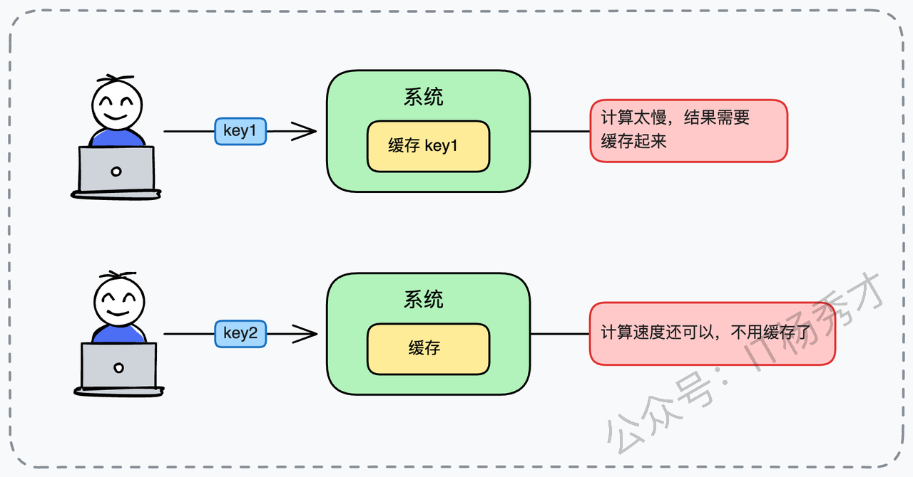
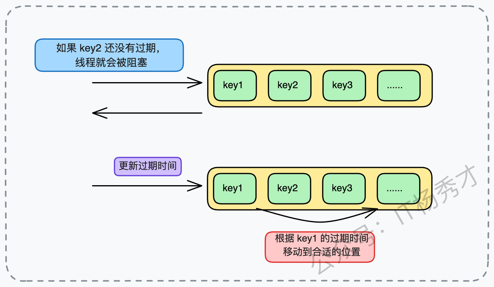
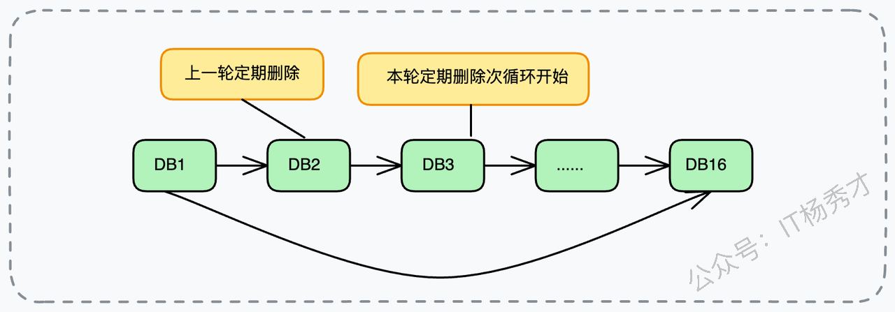
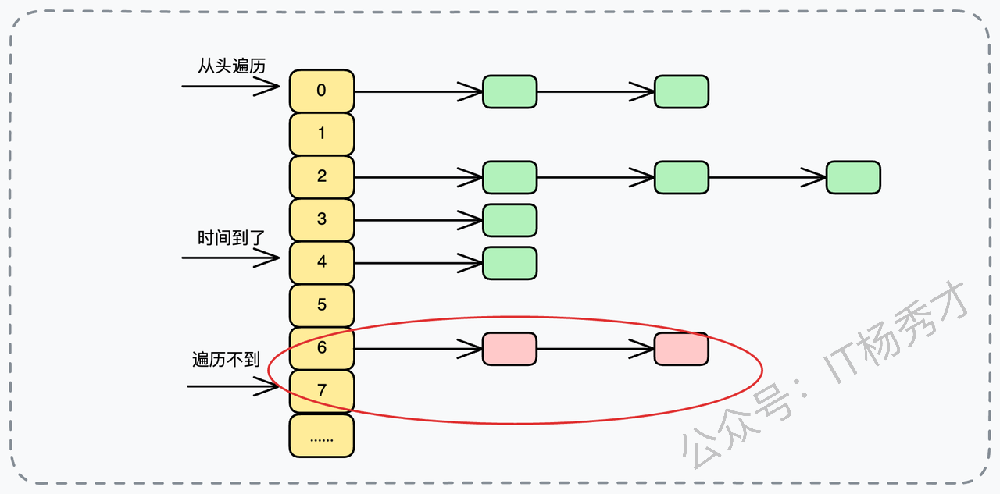
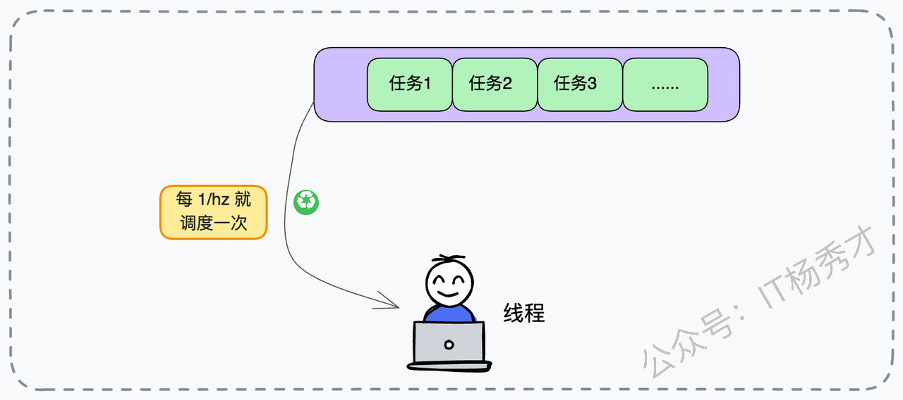
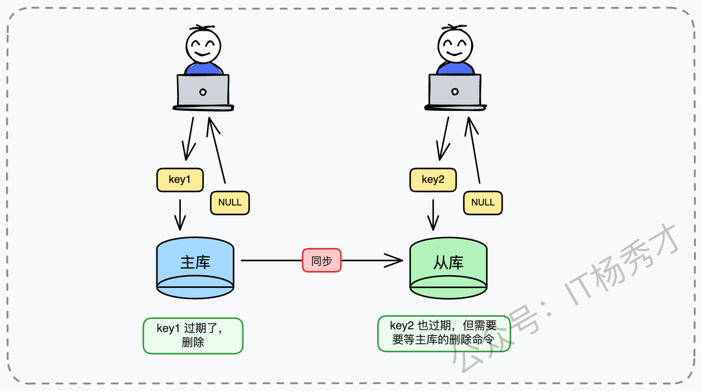
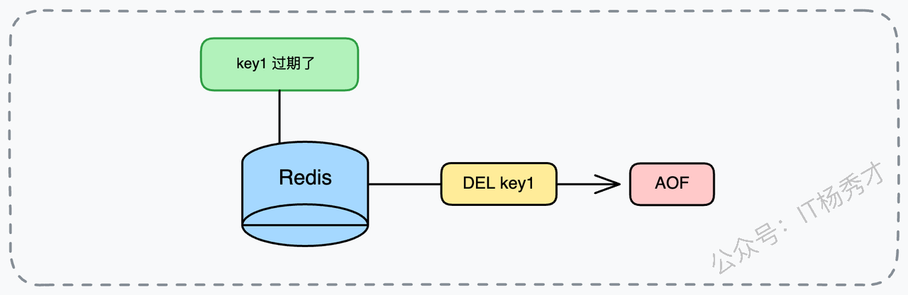
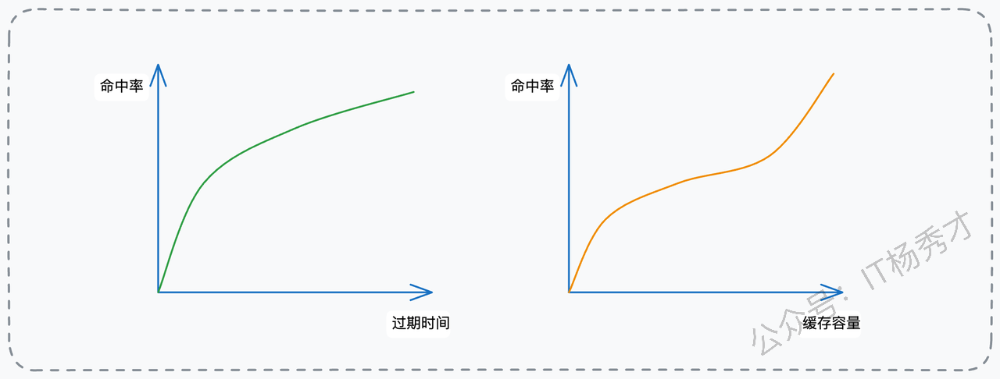

大家好，我是秀才。今天我们继续聊一聊后端架构中缓存。

在后端开发中，缓存随处可见，很多系统因为缓存设计得当而抗住洪峰。如果缓存使用不当也会导致严重的线上事故，甚至引起系统雪崩。

在技术面试中，缓存更是一个分水岭。它不仅能检验你对 Redis 等中间件原理的掌握程度，更能反映出你解决复杂工程问题的能力。很多候选人只知道 `set` 和 `get`，但对于“数据怎么失效”、“失效了怎么删”、“删除大 Key 会不会卡顿”、“主从不一致怎么解”这些深水区的问题，往往知之甚少。

今天，我们就先从**缓存过期机制**这个切入点，把缓存聊深、聊透。

# **1. 缓存命中率**

在设计缓存系统时，我们心中要时刻悬着一把尺子，那就是**缓存命中率**。它的计算逻辑虽然简单——**命中缓存的请求次数 / 总请求次数**——但它对系统性能的影响是非线性的。

我们可以做一个简单的数学推演：假设你的数据库查询平均耗时是 500ms，而 Redis 查询耗时是 5ms。

* 如果缓存命中率是 90%，那么平均响应时间 = 0.9 \* 5ms + 0.1 \* 500ms = 54.5ms。

* 如果命中率稍微下降到 80%，平均响应时间 = 0.8 \* 5ms + 0.2 \* 500ms = 104ms。

* 仅仅 10% 的命中率跌幅，会导致系统整体响应时间翻倍！ 这就是为什么我们在架构设计中要锱铢必较地优化命中率。

在绝大多数生产级的业务系统中，我们的架构目标通常是致力于将这个指标拉升到 **90%** 甚至是更高的水平。但这并不是一个绝对的铁律，因为它深受业务形态的制约。

举个全新的场景大家就明白了：

假设你正在维护一个**AI 图像生成的服务**。用户上传一张草图，系统利用大规模生成对抗网络（GAN）生成一张精美的海报。这个计算过程极其消耗 GPU 资源，耗时可能长达 10 秒。在这种场景下，即便只有 10% 的请求是重复的（比如用户刷新页面重试），我们也必须把结果缓存起来。因为一旦命中，节省的就是昂贵的 GPU 算力资源和用户难以忍受的 10 秒等待。在这里，缓存的价值不在于“高频”，而在于“高价值”。

反过来，如果你做的是一个**即时股价查询系统**。用户的请求量虽然是海量的，但股价数据每秒钟都在通过交易所的专线推送更新，计算逻辑非常轻量（可能只是从内存数据库读个数值）。这种数据的时效性要求极高，缓存的有效期可能只有几毫秒。在这种极端的写多读多且数据易变的场景下，维护缓存的一致性成本甚至高于直接查询成本，此时盲目引入缓存反而会成为系统的累赘。

这两种截然不同的业务场景，决定了我们对待缓存策略的态度：是追求极致的命中率，还是追求数据的极致新鲜度。

# **2. 缓存过期的四种技术**

从架构设计的上帝视角来看，要实现“数据过期删除”这个功能，业界早已沉淀出四种标准范式。它们各有千秋，也各有软肋。

## **2.1 定时删除**

这是一种追求极致精确的做法，它的核心理念是“绝不让过期数据在内存里多待一秒”。为了实现这一点，系统需要为每一个设置了过期时间的 Key 绑定一个专属的定时器（Timer），一旦时间归零，立即触发回调函数执行删除动作。

> **优势：**&#x5185;存极其友好。过期数据会被秒级清理，内存利用率达到理论最高值。
>
> **劣势：**&#x5BF9; CPU 来说却是一场灾难。试想一下，如果在大促期间，运营配置了 10 万个商品在晚上 12 点准时下架（过期）。当 00:00:00 这一秒到来时，CPU 会在瞬间被密集的删除任务回调占满。这就好比你正在处理双十一的下单洪峰，突然系统让你停下手里的活，去打扫卫生（删除数据）。这对于高并发系统来说是致命的，会导致正常的业务请求因为 CPU 资源耗尽而被阻塞或超时。

## **2.2 延迟队列**

这种思路是将所有带有过期时间的 Key 封装成对象，放入一个优先级队列（Priority Queue）中，利用队列的最小堆特性，让过期的 Key 自然浮动到队列头部。后台只需要启动一个轮询线程，不断地窥探（Peek）队头数据。如果队头数据没过期，说明队列里剩下的都没过期，线程可以睡眠等待；如果过期了，就 Poll 出来移除。

> **优势：**&#x76F8;比于定时器的一对一绑定，这种方式将分散的 CPU 压力转化为集中的轮询处理，减轻了突发压力。
>
> **劣势：**&#x7EF4;护队列本身的成本依然高昂。特别是在需要频繁修改 Key 过期时间的场景下（比如用户每访问一次 session，过期时间就要顺延 30 分钟），每次修改都意味着要在堆结构内部进行复杂的 sift-up 或 sift-down 重排序操作，时间复杂度为 O(logN)。在写入密集的场景下，这把全局锁会成为严重的性能瓶颈。

## **2.3 惰性删除**

这是一种典型的“拖延症”策略，也是“用时方恨少”的被动策略。系统完全不对过期数据做主动处理，直到下一次有请求来访问这个 Key 时，才会临时进行检查。

具体的逻辑是：当 `GET key` 请求到达时，系统先检查该 Key 的 TTL（Time To Live）。

* 如果 TTL > 0，正常返回数据。

* 如果 TTL <= 0，说明已过期，系统拦截请求，顺手删除该 Key，并向客户端返回 NULL。

> **优势：**&#x5BF9; CPU 极其友好，因为它杜绝了所有的无效计算，只处理“不得不处理”的数据。
>
> **劣势：**&#x5BF9;内存极度不友好。如果一大批数据过期后从此再无人问津（比如千万级别的历史日志数据），它们就会像“僵尸”一样永久占用内存空间。在长期运行的系统中，这会导致严重的内存泄漏，甚至触发 OOM（Out Of Memory）杀手。

## **2.4 定期删除**

这是对定时删除的一种折中改良。系统不再为每个 Key 计时，而是每隔一段固定的时间，比如 100 毫秒，就发起一次全局的“大扫除”。但它不是全量扫描，而是**随机抽样**扫描一部分 Key 并清理其中的过期数据。

> **优势：**&#x5728; CPU 算力和内存空间之间寻找到了一个平衡点。
>
> **劣势：**&#x96BE;点在于“火候”的掌握。扫得太频，CPU 负载过高，影响业务；扫得太慢，过期数据堆积，内存又会告急。这就需要极其精细的算法控制。

为了方便大家对比记忆，我整理了下面这张特性对比表：

| **类型** | **优点**                          | **缺点**                                                                    |
| ------ | ------------------------------- | ------------------------------------------------------------------------- |
| 定时删除   | 时间点可精确控制，对象一旦到期即可立即清理           | • 定时器自身会产生较大资源消耗• 当对象的失效时间被修改时，需要先取消原有定时任务，再重新创建新的定时任务                    |
| 延迟队列   | 删除时机准确，到期后可立刻触发删除操作             | • 延迟队列本身存在一定运行成本• 若对象的过期时间发生变化，需要在队列中重新调整其位置• 若队列不支持精确调整，可能只能先移除原对象，再重新入队 |
| 惰性删除   | 实现逻辑简单，开发成本低• 更新过期时间不会带来任何额外处理  | • 删除时机不可预测，对象到期后何时被清除完全依赖下一次访问• 容易造成内存占用，如果对象过期后始终未被访问，将长期滞留              |
| 定期删除   | 实现方式相对简单，维护成本低• 过期时间被修改不会影响现有逻辑 | • 删除不够实时，对象过期后必须等到下一轮扫描才可能被清理• 性能波动较大，若某次扫描时积累了大量过期对象，清理过程可能非常耗时          |

在 Redis 这样追求极致性能的中间件中，通常不会单打独斗，而是采用组合拳。Redis 选择的就是 **“惰性删除” + “定期删除”** 的双重保障策略。

# **3. 面试实战准备**

在去面试架构师或高阶开发岗位之前，你不能只准备理论，必须结合你自己的项目做深度复盘。这里我给大家列一份**自查清单**，这是面试官最喜欢深挖的领域。

首先，你需要对你的**业务全景图**了如指掌。你负责的系统中，具体是哪些模块使用了缓存？目前的线上命中率是多少？在业务高峰期，Redis 占用了多少内存？这些数据是你回答问题的基石。

其次，你要明确你的**决策依据**。你的缓存过期时间通常设置多久？是 5 分钟还是 1 小时？为什么是这个时间？

> * *反面教材*：“我就随便拍脑门定的 30 分钟。”
>
> * *正面回答*：“结合业务重试窗口是 15 分钟，为了覆盖重试周期，我设定为 20 分钟。”

再者，你要准备一些**棘手场景**的解决方案。有没有遇到过那种过期时间很难定的场景？你是怎么解决的？比如缓存预热（Cache Warming）策略是否和过期时间冲突？

最后，也是最能体现你能力的**调优经验**。你有没有动态调整过过期时间？比如把 1 小时调成 10 分钟，或者反过来？调整背后的逻辑是什么？带来的收益是什么？

如果你在简历里写了 Redis，面试官大概率会从原理层面发起进攻。针对这些，你可以准备以下这套组合拳来应对：

1. 你是如何科学设定过期时间的？

2. 如果时间设太长或太短，分别会引发什么架构风险？

3. 在不增加成本的情况下，怎么优化命中率？

4. Redis 内部到底是怎么删数据的？是立即删吗？

5. **高阶追问：如果过期的 Key 是一个有几千万元素的 Hash 表（BigKey），直接删除会发生什么？**

6. 在读写分离架构中，读从库会读到过期脏数据吗？

7. 持久化文件（RDB/AOF）里怎么记录过期数据？

# **4. 优化策略**

当我们谈论缓存过期时间的优化时，本质上是在做资源与体验的权衡。在实际的架构演进中，我通常会从两个截然不同的方向入手，来调整过期时间以适应业务变化。

## **4.1 适度调大过期时间**

就比如曾经接手过一个**新闻资讯流系统**的重构工作。在早期的设计中，考虑到新闻的时效性，团队将热点新闻的缓存时间保守地设置为了 5 分钟。但在实际监控中我们发现，即使过了 5 分钟，依然有大量用户在回看这些热点内容，且评论区的互动依然活跃。

这就导致了一个严重的**缓存击穿**问题：每隔 5 分钟，就会有一次大量的并发请求穿透缓存直达数据库，造成数据库 CPU 呈锯齿状飙升。

后来，我们大胆地将过期时间延长至 15 分钟。虽然这一调整使得 Redis 的内存占用上升了约 20%，但效果立竿见影：缓存命中率从 85% 飙升到了 95%，数据库的压力瞬间得到了释放，系统的整体响应速度也上了一个台阶。更重要的是，数据库 CPU 的波动变得非常平滑，不再有危险的尖峰。

## **4.2 针对性调小过期时间**

在另一个**电商大促项目**中，Redis 内存报警频繁。我发现团队为了省事，将所有商品的库存缓存统一设定为 1 小时。但通过流量分析我发现，秒杀类商品的流量特征是爆发式的，通常在活动开始后的 10 分钟内流量就断崖式下跌。这意味着 10 分钟后，这些数据就变成了“冷数据”，但它们依然要在内存里赖上 50 分钟。

于是，我采取了**分级过期策略**，将秒杀商品的缓存时间缩短到了 15 分钟。这一看似简单的动作，让 Redis 的内存利用率提升了 30%。我们把这些节省下来的宝贵内存空间，留给了真正需要长效缓存的用户个性化推荐数据，从而提升了整体的转化率。

# **5. Redis 过期机制的实现原理**

当你向面试官阐述完这些调优经验后，通常会被问到核心原理：“你说 Redis 用了定期删除和惰性删除，那它具体是怎么做的？”

这时候，你可以自信地抛出 Redis 的机制：**Redis 采用惰性删除作为防线，定期删除作为兜底。**

## **5.1 为什么 Redis 不采用立刻删除？**

这是一个经典的架构权衡问题，答案其实非常明确：**在现有的技术条件下，实现“立刻删除”的成本太高，得不偿失。**

我们可以推演一下，如果采用**定时器方案**，Redis 动辄存储上亿个 Key。如果给每个 Key 都挂载一个独立的定时器，CPU 的计算资源光是用来调度这些定时器就已经捉襟见肘了，根本没有多余的算力去处理高并发的客户端请求。Redis 的核心优势是单线程（主处理线程）下的极速 I/O，任何阻塞主线程的操作都是不可接受的。

此外，**延迟队列（Delayed Queue）** 虽然看似可行，但深究之下也有硬伤。首先是内存与并发的问题，在 Redis 这种高性能中间件中，维护一个巨大的优先级队列本身就极其消耗内存。而且，Redis 的写入操作非常频繁，如果每次写入都需要在延迟队列中进行 O(logN) 的插入或更新操作，这会严重拖慢 Redis 的写吞吐量。

所以，Redis 的设计哲学非常务实：**牺牲一点点内存空间的及时释放，换取极致的 CPU 吞吐能力。** 惰性删除加定期删除，正是这种哲学权衡下的最优解。

## **5.2 Redis 如何控制定期删除开销？**

既然无法做到立刻删除，必须依赖定期删除，那面试官紧接着就会挑战你：“如果定期删除要遍历所有 Key，Redis 岂不是要卡死？”

当然不会。Redis 采用的是一&#x5957;**“分治” + “随机” + “限流”&#x20;**&#x7684;精妙策略。假设 Redis 里存了 500 万个 Key，它绝不会一次性全扫一遍。它会轮询遍历内部的数据库（Database，默认 16 个）。

$$Image 4$$

具体流程是这样的：Redis 首先会检查当前 DB 是否有设置了过期时间的 Key（Redis 会维护一个独立的 `expires` 字典），如果没有则直接跳过。如果有，它不会遍历所有 Key，而是随机抽取一小批（比如 20 个）进行检查，将其中过期的删除。

这里有一个**核心的风控逻辑**：如果这 20 个 Key 里，过期的比例超过了 **25%**（这是一个硬编码的阈值），Redis 会认为当前 DB 的过期数据非常密集，于是**立即重复**上述抽样过程。这就像打扫卫生，如果扫了一把发现全是灰，说明这里很脏，必须多扫几把。

但是，为了防止这种循环无限进行导致死循环（比如所有 Key 同时过期），Redis 设置了一个**全局熔断机制**，也就是硬性的时间限制（Time Limit，通常是 CPU 时间的 25%）。一旦执行时间超过阈值，立刻强制中断当前任务，把 CPU 权交还给业务请求，并记录下当前遍历到的 DB 位置，以便下次继续。

这套逻辑保证了 Redis 既能清理数据，又不会因为清理任务过重而阻塞正常的读写。至于为什么是随机抽样而不是顺序扫描，是因为顺序扫描一旦被中断，下次很难低成本地回到断点继续。而随机抽样虽然不能保证 100% 覆盖，但从概率学上讲，只要样本够多，最终所有过期的 Key 都会被揪出来。这也解释了为什么有时候明明 Key 过期了，内存却没降下来——因为它运气好，还没被抽到。

## **5.3 BigKey 过期如何处理？**

> 这里我要补充一个很多文章没提到的高阶问题，也是我在面试中经常用来区分候选人的题目：**“如果过期的那个 Key 是一个包含 1000 万个元素的 Hash 表，Redis 会怎么处理？”**

按照传统的同步删除逻辑，释放 1000 万个元素的内存空间是一个非常耗时的操作（涉及到大量的内存页回收）。如果这个动作发生在主线程中，Redis 会瞬间卡顿，可能卡顿几秒钟。对于 Redis 这种微秒级响应的系统，几秒钟的卡顿就是灾难。

为了解决这个问题，Redis 4.0 引入了 **Lazy Free（惰性释放）** 机制。当 Redis 发现需要删除一个 BigKey 时，它不会在主线程里傻傻地同步释放内存，而是会将这个 Key 从字典中“解绑”（Unlink），并在后台线程（Bio Thread）中异步地释放内存。

所以，在生产环境中，开启 `lazyfree-lazy-expire` 配置是非常重要的架构优化手段，它能防止因为大 Key 过期而导致的系统抖动。

## **5.4 如何控制后台任务的频率？**

这里涉及到 Redis 的一个核心参数：`hz`。这个参数定义了 Redis 后台任务（Background Tasks）的执行频率。默认值是 10，意味着每秒执行 10 次，也就是每 100 毫秒执行一次定期删除逻辑。

在实际生产中，我们可以适当调整这个值。调大 `hz`（例如 100），意味着扫描更频繁，过期数据清理更及时，内存释放更快，但代价是 CPU 消耗会显著增加，因为系统需要更频繁地进行上下文切换。反之，调小 `hz` 会让 CPU 更轻松，但会有更多过期数据滞留在内存中。

通常我不建议大家人工乱改这个值。好消息是 Redis 5.0 以后引入了 `dynamic-hz`，它能根据当前的负载压力自动动态调整频率，这才是最佳实践。

## **5.5 主从架构下的过期陷阱**

在分布式场景下，从库（Slave）对于过期数据的处理方式，曾经是 Redis 的一个痛点。在 **Redis 3.2 版本之前**，存在一个严重的 Bug：当你去读从库时，如果那个 Key 已经过期但还没被清理，从库会直接把这个脏数据返回给你。这在某些对数据严谨性要求高的业务中是灾难性的。

好在 **3.2 版本及以后**，这个问题被彻底修复了。现在的逻辑更加严谨：当客户端读从库时，从库会先做逻辑判断，检查 Key 是否过期。如果过期，它会返回 `NULL` 给客户端，假装数据不存在。

**但是！请注意，从库绝不会自己删除这个 Key。** 为了保持主从数据的一致性，从库必须等待主库（Master）发过来一条 `DEL` 指令，才会真正释放物理内存。

这就导致了一个有趣的现象：如果主从网络有延迟，或者主库太忙没来得及发 `DEL`，你可能会发现从库的内存占用比主库要大，因为里面堆积了大量“逻辑过期但物理存在”的僵尸数据。这也提醒我们在做监控时，不仅要看主库，也要关注从库的内存异常增长。

## **5.6 持久化文件里的过期数据怎么办？**

Redis 必须要保证数据落盘的一致性，所以对 RDB 和 AOF 也有特殊的处理规则。

对于 **RDB（快照）** 来说，处理逻辑比较简单。在生成 RDB 文件时（执行 `SAVE` 或 `BGSAVE`），主库会自动过滤掉已过期的 Key，它们根本不会进入 RDB 文件。在加载 RDB 时，主库会继续忽略过期 Key，而从库则会**全盘接收**。不论是否过期，从库都会将 RDB 中的数据全部载入内存。这是因为从库的数据生杀大权在主库，它载入后会立刻通过主库同步过来的流进行清理。

对于 **AOF（日志）** 来说，情况稍有不同。在运行时，如果一个 Key 被惰性删除或定期删除了，Redis 会向 AOF 文件追加一条显式的 `DEL` 命令，以确保持久化文件中的操作记录与内存状态一致。而在执行 AOF 重写（Rewrite）时，机制类似于 RDB，重写进程会直接忽略掉已过期的 Key，因此新生成的 AOF 文件是干净的。

# **6. 架构实战落地**

理论讲完了，我们来看看怎么把这些知识落地。设定过期时间，本质上是在 **缓存命中率**、**内存容量**、**时效性** 三者之间做三角博弈。如果资源无限，我们当然希望数据永不过期，命中率 100%。但现实是残酷的，内存昂贵。通常我们根据业务的容忍度和访问模型来定。

这里我结合实际经验，分享三个极具代表性的实战案例，希望能给你提供设计灵感。

## **6.1 基于重试窗口的幂等性缓存**

在设计**订单支付系统**时，为了防止用户因为网络抖动重复提交订单，我们需要做幂等性校验。通常的做法是将订单号作为 Key 存入 Redis，以此来判断该订单是否正在处理中。

那么这个 Key 该存多久呢？这完全取决于你的业务重试逻辑。如果你的支付网关规定，支付结果查询的重试窗口是 15 分钟，那么这个幂等 Key 的过期时间就应该略长于 15 分钟，比如设定为 **20 分钟**。

* 如果你设得太短，比如 5 分钟，那么在 15 分钟的重试窗口内，Key 可能已经失效，防重机制形同虚设，可能导致重复扣款，造成严重的资金损失。

* 如果你设得太长，比如 24 小时，这些无效的 Key 会长期占用内存，造成资源浪费。

## **6.2 基于数据热度的分层策略**

在运营**社交内容平台**时，我们发现数据的热度随时间衰减非常明显。针对这种情况，我们可以采用分层过期的策略。

对于热点数据，比如当红明星刚刚发布的一条动态，瞬间流量巨大。对于这种数据，我们可以设定较长的过期时间，比如 6 小时，确保在流量高峰期它始终在缓存中，避免击穿数据库。

而对于冷数据，比如一年前发布的动态，用户查看的概率极低。我们可以将缓存时间设得很短，比如 5 分钟。逻辑是：如果偶然有人看了，就短暂缓存一下应对后续可能的少量访问；如果没人看，迅速释放，把宝贵的位置留给热点数据。

这里还可以补充一&#x4E2A;**“随机过期时间”**&#x7684;小技巧。为了防止大量 Key 在同一时间集体过期（缓存雪崩），我们通常会在设定过期时间时，加上一个随机值。例如：`expire = 600s + random(0-60s)`。这个小小的改动，能极大地平滑数据库的负载压力。

## **6.3 预加载与极速销毁策略**

这是一种比较高级的、用**空间换体验**的玩法。比如在**视频流媒体 App** 中，当用户正在津津有味地看第一集时，我们可以预测他大概率会点开第二集。于是，后台可以悄悄地、异步地加载第二集的开头片段信息到缓存中。

对于这种预测性缓存，由于用户不一定真的会点，为了防止内存浪费，我们会给它设置一个**极短的过期时间**，比如 **1 分钟**。这样做的效果是：

* 如果用户真的点了，秒开，体验极佳。

* 如果用户没点，1 分钟后自动清理，几乎不占资源。

这个方案在面试中是一个非常好的加分项，因为它体现了你对“业务场景”和“技术成本”的双重深层思考。

# **7. 小结**

回到最开始的问题，缓存真正考验的从来不是你会不会用 Redis，而是你是否具备在复杂约束下做权衡取舍的能力。过期机制看似只是一个 TTL 参数，背后却牵动着命中率、内存成本、系统稳定性与极端场景下的风险控制。理解 Redis 为什么选择“惰性删除 + 定期删除”，本质上是在理解一套成熟中间件如何用工程理性换取整体最优。真正优秀的架构设计，不追求绝对正确的方案，而是在具体业务场景中，做出最合适的选择——这，才是缓存设计的终点，也是你走向高阶工程师的分水岭。

## **学习交流**

> 如果您觉得文章有帮助，可以关注下秀才的<strong style="color: red;">公众号：IT杨秀才</strong>，后续更多优质的文章都会在公众号第一时间发布，不一定会及时同步到网站。点个关注👇，优质内容不错过

