今天我们来聊聊后端架构的缓存模式问题。在面试高阶工程师或架构师岗位时，缓存模式几乎是必考题。但90%的候选人在回答这个问题时都存在两个致命短板：一是**知识面不够全**，只知道最基础的那一两种模式；二是**理解不够深**，只能照本宣科，泛泛而谈。

特别是当面试官抛出一个杀手锏：“你怎么利用这些缓存模式来解决数据一致性问题？” 很多候选人就掉进了坑里，因为他们没意识到，**很多缓存模式本身就是一致性问题的制造者**。

这篇文章，秀才将结合多年的架构经验，带你去审视每一个缓存模式，剖析它们的优缺点，尤其是在数据一致性里的真实表现。接下来我们先从面试策略谈起。

## **1. 面试准备**

在准备面试前，你不能只靠死记硬背。作为架构师或者是资深后端开发，你需要对自己的知识库了如指掌。

首先，确保你不仅记住了这些模式的名字，还能画出它们的时序图。其次，你需要深挖一下你当前所在公司的实际情况：

1. 你们现在的系统架构中，到底落地了哪些缓存模式？

2. 在这些模式下，有没有爆发过数据不一致的生产事故？最后是怎么填坑的？

3. 在具体的业务流程中，引入缓存后，你是如何编排缓存更新与数据库更新顺序的？是否存在一致性隐患？

把缓存模式吃透，不仅能帮你应对数据一致性的难题，更是解决后续我们将会讲到的**缓存穿透**、**缓存击穿**和**缓存雪崩**这“三座大山”的基石。这两个话题紧密相连，在复习时要融会贯通。

为了让你更直观地理解，我们在脑海中构建一个简化的系统模型：你的应用服务需要同时操作缓存（Cache）和数据库（DB），所有的读写请求都在这两个组件之间周旋。

## **2. 面试切入**

在面试最开始的自我介绍环节，你就可以埋下伏笔。

> 你可以这样说：“我对高并发场景下的缓存模式有比较深刻的实践心得，在过往的项目中，我经常通过灵活运用不同的缓存模式，来解决系统面临的缓存穿透、雪崩以及热点击穿等问题。”

这短短一句话，既展示了你的技术深度，又自然地引出了后续的话题。面试官听到这里，大概率会顺水推舟地问：“那你详细说说，你都了解哪些缓存模式？或者在项目中用过哪些？”

这时候，你就可以如数家珍地抛出你的知识储备：

> “在业界主流的实践中，常见的缓存模式包括 Cache Aside、Read Through、Write Through、Write Back 以及 Singleflight。此外，虽然严格意义上不算标准模式，但在实际工程中，删除缓存和延迟双删也是我们经常采用的策略。”

这个回答既全面又接地气，覆盖了理论与实战。接下来，我们就一个个拆解这些模式。

## **3. Cache Aside**

Cache Aside可以说是业界应用最广泛的缓存模式了。Cache Aside的核心在于应用程序在数据流转中的定位。在这种模式下，缓存仅仅是一个辅助的数据存储，应用程序直接与数据库进行交互，并全权负责维护缓存与数据库之间的数据状态。

应用程序在这里扮演了数据流转的“总指挥”或“调度员”的角色，它需要同时感知并操作 DB 和 Cache 两个数据源，而不是让缓存组件去自动代理数据库的访问。

1. **写操作流程**

当业务发起写操作时，Cache Aside Pattern 遵循以下严格的执行顺序：

1. **更新数据库**：应用程序首先将变更的数据持久化到数据库中。

2. **删除缓存**：紧接着，应用程序直接将该数据对应的缓存 Key 删除，而不是尝试去更新它。

为了更直观地理解这个过程，请看下方的流程示意图：

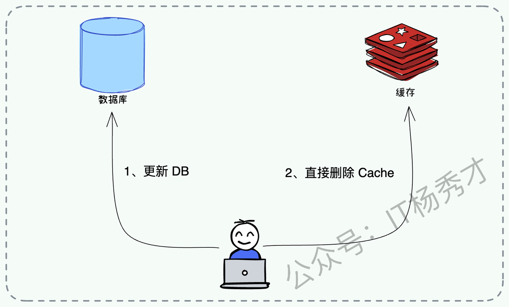

2. **读操作流程**

相较于写操作，读操作的链路稍微复杂一些，因为它涉及“命中”与“未命中”的分支处理：

1. **查询缓存**：应用程序首先尝试从 Cache 中获取数据。

2. **缓存命中**：如果在缓存中找到了数据（Hit），直接返回结果，流程结束。

3. **缓存回填**：如果缓存中没有数据（Miss），应用程序需要转向数据库发起查询。成功拿到数据后，**由应用程序显式地将数据写入缓存**，最后将结果返回给调用方。

读操作的详细流转逻辑如下图所示：

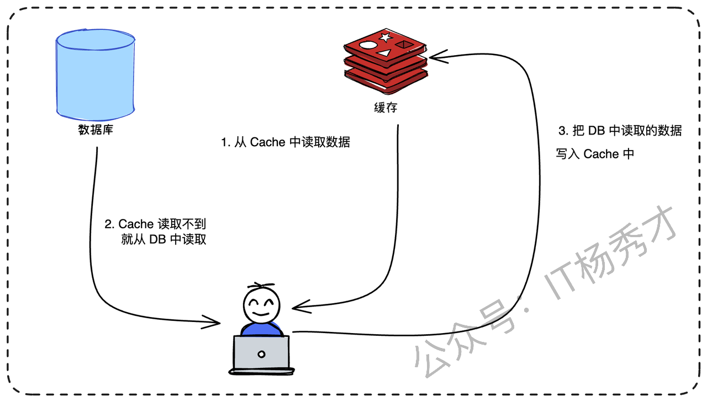

### **3.1 亮点展示**

如果你仅仅掌握了上述的操作步骤，那只能算是入门。在高级技术面试中，面试官往往会针对这些“标准步骤”进行连环追问，旨在考察你对并发一致性、性能权衡的深度理解。

1. **写操作为什么必须是“先更新 DB，后删除 Cache”？顺序能不能反过来？**

这是一个非常高频的陷阱题。**结论是：绝对不能反过来。**&#x5982;果你采取“先删除 Cache，后更新 DB”的策略，在高并发场景下，极易引发严重的数据不一致问题，且该脏数据很难自动恢复。

假设我们有一个商品库存的场景，当前库存为 100。

* **线程 A（写请求）**：准备将库存修改为 99。

* **线程 B（读请求）**：并发查询该库存。

如果顺序反了（先删后写），时序可能如下：

1. **线程 A** 执行，先删除了 Cache 中的库存数据。

2. **线程 B** 进场，发现 Cache 为空（Miss）。它立即去查 DB，但此时线程 A 还没来得及更新 DB，所以线程 B 读到的是旧值 100。

3. **线程 B** 将读到的旧值 100 写入 Cache。

4. **线程 A** 终于完成了 DB 的更新，将数据改为 99。

**最终结果：** 数据库里是新的 99，但缓存里永远停留在了旧的 100。后续所有的读请求都会命中这个脏数据，直到缓存过期。这在很多业务中是不可接受的。

2. **那“先更新 DB，后删除 Cache”就能保证数据一致吗？**

结论是：从理论上讲，它也不是绝对安全的，依然存在数据不一致的概率，但这个概率极低，工程上通常可以忽略。让我们看看这种“理论上的极端情况”是如何发生的：

这种情况发生的前提是缓存刚好失效（Empty），同时发生并发读写。

1. **线程 A（读请求）**：发现缓存未命中，去查询 DB，读取到了旧值（比如 100）。

2. **线程 B（写请求）**：在线程 A 读完 DB 但还没来得及回填 Cache 的瞬间，线程 B 介入了。它迅速完成了 DB 更新（改为 99），并且完成了删除 Cache 的动作。

3. **线程 A（读请求）**：此时才开始执行“回填缓存”的动作，它拿着刚才读到的旧值 100，写入了 Cache。

**最终结果：** DB 是新值 99，Cache 是旧值 100。**为什么说概率极低？** 这就涉及到了数据库与缓存操作耗时的对比。要发生上述情况，要求“线程 A 从读完 DB 到写入 Cache”这一小段逻辑的执行时间，竟然要比“线程 B 完成整个 DB 更新 + Cache 删除”的时间还要长。

在实际生产环境中，数据库的写操作（涉及锁、磁盘 I/O）通常比纯内存的缓存操作要慢得多。读请求通常也会比写请求快。因此，读请求“卡”在中间，正好让写请求完整执行完一整套流程的情况，发生的概率微乎其微。

## **4. 同步更新**

前面说的Cache Aside 是删除缓存的一种策略，那我们可不可以再更新完数据库之后，同步更新缓存呢？说实话，同步更新很难被称为一种设计好的“模式”，因为它本质上就是我们“什么都不封装”时的自然写法。在这个模式下，业务代码把缓存视为一个与数据库平起平坐的**独立数据源**。所有的逻辑判断、读写顺序，全靠业务代码自己来掌控。

先来看**写操作**。当业务需要更新数据时，由业务代码控制写入流程。

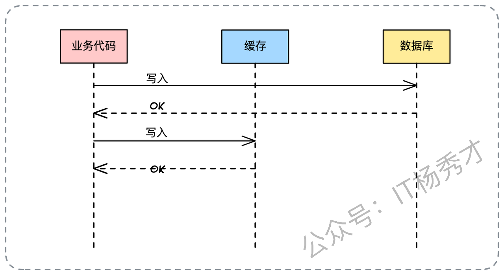

再来看**读操作**。同样是由业务代码亲自操刀。

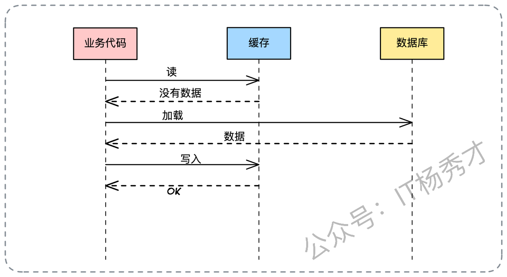

在这个环节，你需要向面试官介绍清楚读写的基本时序。它的核心逻辑是：业务代码显式地处理缓存和数据库。一般业界的最佳实践是**优先写入数据库**。

> 如果面试官追问：“为什么要先写库，而不是先写缓存？”

> 你要稳稳地接住：“因为在绝大多数核心业务场景中，**数据库才是数据的最终真理（Source of Truth）**。只要数据成功写入了数据库，我们就可以认为这次业务操作是成功的。即便随后的缓存写入或更新失败了，缓存本身有过期时间，或者下次读取时发现缓存缺失会重新加载，数据最终会恢复一致。”

讲完这些，你必须补上一句至关重要的总结，这是体现你架构深度的关键：

> “但是，老实说，无论是先写数据库还是先写缓存，这种同步更新的模式本身都无法保证数据的强一致性。”这句话往往会激起面试官的兴趣，他可能会问：“为什么都不能解决？在什么场景下会不一致？”

这时，你就可以用下面这张图来做降维打击。

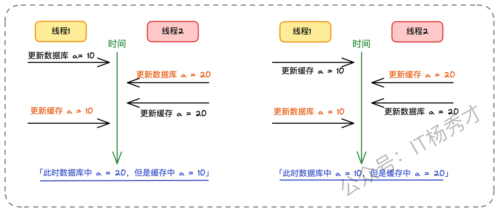

为了方便记忆，我教你一个口诀：**盯住图中的“线程2”，它总是姗姗来迟（后开始），却总是捷足先登（先结束）。**

举个具体的例子：假设我们库存原本是 100。

1. **线程1** 想要把库存更新为 10，它先更新了数据库（DB=10）。

2. 紧接着 **线程2** 想要把库存更新为 20，它动作很快，一口气更新了数据库（DB=20）并且更新了缓存（Cache=20）。

3. 这时候 **线程1** 才慢悠悠地执行它的第二步，更新缓存（Cache=10）。

结果是什么？数据库里是正确的 20，但缓存里却是过期的 10。如果不加控制，直到缓存过期前，用户看到的都是错误的库存。

## **5. Read Through**

**Cache Aside** 的问题在于业务代码太累了，既要管库又要管缓存。于是有了 **Read Through**，也就是**读穿透**模式。

它的核心理念是：**业务方你只管找缓存要数据，如果缓存里没有，缓存组件自己会去数据库加载数据，并把自己喂饱。**

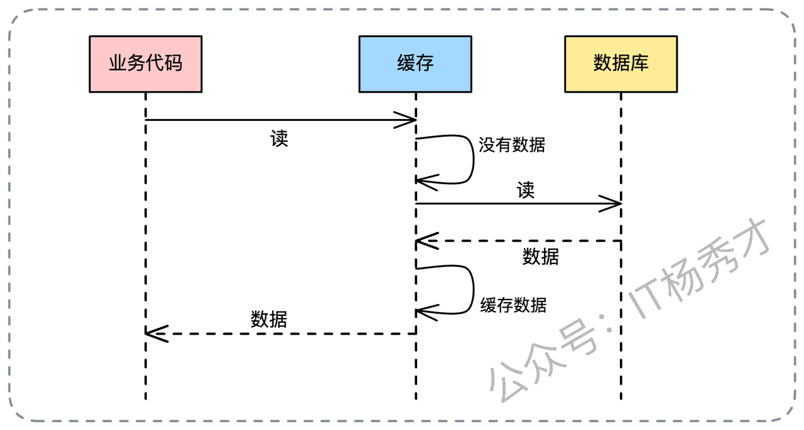

在写入方面，**Read Through** 通常和同步更新 保持一致，没有什么特殊魔法。

你可能会发现，Read Through 只是封装了“读”的逻辑，对于“写”的过程，它依然很原始。所以，它在数据一致性上的表现，和 Cache Aside 是半斤八两，依然存在并发导致的数据不一致问题。如果面试官问到这儿，你直接复用 同步更新的分析逻辑即可。

但是，Read Through 给架构师留了一个“后门”，这也是它的**高光时刻**——**异步化**。

### **5.1 亮点方案：异步加载**

当 Read Through 发现缓存未命中时，标准的做法是同步去查库。但我们可以把“加载数据”和“写入缓存”这两个动作解耦，引入异步机制。

1. **变种一：异步回写**

当从数据库查到数据后，立刻把数据返回给业务方，然后启动一个后台线程，异步地把数据写入缓存。

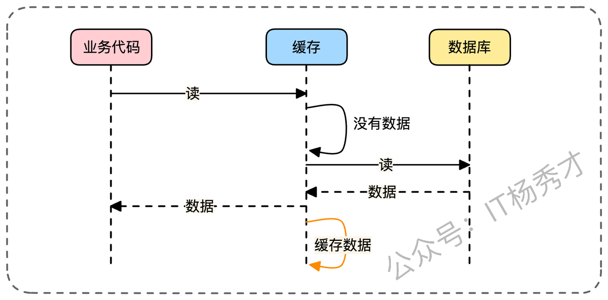

既然回写缓存可以异步，那能不能把从数据库加载数据也异步了？

2. **变种二：全异步加载**

这招更激进。当缓存未命中时，直接给业务方返回一个默认值或者错误码，然后由缓存组件在后台异步地发起数据库查询，并更新缓存。

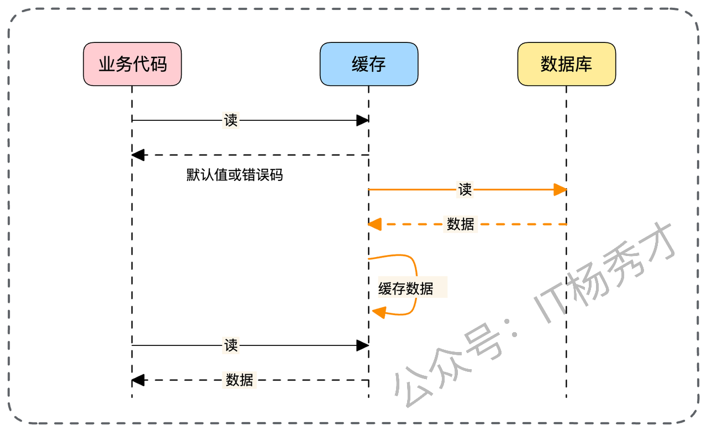

相比第一种变种，第二种的缺陷很明显：业务方在当次调用中拿不到真数据。

场景选择：

如果你的业务对**响应时间（RT）**&#x6709;着近乎变态的苛刻要求，可以考虑变种二。代价是业务方必须能容忍短暂的降级数据。而变种一的收益其实相对有限，除非你的缓存写入操作非常慢（比如要存储一个巨大的对象，或者需要进行复杂的序列化），这时候异步回写才有意义。

如果你在实际项目中用过这些变种，一定要结合具体的业务场景（比如电商的热门推荐列表、非关键配置信息等）来举例，说服力会倍增。

## **6. Write Through**

既然读可以穿透，写自然也可以。**Write Through**（写穿透）是指：当业务方需要写入数据时，**只负责写入缓存，然后由缓存组件代替业务方去更新数据库。**

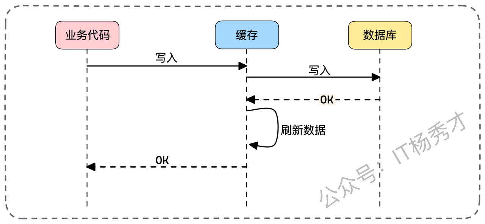

对于读操作，Write Through 和 Cache Aside 是一样的。

这里有几个细节值得注意：

1. Write Through 并没有强制规定是先刷库还是先刷缓存，但在实际落地中，为了数据安全，通常也是优先保证数据库落盘。

2. 如果缓存中原本没有这条数据，写入时要不要顺便更新缓存？一般策略是：如果预判这条数据马上会被读到，那就顺手刷新缓存；否则可以只写库，等下次读的时候再懒加载。

同样，Write Through 也没能解决并发写的一致性死结。

### **6.1 亮点方案：异步写的权衡**

和 Read Through 类似，Write Through 也可以玩异步。比如，写入缓存后，立刻给业务方返回“成功”，然后后台异步去写库。

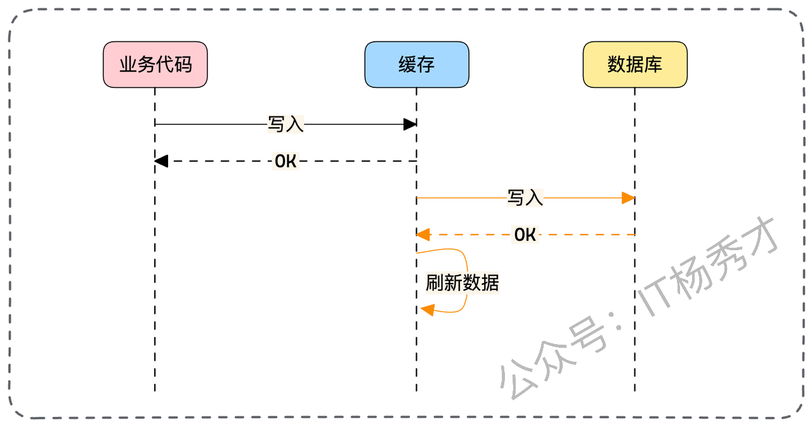

这种模式有一个致命硬伤：**丢数据**。如果缓存组件在回复“成功”后，还没来得及写库就宕机了，那这笔数据就彻底蒸发了。

稍微稳妥一点的变种是：同步写库，但是**异步刷新缓存**。

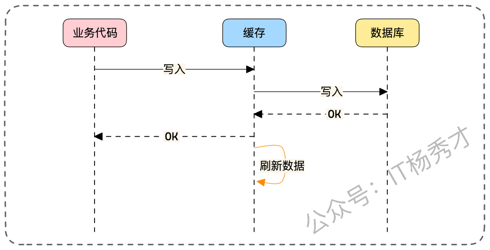

这种变种适合那种“写库很快，但刷缓存很慢”的奇葩场景（比如缓存结构非常复杂）。但无论哪种异步，风险都伴随着收益并存。

## **7. Write Back**

如果你追求极致的写性能，**Write Back**（回写）模式绝对是你的菜。它的特征非常鲜明：**写入数据时，只更新缓存，直接返回。数据库的更新被推迟到缓存数据过期或被逐出时触发。**

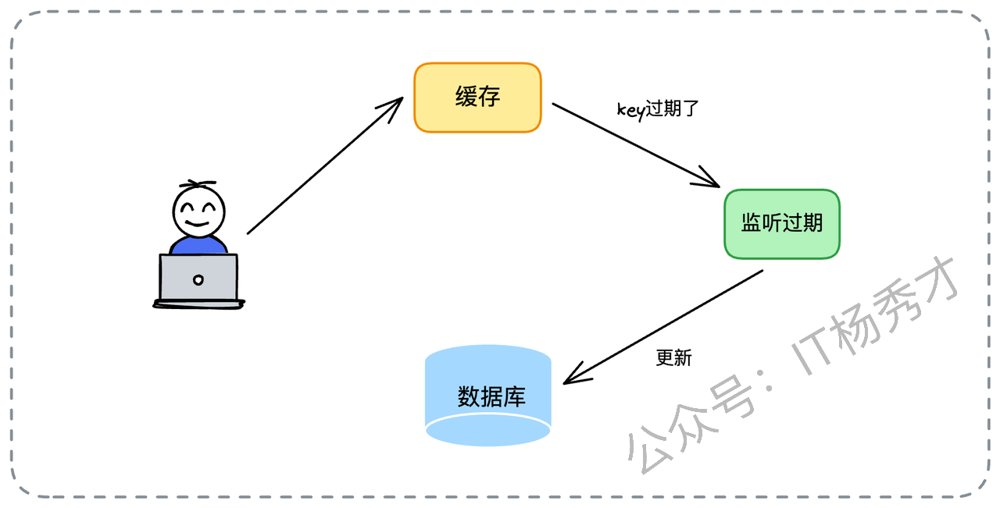

具体的流程是：业务代码只管写缓存。后台有一个守护组件监听缓存中 Key 的过期事件，一旦过期，就将最新数据刷回数据库。显而易见，这有个巨大的隐患：**如果缓存突然宕机，所有未刷回数据库的脏数据将全部丢失。** 这也注定了 Write Back 只能用于那些对数据丢失有一定容忍度，或者缓存层做到了极高可用性的场景。但这里有一个反直觉的结论，也是你可以用来惊艳面试官的亮点：

> “Write Back 虽然容易丢数据，但在数据一致性方面，它其实比 Cache Aside 表现得更好。”

为什么？我们需要分情况讨论。

如果是本地缓存（多节点），那肯定不一致。但如果是集中式缓存（如 Redis），在不考虑缓存崩盘导致数据丢失的前提下，它是可以做到逻辑闭环的。我们需要一步步引导面试官理解这个逻辑：

1. **第一步：写的一致性**

在使用 Redis 的场景下，因为所有的写操作都只更新缓存，对于业务方来说，读也是读缓存。在这个封闭的闭环里，业务方读到的永远是它刚刚写入的，数据是自洽的。 虽然数据库里的数据滞后了，但对业务无感。

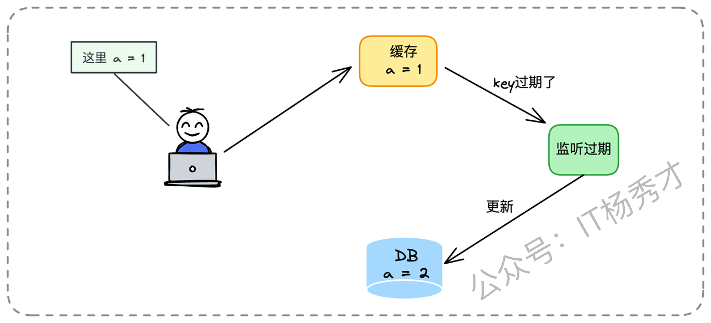

* **第二步：读的一致性隐患**

当业务方去读数据，发现缓存没了（过期或被逐出），需要去数据库加载。这时候可能会出问题：

1. 读请求去数据库捞到了旧数据（比如 `balance=100`）。

2. 还没来得及回填缓存，突然来了一个写请求，把缓存设为了新值（`balance=200`）。

3. 读请求动作慢了半拍，把旧数据（`balance=100`）回填到了缓存，覆盖了新值。

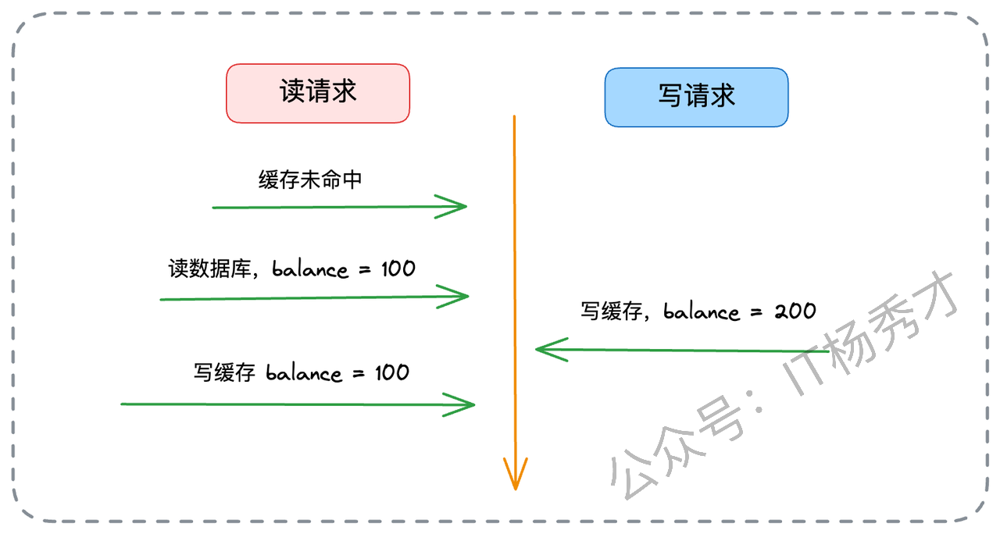

3. **第三步：解决方案**

解决思路也很经典——利用 Redis 的 SETNX 指令。

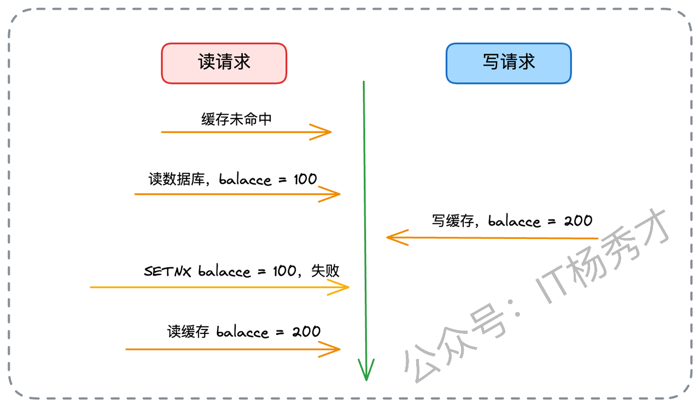

当读请求回填缓存时，不要直接 `SET`，而是用 `SETNX`（Set if Not Exists）。只有当缓存里真的没有数据时，才允许回填。如果缓存里已经有值了（说明被写请求抢先更新了），读请求就放弃回填，直接用缓存里的新值。

最后，你可以用一句总结来一锤定音：

> “因此，Write Back 除了有数据丢失的风险外，在缓存一致性的表现上，其实优于其他模式。”
>
> 这是一个比较激进的观点，使用时要观察面试官的反应。如果他比较保守，你可以改口说：“Write Back 极大地缓解了数据不一致的问题。”

## **8. Refresh Ahead**

**Refresh Ahead**（预刷新）模式在 **CDC**（Change Data Capture）技术普及后变得非常流行。简单来说就是：**业务方只管写数据库，通过监听数据库的 Binlog（比如利用 Canal 组件），来异步刷新缓存。**

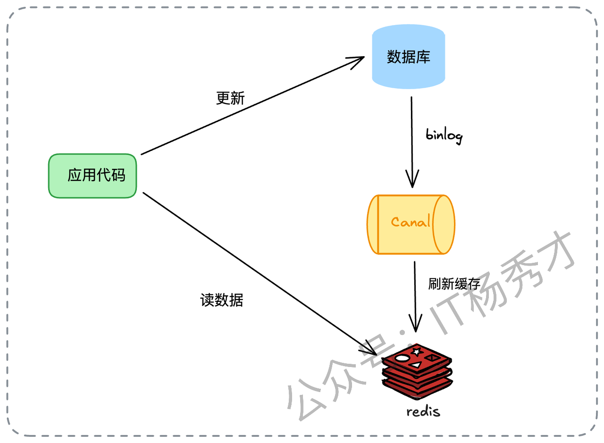

这种模式把缓存的更新逻辑从业务代码中剥离了出来。但它同样面临并发魔咒。

在数据写入数据库之后、Binlog 被消费并刷新到缓存之前，这段时间窗口内数据是不一致的。更糟糕的是读写并发场景：

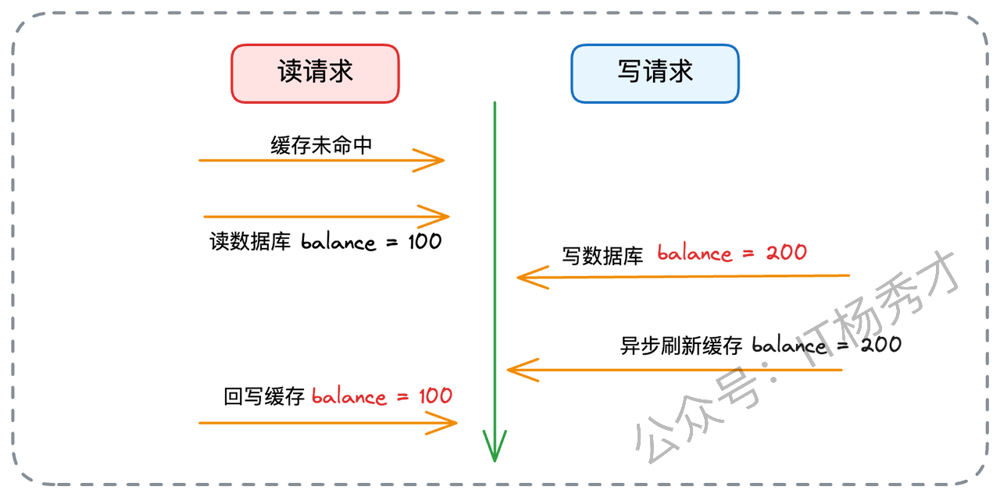

如果读请求在缓存未命中时去查库（查到旧值），恰好此时写请求改了库，并且 Binlog 异步刷新了缓存（新值）。读请求如果晚一步回填缓存，就会把新值覆盖掉。

解决方案和 Write Back 如出一辙：**在读请求回填缓存时，使用 SETNX。** 这样就能完美规避大部分并发导致的不一致。

## **9. Singleflight**

**Singleflight** 严格来说不是一种读写模式，而是一种**流量控制模式**。

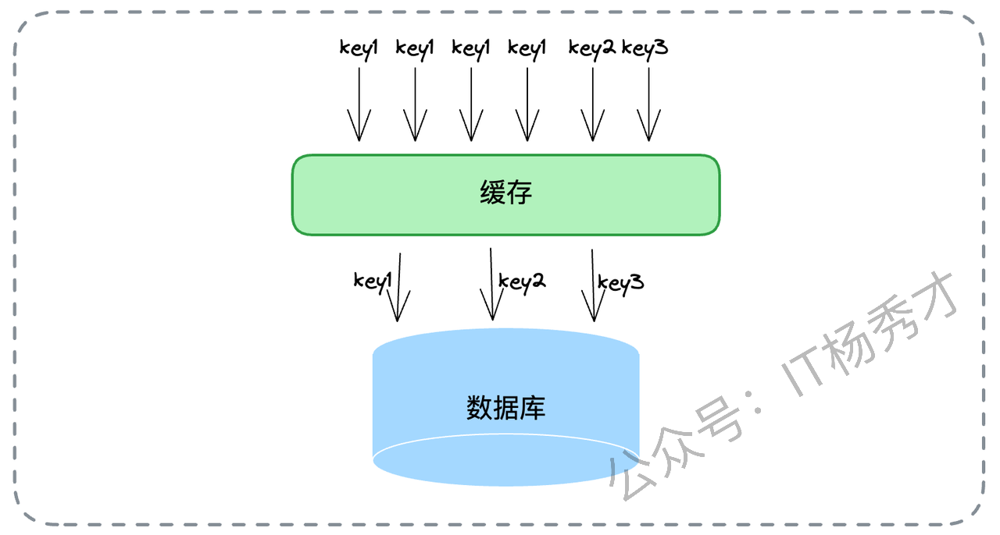

它的原理非常简单直接：**当缓存未命中时，如果同时有一万个请求去查同一个 Key（比如突发热点新闻），Singleflight 机制保证只有一个线程真正去数据库加载数据，其他 9999 个线程都在原地阻塞等待这个结果。**

这个模式的核心价值在于**保护数据库**，防止缓存击穿导致的数据库瞬间雪崩。

它最大的优点是极大地减轻了数据库的并发压力。缺点是如果并发量本来就不高，这套机制就显得有点鸡肋。所以它特别适合**热点数据（Hot Key）**&#x7684;场景。

## **10. 删除缓存**

这可能是业务开发中最常见的用法。也就是：**更新数据时，先更新数据库，然后直接把缓存删掉。**

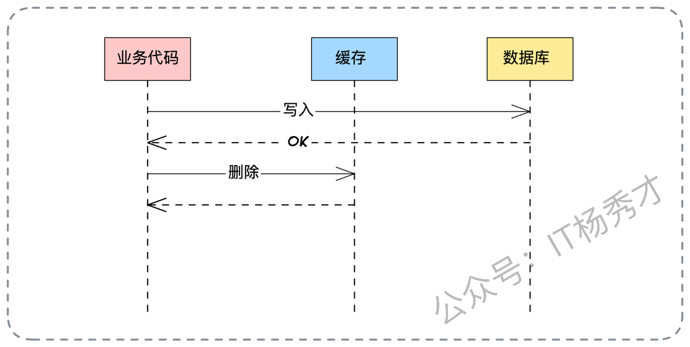

这种做法也可以结合 **Write Through** 模式来做：让缓存组件去更新数据库，然后缓存组件自己把自己删了。

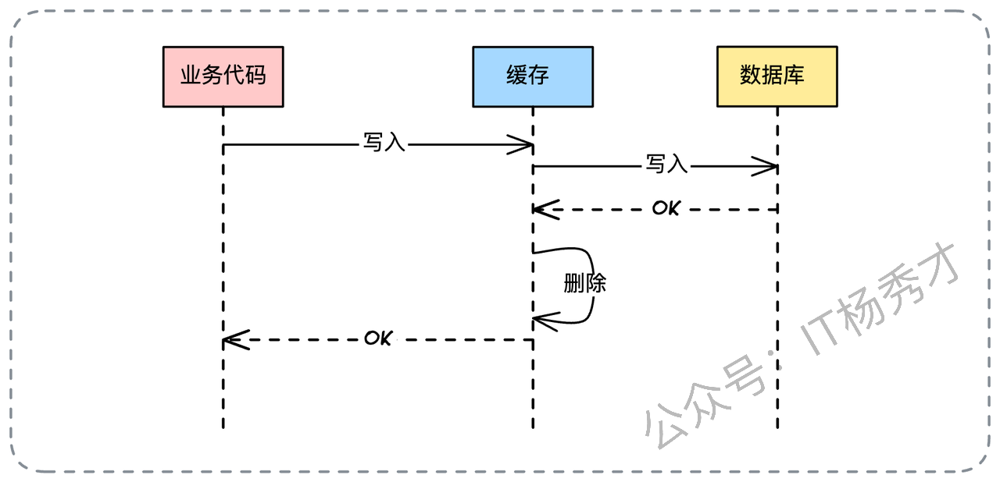

为什么是删，而不是更新？因为“更新”动作可能涉及复杂的计算，而且可能你费劲更新了缓存，结果一直没人读，浪费了性能。删除则是**懒加载**的思想。

但“先改库后删缓存”就没问题了吗？当然有。它的一致性隐患在于：**读线程缓存未命中** 撞上了 **写线程**。

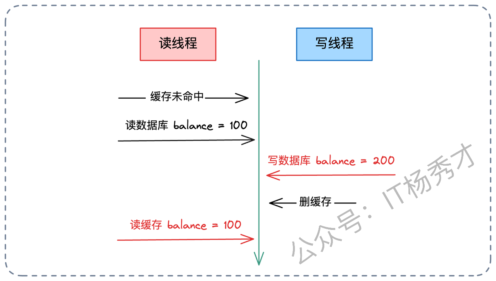

1. **读线程** 发现缓存空了，去查库，查到了旧值（`balance=100`）。

2. 在读线程回填缓存之前，**写线程** 进来了，改了库（`balance=200`）。

3. 写线程为了保证一致性，把缓存删了（虽然此时缓存本来就没数据）。

4. 这时候，**读线程** 才慢悠悠地把刚才查到的旧值（`balance=100`）写入缓存。

结果：数据库是 200，缓存是 100，脏数据出现了。

为了解决这个极低概率但理论上存在的 Bug，架构圈发明了**延迟双删**。

### **10.1 延迟双删**

看名字就知道，这个模式要删两次。

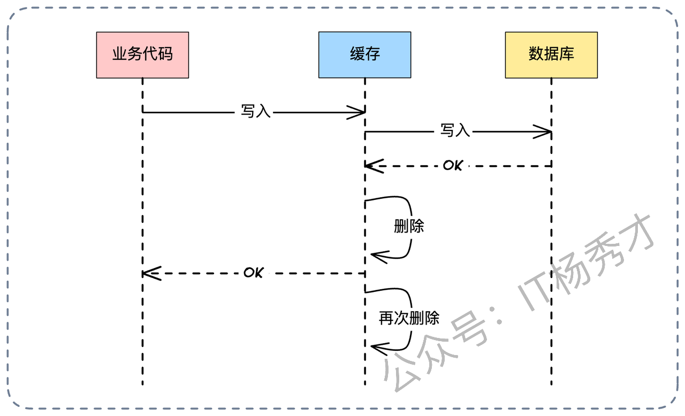

基本流程是：**先删缓存（可选） -> 写数据库 -> 删缓存 -> (休眠 N 毫秒) -> 再次删缓存。**

重点在于这**第二次删除**。为什么要有第二次删除？就是为了防备像上面提到的那个“读线程”把脏数据回写进去。

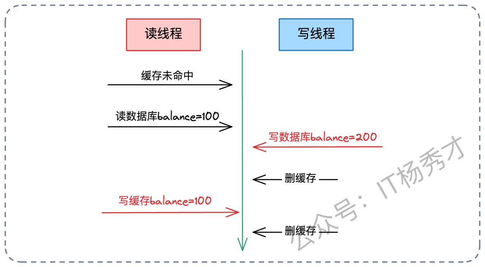

通过设定一个短暂的延迟（比如 500ms），让读线程有足够的时间把脏数据写完，然后我们再来一次“回马枪”，把这个脏数据删掉。那是不是就绝对完美了？从理论上讲，依然存在极端情况。比如读线程在第二次删除之后才回写缓存，那还是会不一致。

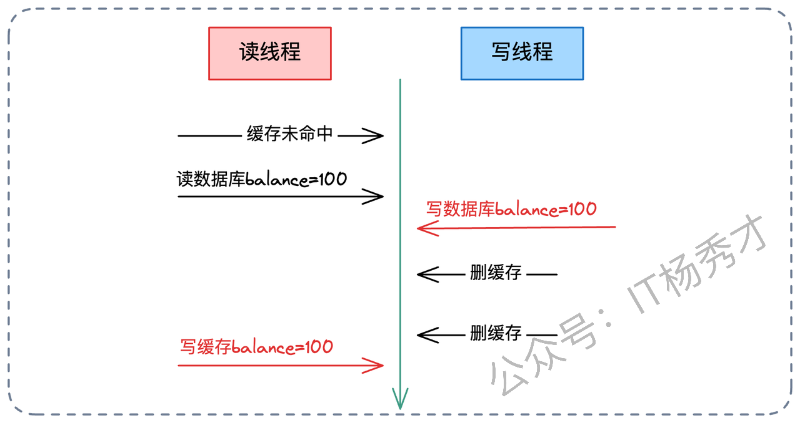

但在现实世界中，这种情况发生的概率比中彩票还低。因为数据库主从同步、网络传输的耗时通常远大于代码执行的耗时，只要你延迟的时间设置得当（覆盖主从同步延迟 + 几百毫秒），延迟双删基本能解决 99.99% 的问题。不过，延迟双删也有代价：

1. **降低了缓存命中率**：因为你删了两次，中间这段时间缓存是空的。

2. **增加了系统复杂度**：你需要维护延迟逻辑。

## **11. 缓存模式到底该选哪个？**

讲了这么多模式，面试官最后肯定会问你：“那在你的项目中，你建议用哪个？”

这时候切忌给出一个标准答案，因为**架构设计没有银弹**。任何一种模式都有缺陷。你可以这样回答：

> “实际上，选择哪种模式取决于业务的具体权衡。
>
> * 如果业务对**数据一致性要求极高**（比如金额），我们通常不走缓存，或者加**分布式锁**，但这会牺牲性能。
>
> * 对于大多数**常规业务**，如果你问我标准答案，我会推荐**延迟双删**。虽然它稍微降低了缓存命中率，但在我们的大部分业务并发量级下，这是一个性价比极高的方案，能覆盖绝大多数一致性问题。
>
> * 如果是**写多读少**，或者对数据丢失不敏感的统计类业务（如点赞数），我会尝试 **Write Back**。”

### **11.1 亮点：用装饰器模式落地缓存模式**

光说不练假把式。如果在面试中你想进一步展示你的代码架构能力，可以提一下**装饰器模式（Decorator Pattern）**。

> 你可以说：“在公司内部，为了避免业务团队乱用缓存模式，我设计了一套统一的缓存 SDK。我定义了一个标准的 `Cache` 接口，然后利用装饰器模式，无侵入地实现了上述的大部分模式。”

这里我给出一个 **Read Through** 模式的伪代码实现逻辑，供你参考：

```go
// 1. 定义标准接口
type Cache interface {
    Get(key string) any
    Set(key string, val any)
}

// 2. 定义 ReadThrough 装饰器结构体
type ReadThroughCache struct {
    c  Cache                  // 持有基础缓存实例（如 Redis 或 本地内存）
    fn func(key string) any   // 数据加载函数（回源逻辑）
}

// 3. 实现 Get 方法，植入 Read Through 逻辑
func (r *ReadThroughCache) Get(key string) any {
    // 先查缓存
    val := r.c.Get(key)
    // 缓存未命中
    if val == nil {
        // 调用回源函数加载数据
        val = r.fn(key)
        // 回写缓存
        r.c.Set(key, val)
    }
    return val
}
```

你可以这样包装你的项目经历：

> “我把这个设计封装成了通用的中间件。对于业务开发者来说，他们只需要初始化这个装饰器，传入数据加载逻辑，就能自动获得 Read Through 甚至 Singleflight 的能力，既规范了代码，又屏蔽了底层复杂性。”

这话说出来，面试官对你的评价绝对会上升一个台阶。

## **12. 小结**

这篇文章我们抽丝剥茧，层层深入地分析了 **Cache Aside**、**同步更新**、**Read Through**、**Write Through**、**Write Back**、**Refresh Ahead** 和 **Singleflight**，以及 **删除缓存** 和 **延迟双删** 策略。但是你要记住，缓存模式虽然多，其核心矛盾永远是**性能与一致性的博弈**。

当你能够清晰地指出每种模式在什么极端并发下会出问题，并且给出 **SETNX** 或 **延迟双删** 这样的解决方案时，你就已经超越了绝大多数候选人。希望这篇文章能帮你打通缓存架构的任督二脉，让你在项目实践和面试过程中都能有所收获

<div style="background-color: #f0f9eb; padding: 10px 15px; border-radius: 4px; border-left: 5px solid #67c23a; margin: 20px 0; color:rgb(64, 147, 255);">

## <span style="color: #006400;">**学习交流**</span>
<span style="color:rgb(4, 4, 4);">
> 如果您觉得文章有帮助，可以关注下秀才的<strong style="color: red;">公众号：IT杨秀才</strong>，后续更多优质的文章都会在公众号第一时间发布，不一定会及时同步到网站。点个关注👇，优质内容不错过
</span>


</div>
