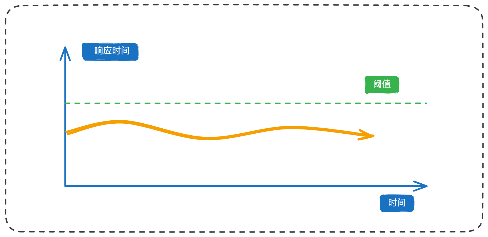

今天我们来继续聊聊高可用系统的另一个核心话题——**熔断**。

假设有这样一个场景，有个核心的订单服务，依赖于一个时常不稳定的第三方支付服务。当支付服务出现故障时，我们如何确保整个订单系统不被拖垮，甚至引发整个电商平台的雪崩？

这就不得不用到我们今天要讲的熔断机制了。是每个后端工程师都必须掌握的核心技能。我们不仅要懂它是什么，更要能说清楚，并且在实战中知道如何利用它来保护你的系统。

## **1. 什么是熔断？**

熔断，简单理解就是一种断流机制。简单来说，在微服务架构中，当某个下游服务因自身故障或过载而响应异常时，熔断器会介入，暂时“切断”对该服务的进一步请求，直到它恢复正常。

从上图就可以看出，熔断是一种主动拒绝机制。假设现在某个服务因为数据库慢查询导致CPU负载飙升至99%。此时请求量又在激增。有了熔断策略之后，系统就会主动拒绝这些请求。

## **2. 为什么需要熔断？**

一句话总结，熔断的主要作用就是避免服务雪崩。在深入介绍熔断机制之前，我们首先来看下一般的服务雪崩场景是怎么形成的

### **2.1 雪崩是怎么形成的？**

雪崩其实是分布式系统中一种连锁故障的现象，在一个分布式系统中，局部故障是不可避免的。如果不能将局部故障控制好，导致局部故障被正反馈循环，就会出现连锁故障，最终导致整体系统崩溃。一般来说，出现雪崩会经历以下三个阶段

1. **局部服务过载**

一切的开端，通常是系统中某个服务（我们称之为服务C）的处理能力出现瓶颈。导致过载的原因多种多样：可能是程序自身的Bug导致性能劣化；可能是流量洪峰超出了服务容量；也可能是部署的机器实例宕机，导致整体处理能力下降。

当服务的QPS超过其处理极限时，它会开始表现出响应变慢、内部资源（如内存、线程）消耗加剧等症状。这就像高速公路开始堵车，通行效率急剧下降。

* **资源耗尽与服务不可用**

随着过载情况的加剧，积压在服务C内部的请求会越来越多。这些积压的请求会持续消耗着服务器的内存、CPU、线程池甚至是文件句柄等宝贵资源。当其中任何一项资源被耗尽时，服务C就会开始大量报错，甚至频繁崩溃，最终对外呈现为“不可用”状态。

当服务C的某个实例崩溃后，上游的负载均衡机制会把原本发往这个实例的流量，自动转发给其它正常的的实例，这样的话，就加速了整个服务C集群的全面瘫痪。

* **故障沿调用链路逆向蔓延**

到这一步，就轮到服务C的上游调用者（服务B）遭殃了。由于服务C无法及时响应，服务B的请求线程会大量阻塞在等待响应上，这同样会快速耗尽服务B自身的线程和资源。很快，服务B也变得过载、不可用。

这个过程会像多米诺骨牌一样，沿着调用链路一路逆向传播（服务B -> 服务A），最终导致整个调用链上的所有服务全部瘫痪，系统发生“雪崩”。

### **2.2 熔断保护**

有了上面对雪崩理解之后，我们很容易想到为了避免这种情况，就需要在某个服务出现问题之后，我们主动掐断它就可以了，就类似于电路中的保险丝。

在软件架构中，熔断机制的设计实现也类似。它在服务的调用方内部，设置了一个监控哨兵。当它监测到对某个下游服务的调用，在一段时间内失败率持续过高时，就会主动“断开”连接，后续的请求将不再真正发出，而是直接在调用方内部快速失败，立即返回错误。

## **3. 熔断器的设计核心**

熔断器的作用很好理解，就是一个保险开关，达到阈值就关闭，服务性能恢复之后再次打开就可以了。我们在设计的时候需要抓住以下两个重点：

1. 如何判断服务出问题了？

2. 如何判断服务恢复正常了？

### **3.1 服务健康状态判定**

判断一个服务是否健康，这与我们在设计负载均衡时评估节点健康度的思路其实是一样的。本质上，我们需要基于业务场景选择合适的指标来量化服务的健康程度。最常用的指标包括**响应时间**和**错误率**。

无论选择哪个指标，我们都需要考虑两个核心要素：**阈值**的设定，以及是否需要**持续一段时间**才触发熔断。

以响应时间为例，这个阈值应该如何设定？这完全取决于业务需求。如果你的业务对用户承诺响应时间在800毫秒以内，那么阈值可以设定在800毫秒，或者稍微放宽一些，比如1秒，给予一定的容错空间。

如果产品经理没有给出明确的响应时间要求，你可以通过线上监控数据来确定。一个基本原则是，熔断阈值应显著高于正常的响应时间。比如，通过观察，你发现某个服务99.9%的请求都能在500毫秒内完成，那么你可以将熔断阈值设定为800毫秒。

一个设计良好的熔断器，也不会因为一次偶然的超时就立刻熔断。所以我们一般会要求这种异常状态持续一段时间，才进行熔断。这样做主要有两个目的：一是过滤掉偶发的网络波动或GC停顿导致的瞬时延迟；二是为了防止系统在“正常”与“熔断”之间高频切换，也就是我们常说的“抖动”问题。

这个异常事件到底持续多长时间我们再进行熔断呢，很大程度上依赖于经验。如果设置得太短，可能会因为一些瞬时抖动就频繁熔断恢复，影响系统稳定性；如果设置得太长，则可能导致问题服务迟迟得不到隔离，风险敞口过大。通常可以根据经验设定一个值，例如“在1分钟的滑动窗口内，有超过30秒的时间响应时间持续高于阈值”，才触发熔断。

### **3.2 如何优雅地恢复服务**

第二个核心问题是，服务在进入熔断状态后，如何优雅地恢复。一个服务因为响应过长而熔断了，它拒绝了所有新流量。在几分钟后，积压的任务处理完毕，服务本身可能已经恢复了正常状态。此时，它需要退出熔断状态，重新开始服务。

但是，许多主流的微服务框架在服务恢复这个环节做得相对简单。一种比较常见的做法是：触发熔断后，等待一个固定的时间窗口（例如60秒），然后直接将服务状态置为“正常”，让100%的流量重新涌入。

这种一刀切的恢复策略，就极易引起服务抖动。就比如说，假设因为流量过高已经熔断了一次，那么在等待60秒后，外部的请求洪峰可能并未消退。此时冒然全面恢复流量，服务立刻又面临被新一轮的流量高峰打垮，再次触发熔断。如此循环往复，就会造成服务不断抖动。

要解决这个抖动问题，关键在于恢复时必须控制流量的进入，不能搞硬着陆。正确的做法是逐步放开流量，实现软着陆。比如，在恢复期结束后，不立即恢复100%的流量，而是先放开10%的流量进行试探。如果这10%的请求都能被正常处理，响应时间也恢复到了正常水平，那么再逐步将流量提升到20%、50%，最终到100%。这个过程，我们称之为“半开（Half-Open）状态的探测。

这种渐进式的恢复方式虽然在一定程度上可以避免熔断恢复过程中的抖动问题，但是这种在服务端控制流量的方式依然有其局限性，因为服务端仍然接收了100%的请求，只是在内部丢弃了大部分。一个更优雅的思路是，让客户端也来主导这个流量恢复的过程。这就是接下来要介绍的面试亮点方案

## **4. 面试实战指南**

握了上述基础知识后，我们还需要将理论与实际工作相结合，才能在面试中游刃有余。在面试前，需要先梳理清楚自己项目中是如何应用熔断的：

1. 系统是通过哪些指标来判断某个微服务异常的？例如错误率、超时比例、平均响应时间等。

2. 当服务恢复正常时，又是依据什么标准来判定的？

3. 服务恢复之后，是否有额外措施来防止频繁切换带来的“抖动”问题？

4. 熔断触发后，流量是如何处理的？比如直接失败返回，还是通过缓存/降级服务兜底来保证用户体验？

在面试中，展示熔断知识的最佳策略，是将其作为你构建高可用微服务体系的一部分。例如，在介绍项目时，你可以这样开场：

> “为了确保我们这套核心交易系统的稳定性，我主导设计了一套立体的可用性保障方案，其中就包括了限流、降级和熔断等关键措施。”

如果面试官问及服务治理、系统可用性，或者某个服务崩溃了怎么办，熔断都是一个绝佳的切入点。

### **4.1 基础应对方案**

当面试官问到“你项目中用过熔断吗”或者“如何保障微服务可用性”时，你可以结合我们前面讨论的知识点，清晰地阐述你的实践。关键词是**持续超过阈值**。

> “在我们的核心服务中，为了保障整体可用性，我引入了熔断机制。针对不同服务的重要性，我设计了差异化的熔断策略。
>
> 比如，对于一个核心的商品查询服务，我们主要基于响应时间来熔断。根据线上监控数据，我们设定了当99%的响应时间在30秒的滑动窗口内持续超过1.5秒时，就触发熔断。触发后，新的请求会被快速失败，而服务内部正在处理的请求会继续完成。这样既保护了下游服务，也给了自身恢复的时间。”

此时，面试官可能会追问：

* **这个阈值是怎么来的？** 你可以回答是基于业务SLO要求和线上长期监控数据综合评估得出的。

* **为什么是持续30秒？** 你可以坦诚地回答这是基于经验的权衡，并解释时间过长或过短的利弊。

* **如何判断服务是否恢复？** 你可以回答，在熔断触发60秒后，系统会进入“半开”状态，先放行少量请求进行探测，如果成功率达标，再逐步放开全部流量，以避免抖动。

### **4.2 基于依赖的熔断**

这里，我提供一个更具场景化的创新方案，关键词是**关键依赖故障**。

> “除了常规的性能指标，我还设计过一个基于关键依赖的熔断方案。我们有一个订单服务，它强依赖于库存服务。如果库存服务不可用，那么所有创建订单的请求最终都会失败。
>
> 因此，我们的熔断策略是：一旦检测到对库存服务的调用连续出现5次以上的网络超时或500错误，就立即对订单创建接口进行熔断。如果不这么做，大量的失败请求会打到数据库，最终可能拖垮订单库。
>
> 熔断后，我们会启动一个独立的健康检查任务，每5秒钟调用一次库存服务的健康检查接口。一旦库存服务恢复，我们就退出熔断状态，恢复服务。”

这个方案巧妙地将业务与技术结合，体现了你对系统架构的深入理解。同时，这个方案还留下了可以引导面试官深入探讨的钩子：

* **缓存问题**：你可以顺势将话题引向缓存击穿、穿透、雪崩等经典问题的解决方案。

* **数据库保护**：除了熔断，你还可以引申到如何通过限流等手段来保护数据库。

最后，当你提到退出熔断状态时，如果面试官经验丰富，他很可能会问：“你是如何放开流量的？一次性全部放开吗？”这时，你就可以自然地引出抖动问题，并为接下来的亮点方案做好铺垫：

> “直接放开全部流量风险很高，容易产生抖动。我们采用的是逐步放开流量的方案。不过，这种在服务端控制的方式依然有优化空间，更理想的做法是与客户端的负载均衡策略相结合。”

### **4.3 熔断与负载均衡的联动**

其实应对面试的话，前面的回答基本上已经可以让你通过面试了，但如果你想给面试官留下深刻印象，展现你在服务治理上的深度思考，可以祭出下面这个融合了负载均衡与熔断联动的亮点方案。

我们之前讨论过，即使是在服务端逐步放开流量，服务端依然接收了全部请求，只是在内部进行了丢弃。这本身就是一种资源浪费。那么，为什么不从源头——也就是客户端——来控制流量呢？

结合我在负载均衡中提到的根据调用结果动态调整策略的思路，我们可以设计一个客户端感知的熔断恢复流程：

**整体流程如下：**

1. 服务端节点A因过载触发熔断，在返回给客户端的响应中，携带一个特定的错误码或头部信息，明确告知“我已熔断”。

2. 客户端（或其代理，如Service Mesh）收到这个熔断信号后，会立即将节点A从其本地的可用服务列表中**临时摘除**。后续的新请求将不会再路由到节点A。

3. 客户端等待一个预设的时间窗口（比如30秒）后，将节点A置为“半开”状态，并**试探性地**发送一小部分请求（比如单个请求或1%的流量）到节点A。

4. 如果试探请求成功，客户端会逐步加大流向节点A的流量，最终将其完全恢复到可用列表中。

5. 如果试探请求再次失败（例如又收到了熔断信号），客户端会再次将节点A从可用列表中摘除，并可能进入一个更长的熔断冷却周期（指数退避策略）。

6. 这个过程循环进行，直到服务端节点A完全恢复稳定。

在面试中，你可以这样阐述，关键词是**客户端负载均衡**：

> “我们最终采用的方案，是让客户端的负载均衡器与服务端的熔断状态进行联动，实现智能的流量控制。
>
> 整体思路是，当服务端节点触发熔断时，它会返回一个明确的熔断信号。客户端收到该信号后，会主动将这个节点在其负载均衡策略中标记为**不可用**，并在一段时间内避免向其发送请求。等待期过后，客户端会发起健康探测请求，如果节点恢复，就逐步恢复流量；如果依然熔断，就延长其隔离时间。这种方式将故障隔离和流量恢复的决策前置到了客户端，实现了更快速、更高效的故障转移和恢复。”

讲到这里，你甚至可以主动提出一个边缘案例来展示你思维的严谨性：

> “当然，这个方案也需要一个兜底策略。如果因为底层依赖（比如整个数据库集群故障）导致某个服务的所有节点都触发了熔断，客户端会发现无可用节点。这种情况超出了熔断和负载均衡能解决的范畴，需要依赖监控告警系统通知人工介入处理。”

## **5. 小结**

总而言之，熔断机制作为构建高可用微服务架构的基石，其设计的精髓远不止于简单的开关。从基础的基于阈值触发，到考虑半开状态的试探恢复，再到最终将熔断状态与客户端负载均衡策略深度联动，熔断策略一步步优化，系统的性能也在一步步提升。这种联动方案不仅从源头上避免了恢复期的服务“抖动”问题，更将故障隔离的责任前置，实现了真正快速、优雅的故障转移。深刻理解并实践这种从全局视角出发的设计思想，才能真正设计出一个切实可行的熔断方案

# 资料分享
随着AI发展越来越快，AI编程能力越来越强大，现在很多基础的写接口，编码工作AI都能很好地完成了。并且现在的面试八股问题也在逐渐弱化，**面试更多的是查考候选人是不是具备一定的知识体系，有一定的架构设计能力，能解决一些场景问题**。所以，不管是校招还是社招，这都要求我们一定要具备架构能力了，不能再当一个纯八股选手或者是只会写接口的初级码农了。这里，秀才为大家精选了一些架构学习资料，学完后从实战，到面试再到晋升，都能很好的应付。**关注秀才公众号：IT杨秀才，回复：111，即可免费领取哦**

## **学习交流**

> 如果您觉得文章有帮助，可以关注下秀才的<strong style="color: red;">公众号：IT杨秀才</strong>，后续更多优质的文章都会在公众号第一时间发布，不一定会及时同步到网站。点个关注👇，优质内容不错过

