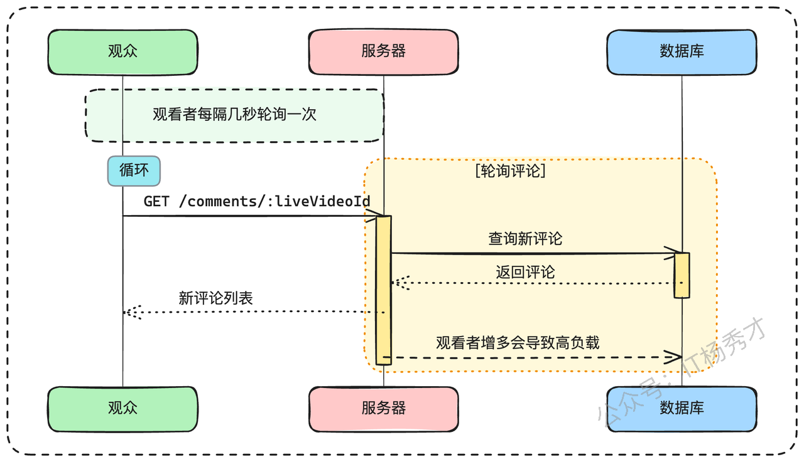
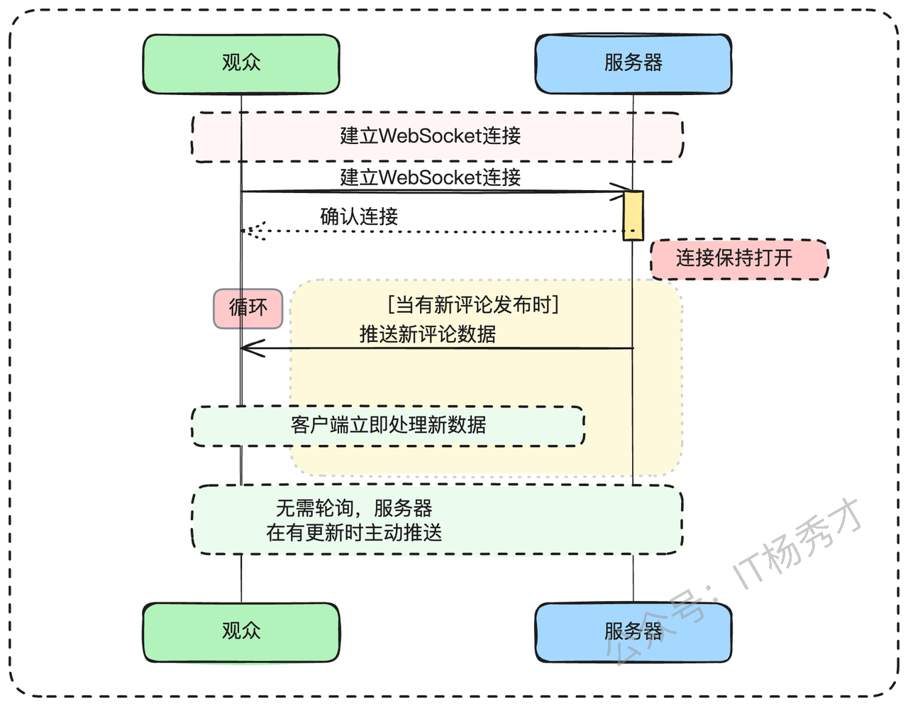
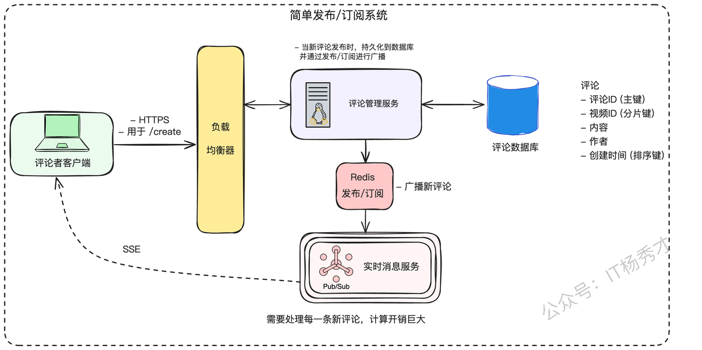
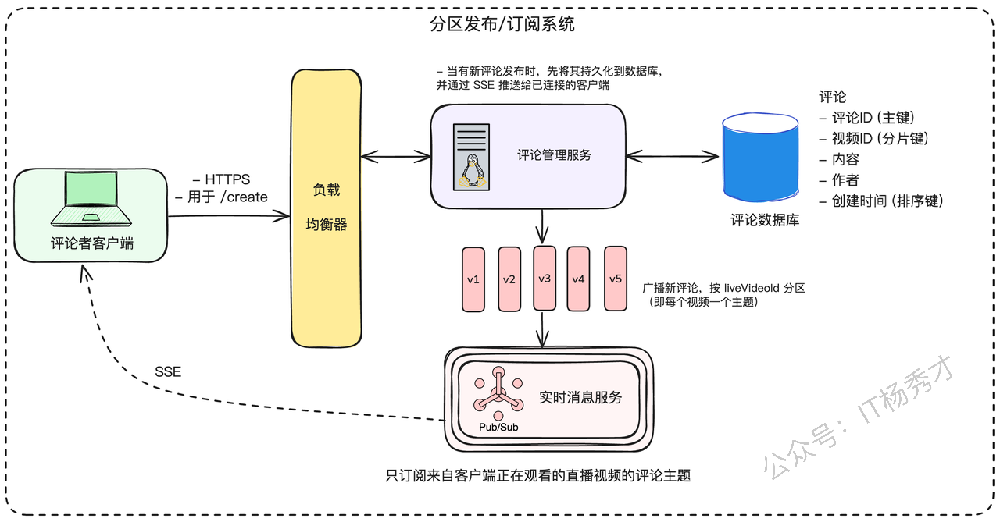
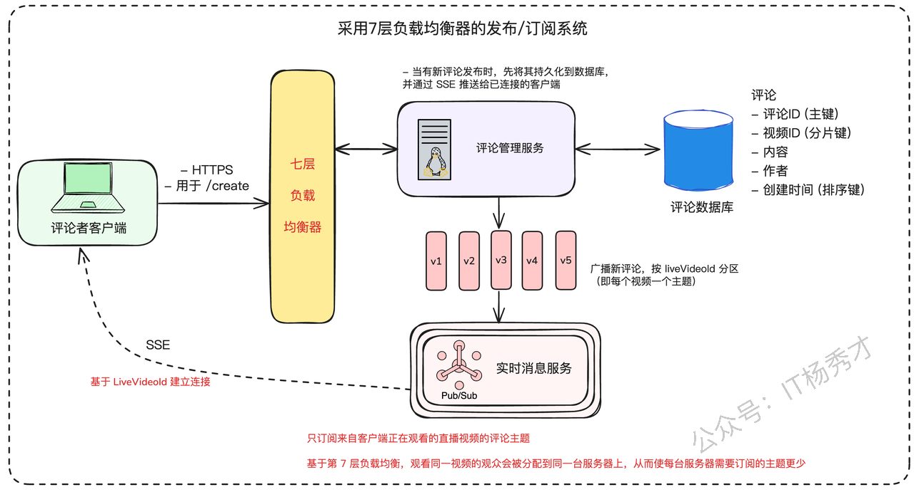

大家好，我是秀才。今天，我们来聊一个后端面试中的经典系统设计题目：如何设计一个百万用户在线的直播评论系统，类似抖音或B站的弹幕功能。设计直播评论系统其实和前面我们设计过的“URL短链，限流器”这类问题一样，考验的是架构师的全局视野和深度思考能力。它要求我们深入分析一个看似直观的功能，并揭示其在海量并发场景下，关于实时消息、数据存储、服务扩展和系统高可用性等方面的复杂技术挑战。

接下来，我将采用面试官与候选人对话的方式，引领大家对这个问题进行一次全面的深度剖析，一步步搭建起一个能够应对百万级并发、稳定可靠的直播评论系统架构。希望通过这个过程，能让你在技术面试中面对系统设计问题时思路清晰，脱颖而出。

## **1. 需求梳理与边界界定**

> **面试官**：“我们来聊聊系统设计吧。如果要你来设计一个类似 B站 的直播评论系统，你会怎么着手？”

系统设计这类开放性问题，我们的第一步，永远是和面试官清晰地对齐需求，明确我们要构建的系统边界。

> “好的，面试官。对于一个直播评论系统，我们首先需要明确其核心的功能需求和在特定规模下的非功能需求。”

### **1.1 功能需求**

**核心需求：**

1. **发布评论**：观众可以在正在直播的视频中发布自己的评论。

2. **实时查看**：正在观看直播的观众，应该能近乎实时地看到新发布的评论。

3. **历史评论**：新加入直播间的观众，也应该能看到在他们加入之前已经发布的历史评论。

**非核心需求：**

1. 评论的回复功能（即楼中楼）。

2. 对评论进行点赞或送出表情回应。

### **1.2 非功能需求**

明确了系统要“做什么”之后，我们需要向面试官确认系统的规模预期。我们设计的系统，是服务于一个几百人观看的小型直播，还是一个需要支撑数百万并发观众的大型平台？系统的规模将直接决定我们的架构选型。

> **面试官**：“假设我们的目标是支持大型活动，可能会有数百万观众同时在线，每个直播间每秒都可能产生数千条评论。”

这个量级，一下子就将设计的挑战性拉满了。基于此，我们可以推导出具体的非功能性需求：

**核心需求：**

1. **高扩展性**：系统需要具备水平扩展能力，以支持数百万并发观众，以及每秒数千条评论的高吞吐量。

2. **高可用性**：系统应优先保障可用性。在分布式环境下，可以接受最终一致性，因为评论的短暂延迟或顺序上的微小差异是可以容忍的。

3. **低延迟**：评论需要以近乎实时的方式广播给所有观众，端到端的延迟应控制在200毫秒以内。

**非核心需求：**

1. 安全性：如用户认证、授权等。

2. 内容完整性：如评论内容的审核、反垃圾、反仇恨言论等。

最后，我们可以将需求整理成一个清晰的表格，如果在面试现场有白板，清晰地展示出来会是一个很好的习惯。


## **2. 底层设计**

> **面试官**：“需求很清晰。接下来你打算如何进行底层设计？”

“我倾向于从宏观到微观，先定义出系统的核心实体，这有助于我们理清系统的基本构成要素和它们之间的关系，为后续的API设计和数据建模打下坚实的基础。我们可以把这些实体看作是系统的‘名词’。”

### **2.1 核心实体定义**

在这个特定问题中，我们只需要关注三个核心实体：

* **用户 (User)**：系统的参与者，可以是发布评论的观众，也可以是直播的发起者（主播）。

* **直播视频 (Live Video)**：评论所依附的主体，即用户正在观看的直播内容。这部分可能由其他团队维护，但与我们的系统紧密相关。

* **评论 (Comment)**：用户在特定直播视频中发布的消息文本。

在设计的初期，我们不必过早地陷入每个实体具体包含哪些字段的细节中。先确立这些核心概念，随着设计的深入再逐步完善数据模型。

### **2.2 系统接口设计**

实体明确后，我们就可以为每个功能需求设计对应的API接口了。这种循序渐进的方式能帮助我们保持专注，有效管理设计范围。

首先，我们需要一个接口来让用户发布评论。

```shell
// 向指定的直播视频流中创建一条新评论
POST /comments/:liveVideoId

// 请求头中需要包含用户身份认证信息
Header: JWT | SessionToken

// 请求体
{
  "message": "这个直播太精彩了!"
}
```

**这里有一个值得注意的安全细节**：`userId` 并不是通过请求体传递的，而是从请求头中的会话令牌（Session Token）或JWT中解析出来的。这是现代Web服务的标准实践，客户端负责在请求头中携带认证信息，服务端验证令牌并提取用户信息。这种方式可以有效防止用户通过篡改请求体来伪造身份，从而冒充他人发言。

其次，我们需要一个接口来获取历史评论。

```shell
// 获取指定直播视频的历史评论
GET /comments/:liveVideoId?cursor={last_comment_id}&pageSize=10&sort=desc
```

**同样需要注意**，这个接口中我们预先设计了 `cursor` 和 `pageSize` 参数，这表明我们从一开始就考虑到了分页加载历史评论的场景，而不是一次性返回所有数据。关于分页的具体实现方式及其优劣，我们稍后会深入探讨。

## **3. 高层架构设计**

有了接口定义，我们就可以开始搭建系统的高层架构了。让我们遵循敏捷思想，先从满足最核心的功能需求开始，构建一个最小可行产品（MVP），然后逐步迭代，使其满足所有要求。

### **3.1 观众如何发布评论？**

> **面试官**：“实体和接口定义清楚了。那么从架构层面看，我们先来解决第一个核心需求：如何让观众成功发布一条评论？”

> “这个流程相对直接。我们可以设计一个三层架构：客户端、服务端和数据库。”


1. **评论客户端 (Client)**：可以是Web页面或移动App，用户在这里输入评论内容并发起请求。它负责用户身份认证并将评论发送至后端服务。

2. **评论服务端 (Service)**：一个后端的服务，负责创建和查询评论。它接收、校验客户端的请求，并将评论数据持久化。

3. **评论数据库 (Database)**：用于存储评论数据。这里我们可以选用像**AWS的DynamoDB、阿里云的Table Store (OTS)  这样的NoSQL数据库**，它的高可扩展性和性能非常适合这种写入密集且数据结构简单的场景。当然，传统的 **PostgreSQL** 或 **MySQL** 在项目初期也完全适用。

用户发布一条新评论的完整流程如下：

1. 用户在客户端（如手机App）上输入评论并点击发送。

2. 客户端调用 `POST /comments/:liveVideoId` 接口，将评论内容发送到评论服务端。

3. 评论服务端接收到请求，完成必要的校验后，将评论内容以及用户信息、时间戳等存入评论数据库。

至此，我们就完成了一个最基础的评论发布功能。但这只是故事的开始，真正的挑战在于如何将这条评论展示给成千上万的观众。

### **3.2 观众如何看到新评论？**

> **面试官**：“很好，评论已经存进数据库了。那接下来，如何让直播间里所有其他观众都近乎实时地看到这条新评论呢？”

这是一个关键问题。我们可以从最简单的方案开始思考：**轮询 (Polling)**。

> “一个可行但效率较低的初级方案是，让每个观众的客户端每隔几秒钟就向服务器发起一次请求，询问有没有新的评论。我们可以使用 `GET /comments/:liveVideoId?since={last_comment_id}` 这样的接口，客户端带上自己看到的最后一条评论的ID，服务端则返回此ID之后的所有新评论。”



> 这个方案虽然能工作，但它的可扩展性极差。想象一下，一个有100万观众的直播间，如果每人每3秒轮询一次，那么我们的服务器和数据库将要承受 `100万 / 3 ≈ 33万` QPS的压力，而绝大多数请求返回的都是空结果，这造成了巨大的资源浪费。为了满足‘近乎实时’的需求，轮询间隔必须缩短到毫秒级，这将使问题变得更加棘手。因此，轮询方案在当前场景下是不可行的。”

在面试中，从一个简单的、甚至是你知道有缺陷的方案开始，然后分析其不足并引出更优的方案，是一种非常好的沟通策略。这能展示你循序渐进、权衡利弊的思考过程。

### **3.3 观众如何看到历史评论？**

> **面试官**：“我同意轮询不是个好办法，我们稍后再探讨更好的实时方案。现在先考虑另一个需求：当一个新用户刚进入直播间时，他如何看到之前的聊天记录？”

这里其实就是对于已存储数据的一个倒序展示，优先展示最近发表的评论。同时展示的量还很大，所以这里可以考虑用一个分页展示。

> 你可以这样回答，“当用户加入直播时，他们需要：
>
> 1. 立即开始接收实时的新评论
>
> 2. 能够加载他们加入之前的历史评论。
>
> 对于历史评论，我们通常会采用‘无限滚动’的交互方式，用户向上滑动列表，可以加载更早的评论。这就需要我们之前定义的 `GET /comments/:liveVideoId` 接口支持高效的分页查询。实现分页主要有两种方案：**偏移量分页 (Offset Pagination)** 和 **游标分页 (Cursor Pagination)**。”

在说完我们的实现方案之后，我们就需要仔细分析它们的优劣。然后做正确的方案选型

1. **偏移量分页（不推荐）**

   偏移量分页主要是通过 `offset`（偏移量）和 `limit`（每页数量）来查询。例如 `GET /comments/?offset=0&limit=10`。加载下一页时，`offset` 变为 `10`。

   **这里主要存在两个问题**：首先，随着评论量的增长，offset 分页效率会越来越低。数据库每次查询都必须扫描并跳过 `offset` 之前的所有行，导致评论量越大，响应时间越慢。更重要的是，在评论流这种高速写入的场景下，offset 分页是**不稳定**的。如果用户滚动过程中有新的评论被添加，那么 `offset` 就会失效，用户可能会看到重复的评论或遗漏某些评论。

2. **游标分页（推荐）**

   游标分页主要是通过一个`cursor`（游标，通常是上一页最后一条记录的唯一标识符）来定位下一页的起始位置。例如 `GET /comments/?cursor={last_comment_id}&pageSize=10`。

   一个使用游标在 DynamoDB 中查询的例子大致如下：

   ```json
   {
     "TableName": "comments",
     "KeyConditionExpression": "liveVideoId = :liveVideoId AND commentId < :cursor",
     "ExpressionAttributeValues": {
       ":liveVideoId": "liveVideoId_value",
       ":cursor": "last_comment_id_value"
     },
     "ScanIndexForward": false, // 按时间倒序查询
     "Limit": "pageSize_value"
   }
   ```

   **使用游标分页的方式比 offset 分页更高效**，因为数据库在每次查询时不需要计算游标之前的所有行（前提是我们在游标字段上建立了索引）。此外，cursor 分页是**稳定**的，即使用户滚动时有评论被添加或删除，游标仍然会指向结果列表中正确的项。它与 DynamoDB 的 `LastEvaluatedKey` 特性完美契合，扩展性更优，性能表现始终稳定。

> 分析完优劣势的对比之后，最后你可以给出方案结论：“**因此，我们会选择基于游标的分页方案来加载历史评论，它在性能和稳定性上都远胜于偏移量分页。**”

## **4. 高性能设计**

> **面试官**：“好的，分页方案很清晰。现在让我们回到那个核心难题：如何实时地将评论广播给数百万观众？轮询显然不行，你有什么更好的方案？”

> “是的，面试官。要解决实时广播的问题，我们需要从客户端‘拉’数据的模式，转变为服务端‘推’数据的模式。这样，一旦有新评论产生，服务端就可以第一时间主动将其推送给所有客户端。实现这种模式主要有两种主流技术：**WebSocket** 和 **服务器发送事件 (Server-Sent Events, SSE)**。”

### **4.1 如何确保评论能实时广播给观众？**

#### **4.1.1 WebSocket**

可以用websocket建立一个**双向**通信通道，客户端和服务器可以随时互相发送消息。客户端向服务器发起连接并保持该连接，服务器同样保持连接并在有新数据时主动推送给客户端，而无需客户端额外发起请求。当有新评论到来时，评论管理服务器会将其分发给所有客户端，从而让客户端立即更新评论流。这样比轮询方式高效得多，因为它消除了重复请求，并且能够在评论创建后立刻将其推送给客户端。



WebSocket 确实可以实现双向通知，但是给予我们这里的场景，面试官可能挑战

> “WebSocket是一个不错的解决方案，对于读写比例较为均衡的实时聊天应用来说，它是最优的选择。但在我们的场景下，读写比例是极不均衡的。评论的创建是相对不频繁的事件，而绝大多数观众只是在持续地查看/阅读评论。为每个只读的观众都维护一个双向通信通道并不合理，因为维护这种连接的开销相对较高。还有什么更好的办法吗”

#### **4.1.2 服务器发送事件 (SSE) (推荐)**

既然读评论的多，创建评论的少，那我们直接将读写进行解耦，用两种不同的方式来实现不就OK了吗。这里我们可以考虑**SSE（服务器发送事件）**的方式来实现。建立一个持久化的HTTP连接，允许服务器**单向**地向客户端流式传输数据。客户端到服务器的通信（如发布评论）则通过普通的HTTP POST请求完成。姐姐看着可以分析下SSE方式的优缺点

> * **优点**：这与我们的场景完美匹配！评论的写入（不频繁）使用标准POST，评论的读取（海量、频繁）利用SSE高效的单向流。SSE基于标准HTTP，实现和调试相对简单，并且支持断线自动重连。
>
> * **挑战**：SSE 会带来一些需要认真考虑的基础设施挑战。部分代理服务器和负载均衡器可能不支持流式响应，导致缓冲问题，这类问题往往难以排查。浏览器还会对每个域名的并发SSE连接数做限制，这会给那些同时观看多个直播视频的用户带来麻烦。此外，SSE连接的长连接特性可能会在空闲一段时间后被中间设备关闭，但现代浏览器通常会通过自动重连和 `Last-Event-ID` 头来优雅地处理这一问题，确保在重连期间不会丢失任何评论。


综合考虑，**SSE** 是我们这个读写极不平衡场景下的更优选择。它更轻量，也更契合我们的需求。

### **4.2 如何水平扩展SSE服务？**

> **面试官**：“选择SSE是合理的。但我们最初的目标是百万级并发观众，单台服务器无论如何也无法维持百万个长连接。我们必须进行水平扩展，增加更多的服务器。那么问题来了：当评论发布请求落到服务器A时，它如何知道要将这条评论推送给连接在服务器B、C、D上的观众呢？”

到这里就进入到了这个设计的核心难点。当我们增加更多服务器来分担负载时，观看同一场直播视频的观众可能会连接到不同的服务器。这就是我们面临的核心挑战：**如何确保所有观众都能看到新评论，无论他们连接的是哪台服务器？**”

> “最经典的解决方案就是引入一个**发布/订阅 (Pub/Sub) 系统**。”

#### **4.2.1 负载均衡 + 简单Pub/Sub**

首先需要通过创建实时消息服务器来分离写入和读取流量，这些服务器负责向观众发送评论。我们进行这种分离是因为写入流量远低于读取流量，且需要能够独立扩展读取流量。

为了在多个服务器间均匀分配传入流量，我们可以使用简单的轮询等负载均衡器。客户端通过负载均衡器连接到实时消息服务器后，需要发送消息告知服务器正在观看哪个直播视频。随后实时消息服务器会在本地内存中更新这种映射关系。这种映射表大致如下所示：

```json
{
    "liveVideoId1": ["sseConnection1", "sseConnection2", "sseConnection3"],
    "liveVideoId2": ["sseConnection4", "sseConnection5", "sseConnection6"],
    "liveVideoId3": ["sseConnection7", "sseConnection8", "sseConnection9"],
}
```

其中 `sseConnection{N}`代表该观看者的 SSE 连接指针。现在，每当有新评论产生时，服务器只需遍历该直播视频的观看者列表，将评论逐一发送给每位观众即可。

接下来的核心问题是：**每台实时消息服务器如何感知新评论的产生？最常见的解决方案是引入发布/订阅机制。**

发布/订阅系统采用**消息推送模型**——发布者将消息发送至频道或主题，订阅者则从指定频道或主题接收消息。在这里，评论管理服务会在新评论产生时向频道发布消息。所有实时消息服务器都订阅该频道获取消息，继而将评论推送给正在观看直播的全体观众。



> 在介绍完方案之后，同样要分析其不足，突出你思维的全面性。“这种方案虽然可行，但效率欠佳。每台实时消息服务器都需要处理**所有**评论，即便其并未转播该场直播。这会导致资源浪费、性能下降，以及在Facebook规模下难以承受的高计算强度。”

#### **4.2.2 分区发布/订阅 (Partitioned Pub/Sub)**

为了改进之前的方法，我们可以根据直播视频将评论流划分到不同的频道中。每个实时消息服务器只订阅它所需的频道，这取决于连接到该服务器的观众。

由于为每个直播视频单独创建频道会消耗大量资源，并且在某些情况下（例如Kafka）甚至不可行，我们可以使用哈希函数将负载分布到多个频道上。具体做法是：创建N个频道，并通过 `hash(liveVideoId) % N` 来确定评论应该广播到哪个频道。



> “尽管这种方法更加高效，但并不完美。如果负载均衡器采用轮询(round robin)，仍存在风险：某个服务器可能会最终连接到订阅了许多不同直播流的观众，从而复现之前方法中的问题。”

#### **4.2.3 分区的Pub/Sub + 7层负载均衡器（推荐方案）**

> **陈述完方案缺点之后，面试官当然不会就此打住，**“没错，随机分配确实会遇到问题。你打算如何解决？”

我们可以采用更智能的流量分配策略。目标是：**让观看同一直播的观众，尽可能连接到同一台实时消息服务器上**。

具体通过一个支持**第7层（应用层）的负载均衡器**（如 NGINX, Envoy）来实现。它可以通过一定的脚本或配置，实现基于内容的智能路由。例如：

* **方案1: 一致性哈希**：负载均衡器可以检查请求（例如包含 `liveVideoId` 的请求头或路径参数），并应用基于 `liveVideoId` 的一致性哈希函数，将同一视频的观众始终路由到同一台服务器。

* **方案2: 动态查找**：我们可以在一个协调服务（如 ZooKeeper）中存储 `liveVideoId` 到特定服务器的动态映射。负载均衡器查询该服务，来决定请求应该路由到哪台服务器。

通过这种方式，相关观众被集中在一起，每台服务器只需要订阅极少数几个主题或频道，极大地降低了系统的复杂度和资源消耗。



> **进阶思考**: “在这里，不同的Pub/Sub系统也有取舍。例如，Redis Pub/Sub 延迟低，但是“发后即忘”，断线可能丢消息。而Kafka虽然延迟稍高，但提供了消息持久化和更强的投递保证，更适用于对消息必达性要求高的场景。我们需要根据业务容忍度来选择。”

#### **4.2.4 调度器替代Pub/Sub**

> 其实介绍完上述方案，已经是个还相对完善的方案了，但是在面试过程中，面试官可能还想考察下你的技术深度和思维广度，继续挑战：“基于L7负载均衡的方案听起来非常完善。还有没有其他不使用Pub/Sub的思路？”

到这里，就需要祭出我们的终极大招了：**调度器服务**。Pub/Sub模型是‘广播-订阅’模式，服务器是被动接收。我们也可以反转这个模型，采用一种更主动、更直接的路由方式。我们可以引入一个**调度器服务 (Dispatcher Service)**。

这种方法的核心思想是：由创建评论的服务直接将每条新评论路由到正确的实时消息服务器。


具体工作流程如下：

* **维护动态映射**：调度器服务维护一个动态映射，记录每个实时消息服务器负责的 `liveVideoId`。这些映射可以存储在内存中，并通过心跳与注册协议在服务器加入或退出时更新，或定期从一致性存储（如 ZooKeeper 或 etcd）中刷新。

* **注册与发现**：当一台实时消息服务器上线时，它会向调度器服务注册。调度服务随之更新其内部映射。

* **直接路由**：当收到一条新评论时，评论管理服务会调用调度服务以确定正确的目标服务器。调度服务使用当前映射，将评论直接转发到负责的实时消息服务器，再由该服务器推送给已连接的观众。

这种方案的**主要挑战在于确保调度器服务的映射关系始终准确且最新**。观众分布的快速变化要求调度器对系统状态的视图能够被频繁刷新。同时，还需要保证调度器服务本身的高可用和多个实例之间的一致性。

> 总的来说，分区Pub/Sub + L7负载均衡的方案和调度器方案都是很好的解决思路。如果在面试中，Pub/Sub方案通常更简单，边界情况更少，所以可以优先考虑这种方案”

## **5. 小结**

至此，一个高并发、低延迟的直播评论系统的设计就基本完成了。回顾我们的整个设计过程：

1. **需求驱动**：我们没有一上来就堆砌各种高深的技术，而是从最基本的功能和非功能需求出发，明确了“做什么”和“做到什么程度”。

2. **迭代演进**：从一个最简单的MVP（单体服务+数据库）开始，逐步识别出系统的瓶颈（如轮询的性能问题、单点服务的扩展性问题），并针对性地引入更合适的解决方案（SSE、服务集群、Pub/Sub、L7负载均衡）。

3. **权衡利弊 (Trade-off)**：在每个关键的技术选型点，我们都对比了不同方案的优劣（如轮询 vs. SSE，偏移分页 vs. 游标分页，简单Pub/Sub vs. 分区Pub/Sub），并根据我们的具体场景做出了合理的选择。

面试官看重的，往往不是你是否能给出一个“唯一正确”的答案，而是你是否具备这种结构化的思考能力、逐步分析问题的能力以及在不同方案间进行权衡决策的能力。当你能清晰地展示出这个思考过程时，就证明了你具备了设计和驾驭复杂系统的潜力。

### **资料分享**

随着AI发展越来越快，AI编程能力越来越强大，现在很多基础的写接口，编码工作AI都能很好地完成了。并且现在的面试八股问题也在逐渐弱化，**面试更多的是查考候选人是不是具备一定的知识体系，有一定的架构设计能力，能解决一些场景问题**。所以，不管是校招还是社招，这都要求我们一定要具备架构能力了，不能再当一个纯八股选手或者是只会写接口的初级码农了。这里，秀才为大家精选了一些架构学习资料，学完后从实战，到面试再到晋升，都能很好的应付。**关注秀才公众号：IT杨秀才，回复：111，即可免费领取哦**


<div style="background-color: #f0f9eb; padding: 10px 15px; border-radius: 4px; border-left: 5px solid #67c23a; margin: 20px 0; color:rgb(64, 147, 255);">

### <span style="color: #006400;">**学习交流**</span>
<span style="color:rgb(4, 4, 4);">
> 如果您觉得文章有帮助，可以关注下秀才的<strong style="color: red;">公众号：IT杨秀才</strong>，后续更多优质的文章都会在公众号第一时间发布，不一定会及时同步到网站。点个关注👇，优质内容不错过
</span>


</div>