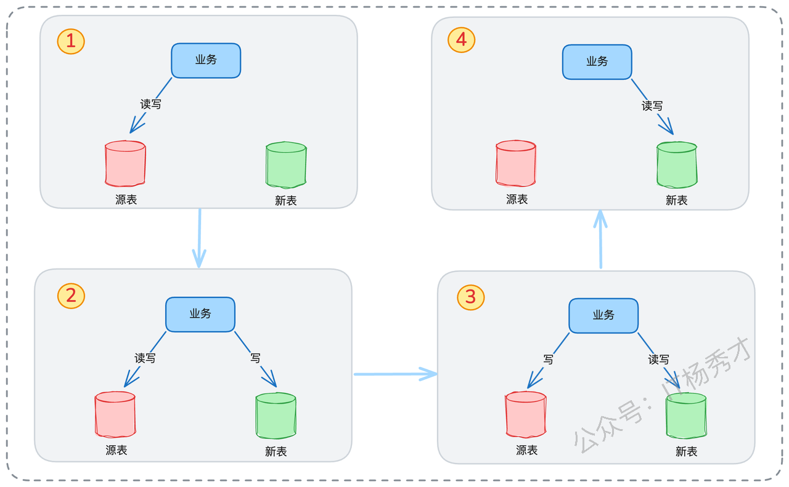
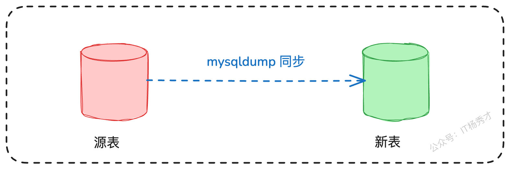
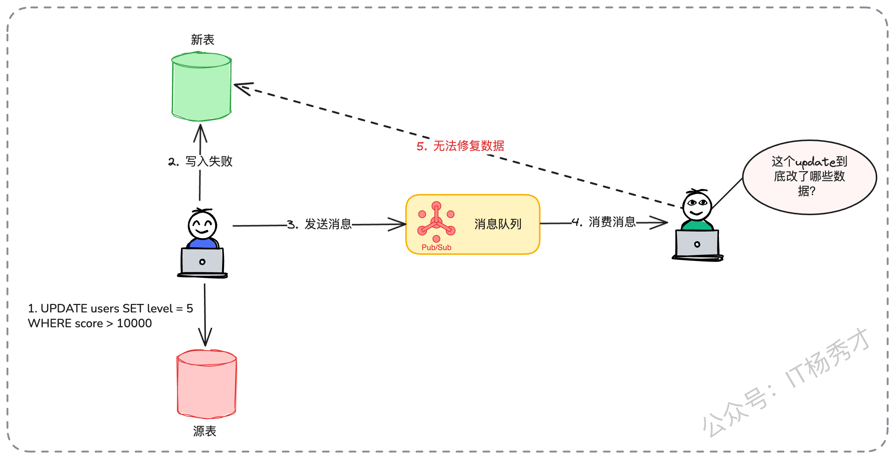
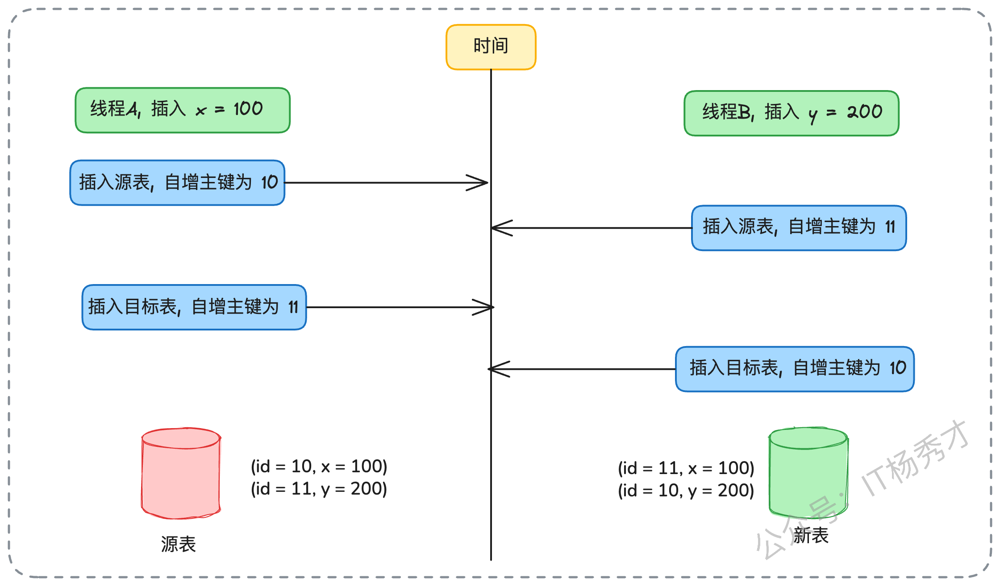

> **“你好，看你简历上写到主导过XX系统的重构，能详细阐述一下数据迁移的完整方案吗？”**

在多年的架构评审和技术面试中，秀才发现“数据迁移”是一个能精准衡量工程师技术深度与广度的问题，但凡你简历上写了系统重构，这个问题基本就是必问题。当然许多求职者的简历中也不乏“系统重构”、“数据库分库分表”这些亮眼项目，但是对其中的技术细节理解往往不够深入，最常见的答案就是一&#x4E2A;**“停机迁移”**。

不得不说，停机迁移确实是一种方案，但它更像是一种技术资源或方案设计不足时的妥协。现在的互联网业务基本都是高性能要求，长时间的服务中断是不可接受的。因此，**“如何设计并实施一套完善的不停机数据迁移方案，确保过程平滑、数据零丢失且最终一致”**，已成为架构师乃至高级工程师必须掌握的核心能力。

今天，秀才就结合过往的经验，系统性地介绍一些数据迁移过程中应该要注意的点，希望能为你在工作和面试中做方案设计时提供一些参考

## **1. 工具选型**

存量数据迁移是整个数据迁移的第一步，针对Mysql，主要有两个主流的迁移工具：mysqldum和XtraBackup。

* **mysqldump**：这是 MySQL 官方提供的命令行工具，用于数据库的备份与恢复。它能将数据库的结构、数据和关系导出为一系列的 SQL 语句。这是一种**逻辑备份**，备份产物是可读的 SQL 脚本。

* **XtraBackup**：这是一款由 Percona 公司开发的高性能物理备份工具。它直接作用于 InnoDB 存储引擎的底层文件，支持增量备份与恢复，并且在备份过程中对线上业务影响极小。这是一种**物理备份**，可以理解为直接拷贝数据库的数据文件。

下表是**mysqldump和XtraBackup的一个综合对比**

因此，在方案设计之初，我们就需要基对业务数量级、业务对性能抖动的容忍度以及可用的迁移窗口进行确认，最初正确的工具选择，如果实在面试过程中，也需要向面试官展现这个考虑，突出自己思考问题的全面性

## **2. 关键参数**

除了工具，数据库自身的一个关键参数也必须要考虑到，那就是`innodb_autoinc_lock_mode`。这个参数控制着InnoDB引擎下自增主键的生成策略，它直接关系到后续“双写”阶段数据能否保持一致。

`innodb_autoinc_lock_mode`有三种工作模式，我们需要清楚当前环境它的配置值。

* **模式0（传统锁）**：采用传统的表级自增锁。任何插入操作（无论是单条还是批量）都会锁住整张表直到语句结束，并发性能最差，但能绝对保证任何情况下生成的自增ID都是连续的。

* **模式1（连续锁，默认）**：这是默认模式，做出了优化。对于`INSERT ... VALUES`这样的简单插入，锁在分配完主键后即释放，大大提升了并发性；但对于`INSERT ... SELECT`这类无法预知插入行数的语句，仍会退化为表锁，以保证ID的连续性。

* **模式2（交错锁）**：最为激进，所有类型的插入都在申请主键后立刻释放锁，并发性能最好。但代价是，在并发执行多个插入语句时，不同语句获得的ID会相互交错，可能导致单个批量插入语句中产生不连续的主键ID。

在面试中提及你对这个参数的关注，并解释它如何影响后续双写方案中对主键的处理，会立刻让面试官感受到你对数据库底层原理的熟悉程度。比如可以补充道：“在双写开始前，我们必须对代码库进行审查，识别出所有批量插入的业务场景。特别是对于`INSERT ... SELECT`或循环单条`INSERT`的逻辑，需要在`innodb_autoinc_lock_mode=2`的环境下进行重点测试，评估其主键乱序的风险，必要时需进行业务代码改造，统一为`INSERT...VALUES`的形式，以确保数据一致性。”

## **3. 环境确认**

除了上面说的迁移工具的选型和关键参数的设置外，要设计一个好的迁移方案，我们还需要确认一系列环境因素，比如：

* **Binlog模式**：确认公司的`binlog`格式是否为`ROW`模式，`STATEMENT`模式在高并发下可能因执行顺序的不确定性导致主从不一致，而`ROW`模式会记录每一行数据的变更，是保证数据精确同步的基础。

* **数据库规范**：了解公司是否有统一的数据库设计规范，比如，是否所有表都强制包含`update_time`字段？删除操作是采用软删除还是物理删除？这些规范将直接影响增量校验方案的选择。

* **ORM框架特性**：了解项目中所使用的ORM框架，是否提供了AOP（切面）、Interceptor或Hook等机制，有的话可以方便后续双写实现

## **4. 面试实战指南**

前面的的三个环节都是准备工作，接下来就要进入到核心的方案设计阶段了。

一个成熟的不停机迁移方案，其核心思想在于**平滑过渡**与**风险可控**。整个过程可以总结为**三个阶段：存量复制 -> 增量同步 -> 验证切换**。

三个阶段过程中的详细步骤可以简化为下图中的四个关键阶段切换



### **4.1 第一阶段：存量数据迁移**

数据迁移的第一步就是将源表中已有的存量数据导入到新表中，这里就要用到我们前面介绍的Mysql迁移工具了。前面也分析过这两种工具对比，在大多数情况下，如果我们的业务量不大的话，使用 `mysqldump` 就可以了。虽然说他迁移的速度较慢。而这，恰恰给你提供了展示技术深度、突出亮点的机会。在面试时，你可以这样表述：

> “在存量数据迁移阶段，我们选择使用`mysqldump` 工具从源表实时导出数据。`mysqldump` 作为一个逻辑备份工具，优点是简单易用，但缺点也很明显，即在数据量巨大时，导出和导入性能都比较差。因此，我针对性地做了一系列优化来提升其性能。”
>
> 1. 导出端，我们开启了`extended-insert`选项，将多行数据合并为单条INSERT语句，显著减少了SQL文件体积和网络传输压力。
>
> 2. 在导入端，我们采取了组合措施：
>
>    1. 临时关闭了`binlog`记录（`SET SQL_LOG_BIN=0`），避免导入过程产生不必要的日志开销
>
>    2. 放宽了redo log的刷盘时机，将`innodb_flush_log_at_trx_commit`设置为2



### **4.2 第二阶段：增量同步**

存量数据开启完之后，到这里就要进入到整个方案中最复杂、也最关键的核心的增量同步环节了。因为业务并不是停止的，时时刻刻都在发生写入操作，会影响到表里的数据。所以这里在这个阶段，就需要开启双写，即所有的写操作在源表和新表中都要写入一次。

#### **4.2.1 非侵入式的双写机制**

实现双写的过程中，业务系统要同时写入两个数据源，最忌讳的就是侵入式地修改每一处业务逻辑代码，不仅工作量巨大，而且极易引入新的BUG。因此，一个优雅的非侵入式方案是架构师的首选。我们可以利用所使用ORM框架的AOP（面向切面编程）能力，例如GORM的ConnPool接口或MyBatis的Interceptor，在数据访问的底层实现一个双写代理层。


这个代理层能够静默地拦截所有数据库的写操作（INSERT/UPDATE/DELETE），并将其复制一份，分别在源表和新表上执行。更关键的是，这个双写组件还可以是动态可控的。我们需要为其设计一个开关，能够通过配置中心或API接口，实时地调整其工作策略，例如是从“源表优先”切换到“目标表优先”，或是彻底关闭某一方的写入。这种动态可控性，是整个迁移方案风险管理的核心。


在面试时，你可以结合自己熟悉的框架来具体阐述，以 Go 语言的 GORM 为例：

> “为了在 GORM 中实现双写，我最初考虑过使用它的 Hook 机制，比如 `BeforeSave`, `BeforeDelete`。但这种方式要求我为每个数据模型都注册一遍 Hook，维护起来比较繁琐。经过深入研究 GORM 的源码，我发现可以从更底层的 `ConnPool` 接口入手。我通过装饰器模式，封装了源表和目标表两个数据源的 `ConnPool`，在执行 SQL 语句时，根据一个动态的标记位来决定具体的双写逻辑，是先写源表还是先写目标表。”

这里可以给出一个伪代码，让面试官有一个直观的感受：

```go
// DoubleWritePool 结构体封装了源和目标两个数据源
// 并根据当前模式管理双写逻辑
type DoubleWritePool struct {
    source *sql.DB // 源数据库连接
    target *sql.DB // 目标数据库连接
    mode   string  // 双写模式，如 "source_first", "target_first"
}

// ExecContext 拦截数据库写操作
func (p *DoubleWritePool) ExecContext(ctx context.Context, query string, args ...interface{}) (sql.Result, error) {
    switch p.mode {
    case "source_first":
        // 优先写源表
        res, err := p.source.ExecContext(ctx, query, args...)
        if err != nil {
            // 源表写入失败，操作终止，不写目标表
            return nil, err
        }
        // 源表成功后，尝试写入目标表，此处的错误可降级处理（如只记录日志）
        // 后续依赖独立的校验修复机制来保证最终一致性
        go p.target.ExecContext(ctx, query, args...) 
        return res, nil
    case "target_first":
        // 切换到目标表优先的逻辑
        // ...
    default:
        // 默认或其他模式
        return p.source.ExecContext(ctx, query, args...)
    }
}
```

#### **4.2.2 双写阶段的核心挑战**

1. **数据一致性问题**

只要涉及到双写机制，就会带来两个必须解决的经典问题。首先是**数据一致性问题**。

> 面试官很可能会追问：“在双写过程中，如果写源表成功了，但写目标表失败了，怎么办？”

我们的核心应对原则是，在双写阶段，允许这种短暂的不一致存在，只保证最终一致性，所以以优先写入的库为准。然后靠我们后续部署的独立的数据校验和修复工具，周期性的扫描和修复这类不一致数据。

接着，你可以展示你更深层次的思考，提出一个“基于消息队列的异步补偿方案”的方案，然后分析出这个方案的缺陷，最终放弃，突出方案选型能力。

> 我们也曾评估过基于消息队列的异步补偿方案，但由于难以精确还原`UPDATE...WHERE`这类语句的实际影响范围（例如，一个`UPDATE users SET level = 5 WHERE score > 10000`语句，我们无法在消息中得知究竟哪些用户的level被更新了），导致补偿逻辑异常复杂，最终选择了更为通用和稳健的校验修复方案。



* **自增主键冲突问题**

其次是更麻烦的的**自增主键冲突问题**。因为双写其实是要保证两边数据库的数据严格一致。那么如果源表使用了自增主键，新表的数据也要包含自增主键。**但是**在高并发场景下，如果简单地依赖两边数据库各自生成主键，极易因时序问题导致数据错乱。比如，线程A和线程B几乎同时插入数据，可能出现A在源表拿到ID 100，B在源表拿到ID 101，但写入目标表时，B的操作先于A完成，导致B在目标表拿到ID 100，A拿到ID 101，数据就此张冠李戴了。



正确的解决方案是，在写入目标表时，必须**显式地指定主键值**。这意味着，在源表插入成功后，程序需要获取到数据库为其生成的自增ID，并将这个ID一并用于目标表的插入操作，从而从根本上确保两边主键的绝对一致。


#### **4.2.3 增量校验与修复机制**

在双写运行的同时，我们需要一个持续的任务机制来发现并修复两边的不一致数据。这里主要有两个方案：**基于时间戳轮询**和**利用 Binlog**。相比之下，Binlog 方案技术含量更高，也更可靠，是面试时的首选答案。

##### **4.2.3.1 基于时间戳轮询**

我们可以启动一个定时任务，持续不断地轮询源表中`update_time`这样的字段，找到变更的记录，然后与新表进行比对。一旦发现不一致，就以原表的数据为准，覆盖新表。

```go
// last_time 记录上次扫描到的最大时间戳
var last_time = get_initial_timestamp()

for {
    // 1. 根据上次的时间戳，查询源表中发生变更的行
    // SELECT * FROM source_table WHERE update_time > last_time ORDER BY update_time ASC
    rows := findUpdatedRows(last_time)

    for _, row := range rows {
        // 2. 根据主键，在目标表中查找对应的行
        tgtRow := findTgt(row.id)

        // 3. 比较两行数据是否一致
        if !isEqual(row, tgtRow) {
            // 4. 如果不一致，用源表数据修复目标表数据
            fixTargetTable(row)
        }
    }

    // 5. 更新时间戳，用于下一次扫描
    if len(rows) > 0 {
        last_time = getMaxUpdateTime(rows)
    }

    // 6. 短暂休眠，避免空轮询
    sleep(1 * time.Second)
}
```

当然，这个方案强依赖于良好的表设计规范，即所有表都有`update_time`字段，且删除操作为软删除。如果存在物理删除，此方案会失效，因为源表记录删除后，基于`update_time`的轮询将无法捕获到这次删除操作，导致新表残留脏数据。


针对这里的第二个前提，其实正好可以作为你的一个亮点。你可以等待面试官追问“那如果业务方没有实现软删除，就是用的物理删除，有没有什么方法可以实现一致性呢”，这里你就可以展现出你的亮点方案了

> 你可以这样回答：“对于物理删除的场景，在这个方案的基础上还需要一个补救措施：增加一个低频的反向全量校验，即从目标表出发，反查源表。如果在源表中找不到对应的记录，就说明该数据已被删除，此时再清理目标表的冗余数据。”


##### **4.2.3.2 基于Binlog实时监听**

一个更高级、更实时的方案是**基于Binlog的实时监听，**&#x8FD9;也是是面试时的首选答案。其实Mysql的 Binlog (ROW 模式) 本身就包含了变更后的数据，为什么不直接利用呢？在面试的时候，你可以这样介绍这个方案

> “在监听 Binlog 的基础上，我们做了进一步优化。当收到一条 Binlog 事件后，我们直接将 Binlog 中包含的数据内容（即变更后的数据镜像）与目标表的实时数据进行比较。如果两者不一致，我们才会拿着主键去查询源表的最新数据，用这个最新数据来覆盖目标表。”


在实际应用中，有一个关键点需要注意：当检测到数据不一致时，修复逻辑应当回到**源表**重新查询最新数据，而不是直接依赖 Binlog 的内容。原因在于，Binlog 中的事件有可能滞后于真实状态——你拿到的可能是一条“旧操作”，而新表的数据此时已经被后续更新覆盖。如果直接使用 Binlog，可能会把较新的正确数据覆盖掉；而通过源表查询，可以确保修复时拿到的始终是最新版本。

#### **4.2.4 主从同步延迟**

在上一步介绍了增量同步过程中必须的一个环节，增量校验与修复。如果是单库模式下都好说，上述方案没什么大的问题，在实际部署中，为了保证系统的高可用，一般数据库都采用的是主从部署模式，一般读取数据都是读取的从库，这里就可能出现主从同步延迟问题了。不管是新表的主从延迟，还是原表的主从延迟，都可能导致我们拿到‘过期’的数据，从而做出错误的判断。主从同步延迟也是面试官极易挑战的一个点


解决方案也很简单，就是再做一次校验，双重校验。面试的时候你可以这样说：

> “为了解决 **主从延迟** 带来的数据一致性问题，同时避免过度消耗主库资源，我采用了一种“两阶段校验”的思路。在第一次校验时，程序优先从从库读取并进行比对，如果结果一致，就无需再继续处理。只有在从库校验未通过的情况下，才会触发第二步：直接访问主库，拿到最新的数据再做比对。而在数据修复环节，我们始终以主库的结果为最终依据。
>
> 这个方案背后的逻辑是：**主从延迟与真实不一致通常是低概率事件**，因此真正需要访问主库的情况也很少。这样既能保证一致性，又避免了对主库的频繁压力，实现了可靠性与性能之间的平衡。
>
> ”

### **4.3 第三阶段：验证切换**

经过一段时间的增量同步，并且校验新旧数据源的差异趋于零，且系统稳定运行时，我们就可以进入最后的验证切换阶段了。

直接从“源表读写”切换到“新表读写”，风险是巨大的。一旦切换后新库出现问题，源库的数据已经不再是最新，回滚将变得异常困难，甚至丢失数据。


所以这里又是一个面试的亮点展示，这里你可以提出一个更稳妥的方案。在做最后一步数据源切换的时候，你可以这样说

> “为了确保迁移过程的安全性，我们在方案中设计了一个**中间过渡阶段**。具体做法是先调整双写策略，改为“新表读写”，同时所有的写请求，源表也会写一份。这一操作相当于一次“预发布”，为我们提供了一个可观察、可回滚的缓冲期。在这段时间内，新表承担起权威数据源的角色，而源表依旧保持同步写入作为备用。如果新表在此期间出现性能下降或潜在缺陷等异常情况，我们能够立即将业务切换回源表，保证业务稳定运行。正是这份可回退的保障，使得整个方案真正具备了稳妥性。”


通过这个方案就能保证从源表切换到新表的过程中有一个安全的过渡，即使新表还有问题也不怕，因为我们有备份机制

## **5. 小结**

回顾整个迁移过程，要做到平滑的数据迁移远非执行一个脚本那么简单。从前期的工具选型、参数调优，到中期的双写与校验，再到最后的验证切换，每一步都伴随着技术细节。其核心思想在于通过双写机制确保业务的连续性，利用校验修复工具保证数据的最终一致性，并设计可灰度、可回滚的切换步骤来将风险降至最低。换句话说，迁移的难点从不在于“能不能完成”，而在于“如何安全、平滑地完成”。如果在面试中能够完整地讲清楚这套思路，不仅能体现技术深度，也能彰显你作为架构师对复杂系统的全局把控力。

## **资料分享**

随着AI发展越来越快，AI编程能力越来越强大，现在很多基础的写接口，编码工作AI都能很好地完成了。并且现在的面试八股问题也在逐渐弱化，**面试更多的是查考候选人是不是具备一定的知识体系，有一定的架构设计能力，能解决一些场景问题**。所以，不管是校招还是社招，这都要求我们一定要具备架构能力了，不能再当一个纯八股选手或者是只会写接口的初级码农了。这里，秀才为大家精选了一些架构学习资料，学完后从实战，到面试再到晋升，都能很好的应付。**关注秀才公众号：IT杨秀才，回复：111，即可免费领取哦**


<div style="background-color: #f0f9eb; padding: 10px 15px; border-radius: 4px; border-left: 5px solid #67c23a; margin: 20px 0; color:rgb(64, 147, 255);">

#### <span style="color: #006400;">**学习交流**</span>
<span style="color:rgb(4, 4, 4);">
> 如果您觉得文章有帮助，可以关注下秀才的<strong style="color: red;">公众号：IT杨秀才</strong>，后续更多优质的文章都会在公众号第一时间发布，不一定会及时同步到网站。点个关注👇，优质内容不错过
</span>


</div>