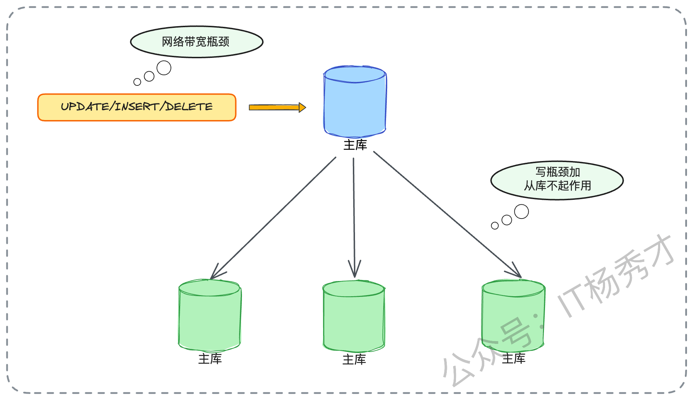
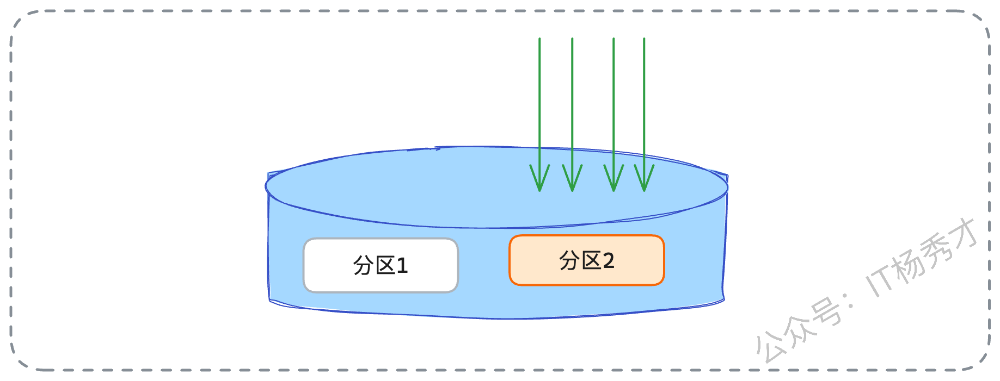
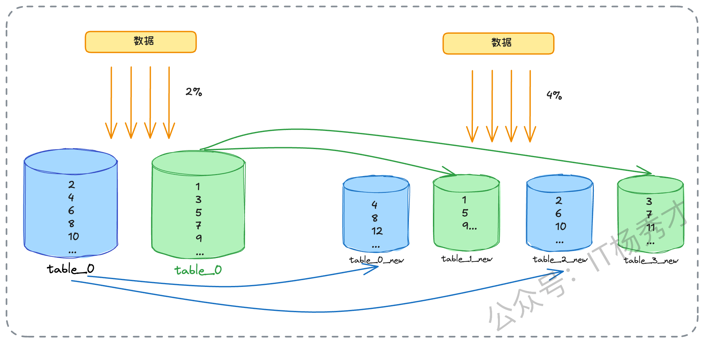
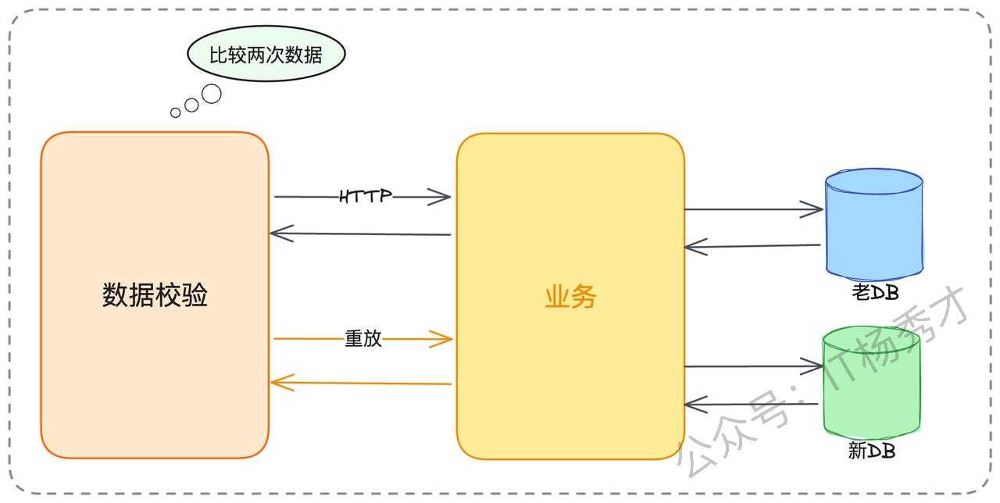
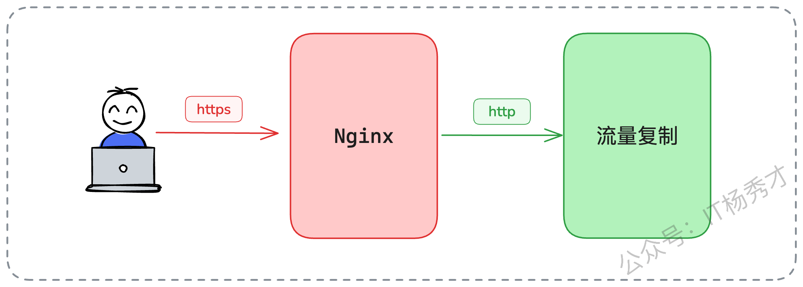

对于后端架构师或者是资深开发来说，尤其是走到高级阶段，面试中几乎绕不开一个高频问题：“你们的系统有做分库分表吗？怎么拆的？规模是多少？”，这类问题表面看是在确认你是否参与过相关实践，本质上是在判断你是否具备体系化思维与前瞻性的架构判断力。

它背后包含了一整套更深入的追问：当初为什么要拆？容量是如何预估的？对未来增长做过哪些推演？如果规划不准，你是否准备过补救方案和扩容路径？不少同学对分库分表的理解仍停留在“怎么用”的层面，缺乏对背后动因和规划逻辑的思考，导致回答时容易失去方向。事实上，容量评估才是这件事的战略起点，一旦方向判错，后续的优化和扩容都会变得异常痛苦——难度、风险、成本可能是最初实施时的数倍。

下面，我就以一名长期深耕架构的工程师视角，带你从根本原因开始拆解：为什么一定要拆，应该拆到什么规模，以及在出现误判后该如何安全扩容，帮助你真正建立起应对分库分表的系统化思维。

## **1. 分库分表连环问**

在深入探讨之前，我们先要明白，面试官的提问往往不是孤立的，而是一个环环相扣的“夺命连环问”：

1. **为什么要做分库分表？** 用分区表不行吗？增加只读从库不行吗？

2. **你们是什么时候决定要做的？** 触发这个决策的阈值是什么？

3. **你们是分库、分表、还是分库又分表？** 决策依据是什么？

4. **那你们分了多少库？多少表？** 这个数字是怎么计算出来的？

5. **万一容量又不够了怎么办？** 你们的扩容预案是什么？

这一连串问题，其实就是在考察我们作为架构师的基本功。而要漂亮地回答这一系列问题，我们必须在日常工作中就做好准备，尤其是要对自己所负责系统的各项数据了如指掌。

很多工程师在面试时，对自家系统的核心数据一问三不知，这是非常减分的。如果你能清晰地说出：“我负责的XX业务，目前数据库集群是3主6从，核心订单表的日增数据量约500万行，峰值TPS在8000左右，QPS在10万级别，当前总数据量200亿行，所以我们采用了...” 这种清晰的数据感，本身就是一种核心竞争力的体现。

因此，在深入学习理论之前，请务必先去了解你所在公司的实际情况：

* **分库分表现状**：到底分了几个集群、几个库、几个表？

* **核心业务指标**：你负责的业务，数据库TPS、QPS、数据总量、日增量各是多少？

* **分区表现状**：公司是否用过分区表？按什么规则分的？每个分区多大？

带着这些一手数据去学习和思考，你的理解才会更加深刻。

## **2. 为什么一定要分库分表?**

在一般的架构设计中，分库分表其实是最后的手段。它是一剂猛药，能治大病，但副作用极大。在非到万不得已之前，我们一定要尝试一切温和的优化手段。

当数据库出现性能问题时，我们的第一反应永远是SQL优化、索引调优。当这些常规操作都已做到极致时，我们还有两张牌可以打：**分区表（Partitioning）** 和 **读写分离（Read/Write Splitting）**。

### **2.1 分区表**

在深入比较前，我们必须先搞清楚分区表是什么。以MySQL为例，分区表在逻辑上仍是一张表，但物理上，数据被分散存储在多个独立的文件块（分区）中。比如，一张订单表可以按月分区，`db_2025_01`、`db_2025_02`的数据会分别存在不同的物理区域。

分区表的优点很明显：

* **查询性能提升**：当查询条件能明确命中某个分区时（如查询1月的订单），数据库只需扫描对应的分区，极大减少扫描量。

* **并发竞争减少**：对不同分区的写操作（如同时写入1月和2月的数据）不会产生锁竞争。

* **数据管理便捷**：删除过期数据（如删除2024年1月前的数据），只需`DROP PARTITION`，远快于`DELETE`。

但它的局限性也非常致命：

* **管理成本**：分区本身的维护（如创建新分区、合并分区）需要额外的管理开销。

* **跨分区查询**：一旦查询无法命中单一分区（如跨月份查询），性能可能比不分区更差。

* **功能限制**：例如，分区表无法使用外键。

### **2.2 读写分离**

读写分离，则是通过主从集群，增加只读从库来水平分散**读压力**。这在读多写少的场景下非常有效。

### **2.3 分库分表的场景**

既然有这两个方案，为什么还要分库分表？因为当瓶颈达到一定程度时，它们就都失效了。

1. **主库写瓶颈**

**读写分离失效**：所有的INSERT、UPDATE、DELETE操作，都必须打在主库上。如果你的业务场景（例如高并发的订单、支付、日志写入）是主库的写入TPS或网络带宽达到了物理天花板，那么无论你挂载多少个从库，主库的压力都无法缓解。

* **实例级硬件瓶颈**

**分区表失效**：所有分区的数据文件，仍然在同一个数据库实例上，共享着同一套CPU、内存、I/O和网络带宽。如果瓶颈在于这些硬件资源，分区表也爱莫能助。

* **热点并发瓶颈**

**分区表失效**：假设有一个场景，按月分区的订单表，这个月的所有新订单都会并发写入同一个当月分区，这个分区的并发瓶颈、锁竞争问题依然存在。

* **超大容量瓶颈**

**读写分离失效**：例如单表数据达到千亿级别，索引文件本身就有数百GB，远超物理内存，导致索引无法高效工作。此时，你复制再多的从库，每个从库都面临着“索引放不进内存”的尴尬，查询性能同样断崖式下跌。

所以，当我们穷尽了上述所有手段之后，依旧面临**主库写入TPS瓶颈**、**实例级硬件瓶颈**、**无法分散的热点并发**或**超大单表容量**问题时，分库分表就成了唯一的出路。它的本质，是通过增加更多的主库实例（分库），或者将一张大表拆成多张小表（分表），来实现**计算和存储的水平扩展**，从根本上突破单台服务器的物理极限。

## **3. 分库分表怎么选?**

确定了一点要进行分库分表之后，下一个问题就是：我们到底该分库还是分表，还是既分库又分表？这个决策，依然取决于你所识别出的**核心瓶颈类型**：

1. **只分表**

只需要分表的适用场景往往适用于核心瓶颈在于**单表数据量过大**，导致索引臃肿、查询缓慢；或是单表并发锁竞争激烈。而出现这种情况业务表现一般会出现数据库实例的CPU、I/O压力尚可，但某些特定SQL（尤其是对这张大表的查询）响应极慢等情况，这就说明我们有必要进行分库分表了。

解决方案也比较简单，比如，将一张`user_log`表，在同一个数据库实例中，拆分为`user_log_00`到`user_log_63`共64张小表。这样做，单表数据量锐减，索引树变小，查询自然就快了。但它并没有增加新的服务器，实例的硬件瓶颈仍在。

* **只分库**

只分库的情况往往适用于核心瓶颈在于**数据库实例的硬件资源**，如CPU占用率持续100%、磁盘IOPS被打满、网络带宽跑满。这种现象的识别也很简单，往往会出现整个实例都很慢，所有连接到这个实例的业务都受到了影响。

而对应的方案就是直接增加数据库实例（即增加物理服务器）。将原有的一个库，拆分成多个库（如`order_db_0`到`order_db_7`），并将它们部署在不同的物理服务器上。这样，每个服务器都只承担一部分数据和流量，硬件瓶颈自然得到解决。

* **分库且分表**

这种情况才是大型互联网架构的标配，它同时解决了上述两种问题。比如，我们规划了8个库（部署在8台不同的物理服务器上），每个库里又拆分了128张表。这样，总共的表数量就是 `8 * 128 = 1024` 张。这种架构，既通过分库解决了单台服务器的硬件瓶颈，又通过分表解决了单表数据量过大的问题，扩展性是最好的。

## **4. 分库分表到底该分多少?**

这才是整个方案的核心问题，也是面试官最想考察的。分少了，一两年后业务一涨，又得扩容；分多了，白白浪费服务器资源，管理成本也剧增。

当然这是一个**面向未来**的估算。我们的目标是：**确保未来3-5年内，系统是够用的，且不必再经历痛苦的扩容。**&#x4F30;算的核心依据只有两个：**存量数据**和**增长趋势**。

### **4.1 估算存量**

这相对简单。但这里有一个关键点：我们只关心**活跃数据**。比如一个电商系统，5年前的已完成订单，是否还需要在线上高频查询？如果不需要，在分库分表之前，就应该先把这部分冷数据归档到Hadoop或归档库。我们只针对需要迁移的热数据进行容量估算。

#### **4.1.1 预估增量**

这是最难，也是最考验架构师业务嗅觉的地方。你不能只看技术，你必须懂业务。你需要像个数据分析师加产品经理一样思考：

* **看历史**：过去一年，数据量增长了多少？（一阶导数）

* **看业务**：公司的战略规划是什么？产品经理的KPI是今年用户翻倍吗？市场部是否在筹备一场大型拉新活动？（二阶导数）

你的估算，必须和**公司的业务规划**强相关。例如，如果公司目标是未来3年业务增长5倍，那么你的容量设计至少要能承载**当前活跃数据 \* 5** 的体量，并在此基础上再留出一定比例的缓冲区（Buffer）。这个增长趋势不是拍脑袋得来的。你需要主动去和产品、运营团队沟通，去了解他们未来1-3年的业务规划。比如，可以问产品经理：“我们下一年的核心目标是DAU翻倍，还是ARPU值提升？有没有计划开拓新市场？” 这些信息都是你估算容量的黄金输入。

**容量估算的原则是宁滥勿缺**，因为扩容的代价远高于初期预留的硬件成本。

#### **4.1.2 行业惯例"2的幂"**

在做容量规划时，你可能还经常听说，大厂的分片（Shard）数量总是 16、32、64、128、1024... 为什么都是 **2的幂**？其实这里面有两个核心考量：

1. **第一，计算效率（次要）。** 如果分片数是 `2^n`（比如16），那么在做哈希取模时，`hash(value) % 16` 的计算，可以被优化为更高效的位运算 `hash(value) & 15`。位运算是CPU指令级别的操作，远快于常规的取余运算。

2. **第二，扩容便利性（主要）。** 如果容量是2的倍数，当未来需要扩容（比如翻倍）时，**数据迁移的成本是最低的**。

我们来举一个更清晰的例子，假设我们最初的规划是 **分2张表**（即 `%2`）：

* **扩容前 (%2):**

  * `table_0`: 存储 `id % 2 == 0` 的数据 (如: 2, 4, 6, 8, 10, 12...)

  * `table_1`: 存储 `id % 2 == 1` 的数据 (如: 1, 3, 5, 7, 9, 11...)

几年后，数据量激增，我们决定扩容一倍，变为 **分4张表**（即 `%4`）：

* **扩容后 (%4):**

  * `table_0_new`: 存储 `id % 4 == 0` 的数据 (如: 4, 8, 12...)

  * `table_1_new`: 存储 `id % 4 == 1` 的数据 (如: 1, 5, 9...)

  * `table_2_new`: 存储 `id % 4 == 2` 的数据 (如: 2, 6, 10...)

  * `table_3_new`: 存储 `id % 4 == 3` 的数据 (如: 3, 7, 11...)

现在，我们来看看数据是怎么做迁移的：

* **原 `table_0`** (2, 4, 6, 8, 10, 12...) 的数据：

  * (4, 8, 12...) 留在了 **`table_0_new`** （`id%4 == 0`）

  * (2, 6, 10...) 迁移到了 **`table_2_new`** （`id%4 == 2`）

* **原 `table_1`** (1, 3, 5, 7, 9, 11...) 的数据：

  * (1, 5, 9...) 留在了 **`table_1_new`** （`id%4 == 1`）

  * (3, 7, 11...) 迁移到了 **`table_3_new`** （`id%4 == 3`）

可以看到，这个迁移路径非常干净利落。**每个老表都精确地分裂成了两个新表，且只需要迁移走一半的数据**。而如果你的初始规划是3张表，扩容到6张表，迁移规则就会变得异常复杂。这就是为什么，我们在做初始容量规划时，会遵循宁滥勿缺的原则，（比如按3年业务增长上限 \* 2的Buffer来估算），并把这个容量数字向上取整到最近的一个2的幂。

### **4.2 如何优雅扩容?**

能够准确的预估扩容容量固然是最好的，但是现实情况往往是很难预估准确的， 其实是按照我们前面说的两种预估方式去做预估。因为市场行情一直在变，还有很多不可控因素。所以预估不准是经常的事情。当业务增长远超预期，容量再次告急时，我们就必须启动扩容

#### **4.2.1 扩容的容量规划**

扩容的第一步，还是容量规划。因为已经有了分库分表的基础，这个规划就简单多了：**翻倍**。比如，当前是4个库，每个库8张表（4x8）。

* 如果瓶颈是**单表容量**，我们可以扩容为 4个库，每个库16张表（4x16）。

* 如果瓶颈是**实例（库）的硬件资源**，我们可以扩容为 8个库，每个库8张表（8x8）。

* 如果两者都是瓶颈，一步到位扩容到 8个库，每个库16张表（8x16）也是可以的。

> 这个决策逻辑，与我们前面说的分库还是分表场景的分析是完全一致的。顺带一提，面试官可能会问“那可以缩容吗？”。理论上是可以的，流程和扩容类似，也是数据迁移和校验。但在实际业务中，几乎没有公司会这么做。业务在发展，数据在增长，缩容一般情况下都没有做处理。

#### **4.2.2 扩容的数据迁移**

扩容的本质，就是**数据迁移**。而数据迁移最大的挑战，在于如何保证在迁移过程中，线上业务不受影响，且数据**绝对一致、零丢失**。数据迁移的步骤通常是：

1. **新老库双写**：应用层改造，所有写请求，同时写新库（按新规则）和老库（按老规则）。

2. **存量数据迁移**：跑脚本，将老库的历史数据，按照新的分片规则，批量导入新库。

3. **数据校验**：验证新库的数据和老库是否一致。

4. **流量切换**：将读请求和写请求，逐步从老库切换到新库。

其中，第3步数据校验是最难的。你怎么能100%确保新库的数据是对的？这也是实际工作中和面试场景中最难处理的问题

### **4.3 亮点方案:流量复制**

这是一个非常高级，但效果也最好的校验方案。在面试中，如果你能主动提出这个方案（哪怕只是说我们曾经设计过），也会非常加分。它的原理是：在双写阶段，我们不仅双写，还对线上的**读请求**进行复制。

1. 一个真实的读请求 `R_Read` 访问老库，得到了响应 `Response_Old`。

2. 与此同时，系统自动复制这个请求 `R_Read`，并将其**异步**地重放（Replay）到新库，得到响应 `Response_New`。

3. 一个独立的校验程序，去对比 `Response_Old` 和 `Response_New`。如果二者不一致，就发出告警。

这个方案，能真正从**业务逻辑层面**去校验新老库的数据一致性。常用的工具有 `tcpcopy` 或 `goreplay`。

当然，这个方案也有很多坑，你能否把坑也说出来，更是你深度思考的体现。

#### **4.3.1 亮点一:HTTPS 加密流量处理**

线上的流量都是HTTPS加密的，你怎么复制？

> 答案是：我们不在最外层的Nginx上复制。我们可以在**网关（Gateway）** 层面去做。当流量到达网关时，HTTPS已经被卸载（Terminated）成了HTTP明文，此时我们就可以对HTTP请求进行复制和录制了。

我们可以在 Nginx 之后接入流量复制组件。用户和 Nginx 之间是HTTPS通信,但是 Nginx 和后面的服务器（包括流量复制组件）之间是HTTP通信,这样就可以避开HTTPS的问题。

#### **4.3.2 亮点二:并发请求处理**

这又是一个有挑战的点，同时也是面试官最喜欢深挖的地方。

假设一个场景：

1. **时刻T1（原始请求）**：一个读请求 `R1` 访问老库，查询“用户ID=505”的数据，得到 `name="张三"`。

2. **时刻T2（流量复制）**：系统复制了 `R1`，准备稍后重放。

3. **时刻T3（并发写入）**：此时，一个写请求 `W1` 进来，将“用户ID=505”的 `name` 更新成了 `name="张三丰"`。

4. **时刻T4（数据同步）**：双写机制将 `name="张三丰"` 这个状态成功写入了**新库**。

5. **时刻T5（请求重放）**：被复制的 `R1` 开始重放，它访问**新库**，查询“用户ID=505”的数据。由于T4的存在，它得到的结果是 `name="张三丰"`。

6. **时刻T6（对比）**：校验程序对比 `Response_Old`（`name="张三"`）和 `Response_New`（`name="张三丰"`）。**发现数据不一致，发出告警！**

然而，数据真的不一致吗？其实数据是**一致**的。这只是因为读（重放）和写（并发）的**时序问题**，导致的一个假阳性误报。这种问题虽然无法100%避免，但我们通常可以接受。因为我们的业务往往是读多写少的，这种极端并发的概率很低。而且我们也不需要100%复制所有流量，哪怕只复制5%的流量进行抽样校验，也足以给我们极大的信心。

## **5. 小结**

无论是为什么要分库分表、具体该怎么分，还是未来如何扩容，这些东西都不是靠拍脑袋决定的，而是建立在对业务、数据与增长规律充分理解之上的系统性决策。只有在前期做好容量评估、规划边界，并为未来预留可演进的空间，分库分表才不会成为一次性的救火手段，而是伴随业务长期增长的基础设施。真正的架构能力，正是在这种面向未来的不确定性中，仍能保持系统的韧性与秩序。

## **学习交流**

> 如果您觉得文章有帮助，可以关注下秀才的<strong style="color: red;">公众号：IT杨秀才</strong>，后续更多优质的文章都会在公众号第一时间发布，不一定会及时同步到网站。点个关注👇，优质内容不错过

