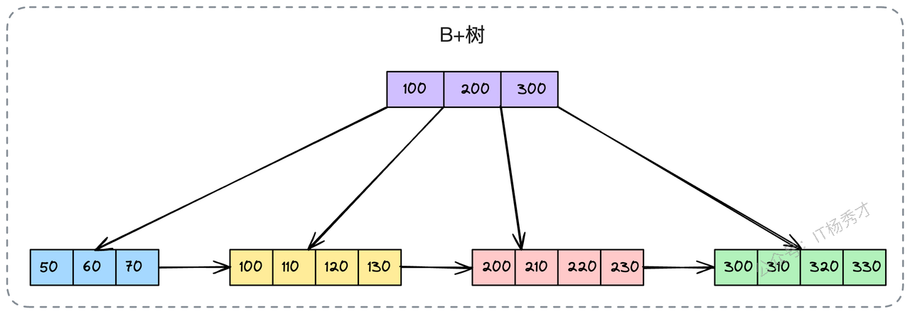
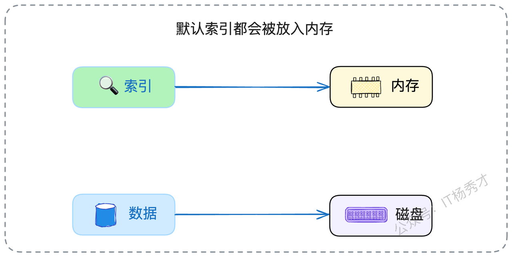
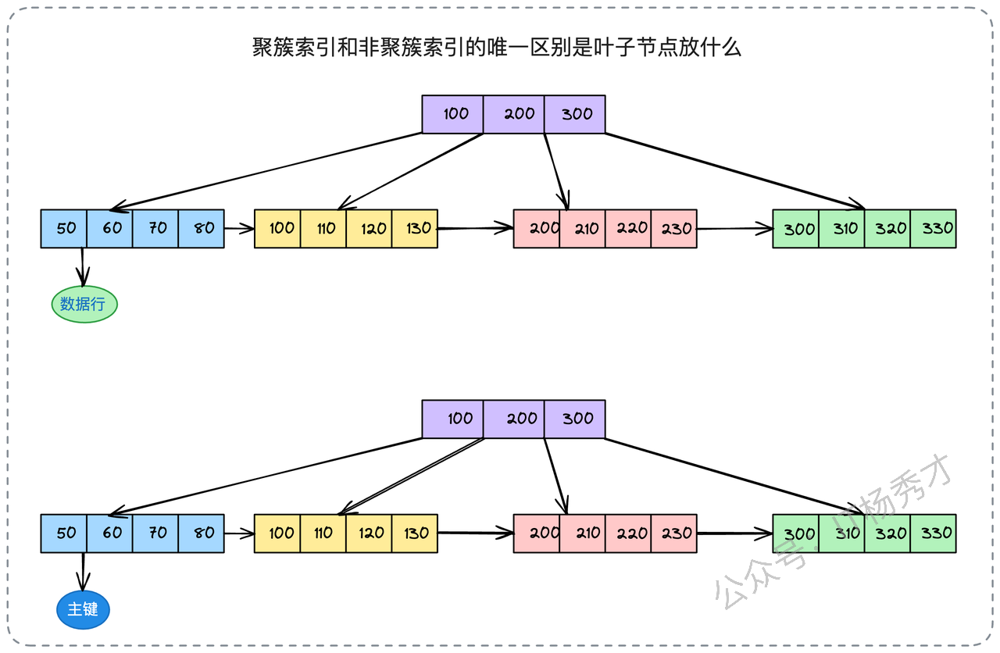
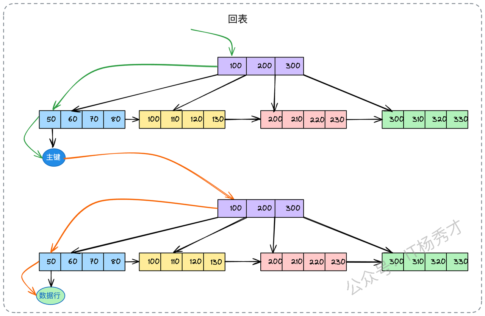
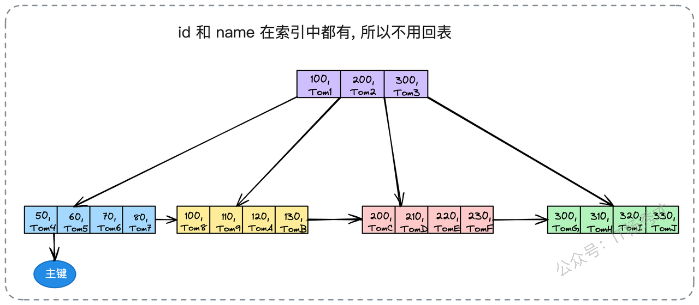
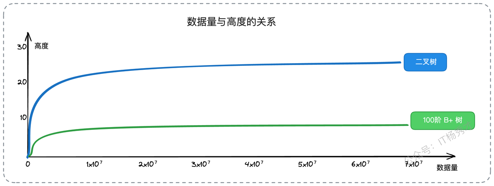
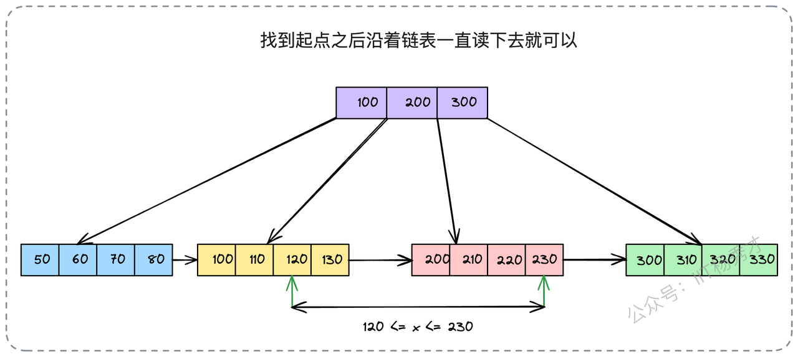

今天，我们来系统性地聊聊数据库这个话题。在任何一个后端工程师的职业生涯中，数据库设计和SQL优化的能力，都直接决定了你所构建系统的性能上限。无论公司规模大小，数据库都是技术栈中不可或缺的一环。因此，即便你缺乏微服务相关的经验，扎实的数据库功底也完全可以成为你面试中的致胜法宝。

今天，我们就从数据库的心脏——索引，开始我们的第一讲。

索引是面试中的高频考点，但很多同学的回答往往流于表面，像是背诵教科书，很难给面试官留下深刻的印象。实际上，索引是一个理论与实践紧密结合的领域。在这篇文章里，我会先带你彻底搞懂索引的底层原理；在后续的文章中，我们再结合SQL优化，深入探讨索引设计的实战技巧。

索引的知识点确实不少，而且很多细节零散、不成体系，记忆起来颇有难度。别担心，我会用最直白的语言和一些巧妙的类比，帮助你构建起关于索引的完整知识图谱。

## 1. **索引的基础知识**

首先，我们要明确一个概念：索引是一种用于加速数据检索的特殊数据结构。几乎所有涉及存储和查找的系统组件，背后都有索引的身影，尽管它们的实现原理各不相同。

要理解MySQL的索引，我们必须先从B+树开始。

### 1.1 **B+树：索引的骨架**

B+树是一种精巧的多叉树结构。对于一棵m阶的B+树，它遵循以下规则：

1. 树中的每个节点最多可以拥有m个子节点。

2. 除了根节点，其他每个节点至少有 `⌈m/2⌉` 个子节点。根节点若非叶子，则至少有两个子节点。

3. 拥有k个子节点的非叶子节点，必定包含k个关键字（可以理解为索引列的值）。

定义可能有些枯燥，记不住没关系，但下面这两个核心特征，你必须牢牢记住：

* **数据只存在于叶子节点**：所有非叶子节点（可以看作是“目录页”）仅存储关键字信息，用于指引查找方向。真正的数据记录，全部存放在树最底层的叶子节点中。

* **叶子节点构成有序链表**：所有的叶子节点通过指针串联在一起，形成一个有序的双向链表。



为了帮你更好地理解，我们可以把一棵B+树想象成一部精心编排的字典。非叶子节点就像是字典的“部首目录”或“拼音索引”，它们本身不解释字的含义（不存数据），只告诉你某个字可能在哪些页码范围里。而叶子节点，就是字典的正文部分，包含了每个字的详细释义（存储真实数据），并且这些正文页码是连续的（链表串联），方便你按顺序翻阅。

正是这些特性，使得B+树成为数据库索引的绝佳选择，它主要有三大优势：

1. **查询性能稳定高效**：相比于二叉树，B+树更加“矮胖”。树的高度直接影响I/O次数，更低的高度意味着更少的磁盘读取，查询性能自然更好。

2. **天然适合范围查询**：由于叶子节点是串联起来的有序链表，当需要进行范围查找（例如 `WHERE id > 100`）时，只需在B+树中定位到范围的起始点，然后沿着叶子节点的链表顺序遍历即可，效率极高。

3. **内存利用率更高**：因为非叶子节点不存储数据，只存储关键字和指针，所以单个节点可以容纳更多的关键字。这意味着，在内存有限的情况下，我们可以将整棵树的非叶子节点（即索引的“目录部分”）全部加载到内存中，大大减少了访问索引时的磁盘I/O。

很多人能记住前两个优点，却常常忽略第三点。实际上，我们讨论索引提升查询性能时，有一个隐含的大前提：**索引本身（至少是高频访问的非叶子节点）是常驻内存的**，而真正的数据行则存放在磁盘上。如果索引也需要频繁从磁盘读取，那它的加速效果将大打折扣。



### 1.2 **多维视角下的索引分类**

在MySQL中，索引的叫法很多，这是因为我们可以从不同的维度去审视和划分它。同一个索引，可能同时拥有多个身份。

* **聚簇索引 (Clustered Index) vs. 非聚簇索引 (Non-Clustered Index)**：这是从数据存储方式的角度来划分的。

* **覆盖索引 (Covering Index)**：从查询过程的角度来看，如果一个索引包含了查询所需的所有列，它就是覆盖索引。

* **唯一索引 (Unique Index)**：从约束性的角度来看，索引列的值必须是唯一的。

* **前缀索引 (Prefix Index)**：从索引内容的角度来看，只索引了某个列值的前一部分字符。比如，在一个 `varchar(255)` 的列上，只取前50个字符来创建索引。

* **组合索引 (Composite Index)**：也叫联合索引，指由多个列共同组成的索引。

* **全文索引 (Full-Text Index)**：专门用于支持文本内容的模糊搜索。

* **哈希索引 (Hash Index)**：基于哈希表实现的索引，查询性能极高，但不支持范围查询。MySQL的InnoDB存储引擎默认不支持显式创建哈希索引。

理解这些分类的关键在于，不要把它们看作是互斥的。一个由 `(name, age)` 两列组成的唯一索引，当用于查询 `SELECT name, age FROM ...` 时，它同时也是一个组合索引、唯一索引和覆盖索引。

### 1.3 **聚簇索引与非聚簇索引**

这是索引分类中最核心、也最需要理解透彻的一对概念。它们的唯一区别在于**叶子节点存放的内容不同**。

* **聚簇索引**：其叶子节点直接存储了完整的**数据行**。在InnoDB中，数据表本身就是按主键组织的一棵B+树，这棵树就是聚簇索引。因此，一张表只能有一个聚簇索引。

* **非聚簇索引**（也叫二级索引或辅助索引）：其叶子节点存储的不是数据行，而是该行数据对应的**主键值**。



有了这个区分，我们就能轻松理解“回表”这个概念了。当你使用一个非聚簇索引进行查询时，数据库的执行流程是这样的：

1. 首先在非聚簇索引的B+树中，根据你的查询条件一路找到对应的叶子节点。

2. 从该叶子节点中，获取到数据行的**主键值**。

3. 拿着这个主键值，再回到聚簇索引（也就是主键索引）的B+树中，重新查找一次，最终定位到叶子节点，读取完整的行数据。



这个“拿着主键再查一次”的过程，就叫做**回表 (Lookup)**。如图所示，查询先沿着绿色路径在非聚簇索引中找到主键，然后再沿着黄色路径去聚簇索引中找到完整的行数据。由于这个过程多了一次B+树的查找，并且很可能触发额外的磁盘I/O，所以回表的性能开销较大。在实际的SQL优化中，**避免不必要的回表**是一个核心原则。

### 1.4 **覆盖索引：避免回表的利器**

如何避免回表呢？答案就是使用**覆盖索引**。

当一个查询所需要返回的列，恰好都存在于你所使用的那个索引中时，数据库就无需再回到主键索引去查找完整的行数据了。它可以直接从当前这个非聚簇索引的叶子节点中提取出所有需要的值并返回。此时，这个索引对于该查询而言，就是一个覆盖索引。

举个例子，假设我们有一个用户表 `user_tab`，并在 `(id, name)` 这两列上创建了一个组合索引。对于下面这个查询：

`SELECT id, name FROM user_tab WHERE id = 50;`

由于查询请求的 `id` 和 `name` 两列都已经包含在我们的组合索引中了，数据库可以直接从这个索引树中获取数据并返回，完全不需要回表操作。



因此，“覆盖索引”不是一种索引类型，而是索引相对于某个特定查询的一种“状态”或“能力”。这也引出了SQL优化中两条黄金法则：

1. **只查询你需要的列**，坚决避免 `SELECT *`，这能增加命中覆盖索引的概率。

2. **为高频查询场景设计专门的覆盖索引**，将查询、筛选、返回的列都包含进去。

这两条法则的本质，都是为了尽可能地减少回表，从而提升查询效率。

### 1.5 **最左匹配原则**

当我们在多个列上创建组合索引时，例如 `<A, B, C>`，索引的查询和匹配遵循着严格的“最左匹配原则”。要理解这个原则，我们必须先理解组合索引的排序方式。

在一个 `<A, B, C>` 的组合索引中，数据是这样排序的：

* 首先，整体上按照列 A 进行排序。

* 在列 A 的值相同的情况下，再按照列 B 进行排序。

* 在列 A 和 B 的值都相同的情况下，最后才按照列 C 进行排序。

这意味着：列A是绝对有序的；只有在A确定的前提下，B才是有序的；只有在A和B都确定的前提下，C才是有序的。

基于这个排序规则，我们就能推断出索引的使用情况了。我们可以把一次 `WHERE A=a1 AND B=b1 AND C=c1` 的查询，想象成一个嵌套循环的查找过程：

```go
// 伪代码演示 WHERE A=a1 AND B=b1 AND C=c1 的查找过程
for a in sorted_A {
    // 第一步：在有序的A列中定位a1
    if a == a1 {
        for b in sorted_B_within_a1 {
            // 第二步：在A=a1的局部范围内，定位b1
            if b == b1 {
                for c in sorted_C_within_a1_b1 {
                    // 第三步：在A=a1, B=b1的局部范围内，定位c1
                    if c == c1 {
                        // 找到了！获取主键，准备回表
                    }
                }
            }
        }
    }
}
```

理解了这个模型，最左匹配原则的各种情况就迎刃而解了。

* 如果查询条件是 `WHERE A = a1 AND B = b1`，那么可以推断出来，数据库只会应用外层的两重循环，不会对C进行过滤。

```go
// 伪代码演示 WHERE A=a1 AND B=b1 的查找过程
for a in A {
    if a == a1 {
        for b in B {
            if b == b1 {
                // 这就是你要的结果，获取主键去磁盘读取
            }
        }
    }
}
```

* 如果查询条件是 `WHERE A = a1 OR B = b1`，那么这个查询通常不会使用这个组合索引，因为它无法同时满足A和B的有序性进行查找。

```go
// 伪代码演示 WHERE A=a1 OR B=b1 的查找过程
// 分别查找满足条件的a和b
as := find_all(A, a1)
bs := find_all(B, b1)
// 合并结果集
result := union(as, bs)
```

* 如果查询条件是 `WHERE A=a1 AND B > b1 AND C=c1`，那么这个查询只会使用索引的A和B两列。因为B是一个范围查询，从第一个满足 `B > b1` 的记录开始，后续的C列就无法保证有序了，所以C列上的索引失效。

```go
// 伪代码演示 WHERE A=a1 AND B > b1 AND C=c1 的查找过程
for a in A {
    if a == a1 {
        for b in B {
            if b > b1 {
                // C是无序的，所以用不了索引。
                // 这就是你要的结果，获取主键去磁盘读取
            }
        }
    }
}
```

* 如果查询条件是 `WHERE A != a1`，那么这个查询也不会使用索引，因为不等于操作破坏了有序性。

一个简化的判断口诀是：“**带头大哥不能丢，中间兄弟不能断，范围查询是终点**”。查询条件必须从索引的最左列开始，并且中间不能跳过某一列，一旦遇到范围查询（`>`、`<`、`between`、`like`），后续的列索引也将失效。

当然，这只是一个通用法则，现代数据库优化器越来越智能，有时也会做出一些优化。但在实践中，最权威的判断方式永远是 `EXPLAIN` 命令的输出结果。

### 1.6 **索引的代价**

天下没有免费的午餐，索引在带来查询加速的同时，也必然会产生一些开销和副作用：

1. **空间成本**：索引本身是数据结构，需要存储在磁盘上，会占用额外的物理空间。

2. **时间成本**：当对表中的数据进行增、删、改操作时，不仅要修改数据本身，还必须同步维护相关的B+树索引，以保证索引的有序性。这个过程会引入额外的性能开销，降低写入性能。

3. **内存成本**：运行时，索引会被加载到内存中，消耗宝贵的内存资源。


记住这些代价非常重要。面试官很可能会反其道而行之，在你滔滔不绝地讲述索引的优点后，突然发问：“索引有什么缺点？”或“什么情况下不应该使用索引？”。

## 2. **决胜面试：索引知识的实战策略**

在面试中，我们不仅要展示自己“知道什么”，更要展示“如何思考”。

当你准备面试时，最好能结合自己参与过的项目，聊聊其中的索引设计，以及是否遇到过因索引不当而引发的线上问题。如果你想塑造自己“精通高性能架构”的形象，那么在项目介绍环节主动提及SQL优化和索引设计，无疑是一个很好的切入点。

面试官可能会直接抛出一个具体的SQL，让你判断是否会使用索引。遇到这类问题，切记不要急于回答。首先要强调，你的判断是基于“一般情况”下的。然后可以补充一句：

> “我刚才的分析是基于通用规则的。但在实际场景中，数据库是否使用索引，还会受到表的数据量、数据的分布情况、以及是否存在其他可用索引等多重因素的影响。MySQL的优化器会综合评估各种查询路径的成本，选择它认为最优的执行计划。最准确的方式还是通过`EXPLAIN`来分析。”

这样一段“免责声明”，既能体现你思维的严谨性，又能巧妙地将话题引向更深层次的讨论，比如“为什么数据库有时会放弃使用索引”。

如果面试官问及以下问题，你都可以顺势将话题引导到索引上：

* 你做过哪些性能优化工作？

* 你对B树和B+树了解多少？

* 聚簇索引和覆盖索引有什么区别？

* 数据库查询一定会走索引吗？

* 是不是加了索引，查询就一定会变快？

### 2.1 **索引的核心话术**

如果面试官只是笼统地问你对索引的理解，你可以使用下面这段话术作为开场，它系统性地串联了B+树、索引分类和最左匹配原则，并埋下了几个可以深入探讨的引子。

> “在我看来，理解MySQL索引可以从三个层面入手。首先，从底层数据结构来看，InnoDB主要采用B+树。相比于其他数据结构，B+树的树高更低、I/O效率更高，并且通过叶子节点的链表设计，天然支持高效的范围查询。同时，它非叶子节点不存数据的特性，也让它更节省内存。
>
> 其次，从应用角度看，索引可以分为聚簇索引和非聚簇索引，这决定了数据和索引的存储方式，并引出了‘回表’和‘覆盖索引’等优化点。
>
> 最后，从使用规则上讲，组合索引遵循最左匹配原则。不过，最终数据库会不会用索引，还是一个动态决策的过程，与查询语句本身、数据分布都有关系。在实践中，我们还是要以`EXPLAIN`的分析结果为准。”

这段话术中，有几个点很容易激发面试官的追问兴趣：

1. 为什么MySQL选择了B+树，而不是B树、红黑树或跳表？

2. 什么是回表？如何通过覆盖索引进行优化？（可引申到SQL优化）

3. 在哪些情况下，数据库明明有索引却不使用？

### 2.2 **面试加分项：展现你的技术深度**

接下来，我们来逐一攻克上面这些能够让你在面试中脱颖而出的亮点问题。

#### 2.2.1 **亮点一：为什么是B+树？**

要回答好这个问题，你需要将B+树放在一个更广阔的舞台上，与其它几种备选的数据结构进行横向对比，从而凸显其优势。

* **对比平衡二叉树/红黑树**：这些都是经典的二路或准二路搜索树。在数据量巨大时，它们的树高会非常可观。树的高度决定了磁盘I/O的次数，过高的树意味着性能急剧下降。而且，为了维持平衡，它们的插入和删除操作可能会引发频繁的树旋转，开销较大。



* **对比跳表 (Skip List)**：跳表是一种通过“升维”思想实现的链表，查询性能在期望上可以达到 `O(logN)`。但它的问题在于，平衡性依赖于随机化，在极端情况下可能退化成一个普通链表，导致查询性能极不稳定。而数据库系统追求的是可预期的、稳定的性能。此外，跳表的指针会占用更多的内存空间。

* **对比B树**：这才是真正的“终极对决”。B树和B+树非常相似，最大的区别在于：**B树的非叶子节点也存储数据**。这带来了两个致命的缺点：

  1. **范围查询性能差**：由于数据分散在所有节点中，进行范围查询时，可能需要进行复杂的中序遍历，效率远不如B+树那样沿着叶子节点的链表一路扫过去来得直接。

  2. **内存效率低**：因为非叶子节点存储了数据，导致每个节点能容纳的关键字数量变少，树的高度会相应增加。更重要的是，这使得将所有非叶子节点（索引目录）一次性加载到内存变得更加困难，查询时很可能需要频繁地进行磁盘I/O来读取非叶子节点。



综上所述，一个数据结构是否适合做数据库索引，需要综合评估其查询、插入、删除的性能，以及对范围查询的支持和内存消耗。B+树正是在这些方面取得了最佳的平衡。

#### 2.2.2 **亮点二：为何数据库有时会“无视”索引？**

数据库优化器是一个非常“聪明”的决策者，它的唯一目标是找到成本最低的查询路径。在某些情况下，它会认为全表扫描（Full Table Scan）比走索引更快，从而放弃使用索引。

以下是几种常见的情况：

* **使用了不符合索引规则的查询**：例如对索引列使用 `!=`、`<>`，或者 `LIKE '%keyword'` 这样的前导模糊查询。

* **对索引列进行函数运算或表达式计算**：例如 `WHERE YEAR(create_time) = 2025`，这会让索引失效。正确的做法是改写为 `WHERE create_time >= '2025-01-01' AND create_time < '2026-01-01'`。

* **索引列的区分度（Cardinality）过低**：比如一个“性别”列，只有男、女、未知三种值。如果用它做索引，每次筛选可能还是会过滤出1/3的数据。优化器认为，与其走索引再回表这么多次，还不如直接扫描全表来得快。

* **数据量太小，或查询结果集占比过大**：当表里的数据总共就几百行时，优化器觉得直接全表扫描的成本，比先查索引再回表的成本还要低。同理，如果优化器估算出走索引后，还需要回表查询表中大部分的数据行（比如超过20%\~30%），它也可能直接选择全表扫描。

这里你可以补充一句，虽然可以通过 `FORCE INDEX` 这样的SQL提示（Hint）来强制数据库使用某个索引，但这通常是最后的手段。最佳实践还是应该通过优化SQL和索引设计，来引导优化器做出正确的选择。

#### 2.2.3 **亮点三：索引与NULL的微妙关系**

关于“列中含有NULL值，索引会失效”的说法，在社区中流传很广，但这个说法并**不完全准确**。

在MySQL的InnoDB引擎中，你需要知道两点：

1. **MySQL可以为包含NULL值的列创建索引，并且能够使用该索引**。无论是 `IS NULL` 还是 `IS NOT NULL` 的查询，都可以正常地利用到索引。

2. **唯一索引（Unique Index）允许存在多个NULL值**。这是因为在SQL标准中，`NULL` 和任何值（包括另一个 `NULL`）进行比较，结果都是未知的（unknown），所以多个`NULL`并不会违反唯一性约束。

尽管如此，在表设计中，我们依然推荐使用一个有业务含义的默认值（如0、-1、空字符串等）来代替`NULL`，并将列设置为 `NOT NULL`。这是一种更佳的实践，可以避免在应用层处理`NULL`时可能带来的各种逻辑混淆和潜在的bug。

## 3. **核心要点回顾**

这篇文章，我们深入探讨了数据库索引的核心原理。你需要重点掌握B+树的数据结构、聚簇索引与非聚簇索引的区别、回表的概念，以及最左匹配原则的运作机制。

要想在面试中脱颖而出，你需要从以下几个方面下功夫，展现你的思考深度：

* **MySQL为何选择B+树？** 能否从I/O成本、范围查询、内存效率等多个维度，对比分析不同数据结构的优劣。

* **数据库为何会放弃使用索引？** 能否站在数据库优化器的角度，去理解其成本估算的决策过程。

* **索引与NULL的关系？** 能否澄清常见的误区，并给出最佳实践建议。

最后，关于面试官提出的具体场景题（比如给一个SQL让你分析），这往往是在考察你思维的缜密性。面对这类问题，最好的策略是“防御性回答”：先主动询问或假设清楚问题的约束条件，比如数据量、并发量、数据分布等。如果面试官不提供，就在你的回答中明确指出你的方案是基于哪些假设之上的。这种严谨的思考方式，远比一个单一的“正确答案”更有价值。

<div style="background-color: #f0f9eb; padding: 10px 15px; border-radius: 4px; border-left: 5px solid #67c23a; margin: 20px 0; color:rgb(64, 147, 255);">

# **学习交流**
<span style="color:rgb(4, 4, 4);">
> 如果您觉得文章有帮助，可以关注下秀才的<strong style="color: red;">公众号：IT杨秀才</strong>，后续更多优质的文章都会在公众号第一时间发布，不一定会及时同步到网站。点个关注👇，优质内容不错过
</span>


</div>