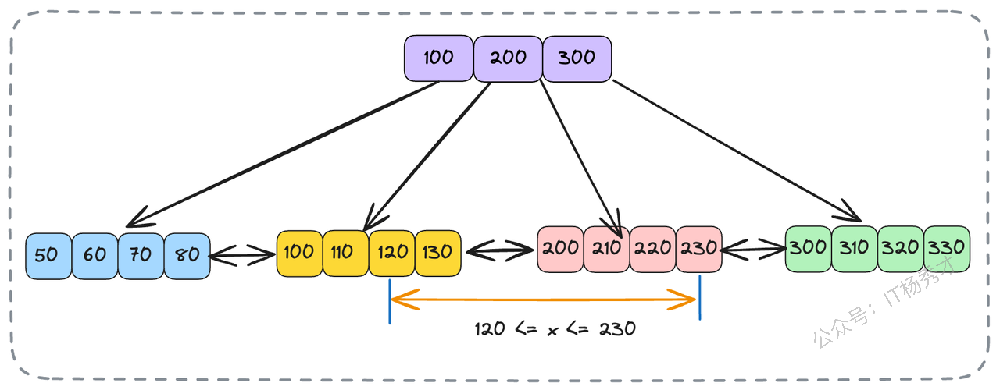

数据库是后端工程师绕不开的核心技术，而索引，则是这核心中的核心。在日常工作中，我们每天都在和索引打交道，索引问题也是高级工程师面试中，面试官最喜欢考察的地方。

很多开发者在面试中谈及索引时，往往只能给出一些零散、机械的记忆性答案，比如“B+树查询快”、“索引能提速”。这样的回答很难在面试官心中留下深刻印象。真正体现一个工程师技术深度的，是对索引背后设计原理的系统性理解，以及在复杂场景下进行选型和优化的能力。

今天，我们就从一个经典的面试问题“MySQL为什么选择B+树？”切入，层层深入，不仅讲解索引的“是什么”，更聚焦于“为什么”和“怎么做”。希望通过本文，你能构建起一个体系化的索引知识框架，让你在未来的面试和工作中，都能游刃有余。

## **1. B+树的核心结构**

B+树是一种精巧的多叉树结构。对于一棵m阶的B+树，它遵循以下规则：

1. 树中的每个节点最多可以拥有m个子节点。

2. 除了根节点，其他每个节点至少有 `⌈m/2⌉` 个子节点。根节点若非叶子，则至少有两个子节点。

3. 拥有k个子节点的非叶子节点，必定包含k个关键字（可以理解为索引列的值）。

定义可能有些枯燥，记不住没关系，但下面这两个核心特征，你必须牢牢记住：

* **数据只存在于叶子节点**：所有非叶子节点（可以看作是“目录页”）仅存储关键字信息，用于指引查找方向。真正的数据记录，全部存放在树最底层的叶子节点中。

* **叶子节点构成有序链表**：叶子节点之间通过双向指针（在InnoDB中）相互连接，形成一个天然的、支持双向遍历的有序序列。

## **2. B+树做索引的三大优势**

正是基于上述特性，B+树为数据库查询带来了三个传统数据结构难以企及的优势，每个优势给性能带来了极大的提升。

### **2.1 高效的磁盘I/O**

数据库的数据和索引通常存储在磁盘上，而磁盘I/O的耗时是内存操作的上万倍，是系统性能的主要瓶颈。查询过程的本质，就是不断地进行磁盘I/O来读取数据页（Page，InnoDB默认为16KB）。

B+树的“多路”特性，意味着每个节点可以拥有成百上千个子节点（阶数m非常大）。这使得整棵树的结构呈现出“矮而胖”的形态，高度极低。

我们来做一个简单的估算：假设主键是BIGINT类型（8字节），指针大小在InnoDB中是6字节，那么一个16KB的数据页作为非叶子节点，大概可以存放 `16KB / (8B + 6B) ≈ 1170` 个（关键字+指针）组合。如果树的高度为3，那么它可以索引的数据量大约是 `1170 * 1170 * (叶子节点可容纳的行数)`。假设一行数据为1KB，叶子节点能放16行，那么总共可以索引 `1170` \* 1170 \*` 16 ≈ 2190万` 条数据。查询这2000多万条数据中的任意一条，最多只需要3次磁盘I/O！相比之下，传统的二叉树，在存储同样量级数据时，会形成一个“高瘦”的结构，查询深度巨大，将导致灾难性的磁盘I/O次数。

下图是数量级与树高的一个关系图，可以看出B+树对比二叉树性能优势非常明显

### **2.2 范围查询效率高**

在业务场景中，范围查询极其普遍，例如“查询某个用户在九月份的所有订单”。B+树的叶子节点通过链表串联的设计，简直是为范围查询量身定做的。

当执行一个范围查询，如 `SELECT * FROM orders WHERE order_id BETWEEN 120 AND 230;` 时，数据库引擎会进行如下操作：

1. 通过B+树从根节点开始，快速定位到`order_id = 120`所在的叶子节点。

2. 读取该节点的数据。

3. 然后，无需再从根节点开始查找121、122..，而是直接通过叶子节点的链表指针，顺序向后遍历，直到找到`order_id > 230`的记录为止。

这个查找过程非常高效，找到第一个节点数据后，由于叶子结点的数据都是排好序的，直接找到第二个临界数据，去中间的数据就完事了。

### **2.3 轻量的非叶子节点**

由于非叶子节点不存储真实数据，只存储关键字和指针，使得它们占用的空间非常小。这意味着，在系统内存允许的情况下，我们通常可以将索引树的非叶子节点（也就是那几层“目录索引”）完整地加载到内存中，并长期驻留。

当一个查询请求到来时，大部分的索引寻址过程（从根节点到叶子节点的上层路径）都在飞快的内存中完成，只有最后需要读取真实数据时，才需要进行那一次或几次不可避免的磁盘I/O来访问叶子节点。这进一步将磁盘I/O的次数压缩到了极致。

B+树的这三大优势，环环相扣，共同保证里了B+树查询方面的高性能。

## **3. 常见索引分类**

理解了B+树的底层原理，我们再把视野拉回应用层，看看在MySQL中，索引是如何基于B+树衍生出五花八门的类型的，以及它们在实践中是如何影响我们的系统性能的。

### **3.1 聚簇索引与非聚簇索引**

这是索引分类中最重要的一个维度，也是接下来我们将重点分析的一种索引分类，因为它直接关系到数据的物理存储方式。

* **聚簇索引（Clustered Index）**：其叶子节点直接存储了完整的**数据行**。在InnoDB中，数据表本身就是按主键组织的一棵B+树，这棵树就是聚簇索引。因此，一张表只能有一个聚簇索引。

* **非聚簇索引（Non-Clustered Index）**：也常被称为二级索引或辅助索引。它的叶子节点存储的不是完整数据行，而是**对应行的主键值**。除了主键索引外的其他索引，如普通索引、唯一索引等，都是非聚簇索引。

#### **3.1.1 回表查询**

上面说了主要的索引分类，就不得不提一个非聚簇索引的性能问题了。那就是回表查询。当我们使用非聚簇索引进行查询时，如果查询所需的数据列不完全包含在该索引中，数据库就会经历一个两步走的过程：

1. **索引查找**：首先在非聚簇索引（某个非主键字段建立的索引树）树上查找到满足条件的记录，并从中获取到主键值。

2. **主键查找（回表）**：再用这个获取到的主键值，去聚簇索引树（按主键`id`排序的树）上进行一次查找，最终定位到完整的行数据。

例如，我们有一个用户表`employees`，主键是`id`，在`employee_no`（员工编号）上建了一个非聚簇索引。当我们执行 `SELECT * FROM employees WHERE employee_no = '86';` 时，就需要先通过`employee_no`索引找到主键`id`（比如是50），然后再根据`id=50`去聚簇索引中找到完整的员工信息。这个拿着主键再去查一次的过程，就是“回表”。它至少会增加一次额外的树查找和磁盘I/O，在高并发场景下，性能损耗也是不小的

#### **3.1.2 覆盖索引**

如何避免回表操作带来的性能损耗呢？答案就是 **覆盖索引（Covering Index）**。覆盖索引并不是一种独立的索引类型，而是指在一个查询中，索引本身已经**覆盖**了所有需要查询的字段，因此数据库引擎无需再回到主表（聚簇索引）去获取数据的一种状态。

还是上面的例子，如果我们为`employees`表建立一个 `(employee_no, name)` 的联合索引。现在，我们的查询变为 `SELECT employee_no, name FROM employees WHERE employee_no = '86';`。此时，查询所需的所有列（`employee_no` 和 `name`）的值，都已存在于这个联合索引的叶子节点上。数据库可以直接从该索引的叶子节点提取数据并返回，完全避免了回表操作，性能大幅提升。

这给我们带来了两个极其重要的SQL优化启示：

1. **精准查询，杜绝`SELECT *`**：只查询你真正需要的列，这是利用覆盖索引的第一步。

2. **为高频查询场景设计合适的覆盖索引**：分析业务中最核心的查询，为其建立合适的联合索引以实现覆盖。

#### **3.1.3 最左前缀匹配原则**

在上面我们提到用索引覆盖可以有效解决非聚簇索引的回表问题，这里我们还必须了解组合索引的生效规则，否则即使我们在一些字段上建立了组合索引，最终也不会生效

对于组合索引，MySQL查询优化器会严格遵循“最左前缀匹配”原则。这是组合索引最重要的，也是最容易被误解的规则。

假设我们有一个订单表`orders`，并建立了一个联合索引 `idx_reg_stat_date` ON `orders` (`region`, `status`, `order_date`)。这个索引的B+树在物理上是这样排序的：首先按`region`排序，在`region`相同的情况下再按`status`排序，在前两者都相同的情况下最后按`order_date`排序。

这种结构决定了索引的查找方式，必须从索引的最左边的列开始，并且不能跳过中间的列。

* `WHERE region = '华东' AND status = '已支付'`：**能使用索引**。优化器会用'华东'定位到特定范围，再在这个范围内用'已支付'继续定位。

* `WHERE region = '华东'`：**能使用索引**。只使用了索引的第一个列。

* `WHERE status = '已支付' AND order_date = '2025-09-07'`：**无法使用索引**。因为查询条件跳过了最左边的`region`列，索引无法定位。

* `WHERE region = '华东' AND order_date = '2025-09-07'`：**只能使用索引的`region`部分**。当`region`确定后，由于`status`未知，`order_date`是无序的，所以`order_date`条件无法利用索引进行快速查找，只能在所有`region`为'华东'的记录中逐条扫描。

* `WHERE region = '华东' AND status > '待发货' AND order_date = '2025-09-07'`：**只能使用`region`和`status`部分**。当遇到范围查询（`>`、`<`、`BETWEEN`等）时，该列后续的索引列将无法再用于精确匹配。因为`status`大于'待发货'的是一个范围，在这个范围里，`order_date`是无序的。

这里有一个简化的口诀可以帮助记忆：**等值匹配，从左到右；范围中断，跳过失效**。

### **3.2 其他常见索引分类**

除了上述所说的聚簇索引和非聚簇索引的分类外，Mysql还有以下几种分类，不过这些分类都不复杂，我们只需了解其对应的概念即可

* **唯一索引（Unique Index）**：顾名思义，索引列的值必须唯一，但允许有空值（NULL）。主键是一种特殊的唯一索引，但不允许有空值。

* **组合索引（Composite Index）**：即联合索引，由多个列共同组成的索引。它在实际业务中非常常用，是实现覆盖索引和遵循最左前缀原则的关键。

* **前缀索引（Prefix Index）**：当索引列是很长的字符串时，为了节约索引空间和提高查询效率，我们可以只取字符串的前一部分作为索引。例如，对一个`varchar(255)`的URL列，我们可以只索引其前50个字符。

* **全文索引（Full-Text Index）**：主要用于在大量文本中进行关键词搜索，类似于搜索引擎的功能。它有自己的特殊语法（如 `MATCH() AGAINST()`），通常用于文章、评论等字段。

## **4. 索引的维护成本**

索引在极大提升查询性能的同时，也带来了不可忽视的成本，它并不是多多益善的“银弹”。

1. **空间成本**：每一个索引都是一棵B+树，需要实实在在地占用磁盘空间。索引越多，占用的空间就越大。

2. **时间成本（维护成本）**：当对表中的数据进行`INSERT`、`UPDATE`、`DELETE`操作时，数据库系统不仅要修改数据行，还必须同步地去修改每一棵相关的索引树，以保证其数据的正确性和有序性。这个过程可能涉及到B+树节点的**页分裂**、**合并**等复杂操作，会引入额外的性能开销。

因此，索引的设计是一门权衡的艺术。为一张表创建过多不必要的索引，尤其是在写操作频繁的场景下，反而会严重拖累系统的整体性能。

## **5. 面试实战指南**

掌握了以上知识，你已经能应对80%的索引问题。但想在面试中真正征服面试官，还需要准备一些更具深度和广度的话题。这里再考察索引问题的时候，有经验的面试官很可能对以下三个问题深挖。

### **5.1 B+树对比其他数据结构**

如果这是考察你B+树的数据结构，这只是一个初级的八股问题。有经验的面试官一般会这样问：

> B+树虽然好，但是其他数据结构同样有着不错的查询性能，那为什么不用B树、红黑树、跳表呢？”

这是一个绝佳的展示你知识广度和深度的机会，体现你对技术选型背后思考的理解。你可以这样回答：

> * **对比B树**：B树的非叶子节点也存储数据。这导致了两个致命缺陷：第一，由于非叶子节点变“胖”了，单个节点能容纳的关键字和指针就少了，导致树的高度更高，查询时磁盘I/O次数更多。第二，范围查询时，B树可能需要进行复杂的跨层级回溯遍历，效率远不如B+树叶子节点之间简单的链表遍历。

> * **对比红黑树/平衡二叉树**：这类数据结构都是为内存设计的，它们的查询深度与数据量成对数关系（logN）。在动辄千万、上亿条记录的数据库场景下，由于二叉树的每个节点最多只能有两个孩子结点，所以树的高度依然会非常高，会导致大量的磁盘I/O，这在数据库的设计中是无法接受的。

并且二叉搜索树在插入，删除节点的时候可能出现树极度不平衡的情况，出现树退化成链表。这个时候就需要进行左旋右旋来维持树的平衡：**在满足二叉搜索树的条件下，要求任何节点的两个子树高度差不超过1**。更新的时间复杂度也是 O(log(N))，这个性能损耗同样也不可忽视。

> * **对比跳表**：跳表是一种非常优秀的内存数据结构（Redis的zset就是用了它），查询效率的期望值也很高。但它的平衡性依赖于随机性，查询性能存在微小的波动，而数据库作为底层系统，需要的是一种高度稳定、可预期的查询性能。
>
> 更重要的还是IO次数太多的问题，跳表是链表结构，一条数据一个结点，如果最底层要存放2kw数据，且每次查询都要能达到二分查找的效果，2kw大概在2的24次方左右，所以，跳表大概高度在24层左右。最坏情况下，这24层数据会分散在不同的数据页里，也即是查一次数据会经历24次磁盘IO。

**综合来看**数据库索引的技术选型，本质上还是在**磁盘I/O次数**、**查询效率稳定性**和**特定查询场景（如范围查询）的友好度**这几个关键指标之间做出的最优工程权衡。

### **5.2 索引失效**

> 面试官：“有了索引，查询就一定快吗？或者说，什么情况下MySQL会放弃使用索引？”

这个问题考察的是你对MySQL查询优化器工作原理的理解。答案是：**不一定**。优化器在某些情况下会认为全表扫描比走索引更快，从而放弃使用索引。一般情况下有以下这么几种，在面试的时候，你只要能够说出一些基本上不会有什么大的问题

* **查询条件不满足最左前缀原则**：这是最常见的情况，前面已经详述。

* **在索引列上进行任何操作**：包括计算、函数调用或隐式类型转换。例如 `WHERE YEAR(order_date) = 2025` 或者 `WHERE phone_number = 13812345678`（如果`phone_number`是字符串类型，这里发生了隐式类型转换），都会导致索引失效。

* **使用 `!=` 或 `<>` 操作符**：通常无法有效利用索引，因为它们过滤掉的数据太少。

* `LIKE`**&#x20;查询以通配符 `%` 开头**：例如 `LIKE '%关键词'`。这种情况索引无法定位起始点，只能全表扫描。而 `LIKE '关键词%'` 是可以走索引的。

* **数据区分度低（选择性差）：**&#x6BD4;如在一个`gender`（性别）列上建索引，当查询 `WHERE gender = '男'` 时，优化器通过统计信息发现符合条件的数据可能占了全表的近一半，它会认为“走索引（一次索引查找+大量回表）”的总成本，甚至高于“直接全表扫描”的成本，于是果断放弃索引。

以上只是一些常见的索引失效情况，在实践中，我们必须通过 `EXPLAIN` 命令来分析和验证索引的实际使用情况，而不是靠主观猜测。

### **5.3 NULL值索引**

> 面试官：“我对含有NULL值的列建了索引，它会起作用吗？”

这又是一个常见的知识误区，也是一个很好的加分项。很多人认为索引列不能为NULL，或者对NULL值的查询无法使用索引。

在MySQL（特别是InnoDB）中，这个说法并不完全准确：

1. **索引可以包含NULL值**：索引会专门处理`NULL`值，`WHERE column IS NULL` 和 `WHERE column IS NOT NULL` 的查询条件是**可以**正常利用到索引的。

2. **唯一索引的特殊处理**：在唯一索引列中，你可以插入**多个**`NULL`值。这是因为在SQL标准中，`NULL` 和任何值（包括另一个 `NULL`）进行比较的结果都是未知的（`unknown`），所以多个 `NULL` 不被视为违反唯一性约束。

尽管如此，还是强烈建议为字段设置 `NOT NULL` 约束并提供默认值。这样做主要是为了保证数据的明确性、避免业务逻辑中出现复杂的`NULL`值判断。

## **6. 小结**

数据库索引是一个庞大而精深的领域。在面试中，我们不需要追求面面俱到，但必须展现出结构化的知识体系和由表及里的深入思考。你需要重点掌握B+树的数据结构、聚簇索引与非聚簇索引的区别、回表的概念，以及最左匹配原则的运作机制。

要想在面试中脱颖而出，你需要从以下几个方面下功夫，展现你的思考深度：

* **MySQL为何选择B+树？** 能否从I/O成本、范围查询、内存效率等多个维度，对比分析不同数据结构的优劣。

* **数据库为何会放弃使用索引？** 能否说出几种常见的索引失效场景，以及优化思路。

* **索引与NULL的关系？** 能否澄清常见的误区，并给出最佳实践建议。

# 资料分享
随着AI发展越来越快，AI编程能力越来越强大，现在很多基础的写接口，编码工作AI都能很好地完成了。并且现在的面试八股问题也在逐渐弱化，**面试更多的是查考候选人是不是具备一定的知识体系，有一定的架构设计能力，能解决一些场景问题**。所以，不管是校招还是社招，这都要求我们一定要具备架构能力了，不能再当一个纯八股选手或者是只会写接口的初级码农了。这里，秀才为大家精选了一些架构学习资料，学完后从实战，到面试再到晋升，都能很好的应付。**关注秀才公众号：IT杨秀才，回复：111，即可免费领取哦**

## **学习交流**

> 如果您觉得文章有帮助，可以关注下秀才的<strong style="color: red;">公众号：IT杨秀才</strong>，后续更多优质的文章都会在公众号第一时间发布，不一定会及时同步到网站。点个关注👇，优质内容不错过

