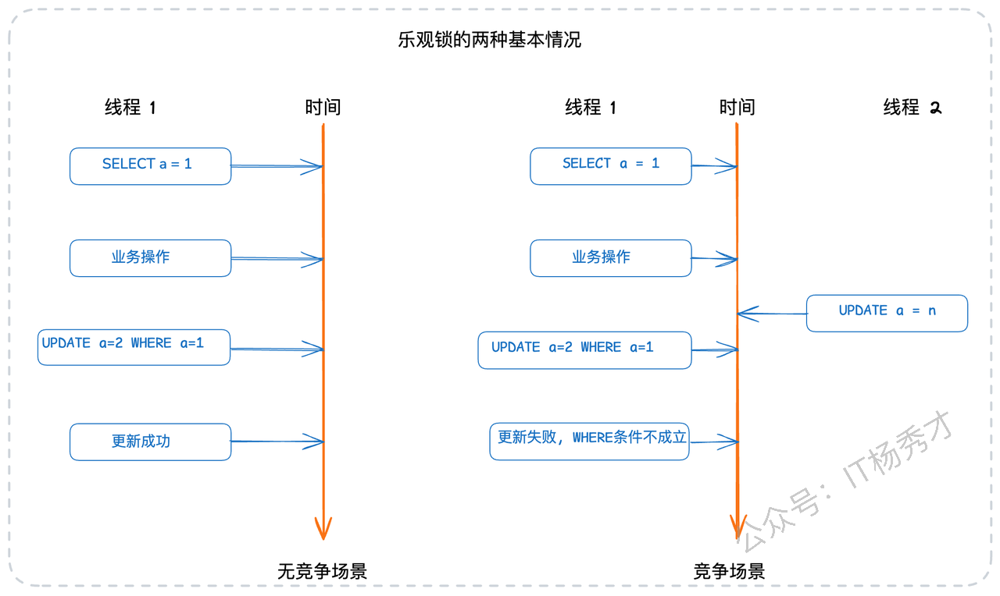
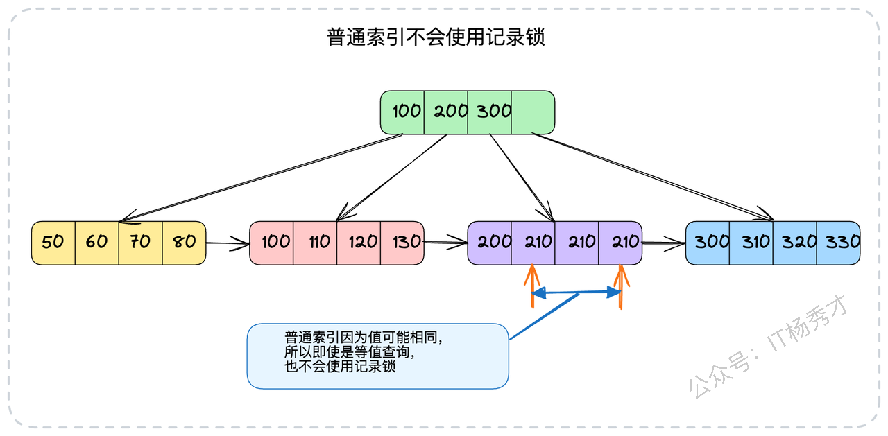
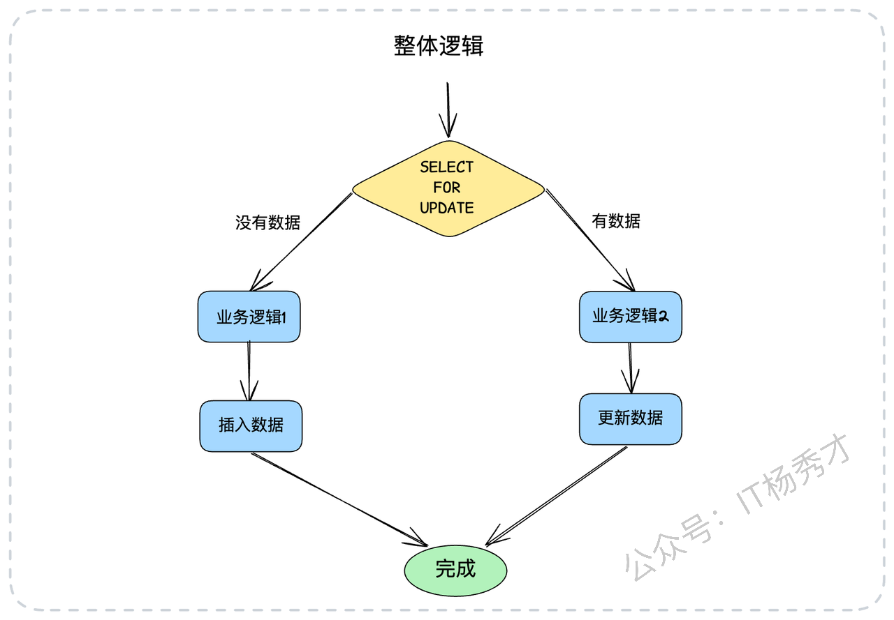

今天我们来深入探讨一下MySQL中的锁机制。在数据库相关的面试中，锁无疑是偏向高阶且内容较为零散的一类问题。但它的重要性不言而喻，比如在实际工作中，一次突发的死锁就可能严重影响线上服务的性能。这就要求我们作为后端工程师，必须对锁有扎实的理解。并且，锁的底层原理与索引、事务隔离级别息息相关，这三个知识点常常在面试中被串联起来提问，无论从哪个点切入，都很容易延伸到另外两个。

因此，一句话总结锁的特点就是：**既是难点，又是重点，还是热点**。在这篇文章中，我将带你彻底厘清MySQL锁的脉络，并告诉你如何在面试中将它转化为你的核心亮点。

## 1. **锁的核心知识回顾**

### 1.1 **锁与索引的关系**

在MySQL的InnoDB存储引擎里，你必须牢记一个核心原则：**锁是借助索引来实现的**。更具体地说，加锁操作锁住的并非数据行本身，而是数据行对应的**索引项**。从B+树的结构来看，最终锁定的就是叶子节点上的索引记录。


只要你从这个视角出发，就能理解绝大多数与锁相关的、看似千奇百怪的问题。

一个表可能存在多个索引，那么加锁时究竟会锁定哪个索引呢？答案是：**查询优化器最终选择使用的那个索引**。那么，如果一条查询语句因为没有合适的索引而走了全表扫描呢？在这种情况下，InnoDB无法在索引上实现行级别的锁定，只能退而求其次，将锁的粒度从"行"上升到"表"，也就是我们常说的**表锁**。

再来看一个有趣的场景：如果查询条件所指定的值在数据库中根本不存在，例如：

```sql
-- 尝试锁定一个不存在的记录
SELECT * FROM your_tab WHERE id = 150 FOR UPDATE;
```

此时id=150这条记录不存在，锁会如何作用？InnoDB引擎会利用B+树索引的有序性，找到与150相邻的索引记录（例如120和170），并在这两条记录之间构建一个**临键锁 (Next-Key Lock)**，其锁定的范围是(120, 170]。


这个临键锁的作用就是防止其他事务向这个"间隙"中插入id=150的新记录。

那么范围查询呢？其原理也是类似的。InnoDB会利用索引数据，构造一个刚好能覆盖整个查询范围的临键锁。例如：

```sql
-- 对id大于330的记录进行范围加锁
SELECT * FROM your_tab WHERE id > 330 FOR UPDATE;
```

对于这条语句，InnoDB会构建一个覆盖范围为(330, supremum]的临键锁。这里的`supremum`你可以直观地理解为InnoDB内部定义的一个虚拟的最大值，代表正无穷。


综上所述，我们得出一个至关重要的结论：**锁与索引密不可分，锁的粒度和效率直接取决于索引的使用情况**。

### 1.2 **锁的释放时机**

很多开发者在学习锁时会陷入一个误区，认为锁在SQL语句执行完毕后就会立刻被释放。这是一个错误的观念。实际上，**InnoDB中的锁是在整个事务结束时才会被释放的**。无论你是执行`COMMIT`提交事务，还是`ROLLBACK`回滚事务，事务内所有持有的锁都会在那个时刻被统一释放。


换言之，一个事务一旦给某份数据加上了锁，这把锁就会被一直持有，直到事务的终点。

### 1.3 **乐观锁与悲观锁**

乐观锁和悲观锁并非物理上真实存在的锁，而是两种并发控制的逻辑思想和设计哲学。

* **悲观锁**：它总是假设最坏的情况，认为数据在任何时候都可能被其他事务修改。因此，在操作数据之前，它会先将数据锁定，以阻止任何可能的并发修改。`SELECT ... FOR UPDATE`就是悲观锁最典型的实现。

* **乐观锁**：它则持有非常"乐观"的态度，假设在自己操作数据的这段时间里，别人不会来修改它。因此，它在操作数据时不会加锁，而是在最后提交更新的时候，去检查一下数据是否被修改过。

在数据库中，乐观锁通常指利用类似CAS（Compare-And-Swap，比较并交换）的思路去更新数据。其一般的使用形态如下：

```sql
-- 1. 先查询出数据，获取当前值（比如 a=1）
SELECT * FROM your_tab WHERE id=1; 

-- ... 在应用层执行一系列复杂的业务逻辑 ...

-- 2. 更新时，将之前查询到的值作为WHERE条件的一部分
UPDATE your_tab SET a=3, b=4 WHERE id=1 AND a=1;
```

在上述UPDATE语句中，我们预期数据库中`a`的值仍然是我们最初读到的1。如果在我们进行业务操作期间，`a`的值被其他事务修改了，那么这条UPDATE语句的WHERE条件将不成立，更新操作就会失败（影响行数为0）。业务方通过判断受影响的行数，就能得知此次并发更新是否成功。



而悲观锁的实现则更为直接，它从一开始就锁定了资源：

```sql
-- 1. 在查询时就直接加上排它锁
SELECT * FROM your_tab WHERE id=1 FOR UPDATE;

-- ... 在应用层执行一系列复杂的业务逻辑 ...

-- 2. 直接更新数据，因为数据已被锁定，无需担心被修改
UPDATE your_tab SET a=3, b=4 WHERE id=1;
```

在选择这两种锁时，需要权衡数据一致性与并发性能。乐观锁更适用于**读多写少**的场景，这也是绝大多数互联网应用的特征，它的性能开销更小。而悲观锁则适用于**写多读少**或对数据一致性要求极高的场景，例如金融领域对账户金额的操作，通常以写操作为主。

相比之下，乐观锁能提供更好的并发性能。不过，由于其实现逻辑需要应用层配合，写起来相对复杂，所以很多开发者为了图省事，会倾向于直接使用悲观锁。

### 1.4 **行锁与表锁**

行锁与表锁是根据锁定的**范围（粒度）**&#x6765;划分的。顾名思义，行锁锁住的是数据行，可能是一行，也可能是多行。而表锁则直接将整张数据表锁定。

在MySQL中，InnoDB存储引擎同时支持行锁和表锁。但必须再次强调，**行锁的实现强依赖于索引**。如果你的查询无法命中任何索引，导致全表扫描，那么InnoDB将无法使用行锁，只能退而求其次，使用表锁。当然，如果你使用的是一些较老的存储引擎，如MyISAM，那么它从设计上就只支持表锁。

### 1.5 **共享锁与排它锁**

共享锁和排它锁是从**互斥性**的角度来看待锁的。

* **共享锁 (Shared Lock, S锁)**：也称读锁。一个事务对某行数据加上S锁后，其他事务仍然可以继续对该行加S锁，但不能加排它锁（X锁）。它允许多个事务同时读取同一份数据。

* **排它锁 (Exclusive Lock, X锁)**：也称写锁。一个事务对某行数据加上X锁后，其他任何事务都不能再对该行加任何类型的锁（无论是S锁还是X锁），直到持有锁的事务释放。它保证了在任何时刻，只有一个事务能修改数据。

它们的兼容关系如下表所示：

### 1.6 **意向锁**

意向锁是一种**表级锁**，但它本身并不真正锁定数据，更像是一个"信号"或"标志"。它的核心作用是告诉其他事务："我（某个事务）正准备或已经对这个表里的某些行加锁了"。

意向锁与共享锁、排它锁结合，就产生了两种意向锁：

* **意向共享锁 (Intention Shared Lock, IS锁)**：表示一个事务希望获得表中某些行的共享锁。

* **意向排它锁 (Intention Exclusive Lock, IX锁)**：表示一个事务希望获得表中某些行的排它锁。

注意，"意向"强调的是一种打算，但最终能否成功获得行锁是不确定的。

在MySQL中，使用意向锁的典型场景是协调行锁和表锁的关系。当一个事务需要对表中的行加S锁或X锁时，它会先在表级别加上IS锁或IX锁。之后，如果另一个事务想要获取整个表的表锁（例如`LOCK TABLES ... WRITE`），它就无需逐行检查是否有行锁存在，只需检查表级别是否存在意向锁即可。这极大地提高了数据库的并发性能，并避免了不必要的死锁。这也是为什么在修改表结构（DDL）时，会阻塞所有增删改查（DML）语句的原因。

### 1.7 **记录锁、间隙锁和临键锁：深度剖析**

这是面试中最能检验候选人技术深度的部分，也是最容易混淆的概念。反过来说，如果你能将这部分的细节阐述清晰，本身就是一个非常大的亮点。

#### 1.7.1 **记录锁 (Record Lock)**

记录锁非常直观，它锁定的是**某一条特定的索引记录**。通常，当你的查询条件是**等值查询**，并且精准地命中了**主键**或**唯一索引**时，InnoDB就会使用记录锁。

```sql
-- 假设id是主键，这条语句会对id=310这一条记录加上记录锁
SELECT * FROM your_tab WHERE id = 310 FOR UPDATE;
```


如果查询条件作用在唯一索引上，且能命中一条记录，效果是完全一样的。假设`email`字段有唯一索引，这条语句也会使用记录锁

```sql
-- 假设email字段有唯一索引，这条语句也会使用记录锁
SELECT * FROM your_tab WHERE email='your_email' FOR UPDATE;
```

但是，如果等值查询没有命中任何记录，那么就不会使用记录锁，而是会使用间隙锁。比如数据库中只有 id 为（10，40，70）的三条记录，也就是 id= 30 这个条件没有命中任何数据，那么这条语句会在（10，40）加上间隙锁，注意，这里是对一个左开右开的区间加锁。可以看到， 即便是是对字段加了唯一索引，但是如果查询没有命中索引，对性能影响也是很大的。

#### 1.7.2 **间隙锁 (Gap Lock)**

间隙锁锁定的是一个**开区间范围**，即两条索引记录之间的"空隙"，但它不包括记录本身。它的主要作用是在可重复读隔离级别下，防止其他事务在这个"间隙"中插入新的记录，从而避免"幻读"问题。通常，范围查询（如`<`、`<=`、`BETWEEN`）会使用到间隙锁。

```sql
-- 这条语句会锁住(500, 1000)这个开区间
SELECT * FROM your_tab WHERE id BETWEEN 500 AND 1000 FOR UPDATE;
```

间隙锁会锁住(500, 1000)之间的数据，而500和1000这两条记录本身则会被记录锁锁住。如果你的表中没有id=500的记录，数据库会一直向左找到第一个存在的数据（比如400）；如果没有id=100的记录，则会一直向右找到第一个存在的数据（比如1200）。那么此时使用的间隙锁范围就是(400, 1200)。在这种情况下，如果有人想插入一条主键为700的行，操作就会被阻塞。

一个非常重要的特性是：**间隙锁和间隙锁之间是不排它的**。也就是说，两个不同的事务，即使它们申请的间隙锁范围有重叠，也可以同时加锁成功。


#### 1.7.3 **临键锁 (Next-Key Lock)**

临键锁是InnoDB在可重复读隔离级别下默认的锁定算法。从直观上，你可以把它看作是**一个记录锁和一个间隙锁的组合**。也就是说，临键锁不仅会用记录锁锁住命中的记录，还会用间隙锁锁住该记录之前的那个空隙。临键锁的锁定区间是一个**左开右闭**的区间。

还是用前面的例子，如果索引中只有(10, 40, 70)三条记录，那么一个临键锁就可以将(10, 40]这个区间锁住。临键锁与数据库的隔离级别联系最为紧密，它正是解决幻读问题的关键所在。

#### 1.7.4 **加锁规则总结**

为了更清晰地理解这三种锁的适用场景，我们可以将其总结为一套判断法则。这套法则的核心在于理解临键锁作为默认行为，以及它在特定条件下的"退化"现象。

* **基础原则：默认使用临键锁** 在可重复读（RR）隔离级别下，临键锁是InnoDB的基石和默认选择。无论是等值查询还是范围查询，InnoDB首先倾向于使用临键锁来锁定相关记录及其前方的间隙，以此来杜绝幻读的可能。

* **优化特例：退化为记录锁** 当查询能够实现最精准的定位时，临键锁会进行优化，退化为粒度更细的记录锁。这个特例的触发条件非常严格：

  * 查询条件必须是**等值查询**（如 `id = ?` 或 `email = ?`）。

  * 查询的列必须是**主键**或**唯一索引**。

  * 查询结果必须**精确命中**一条存在的记录。 只有同时满足这三个条件，InnoDB才会放弃对间隙的锁定，只对该条记录加记录锁。

* **另一特例：退化为间隙锁** 在某些情况下，临键锁中"锁定记录"的部分会消失，使其退化为纯粹的间隙锁。这通常发生在：

  * 查询的范围不包含任何存在的记录，例如 `WHERE id > 100`（假设100是最大ID）。

  * 查询一个在索引中不存在的值，例如 `WHERE id = 15`（假设12和17是相邻记录）。 在这些场景下，由于没有具体的"记录"可锁，锁定的重点就完全落在了防止新数据插入的"间隙"上。



需要注意的是，对于普通索引，即使是等值查询，因为索引值可能重复，InnoDB为了防止幻读，仍然会使用临键锁，而不是退化为记录锁。

## 2. **面试实战指南**

### 2.1 **打造你的实战知识库**

要在面试中脱颖而出，仅有理论知识是远远不够的。面试官更看重你解决实际问题的能力。因此，你需要主动构建一个属于自己的实战案例库。

* **复盘线上问题**：主动去了解和复盘公司发生过的与锁相关的线上故障，特别是那些导致服务抖动或中断的死锁案例。你需要搞清楚问题的全貌：它是在什么业务场景下触发的？排查过程是怎样的？最终是如何解决的？有没有留下什么隐患？

* **挖掘性能瓶颈**：审视你负责的业务，思考是否存在因为锁使用不当而导致的性能问题。比如，某个核心接口的响应时间（RT）很高，有没有可能是因为某个事务持有了过大的锁（如表锁）或者锁的持有时间过长？

* **解构锁的应用模式**：在公司的代码库中，主动去寻找和分析乐观锁与悲观锁的实际应用。对于乐观锁，它的CAS操作具体是如何通过SQL实现的？版本号是如何管理的？对于悲观锁，`SELECT ... FOR UPDATE`用在哪些关键业务上？这些用法是否合理？有没有优化的空间？

通过这种方式，将别人的经验和线上的教训内化为自己的知识，你才能在面试中言之有物。同时，你需要刻意训练自己分析SQL加锁行为的能力，拿到一条SQL和表结构，就能大致推断出它在特定隔离级别下会加什么锁，影响范围有多大，这会让你显得非常专业。

### 2.2 **结构化应答策略**

当面试官抛出"谈谈你对MySQL锁的理解"这类宏观问题时，你的回答需要有层次感，先搭建框架，再填充细节。

你可以这样开场，先给出一个全局视图：

> "好的。对于MySQL的锁，我习惯从几个不同的维度去理解它。首先，从**锁定粒度**上，有我们熟知的**行锁**和**表锁**。其次，从**锁的兼容性**上，可以分为**共享锁（S锁）和排它锁（X锁）**，这决定了它们是否可以共存。
>
> 在这两个基础维度之上，InnoDB为了提升性能，还引入了**意向锁**，它是一种表级锁，用来预示事务接下来想要加的行锁类型。
>
> 而在InnoDB的行锁实现中，又有三种具体的锁算法，这也是面试中的重点：**记录锁**、**间隙锁**和**临键锁**。它们是InnoDB在RR级别下解决幻读问题的核心。
>
> 最后，从**编程思想**的层面，我们还有**乐观锁**和**悲观锁**的概念，它们是我们在应用层进行并发控制的两种不同策略。"

在构建了整体认知框架后，再抛出锁机制的两个核心支柱：

> "要深入理解InnoDB的锁，关键在于抓住两个核心：**索引**和**事务隔离级别**。InnoDB的行锁是构建在索引之上的，没有索引，行锁就无从谈起，只能退化为表锁。而像临键锁和间隙锁这类精细的锁定策略，其主要舞台是在**可重复读（RR）**&#x8FD9;个隔离级别下，其根本目的是为了解决幻读问题。"

这样的回答方式，先展现了你知识的广度和体系性，然后点出了问题的本质，自然会引导面试官对你感兴趣的深层部分进行追问，比如：

* "你刚才提到的临键锁，能详细讲讲它的工作原理和使用场景吗？"

* "既然RR级别有临键锁可以防止幻读，那它在什么极端情况下还会出现幻读呢？"

* "你在项目中是如何选择使用乐观锁还是悲观锁的？能举个例子吗？"

* "听起来你对锁研究得比较深，有没有处理过线上死锁问题的经验？"

当面试官开始追问这些细节时，你就成功地将面试的主动权掌握在了自己手中，接下来就是你展示项目经验和技术深度的最佳时机。

### 2.3 **面试亮点方案**

#### 2.3.1 **基础优化：为高频查询添加索引**

这是一个基础却非常有效的优化，你可以把它作为一个"排查线上性能抖动"的故事来讲述。

> "我曾经处理过一个线上问题，某个核心服务的性能会周期性地出现毛刺，响应时间突然飙升。经过一系列排查，我们定位到瓶颈在于数据库。但奇怪的是，通过慢查询日志抓到的SQL，单独执行时速度很快，并且`EXPLAIN`分析也显示它命中了索引。
>
> 后来，我们通过`SHOW PROCESSLIST`和数据库监控，才发现在性能抖动的时刻，有大量正常的查询都阻塞在`Waiting for table metadata lock`状态。我们顺藤摸瓜，最终发现源头是后台一个新功能引入的报表SQL。这条SQL的查询条件非常复杂，且没有建立合适的索引，导致它在执行时，MySQL对目标表施加了**表锁**。由于报表查询数据量大，执行时间长，这个表锁被长时间持有，从而阻塞了所有其他针对该表的正常业务操作。
>
> 找到问题后，解决方案就很明确了：我们与业务方沟通，优化了这条SQL，并为其添加了合适的复合索引，使其从表锁降级为行锁。上线后，服务性能毛刺的问题就彻底消失了。"

#### 2.3.2 **进阶方案：破解临键锁引发的并发死锁**

这个案例更能体现你对InnoDB锁机制的深度理解。

> "我们有一个业务场景，需要在一个事务里先查询某个资源位是否存在，如果不存在，就计算并插入一个新资源；如果已存在，就基于现有资源进行更新。这个逻辑可以简化为'查询并锁定，然后插入或更新'。



伪代码大概是这样：

```sql
BEGIN;
SELECT * FROM resource WHERE position = ? FOR UPDATE;
-- 如果记录不存在
INSERT INTO resource (...) VALUES (...);
-- 如果记录存在
-- UPDATE resource SET ... WHERE position = ?;
COMMIT;
```

看起来是不是没有任何问题？实际上，这个地方在高并发下会引起死锁。

假设现在数据库中ID最大的值是780。那么如果两个业务线程几乎同时进来，执行这段逻辑，一个准备插入id=790的数据，一个准备插入id=800的数据。如果它们的执行时序如下图所示，那么你就会得到一个死锁错误。


> 这段代码在并发量上来后，频繁地引发数据库死锁。经过复盘，我们发现死锁的根源在于**临键锁**。假设`position`索引当前的最大值是780，两个并发事务分别尝试操作`position=790`和`position=800`。由于这两条记录都不存在，它们都会在`(780, +∞)`这个间隙上成功获得临键锁。接着，事务A想插入790，需要获取790的行锁，但这个位置被事务B的临键锁覆盖，于是等待；同时，事务B想插入800，也被事务A的临键锁覆盖，也开始等待。这样，两个事务互相等待对方释放自己需要的间隙，就形成了死锁。


针对这个问题，我们当时探讨了三种解决方案：

> 1. **调整业务逻辑**：将'先查后插'改为'直接插入'。我们尝试直接`INSERT`，如果成功，说明资源位原先为空；如果因为主键或唯一键冲突而失败，则说明资源位已存在，再去执行更新逻辑。这样，成功的事务从一开始就持有行锁，而不是临键锁，从而规避了死锁。
>
> 2. **降低隔离级别**：将事务的隔离级别从RR降为RC（读已提交）。在RC级别下，没有间隙锁，自然也就没有临键锁，死锁问题迎刃而解。但这个方案影响较大，需要评估业务是否能接受RC级别可能带来的不可重复读和幻读问题。
>
> 3. **改用乐观锁**：完全放弃悲观锁，但这需要对代码进行较大范围的重构。
>
> 最终，我们选择了第一种方案，因为它对代码的侵入性最小，且效果立竿见影。"

#### 2.3.3 **高阶重构：以乐观锁替代不必要的悲观锁**

你可以将这个案例包装成一次主动的技术重构，体现你的架构思维和性能意识。

> "在我之前负责的一个项目中，我注意到许多核心业务模块为了保证数据一致性，普遍采用了`SELECT ... FOR UPDATE`的悲观锁模式。这种模式虽然简单可靠，但在读多写少的场景下，会造成不必要的线程等待，极大地限制了系统的并发能力。
>
> 因此，我主导了一项技术优化，对这些不必要的悲观锁进行乐观锁改造。改造的核心思想是，在事务中去掉`FOR UPDATE`，并在`UPDATE`语句中增加对数据版本的校验。

改造前的伪代码：

```go
// 开启事务并加锁
tx.Begin()
data := tx.SelectForUpdate(id) 
// 业务计算
newData := calculate(data)
tx.Update(newData)
tx.Commit()
```

改造后的伪代码：

```go
for {
    // 1. 普通查询，获取数据和版本号
    data, version := SelectWithVersion(id)
    // 2. 业务计算
    newData := calculate(data)
    // 3. CAS更新，通过版本号防止并发修改
    rowsAffected := UpdateWithCAS(id, newData, version)
    // 4. 如果更新成功（影响行数为1），则退出循环
    if rowsAffected == 1 {
        break
    }
    // 如果更新失败，则循环重试
}
```

> 这次重构的效果非常显著，核心接口的吞吐量提升了将近30%。当然，这个方案并非万能灵药。对于那些写冲突非常频繁的业务，使用乐观锁可能会导致大量的重试，反而降低性能，这种场景下保留悲观锁依然是更明智的选择。"

## 3. 小结

这篇文章，我们系统性地梳理了MySQL锁机制的方方面面。从锁与索引的共生关系，到不同维度下锁的分类（行锁与表锁、共享锁与排它锁、意向锁），再到InnoDB为了解决幻读问题而设计的三种核心锁形态（记录锁、间隙锁、临键锁），我们建立了一个相对完整的知识框架。

更重要的是，我们必须认识到，对锁的理解不能止步于理论。无论是通过"为缺失索引的查询补上索引"来避免表锁的基础优化，还是分析"临键锁引发死锁"和"以乐观锁替代悲观锁"这类更复杂的实战场景，最终目的都是为了将理论知识转化为解决实际问题的能力。你在面试中准备的案例，不应仅仅是背诵的脚本，而应是你对这些问题深入思考和理解的体现。


