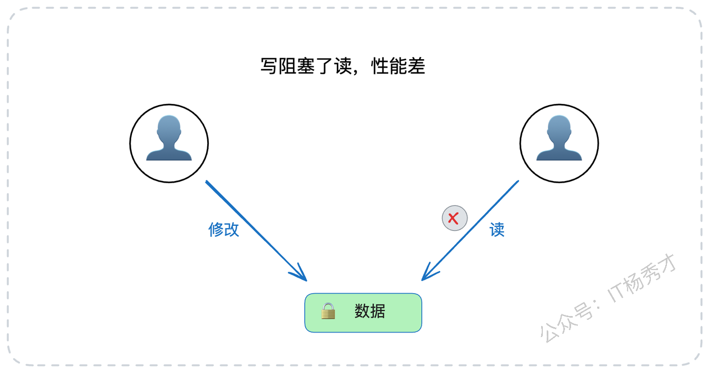
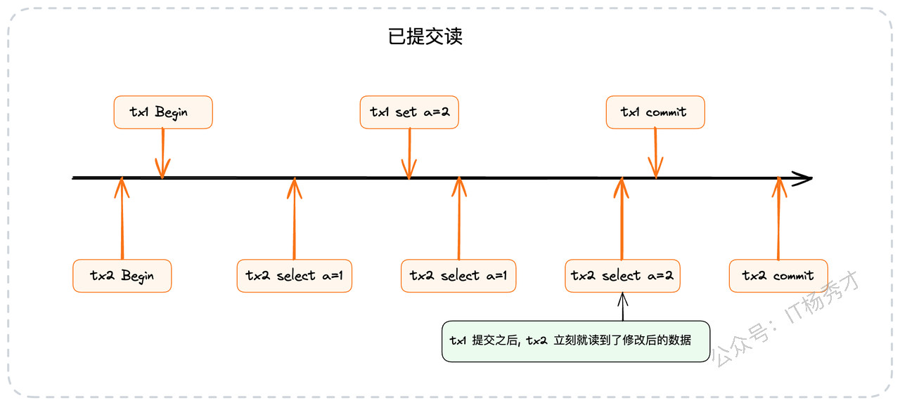
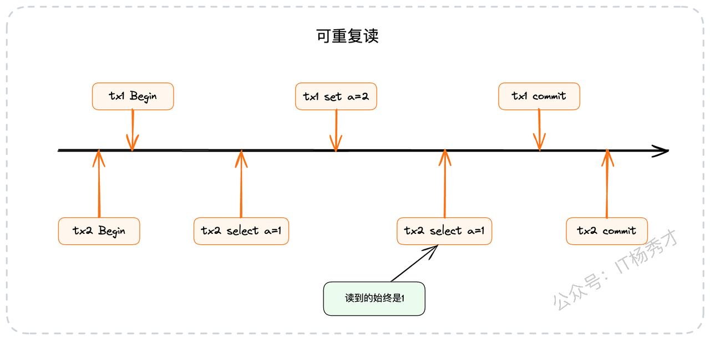
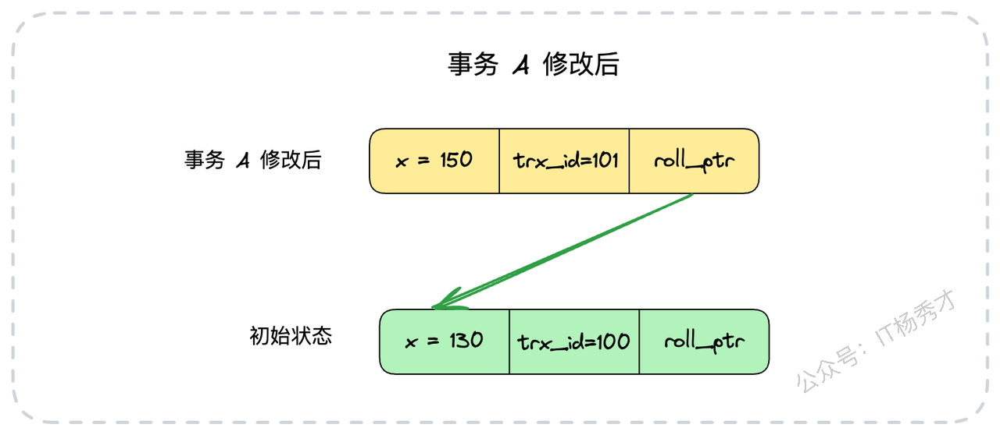
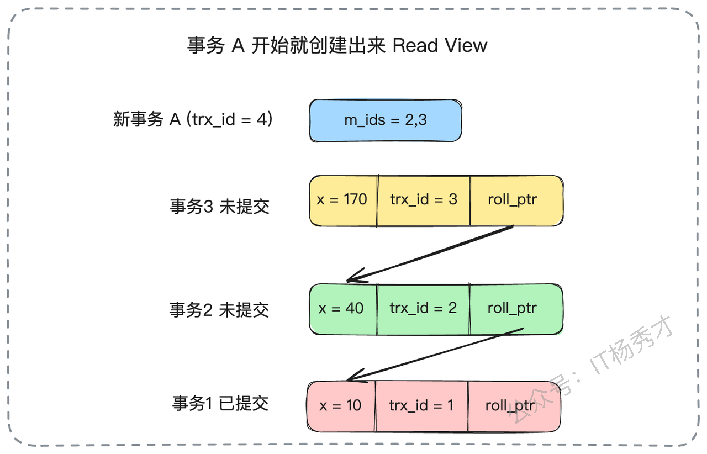
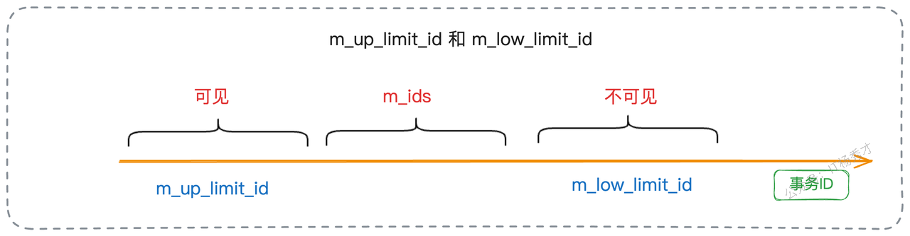
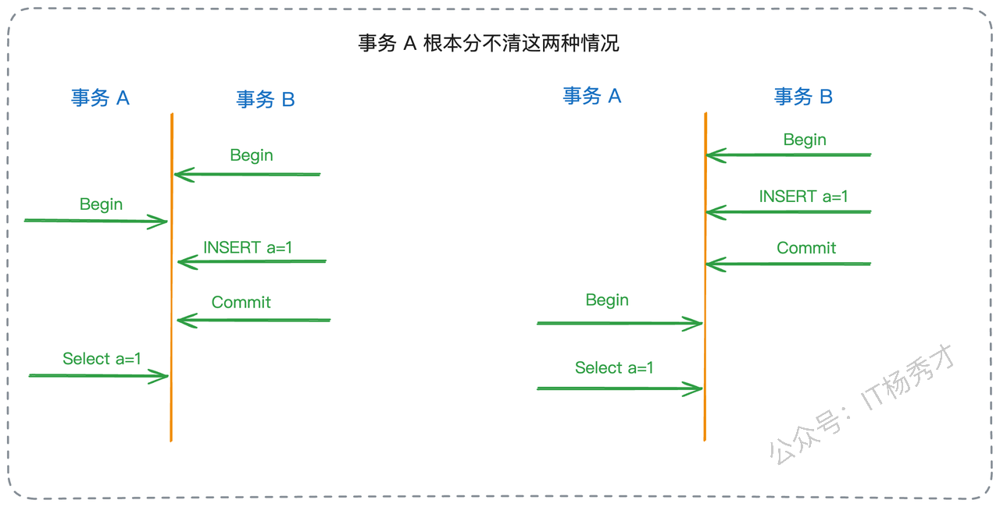

今天我们来聊一个MySQL面试中的高频考点，也是每一位后端开发者都应该深度掌握的核心知识——MVCC协议。

MVCC，全称是多版本并发控制（Multi-Version Concurrency Control），它是MySQL InnoDB存储引擎用以实现高效并发访问的基石。在面试中，这几乎是一个无法绕开的话题，它如同一扇门，推开它，就能通向对事务、隔离级别、锁机制等一系列更深层次知识的探讨。因此，彻底搞懂MVCC，能让你在面试中游刃有余，从容地展现自己的技术深度。

在接下来的内容里，我将带你从MVCC的底层原理出发，不仅让你理解它“是什么”，更让你明白它“为什么”如此设计，以及如何在面试中将这些知识转化为你的优势。

在正式开始之前，我们先来思考一个最根本的问题：在已经有锁机制的情况下，InnoDB为什么还需要费尽心机地引入MVCC呢？

## **1. MVCC有什么用**

你可能已经对数据库的锁机制有所了解，知道它是保障数据一致性、进行并发控制的基础工具。那么，既然已经有了锁，为什么InnoDB还要多此一举引入MVCC呢？直接用读写锁把所有并发访问都管起来，不是更简单直接吗？

答案是：**单纯依赖锁，性能实在太糟糕了。**

在一个纯粹的锁模型中，为了保证绝对的数据一致性，操作之间的互斥是不可避免的。写操作会阻塞其他写操作，这理所当然。但更致命的是，写操作同样会阻塞读操作。即使用了所谓的“读写锁”（允许多个读操作并发，但读写、写写互斥），读与写之间的冲突依然存在。

数据库系统与常规的应用程序有一个显著的区别：它承载着高频的读写请求，尤其是读取操作，其性能表现至关重要。想象一下这个业务场景：一个核心业务线程正在执行`UPDATE`操作修改某一行关键数据，哪怕这个操作只需要几十毫秒，但在这期间，所有希望读取这行数据的`SELECT`请求都被迫挂起等待。在高并发系统中，这种阻塞会迅速累积，导致系统吞吐量急剧下降，用户响应时间大幅延长。这样的性能表现，在真实的线上环境中是绝对无法接受的。

显然，为了挣脱这种性能枷锁，数据库必须寻求一种更优的解决方案，实现一种“读写并发”的理想状态：**当我在修改数据时，你依然可以无阻塞地读取数据。** 这就是MVCC诞生的核心驱动力。它通过一种巧妙的方式，让读和写在大多数时候可以各行其道，互不干扰。

理解了MVCC存在的价值后，我们才能更好地去探究它的实现细节。而要理解MVCC，就必须先掌握一个与之紧密相连的前置概念——事务的隔离级别。

## **2. 事务的隔离级别**

数据库的隔离级别，本质上是定义的一套“游戏规则”，它用于规范在并发环境下，一个事务的修改对其他事务的可见性程度。换句话说，它界定了事务之间“互相了解”的边界。ANSI/ISO SQL标准定义了四种隔离级别：

1. **读未提交（Read Uncommitted）**

这是最低的隔离级别。在此级别下，一个事务可以看到另一个事务尚未提交的修改，因此风险极高，可能会导致“脏读”。

* **读已提交（Read Committed, RC）**

这是大多数主流数据库（如Oracle、PostgreSQL）默认的隔离级别。一个事务只能看到其他事务已经提交的修改。这确保了你读到的数据至少是“真实存在”过的。但问题在于，在一个事务的执行过程中，如果其他事务提交了新的修改，本事务后续的查询是能够看到这些新变更的，从而导致“不可重复读”。

* **可重复读（Repeatable Read, RR）**

这是MySQL InnoDB存储引擎的默认隔离级别。它保证了在一个事务内部，无论你对同一份数据读取多少次，得到的结果始终是一致的。这意味着，一旦事务开始，它就仿佛进入了一个“时间凝固”的快照中，即使在此期间有其他事务提交了修改，当前事务也“视而不见”。

* **串行化（Serializable）**

这是最高的隔离级别。它通过对所有读写操作都加锁的方式，强制所有事务串行执行，一个接一个地排队处理。这能够完全避免所有的并发问题，但代价是并发性能急剧下降，几乎回到了单线程时代。

从上到下，隔离性越来越强，数据一致性保障越好，但并发性能也随之下降。因此，选择合适的隔离级别，是在业务需求和系统性能之间进行权衡的艺术。

与隔离级别相伴而生的，是三个经典的并发读问题：

* **脏读（Dirty Read）**：指读到了其他事务还未提交的数据。这些数据因为随时可能被回滚而消失，所以被称为“脏”数据，是极不稳定的。

* **不可重复读（Non-Repeatable Read）**：指在同一个事务中，对同一行数据前后两次读取，得到的结果不一致。其关注点在于**数据内容的变更**。

* **幻读（Phantom Read）**：指在一个事务的执行过程中，另一个事务插入了新的数据行并提交，导致第一个事务在后续的查询中，读到了之前不存在的“幻影”行。其关注点在于**数据行数的增减**。

我们可以用一个表格来清晰地展示隔离级别与这三种读问题的关系：

这里需要特别强调一点：根据SQL标准，可重复读隔离级别是无法完全避免幻读的。但是，MySQL的InnoDB引擎通过引入\*\*临键锁（Next-Key Lock）\*\*这一强大的锁定机制，在RR级别下巧妙地解决了幻读问题。在面试中提及这一点，并能解释其原理，无疑会是一个重要的加分项。

此外，还有两个概念需要精确区分：**快照读（Snapshot Read）和当前读（Current Read）**。简单理解，快照读（如普通的`SELECT`）读取的是MVCC机制提供的历史版本数据，它无须加锁，速度很快。而当前读（如`SELECT ... FOR UPDATE`、`UPDATE`、`DELETE`）读取的是数据库中最新的、已提交的版本，并且会对读取的记录加锁，以保证数据的一致性。在MySQL的可重复读隔离级别下，普通的`SELECT`语句执行的就是快照读。

## **3. 版本链**

为了实现MVCC，InnoDB为表中的每一行数据都额外增加了两个隐藏的系统字段：`trx_id`和`roll_ptr`。

* `trx_id`（Transaction ID）：事务ID。MVCC中的“V”（Version）指的就是由不同事务ID创造的数据版本。每当一个事务开始时，它会获得一个唯一的、单调递增的事务ID。当这个事务修改某行数据时，该行的`trx_id`就会被更新为当前事务的ID。

* `roll_ptr`（Rollback Pointer）：回滚指针。它是一个指向`undo log`中上一版本记录的指针。InnoDB正是通过这个指针，将一行数据的多个历史版本像链表一样串联起来，形成一个“版本链”。

实际上，InnoDB还有一个隐藏的`row_id`列，在没有显式定义主键时，它会作为内部主键。但它与MVCC的并发控制逻辑关系不大，我们在此不做过多关注。

下面，我们通过一个具体的例子来直观地理解版本链是如何构建的。

假设我们向表中插入一条新数据`{id: 1, x: 130}`，执行该操作的事务ID为100。此时，这行数据的最新版本状态如下：

现在，一个新的事务A（ID为101）启动，并将`x`的值修改为150。这时，数据库并不会直接覆盖原始数据，而是会执行以下操作：

1. 将原始行数据`{id: 1, x: 130, trx_id: 100}`完整地拷贝到`undo log`中。

2. 在原始数据行上进行修改，将`x`更新为150，并将`trx_id`更新为当前事务的ID，即101。

3. 将这行新数据的`roll_ptr`指向刚刚在`undo log`中创建的旧版本记录。

修改后，数据行的最新状态变为：

接着，又来了一个事务B（ID为102），它将`x`的值从150修改为200。同样地，数据库会重复上述过程，将`trx_id`为101的版本拷贝到`undo log`，然后更新数据行的最新版本，并将`roll_ptr`指向`trx_id`为101的版本。

这样一来，通过`roll_ptr`，一行数据的多个历史版本就被从新到旧地串联成了一条链表。这条链就是大名鼎鼎的**版本链**。

现在问题来了：如果一个新的事务C想要读取`x`的值，它面对的是一条长长的版本链，它应该读取哪个版本的数据呢？这就引出了MVCC的另一个核心裁决机制：Read View。

## 3.1 **Read View（读视图）**

你可以将Read View（读视图）理解为一套在特定时刻生成的“可见性规则快照”。当一个事务需要进行快照读时，数据库会依据这个Read View来扫描版本链，判断哪个版本是对当前事务可见的。

Read View主要在“读已提交（RC）”和“可重复读（RR）”这两个隔离级别下工作。它们的核心区别，就在于**生成Read View的时机**。

* **读已提交（RC）**：事务中**每一次**`SELECT`查询开始时，都会重新生成一个新的Read View。

* **可重复读（RR）**：仅在事务**第一次**`SELECT`查询时，生成一个Read View，并在此后的整个事务期间都复用这个Read View。

这个区别可以用一个形象的比喻来描述：RC隔离级别像一个每次约会都换新对象的“花心大少”，他眼中的世界总是在变化；而RR隔离级别则像一个从始至终只认初恋的“痴情种子”，无论外界如何变迁，他眼中的恋人永远是最初的模样。

### **3.2 Read View与读已提交（RC）**

在RC隔离级别下，每次查询都会生成新的Read View，这意味着在事务执行过程中，可见性判断的基准是动态变化的。

我们来看一个例子。假设当前数据库中有三个事务修改过的历史版本，状态如下：

现在，一个新的事务A（`trx_id`为4）启动了。当它第一次查询`x`的值时，MySQL会创建一个Read View。此时，活跃（未提交）的事务ID集合是`m_ids = {2, 3}`。事务A会沿着版本链从最新版本开始查找，它会跳过`trx_id`为3和2的版本（因为它们的事务ID在活跃事务列表`m_ids`中，意味着它们是“未提交”或“并发”的事务），最终找到`trx_id`为1的版本。这个版本已经提交，所以事务A读到的`x`的值是10。

紧接着，事务2提交了。然后事务A在同一个事务内再次查询`x`。由于是RC隔离级别，MySQL会**重新生成一个Read View**。此时，活跃事务列表变成了`m_ids = {3}`。事务A再次沿着版本链查找，它会跳过`trx_id`为3的版本，但当它检查到`trx_id`为2的版本时，发现2已经不在新的活跃列表`m_ids`中了（意味着事务2已提交），于是它读取了这个版本的数据。因此，事务A这次读到的`x`的值是40。这就是“不可重复读”的由来。

### **3.3 Read View与可重复读（RR）**

在RR隔离级别下，Read View在事务第一次查询时创建，并在整个事务期间保持不变。

我们用同样的例子来说明。当事务A（ID为4）第一次查询时，创建了一个Read View，其活跃事务列表为`m_ids = {2, 3}`。

此时，事务A查询`x`的值，与RC级别下的第一次查询一样，它会忽略`trx_id`为2和3的未提交版本，最终读到`trx_id`为1的版本，结果为`x=10`。

接下来，即使事务2提交了，当事务A再次查询`x`的值时，它使用的仍然是事务开始时创建的那个**旧的Read View**。在这个旧的Read View中，`m_ids`依然是`{2, 3}`。所以，对于事务A来说，事务2看起来仍然是“未提交”的（因为事务2的ID存在于它持有的那个旧的Read View的`m_ids`列表中）。因此，它会再次忽略`trx_id`为2的版本，最终读到的结果仍然是`x=10`。

这就是“可重复读”的实现原理。无论其他事务如何提交，当前事务的“视界”在事务开始的那一刻就已经被固定下来了。

### **3.4 Read View小结**

为了让你更清晰地理解，我将上述过程总结为两张图。

**读已提交（RC）下的Read View变化：**

**可重复读（RR）下的Read View固定：**

实际上，一个完整的Read View除了`m_ids`（活跃事务ID列表）外，还包含其他几个关键字段，共同构成了可见性判断的完整逻辑：

* `m_up_limit_id`：`m_ids`列表中的最小事务ID。任何`trx_id`小于此值的版本，都表示是“已提交”的，因此可见。

* `m_low_limit_id`：当前系统中下一个将被分配的事务ID。任何`trx_id`大于等于此值的版本，都表示是“未来”的事务，因此不可见。

* `m_creator_trx_id`：创建该Read View的事务自身的ID。自身的修改总是可见的。

可见性判断的完整规则可以概括为：

对于一个版本链上的数据行，其`trx_id`会与Read View的这几个字段进行比较，以确定其是否可见。不过，在面试中，你只需要记住核心逻辑——`m_ids`和Read View的创建时机——就足以理解MVCC的精髓了。

## **4. 面试实战指南**

掌握了前面的基础知识，我们来看看在面试中如何将这些知识转化为你的优势。

首先，你必须清楚自己公司生产环境数据库的隔离级别。如果不是默认的RR，那你一定要搞清楚为什么要做这样的调整，这本身就是一个很好的实践案例。

面试官可能会现场构造一个并发场景来考察你。我的建议是，对这类问题提前做好心理准备。如果一时反应不过来，不要慌张，可以礼貌地请面试官慢速复述一遍问题，甚至可以主动请求使用纸笔，将版本链和Read View的演变过程画出来再分析，这不仅能帮助你理清思路，还能向面试官展示你扎实、严谨的分析能力。

### **4.1 基本思路**

当面试官从锁的问题过渡到MVCC，问“为什么有了锁还需要MVCC”时，你的回答要突出关键词：**避免读写阻塞，实现读写并发**。

> “单纯使用锁机制，并发性能会很差。即使是读写锁，读和写操作之间仍然是互斥的。数据库作为高性能中间件，如果一个写操作就导致所有读操作被阻塞，这种性能损失是无法接受的。因此，InnoDB引擎引入了MVCC，其核心目的就是通过空间换时间的方式，实现读写操作的并发执行，极大地提升了数据库的并发处理能力。”

更多时候，面试官会直接提问MVCC本身。这时，你可以按照“**定义 -> 实现机制 -> 关联隔离级别**”的逻辑顺序，简明扼要地回答：

> “MVCC是MySQL InnoDB引擎用于实现高并发访问的一种协议。它的核心实现主要依赖于两大组件：**版本链（Version Chain）和读视图（Read View）**。
>
> 首先，在InnoDB中，每一行数据都有两个隐藏列：`trx_id`（最后修改该行的事务ID）和`roll_ptr`（回滚指针）。通过回滚指针，InnoDB将一行数据的多个历史版本在`undo log`中串联起来，形成版本链。
>
> 其次，当一个事务发起快照读时，MVCC会根据该事务的隔离级别（读已提交或可重复读）生成一个Read View。这个Read View定义了一套可见性规则，事务会用这个Read View去匹配版本链，从而找到对当前事务可见的那个特定版本的数据。”

这个回答非常简洁，但覆盖了所有关键点，并且为面试官的追问留下了引子。

### **4.2 亮点方案：推动隔离级别调整**

这是一个可以充分展示你实践经验和思考深度的亮点。你可以描述你如何推动公司将数据库隔离级别从默认的RR调整为RC。

你需要说清楚两点：

1. 为什么要把默认的RR降级为RC？

2. 降级后，如果真的遇到需要RR特性的场景，该如何处理？

你可以这样组织你的回答：

> “在我之前参与的一个项目中，我发现我们数据库普遍使用的是MySQL默认的‘可重复读’（RR）隔离级别。但经过深入的业务场景分析后，我发现绝大多数事务并不需要‘可重复读’的特性，比如一个事务内对同一数据的多次读取几乎不存在。
>
> 与此同时，使用RR级别却带来了一些实际问题。首先，RR级别由于临键锁的存在，比RC级别更容易在并发写入时引发间隙锁导致的死锁。我们线上也确实遇到过因此产生的棘手死锁问题。其次，从性能角度看，RC级别下，事务提交后会更快地释放锁，并且`undo log`的保留链条通常更短，这都意味着RC级别能提供更好的并发性能。
>
> 基于这些考虑——业务不需要、存在死锁风险、性能更优——我主导并推动了公司数据库隔离级别的调整，将新业务的默认级别从RR降级为RC，从而提升了系统的整体性能和稳定性。”

此时，面试官很可能会追问：“这个方案很好，但调整之后，如果某个特殊业务确实需要可重复读的特性，你怎么办？”

> “这是一个非常好的问题，我们在推进时也充分考虑了这一点。我们的解决方案是分层处理：
>
> 首先，我们会优先尝试**从业务逻辑层面进行改造**。很多所谓的‘可重复读’需求，其实是可以通过优化代码来满足的。例如，如果一个业务流程中需要多次使用同一份数据，我们完全可以在第一次读取后将结果在应用层面缓存起来（比如放在一个变量里），供后续流程使用，这样就自然避免了对数据库的多次查询。
>
> 至于幻读，在绝大多数互联网业务中，它通常不被视为一个严重的问题。原因有二：一是业务代码很难区分读到的新数据是幻读，还是在事务开始前就已存在的数据。比如你在事务 A 里面读到了一条数据，你判断不出来它是在事务 A 开始之前就插入的，还是在事务 A 开始之后，事务 B 才插入并且提交的。

> 二是事务的提交通常意味着一笔业务逻辑的完结。如果事务A读到了事务B新插入并已提交的数据，从业务角度看，可以认为事务B所代表的业务已经完成了，那么事务A读到这个“新”结果也是合乎逻辑的。
>
> 当然，如果遇到非常极端、无法通过业务改造来解决的场景，我们还有最后的兜底方案：**在代码中为单个事务显式指定隔离级别**。我之前调整的是数据库的全局默认隔离级别，但MySQL允许在Session级别，甚至是单个事务级别通过`SET TRANSACTION ISOLATION LEVEL REPEATABLE READ;`来动态设置隔离级别。这样既能让绝大多数业务享受RC级别带来的整体性能提升，又能以最小的代价灵活应对个别特殊需求，实现了全局最优和局部最优的统一。”

## **5. 小结**

这篇文章我们深入探讨了MVCC的原理与实践，我为你梳理一下核心要点，方便你记忆和复习：

1. **为何需要MVCC**：在已有锁的情况下，核心是为了实现**读写并发**，避免读写操作相互阻塞，提升性能。

2. **核心概念**：必须牢记四种隔离级别（未提交读、已提交读、可重复读、串行化）和三种读异常（脏读、不可重复读、幻读）。

3. **实现原理**：理解MVCC如何通过`trx_id`和`roll_ptr`在`undo log`中构建**版本链**。

4. **关键机制**：理解**Read View**是如何在不同隔离级别（RC和RR）下工作的，尤其是其**创建时机**的不同，是区分二者的关键。

最后，我为你准备的“调整隔离级别”的亮点方案，在面试时要抓住两个关键点：

* **为什么要调整为RC？** 两个主要原因：业务用不上RR的特性；提升性能并减少死锁风险。

* **调整后如何应对特殊需求？** 首选方案是改造业务逻辑，兜底方案是在代码中为单个事务显式指定隔离级别。

通过这篇文章希望能让你对MVCC有一个全新的、更深刻的理解。

# 资料分享
随着AI发展越来越快，AI编程能力越来越强大，现在很多基础的写接口，编码工作AI都能很好地完成了。并且现在的面试八股问题也在逐渐弱化，**面试更多的是查考候选人是不是具备一定的知识体系，有一定的架构设计能力，能解决一些场景问题**。所以，不管是校招还是社招，这都要求我们一定要具备架构能力了，不能再当一个纯八股选手或者是只会写接口的初级码农了。这里，秀才为大家精选了一些架构学习资料，学完后从实战，到面试再到晋升，都能很好的应付。**关注秀才公众号：IT杨秀才，回复：111，即可免费领取哦**

# **学习交流**

> 如果您觉得文章有帮助，可以关注下秀才的<strong style="color: red;">公众号：IT杨秀才</strong>，后续更多优质的文章都会在公众号第一时间发布，不一定会及时同步到网站。点个关注👇，优质内容不错过

