在分布式系统的架构设计中，分库分表是一个无法回避的话题。当数据量达到一定规模，单库单表已经无法承载业务压力时，我们就需要考虑将数据分散到多个数据库和多个表中。然而，这种分散带来了一个新的挑战：如何在分库分表的场景下生成全局唯一且有序的主键。

这个问题看似简单，实际上却涉及数据库底层原理、分布式系统设计、并发控制等多个技术领域。这篇文章就深入探讨分库分表场景下的主键生成策略，从最基础的UUID方案，到经典的雪花算法，再到更具创新性的主键内嵌分库分表键方案，为你提供一套完整的解决方案。

## **1. 分库分表为什么不能用自增主键**

在深入讨论主键生成策略之前，我们需要先理解分库分表的基本概念。严格来说，分库分表包含了三个层面的拆分：分数据源、分库和分表。在实际生产环境中，这三者往往会组合使用。

举个例子，某电商平台的订单表采用了分库分表策略，使用了6个主从集群，每个集群包含5个数据库，每个数据库又拆分为64张表，整体规模达到了6乘以5乘以64的拆分粒度。当然，根据实际的数据规模和读写压力，也可以采用更简单的拆分方式，比如共享一个主从集群，只进行分库或者只进行分表。

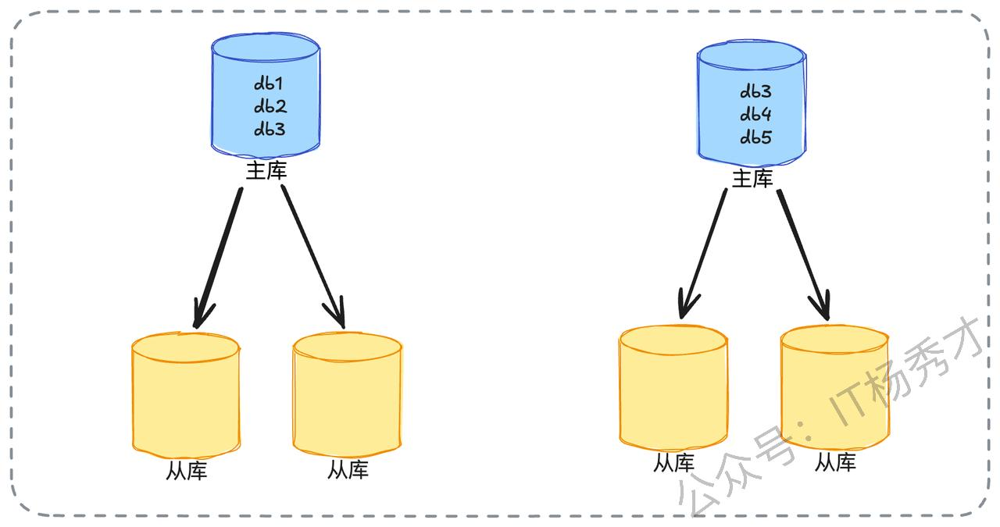

当系统采用分库分表后，传统数据库的自增主键就会遇到问题。在单库单表的场景下，我们可以直接使用数据库的自增主键功能，比如在MySQL中创建表时指定`AUTO_INCREMENT`属性。

```sql
-- 订单表建表语句，使用自增主键
CREATE TABLE order_info (
   id BIGINT PRIMARY KEY AUTO_INCREMENT,  -- 自增主键
   buyer_id BIGINT NOT NULL,              -- 买家ID
   order_amount DECIMAL(10,2)             -- 订单金额
)
```

然而在分库分表的场景下，这种自增主键机制就会失效。假设我们按照买家ID对2取模的方式将订单表拆分为两张表，分别是`order_info_0`和`order_info_1`。如果这两张表都依赖各自的自增机制生成主键，那么两张表可能会生成相同的ID。比如两张表各自插入第一条记录时，生成的ID都是1，这就导致了主键冲突。

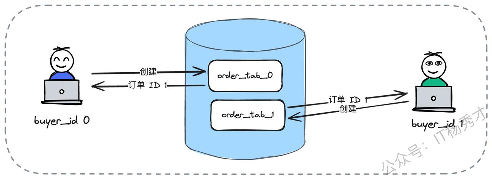

因此，在分库分表场景下，我们需要设计一个能够生成全局唯一ID的机制。这个机制需要满足两个核心要求：首先，生成的ID必须是全局唯一的，不能出现重复；其次，理想情况下ID应该保持递增特性，因为递增与否会显著影响数据库的插入性能。此外，由于采用分库分表的系统通常数据量巨大，意味着并发量也很高，所以主键生成方案还需要考虑如何支持高并发场景。

## **2. 面试引导**

在实际的技术面试中，如何将话题引导到主键生成这个技术点上，也是一门学问。如果你在简历中提到了分库分表的项目经验，面试官很可能会主动询问主键是如何生成的。如果在面试过程中被问及数据库自增主键的相关问题，你可以主动提及自增主键在分库分表场景下的局限性，这样面试官自然会追问分库分表场景下的主键生成方案。

当面试官问到这些问题时，如何抓住机会展现自己的技术深度呢？这需要我们提前做好充分的准备。具体来说，需要深入理解市面上常见的主键生成策略，准备一个有亮点的、具备微创新性的主键生成方案，同时还要记住一些可行的优化思路。接下来，我们将逐一分析这些内容。

## **3. 常见主键生成策略**

当面试官询问分库分表中如何解决主键问题，或者如何设计一个发号器时，他们通常期望你能够回答出几种常见的主键生成思路，主要包括UUID、数据库自增和雪花算法。下面我们逐一深入分析这些方案。

### **3.1 基础方案：UUID**

UUID是最直接的主键生成方案，也是面试中必须能够回答出来的基础策略。虽然UUID实现简单，但如果我们想在面试中脱颖而出，就需要深入分析UUID的弊端。

UUID主要有两个明显的缺陷。第一个是长度问题，UUID通常占用36个字符，存储空间较大，不过在实际采用UUID的场景中，这个缺点通常不是主要考虑因素。第二个缺陷更为关键，那就是UUID不是递增的，这个弊端是面试时需要重点阐述的内容。

#### **3.1.1 页分裂**

要讲清楚UUID不是递增的弊端，我们需要先理解为什么数据库倾向于使用自增主键。这里的关键词是页分裂。

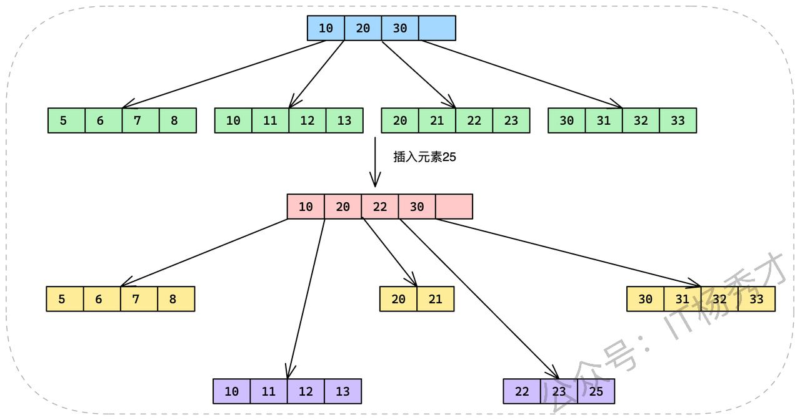

数据库的B+树索引结构中，数据按照主键大小有序存储在叶子节点上。当我们需要插入一条新记录时，如果这条记录的主键值恰好位于某个已满的叶子节点中间，就会触发页分裂操作。比如图中所示，当尝试在23之后插入25时，由于叶子节点已经放满，数据库不得不将这个节点分裂成两个节点，分别存储（20，21）和（22，23，25）。更严重的是，这种分裂可能会引发连锁反应，从叶子节点一直向上分裂到根节点，导致整个树结构都需要调整。

因此，UUID最大的缺陷在于它产生的ID不是递增的。我们倾向于在数据库中使用自增主键，是因为自增主键可以迫使数据库的B+树朝着一个方向增长，新数据总是追加到树的末尾，避免了中间节点的分裂，从而获得最佳的插入性能。而UUID生成的ID在整体上可以看作是随机的，这会导致数据频繁地插入到页的中间位置，引起更加频繁的页分裂操作。在极端情况下，这种分裂可能引发连锁反应，整棵B+树的结构都会受到影响，严重影响插入性能。

#### **3.1.2 顺序读**

除了页分裂的问题，我们还可以从另一个角度解释为什么要使用自增主键，这个角度就是顺序读。

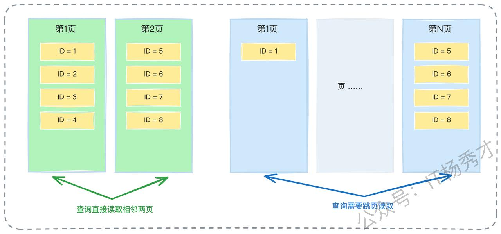

自增主键还有一个重要优势，就是数据会有更大的概率按照主键大小有序存储，两条主键相近的记录在磁盘上的物理位置也是相近的。在进行范围查询时，我们能够更加充分地利用磁盘的顺序读特性，大幅提升查询性能。相比之下，使用UUID作为主键时，由于ID是随机的，相近逻辑的数据在物理存储上可能相距很远，无法利用顺序读的优势。

#### **3.1.3 数据的物理存储**

如果你希望在面试官面前展现更深入的数据库知识，可以进一步解释数据库页分裂的具体机制，这里可以用MySQL的InnoDB引擎来举例说明。

InnoDB引擎中，每个数据页按照主键大小有序存储数据行。假设现在有一个数据页存储了主键为15、16、17、19、20、21的六行数据，并且这一页已经放满了。此时需要插入一条主键为18的记录，InnoDB引擎会发现当前页已经无法容纳这条新记录，于是不得不将原本的页分裂成两页，比如将15、16、17放到一页，19、20、21放到另一页，然后将18插入到第一页中。

这种页分裂会造成一个严重问题：虽然从逻辑上看，存储15、16、17的页和存储19、20、21的页是相邻的两个页，但在磁盘的物理存储上，它们可能相距很远。这会导致后续的范围查询需要频繁地进行磁盘寻道，严重影响查询性能。

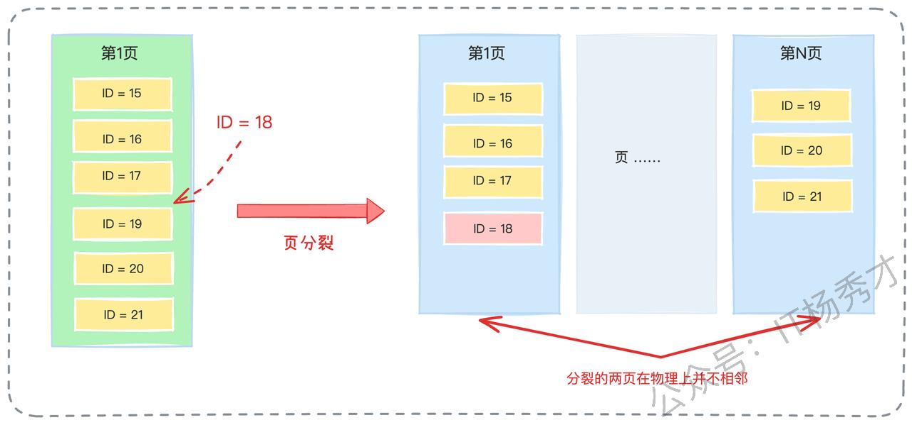

### **3.2 数据库步长自增方案**

除了UUID方案，还有一种常见的方案也叫做自增，不过这种自增比较特殊，它是设置了步长的自增。


我们可以通过一个具体例子来说明这种方案。假设经过分库分表后，我们有16张表，那么可以让每张表按照不同的步长来生成自增ID。比如第一张表生成1、17、33、49这样的ID序列，第二张表生成2、18、34、50这样的ID序列，以此类推，每张表的起始值不同，但步长都是16。

> 这种方案的最大优势在于实现简单，应用层基本不需要做任何额外工作，只需要在创建表时指定好不同的起始值和步长即可。虽然生成的ID并不是严格全局递增的，但在单张表内部，ID肯定是递增的，这在一定程度上保证了插入性能。这个方案的性能主要取决于数据库本身的性能，应用层无需过多关注。

### **3.3 雪花算法**

除了UUID和数据库自增，雪花算法是分布式场景下最经典的主键生成方案。需要注意的是，在当前的技术面试环境中，仅仅答出雪花算法可能已经不够突出，我们需要在理解雪花算法的基础上，找到更多的亮点。

雪花算法的核心思想并不复杂，关键在于分段设计。

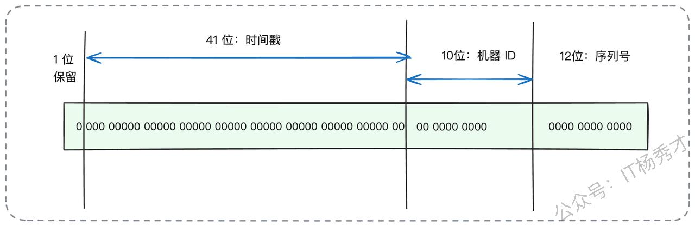

雪花算法采用64位来表示一个ID，其中1位保留未使用，41位表示时间戳，10位作为机器ID，12位作为序列号。这种设计保证了ID的唯一性：时间戳是递增的，不同时刻产生的ID肯定不同；机器ID是不同的，同一时刻不同机器产生的ID肯定不同；同一时刻同一机器上，可以通过序列号来区分不同的ID。

基本解释清楚之后，我们可以从多个方向来展现技术深度，你可以根据自己掌握知识的程度来选择合适的方向。

#### **3.3.1 亮点一：灵活调整分段设计**

第一个方向是深入讨论每个字段的含义和长度，关键点是根据实际需求自定义各个字段的含义和长度。

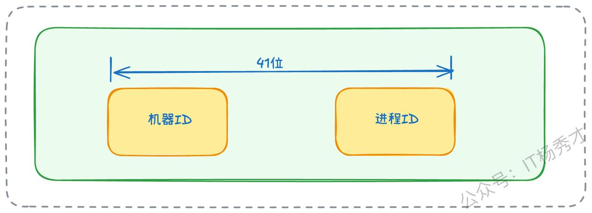

大多数情况下，如果自己设计类似的算法，每个字段的含义和长度都是可以灵活控制的。比如时间戳的41位可以调整得更短或更长，39位也能表示十几年，对于大多数业务场景来说已经足够。机器ID虽然名称上是机器ID，但实际上指的是算法实例，而不是物理机器。比如一台物理机器可以部署多个进程，每个进程的机器ID是不同的；或者进一步细分，机器ID的前半部分表示物理机器，后半部分可以表示该机器上用于产生ID的进程、线程或协程。甚至机器ID也可以不表示机器，而是引入特定的业务含义。序列号的长度同样可以根据实际并发需求进行调整。

> 总结来说，雪花算法可以看作是一种设计思想，借助时间戳和分段机制，我们可以自由切割ID的不同比特位，赋予其不同的含义，灵活设计符合自己业务场景的ID生成算法。

#### **3.3.2 亮点二：序列号耗尽的处理策略**

无论怎么设计雪花算法，序列号长度都有可能不够用。比如标准的12位序列号，在并发量极高的场景下，有可能在某个特定时刻，同一台机器上的序列号全部用完。

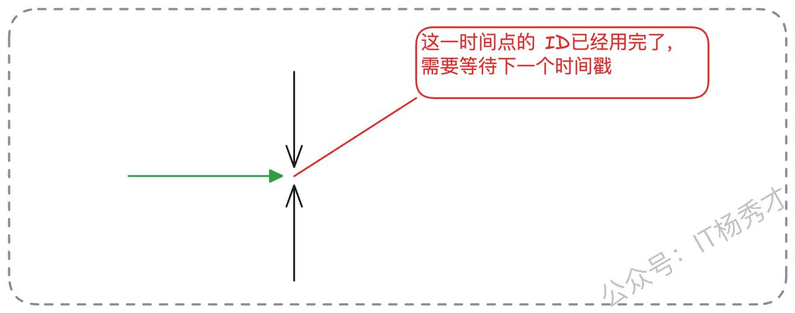

显然，理论上确实存在这种可能性，所以我们需要准备解决方案。解决思路其实并不复杂。如果12位不够用，可以增加序列号的位数，这部分位数可以从时间戳中拿出来。如果还不够，可以让业务方等待到下一个时间戳，时间戳变化后自然又可以生成新的ID了，这实际上是一种变相的限流机制。

一般来说，可以考虑加长序列号的长度，比如缩减时间戳的位数，将节省出来的位数分配给序列号。当然也可以更直接地将64位的ID扩展为128位，甚至更多，这样序列号就可以有三四十位，即便是超大规模的系统也不可能用完。不过，彻底的兜底方案还是要有的。我们可以考虑引入类似限流的做法，在当前时刻的ID已经耗尽之后，让业务方等待下一个时间戳。由于时间戳通常是毫秒级的，业务方最多只需要等待一毫秒。

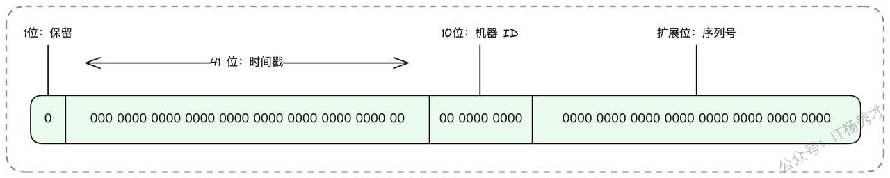

这里面试官可能会继续追问，让业务方等待会有什么问题？

> 确实让业务方等待确实是一个非常不妥的方案，因为这可能导致大量业务线程或协程阻塞，导致线程池或协程池耗尽。不过如果是偶发性的序列号不够，问题不大，因为阻塞的业务方很快就能拿到ID。如果序列号耗尽不是偶发性的，而是长期存在的问题，那么就需要考虑从业务角度进行切割，不同业务使用不同的ID生成器，不要共享。或者，最终还是采用96位或128位的ID，一劳永逸地解决问题。

#### **3.3.3 亮点三：数据堆积问题的解决**

假设有这样一个场景：你的分库分表策略是按照ID对64取模来进行的，如果业务非常低频，以至于每个时刻都只生成了尾号为7的ID，那么是不是所有数据都会分到同一张表中呢？

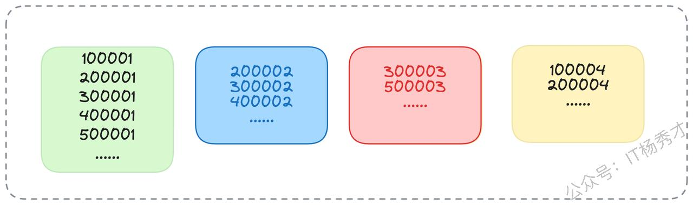

确实会出现这种情况，不过解决方案也很简单。第一种方案是在每个时刻使用随机数作为序列号的起点，而不是每次都从0开始计数。第二种方案是使用上一个时刻的序列号作为起点，比如上一个时刻的序列号只增长到5，那么下一个时刻的序列号就从6开始。如果上一个时刻的序列号已经很大了，就可以退化为从0开始。

看起来第一种方案比较合理常规，但是相比之下第二种实际上更加可控，性能也更好。

> 因为在低频场景下，很容易出现序列号几乎没有增长的情况，从而导致数据在经过分库分表后只落到某一张表中。为了解决这个问题，可以让序列号部分不再从0开始增长，而是从一个随机数开始增长。还有一个策略是序列号从上一时刻的序列号开始增长，但如果上一时刻序列号已经很大了，就可以退化为从0开始增长。这样比随机数更可控，性能也更好。

### **3.4 进阶方案：主键内嵌分库分表键**

到这里，其实前面的回答已经颇具亮点，已经可以让面试官对你刮目相看了。接下来，我们还可以更进一步，让面试官加深印象，直接把对技术深度的追求做到极致。这里秀才直接给出一个更具创新性的方案：主键内嵌分库分表键。

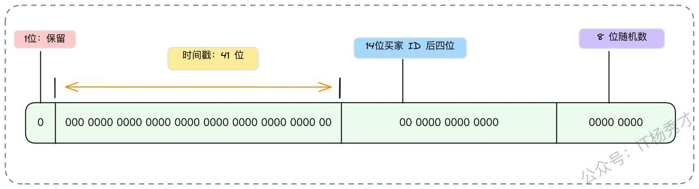

其实分库分表之后最麻烦的就是分库分表的键和主键并不是同一个。比如在C端订单的分库分表中，我们可以采用买家ID来进行分库分表。但在一些业务场景中，比如查看订单详情，可能是根据主键或者订单编号来查找的。

这里我们可以考虑借鉴雪花算法的设计思想，将主键生成策略和分库分表键结合在一起，也就是说在主键内部嵌入分库分表键。例如，我们可以这样设计订单ID的生成策略，假设分库分表使用的是买家ID的后六位。第一段依旧采用时间戳，第二段换成买家ID的后六位，第三段采用随机数。

在一般情况下，我们都是用买家ID来查询对应的订单信息。但在其他场景下，比如我们只有一个订单ID，这时候可以取出订单ID中嵌入的买家ID后六位，来判断数据存储在哪个库、哪个表。类似的设计还有答题记录按照答题者ID来分库分表，但答题记录ID本身可以嵌入这个答题者ID中用于分库分表的部分。

这一类解决方案的核心思想是不拘泥于雪花算法每一段的固定含义。比如第二段可以使用具备业务含义的ID，第三段可以自增，也可以随机。只要我们最终能够保证ID生成大体上是全局递增的，并且是独一无二的就可以。

#### **3.4.1 ID递增性**

> 假如面试官进一步追问：你这个方案能够保证主键严格递增吗？

这个确实是保证不了的，但它能够做到大体上是递增的，这样效果其实并不怎么影响。比如，同一时刻如果有两个用户来创建订单，其中用户ID为876543的先创建，用户ID为123456的后创建，那么很显然用户ID为123456的会产生一个比用户ID为876543更小的订单ID。又或者同一时刻一个买家创建了两个订单，但第三段是随机数，第一次随机到567，第二次随机到234，那么显然第一次产生的ID会更大。

但是这并不妨碍我们认为，随着时间推移，后一时刻产生的ID肯定要比前一时刻产生的ID要大。这样一来，虽然性能比不上完全严格递增的主键，但比完全随机的主键要好得多。

#### **3.4.2 ID唯一性**

> 如果面试官进一步追问这个方案能不能保证ID唯一，又该怎么回答呢？

同样，这个方案也不能保证00%的绝对唯一。其根本原因就在于ID的第三部分我们引入了随机数。既然是随机，理论上就存在两次生成同样数字的可能。不过，我们要知道，这种情况在现实中发生的概率是微乎其微的。

一个冲突ID的产生，需要同时满足几个的条件：必须是**同一个用户**，在**同一毫秒**内，发起了两次订单创建，并且这两次请求生成的**随机数部分还必须完全一致**。

我们可以从两个角度来分析这个概率：

1. **从业务角度看**：一个正常用户在同一毫秒内手动下两个订单，这在操作上几乎是不可能的。如果说是恶意攻击者，那他们的订单失败了也无所谓。

2. **从数学角度看**：即便我们考虑共享账号等特殊情况，真的有用户在同一毫秒发起了两个请求，那也要看随机数是否会碰撞。**假设我们的随机数范围是0到10万**，那么两次都抽到同一个数字的概率也只有十万分之一。

所以，这是一个概率极低、但理论上存在的问题。**关键在于我们如何应对它**。这个解决方案非常成熟，核心就是**重新生成主键**。

具体操作是，我们依赖数据库的**主键唯一性约束**。当我们的程序插入数据时，如果数据库返回了主键冲突的错误，说明这个极小概率事件真的发生了。此时，我们的代码逻辑会捕获这个特定错误，**立刻重新生成一个新的ID，然后再次尝试插入**。这个过程对用户是完全透明的。

### **3.5 发号性能优化**

在掌握了前面几种主键生成策略之后，如果希望进一步提升系统在极端并发下的稳定性，可以将思考范围从“如何设计一个 ID”扩展到“如何让 ID 服务在大规模场景中持续高效运行”。在实际生产环境里，一个发号体系往往不仅依赖于算法本身，还需要在获取流程上做工程化优化，以抵御瞬时流量冲击、降低网络往返次数以及减少数据库更新压力。

这一类优化并不改变 ID 的结构，但能够显著提升服务的整体吞吐能力，通常会从以下几个方面协同组合。

首先，将 ID 的申请粒度从单个扩展为一段，使得调用方一次拿到一整批可用区间，在本地按需消耗。这样可以将原本的高频访问压缩成低频事件，一个批次可能抵消数百到上千次真实请求，从根本上减轻发号服务的负载。

其次是将取号操作前置化。业务端在真正需要之前就准备好一定数量的可用 ID，当本地余量下降到阈值时，异步补齐下一段。这样在绝大多数情况下，业务线程无需等待发号器响应，延迟基本可视为零。只有在缓冲耗尽且新段尚未到达的极端情况，业务才会短暂阻塞。

此外，为减少同一时刻大量线程同时访问发号器带来的资源浪费，可以在客户端加入类似 singleflight 的协作逻辑：某一时间窗口内如果出现多个取号需求，仅由一个线程代表整个进程发起请求，其他线程等待即可。进一步的优化是让代表线程在获取时“多取一点”，在未来的短时间窗口内直接满足后续线程的请求。

在此之上，为了避免进程级缓存的锁竞争，还可以为各个线程建立更细粒度的局部缓存区。当线程从全局段中领取一个较小的片段存放在自己的本地缓冲后，其后续的 ID 消耗都不再涉及进程级同步结构，从而避免争抢，提高整体并发能力。最终形成远端服务、进程缓冲、线程缓冲的多级体系，使系统在峰值流量下依然保持平稳。

这一方案的核心思想是通过分层缓冲、协同调度和局部化分发，将原本集中式的获取过程解耦拆分，使真正与发号器交互的请求数量被压缩到极低。它并不依赖某一种具体算法，而是一套兼容所有生成策略的工程机制，适用于绝大多数对稳定性、低延迟和高并发具有要求的业务场景。

## **4. 小结**

从单库单表的自增主键到分库分表场景下的全局ID生成，这不仅是一个技术选型问题，更是对系统架构理解深度的体现。UUID虽简单但牺牲了性能，数据库步长自增折中实用，雪花算法经典但需灵活调整，而主键内嵌分库分表键的方案则将设计思维推向了极致。面试中，掌握这些方案的原理只是基础，真正的亮点在于你能否理解B+树页分裂的底层机制，能否根据业务场景灵活设计分段策略，以及能否在唯一性、递增性与实现复杂度之间找到最优平衡点。记住，没有完美的方案，只有最适合当前业务的方案——这正是分库分表这个看似简单的主键问题，却能够区分出初级与资深工程师的一个重要原因。

<div style="background-color: #f0f9eb; padding: 10px 15px; border-radius: 4px; border-left: 5px solid #67c23a; margin: 20px 0; color:rgb(64, 147, 255);">

## <span style="color: #006400;">**学习交流**</span>
<span style="color:rgb(4, 4, 4);">
> 如果您觉得文章有帮助，可以关注下秀才的<strong style="color: red;">公众号：IT杨秀才</strong>，后续更多优质的文章都会在公众号第一时间发布，不一定会及时同步到网站。点个关注👇，优质内容不错过
</span>


</div>


