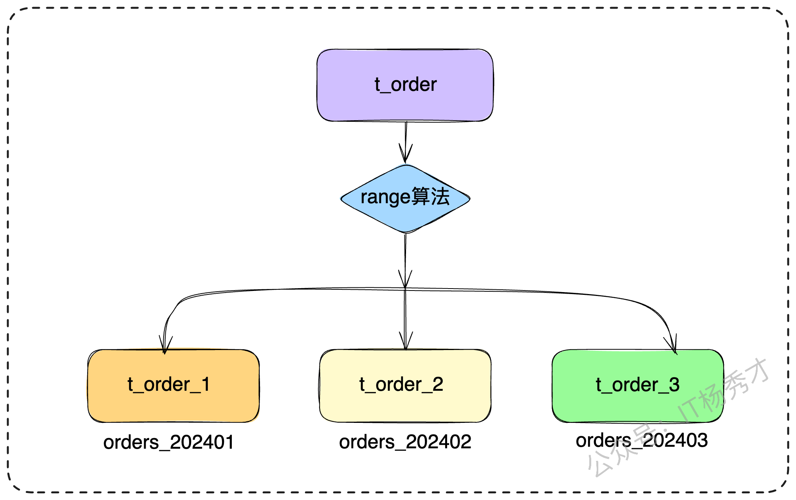

在后端技术面试，尤其是针对高级工程师或架构师的岗位，分库分表是一个核心考察点。资深面试官往往不会直接问我们分库分表策略是怎么设计的，而是会基于此提出一个极具挑战性的场景问题："在亿级别数据量且已实施分库分表的背景下，分页查询应如何设计？常见的性能瓶颈有哪些？"

这个问题并不是单纯考察分页实现，而是旨在评估工程师对于分布式数据处理的理解深度、多方案横向对比的权衡能力，以及在复杂约束下进行架构设计的综合能力。它能够精确地衡量出一位工程师在分布式系统领域的知识深度与广度。

接下来秀才就对这个问题进行系统性解构，从根源探究其技术挑战，并梳理出一套完整的架构解决方案，希望能对大家在工作实践和面试中有所帮助。

## **1. 分库分表的常见策略**

在深入探讨分页查询方案这一问题之前，我们必须首先对分库分表架构下的基础组件与核心概念建立一个清晰的共识。这里我们主要讨论水平分表的解决方案。水平分表表结构一般不会变更。要探索的是如何将海量数据分片存储到不同的表中以实现高性能。

### **1.1 水平分片策略**

通常，我们会采用以下几种策略将数据打散到不同的库表中：

* **哈希取模**：这是最常见的方式，比如根据用户ID进行哈希计算后，对分库（或分表）的数量取模，从而决定数据落在哪个节点。例如，将订单数据按user_id % 16分散到16个表中。

  

  * **优点**：数据分布相对均匀，不容易产生数据倾斜和热点问题。

  * **缺点**：范围查询极不友好。比如，要查询某一段时间内创建的所有订单，就必须扫描所有分片，因为无法从时间维度定位到具体的分片。

* **范围划分**：按照某个字段的区间来切分数据。最典型的就是按时间范围，例如，每个月的订单数据存放在一张独立的表中（orders_202401, orders_202402...）。

  

  * **优点**：范围查询非常高效，天然支持按时间等维度的冷热数据分离。

  * **缺点**：容易产生热点问题。例如，在订单场景下，所有新的写入请求都会集中在最新的那张表上，对数据库造成瞬时高压。

* **路由中间表**：建立一个独立的映射关系表，用于记录某条数据（如主键）具体存储在哪个物理库表中。这种方式虽然灵活，但多了一次额外查询，增加了架构的复杂度。查询时需要先访问路由表，再根据路由信息访问目标分片。


这些策略并不是互斥，实际架构中往往是组合使用，例如先按用户ID哈希分库，库内再按时间范围分表。

### **1.2 分库分表的实现方式**

实现数据分片的逻辑，通常由分库分表中间件来完成，它们主要有三种架构形态：

* **SDK 模式**：以 jar 包的形式被业务应用直接引入。优点是性能损耗最低，因为路由、聚合等操作都在业务应用进程内完成，没有额外的网络调用。缺点是与特定编程语言强耦合（Java的SDK无法给Go用），且版本升级时需要协调所有依赖方，维护成本较高，容易形成"胖客户端"


* **Proxy 模式**：以一个独立的代理服务存在，对业务应用伪装成一个数据库。应用所有的SQL请求都先发给Proxy，由Proxy解析、路由、执行，最后合并结果返回。优点是与语言无关，对业务透明。缺点是多了一层网络开销，且Proxy自身容易成为性能瓶颈和单点故障。为了保证Proxy的高可用，还需要额外部署如LVS、Nginx等负载均衡和Keepalived等高可用组件，增加了运维的复杂度。


* **Sidecar 模式**：这是一种在服务网格（Service Mesh）架构下兴起的形态，将分库分表的能力下沉到与业务应用一同部署的Sidecar中。它结合了SDK的低耦合和Proxy的语言无关性，但目前市面上尚未有非常成熟的开源产品。


在这三种形态中，SDK 模式的性能最好，但缺点是与具体编程语言绑定紧密。比如，Java 提供的 ShardingSphere jar 包无法直接被 Go 语言调用。
相比之下，Proxy 模式的性能最弱，因为所有查询请求都会集中经过它，极易成为系统瓶颈。如果只部署单节点 Proxy，还存在单点故障的风险。不过它的优势也很明显：与语言无关，任何技术栈的业务都可以通过同一个 Proxy 使用分库分表能力。而且 Proxy 伪装成普通数据库实例后，业务只需替换数据源配置，就能在单库单表与分库分表之间平滑切换，几乎无需额外改造

## **2. 全局查询法**

理解了这些背景，我们就能清晰地认识到，为什么一个简单的LIMIT offset, size分页查询，在分库分表环境下会面临严峻的挑战。其根本原因在于，数据被物理隔离在不同分片，单体数据库的offset和size语义在分布式全局视角下已经失效，必须引入跨节点的排序与数据聚合机制。

针对这个问题，一种直接的思路是：将查询请求广播至所有相关分片，获取各分片的数据后，在中间件层进行全局排序，最后根据分页参数截取目标数据返回。这就是全局查询法。

假设我们有一个分页查询需求：

```sql
SELECT * FROM order_tab ORDER BY id LIMIT 4 OFFSET 2;
```

假设订单数据按照user_id % 2被分到了order_tab_0和order_tab_1两张表中。此查询的复杂性根源于数据在分片中的不确定性分布。例如，全局偏移量为2、数量为4的这批数据，可能存在以下几种极端情况：

* 所有目标数据（包括被OFFSET跳过的数据和最终返回的数据）全部位于order_tab_0中。


* 被OFFSET跳过的2条数据位于order_tab_0，而最终需要的4条数据位于order_tab_1。


* 偏移量和目标数据均匀或不均匀地散落在两个分片中。


为应对这种不确定性，并确保结果的完备性，中间件必须采用一种"宁可错捞，不可漏过"的策略。它会将原始SQL改写为对所有分片都有效的查询。

改写的逻辑是：LIMIT size OFFSET offset -> LIMIT size + offset OFFSET 0。

```sql
-- 改写后的SQL，下发到order_tab_0和order_tab_1
SELECT * FROM order_tab ORDER BY id LIMIT 6 OFFSET 0; -- (4 + 2 = 6)
```

中间件会从两个分片中各自取出前6条数据，然后在内存中进行归并排序，最后再从排序后的结果集中，跳过前8条，取出4条数据作为最终结果返回给客户端。

应对面试知道方法是远远不够的，在介绍完这种方法之后，一定要分析这种方案的缺点，为引出我们后续的优化方案做准备。你可以这样来分析："这种方案虽然能保证数据的绝对准确，但其性能隐患是巨大的，尤其是在深度分页（OFFSET值很大）的场景下主要有以下三大性能损耗。"

>  **网络开销剧增**：为了量化其网络开销，我们进行如下分析。假设查询LIMIT 10 OFFSET 10000，在单库中，数据库只需传输10条记录。但在分库分表场景下，假设我们有10个分片，每个分片都需要传输10000 + 10条记录到中间件。如果每条记录是1KB，那么总传输量将是 10 * 10010 * 1KB 约等于 97.7MB。而真正有用的数据只有 10 * 1KB = 10KB。为了获取10KB的有效数据，产生了近100MB的无效网络传输，资源利用效率极低。

> * **内存消耗巨大**：中间件需要将这近100MB的数据全部加载到内存中进行排序。随着分页越深，所需内存越大，极易引发OOM（内存溢出），尤其是在Proxy模式下，会导致整个代理服务集群响应缓慢甚至崩溃。

> * **CPU 负载过高**：排序本身是CPU密集型操作。当数据量巨大时，会导致中间件节点的CPU负载急剧升高，成为整个系统的性能瓶颈。

介绍完缺陷之后还可以补充一个优化点以展示对问题理解的深度。

> "虽然该方案存在明显瓶颈，但在工程实践中，可以利用归并排序的特性进行优化。由于从各分片获取的数据本身已有序，无需将所有数据一次性加载到内存。可采用多路归并（Multiway Merge Sort）算法，维护一个大小为N（分片数）的最小堆（Min-Heap），堆中存放每个分片当前待处理的记录。每次从堆顶取出全局最小的记录，然后将该记录所在分片的下一条记录补充到堆中并调整堆。这个过程可以流式进行，显著降低内存消耗，直到获取到size条目标数据为止。"


这个补充回答，能体现出对问题细节的深入思考。但这依然没有从根本上解决深度分页时数据传输量过大的问题，因此我们需要探索更高效的架构方案。

## **3. 面试实战指南**

既然全局聚合排序方案存在性能瓶颈，我们就必须解决这个性能问题，这就需要通过更优化的设计来达成目标。这也是面试的时候凸显你个人能力的地方，这里主要有以下三种方案可以跟面试官讨论

### **3.1 禁用跳页查询法**

这是目前业界在移动端无限滚动（Infinite Scroll）等场景下最主流、最高效的方案。其核心思想是：在产品设计上约束分页行为，放弃"跳转到任意页"的功能，只允许用户逐页向后加载。也就是通过牺牲一定的用户体验来保证高性能。

在这种交互模式下，我们不再需要OFFSET。取而代之的是，每次请求下一页数据时，客户端都需要带上上一页最后一条记录的排序键的值。

假设我们按ID升序分页，每页50条：

* **第一页查询**：

```sql
-- 首次加载，没有max_id
SELECT * FROM order_tab ORDER BY id LIMIT 50;
```

* 客户端拿到这50条数据后，记录下最后一条数据的ID，比如是1050。

* **第二页查询**：

```sql
-- 加载下一页时，从上一页的终点继续
SELECT * FROM order_tab WHERE id > 1050 ORDER BY id LIMIT 50;
```

* 这样，无论翻到多少页，SQL语句中的LIMIT部分始终是固定的50，而OFFSET永远是0。查询性能极其稳定，且与分页深度完全无关。如果排序键是降序的，比如按时间倒序，那么查询条件就变为 WHERE create_time < last_create_time。

处理复合排序键：如果排序规则是 ORDER BY create_time DESC, id DESC，WHERE条件就需要更严谨的逻辑来处理，以避免排序谬误：

```sql
WHERE (create_time < last_create_time) OR (create_time = last_create_time AND id < last_id)
```

这个细节非常关键，能体现出对问题的深入思考和方案的完备性。还是老规矩，介绍完方案之后一定要分析其优缺点

> * **优点**：性能极高且稳定，实现简单，完美契合移动端的交互习惯。
> * **缺点**：牺牲了用户自由跳转页码的功能。

这个方案是解决这类场景的关键技术之一，虽然看似牺牲了一定的用户体验，但大多数情况下用户却还是可以接受的。这种思想在架构设计中具有重要价值，它展现了如何通过优化产品交互来规避复杂的技术难题，体现了技术方案与业务场景深度结合的架构思维。

### **3.2 二次查询法（亮点方案一）**

这个时候面试官为了考察你的技术深度，可能会接着挑战："如果业务场景（例如后台管理系统）在产品设计上必须要求精确的跳页功能，怎么办？"

这个时候就轮到我们的第一个亮点方案出场了——二次查询法。这个方案的逻辑较为复杂，你如果能在面试中通过一些示例简洁的讲清楚，将成为一个重要的技术亮点。

我们用一个例子来拆解其步骤，假设一个DB中保存了用户年龄数据，从1岁到30岁，共有30条记录。如果需要查询这些数据，可能会执行以下SQL语句：

```sql
select * from T order by age limit 5 offset 10 
```

那么会返回以下红色标识数据，即`[11,15]`，请记住此结果，下面会讲解怎么分库查询以下结果


把以上所有数据分片存储到3个分库中，如下，注意下面数据只是用户属性年龄，不是分片键：


根据前面分析，在单一数据库中执行 LIMIT 5 OFFSET 10 查询时，返回的结果是[11-15]。那么，如果在这三个分库中进行全局查询 LIMIT 5 OFFSET 10，该如何操作呢？

1. **语句改写**

将

```sql
select * from T order by age limit 5 offset 10 
```

改写为：

```sql
select * from T order by age limit 5 offset 3
```

在所有分库执行修改之后的sql，注意，这个 offset 的 3，来自于全局offset的总偏移量 10，除以水平切分数据库个数 3。

执行select * from T order by age limit 5 offset 3，结果如下（红色标识数据），为了便于理解用浅绿色标识库表前三条数据：


2. **找到返回数据的最小值**

  - 第一个库，5 条数据的 age 最小值是10

  - 第二个库，5 条数据的 age 最小值是 6

  - 第三个库，5 条数据的 age 最小值是 12


三页数据中，只需要比较各个分库第一条数据`[10,6,12]`，因此age最小值来自第二个库，`age_min=6`，时间复杂度很低

3. **查询二次改写**

第一次改写的SQL语句是select * from T order by age limit 5 offset 3 第二次要改写成一个between语句，between的起点是age_min，between的终点是原来每个分库各自返回数据的最大值：

* 第一个分库，第一次返回数据的最大值是22 所以查询改写为

```sql
select * from T order by age where age between age_min and 22
```

* 第二个分库，第一次返回数据的最大值是20 所以查询改写为

```sql
select * from T order by age where age between age_min and 20
```

* 第三个分库，第一次返回数据的最大值是25 所以查询改写为

```sql
select * from T order by age where age between age_min and 25
```

相对于第一次查询，第二次查询的条件放宽了，因此第二次查询会返回比第一次查询结果集更多的数据。假设这三个分库返回的数据如下：


可以看到：

* 分库一的结果集比第一次查询多返回了一条数据，即蓝色记录7。

* 由于 age_min 是从原来的分库二获取的，因此分库二的返回结果集与第一次查询相同，实际上这次查询可以省略。

* 分库三的结果集比第一次查询多返回了三条数据，即深蓝色记录8、9、11。

4. **找到age_min在全局的offset**

注：offset表示所查询的结果集中前面有多少条数据没有被查询

在每个结果集中虚拟一个age_min记录，找到age_min在各个分库的offset，也就是找到age_main在各个分库中前面有多少条数据


在分库1中age_min的offset为`2`，分库2中age_min的offset为`3`，分库3中age_min的offset为`0`

所以age_min的全局offset为：`2+3+0=5`

5. **查找最终数据**

既然已经确定了全局的 age_min 为偏移量5，因此可以获得全局的视角。根据第二次查询的结果集

各分库二次查询结果如下：

分库1：7、10、14、16、21、22

分库2：6、13、17、19、20

分库3：8、9、11、12、15、18、23、25

统一放到list排序后：[6、7、8、9、10、11、12、13、14、15、16、17、18、19、20、21、22、23、25]，得知最小值age_main当前的全局offset为5，即6前面有5条数据了，最终结果要取offset 10 limit 5，即要保证前面有10条数据不会被取到，所以偏移量offset要往后再移动5个单位到11，这样前面就有10条数据不会被取到了。查询的limit为5，然后再向后取5位，那就是[11、12、13、14、15]，图中黄色标识数据就是我们要找的结果集


#### **3.2.1 二次查询法的限制条件**

虽然二次查询法在一定程度上能提高跨库分页的性能，但它有着严格的限制条件。这个前提条件是某一页的数据要均摊到各分表。换句话说，二次查询法不太适用于数据分布不均匀的情况，比如数据大量集中在某一张表，而其他分表数据量少。分段法的分表策略同样不适用。下面用实际例子来看：

**场景1（分表策略：取模法）**

原序列：`(1,2,3,4,5,6,7,8)`，需要取出`limit 2,2`，即：`(3,4)`

第1次查询：
```
(1,3,5,7) -> limit 2,2 -> 改写成 limit 1,2 -> (3,5)
(2,4,6,8) -> limit 2,2 -> 改写成 limit 1,2 -> (4,6)
```

最小值min为`3`

第2次查询：
```
(1,3,5,7) -> between 3 and 5 -> (3,5)
(2,4,6,8) -> between 3 and 6 -> (4,6)
```

将第2次查询的结果合并：`(3,4,5,6)`

根据规则，推算出最小值3的全局offset为2，不需要向后移动，然后取limit即2个元素 -> `(3,4)`，结果正确

**场景2（分表策略：取模法）**

原序列：`(1,2,3,4,5,6,7,8)`，需要取出`limit 1,2`，即：`(2,3)`

第1次查询：
```
(1,3,5,7) -> limit 1,2 -> 改写成 limit 0,2 -> (1,3) 
(2,4,6,8) -> limit 1,2 -> 改写成 limit 0,2 -> (2,4)
```

最小值min为`1`

第2次查询：
```
(1,3,5,7) -> between 1 and 3 -> (1,3)
(2,4,6,8) -> between 1 and 4 -> (2,4)
```

将第2次查询的结果合并：`(1,2,3,4)`

根据规则，推算出最小值1的全局offset为0，向后移2位，然后取limit即2个元素 -> `(3,4)`，结果正确

**场景3（分表策略：分段法）**

原序列`(1,2,3,4,5,6,7,8)`->`(1,2,3,4)`,`(5,6,7,8)`

原序列：`(1,2,3,4,5,6,7,8)`，需要取出`limit 2,2`，即：`(3,4)`

第1次查询：
```
(1,2,3,4) -> limit 2,2 -> limit 1,2 -> (2,3) 
(5,6,7,8) -> limit 2,2 -> limit 1,2 -> (6,7) 
```

最小值min为`2`

第2次查询：
```
(1,2,3,4) -> between 2 and 3 -> (2,3)
(5,6,7,8) -> between 2 and 7 -> (5,6,7)
```

将第2次查询的结果合并：`(2,3,5,6,7)`

根据规则，推算出最小值2的全局offset为1，向后移1位，然后取limit即2个元素 -> `(3,5)`，这个结果与预期的`(3,4)`不一致。

整体来看，二次查询法还是相对复杂的，所以在跟面试官介绍的时候，能用示例来说明很重要。如果有屏幕或者有白纸可以演示的话更好，这样更容易讲清楚。

>总的来说，二次查询法通过两次查询，牺牲了一定的响应时间，换来了分页的绝对精确性。但是其缺点也很明显：
> * 需要进行两次数据库查询
> * 有一定的限制，要求数据均匀分布，即某一页的数据要均摊到各分表，否则查询结果就不精确
> * 优点是不会对业务造成局限性，每次返回的数据量都很有限，不会随着翻页增加数据的返回量

### **3.3 引入中间表（亮点方案二）**

中间表方案的核心是"空间换时间"思想。我们创建一个独立的、未分片的"索引表"或"物化视图"，该表仅存储用于排序的字段和主键ID。


例如，要按更新时间排序，我们的索引表结构可以是 (主键, 更新时间, 目标库)。

当需要分页查询时：

1. 先在这个单体的索引表上执行分页查询，由于是单表，LIMIT OFFSET性能很高。

```sql
-- 在索引表上轻松定位
SELECT primary_key, target_db_shard FROM index_table ORDER BY update_time DESC LIMIT 10 OFFSET 100;
```

* 拿到目标数据的primary_key和它们所在的分片信息后，再通过IN查询回到各个分片库中，捞取完整的数据详情。

这个方案有两个显著的挑战：数据一致性维护和查询能力的限制。

* **数据一致性**：这个方案最大的挑战在于如何维护索引表与主数据表之间的数据一致性。

  * **同步双写**：在业务代码中同时写入主表和索引表。这会增加业务逻辑的复杂度和响应时间，且存在分布式事务问题。

  * **异步复制**：更优化的方式是，通过订阅数据库的binlog（如使用Canal等工具），异步地将数据变更同步到索引表中。这能与业务逻辑解耦，但会存在一定的延迟，即数据一致性是最终一致性。


这里也是面试官最容易问的地方，有经验的面试官很可能会追问："异步更新失败了怎么办？"，还是万变不离其宗，只要失败，就可以补偿。

> 你可以回答："我们会引入具备重试与死信队列（DLQ）的机制。如果多次重试后仍然失败，则消息进入死信队列，并触发告警，由人工介入进行数据校准。"

* **查询能力限制**：另一个重要的限制就是查询能力有限。一个重要的操作限制是，任何过滤条件（WHERE子句）都必须基于索引表中已存在的列。如果用户需要根据一个未被物化的字段进行筛选，此方案将失效，除非向索引表添加更多列，但这会增加存储和维护的成本。

### **3.4 引入外部存储**

当排序和筛选条件非常复杂时，以上所有基于关系型数据库的方案可能都难以应对。此时，一个更通用的架构选择是引入外部系统。

1. **引入搜索引擎**：将需要查询的数据（全量或部分字段）通过双写或binlog同步的方式，写入到Elasticsearch这样的专业搜索引擎中。分页、排序、复杂筛选等查询请求，全部交由Elasticsearch处理。Elasticsearch基于Lucene构建，其倒排索引和分布式聚合能力使其在处理这类需求时具备天然优势。从ES获取ID后，再回源数据库查询详情。这是一种非常成熟的异构索引方案。

2. **引入分布式关系型数据库**：另一种思路是采用NewSQL数据库，如TiDB。TiDB的底层存储引擎TiKV是一个全局有序的分布式键值存储，这使得它能够在分布式环境下高效地处理ORDER BY和LIMIT操作，将分页的复杂性下沉到了数据库内核层面，对应用层透明。

## **4. 小结**

从最初的全局查询，到禁用跳页、二次查询、引入中间表，再到借助外部存储，可以看到分页查询在分库分表架构下并不是一个简单的 SQL 问题，而是牵涉到性能、数据一致性、交互设计等多维度的系统性挑战。没有放之四海而皆准的最佳方案，关键在于理解业务场景的需求边界，然后在可接受的性能与复杂度之间做出取舍。面试中，能否系统性地剖析问题、提出不同层次的解决思路，并清晰地权衡优缺点，往往比直接给出某个答案更能打动面试官。

## **资料分享**

随着AI发展越来越快，AI编程能力越来越强大，现在很多基础的写接口，编码工作AI都能很好地完成了。并且现在的面试八股问题也在逐渐弱化，**面试更多的是查考候选人是不是具备一定的知识体系，有一定的架构设计能力，能解决一些场景问题**。所以，不管是校招还是社招，这都要求我们一定要具备架构能力了，不能再当一个纯八股选手或者是只会写接口的初级码农了。这里，秀才为大家精选了一些架构学习资料，学完后从实战，到面试再到晋升，都能很好的应付。**关注秀才公众号：IT杨秀才，回复：111，即可免费领取哦**


<div style="background-color: #f0f9eb; padding: 10px 15px; border-radius: 4px; border-left: 5px solid #67c23a; margin: 20px 0; color:rgb(64, 147, 255);">

#### <span style="color: #006400;">**学习交流**</span>
<span style="color:rgb(4, 4, 4);">
> 如果您觉得文章有帮助，可以关注下秀才的<strong style="color: red;">公众号：IT杨秀才</strong>，后续更多优质的文章都会在公众号第一时间发布，不一定会及时同步到网站。点个关注👇，优质内容不错过
</span>


</div>