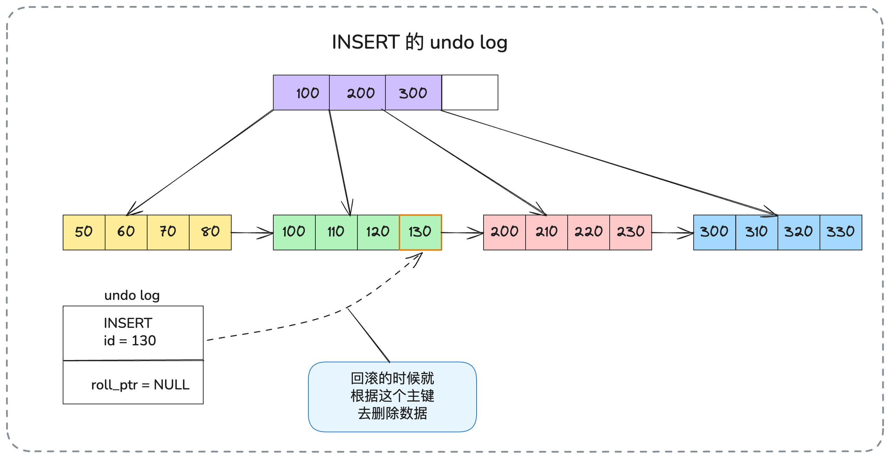
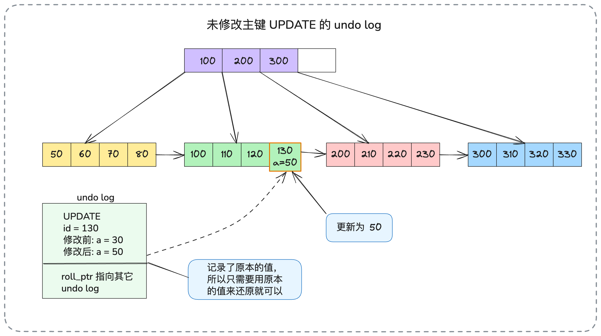
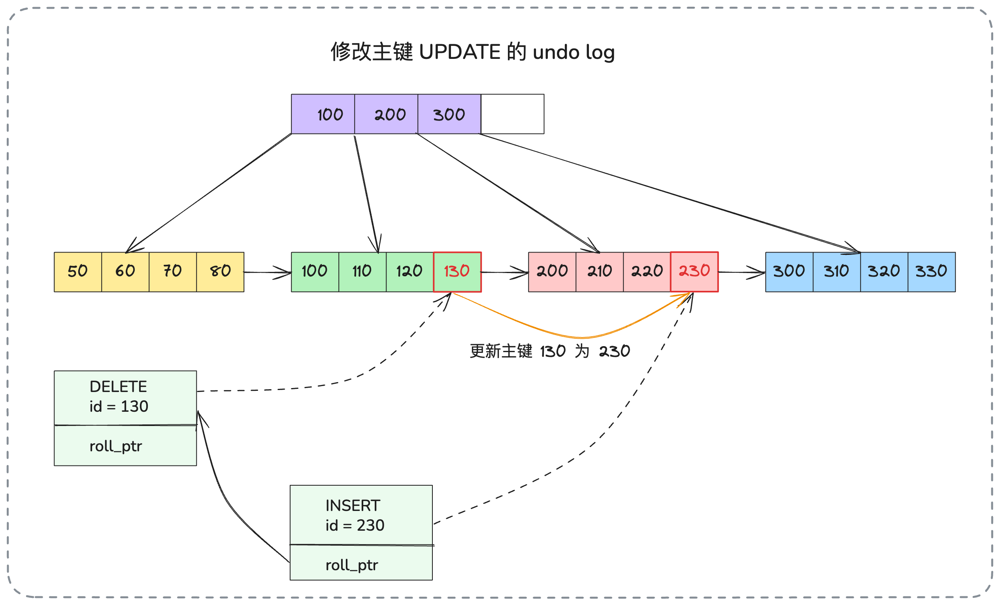
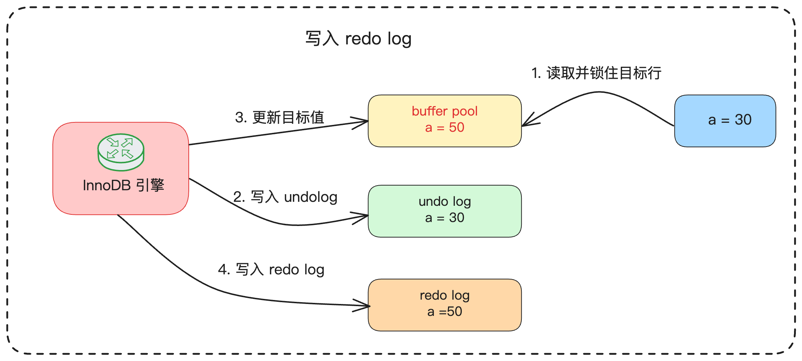
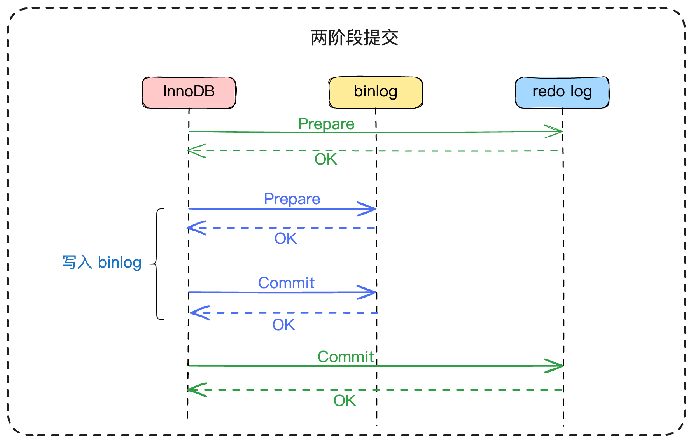
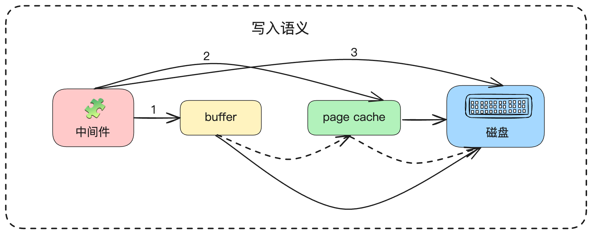

今天，我们将深入探讨数据库体系中又一个至关重要的组成部分——事务（Transaction）。本次分享的内容与我们之前讲解的MVCC（多版本并发控制）机制在技术实现上关联非常紧密，建议将两部分内容结合学习，以建立一个更系统、更全面的知识体系。

在后端工程师，尤其是中高阶岗位的技术面试中，数据库事务是核心的考察点。如果应聘的是初级岗位，面试官的提问可能仅限于事务的ACID基础概念。但凡面试的目标是资深或专家级别，那么深入到底层实现机制，如`redo log`和`undo log`，则是必然的环节。

因此，在今天的探讨中，我将带你系统性地、深入地剖析`redo log`和`undo log`的工作原理。我会清晰地标示出，哪些是面试中必须掌握的基础知识，哪些又是可以作为技术深度展示的进阶内容。

在文章的最后，我还会提供两个相对高级的方案：一个是偏向底层理论的“写入语义”分析，另一个是侧重于性能调优实践的MySQL参数配置策略。

我们首先从`undo log`开始，这个概念在之前的讲解中已有涉及。

## **1. 核心知识回顾**

### **1.1 Undo Log：事务原子性与MVCC的基石**

在上一讲中，我们提到版本链是存放在`undo log`中的。`undo log`，其中文名称是回滚日志，其核心作用是记录数据在被修改之前的状态镜像。当一个事务需要回滚（Rollback）时，InnoDB存储引擎就可以利用`undo log`中记录的信息，执行一系列逻辑上的逆向操作，从而将数据恢复至事务开始之前的状态。从这个角度看，`undo log`是实现事务**原子性**的关键技术保障。同时，它存储的历史版本数据，也是MVCC机制得以实现的基础。

针对不同的数据操作语言（DML）语句，`undo log`所记录的日志形态有所区别：

* 对于一条`INSERT`语句，其对应的`undo log`在逻辑上是一条`DELETE`语句。回滚时，只需根据日志中记录的主键信息将新插入的数据删除即可。

* 对于一条`DELETE`语句，其对应的`undo log`在逻辑上则是一条`INSERT`语句。回滚时，根据日志中记录的被删除行的完整数据，重新插入该行，即可恢复。

* 对于一条`UPDATE`语句，其对应的`undo log`在逻辑上是一条反向的`UPDATE`语句，它会记录下所有被修改列的旧值（Old Value）。回滚时，用这些旧值覆盖当前值，即可复原。

当然，上述只是一个简化的逻辑模型，实际的`undo log`实现会更为复杂。为了便于理解，我们再进一步具象化这个过程：

对于`INSERT`操作，`undo log`的核心是记录下新插入行的主键。当事务回滚时，InnoDB引擎便依据这个主键，在聚簇索引中定位并删除该条记录，从而实现撤销插入的效果。

对于`DELETE`操作，`undo log`会记录被删除行的主键信息。这里需要特别指出，InnoDB在执行`DELETE`时，并不会立即将数据从磁盘上物理删除，而是通过修改记录头中的一个特殊标记位（delete flag）来标识该记录为“已删除”。因此，当事务回滚时，引擎可以根据`undo log`中的主键快速找到这条被标记的记录，然后将其删除标记位重新置为`false`，数据便得以恢复。

对于`UPDATE`操作，情况要更复杂一些，需要根据是否更新了主键分为两种场景：

* 场景一：未更新主键

如果UPDATE语句没有修改主键列，那么undo log会记录下该行的主键以及所有被修改列的原始值。回滚时，只需根据主键找到该行，再用undo log中记录的旧值覆盖当前值即可。

* 场景二：更新了主键

如果更新了主键，InnoDB内部会将其处理为一个“删除旧记录 + 插入新记录”的组合操作。因此，它会产生两条undo log记录：一条是针对旧主键记录的DELETE类型undo log，另一条是针对新主键记录的INSERT类型undo log。

通过上面详尽的分析，你现在应该能够清晰地理解`undo log`是如何作为事务回滚的依据，并且它所串联起来的历史版本记录，正是MVCC中版本链的实体。

这部分知识点相对底层和深入，如果你并非专攻数据库（DBA）或应聘专家级岗位，理解到这个程度已经基本足够了。接下来，我们继续探讨另一个与事务持久性直接相关的关键日志：`redo log`。

### **1.2 Redo Log：数据持久性的核心保障**

`redo log`，即重做日志，它的核心使命是确保事务的**持久性**。当数据库中的数据发生任何变更时，InnoDB引擎会首先将这些变更以一种紧凑的物理格式记录在`redo log`中。这样设计的目的是，一旦数据库遭遇意外宕机（如服务器断电、进程崩溃），在重启后，InnoDB便可以通过扫描并回放`redo log`中的记录，将那些已经提交但尚未完全持久化到数据文件中的变更重新应用一遍，从而确保已提交事务的数据不会丢失。

你可能会有这样的疑问：InnoDB引擎既然最终都要修改数据，为什么不直接将变更写入磁盘上的数据文件，反而要引入`redo log`这个中间层呢？

答案的核心在于**性能优化**。我们知道，磁盘的随机I/O操作是非常昂贵的。如果每次数据变更都直接操作磁盘上的数据文件，数据库的性能将难以接受。为了解决这个问题，InnoDB引入了`buffer pool`这一核心组件作为内存缓冲。所有的数据读写操作，首先都在`buffer pool`中高速完成。然后，InnoDB的后台线程会在合适的时机，将`buffer pool`中被修改过的“脏页”（Dirty Page）异步地、批量地刷写（Flush）到磁盘。

这个异步机制带来了数据丢失的风险：如果在`buffer pool`中的脏页尚未刷盘时，数据库就发生了崩溃，那么这部分已经完成的修改便会永久丢失。

`redo log`正是为解决此问题而设计的。它遵循了计算机科学领域著名的**WAL（Write-Ahead Logging，预写日志）**&#x539F;则。具体流程是：在修改`buffer pool`中数据的同时，InnoDB会生成相应的`redo log`，并确保在事务提交时，`redo log`必须优先于数据文件本身落盘。这样一来，即使`buffer pool`中的数据因宕机而丢失，我们依然可以依靠已经持久化的`redo log`来进行数据恢复，从而保障了事务的持久性。

那么，`redo log`的写入为何比直接写数据文件更高效呢？

关键在于，`redo log`的写入模式是**顺序I/O**。无论你的事务逻辑多么复杂，DML操作在逻辑上多么分散（例如，一会更新用户表，一会更新订单表），这些变更对应到数据文件中的物理位置可能相隔甚远，从而导致大量的随机I/O。但是，它们所产生的`redo log`记录在日志文件中却是严格按照时间顺序、紧密相连地追加写入的。顺序I/O的性能远高于随机I/O，即便是在现代的SSD上，其性能差距也可能达到一个数量级以上。这正是`redo log`设计的精髓所在。

`redo log`的写入过程也并非简单的一步到位。它同样存在一个缓冲层，即`redo log buffer`。从`redo log buffer`到最终持久化到磁盘。

其刷盘策略由一个至关重要的参数`innodb_flush_log_at_trx_commit`来精细化控制，该参数有三个可选值：

* `0`：每秒刷新一次。事务提交时，`redo log`仅写入`redo log buffer`。这种模式下性能最高，但如果服务器在1秒内宕机，会丢失这1秒内所有已提交事务的数据。

* `1`（默认值）：每次事务提交时都执行同步刷新到磁盘。这是最安全的选择，完全符合ACID对持久性的严格要求，但因为每次提交都涉及一次磁盘I/O，所以性能开销最大。

* `2`：每次事务提交时刷新到操作系统的页面缓存（Page Cache）。这意味着将刷盘的决定权交给了操作系统。性能和安全性介于0和1之间，但如果操作系统在将Page Cache中的数据刷到磁盘前宕机，数据同样会丢失。

从上述分析可见，只有当参数设置为`1`时，才能最大限度地保证已提交事务的持久性。

值得注意的是，InnoDB的刷盘行为并非完全死板地遵循上述参数，还存在两种例外情况会触发刷盘：

1. 如果`redo log buffer`的使用量即将达到阈值（通常是一半），会主动触发一次刷盘操作，防止缓冲区溢出。

2. 如果某个事务提交时触发了同步刷盘（例如，配置为1的事务），那么当前`redo log buffer`中所有其他事务的日志记录也会被一并批量刷写到磁盘。

在完整地了解了`undo log`和`redo log`的底层机制后，我们来将它们整合起来，看一个完整的事务究竟是如何执行的。

### **1.3 事务的内部逻辑**

我们以一个简单的`UPDATE`语句为例，来完整地剖析事务的内部执行路径。假设我们有一张表`tab`，其中一行记录的`id=1`，`a`列的初始值为`30`。现在我们要执行：`UPDATE tab SET a = 50 WHERE id = 1;`

1. 定位与加锁：事务启动，InnoDB通过索引定位到id=1的目标记录，将其从磁盘加载到buffer pool中，并对该行记录施加排他锁（X锁）。

* **记录Undo Log**：在对`buffer pool`中的数据进行任何修改之前，InnoDB会先为这次操作生成一条`undo log`，其中记录了`a`列的原始值`30`。这是为了后续可能的回滚做准备。

* **更新Buffer Pool**：接着，InnoDB在内存中执行更新操作，将buffer pool里该行数据a列的值由30修改为50。至此，内存中的数据已经更新，但磁盘上的数据文件尚未改变。

* 记录Redo Log：在数据于buffer pool中更新后，InnoDB会立刻生成一条对应的redo log，这条日志精确地记录了“对哪个表空间的哪个数据页的哪个偏移量位置做了什么修改”，并将其写入redo log buffer。

* 提交事务与刷新日志：当客户端执行COMMIT指令时，根据innodb\_flush\_log\_at\_trx\_commit参数的配置，InnoDB会将redo log从buffer中刷写到磁盘。这是事务持久性的关键一步。

* 后台刷写脏页：事务虽然已经提交，但buffer pool中被修改过的数据页（现在是脏页）并不会立即刷盘。它会等待InnoDB的后台线程（如Master Thread）在后续某个合适的时机，将其异步地、批量地刷写到磁盘上的数据文件中。

以上是事务执行的理想化标准流程。在此流程之上，还潜藏着两个至关重要的异常处理分支：

* **崩溃恢复（Crash Recovery）**：如果在第5步`redo log`成功刷盘后，但第6步的数据页尚未刷盘前，数据库突然宕机。那么在MySQL重启后，InnoDB会通过扫描`redo log`，找到那些已经提交但数据页未持久化的事务，并回放这些`redo log`记录，将变更重新应用到数据页上，从而完成数据恢复。

* **事务回滚（Rollback）**：如果在事务提交前的任何时刻，客户端发起了`ROLLBACK`指令，InnoDB就会利用在第2步记录的`undo log`来撤销所有修改。它会根据`undo log`将`buffer pool`中的数据恢复原状。值得注意的是，如果脏页恰好在回滚前被刷盘了，`undo log`同样能用来修正磁盘上的数据，保证数据的一致性。

事务的实际执行过程远比这里描述的要复杂，包含了诸多锁、并发控制等细节。但对于面试沟通而言，能够清晰地阐述上述核心流程，已经足以展现你扎实的技术功底。

### **1.4 Binlog：跨引擎的通用日志**

`binlog`（二进制日志）是一个在功能和层级上都与`redo log`、`undo log`截然不同的日志。它是MySQL Server层面的日志，这意味着它不限于特定的存储引擎（如InnoDB），所有存储引擎对数据库的修改都会被记录下来。它记录的是数据库的**逻辑变更**操作（如一条`UPDATE`语句本身）。因此，`binlog`主要有两个核心用途：

1. **数据恢复**：可用于基于时间点的恢复（Point-in-Time Recovery），例如恢复到某个误操作之前的状态。

2. **主从复制**：在主从架构中，从库通过拉取并回放主库的`binlog`，来实现与主库的数据同步。像Canal这类数据同步中间件，其工作原理本质上也是将自己伪装成一个MySQL的从节点来消费`binlog`。

在事务执行过程中，`binlog`的写入时机与`redo log`的提交过程紧密结合，形成了一套被称为“**两阶段提交**”（Two-Phase Commit, 2PC）的内部机制，以保证`redo log`（物理日志）和`binlog`（逻辑日志）之间的数据一致性。

* **阶段一：Redo Log Prepare（准备）**：当事务准备提交时，InnoDB将`redo log`刷盘，并将其状态标记为“准备”状态。

* **阶段二：Binlog写入与Redo Log Commit（提交）**：接着，MySQL Server层写入`binlog`。如果`binlog`写入成功，再由InnoDB将`redo log`的状态从“准备”更新为“提交”。

这个机制的核心在于，**一个事务是否最终被视为成功提交，取决于**`binlog`**是否成功写入**。如果`redo log`的`prepare`阶段完成，并且`binlog`也成功写入，那么即便此时数据库崩溃，导致`redo log`的`commit`标记未能写入，MySQL在重启后进行恢复时，依然会认为该事务已经成功，并会通过`redo log`来完成数据恢复。反之，如果`binlog`写入失败，整个事务就会回滚。

我们可以用一个更规范的两阶段提交序列图来理解这个过程。

与`redo log`类似，`binlog`的刷盘时机也可以通过`sync_binlog`参数来控制：

* `0`（默认值）：由操作系统决定何时刷盘。`binlog`写入`page cache`后即返回成功，性能最好。

* `N`：每`N`次事务提交后，执行一次`fsync`操作，将`binlog`强制刷入磁盘。`N`越小，数据越安全，但性能越差。当`N=1`时，表示每次提交都刷盘，安全性最高，通常用于对数据一致性要求极高的场景。

### **1.5 ACID特性：事务的四大特性**

最后，我们简要回顾一下事务最基础的ACID特性，这是理解一切事务机制的出发点。

* **原子性（Atomicity）**：事务是一个不可分割的工作单元，其内部的所有操作要么全部成功执行，要么全部失败回滚。主要由`undo log`来保证。

* **一致性（Consistency）**：事务的执行不能破坏数据库的完整性约束（如主键、外键等）。事务开始前和结束后，数据库都处于一个一致的状态。

* **隔离性（Isolation）**：并发执行的多个事务之间应相互隔离，一个事务的执行不应被其他事务干扰。主要由锁机制和MVCC来保证。

* **持久性（Durability）**：一旦事务成功提交，其对数据库的更改就是永久性的，即便系统发生故障也不会丢失。主要由`redo log`来保证。

这四大特性是数据库领域的基石知识，必须熟记于心。

## **2. 面试实战指南**

在准备面试时，仅仅理解理论是不够的，你还需要结合实践，思考以下问题：

* 你所在公司的生产环境，`sync_binlog`、`innodb_flush_log_at_trx_commit`这些关键参数是如何配置的？背后有哪些业务场景和性能考量？

* 你所使用过的其他中间件，比如Kafka、RocketMQ，它们是否有类似的日志、刷盘与持久化机制？它们是如何在性能和可靠性之间做权衡的？

由于事务机制的复杂性，面试官很可能会围绕各种异常场景提问。你需要提前在脑海中推演，在事务执行的各个环节，如果数据库突然宕机，恢复后会发生什么。这里有一个极简的判断口诀，可以帮助你快速理清思路：

* **以**`redo log`**是否落盘为界**：在`redo log`的`prepare`阶段完成并刷盘之前宕机，事务必然回滚。

* **结合**`binlog`**判断最终状态**：如果`redo log`已`prepare`，但`binlog`未写入成功前宕机，事务回滚。如果`binlog`已写入成功后宕机，无论`redo log`的`commit`标记是否写入，事务都将被视为成功，重启后会完成提交。

* **回滚的本质**：利用`undo log`中记录的数据前镜像来恢复数据。

此外，要对`undo log`和`redo log`存在的**必要性**有深刻的理解，因为面试官可能会提出一些反直觉的问题来考验你的思考深度：

* **如果没有**`undo log`**会怎样？** 事务将无法回滚，原子性无法保证；MVCC机制也将不复存在。

* **如果没有**`redo log`**会怎样？** 数据写入`buffer pool`后，若宕机则会丢失，事务的持久性将无法保证。

* **为何不直接修改磁盘数据，而要引入**`redo log`**这一机制？** 因为直接修改数据文件是随机I/O，性能极差。`redo log`通过将随机I/O巧妙地转化为顺序I/O，极大地提升了数据库的写入性能。

在面试交流中，如果话题触及操作系统的文件I/O、`page cache`等，你就可以顺势引出`redo log`、`binlog`的写入语义，甚至可以进一步扩展到下面要讲的“亮点方案”。

### **2.1 基础篇：如何应对常规提问**

事务相关的面试，问题方向多，细节也多。最常见的切入点就是ACID四大特性。在这里，你可以主动出击，通过引申**隔离级别**来展示你的亮点：

> “ACID中的隔离性（Isolation）是一个非常有深度的话题，它与数据库的隔离级别概念密切相关。我个人认为，像‘未提交读’和‘已提交读’这两种隔离级别，并不能算完全满足了严格意义上的隔离性定义。理论上，标准的‘可重复读’也存在幻读问题。不过，MySQL InnoDB引擎通过其独特的Next-Key Lock机制，在‘可重复读’级别下解决了幻读问题，所以我认为InnoDB的‘可重复读’和‘串行化’才真正实现了高标准的隔离性要求。”

这样一说，大概率会将话题引导至隔离级别，这正是你展示技术深度的大好机会。

有时，面试官会直截了当地问你`undo log`、`redo log`的原理。这时，你就可以按照我们前面的讲解顺序，先介绍`undo log`，并可以补充`INSERT`、`DELETE`、`UPDATE`三种操作下`undo log`的不同形态作为小亮点。接着介绍`redo log`，并引出其刷盘策略作为另一个小亮点。通常，能清晰地解释清楚这两者的作用和关系，就已经很不错了。如果面试官没有打断你，你就可以继续用那个`UPDATE`的例子，串讲整个事务的执行流程。

到这一步，你基本已经把核心知识点都覆盖了。对于大多数面试，考察的范围不会超出我们前面“核心概念储备”部分的内容。至于`binlog`，你可以等面试官追问时再提。如果你能清晰地阐述`binlog`与`redo log`的两阶段提交流程，这将是回答中的又一个闪光点。

### **2.2 进阶篇：打造你的专属亮点**

如果你能将前面的知识点运用自如，至少能获得一个“MySQL基础扎实”的评价。但要想在众多候选人中脱颖而出，还需要更深入的技术要点。这里我为你准备了两个，一个是理论层面的“写入语义”，另一个是实践层面的“刷盘时机调优”。

#### **2.2.1 亮点一：深入探讨“写入语义”**

通过前面的分析我们知道，当我们说“一次写入成功”时，其背后的技术含义可能大相径庭。它可能只是写入了应用的内部缓冲区，也可能是写入了操作系统的`page cache`，还可能是真正被`fsync`调用持久化到了物理磁盘上。

总结起来，一个中间件的单机写入语义，通常可以分为以下三种层次：

1. **应用层确认**：数据写入中间件自身的内存缓冲区后，即认为写入成功。

2. **操作系统层确认**：中间件发起系统调用，将数据写入操作系统的`page cache`后，认为写入成功。

3. **磁盘层确认**：中间件强制发起刷盘（`fsync`），确认数据被持久化到磁盘上，才认为写入成功。

除了直接写盘，前两种模式都需要考虑一个问题：数据最终何时刷到磁盘？通常有两种策略：一是**定时**，如每秒刷一次；二是**定量**，比如在数据库事务中按提交次数，或在消息队列中按消息条数。

然而，在当今的分布式系统中，问题变得更加复杂。一次写入操作，往往不仅涉及主节点，还涉及多个从节点。

因此，分布式环境下的写入语义就更加丰富了：

* **主节点写入即成功**。

* **主节点和至少一个从节点写入成功**。

* **主节点和大多数（Quorum）从节点写入成功**。

* **主节点和特定数量的从节点写入成功**（通常数量可配）。

* **主节点和所有从节点都写入成功**。

这里的每一个“写入成功”，无论是主节点还是从节点，都还要再嵌套考虑前面提到的单机刷盘的三种语义层次。

你可以这样在面试中引申：

> “关于redo log和binlog的刷盘问题，其实是中间件设计中一个关于‘写入语义’的普遍性问题。这种在一致性、持久性和性能之间的权衡，在各种分布式系统中都非常常见。例如Kafka的acks机制，就提供了0（不等确认）、1（等leader确认）、-1或all（等所有in-sync副本确认）三种选项。再比如Redis的AOF刷盘策略，也有always、everysec、no三种选择。其背后的设计哲学与MySQL的日志参数是相通的，都是为了让用户能在不同的业务场景下，找到最适合自己的平衡点。”

#### **2.2.2 亮点二：结合实践谈“刷盘时机调优”**

这个技巧的核心是结合公司的实际业务场景，来展示你对`redo log`和`binlog`刷盘时机调优的思考。基本有两个方向：

* **方向一：数据安全与一致性优先**

> “在我之前的项目中，有一个核心的金融交易系统，对数据的不丢失和主从强一致性要求达到了最苛刻的级别。为此，我们对数据库进行了专门的调优，将sync\_binlog设置为1，同时保持innodb\_flush\_log\_at\_trx\_commit为默认值1。这种‘双1’配置，虽然牺牲了一定的写入性能，因为每次事务提交都需要完成binlog和redo log两次同步刷盘，但它最大限度地保证了数据的安全，避免了主从不一致和数据丢失的风险，这对于金融场景是必须的。”

* **方向二：性能优先，容忍少量数据丢失**

> “我们还有另一个业务，比如用户行为日志记录系统，它的特点是写入并发量极大，但对偶尔丢失几条记录的容忍度较高。针对这个场景，我主导了性能优化，将innodb\_flush\_log\_at\_trx\_commit调整为2，让操作系统去管理redo log的刷盘。同时，将sync\_binlog的值调大到100，即每100次事务提交才刷一次binlog。通过这些调整，数据库的写入QPS得到了数倍的提升，有力地支撑了业务的快速发展。”

你甚至可以提出一个综合性的架构演进方案：

> “我们早期有一个数据库实例，承载了两类截然不同的业务。后来随着业务量的增长，我推动了一次架构分离，将这两类业务的表迁移到了两个独立的数据库实例上，然后分别对它们采用了上述不同的刷盘调优策略，取得了很好的效果。”

这个方案不仅展示了你对参数的理解，还体现了你的架构设计能力，同样可以作为你MySQL性能调优经验的一部分。

## **3. 小结**

事务是数据库系统的核心机制，而 `undo log` 和 `redo log` 则是支撑ACID特性的两大基石。从面试的角度看，掌握这些知识需要分层理解:基础层面要能清晰阐述两种日志的作用和事务执行流程，进阶层面则需要深入刷盘策略、两阶段提交等细节。但真正拉开差距的，是你能否将理论与实践结合，用写入语义的抽象思维去理解不同中间件的设计哲学，用调优经验去证明你对业务场景的洞察。技术的价值不在于背诵概念，而在于在一致性、性能与成本之间找到最优解。当我们能够站在架构师的高度，权衡取舍并给出合理方案时，你就不仅是在回答一个面试问题，更是在展示一个高级工程师的技术素养。

# 资料分享
随着AI发展越来越快，AI编程能力越来越强大，现在很多基础的写接口，编码工作AI都能很好地完成了。并且现在的面试八股问题也在逐渐弱化，**面试更多的是查考候选人是不是具备一定的知识体系，有一定的架构设计能力，能解决一些场景问题**。所以，不管是校招还是社招，这都要求我们一定要具备架构能力了，不能再当一个纯八股选手或者是只会写接口的初级码农了。这里，秀才为大家精选了一些架构学习资料，学完后从实战，到面试再到晋升，都能很好的应付。**关注秀才公众号：IT杨秀才，回复：111，即可免费领取哦**

## **学习交流**

> 如果您觉得文章有帮助，可以关注下秀才的<strong style="color: red;">公众号：IT杨秀才</strong>，后续更多优质的文章都会在公众号第一时间发布，不一定会及时同步到网站。点个关注👇，优质内容不错过

