现在基本上所有的后端都是分布式系统，数据一致性是我们所有后端工程师必须面对的核心挑战。而要保证一致性，锁就是我们绕不开的工具。从单体应用中的 `synchronized` 或 `ReentrantLock`，到分布式环境下的分布式锁，其本质一脉相承，即确保在多线程或多节点环境下，某个关键资源在同一时刻只能被一个执行单元访问。

分布式锁和分布式事务，堪称分布式系统中的两大“拦路虎”，它们理论深奥，实践中又极易出错。在面试中，分布式锁更是高阶岗位的必考题。然而，还是有很多同学对分布式锁的理解仅仅停留在 `SETNX` 和“设置一个过期时间”的表层。当被进一步追问，比如“如何优雅地等待锁？”、“加锁超时了怎么办？”、“业务执行时间超过了锁的过期时间又该如何？”时，就开始不知道怎么回答了。

一个工业级的分布式锁，需要考虑的远不止于此。今天，我们就以 Redis 为例，从零开始，层层深入，一步步构建一个真正高可用、高性能的分布式锁方案，确保你在这个话题下拥有足够的深度。

## **1. 加锁**

首先要明确，并非只有 Redis 才能实现分布式锁。广义上讲，任何支持“排他性操作”的中间件都可以。比如ZooKeeper、Nacos 甚至关系型数据库（如利用 MySQL 的 `SELECT ... FOR UPDATE` 语法）。但鉴于 Redis 极高的性能、广泛的应用基础以及其提供的丰富指令，它成为了实现分布式锁的最主流选择。

要用 Redis 实现锁，我们首先要理解锁的本质——**排他性**。我们只需要在 Redis 中找到一种排他性的操作即可。`SETNX`（**SET** if **N**ot e**X**ists）命令完美契合了这个需求。此命令只在 `key` 不存在时才会设置成功，并返回1；如果 `key` 已存在，则设置失败，返回0。因此，一个最简单的分布式锁模型就诞生了：

* **加锁**：执行 `SETNX lock_key any_value`。如果返回1，代表加锁成功。

* **释放锁**：执行 `DEL lock_key`。

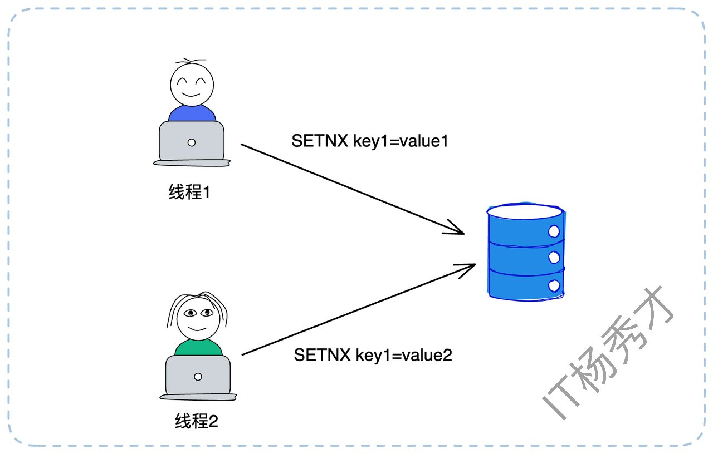

如上图所示，线程1执行 `SETNX key1=value1` 成功，获得了锁。随后线程2执行 `SETNX key1=value2` 失败，进入等待。这个模型虽然简单，但在实际应用中却有很多漏洞，根本无法投入生产。我们来逐一看看它暴露出的问题。

### **1.1 等待与重试**

当 `SETNX` 失败时，客户端不应立即返回失败，而应进入等待”段。但如何等待，以及在等待过程中遇到网络超时，都大有讲究。

#### **1.1.1 如何等待锁？**

当加锁失败，我们有两种主流的等待策略：

1. **循环轮询（Spin Lock）**

这是最简单粗暴的方案。比如，加锁失败后，线程 sleep 100毫秒，然后再次尝试 SETNX，直到加锁成功或超出总的等待超时时间。这个“总的等待超时时间”该如何设定？这需要根据业务场景来定。我们应该尽可能确保在等待时间内能拿到锁。因此，这个时间应该约等于一个锁的平均持有时间。**例如，如果我们通过监控统计，发现99%的业务执行时间都在800毫秒内，那么将总等待时间设为1秒就是个合理的选择。**

这种方式的优点是实现简单，缺点是会带来不必要的 `sleep`（可能锁刚被释放，但线程还在睡眠）和频繁的 Redis 查询（无效轮询），但是实时性不好且空耗资源。

* **事件监听（Pub/Sub）**

轮询方式显然不够优雅。更高级的方式是利用 Redis 的发布订阅（Pub/Sub）机制，或者更高阶的 Keyspace Notifications（键空间通知）。加锁失败的客户端可以立即“订阅”`lock_key` 的“删除事件”（`DEL` 事件）。当锁被释放（`DEL`）时，Redis 会主动通知所有订阅者，它们再重新尝试加锁（`SETNX`）。这种方式实时性更好，也更节省客户端和服务端资源，但实现起来也相对复杂。

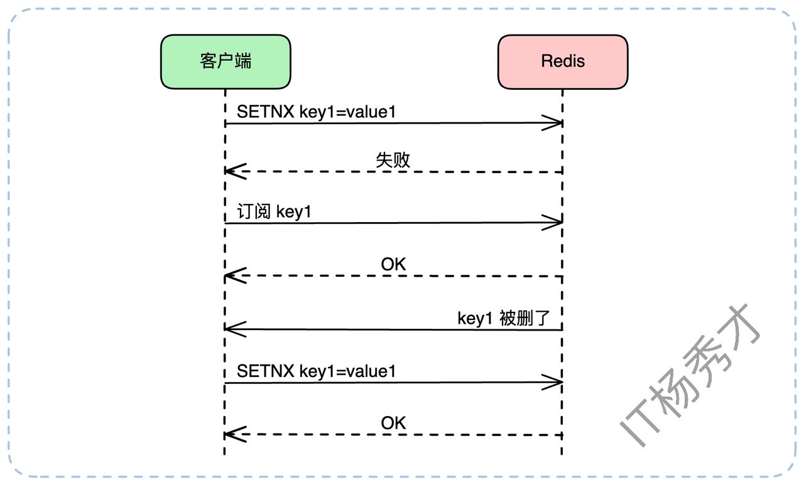

注意：上图只是一个示意。在实际工程中，"检测到锁存在" 和 "发起订阅" 必须是一个原子化或有严密逻辑先后的操作，否则可能在客户端检测到锁存在（`SETNX` 失败）和发起订阅的这个微小间隙，锁恰好被释放了（`DEL`），导致客户端错过通知，陷入永久等待。

#### **1.1.2 如何重试加锁？**

分布式环境中，网络抖动是常态。如果一个客户端发起 `SETNX` 命令后，收到了一个超时响应，这时它会陷入薛定谔的锁状态：我到底加上锁了吗？

如果贸然重试，可能会覆盖一个已经加锁成功的状态。解决这个问题的核心在于**保证操作的幂等性**。我们必须让锁的持有者能够“识别”自己的锁。具体做法是，在加锁时，`value` 不再是任意值，而是一个**全局唯一的ID**，例如 `UUID` 或是唯一的请求ID（Request ID）。

假设我们为 `lock:order:555` 这把锁生成了唯一值 `uuid-client-A`。当重试时，逻辑如下：

客户端发起 `SETNX lock:order:555 uuid-client-A`，不幸超时。客户端发起重试。此时它不能直接 `SETNX`，而是应该先 `GET lock:order:555`。

1. **情况A：GET 返回 nil（key不存在）**。

这说明上一次的 SETNX 命令没有到达 Redis 或执行失败。客户端此时可以安全地再次执行 SETNX lock:order:555 uuid-client-A。


* **情况B：GET 返回 uuid-client-A。**

这说明上一次的 SETNX 执行成功了！只是响应包在路上丢了。此时客户端已经持有了锁，它需要做的只是重置一下这把锁的过期时间（我们稍后会讲到），然后心满意足地返回“加锁成功”。

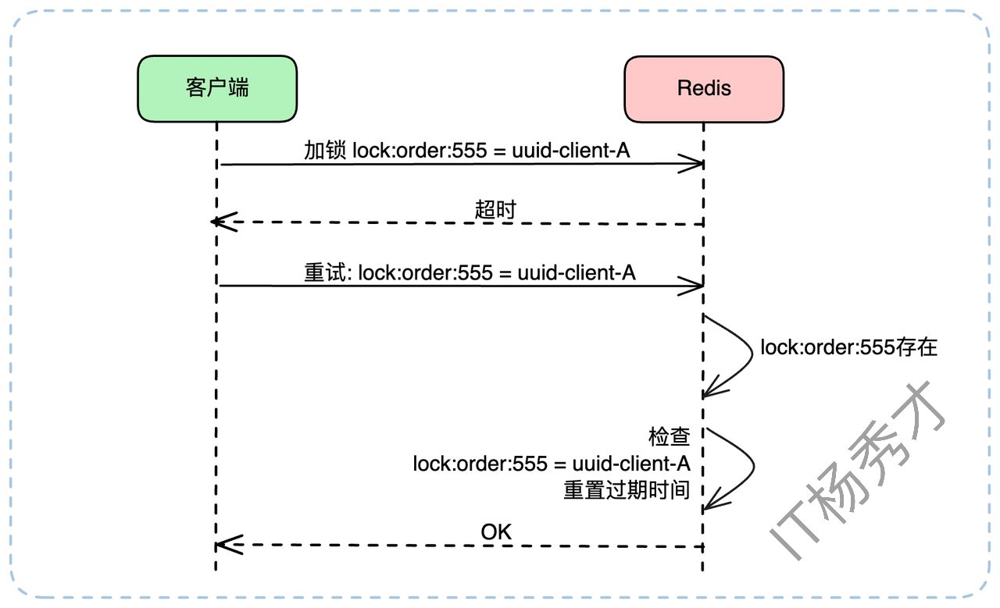

* **情况C：GET 返回 uuid-client-B。**

这说明在客户端A超时和重试的间隙，锁被客户端B拿走了（可能是A上次加锁失败，B加锁成功）。此时客户端A重试失败，应进入上述的等待逻辑。

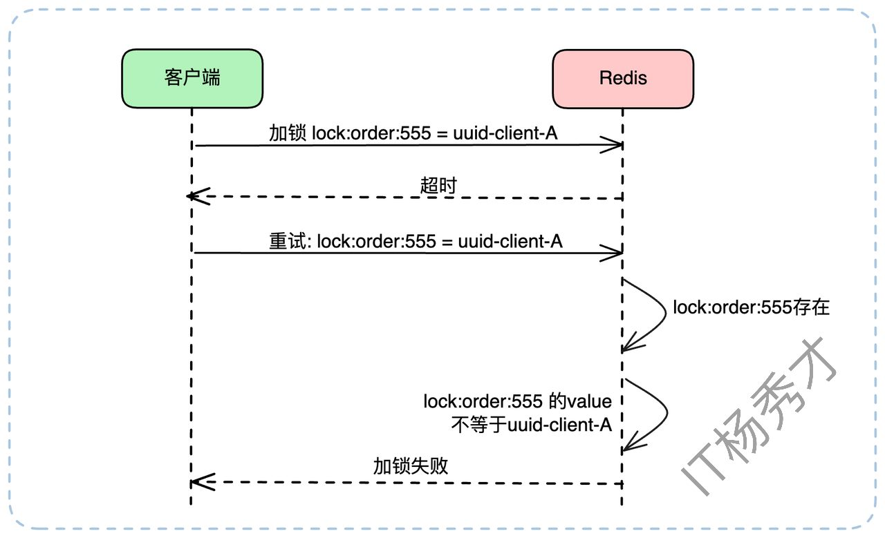

在分布式锁的设计中，如果要支持 **重试机制**，关键是要能够判断**上一次加锁是否成功**。因此，在加锁时，可以为每个锁的值设置一个唯一标识（例如一个随机生成的 UUID），用于标识锁的持有者。

当客户端因超时等原因需要重试时，可以根据以下逻辑进行判断：

> 1. **查询锁是否存在**：如果 Redis 中不存在该 key，说明上次加锁没有成功，可以直接重新尝试加锁。
>
> 2. **校验锁的归属**：如果 key 存在，并且其 value 与本次请求携带的 UUID 相同，说明上次加锁其实已经成功了。此时，为了防止锁过期失效，可以重新设置锁的过期时间。
>
> 3. **锁已被他人持有**：如果 key 存在，但 value 与本次 UUID 不同，说明锁已经被其他客户端持有，本次加锁应视为失败。

在实践中，由于 Redis 性能极高，这种加锁超时的情况很少见，一般重试一两次足矣。但是，如果我们从理论上分析，万一重试也一直超时呢？

其实也无需额外处理。如果之前加锁已经成功了（情况B），那么无非就是后续的重置过期时间失败，等锁到了过期时间，自然就失效了。如果之前没加锁成功（情况A或C），那就更没关系了，别的线程需要时自然可以拿到锁。这也就自然而然地引出了下一个关键概念：**过期时间**。

### **1.2 锁过期与续约**

我们刚才的简单模型（`SETNX` + `DEL`）还有一个致命缺陷：如果一个客户端加锁成功后，业务还没执行完就宕机了——比如机器断电、进程崩溃——它将永远无法执行 `DEL`。这把锁就成了“死锁”，其他所有客户端都将永远等待下去，导致整个业务线瘫痪。

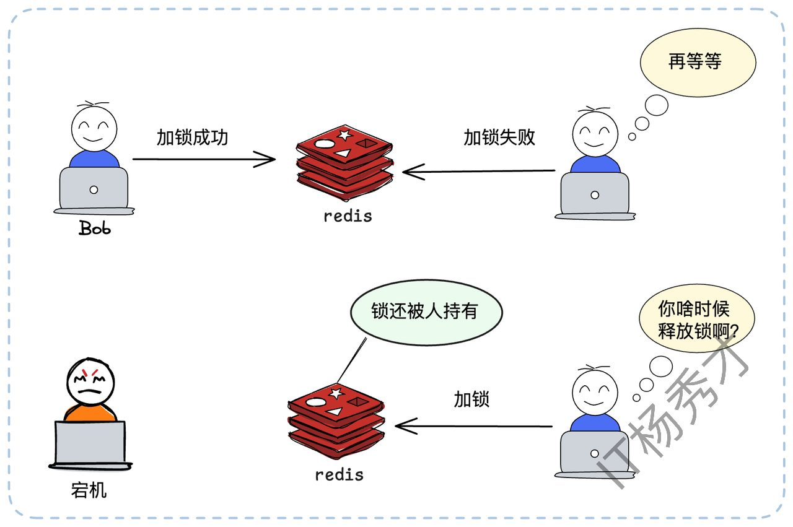

#### **1.2.1 为何需要过期时间？**

为了防止持有者宕机导致死锁，我们必须引入一道保险——**锁过期时间**。我们必须在加锁的同时，给锁设置一个过期时间（TTL）。这里要强调一下，**加锁（SETNX）和设置过期时间（EXPIRE）必须是一个原子操作**。否则，如果在 `SETNX` 成功和 `EXPIRE` 之间客户端宕机，依然会产生死锁。

这里我们Redis 提供了原子命令：

```plain&#x20;text
SET lock_key unique_value EX 30 NX
```

这条命令（`SET ... EX ... NX`）等价于 `SETNX` + `EXPIRE`，完美解决了原子性问题。这样，即便持有锁的客户端宕机，锁也会在30秒后自动释放，其他客户端得以继续工作。

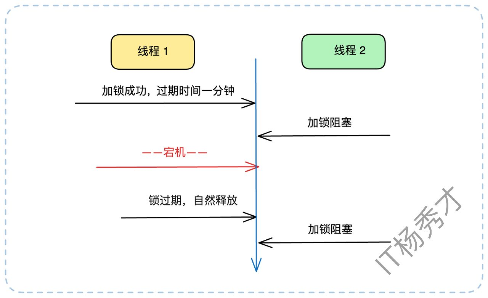

#### **1.2.2 过期时间设多长？**

只要引入了过期时间，面试官几乎必然会问：这个时间应该设置成多长？这又是一个经典问题。答案还是：**根据业务场景**。

> 你需要评估业务逻辑的执行耗时，比如取 99.9% 分位线（P999），然后再加一个合理的缓冲（Buffer）。例如，99.9% 的请求在5秒内完成，你可以把过期时间设为10秒甚至20秒。
>
> 这里还有一个重要观点：过期时间的主要目的是为了防止宕机导致的死锁。而在绝大多数（99.99%）情况下，锁都应该由客户端在业务执行完毕后主动释放（`DEL`）。因此，把过期时间设得长一些，比如30秒、1分钟，通常是安全的，也是合理的。

其实很多公司的分布式锁实现，也就到这一步为止了。但我们还可以继续深挖。

#### **1.2.3 锁续约机制**

无论你把过期时间设为30秒还是1分钟，总有可能遇到“天选之子”——某个请求因为GC停顿、网络延迟或极其复杂的计算，执行时间真的超过了锁的过期时间。这时，会发生什么？

1. 客户端A持有锁，业务正在执行。

2. 锁到达1分钟过期时间，被 Redis 自动释放。

3. 另一个客户端B立即通过 `SETNX` 拿到了这把锁，开始执行业务。

4. 紧接着，客户端A的业务终于执行完毕，它会（错误地）去释放锁（我们稍后会讲如何避免）。

5. 这就造成了数据混乱，两个客户端可能同时操作了资源。

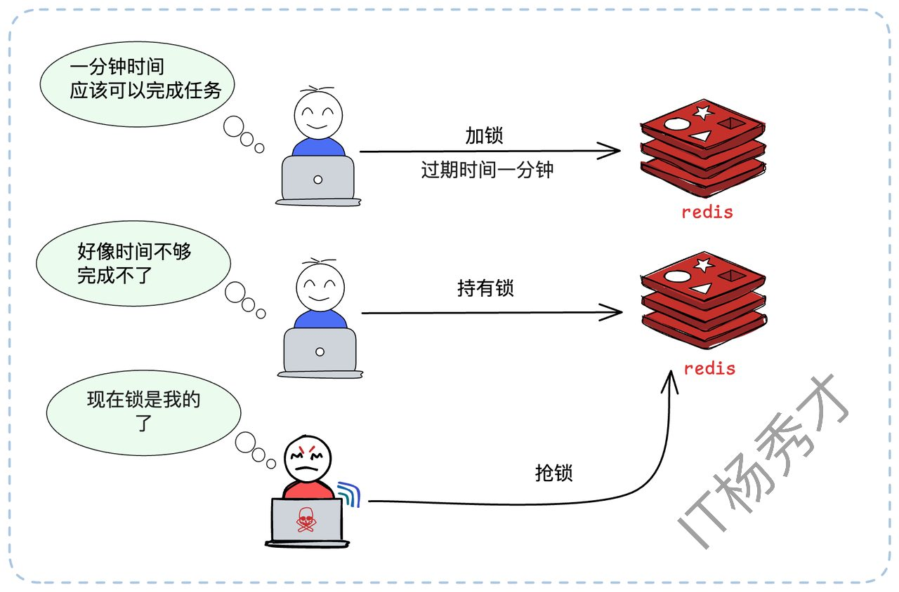

为了解决这个问题，我们需要引入**锁续约（Renewal）机制**，也常被称为“看门狗（Watchdog）”机制。原理是：客户端在加锁成功后，启动一个后台线程（或定时任务）。这个线程会**周期性地**检查客户端是否还持有锁。如果还持有（即业务尚未执行完），就去“续”一下锁的过期时间，比如重新 `EXPIRE lock_key 60`。

* **举个例子（按原文）**：我们设置锁的过期时间是1分钟。续约线程可以设置在**50秒**的时候启动检查。

* 在第50秒，续约线程检查到业务还在运行，于是重置过期时间为1分钟。

* 在第100秒（1分40秒），续约线程再次检查，业务还在，再次重置为1分钟。

* 重复上述检查重置过程......

* 在第130秒（2分10秒），业务执行完毕，客户端主动释放锁。

* 在第150秒（2分30秒），续约线程检查到锁已被释放，退出。

理论上，只要确保在剩余过期时间内能够续约成功就可以了。比如这里预留了10秒（60秒-50秒）的窗口期，就算第一次续约失败，也有足够的时间进行重试。

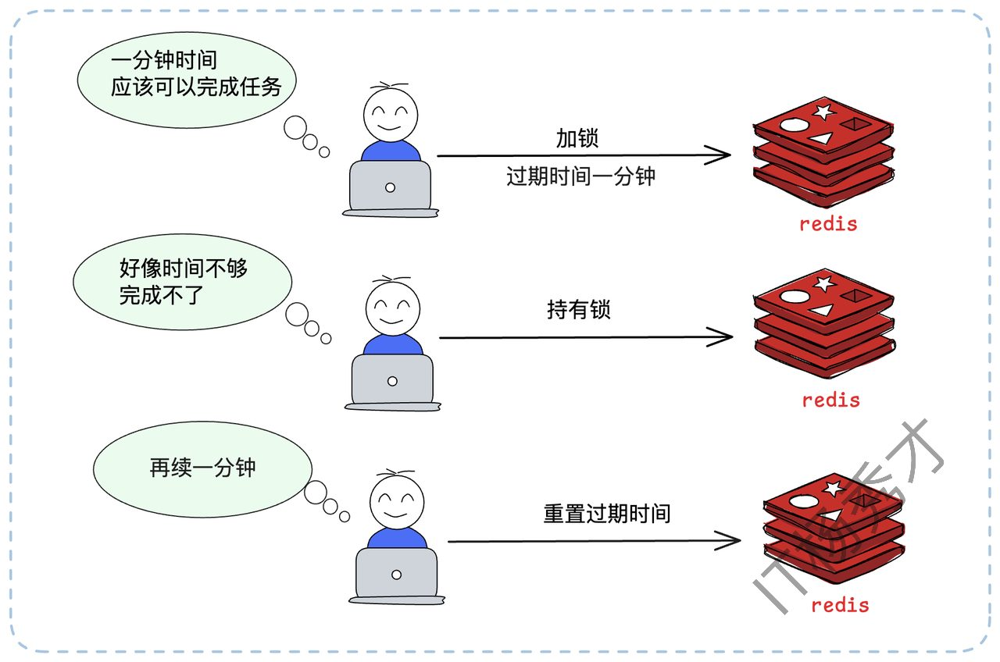

这样，只要客户端A没有宕机，它就可以在业务执行期间内，一直持有这把锁。

#### **1.2.4 续约失败策略**

续约机制也不是万能的。如果续约线程在尝试 `EXPIRE` 时，因为网络问题或 Redis 故障而**连续失败**，直到锁过期了都没成功，该怎么办？此时，锁已经（或即将）被其他客户端拿到。原客户端A的业务如果继续执行，将导致两个客户端同时处理业务，破坏了排他性。

这时我们面临两种策略：

> 1. **保守策略（推荐）**：续约失败意味着锁的归属权已经丢失。业务逻辑必须**立即中断**并回滚，向上层抛出异常。这是对数据一致性最严格的保障。
>
> 2. **激进策略**：假设续约失败是小概率事件，业务逻辑继续执行。这可能会导致数据不一致，但系统“可用性”更高。此策略慎用。

这里提到了中断业务，这又是一个可以在面试的时候跟面试官深聊的亮点。

#### **1.2.5 业务中断策略**

在分布式锁出了问题（如续约失败）时，如何中断业务？这其实是个很困难的事情。分布式锁框架（如 Redisson）并不能**直接**帮你中断业务，它能做的，只是在续约失败时，给业务代码发一个“中断信号”（比如设置一个 `volatile` 标志位，或者调用线程的 `interrupt()` 方法）。**是否中断，以及如何中断，完全取决于你的业务代码是如何实现的。**

* 如果你的业务是一个大循环，那么你可以在每个循环开始的时候，检测一下中断信号：

```java
// 伪代码：在循环中检测中断信号
for (int i = 0; i < data.size(); i++) {
    // 锁框架在续约失败时，会设置一个中断标志
    if (lock.isInterrupted()) {
        // 中断业务，执行回滚
        break;
    }
    // 你的业务逻辑
    DoSomething(data.get(i));
}
```

* 如果你的业务没有循环，而是由多个步骤构成，那么你可以在每一个关键步骤之后都检测一下：

```java
// 伪代码：在关键步骤间检测中断信号
step1();
if (lock.isInterrupted()) { 
    // 中断并返回
    return; 
}

step2();
if (lock.isInterrupted()) { 
    // 中断并返回
    return; 
}

step3();
```

最后可以总结拔高一下：这种中断业务的难题，在微服务超时控制里也会遇到，目前业界也没有银弹，它强依赖于业务代码的主动配合与检测。

## **2. 释放所**

我们前面提到，加锁时要用唯一ID作为 `value`。这个ID在释放锁时同样至关重要。正常来说，释放锁（`DEL`）不会有问题。但在一些特殊场景下（比如Redis宕机恢复，或者业务执行时间超过了锁过期时间），释放锁也可能出大问题。还设有这样一个场景：

1. 客户端A加锁 key1成功（`value=vaule`1），过期时间30秒。

2. 客户端A遭遇了长时间的 Full GC，卡顿了35秒，锁续约失效。

3. 在第30秒时，锁自动过期释放。

4. 在第31秒时，客户端B加锁 key1成功（`value=value`2）。

5. 在第35秒时，客户端A从 GC 中苏醒，它的业务逻辑执行完毕，发起 `DEL key`1。

6. **灾难发生**：客户端A“释放”了客户端B的锁。

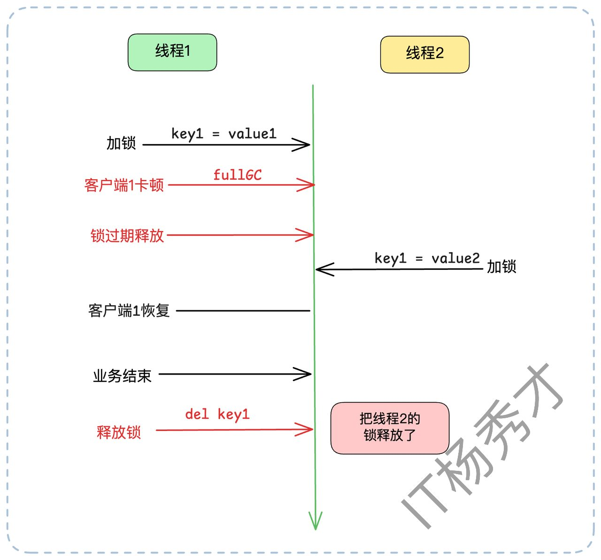

这个场景的根源在于，客户端A释放了“不属于自己”的锁。解决方案就是：**释放锁时，必须检查锁是不是自己的**。

客户端在释放锁时，不能简单粗暴地 `DEL`。它必须执行一个“复合操作”：“检查 `value` 是否匹配，如果匹配才删除”。这必须是一个**原子操作**，否则在 `GET` 和 `DEL` 之间锁可能又过期了，产生新的竞态条件。

实现原子化“查删”的最佳方式是使用 **Lua 脚本**，因为 Redis 执行 Lua 脚本是原子的。

```lua
-- 释放锁的 Lua 脚本
-- KEYS[1] 是锁的 key
-- ARGV[1] 是客户端的唯一ID (比如 uuid-A)
if redis.call("get", KEYS[1]) == ARGV[1] then
    -- 检查锁的 value 是不是自己的 ID，如果是，才删除
    return redis.call("del", KEYS[1])
else
    -- 如果锁不存在，或者锁的 value 不是自己的 ID，则不删除
    return 0
end
```

这个脚本会先 `get` 锁的 `value`，判断它是否等于客户端传入的唯一ID。如果是，才执行 `del`。这完美解决了误删问题。

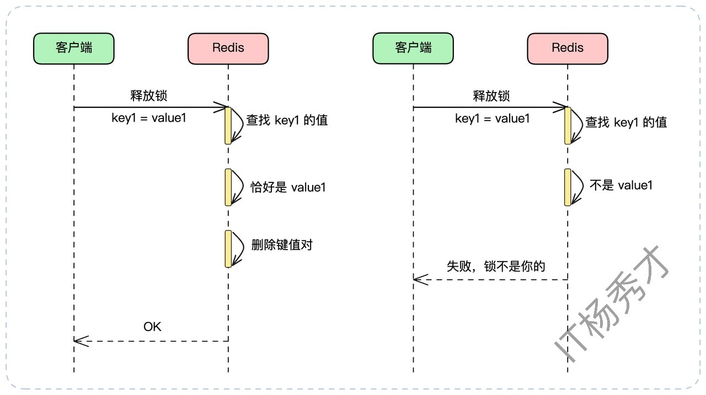

## **3. 高阶方案**

### **3.1 Redlock**

至此，我们的分布式锁似乎已经很健壮了。但它依然依赖一个**单实例**的 Redis。如果这个 Redis 实例宕机了，整个分布式锁服务就瘫痪了。

你可能会说：“用 Redis 主从（Master-Slave）复制和哨兵（Sentinel）来保证高可用啊！”，但这不行。Redis 的主从复制是**异步**的。这会导致一个致命缺陷：

1. 客户端A在 Master 节点加锁成功。

2. Master 还没来得及把这个 `key` 异步复制给 Slave，就宕机了。

3. 哨兵（Sentinel）将 Slave 提升为新的 Master。

4. 客户端B在新 Master 上尝试加锁，由于新 Master 上根本没有这个 `key`，B也加锁成功了。

5. **灾难发生**：系统中有两个客户端同时持有了锁，排他性被打破。

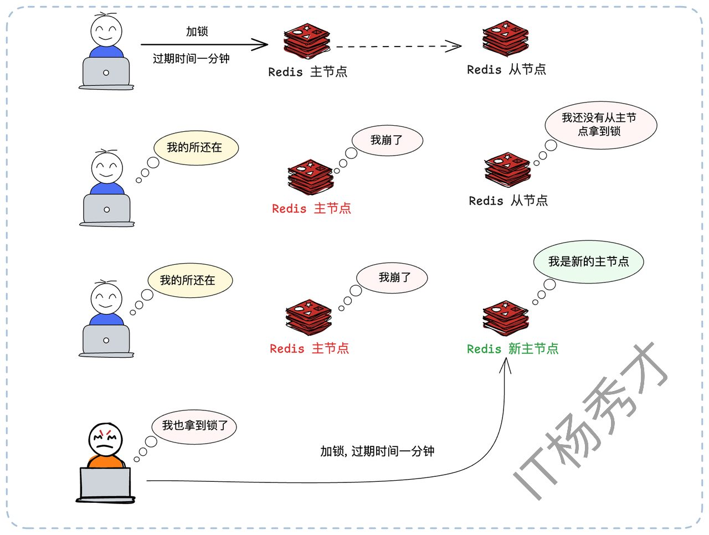

为了解决 Redis 单点和主从异步复制的缺陷，Redis 的作者 Antirez 提出了 **Redlock（红锁）算法**。

Redlock 的思想是“**多数派原则**”。它不再依赖单个 Redis 实例，而是部署 N 个。当大多数节点都告诉你加锁成功的时候，就说明加锁成功了。比如你同时在 5 个节点上加锁，那么大多数就意味着至少 3 个节点成功才算加锁成功。

* **加锁流程**：

  1. 客户端记录当前时间戳。

  2. 依次尝试在**所有5个**实例上加锁（使用我们前面完善的 `SET ... EX ... NX` 命令），并且为每个实例设置一个很短的连接和响应超时（例如50毫秒），防止在某个宕机节点上浪费太多时间。

  3. 统计加锁成功的实例数量。如果**超过半数**（例如 5个中的3个）成功，并且总耗时小于锁的有效时间（`过期时间 - 加锁耗时`），则认为加锁成功。

  4. 锁的真正有效时间 = 初始设置的过期时间 - 加锁总耗时。

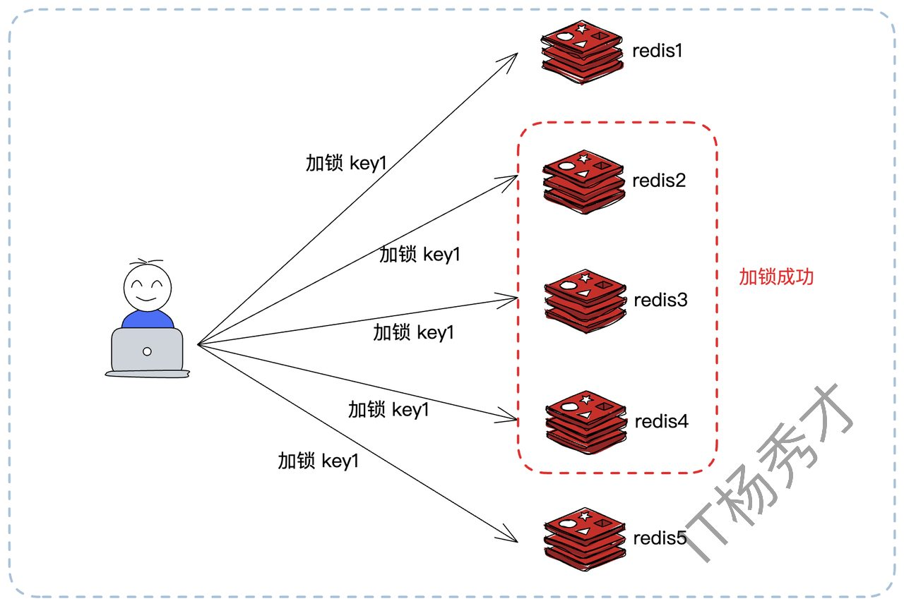

* 释放锁流程：

* 客户端必须向所有5个实例发起释放锁（前面提到的Lua脚本）的操作，无论加锁时该实例是否成功。这样做是为了清理可能存在的“僵尸锁”。

Redlock 通过“多数派”机制，极大地提升了分布式锁的可用性。即使有1-2个 Redis 实例宕机，锁服务依然可用。

但它也并非银弹。Redlock 的成本更高，实现更复杂，且加锁的性能开销也更大（需要请求多次）。因此，在实际选型中，很多公司会评估后也会认为这种方案过于复杂，单实例 Redis 带来的风险（如宕机、主从切换）是可接受的，从而选择继续使用我们前面讨论的、基于单实例的健壮方案。

### **3.2 锁的性能优化**

分布式锁虽然解决了问题，但它本身是有开销的：每一次加锁、续约、释放锁，都是一次（甚至多次）网络IO。在高并发场景下，锁的竞争会成为性能瓶颈。

其实分布式锁能做的优化不多。一个思路是优化 Redis本身的性能（比如启用单独的Redis集群，防止被其他业务影响），另一个思路就是减少分布式锁的竞争。

#### **3.2.1 减少锁竞争：Singleflight 模式**

在高并发下，可能一个服务实例内的几十个线程，和另外几十个实例的几百个线程，都在同一时刻竞争**同一把锁**。

我们可以借鉴 `singleflight` 模式（在Go中很常用，Guava中也有类似实现）：针对同一个 `key` 的加锁请求，在**单个实例内部**，只允许一个线程去 Redis 竞争分布式锁。其他线程则在本地等待这个代表的结果。


假设有2个实例，每个实例上各有10个线程要去获得 key1 上的分布式锁。

* **无优化**：总共有 2 \* 10 = 20 个线程会涌向 Redis 竞争锁。

* **Singleflight**：实例A内部先选出1个线程，实例B内部也选出1个线程。最终只有2个线程去 Redis 竞争分布式锁。

竞争压力骤减，性能显著提升。竞争越激烈，这种方案的效果越好。如果没什么并发，那就基本没什么效果。

#### **3.2.2 本地锁交接**

这里还有一种更加激进的优化方案。当实例A的线程T1拿到了分布式锁并执行完业务后，它在释放锁（`DEL`）之前，先检查一下**本地**（即实例A的内存中）是否还有其他线程（如T2、T3）正在等待这把锁。

如果有（比如T2在等），T1可以直接在内存中把“锁凭证”（那个唯一的UUID）转交给T2，并通知T2“你现在可以执行了”。T1自己则不去 `DEL` 锁，转而由T2在未来去释放。

这种本地接力完全省去了一次 `DEL` 和一次 `SETNX` 的网络开销，在高竞争下效果还是非常不错的。


虽然这种方案开起来性能确实得到了极大的提升，但是实际生产环境中这种方式一般用的较少，主要有以下几个点：

> 1. 复杂度高，容错性差，这种方案引入了**本地状态依赖**（比如本机的等待队列和锁持有状态），一旦实例 A 崩溃或重启，这个“接力关系”就断了，但在 Redis 看来锁还没释放，造成**锁泄漏**
>
> 2. 失去了分布式锁的原本意义，Redis 分布式锁设计的初衷就是**锁的状态由 Redis 统一仲裁，不依赖于任何单节点的本地状态**。但这种方法把部分锁语义搬回了节点内存。这意味着锁的持有状态，不再是**单一数据源**，而是 Redis + 本地协作，这就导致一致性边界模糊，违背集中锁仲裁的设计哲学

#### **3.2.3 分布式锁替换**

针对这种排他场景，还可以进一步优化。就是不用分布式锁。分布式锁是解决并发的其实性能消耗还是不小的，如果能换个思路，也许根本不需要它。严格来说，是原本这些场景就不该用分布式锁。

1. **数据库乐观锁**

很多场景使用分布式锁，是为了保护一个“读取数据 -> 计算 -> 写回数据”的流程。比如扣减库存：SETNX -> SELECT -> 业务计算 -> UPDATE -> DEL。这个流程完全可以用乐观锁替代。给库存表加一个 `version` 字段：

1. `SELECT stock, version FROM inventory WHERE sku_id = 's101'`

2. 在内存中计算新库存 `new_stock = stock - 1`

3. `UPDATE inventory SET stock = new_stock, version = version + 1 WHERE sku_id = 's101' AND version = (第1步查到的version)`

如果 `UPDATE` 的返回行数为0，说明 `version` 已被他人修改（并发冲突）。此时客户端只需从第1步开始重试即可。全程无锁，性能极高。缺点是可能会有多个线程在做重复计算，但只要最终更新数据库时控制住了并发，就没关系。

2. **一致性哈希负载均衡**

分布式锁的出现，是因为同一个业务请求（如处理订单 order\_id=555）可能被负载均衡打到任何一个实例上。

如果我们能通过一致性哈希等手段，将**特定ID的请求（如按 `order_id` 哈希）固定路由到同一个实例**上，那么问题就从“分布式”退化成了“单机”。我们只需要在那个实例内部使用本地锁（如 Java 的 `ReentrantLock`）或者用单机 `Singleflight` 模式就可以，完全规避了重量级的分布式锁。

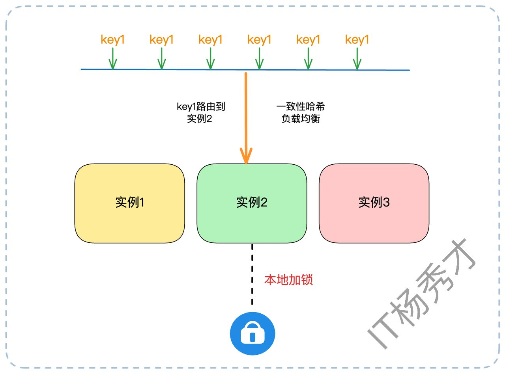


## **4. 小节**

从最初的 `SETNX` 到完善的续约、原子化释放、再到 Redlock 以及各种性能优化手段，我们可以看到，分布式锁的核心始终围绕两个关键词展开：**可靠性**与**性能**。可靠性确保锁语义不被破坏，性能则决定方案能否真正落地。工程实践中，锁并非万能，很多场景完全可以用乐观锁或一致性哈希等思路替代，从根源上消除“锁”的需求。掌握这些设计背后的取舍逻辑，远比死记实现细节更重要。分布式锁不是终点，而是理解分布式一致性与系统取舍的起点。

## **资料分享**
随着AI发展越来越快，AI编程能力越来越强大，现在很多基础的写接口，编码工作AI都能很好地完成了。并且现在的面试八股问题也在逐渐弱化，**面试更多的是查考候选人是不是具备一定的知识体系，有一定的架构设计能力，能解决一些场景问题**。所以，不管是校招还是社招，这都要求我们一定要具备架构能力了，不能再当一个纯八股选手或者是只会写接口的初级码农了。这里，秀才为大家精选了一些架构学习资料，学完后从实战，到面试再到晋升，都能很好的应付。**关注秀才公众号：IT杨秀才，回复：111，即可免费领取哦**


<div style="background-color: #f0f9eb; padding: 10px 15px; border-radius: 4px; border-left: 5px solid #67c23a; margin: 20px 0; color:rgb(64, 147, 255);">

## <span style="color: #006400;">**学习交流**</span>
<span style="color:rgb(4, 4, 4);">
> 如果您觉得文章有帮助，可以关注下秀才的<strong style="color: red;">公众号：IT杨秀才</strong>，后续更多优质的文章都会在公众号第一时间发布，不一定会及时同步到网站。点个关注👇，优质内容不错过
</span>


</div>

