为了让系统能够支撑更高的数据量和更复杂的业务流程，后端架构师在做架构设计的时候演进过程中，通常会采用两种核心策略：将庞大的单体应用拆分为职责单一的**微服务**，以及为了应对海量数据，会对单一的数据库进行分库分表。

这两种策略虽然都能有效提升系统的水平扩展能力和团队的迭代效率，但它们也带来了一个共同的、且极为棘手的问题。当一个完整的业务操作不再局限于单一进程或单一数据库时，我们过去所依赖的、由数据库提供的“本地事务”保障（即 ACID）就自然失效了。

如何在这种全新的分布式环境下，依然保证跨越多个服务、多个数据库的数据一致性？这便是所有后端架构师都必须面对的核心难题：**分布式事务**。

分布式事务是高可用系统设计中的关键环节，透过它能清晰的检测出一个后端工程师的技术水平和业务能力。在技术面试中，面试官非常倾向于通过这个议题来考察你对复杂系统的理解深度。能否清晰阐述各种方案的权衡，往往决定了你能否胜任高级职位，这是一个既能充分展现亮点、也极易暴露短板的领域。

## **1. 核心理论：2PC、3PC 与 XA**

在深入探讨解决方案之前，我们必须先理清一个关键的**前置知识**：你所谈论的分布式事务究竟是哪个层面的？它可能有两个截然不同的含义。

**第一种，是纯粹数据库实例间的事务**，这通常由**分库分表**引起。比如一个更新操作需要同时修改 `user_db_0` 和 `user_db_1`。这类事务的解决方案，往往由数据中间件（如 ShardingSphere）来提供。**第二种，则是跨服务的业务层事务**，这通常由**微服务架构**引起。比如一个下单操作，需要订单服务、“库存服务”和“支付服务”协同完成。这类事务的解决方案，往往由独立的第三方中间件（如 Seata）来协调。

在面试或技术讨论中，首先明确上下文是哪一类，才能给出精准的回答。而无论哪一类，它们都源于一些共同的经典理论协议。

### **1.1 两阶段提交 (2PC)**

两阶段提交（Two-Phase Commit）是分布式事务中最广为人知的协议。其核心思路可以概括为：引入一个“协调者”（Coordinator），由它来统一指挥所有“参与者”（Participant）的行为，要么一起提交，要么一起回滚。

它分为“准备”和“提交”两个阶段。在**准备阶段**，协调者向所有参与者发出“准备”指令。参与者收到后，开始执行本地事务操作（如修改数据、锁定资源），但**并不提交**。它们会记录下用于后续提交的 Redo 日志和用于回滚的 Undo 日志，然后向协调者回复“准备就绪”（Yes）或“无法准备”（No）。

进入**提交阶段**，协调者会收集所有参与者的反馈。如果**所有**参与者都回复“Yes”，协调者就向它们发出“提交”（Commit）指令，参与者收到后执行本地事务的 Commit。反之，如果**任何一个**参与者回复“No”，或者有参与者超时未响应，协调者就向所有参与者发出“回滚”（Rollback）指令，参与者根据 Undo 日志回滚所有操作。

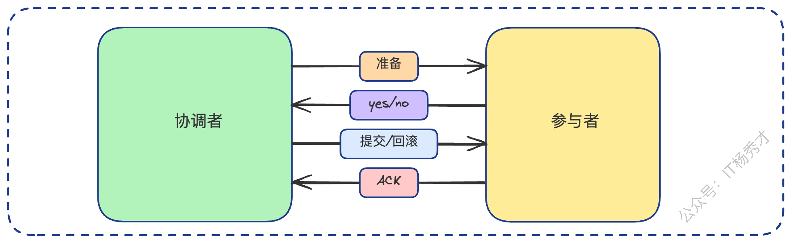

2PC 协议听起来很完美，但它在工程实践中存在几个致命缺陷。**首先是同步阻塞**，这是 2PC 最大的问题。在两个阶段中，所有参与者都在“等待”协调者的指令。尤其是在阶段一回复“Yes”之后，参与者必须锁定事务资源，直到阶段二的最终指令到来。如果网络延迟高，或者某个参与者处理缓慢，所有节点都会被阻塞。更严重的是，这种阻塞会“传染”：若节点 A 锁定了资源，节点 B 在等待 A，此时节点 C 恰好要访问 B，那么 C 也会连带着被阻塞。

**其次，协调者构成了单点故障**。协调者是整个系统的大脑。如果协调者在阶段二发出最终指令前宕机，所有参与者将永远“卡”在准备阶段，无法得知该提交还是回滚，导致资源被无限期锁定。

**最后，它的容错策略非常保守**。在准备阶段，任何一个节点的失败（或网络超时）都会导致协调者触发全局回滚。在网络不稳定的情况下，这可能会导致大量本可以成功的事务被“误杀”，造成不必要的回滚。

那么，如果故障发生在阶段二呢？这里有两个值得深思的场景。**第一个场景：协调者发出了 Commit，但某个参与者没收到。** 这种情况下，协调者会**不断重试**，直到该参与者确认收到 Commit 指令为止。这是为了保证所有节点最终都能达成一致。

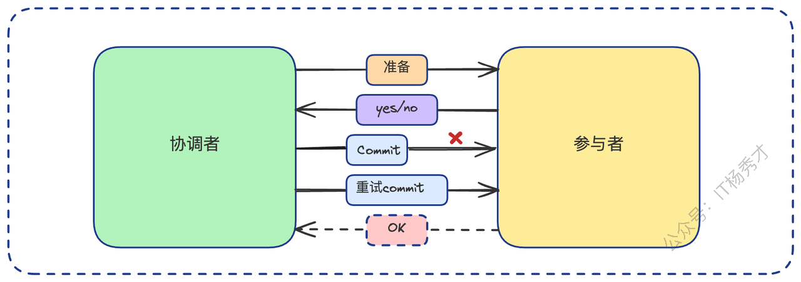

**第二个场景：参与者收到了 Commit，但在执行本地提交前宕机了。** 此时，当这个参与者节点恢复后，它会去检查自己的本地事务日志。它会发现自己已经完成了“准备”阶段，并且也收到了“Commit”指令，于是它会利用之前记录的 **Redo 日志**，自动完成事务的提交，以追上大部队的状态。

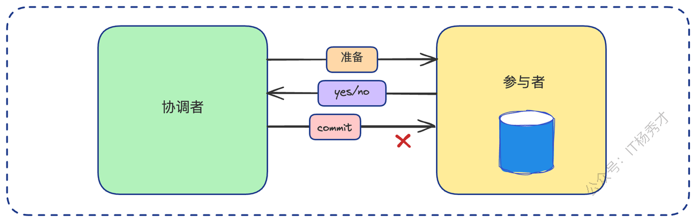

### **1.2 三阶段提交 (3PC) 与 XA 规范**

为了缓解 2PC 的一些问题，特别是“准备阶段白忙活”（一个节点准备好了，结果另一个节点失败导致全局回滚）和“同步阻塞”过久，学术界提出了三阶段提交（3PC）。

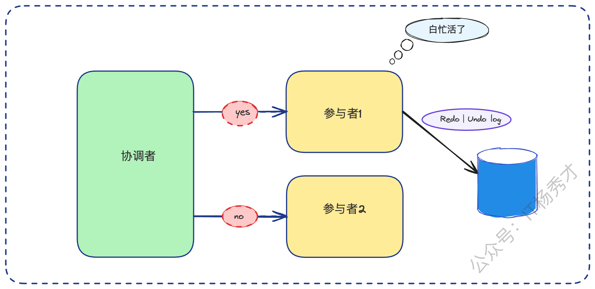

它在 2PC 基础上增加了一个 **CanCommit 阶段**。协调者先问一圈：“各位，你们的资源和状态是否*允许*执行此事务？”（纯检查，不锁定资源）。如果大家都回复“可以”，协调者才发起 **PreCommit 阶段**（类似 2PC 的准备），参与者此时才真正开始执行事务（锁定资源、写 Redo/Undo）。最后进入 **DoCommit 阶段**，发起提交或中止指令。

3PC 试图通过 CanCommit 阶段提前发现无法执行的节点，减少“白忙活”的概率。但它也带来了更多的网络往返，使得整个流程更长、更复杂。在工程实践中，人们发现 2PC 已经能解决大部分问题，而 3PC 带来的这点收益与其增加的复杂度相比，性价比很低，因此并未被广泛采用。

如果说 2PC/3PC 是学术理论，那么 **XA 规范** 就是将 2PC 理论具象化后的工程标准。XA 规范是由 X/Open 组织提出的分布式事务处理（DTP）模型，它并非一种协议，而是一套**接口标准**。它精确地定义了事务管理器（TM，即协调者）和资源管理器（RM，即实现了 XA 接口的数据库等参与者）之间的通信接口。只要数据库遵循了 XA 规范，理论上它就能被一个 XA 事务管理器所纳管，参与到全局的 2PC 事务中。

## **2. 强一致性与最终一致性**

### **2.1 XA 与 ACID 的一致性争议**

这是一个在面试中经常被深入探讨的争议点：XA 究竟满足 ACID 吗？我个人的倾向是，**XA 并不完全满足严格的 ACID**。

核心在于**C（Consistency，一致性）**。严格的一致性要求数据在任何时刻都处于一致状态。但 XA（即 2PC）在执行过程中，存在一个明显的**不一致窗口**。当协调者在阶段二发出 Commit 指令后，如果某个参与者 A 提交成功，而参与者 B 因为网络抖动尚未收到 Commit 指令（或正在重试），此时系统的数据就处于“A 提交了，B 没提交”的中间态。在这个不一致窗口内，如果有外部读取，就会看到不一致的数据。

因此，我们只能说，XA 是所有分布式方案中，**最接近**严格 ACID 的一种，但它为了追求这种强一致，付出了高昂的性能代价（同步阻塞）。

### **2.2 最终一致性**

正是因为 XA 方案的高昂代价，导致低吞吐量、出现同步阻塞，在追求高可用、高性能的现代互联网架构中，它几乎不被采用。

架构师们必须做出妥协：**放弃强一致性（即时一致性），转而拥抱最终一致性**。

最终一致性允许系统在执行过程中存在短暂的数据不一致（即中间态），但它承诺并有机制保障，在经历了一系列（可能出错和重试的）步骤后，所有相关节点的数据**最终**会达到一致的状态。

> 在面试中，当你阐述完 XA 的局限性后，自然地引出最终一致性是业界的普遍选择，并准备深入探讨 TCC、SAGA 等方案，这通常是面试官所期待的。

在实际工作中，你也应该对自己的系统有清晰的认知。比如，如果使用了分库分表，我们是否允许跨库事务？如果允许，用的是什么方案？是 XA 还是中间件的延迟事务？在微服务层面，我们使用的是哪种分布式事务方案？TCC、SAGA 还是 Seata AT？**最关键的是：当中间步骤出错时，我们的容错和补偿机制是什么？**

> 面试官也经常会从这些实际问题出发，例如：“单体拆分成微服务后，原本的本地事务是如何改造的？”“你们的多个服务是共享数据库吗？如果不是，如何保证数据一致性？”，“一个 `DELETE` 语句经过分片后要删除多个表的数据，你如何保证原子性？”这些问题的本质，都是在考察你对“最终一致性”方案的理解和实战经验。

## **3. 主流方案：TCC、SAGA 与 AT**

基于最终一致性的思想，业界在微服务架构中演进出了三种主流的实现方案。

### **3.1 TCC&#x20;**

TCC即Try-Confirm-Cancel，是最终一致性的一种主流实现，它巧妙地将 2PC 的思想从数据库资源层上移到了**业务逻辑层**。它的核心在于 **Try（尝试执行业务，检查并预留资源）**、**Confirm（确认执行业务，真正使用 Try 阶段预留的资源）** 和 **Cancel（取消执行业务，释放 Try 阶段预留的资源）**。

TCC 其实可以看作是应用层实现的两阶段提交，简而言之就是在业务层完成两次动作，才算事务生效。应用层的两阶段提交（TCC ）的精髓在于，Try、Confirm、Cancel 这三个操作，**各自都是一个完整的、独立的本地事务**，可以立即提交。我们用一个更详细的“下单锁库存”案例（变更自原文）来理解：假设用户购买 `item_id=888` 的商品 1 件。

**Try阶段成功：**

1. 订单服务会 `INSERT INTO orders (item_id, status) VALUES (888, 'PENDING')` 并提交本地事务；

2. 库存服务会 `UPDATE inventory SET available_stock = available_stock - 1, locked_stock = locked_stock + 1 WHERE item_id = 888 AND available_stock >= 1` 并提交本地事务。此时，资源已被预留。

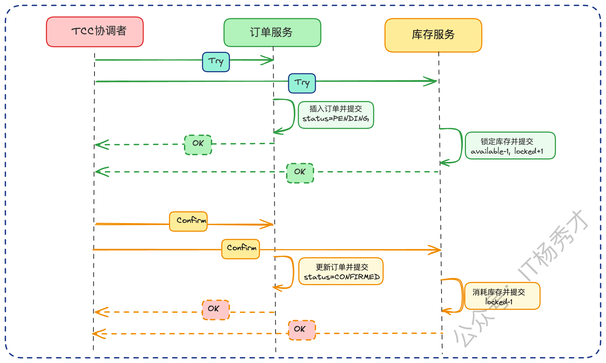

如果所有 Try 均成功，TCC 框架开始调用 **Confirm 阶段**。

1. 订单服务 `UPDATE orders SET status = 'CONFIRMED' WHERE ...`

2. 库存服务 `UPDATE inventory SET locked_stock = locked_stock - 1 WHERE item_id = 888`

各自提交本地事务，此时资源被真正使用。

**Try阶段失败：**

如果 Try 阶段中，库存服务因并发导致 `available_stock` 不足而失败，TCC 框架开始调用 **Cancel 阶段**。

1. 订单服务 `UPDATE orders SET status = 'CANCELLED' WHERE ...`

2. 库存服务由于之前检查数量不足没有执行数量的扣减，这里无需执行cancel操作。如果之前 Try 已成功。`UPDATE inventory SET available_stock = available_stock + 1, locked_stock = locked_stock - 1 WHERE item_id = 888`。各自提交本地事务，释放预留的资源。

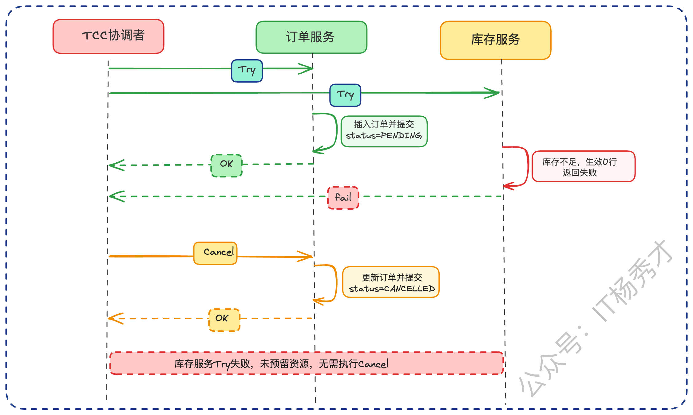

其实可以认为Cancel的操作就是一个前面Try操作的逆过程

TCC 方案虽然清晰，但它的难点藏在**容错**里。Try 阶段出错还好，业务本就无法使用（如订单是 PENDING），直接 Cancel 即可。最严重的是 **Confirm 或 Cancel 阶段出错**。想象一下，如果 Confirm 阶段，订单服务成功了（CONFIRMED），但库存服务的 `UPDATE locked_stock` 调用超时或失败了，怎么办？此时订单是 CONFIRMED，库存却是 LOCKED，数据严重不一致。

最容易想到的答案是：**重试**。TCC 框架必须**不断地**、**幂等地**（这点至关重要，Confirm/Cancel 必须可重复执行而不产生副作用）重试失败的 Confirm（或 Cancel）操作，直到它成功为止。那如果重试了几十次还是失败呢（比如库存服务有 Bug，或者彻底宕机）？这时候，光靠框架的无限重试就不行了，必须有**兜底保障机制**（这才是面试的亮点）。

> 最基础的方案是**监控 + 告警 + 人工介入**。当重试连续失败（例如 10 次）后，框架不再重试，而是发出严重告警，由 SRE 或开发人员**手动介入**处理（比如手动修复数据、重启服务）。

更进一步的方案，是**异步校准修复（离线）**。建立一个离线的数据比对程序（如定时 Job），T+1 地扫描数据。例如，扫描所有“CONFIRMED”状态超过 5 分钟的订单，去和库存系统比对，一旦发现订单已确认、但库存还处于“LOCKED”状态的数据，就立即执行修复。

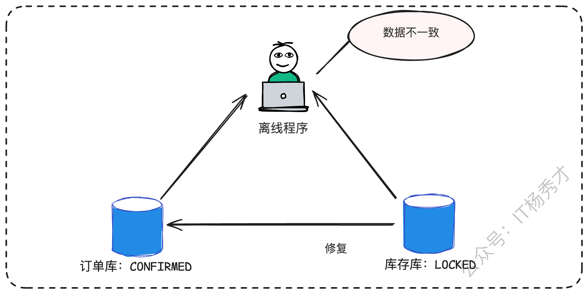

在某些高时效性场景下，还可以采用**实时读取修复（在线）**。比如在用户查询订单详情时，聚合服务需要同时调用订单库和库存库。当它在读取时发现数据不一致（订单 'CONFIRMED'，库存 'LOCKED'），它可以“机智”地返回给用户一个“处理中”的友好提示，并**异步触发一个修复程序**去修正这个脏数据。

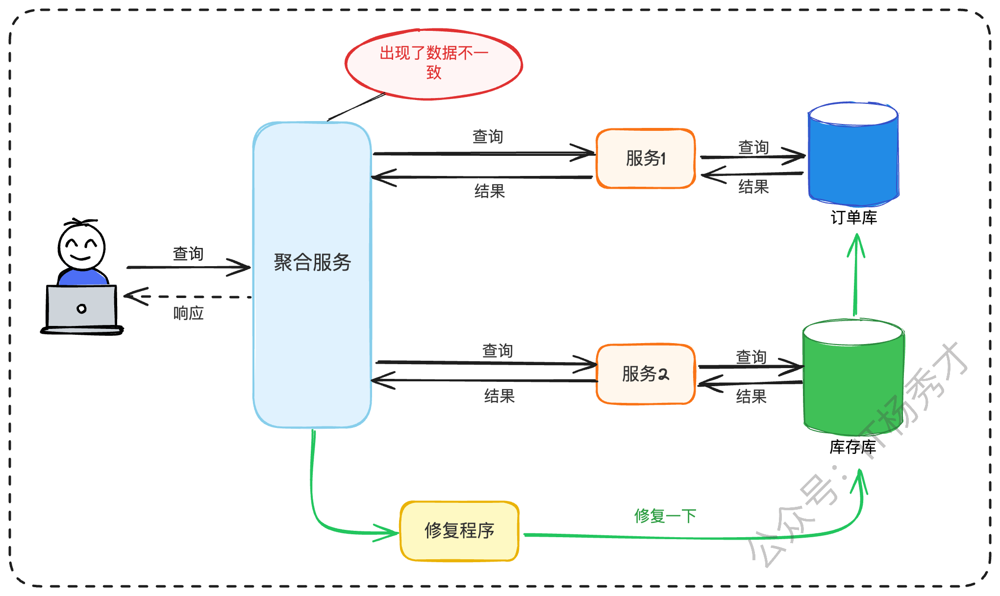

### **3.2 SAGA**

SAGA 是另一种截然不同的思路。TCC 是先预留，再确认，而 SAGA 则是**立即执行，失败后再补偿**。

一个 SAGA 事务由一系列子事务（Local Transaction）构成。每个子事务都会**立即提交**。如果某个子事务失败了，SAGA 会启动**补偿事务**（Compensation Transaction），按相反的顺序，把前面已经成功提交的子事务撤销掉。

这里必须厘清补偿和回滚的**核心区别**：回滚是数据库层面的，利用 Undo Log，事务并未提交；而补偿是业务层面的**反向操作**，原事务已经提交，补偿是一个新的本地事务。

我们用跨行转账的例子来理解：在**正向流程**中，事务1（A 银行） `UPDATE account SET balance = balance - 100 WHERE id = 'A'`，**立即提交**。紧接着，事务2（B 银行） `UPDATE account SET balance = balance + 100 WHERE id = 'B'`，但**执行失败**（例如 B 账户被冻结）。此时，SAGA 启动**反向补偿**，执行补偿事务1（A 银行）：`UPDATE account SET balance = balance + 100 WHERE id = 'A'` 并**立即提交**，即 A 银行加回100 块。

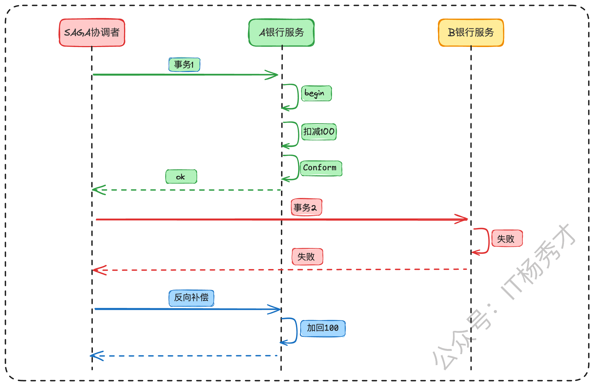

SAGA 模式特别适合那些业务流程长、涉及多个服务的场景。它还有一个 TCC 不具备的亮点：**支持并发执行**。比如一个复杂的“旅行预订”SAGA，它可以并发地执行“预订机票”、“预订酒店”、“预订租车”三个子事务，因为这三者之间可能并无依赖，并发执行可以大大缩短整个 SAGA 事务的总体耗时。

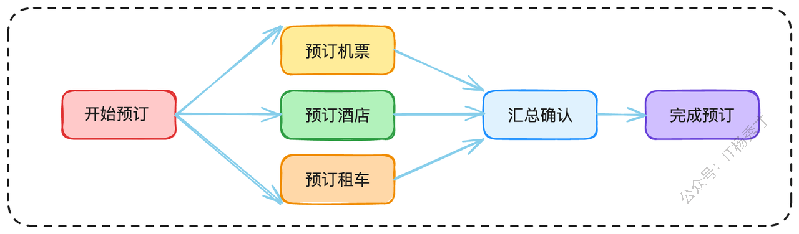

> SAGA 的容错难点和 TCC 一样：**如果补偿事务失败了怎么办？**（比如 A 银行的补偿加钱操作失败了）。答案也一样：**重试、重试、再重试**。SAGA 框架必须保证补偿操作的最终成功。如果实在不行（比如A银行系统持续不可用），只能**告警 + 人工介入**或触发前面提到的自动修复机制。

### **3.3 AT**

TCC 和 SAGA 都需要我们手写大量的业务逻辑（Confirm/Cancel 或补偿事务），对业务的侵入性很强。因此，像 Seata 这样的中间件，提供了一种更便捷的模式——**AT（Automatic Transaction）**。

你可以把 AT 模式理解为**自动化的 SAGA**。它的核心原理是利用了数据库的 `undo_log`。在你的本地事务（比如 `UPDATE`）执行**前**，中间件会先解析 SQL，查出before的数据快照。然后，你的本地事务正常执行。在本地事务**提交前**，中间件将before快照存为一个 `undo_log` 记录（写在*同一*数据库中），`undo_log` 和业务数据的修改是在**同一个本地事务**里提交的。如果全局事务需要回滚，中间件就会读取 `undo_log`，自动生成**反向 SQL**（比如把 `UPDATE` 再 `UPDATE` 回去），帮你完成补偿。

> 这种模式对业务的侵入性最小，你几乎不用改代码。但它依赖于数据库（需要 `undo_log` 表）和 SQL 解析（不支持某些复杂 SQL），灵活性自然也就差一些。

### **3.4 延迟事务**

TCC、SAGA、AT 更多是在微服务层发力。那如果我们只是单纯的分库分表，有没有更轻量、更高效的方案？

答案当然有。首先，最简单直接的方案，就是在公司规范里**禁止跨库事务**。通过合理的分片键设计（比如按 `user_id` 分片），确保 99% 的事务都在单一分片内完成。如果业务非要跨库，那就拆分成多个本地事务，在业务层自己保证最终一致性。

但如果真的（非要）有跨库事务，又不想上 TCC 那么重，分库分表中间件（如 ShardingSphere）提供了一种非常巧妙的方案——**延迟事务（Delayed Transaction）**。这也是你在面试时候的可以展现给面试官的终极亮点方案。

#### **3.4.1 延迟事务原理**

这个方案要解决一个核心痛点：当应用层执行 `Begin`（开启事务）时，中间件**根本无法预测**你接下来的 SQL 会落到哪个分库上。

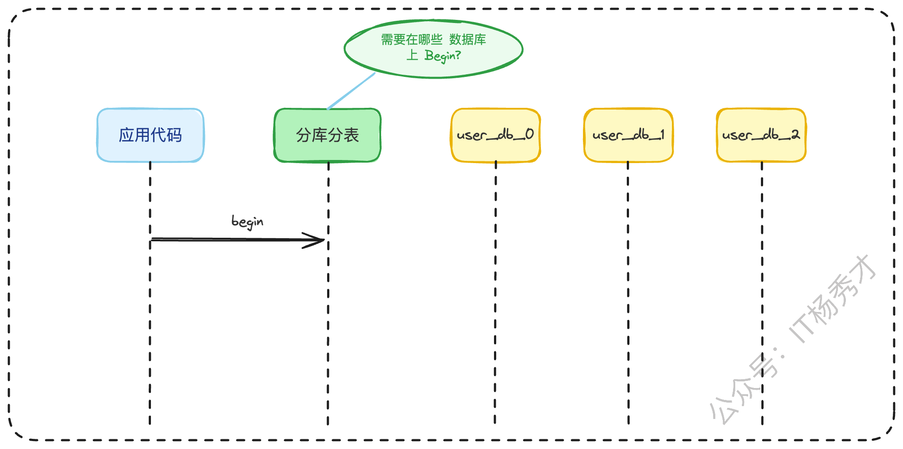

比如，一个 `UPDATE` 可能根据参数 `user_id=50` 路由到 `db_0`，也可能根据 `user_id=51` 路由到 `db_2`。

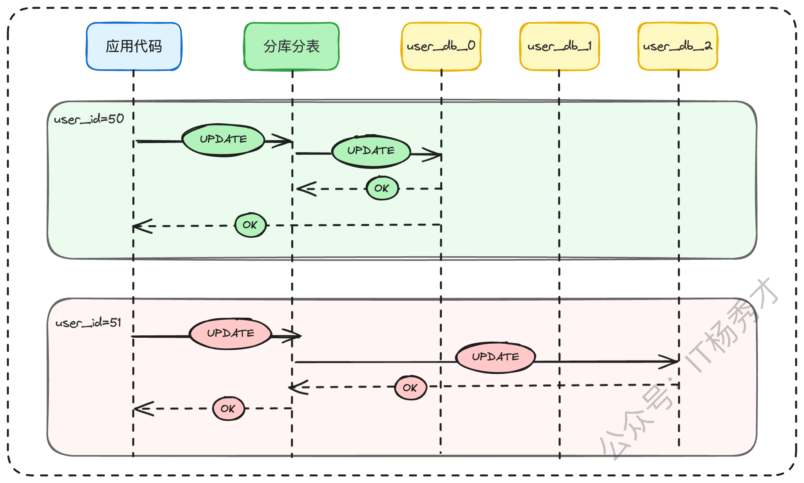

中间件只有两个选择。**一种是资源消耗大的方案**：执行 `Begin` 时，在**所有**分库上都开启一个真实事务。这太浪费资源了，可能你最后只用到了 `db_2`，却在 `db_0` 和 `db_1` 上白白占用了连接和事务资源。

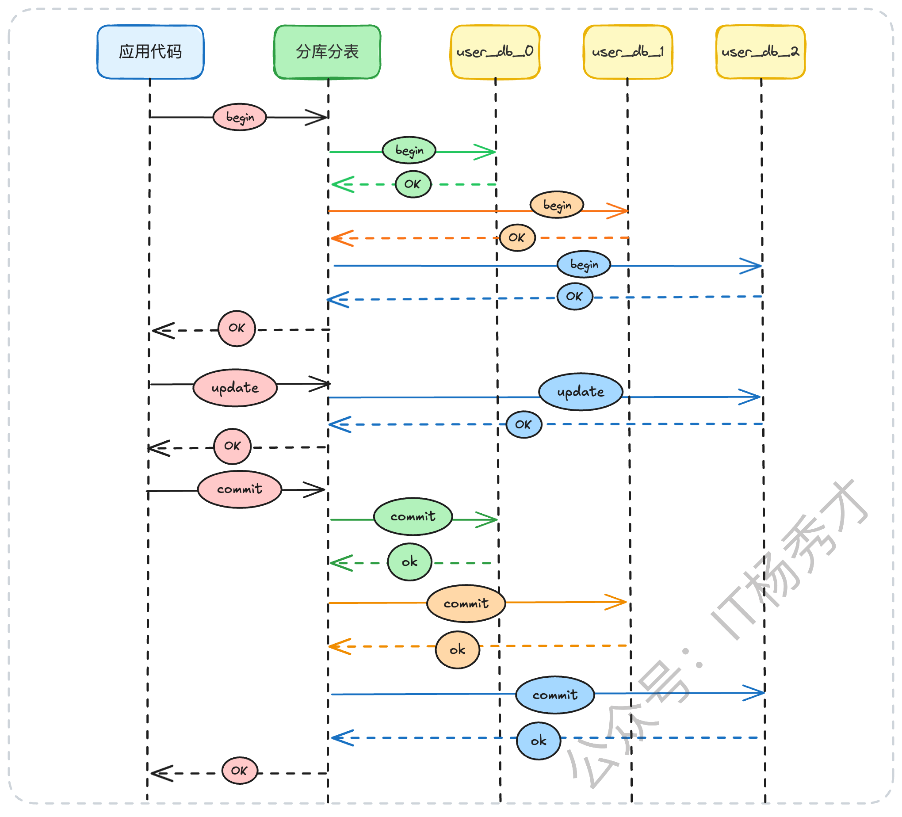

所以，按需开启事务时更合理的，它避免在用不上的数据库上开启事务，所以它的应用也更加广泛

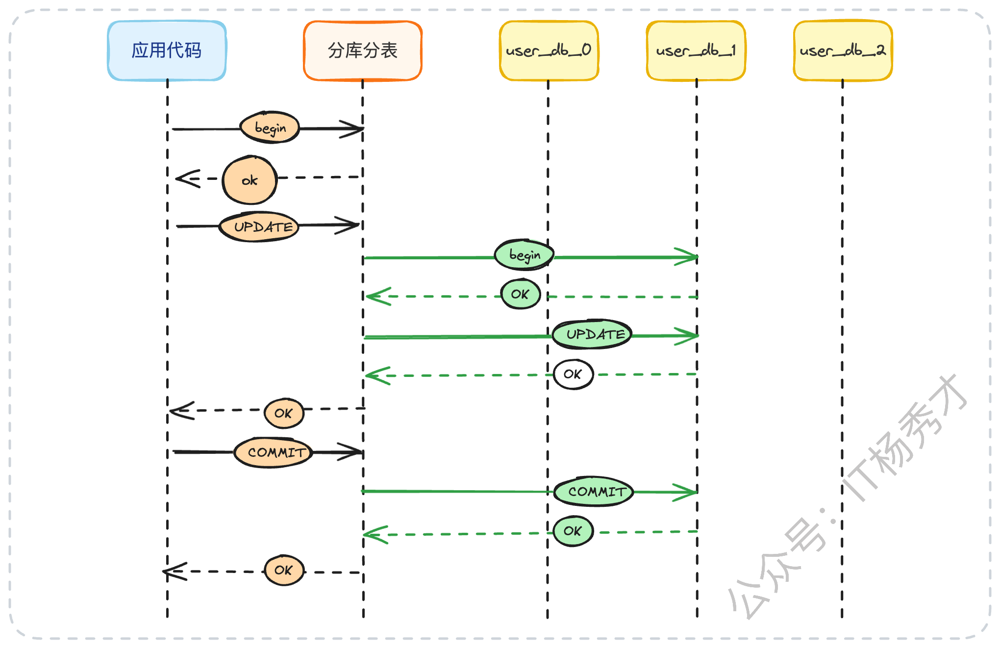

**另一种是优化方案，即延迟事务**：应用层执行 `Begin`，中间件**什么也不做**，只是在内存中标记一下事务已开始。当应用层执行第一条 SQL（比如 `UPDATE ... WHERE user_id = 50`），中间件解析出它需要路由到 `db_0`。此时，中间件检查 `db_0` 上是否已开启事务，发现没有，于是在 `db_0` 上真正开启一个本地事务，并执行 SQL。接着，应用层又执行第二条 SQL（`UPDATE ... WHERE user_id = 51`），路由到 `db_2`。中间件检查 `db_2`，也在 `db_2` 上开启一个本地事务，并执行 SQL。如果应用层执行第三条 SQL（`UPDATE ... WHERE user_id = 50 ...`），路由到 `db_0`，中间件检查 `db_0`，发现事务已开启，于是**复用**该事务执行 SQL。最后，当应用层执行 `Commit` 时，中间件才将 `db_0` 和 `db_2 `上所有“延迟开启”的事务，统一执行 `Commit`。

#### **3.4.2 容错机制：自动故障处理**

这个“按需开启”的方案是不是非常高效？但是，它依然没有逃过那个根本问题：如果 `Commit` 的时候，`db_0` 提交成功了，但 `db_2` 提交失败（或超时）了，怎么办？

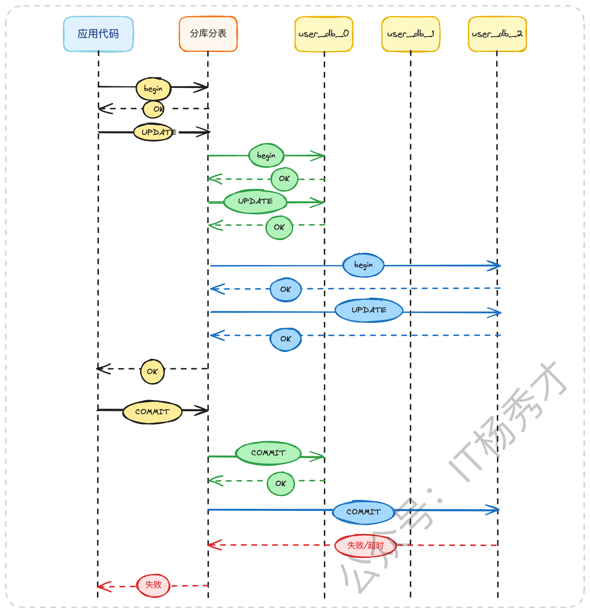

我们又回到了原点：**重试**。中间件会立刻重试失败的 `Commit`。

如果重试都失败了呢？这就引出了我实战中用过的更完善的高阶方案：**自动故障处理机制**。

当中间件连续重试 `Commit` 失败后（例如 3 次），它不再只是“告警”，而是**异步发送一条消息**（比如到 Kafka 或 RocketMQ）。这条消息必须携带足够的上下文，例如**全局事务ID、目标库、目标表、主键、失败阶段**等。

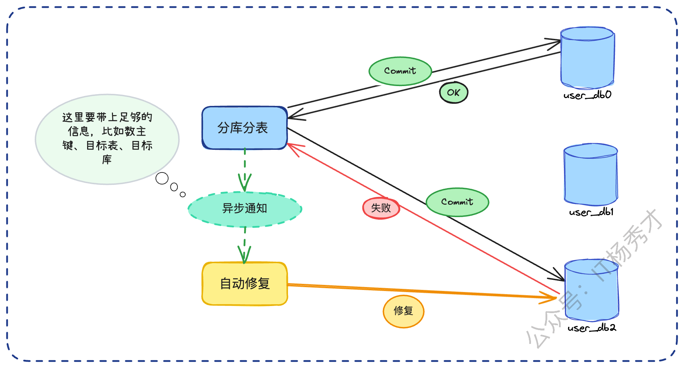

然后，我们有一个独立的**自动修复服务**来消费这条消息。这个服务会根据业务逻辑，来决定是正向修复（用 `db_0` 已提交的数据去强行修复 `db_2` 的数据）还是逆向补偿（把 `db_0` 的数据给回滚了）。这个修复逻辑通常是和业务强相关的，需要业务方来定义和接入。

> 面试在回答这个方案的时候，还可以辅以一个实际工作案例。比如，在我之前的一个高可用项目中，我们引入了这个机制，让业务方可以自定义修复逻辑。最终，系统的可用性从P80提升到了P99，大大减少了需要人工介入处理的线上问题。

## **4. 小节**

回顾我们的整个分布式事务方案，我们首先从理论（2PC/3PC/XA）出发，然后以最终一致性为前提，再到业界主流的分布式事务具体实践。在微服务场景下，我们有 TCC（业务侵入强，控制力高）、SAGA（流程编排，易于理解）和 AT（自动补偿，侵入性低）。在分库分表场景，我们有延迟事务这种轻量级的优选方案。你会发现，所有方案最后都指向了一个共同的核心难点——**容错**。

一个高阶架构师的价值，不在于知道 TCC 和 SAGA 的区别，而在于你**如何设计那套“重试 + 幂等保障 + 告警 + 自动/手动修复”的完整保障机制**。这才是保证系统在复杂的线上环境中最终还能保持稳定的核心。

最后，技术的世界里，很多时候没有绝对的对错，只有不同场景下的偏好和权衡。具体方案一定是视场景而定，不同场景有不同的方案选择。在面试中，我们也要尽可能全面的展现我们的思维，我们的目标是设计和构建出真正鲁棒的系统，而不是执着于某个具体方案的好与坏。

## **资料分享**
随着AI发展越来越快，AI编程能力越来越强大，现在很多基础的写接口，编码工作AI都能很好地完成了。并且现在的面试八股问题也在逐渐弱化，**面试更多的是查考候选人是不是具备一定的知识体系，有一定的架构设计能力，能解决一些场景问题**。所以，不管是校招还是社招，这都要求我们一定要具备架构能力了，不能再当一个纯八股选手或者是只会写接口的初级码农了。这里，秀才为大家精选了一些架构学习资料，学完后从实战，到面试再到晋升，都能很好的应付。**关注秀才公众号：IT杨秀才，回复：111，即可免费领取哦**

## **学习交流**

> 如果您觉得文章有帮助，可以关注下秀才的<strong style="color: red;">公众号：IT杨秀才</strong>，后续更多优质的文章都会在公众号第一时间发布，不一定会及时同步到网站。点个关注👇，优质内容不错过

