# 服务降级：从有损服务到保障核心业务的架构智慧

今天，和大家深入聊聊微服务架构里另一个至关重要，但又常被误解的概念——服务降级。

在之前探讨"熔断"时我们曾提到，熔断、降级、限流，这三个概念通常被并称为保障系统高可用的"三驾马车"。它们是系统在面对流量洪峰时，能够保持稳定的关键机制。想要在微服务领域做到游刃有余，降级这一环，你必须深刻理解。

然而，我发现许多关于降级的讨论，往往停留在浅层的概念复述，所举的案例也缺乏深度，这在技术面试中很难给面试官留下深刻印象。因此，今天我们将深入剖析"降级"的方方面面，并为你提供几个能在面试中脱颖而出的深度实践方案。接下来，我们还是先从基本概念开始。

## 1. 降级的本质是什么？

如果要用一句话来定义降级，我认为可以概括为：一种有策略的妥协，通过牺牲部分非核心功能，来确保核心功能的绝对稳定。

举个最常见的例子，在"双十一"、"618"等大促活动期间，你可能会发现电商平台的退款、修改评价等功能暂时无法使用，页面通常会提示"系统繁忙，请稍后再试"。这，就是一种非常典型的降级实践。它通常由运维或开发人员手动触发，属于一种跨服务的降级。

你可能会有疑问：这不就是简单地把服务关掉了吗？这也算降级？

当然算。因为从整个电商平台的系统视角来看，它并非完全停止服务，而是有选择地舍弃了部分"次要"功能（如退款），以换取"核心"功能（如下单、支付）的稳定运行。系统提供的是一种"有损服务"，因此，在整体架构层面，这确确实实是一种降级。

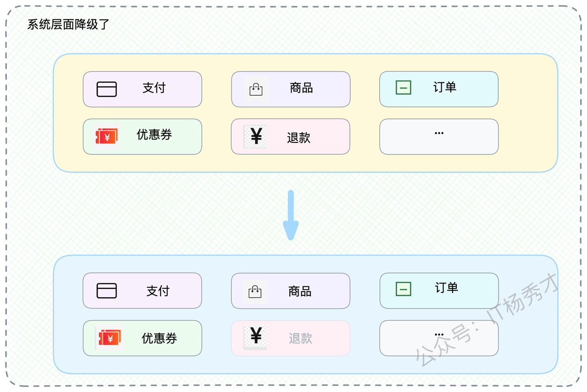

这种策略的好处是显而易见的：

1. 释放关键资源：将原本分配给退款等服务的计算资源，重新调配给面临巨大压力的订单和支付服务，确保资源用在最关键的地方。

2. 减轻下游压力：减少了对数据库等共享基础组件的写入压力。在大促期间，每一丝系统资源都弥足珍贵。

当然，如果你的观察视角仅限于"退款服务"本身，那么也可以认为它在该时间段内被"熔断"了，因为它完全不可用。这就引出了一个值得探讨的话题。

## 2. 降级与熔断的关联和区别

降级和熔断的关系十分紧密，但它们的设计哲学与应用场景又有着本质的不同。

两者都聚焦于两个核心问题：

* 触发时机：如何判定服务出现异常？在降级场景下，这个问题具体为"是否需要对该服务执行降级？"。

* 恢复策略：如何从异常状态中安全恢复？两者都必须谨慎处理"系统抖动"问题，防止在恢复的瞬间对系统造成二次冲击。

因此，在许多场景中，降级和熔断的决策是相互关联的。例如，当一个服务的响应时间急剧增加并超过预设阈值时，你可以选择"熔断"，即完全切断对该服务的调用；也可以选择"降级"，即提供一个经过简化的、性能开销更低的服务版本。

原则上，我们应该优先考虑降级，因为提供有损服务通常优于完全不提供服务。但某些场景无法实施降级，特别是涉及数据一致性的"写服务"。例如，一个接收前端数据并写入数据库的接口，其操作具有原子性，无法进行"降级"。

此外，如果你希望系统负载能以最快速度下降，那么"熔断"这种果断切断流量的方式，其效果要比"降级"这种"柔性"处理更为直接和迅速。

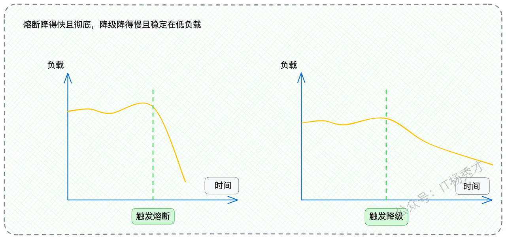

从技术实现的角度看，降级的策略和玩法远比熔断要丰富。毕竟，熔断是简单的"开"与"关"，而降级是如何"妥协"，其中的设计空间要大得多。

## 3. 降级的技术实现策略

既然降级的本质是"妥协"，那么具体有哪些实现方式呢？我们可以将其归纳为两大主流派系。

### 3.1 跨服务降级

其核心思想是"丢卒保车"。当系统整体资源紧张时，通过暂停或限制次要服务，将资源集中供给核心服务。前文提到的大促期间暂停退款功能，便是这一派系的经典应用。实施该策略的前提是，你必须对系统内所有服务的业务价值有清晰的界定和排序。

该派系的常见实现手段有三种，都相对直接：

1. 服务整体下线：例如，完全暂停退款服务。

2. 缩减服务实例：例如，一个服务部署了10个节点，暂时关停其中5个，将这5台服务器资源调配给核心业务使用。

3. 限制对下游资源的访问：例如，当日志中心写入压力过大时，可通知部分非核心服务暂停上传日志，转而将日志临时记录在本地。

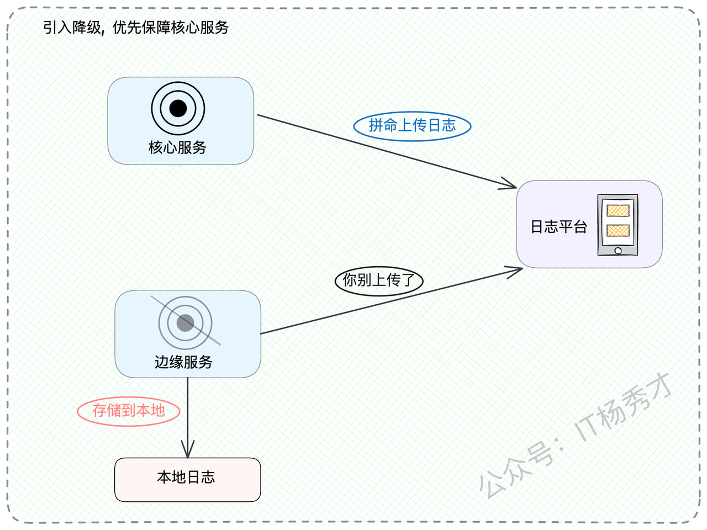

### 3.2 本服务降级（提供有损服务）

其核心思想是"降低服务质量标准"。服务本身依然可用，但提供的功能或数据有所简化。例如，各大App的首页信息流。

正常情况下，App首页会基于用户画像进行个性化推荐。但当推荐系统负载过高触发降级时，可能会切换为展示一个预先生成的、对所有用户都相同的"热门榜单"，甚至是一个纯静态页面。这样，虽然用户体验有所下降，但保证了页面的可用性。

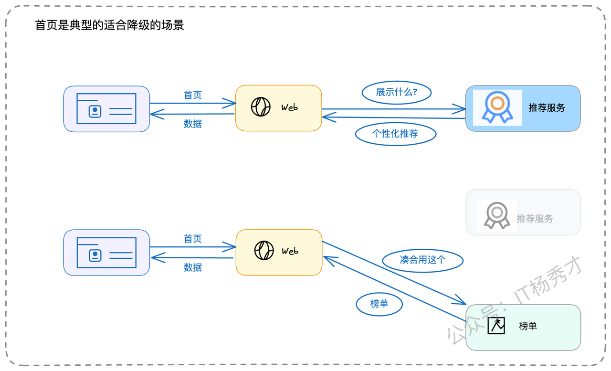

该派系的技术思路更加多样化：

* 返回默认值或兜底数据：这是最简单的降级方式。例如，获取用户等级信息失败时，直接返回"普通用户"作为默认值。

* 禁用非核心的可观测性组件：现代服务中通常集成了大量的监控和日志埋点，这些组件本身会带来性能开销。当系统达到瓶颈时，可以考虑暂时禁用或降低其采样率，优先保障核心业务逻辑的执行。

* 同步处理转异步处理：正常模式下，服务实时处理请求。降级后，可改为接收到请求后立即返回"处理中"的响应，并将实际任务放入消息队列，由后台消费者异步处理。

* 简化业务处理流程：如果一个请求的处理链路较长，其中某些非关键步骤（如内容发布后同步推送到搜索引擎），可以在降级时暂时跳过或转为异步执行，待系统恢复后再进行补偿。

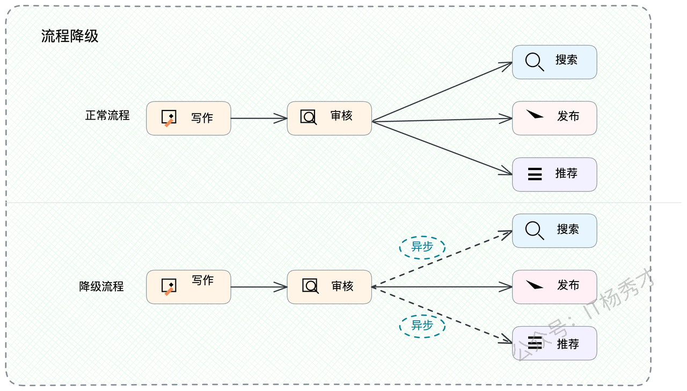

## 4. 如何在面试中展现你对降级的深度理解？

在面试之前，你需要对你所在公司的降级策略有全面的了解。

* 如果你公司有面向用户的产品（App或网站），去调研其核心页面的降级措施，弄清降级前后的逻辑差异。

* 梳理公司内部是否存在通过降级保护系统的实际案例，了解其触发条件、降级逻辑以及恢复机制。

即使这些方案并非由你亲手设计，只要你理解了其背后的前因后果和技术细节，就能将其转化为自己的知识储备。如果你负责的服务尚未实施任何降级措施，这正是一个绝佳的机会。主动为服务设计并引入降级能力，不仅能丰富你的项目经验，更能在实践中加深你对降级机制的理解。面试时，最佳策略是将"降级"作为你构建高可用系统方法论的一部分进行阐述。例如：

> "我负责的A系统是公司的核心系统之一，我的主要职责是保障其高可用性。为达成此目标，我综合运用了熔断、降级、隔离等一系列稳定性保障手段…"

当面试官的提问自然地转向这个话题时，你便可以展开详细的论述。那么，面试官可能会从哪些角度提出问题呢？

* 你对服务治理有何理解？

* 如何从架构层面提升系统的可用性？

* 当系统负载过高时，有哪些应对策略？

* 如何处理对下游服务或中间件的依赖故障？

这些问题覆盖的知识点是相通的。一个优秀的架构方案，本就是对这些基本原则的综合运用。为了让你能够给出更具亮点的回答，我为你准备了两个深度实践方案："读写分离场景下的写服务降级"和"快慢路径分离场景下的慢路径降级"。我强烈建议你理解这两个方案的精髓，并尝试结合自己的业务场景，构建出属于你的面试案例。

### 4.1 牺牲"写"服务，保全"读"服务

这个案例的核心思路是：当一个服务同时承载读、写两种功能，且读服务的重要性远高于写服务时，在资源紧张的情况下，可以果断地降级写服务，以全力保障读服务的稳定。

想象一个业务场景：我们提供一个商家后台服务，商家可以通过API录入其门店信息、上传商品图片等（写操作）。同时，我们还有一个面向C端用户的服务，用于展示商家录入的各种信息（读操作）。

在这个场景下，读服务的QPS（每秒查询率）和业务重要性都远超写服务。

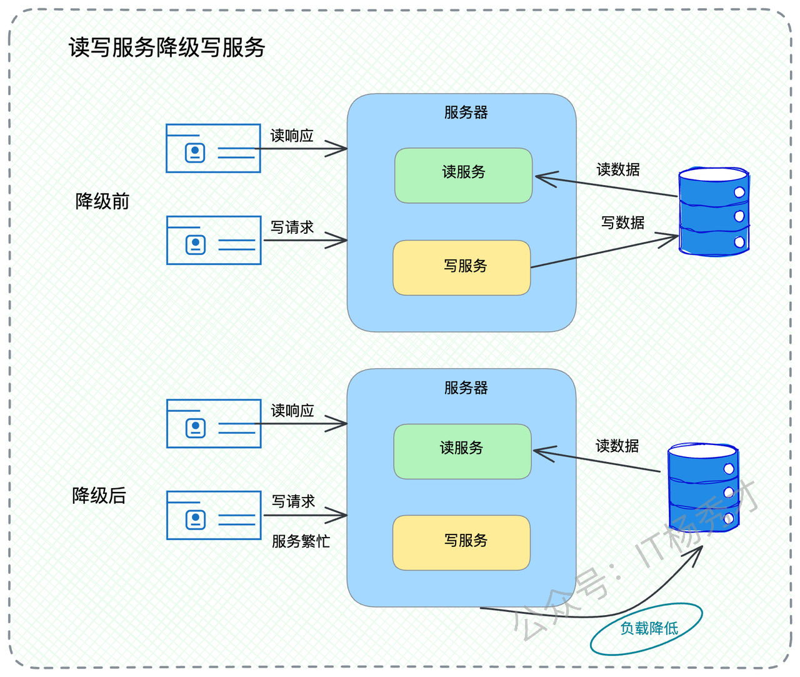

如果这两个服务合并部署在同一组资源上，当系统需要降级时，一个非常有效的策略就是：暂时关闭对商家开放的"写"接口，将全部计算资源用于支撑C端用户的"读"接口。

你可以这样向面试官阐述这个方案：

> "在我之前负责的一个服务中，其API可以分为两类：一类是供B端商家使用的数据录入接口，另一类是供C端用户使用的数据展示接口。从业务角度分析，读服务的重要性及并发量远超写服务。"
>
> "为此，我设计并接入了一套跨服务的动态降级策略。通过监控读服务的响应时间，当其超过预设阈值或出现持续上升趋势时，降级开关会自动触发。此时，所有针对B端商家的写操作接口会临时关闭，并向调用方返回'系统繁忙'的响应。这样，节省下来的服务器资源可以完全用于支撑C端用户的查询请求，从而保障核心用户的体验。对于B端商家而言，只是暂时无法更新数据，这种短期影响是可接受的。当C端接口的性能指标恢复正常后，B端接口会自动恢复服务。"

为了让你的回答更具深度，你还可以从数据库性能的角度进一步深化：

> "此外，该策略还能显著降低数据库的压力。虽然写服务的请求量占比不高，但单次写操作对数据库的负载远高于读操作。因此，暂停写服务能有效缓解数据库的压力，为整个系统的稳定性提供更多保障。"

这个方案具有很强的通用性：

* 内容平台：创作者生产内容（写），用户消费内容（读）。资源不足时，可优先降级内容发布功能，保障用户的浏览体验。

* 用户分级服务：如果系统同时服务于普通用户和VIP用户，在极端情况下，可以暂时降低对普通用户的服务标准，全力保障VIP用户的服务质量。

阐述完方案后，记得进行理论层面的总结和拔高：

> "这个方案本质上是一种基于业务优先级的跨服务降级。其核心原则是在合并部署的场景下，根据业务价值对服务进行分级。例如，B端和C端服务中，优先降级B端；付费和免费服务中，优先降级免费服务。我们可以将部署在同一节点上的不同服务划分出优先级，在触发降级时，从低优先级的服务开始'牺牲'，将资源动态地调配给高优先级的核心服务。"

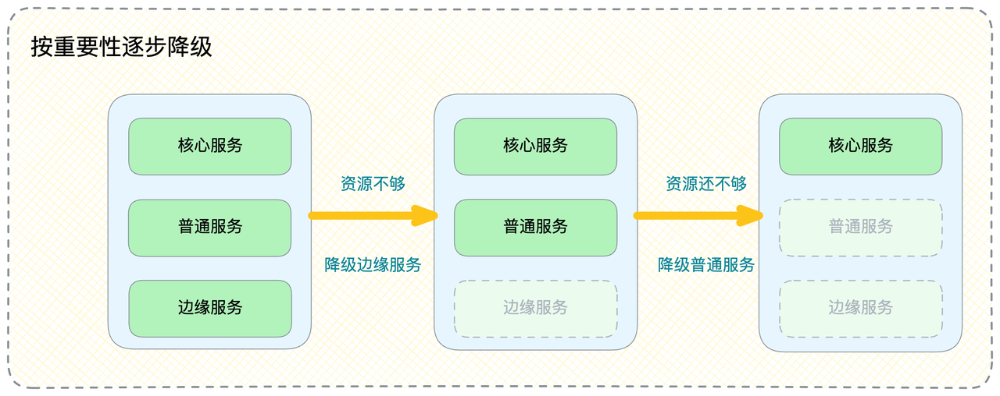

此时，面试官可能会追问："你如何判断一个服务的业务价值？" 你可以自信地回答：

> "判断业务价值最直接的依据是其与公司核心商业模式的关联度。通常，越接近公司主要营收来源的服务，其业务价值就越高。当然，也存在特例，例如与'合规'相关的服务，如内容审核。它本身是成本中心，但其重要性极高，无论如何都不能轻易降级，否则可能导致严重的合规风险。"

如果你对微服务架构有更深入的研究，还可以进一步展示你的技术视野，关键词是"跨节点资源调度"：

> "需要指出的是，我刚才描述的降级策略大多适用于部署在同一资源节点上的服务。对于物理上分离部署的服务，实现跨服务的动态资源调配则更具挑战性，通常需要人工介入，例如在大促时手动关停整个退款服务集群。"
>
> "从理论上讲，API网关是实现这种全局性、跨节点服务降级的理想位置。例如，网关在监测到核心服务A的资源紧张时，可以自动缩减次要服务B的实例数量，并利用释放出的资源对服务A进行扩容。遗憾的是，目前主流的开源网关和微服务框架，其内置的降级功能大多聚焦于单体服务的本地降级（如返回默认值），很少提供这种全局资源调度的复杂能力。"

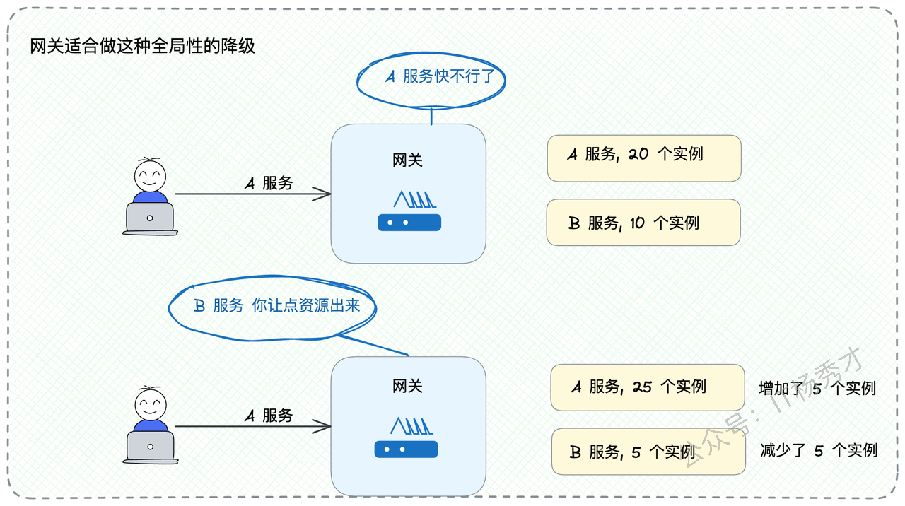

（请注意：最后对网关的评价可能会将讨论引向网关的技术细节，请确保你对此有充分准备。）

### 4.2 分离快慢路径，降级"慢"路径

在探讨熔断时，我曾举过一个例子：如果缓存（如Redis）崩溃，应立即熔断对数据库的访问，以防止流量洪峰直接打垮数据库。

其实，运用"降级"策略来处理此场景，可以实现更为精细的控制。常规的数据查询逻辑是"缓存-数据库"模式：先查询缓存，如果缓存未命中，再查询数据库。基于此，我们可以设计如下降级策略：

当系统触发降级后，请求只允许查询缓存。如果缓存未命中，则直接返回失败或兜底数据，不再继续访问数据库。

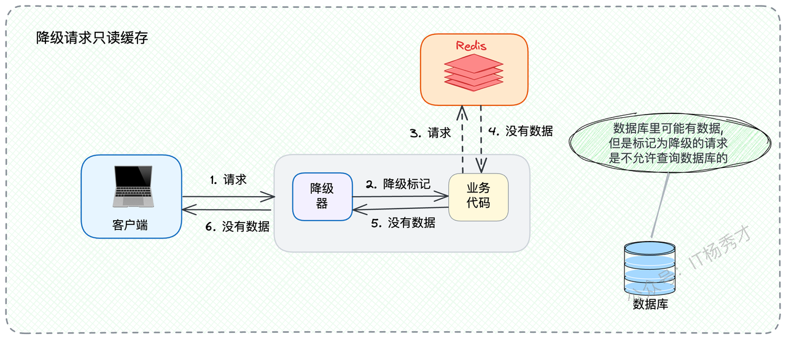

这个方案背后的逻辑，源于对请求处理路径的"快慢"分离。

* 快路径：直接从缓存读取数据。这个过程非常高效，能支撑极高的QPS。

* 慢路径：穿透到数据库进行查询。这个过程相对耗时，且极度消耗系统资源。

系统的性能瓶颈，往往就出现在"慢路径"上。少数缓存未命中的请求，可能会占据大部分系统资源，从而导致整体服务性能的急剧恶化。

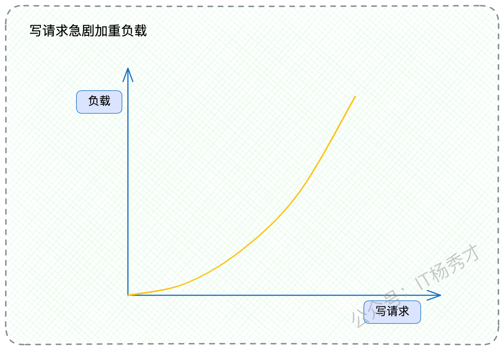

因此，你可以这样向面试官介绍该方案，关键词是"只读缓存"：

> "我还实践过另一种降级方案，主要应用于重度依赖缓存的查询服务。正常模式下，业务逻辑是'先查缓存，后查数据库'。但在系统并发压力达到临界点时，我会启用降级策略。此时，所有请求被标记为'降级请求'，它们将只查询缓存。如果缓存未命中，服务会直接向客户端返回一个预设的友好错误提示或兜底数据，而不会继续访问数据库。这种方式能有效防止因少量缓存穿透请求而引发的系统雪崩，在高压下极大地保障了系统的核心吞吐能力和响应速度。"

同样，在介绍完案例后进行总结和提炼，关键词是"快慢路径分离"：

> "这种设计思路，本质上是'快慢路径（Fast/Slow Path）'设计模式的一种应用。如果一个服务的处理逻辑可以被清晰地划分为'快路径'和'慢路径'，那么在降级时，我们就可以通过牺牲'慢路径'来保全'快路径'。在刚才的例子中，从缓存加载数据就是快路径，而从数据库加载数据就是慢路径。"
>
> "慢路径的形式多种多样，例如发起复杂的跨服务RPC调用、执行耗时的计算任务等。通过在降级时果断放弃慢路径，我们能以'有损服务'为代价，换取系统整体更高的吞吐量和稳定性。尽管部分用户会收到非预期的响应，但这远比整个系统崩溃的后果要好。"

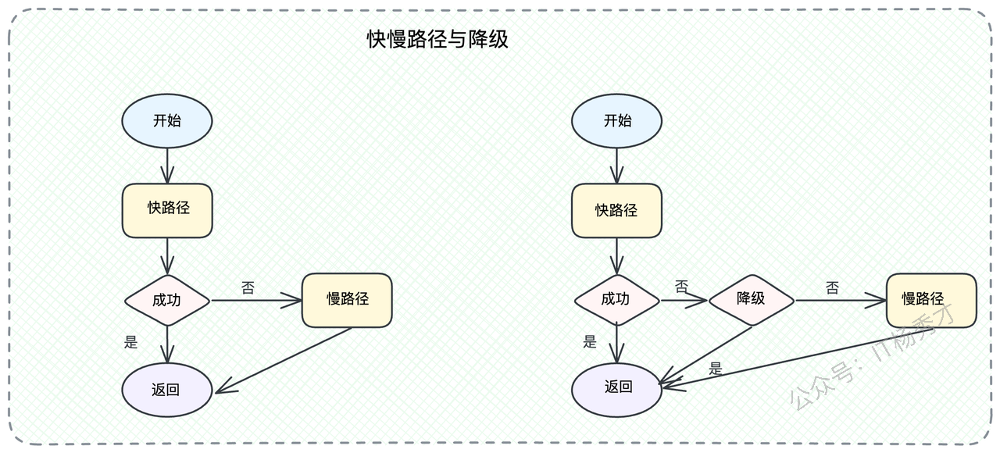

这个思路可以广泛应用于任何存在下游依赖的场景。当任何下游服务或第三方中间件出现故障时，你都可以通过降级，暂时切断对这些故障点的调用，从而保证自身服务的核心功能可用。

如果你选择这个方案作为阐述的亮点，那么话题很可能会自然地延伸到缓存相关的技术上，此时你便可以展示你在这方面的知识储备。

## 5. 小结

今天，我们对"服务降级"进行了系统性的探讨。降级与熔断关系密切，但它更体现为一种"有策略的妥协"。你需要牢记，无论是跨服务降级还是本服务降级，其根源都在于对业务价值的精准识别与排序。架构师的职责，就是在关键时刻，能做出正确的取舍，果断地"牺牲"次要部分，来"保障"核心部分。

最后，提供给你的两个实践方案——"读写服务降级写服务"和"快慢路径降级慢路径"，希望你能吸收其设计精髓，并结合自己的业务背景，构建出属于你的、独一无二的降级案例。

请记住，提供的这些方案都具备在企业内部落地的可行性。纸上得来终觉浅，绝知此事要躬行。有机会一定要在真实环境中去思考和实践。 

# 资料分享
随着AI发展越来越快，AI编程能力越来越强大，现在很多基础的写接口，编码工作AI都能很好地完成了。并且现在的面试八股问题也在逐渐弱化，**面试更多的是查考候选人是不是具备一定的知识体系，有一定的架构设计能力，能解决一些场景问题**。所以，不管是校招还是社招，这都要求我们一定要具备架构能力了，不能再当一个纯八股选手或者是只会写接口的初级码农了。这里，秀才为大家精选了一些架构学习资料，学完后从实战，到面试再到晋升，都能很好的应付。**关注秀才公众号：IT杨秀才，回复：111，即可免费领取哦**

## **学习交流**

> 如果您觉得文章有帮助，可以关注下秀才的<strong style="color: red;">公众号：IT杨秀才</strong>，后续更多优质的文章都会在公众号第一时间发布，不一定会及时同步到网站。点个关注👇，优质内容不错过

