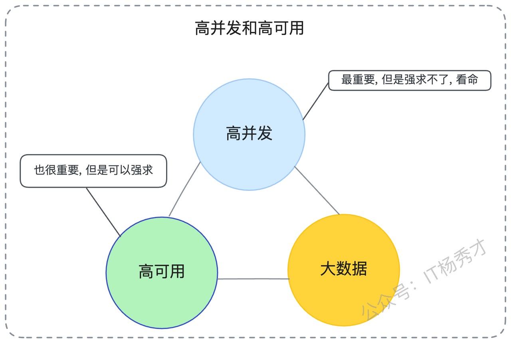
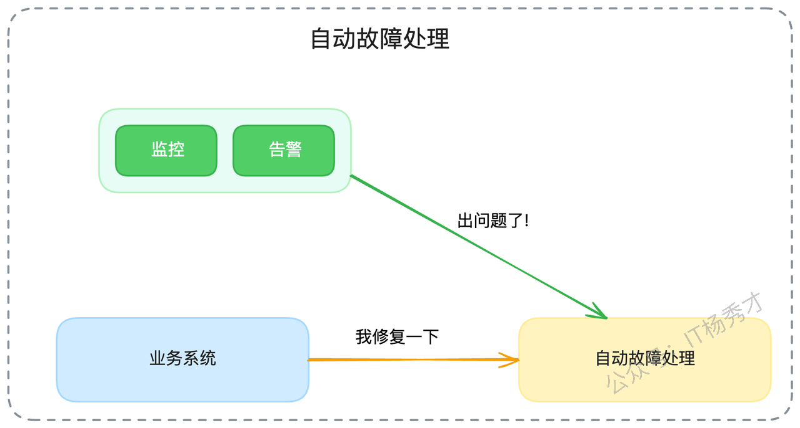
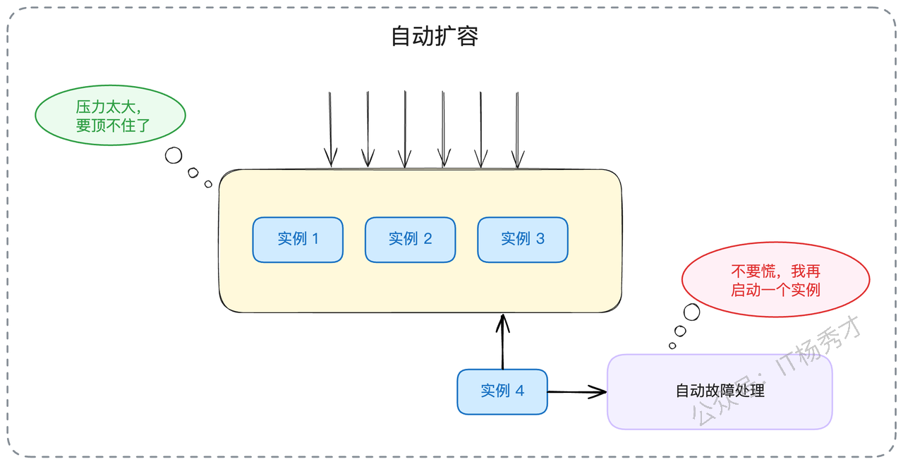

本章我们来探讨一个综合性但至关重要的话题：给你一个微服务应用，你该如何系统性地保证其高可用性？

在互联网技术岗的面试中，高并发、高可用和大数据通常被视为衡量候选人经验的三大黄金标准。但说实话，是否拥有真正的高并发和大数据项目经验，往往带有一些"运气"成分。如果你不是在头部大厂的核心业务部门，确实很难接触到那种动辄千万QPS或PB级数据的真实场景。

然而，高可用则完全不同。它是一种普适性的工程能力。即便你维护的系统月活只有一万人，你依然可以、也应该将它打造成一个高可用的系统。因此，相比于另外两者，**高可用是我们可以在面试中主动出击、重点发力的方向**。

当然，我们也必须清醒地认识到，一个淘宝量级的系统所谈论的高可用，和一个简单的后台管理系统的高可用，其技术复杂度和含金量是截然不同的。但话又说回来，又有多少人真的有机会去亲手构建淘宝那样的项目呢？所以，如果你正苦于如何将自己看似平凡的项目经历讲出亮点和深度，那么今天的内容，希望能为你提供一套行之有效的思路和话术。

## 1. **高可用的基石：四大核心原则**

在开始构建我们的高可用体系之前，我们首先要理解其内涵。我们通常使用SLA（Service Level Agreement，服务等级协议）来衡量可用性，并用"N个9"来表示。例如，当我们说一个服务的可用性是"3个9"，即99.9%，意味着在一年（365天）的时间里，该服务的不可用时间不能超过8.76小时。

那么，如何才能构建一个高可用的系统呢？其核心思想可以归结为四大原则：

* **容错设计 (Design for Failure)：**接受失败是常态，并为此进行设计。

* **故障域隔离 (Blast Radius Limitation)：**限制故障的影响范围，避免雪崩。

* **快速响应 (Fast Detection & Recovery)：**快速发现故障，并快速从中恢复。

* **规范化变更 (Standardized Change Process)：**控制由变更引入的风险。

### 1.1 **容错设计 - 优雅地"凑合"**

容错的核心理念是：无论系统中发生了什么意想不到的故障，你的系统整体上依然能够为用户提供服务，哪怕是降级后的、有损的服务。用一句通俗的话讲，就是"凑合着用"。

就像一辆自行车，如果掉了一个轮子，一个优秀的骑手会立刻把它当成独轮车来骑，而不是直接瘫倒在地。我们的系统也应该具备这种能力。

系统中的故障源多种多样，可能来自你的服务本身、你依赖的其他服务，也可能来自底层的硬件和软件基础设施。在面试中，最重要的是描述如何保证**你自己的服务**在遇到故障时，不会拖垮整个系统。

其次，你需要考虑当**软件基础设施**（如Redis、MySQL、消息队列）出问题时，你的服务该如何自处。这里主要有两个层面的思考：

1. **采用高可用方案**：在公司内部，优先使用基础设施的高可用部署方案。例如，使用Redis Cluster或云厂商提供的多可用区Redis实例，而不是单机Redis。

2. **设计兜底容错手段**：做好最坏的打算。比如，我们之前讨论过，如果Redis集群整体崩溃，你的服务可以通过限流来保护后端的数据库不被瞬间涌入的流量打垮，保证核心功能可用。

至于硬件故障和第三方供应商故障，除了上一讲提到的特殊场景外，在常规面试中出现频率较低，我们在此不作过多展开。容错设计的核心在于接受不完美，但无论你怎么容错，故障终究还是会发生。当它真的发生时，我们就需要第二个原则来发挥作用。

### 1.2 **故障域隔离 - 将火势控制在最小范围**

限制故障影响范围，或者说"缩小爆炸半径"，指的是万一故障真的发生了，我们要尽一切可能减轻它所带来的负面影响。这个影响范围可以从三个维度来考量：造成的业务损失更小、被影响的用户数量更少、被波及的其他关联组件更少。

而**限制影响范围的最佳策略，就是隔离**。微服务架构本身就是一种隔离思想的体现，它将一个复杂的单体系统，按业务领域划分成多个独立的服务。在服务内部，我们还可以进一步细分核心模块与非核心模块、核心服务与非核心服务，尽可能降低它们之间的耦合和相互影响。

然而，在实践中，想要做到彻底的隔离，通常面临两大现实难题：

* **服务间的强依赖**：这种依赖一部分源于业务逻辑本身的复杂性，另一部分则源于不合理的架构设计。我们可以通过优化设计来解耦（比如后面会提到的异步化改造），但不可能做到完全没有依赖。

* **共享基础设施**：理论上，只要资金允许，我们可以为每一个服务都提供一套完全独立的数据库、缓存和消息队列。但现实是，大部分公司出于成本考虑，连多部署一套Redis集群都可能犹豫再三。因此，我们经常听到某某公司因为一个非核心业务的错误操作，拖垮了共享的数据库，导致全站核心业务崩溃的惨痛事故。

在做好了隔离，限制了故障影响范围之后，下一步就是如何快速地从故障中恢复。

### 1.3 **快速响应 - 发现与恢复的速度之战**

**快速发现**，强调的是建立一套完备的、全方位的观测（Observability）和告警（Alerting）系统。观测的对象不仅包括服务本身，更要覆盖它所依赖的各种基础设施和第三方服务。尤其是在核心业务链路上的每一个依赖点，都需要进行无死角的观测。而**没有告警的观测是没有灵魂的**，设置合理、精准、分级的告警，是快速发现问题的前提。

**快速恢复**，则旨在尽可能缩短服务的不可用时间（MTTR - Mean Time To Recover）。但这与其说是一个纯粹的工程技术问题，不如说是一个**组织建设和自动化**的问题。它要求每个技术团队都需要有24小时的On-Call（值班）机制。但更深层次的挑战是，你不可能要求每一个值班人员都对组内所有项目的技术细节了如指掌。很多时候，告警响了，值班人员却不知道如何处理，或者不敢处理。

因此，要想真正做到快速修复，**不能仅仅依赖于研发人员的个人能力和自觉性，而必须依赖于自动化的故障处理机制**。这一点我们稍后会详细介绍。

### 1.4 **规范化变更 - 敬畏每一次上线**

统计数据表明，线上绝大多数的故障都是由"变更"引起的。因此，规范变更流程，指的是任何人都不能随意地发布新版本，也不能随意地修改生产环境的配置。任何一个变更，都必须经过严格的审查（Review），并准备好详尽的回滚预案。

在实践中，我们最害怕的场景莫过于：系统原本运行得好好的，但为了修复一个非紧急的Bug或者上线一个小功能，在没有充分测试的情况下就匆忙发布，结果不仅老问题没解决，还引入了新的、更严重的问题，导致系统崩溃。

因此，建立一套完善的变更流程，是大幅提升系统可用性的关键举措。但这和快速修复一样，很大程度上也是一个组织管理和文化建设的问题。

## 2. **面试攻略**

### 2.1 **如何打造你的高可用故事线**

在面试前，你需要围绕你最熟悉的项目，准备一个从前端到后端、全方位、系统性的高可用方案。你需要仔细思考并能清晰阐述以下几个环节：

* **入口防护**：面向前端用户的接口，是否有限流、防刷等措施，以防止恶意攻击者将系统搞垮？

* **依赖高可用**：你所依赖的第三方组件，包括缓存（Redis）、数据库（MySQL）、消息队列（Kafka）等，是否都采用了高可用的部署方案？

* **依赖故障容错**：如果你依赖的某个第三方组件（如Redis）整体崩溃了，你维护的服务会发生什么？整个系统是否还能对外提供有损服务？

* **服务间治理**：你的所有服务之间，是否选择了合适的负载均衡算法？是否全面实施了熔断、降级、限流和超时控制等治理措施？

* **流程规范**：你所在公司的上线流程、配置变更流程是怎样的？你认为这些流程对系统可用性产生了哪些影响？

接下来，我将为你提供一套非常全面的高可用改造话术模板。你要做的，就是根据你的真实项目经历，对这套模板进行个性化的改造，并用你自己的语言重新组织。

我在这里使用的都是一些比较普适的例子，这意味着即使你在中小型企业，也能找到可以借鉴的地方。但如果你在头部大厂，有机会接触到像全链路压测、混沌工程、故障演练等更高级的高可用方案，你应该优先使用那些更亮眼的例子。

**强烈建议你在面试前，将整个故事线写下来并反复演练。面试讲究的是有备无患，千万不要寄希望于自己的临场发挥。**

最佳的面试策略，就是在自我介绍时就主动抛出引子，例如提到自己在"高可用微服务架构"方面的丰富经验，然后在介绍项目时，着重展示你在入职后，是如何大幅度提高了系统的可用性。之后，面试官大概率会顺着你的话，详细追问这个项目以及你是如何做的。这时，你就可以从容地展开下面的故事线了。

**故事线构建**整个思路可以拆解成五个步骤:

> **发现问题 -> 规划方案 -> 落地实施 -> 成果展示 -> 持续改进**

并且通过"发现问题"和"取得效果"这两个环节的前后对比，来有力地凸显你在这个过程中的核心作用和价值。

#### 2.1.1 **第一步：发现问题（描绘"过去时"）**

这个部分由"项目的核心挑战"、"挑战的具体体现"和"问题的根源分析"三部分组成。

> "我之前负责的XX业务，是我们公司的核心变现业务，因此它的核心挑战就是必须保证极高的可用性。但在我刚入职的时候，我发现这个系统的可用性是比较低的，稳定性问题频发。举个例子，我入职的第一个月，就经历了一次比较严重的线上故障：当时另一个业务组突然上线了一个新功能，里面包含了大量的Redis大Key操作，导致我们共享的Redis集群响应变得非常慢，最终拖垮了我们的核心服务，造成了长时间的业务中断。"
>
> "这次故障之后，我牵头做了一次深入的复盘和调研。我总结下来，系统可用性之所以不高，主要有三个根源性的原因："
>
> 1. **"首先，是缺乏有效的监控和告警。** 这导致我们很多时候都是'瞎子'，难以在第一时间发现问题；即便发现了，也因为信息不足，难以快速定位问题；最终导致难以高效地解决问题。"
>
> 2. **"其次，是服务治理体系的缺失。** 服务之间调用混乱，缺乏熔断、限流等保护机制，导致任何一个非核心服务出现故障，都可能像推倒多米诺骨牌一样，引发整个系统的雪崩。"
>
> 3. **"最后，是缺乏合理的变更流程。** 我们每次复盘线上事故时，回过头看，都觉得如果当时能有一个更严谨的上线和变更流程，那么大部分事故其实都是可以避免的。"

#### 2.1.2 **第二步：规划方案（展现"蓝图"）**

这里有一个常见的误区：你在现实中可能确实做过类似的事情，但往往是"东一榔头，西一棒槌"，缺乏系统性规划。但在面试时，你必须将这些零散的工作，组织成一个非常有条理、有计划的整体方案。

你要给面试官留下的印象，不仅仅是"你能解决问题"，更是"你能有章法、有策略地解决复杂问题"。

> "针对上面分析出的这几个具体痛点，我制定了一套分阶段、可落地的可用性改进计划，主要分成了以下几个步骤："
>
> 1. **"第一步，补齐短板：引入全方位的监控与告警。** 这是所有工作的基础，目标是让我们具备快速发现和定位问题的能力。"
>
> 2. **"第二步，构建防线：引入全套的服务治理措施。** 这一步是为了提高服务本身的健壮性，并有效隔离不同服务间的故障影响。"
>
> 3. **"第三步，加固地基：为所有第三方依赖引入高可用方案。** 这一步是为了从根源上减少由外部依赖不稳所带来的风险。"
>
> 4. **"第四步，核心隔离：拆分核心业务与非核心业务的共同依赖。** 这一步是为了进一步提高核心业务的可用性，确保在极端情况下，核心功能不受非核心业务的拖累。"
>
> 5. **"第五步，规范流程：推动建立标准化的变更流程。** 这一步是为了从制度上，降低因人为变更而引入Bug的可能性。"

#### 2.1.3 **第三步：落地实施（讲述"进行时"的挑战与思考）**

接下来，你需要详细讲述方案的落地过程。在讲述时，要补充技术细节，同时也可以巧妙地掺杂一些在落地过程中遇到的真实痛点和阻力，这会让你的陈述显得更加真实可信。

> "在**第一个步骤**中，就监控告警来说，我们不仅为所有业务服务都添加了核心业务指标的监控和告警，还为所有的第三方依赖，比如数据库、Redis和消息队列，都增加了基础设施层面的监控。在告警方面，我们综合考虑了告警的频率、分级和通知方式，并不断优化告警信息的内容，确保信息的充足性，以减少误报和"告警疲劳"。这个过程本身技术难度不高，但非常琐碎，需要我们一个链路一个链路地去梳理，一个业务一个业务地去查漏补缺。"
>
> "在**第二个步骤**中，服务治理的范围比较广，我主导引入了包括限流、熔断、降级、超时控制、线程池隔离在内的一整套方案。"
>
> "**第三个步骤**在推行时，遇到了一些阻力。主要是因为大部分第三方依赖的高可用方案，都需要额外的资源投入。比如，我们最开始使用的Redis就是一个单机实例，后面我推动改造成Redis Cluster时，就需要申请更多的机器实例，这需要和领导以及运维团队进行多轮的沟通和成本效益分析。"
>
> "**第四个步骤**，拆分共同依赖，也是执行得不彻底。我们目前的策略是，所有新上线的核心业务，都会使用独立的数据库和Redis集群。但是对于一些历史悠久的老核心业务，由于改造成本巨大，目前还是维持原状，共享基础设施。"

你可能发现了，我在谈到第三和第四点时，都坦诚地表示执行得并不完美。这会给面试官留下不好的印象吗？

恰恰相反。因为我陈述的，基本都是任何一个工程师在真实工作中都会遇到的困难，面试官能够理解。另一方面，一个方案不可能十全十美，适当地暴露一些问题和妥协，能够极大地增强你整个故事的说服力。

> "**第五个步骤**则有些特殊，它取决于我在公司的角色和影响力。在我还是一个普通工程师的时候，我主要是通过技术分享、故障复盘等方式，多次向领导和团队**建议**建立更规范的流程。后来，随着我在团队中承担的责任越来越重，我就直接**推动**并和大家一起制定了新的上线规范，包括详细的上线Checklist、Code Review流程以及必须具备的回滚计划等等。"

#### 2.1.4 **第四步：取得效果（量化"完成时"的价值）**

既然我们讨论的是可用性，那么你取得的效果，最直接的体现就是可用性指标的提升。一般来说，我建议你说可用性达到了"3个9"，而不是"4-5个9"，因为后者对于绝大多数系统来说，都有些过于夸张了。

> "经过这一系列组合拳的改进之后，我所维护的核心服务的可用性，从原来估算不足'两个9'，稳定提升到了'三个9'以上。最直观的感受是，半夜被电话告警叫醒的次数显著减少了。"
>
> "或者，你也可以用一种更幽默的方式来回答："
>
> "现在我们团队的Bug复盘会上，我已经不再是那个经常挨骂的人了，更多时候是坐在下面，看着别人挨骂了（笑）。"
>
> "同时，你还可以补充一下，系统中超出你影响力范围的部分，可用性依然有待提升："
>
> "不过，我的服务还依赖于一些其他团队提供的服务，而他们的服务可用性还是比较差。对此，我这边只能是尽量做好容错，比如在他们服务不可用时，提供有损服务。后续要想进一步提高我们业务的整体可用性，还是得推动他们一起去提升。"

#### 2.1.5 **第五步：后续改进（展望"将来时"）**

最后，你需要补充一下你对未来的改进计划。一般来说，改进计划都是针对现有方案的缺点和不足。

> "目前，我的服务，尤其是一些历史遗留的老服务，相互之间还是在共享一些基础设施。比如，一个出问题就很容易牵连其他服务。所以我后续的一个重要规划，就是进一步将这些老服务进行解耦，特别是要推动将它们依赖的数据库实例进行拆分，省得因为别的业务组一条慢SQL，就牵连到我的核心业务。大家一起用一个东西，出了事，有时候连责任都很难界定清楚。"

讲述改进方案有一个好处，就是它还没有实施，你可以大胆地讲，什么高大上、什么代表了未来的方向，你就可以讲什么，以此来展现你的技术视野。

### 2.2 **亮点方案：从优秀到卓越的进阶策略**

掌握了上述的面试基本思路，你基本上就能给面试官留下一个相当不错的印象了。在这里，我再额外补充一些可以让你脱颖而出的亮点方案，你可以选择其中一两个，来进一步强化你在面试官心目中的专家形象。

#### 2.2.1 **异步化/解耦 - "少做不错，不做不错"**

这个方案的核心思想是：仔细梳理你的业务流程，将其拆分成"必须同步执行成功的关键路径"和"可以异步执行的非关键路径"。

比如，在一个简单的创建订单的场景中，"扣减库存"、"创建订单"、"调用支付"这几个步骤，是必须同步执行成功的核心路径。但是，另外一些步骤，比如"给用户发一封下单成功的邮件通知"、"为用户增加本次购物的积分"，这些就属于非关键路径，它们允许延迟，甚至单次失败后重试。

因此，在设计高可用微服务时，有一个重要的原则：**能够异步执行的，绝对要异步执行；能够解耦的，必须想办法解耦。**

这种理念，用一句朴素的话来形容就是："多做多错，少做少错，不做不错"。你同步执行的步骤越少，你的主流程就越稳定，可用性自然就越高。

> "在完成了基础的服务治理之后，我还全面推行了核心业务的异步化和解耦改造。我将核心业务的逻辑，与产品经理一起，一个一个地重新梳理，最终将所有核心业务流程中，能够异步执行的步骤，全部改造成了异步执行。这样一来，我的业务中，需要同步执行的关键步骤就大大减少了。而后续异步执行的动作，即便失败了，我们也可以通过消息队列的重试机制来保证最终成功，所以整个系统的可用性都得到了大幅度的提升。"
>
> "具体的实现方式是，在核心的A步骤成功执行之后，我们不再直接调用B步骤，而是发送一条消息到消息队列。然后由另一个独立的消费服务来监听消息，并执行B步骤。"

#### 2.2.2 **自动化故障处理 - 迈向"四个9"的关键**

严格来说，我们前面提到的熔断、降级、限流，也属于自动化的故障处理。但我这里说的是，构建一个独立的、更高维度的系统，来自动处理业务系统发生的各类故障。

一个线上问题，从被发现，到找到临时应对方案，再到付诸实施，一不留神一个小时就过去了。所以在可用性达到"三个9"以后，如果你还想进一步提升，就要么想办法降低事故发生的概率，要么想办法无限提高故障恢复的速度。

人本身不可能做到24小时精神高度紧张地待命，也不可能对所有系统细节都了如指掌。所以，**自动化故障处理机制，是通往"四个9"甚至更高可用性的必经之路。**

这里，我给你一个最常见的例子：**微服务集群自动扩容**。它是指，对整个微服务集群的负载进行实时监控，如果发现集群整体负载过高，就自动增加新的服务实例。

> "为了进一步提高整个集群服务的可用性和弹性，我跟运维团队进行了密切合作，共同设计并实现了服务的自动扩容机制。我们允许不同的业务方，根据自己服务的特性，设置不同的扩容触发条件。比如，我为我的核心服务设置了'CPU使用率'和'内存使用率'两个组合指标。如果我这个服务的所有节点，在持续一段时间内，平均CPU使用率都超过了90%，那么就会自动触发扩容，每次扩容会新增一个节点，直到负载降到安全水位以下。"

这里我用的例子，决策理由也比较简单。CPU使用率长期处于高位，基本上代表节点处于高负载状态。并且，我特意强调了是"集群里面的**所有节点**都超过了某个指标"，这是为了防止因为负载均衡不均，导致单一节点过载而引起不必要的扩容。

还有一些常见的自动化故障处理方案，你可以参考：

* **自动修复数据**：通过定时任务，比对不同系统或表中的数据，如果发现数据不一致，就发出告警，并同时触发预设的自动修复程序。

* **自动补发消息**：也是通过定时任务等机制，来扫描业务状态，如果发现某个业务流程因为消息丢失而卡住了，就触发告警，并自动进行消息补发。

但凡你的业务中，存在大量需要人工介入处理的数据不一致或流程中断问题，你都应该思考，是否可以设计一个自动化的恢复程序，去自动地发现和修复它们。

## 3. 小结

这篇文章我们系统性地探讨了如何保证微服务应用高可用的综合性方案。当然，这里给出的整个话术和方案，是一个"框架"，面试的时候你需要根据你的实际项目经验，来填充血肉。业界有非常多的高可用方案，你可以多学习几种，将它们内化成你自己的知识体系，并整合进你的面试方案里。

同时，你也不需要掌握全部的高可用方案，因为实在太多，学不过来。你只需要重点掌握几种，然后在面试的时候，学会主动引导和把控面试的节奏，将面试官的提问，巧妙地限制在你所了解和擅长的那几种方案上，就足够了。

# 资料分享
随着AI发展越来越快，AI编程能力越来越强大，现在很多基础的写接口，编码工作AI都能很好地完成了。并且现在的面试八股问题也在逐渐弱化，**面试更多的是查考候选人是不是具备一定的知识体系，有一定的架构设计能力，能解决一些场景问题**。所以，不管是校招还是社招，这都要求我们一定要具备架构能力了，不能再当一个纯八股选手或者是只会写接口的初级码农了。这里，秀才为大家精选了一些架构学习资料，学完后从实战，到面试再到晋升，都能很好的应付。**关注秀才公众号：IT杨秀才，回复：111，即可免费领取哦**

## **学习交流**

> 如果您觉得文章有帮助，可以关注下秀才的<strong style="color: red;">公众号：IT杨秀才</strong>，后续更多优质的文章都会在公众号第一时间发布，不一定会及时同步到网站。点个关注👇，优质内容不错过

