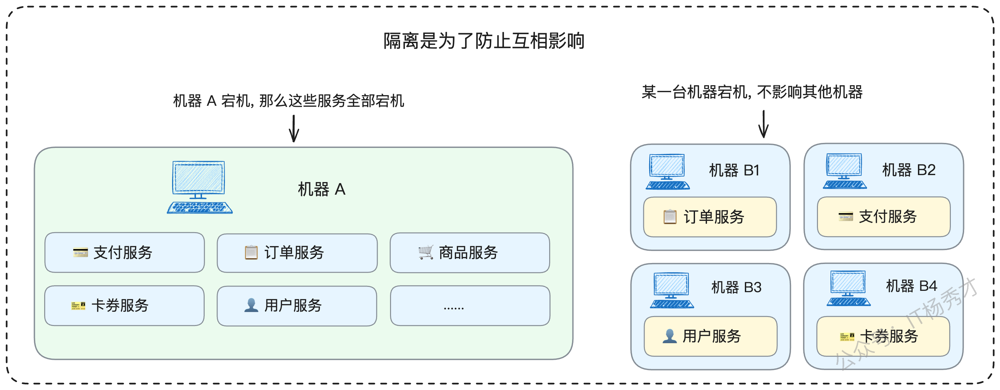
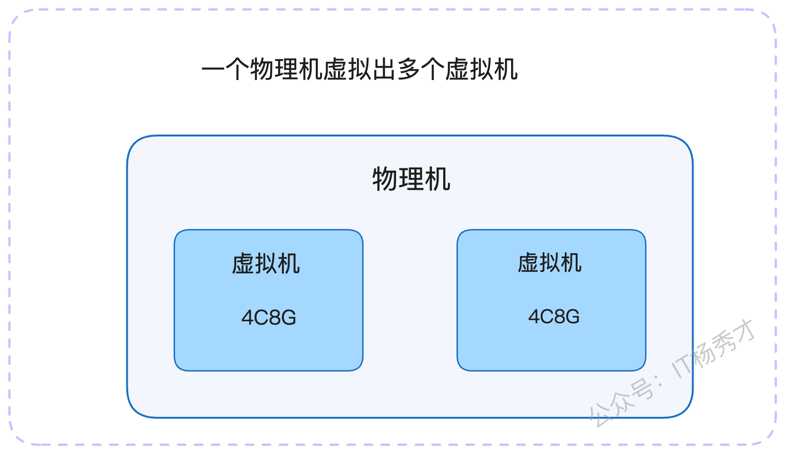
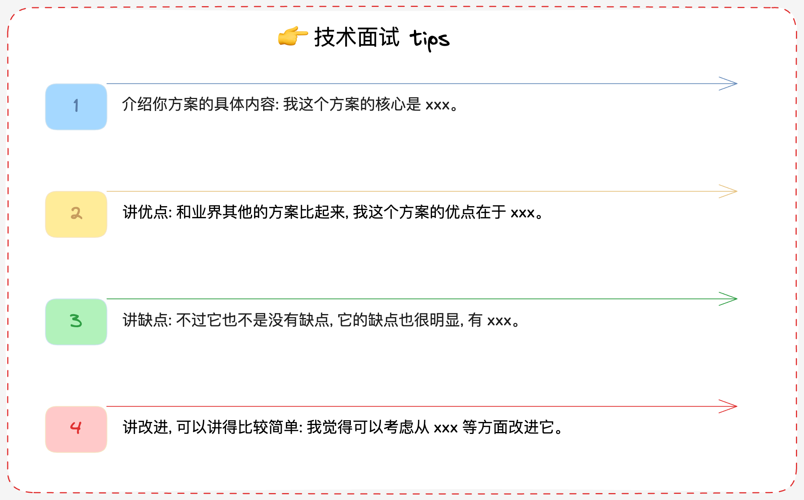

在微服务架构的稳定性“三板斧”——熔断、降级、限流之外，还潜藏着一位“幕后英雄”，那就是“隔离”。相较于前三者在面试中的高频出镜，隔离似乎显得有些“低调”。

究其原因，隔离策略在许多中小型项目中应用场景有限，不像限流那样几乎是每个系统的标配。然而，对于构建真正高可用、高性能的复杂系统而言，隔离是不可或缺的关键一环。它就像是系统中的“防火墙”，在故障发生时，能够将影响范围牢牢控制在预设的边界之内，避免火烧连营。

想象一下，我们为VIP用户和普通用户提供了不同的服务集群。当普通用户的集群因为流量洪峰或程序Bug出现问题时，VIP用户的使用体验却丝毫不受影响，依旧流畅如初。这就是隔离的魅力所在。尤其是在那些业务逻辑复杂、服务规模庞大的核心系统中，隔离机制更是生死攸关。否则，任何一个微小的故障都可能被无限放大，最终导致整个系统的雪崩。

今天，就让我带你深入探索隔离技术在真实业务场景中的各种应用形态，并剖析两个极具参考价值的实战方案。

## 1. **隔离技术的核心理念**

从本质上讲，隔离是一种通过对系统资源进行精细划分，在不同服务或模块之间构筑起坚固边界，从而避免它们相互干扰的架构手段。

在实践中，实施隔离策略通常是为了实现以下三个核心目标：

* **提升可用性**：这是隔离最核心的价值，即故障隔离。确保当系统某一部分发生问题时，不会波及其他部分，既保护了自身，也保护了其他服务。

* **提升性能**：与熔断、降级等“防御性”措施不同，某些隔离方案能够显著提升系统性能，有时甚至是数量级的飞跃。

* **提升安全性**：通过为高安全等级的业务（如金融支付）提供独立的运行环境、实施更严格的访问控制，可以极大地增强系统的安全性，并满足特定地区的数据合规要求。

一个普遍遵循的原则是：**核心与非核心业务要隔离，核心与核心业务之间也要隔离**。这里需要特别澄清一个常见的误区：许多人认为核心服务既然都重要，就可以部署在一起。恰恰相反，正因为它们都至关重要，才更需要分散部署。

道理很简单，如果所有核心服务都运行在同一台物理机上，一旦这台机器宕机，整个核心业务链条将瞬间瘫痪。反之，如果它们被部署在不同的机器上，单一节点的故障只会影响该节点承载的服务，其他核心服务依然安然无恙，系统的“抗打击能力”自然更强。

那么，具体有哪些手段可以实现隔离，从而达成我们期望的目标呢？

## 2. **隔离的常见措施**

### **2.1 物理层面的守护：机房隔离**

机房隔离，顾名思义，就是将核心业务部署在独立的物理机房中，不与非核心业务混合。这种隔离级别最高，通常伴随着更严格的变更审批流程、运维管理制度和访问权限控制，因此安全性也最高。

例如，许多公司的金融支付、用户隐私等敏感业务，都会拥有独立的专属机房，或者在逻辑上划分出拥有独立安全策略的区域。此外，受限于某些国家或地区的法律法规，数据必须存储在本地，这也催生了“一国一机房”或“一地区一机房”的物理隔离形态。

在这种模式下，一个机房的突发故障（如断电、网络中断）自然不会对另一个机房产生直接影响。

需要注意的是，机房隔离与我们常说的“多活架构”在概念上有所区别。隔离强调的是**不同服务**分散在不同机房，以实现互不影响；而多活强调的是**同一服务**在不同地域的机房中都部署了副本，以实现灾备和负载均衡。

### **2.2 资源独占的保障：实例隔离**

实例隔离，指的是让某个服务独占一个计算实例（如一台云服务器或物理机）的全部资源。比如，你购买了一台4核8G的云服务器，如果只部署一个服务，那么这个服务就实现了实例隔离。

这种方式可以有效避免资源争抢。但在云环境下，需要注意一个潜在风险：你购买的多个“独立”虚拟机实例，可能底层是由同一台物理宿主机虚拟化出来的。一旦这台宿主机出现硬件故障，其上的所有虚拟机实例都会受到波及。

在云计算普及之前，我们称之为“物理机隔离”，即核心服务独享整台物理服务器。在一些追求成本效益的小公司，尤其是在测试环境中，常常会将多个服务部署在同一台机器上。这种做法的弊端显而易见：一旦某个服务因代码缺陷或流量突增耗尽了CPU或内存，这台机器上的所有测试服务都会“同归于尽”。

当我们将多个隔离的实例组合在一起，对外提供统一服务时，就形成了一个隔离的“集群”。

### **2.3 逻辑边界的划分：分组隔离**

分组隔离是微服务框架中一种非常灵活且常见的逻辑隔离方式。它指的是，当一个服务包含多个接口或方法时，我们可以根据业务特性将其划分为不同的“组”，并将请求路由到指定的实例分组上。

常见的应用场景包括：

* **按用户端隔离**：B端（商家端）请求路由到一个分组，C端（用户端）请求路由到另一个分组。

* **按用户等级隔离**：为VIP用户设立专属分组，提供更稳定、更充裕的资源；普通用户使用另一个分组。

* **按读写类型隔离**：将读请求和写请求分发到不同的实例组。这在内容生产等场景中非常有效，可以避免高频的读操作影响到写操作的性能。

* **按接口耗时隔离**：将响应快的接口和响应慢的接口分到不同组，防止慢接口长时间占用资源，拖慢整个服务的响应速度。

分组隔离的优势在于其高度的灵活性，你可以完全根据自身业务的特点和需求，设计出最合适的隔离策略。

### **2.4 池化资源的精细化管理：连接池与线程池隔离**

这两种隔离方式可以归为一类——“池化资源隔离”。它们针对的是同一个服务进程内部的资源管理。无论是数据库连接池还是线程池，核心思想都是为关键业务或核心模块预留专用的资源池。

这种做法不仅能提升可用性，更能显著改善性能，尤其是连接池隔离。想象一下，在一个服务中，如果所有业务逻辑都共享同一个数据库连接池，当某个非核心业务因为慢查询或bug占满了所有连接时，核心业务将无法获取到数据库连接，从而导致服务不可用。而如果为核心业务分配了独立的连接池，就能确保它总有可用的连接资源。

线程池隔离在Java技术栈中应用非常广泛。一些微服务框架允许开发者为不同的接口配置独立的线程池。而在Go这类语言中，由于开发者通常不直接操作线程，而是与协程打交道，所以“线程池隔离”的概念相对淡化。

理论上，Go可以实现“协程池隔离”，但在大多数主流框架中并未提供原生支持，因为协程的创建和销毁成本极低，池化的必要性不大。不过，在后文将要探讨的“慢任务隔离”案例中，你会看到协-程池隔离在特定场景下的价值。

与此类似的还有“进程隔离”，即为不同业务启动独立的进程，这在PHP中较为常见。从广义上讲，容器化（如Docker）本身就是一种优秀的进程隔离实践。因此，在云原生时代，进程隔离可以说是应用最广泛的隔离策略之一。

### **2.5 外部依赖的解耦：第三方依赖隔离**

第三方依赖隔离，是指为核心业务或热点服务提供专用的数据库集群、消息队列集群、缓存集群等。

我们经常在技术社区看到这样的故障复盘：某公司因为多个业务线共用一个Redis集群，结果一个次要业务的异常操作（如写入大Key）导致Redis性能骤降甚至崩溃，进而引发所有依赖该Redis的核心业务全部瘫痪。

因此，一个基本原则是：业务越关键，其依赖的第三方组件就越应该被隔离。例如，理论上用于持久化存储或作为消息队列的Redis，最好与纯粹用作缓存的Redis集群分开，因为前者的操作特性（如RDB/AOF）可能会影响后者的性能。

## **3. 面试中的隔离策略**

在面试中，隔离不仅是一个技术点，更是展现你系统设计能力和高可用架构思维的绝佳机会。

### 3.1 **面试准备**

首先，你需要熟记上述提到的各种隔离策略，并思考它们是否能应用到你当前维护的系统中。如果可以但尚未实施，这便可以作为你未来规划的一部分在面试中提出。

其次，深入了解你所在公司是如何应用隔离机制的，可以从以下几个角度着手：

1. **数据库**：公司有多少个物理数据库集群？是否有业务独享某个集群？

2. **缓存/中间件**：是否有多个Redis、Kafka、Elasticsearch集群？它们是如何按业务划分的？

3. **资源配置**：核心业务或热点业务在服务器、网络等资源上有无特殊倾斜？

4. **用户分层**：是否针对高价值用户做了资源隔离或服务倾斜？

5. **代码层面**：在系统内部，是否应用了连接池、线程池隔离等机制？

6. **历史故障**：收集整理公司内部因缺乏隔离而引发的生产事故报告。

值得注意的是，有时组织架构也会导致事实上的“隔离”。比如A、B两个部门因为预算和管理等原因各自搭建了一套Redis集群。这虽然也形成了隔离，但其初衷并非技术层面的高可用设计，需要注意甄别。

**应答思路**

最佳策略是将隔离作为你构建高可用、高性能微服务体系的一环，与熔断、降级、限流等手段结合起来，形成一套完整的解决方案。

当面试官问及微服务可用性、性能优化等宏观问题时，隔离都是一个极佳的切入点。你可以这样组织你的回答：

* **基础阐述（以B/C端隔离为例）**

> “之前在我们负责的电商服务中，为了保障C端普通用户的购物体验不受B端商家后台操作的影响，我主导进行了一次服务隔离改造。我们利用了微服务框架的分组功能，将原有的8个服务实例，划分出3个专门处理B端请求，形成‘商家专用组’。这样，商家的复杂查询或批量操作只会消耗这3台机器的资源，而C端用户的请求可以分散在全部8台机器上。这个设计的核心思想是，在保障C端绝对稳定的前提下，对B端资源进行合理限制，实现了优雅的隔离。”

* **案例升华（以Redis故障为例）**

如果恰好有相关的事故案例，那将是极具说服力的素材。

> “我曾经亲历过一次生产事故。当时我们的核心服务突然出现大量请求超时，监控显示Redis响应异常缓慢。经过紧急排查，发现是另一个业务部门新上线的功能，在批量计算后会产生非常大的数据对象并存入我们共用的Redis集群。这种对‘大Key’的频繁操作，瞬间拖垮了整个Redis实例，导致所有依赖它的服务都受到了严重影响。
>
> 这次事故之后，我们推动了Redis资源的隔离重构。将Redis划分为‘核心’与‘非核心’两个集群。核心集群有更严格的准入和Code Review机制。同时，我们还为数据库设计了限流策略，作为最后的防线，防止因Redis失效导致数据库被打垮的连锁反应再次发生。”

你会发现，在讲述案例时，可以自然地将话题引申到限流、降级等其他高可用措施上。这正体现了你知识体系的融会贯通，而不是孤立地看待每一个技术点。

* **成本与权衡**

当然，隔离并非银弹，它也有其代价。在面试的尾声，主动提及隔离的缺点，会显得你考虑问题更加全面。

> “不过，隔离策略也并非没有缺点。最主要的就是**成本和资源利用率**的问题。为核心业务单独部署一套集群，无论是硬件成本还是后期的人力维护成本，都是一笔不小的开销。此外，隔离也可能导致资源不均衡，比如在连接池隔离中，可能出现一个池子已经用满，而另一个池子还非常空闲的情况。当然，对于资源充足的公司来说，这些可能就不算大问题了。”

### **3.2 亮眼方案深度剖析**

掌握了基础，我们再来看两个能让你的回答在面试中脱颖而出的亮点方案。

#### **3.2.1 亮点一：快慢任务隔离**

这个方案是线程池（或协程池）隔离的经典应用。在实际工作中，我们经常会用线程池来处理两类任务：

* **异步任务**：主线程快速响应用户请求，将耗时操作封装成任务丢入线程池异步执行。

* **定时任务**：如每日凌晨的数据报表计算、热榜刷新等。

这两种场景都存在一个隐患：**慢任务饿死快任务**。

举个例子，假设线程池大小为100，大部分任务都能在1秒内完成。但如果某一时刻，突然涌入了100个执行时间长达1分钟的慢任务，它们会瞬间占满所有线程。此时，后续到来的所有快任务都只能在队列中排队等待，无法得到及时处理，导致系统响应延迟急剧增加。

> “我们曾遇到一个线上问题，定时任务的调度总是出现严重延迟。通过监控分析，我们发现是少数执行耗时极长的任务‘霸占’了线程池资源。为了解决这个问题，我设计并引入了快慢任务隔离机制。
>
> 核心思路是创建两个线程池：一个‘快速通道’，一个‘慢速通道’。当一个新任务到来时，它首先进入快速通道的线程池开始执行。在执行的初始阶段，我们会有一个快速的‘甄别’逻辑，来判断它属于快任务还是慢任务。如果是快任务，就继续在快速通道执行完毕；如果识别出是慢任务，则会将其‘转移’到慢速通道的专属线程池中执行，从而释放出快速通道的资源。”

当面试官追问如何识别慢任务时，你可以进一步补充：

> “识别慢任务主要有两种方式。一种是**基于执行时长**，在循环处理数据的代码中，每次循环开始前检查一下当前任务的总执行时间，如果超过预设阈值，就进行转移。这种方式的挑战在于，很难做到无侵入地中断当前代码去检测时长。
>
> 另一种更常用的方式是**基于预估数据量**。比如一个任务是处理一批符合条件的数据，我们可以在正式处理前，先执行一个`count`查询，统计出待处理的数据行数。如果数量巨大，就直接将其定性为慢任务，分发到慢任务池处理。”

这个案例同样适用于Go语言，只需将“线程池”替换为“协程池”即可。这恰好证明了，虽然协程廉价，但在特定场景下，协程池隔离依然具有重要的现实意义。

#### **3.2.2 亮点二：制作库与线上库分离**

这个架构在内容平台、电商平台等领域应用极为广泛，是读写隔离思想的极致体现。我们以内容平台为例。

创作者在后台撰写、修改文章时，所有操作都发生在“制作库”中。这个过程对前端的读者是完全透明的。当创作者完成创作，点击“发布”按钮后，内容并不会立即出现在线上，而是会进入一个同步流程，通常需要经过审核等环节，最终才会被同步到“线上库”。

这种架构带来了巨大的好处：

1. **可用性**：B端（作者端）对制作库的频繁写操作，甚至制作库的短暂抖动，都不会影响到C端（读者端）的读取体验，因为C端访问的是稳定、独立的线上库。

2. **性能**：C端的线上库绝大部分都是读流量，几乎没有写操作。这使得数据库的性能非常稳定，并且可以进行极致的缓存优化。例如，在内容发布同步到线上库的同时，就可以直接将最终数据写入缓存。后续的阅读请求将直接命中缓存，实现毫秒级响应，甚至无需查询数据库。

在电商领域，这个模型就演变为“商品编辑库”和“线上商品库”；在金融领域，则是“金融产品录入库”和“线上产品库”。本质上，所有“一端生产信息，另一端消费信息”的业务，都可以从这个架构中受益。

> “在我们的内容业务中，就采用了制作库与线上库分离的方案来保障极致的可用性和性能。作者在后台的所有写作、修改，操作的都是制作库，这个过程C端读者毫无感知。当文章发布并审核通过后，数据才会被同步到线上库。在同步的同时，我们会将文章内容直接推送到CDN和Redis缓存中。
>
> 这样一来，C端用户的阅读请求绝大部分都由缓存承载，响应速度极快。即便后续作者对文章进行修改，也只是在制作库中产生新的版本，C端用户在作者再次发布前看到的始终是稳定的线上版本。这种彻底的读写分离，不仅保证了双端用户的体验，也让系统架构变得更加清晰和健壮。”

## 4. **结语与思考**

今天我们系统性地探讨了从机房、实例到线程池、第三方依赖等多种隔离手段，并深入分析了“慢任务隔离”和“制作库与线上库分离”这两个实战方案。

在面试中，展现出对技术方案优缺点的全面思考，往往比单纯罗列技术点更能打动面试官。一个屡试不爽的讲述模板是：

1. **方案核心**：清晰地介绍方案是什么，解决了什么问题。

2. **方案优点**：阐述其带来的好处，可以与其他方案进行对比。

3. **方案缺点**：诚恳地指出其局限性或代价（如成本、复杂性）。

4. **改进方向**：提出未来可能的优化思路，展现你的前瞻性。

将这些知识内化于心，并在实践中不断应用和反思，你对系统架构的理解必将迈上一个新的台阶。

# **学习交流**

> 如果您觉得文章有帮助，可以关注下秀才的<strong style="color: red;">公众号：IT杨秀才</strong>，后续更多优质的文章都会在公众号第一时间发布，不一定会及时同步到网站。点个关注👇，优质内容不错过

