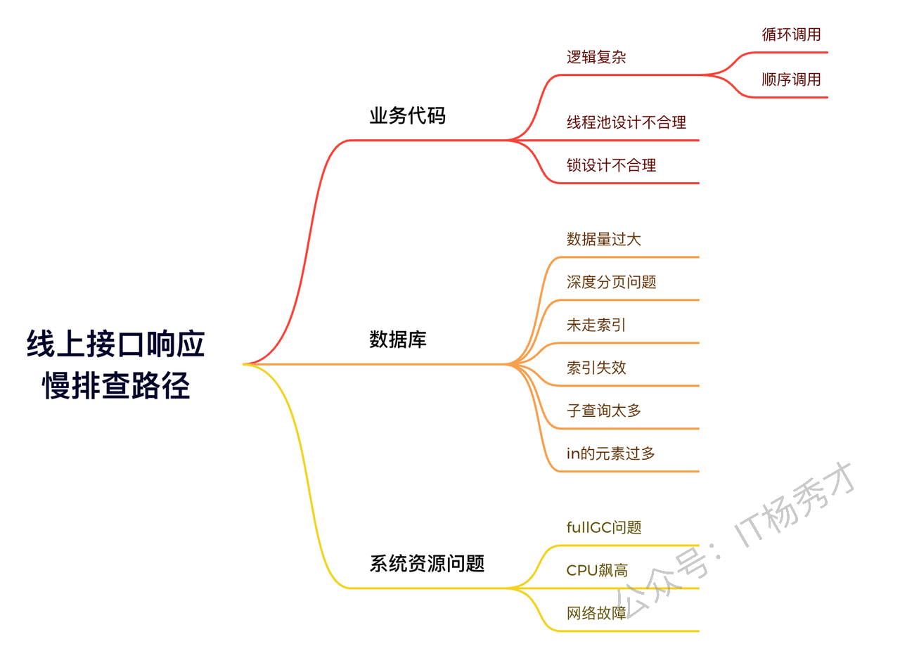
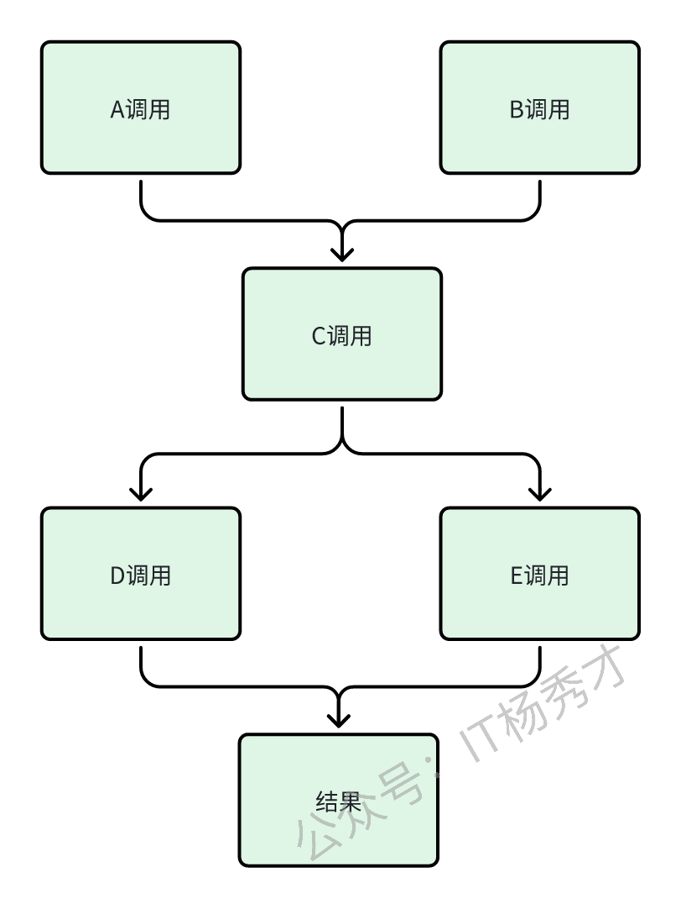
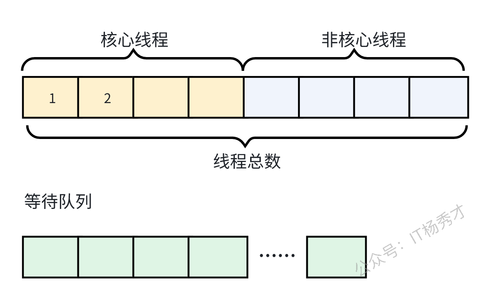
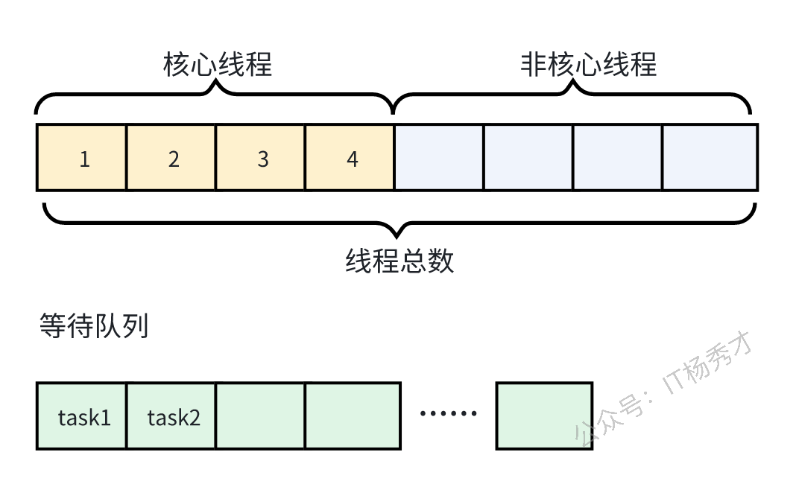
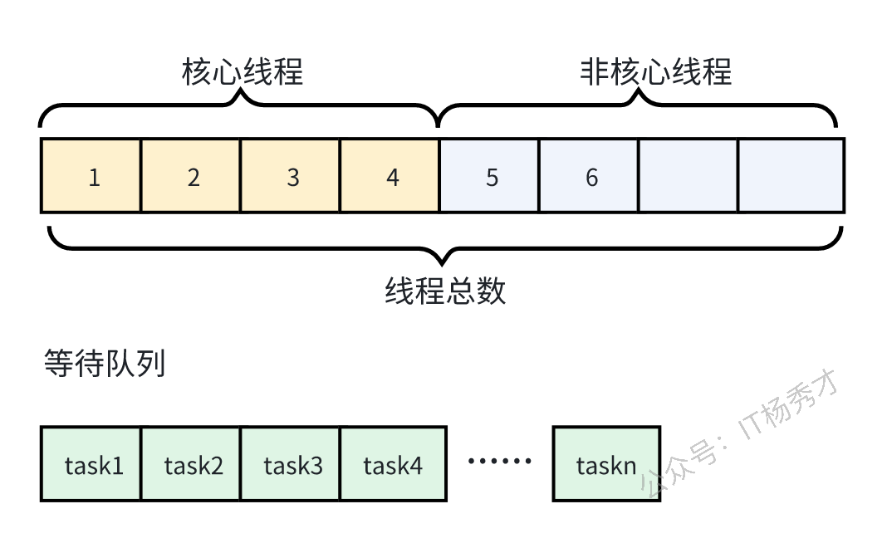
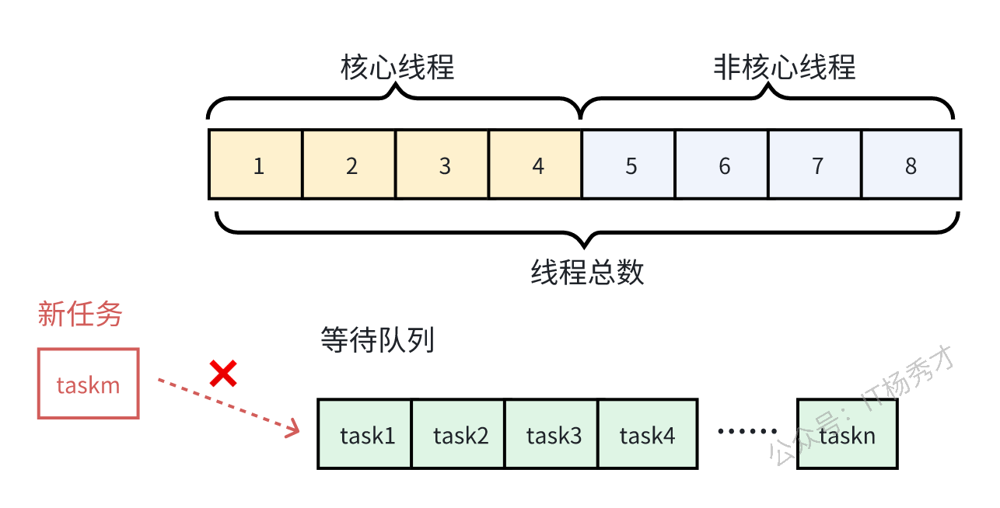
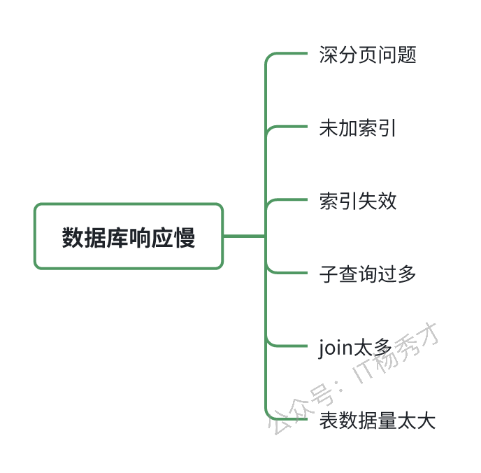
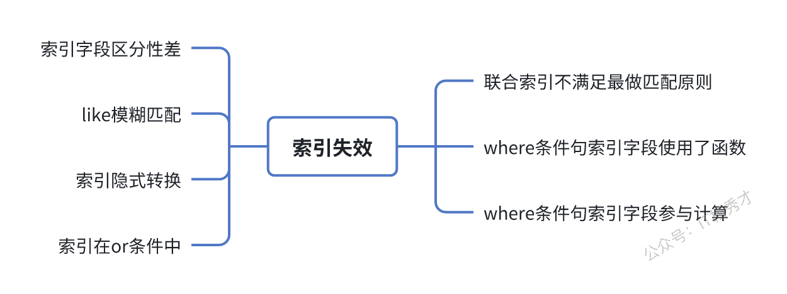

# Java线上接口响应慢如何排查

线上接口响应慢可以说是比进程突然挂掉更常见的问题了，在影响上它可能不会像进程中断那样严重，导致整个服务不可用。虽然影响面小，但是由于大量的请求延迟，会给用户的体验带来严重的影响。所以，针对线上接口响应慢问题的排查与处理也是我们需要重点掌握的。这篇文章将会系统介绍一些常见的导致线上接口响应慢的原因及排查手段
## 1. 接口性能问题排查路径
接口的性能受很多因素的影响，抛开系统问题不谈，比如单纯的流量激增，请求过多都会导致性能下降，接口响应变慢。另外数据库层面的慢查询，业务层面的代码逻辑错误以及服务器资源问题都会导致接口响应慢。对于慢接口常见的排查点如下图：



## 2. 业务代码排查
业务代码的实现在很大程度上也决定着程序的性能问题，一份优雅的业务代码，其性能自然会高不少。对于比较复杂的业务逻辑，由于流程非常多，在业务代码中往往会出现循环调用和顺序调用的情况，这两种实现再很大程度上会影响程序的性能，并且这两种实现方式是可以优化的

### 2.1 循环调用
循环调用不是说代码中所有循环里的逻辑都有问题，而是说对于循环里每次调用的逻辑几乎一样，前后又毫无关联的逻辑往往是可以优化的，比如下列代码逻辑，需要循环调用`processData`函数处生成30个`Data`类型的数据然后添加到`list`数组中
```java
List<Data> list = new ArrayList<>();
for(int i = 0 ; i < 30 ; i ++) {
    Data date = processData(i); // 计算30个Data类型的数据，添加到list数组中
    list.add(date);
}
```
很明显，这里每个数据的生成都是相互独立的，完全可以采用多线程方式进行优化
```java
// 建立一个线程池，并行处理上述process逻辑
public static ExecutorService commonThreadPool = new ThreadPoolExecutor(6, 6, 300L,
    TimeUnit.SECONDS, new LinkedBlockingQueue<>(10), commonThreadFactory, new ThreadPoolExecutor.DiscardPolicy());

// 开始多线程调用
List<Future<Data>> futures = new ArrayList<>();
for(int i = 0 ; i < 30 ; i ++) {
    Future<Data> future = commonThreadPool.submit(() -> processData(i));
    futures.add(future);
}

// 从futures获取结果添加到list中
List<Data> list = new ArrayList<>();
try {
    for (int i = 0 ; i < futures.size() ; i ++) {
        list.add(futures.get(i).get());
    }
} catch (Exception e) {
    log.error("error：", e);
}
```
### 2.2 顺序调用
除了循环调用之外，有的业务逻辑本身很复杂，需要涉及多个调用过程，如果每个接口都串行的顺序调用的话，性能必然不好，其实这种情况下钱也可以用多线程的方式进行，例如：



代码逻辑可以简单表示如下：
```java
A a = funcA();
B b = funcB();

C c = funcC(a, b);

D d = funcD(c);
E e = funcE(c);

return funcResult(d, e);
```
这里的逻辑其实可以用`CompletableFuture`来进行优化：
```java
CompletableFuture<A> futureA = CompletableFuture.supplyAsync(() -> funcA());
CompletableFuture<B> futureB = CompletableFuture.supplyAsync(() -> funcB());
CompletableFuture.allOf(futureA,futureB) // 等funcA()和funcB()两个并行任务都执行完成，

C c = funcC(futureA.join(), futureB.join());

CompletableFuture<D> futureD = CompletableFuture.supplyAsync(() -> funcD(c));
CompletableFuture<E> futureE = CompletableFuture.supplyAsync(() -> funcE(c));
CompletableFuture.allOf(futureD,futureE) // 等funcD()和funE()两个并行任务都执行完成，

return doResult(futureD.join(),futureE.join());
```
在原来的逻辑中，`funcA()`和`funcB()`是串行执行的，`funcD()`和`funE()`也是串行执行的，优化之后，`funcA()`和`funcB()`变成并行执行的，`funcD()`和`funE()`也是并行的。最大执行时间就只取决于并行的哪个逻辑更慢了，而不会是运行时间的叠加了

### 2.3 线程池设计不合理
线程池一般被我们用作逻辑并行优化的主要手段，但是线程池的设计不合理同样会使程序的执行效率很慢。线程池有三个重要参数：核心线程数、最大线程数、等待队列。回顾一下线程池的处理逻辑：
1. 线程池初始创建后，里面的线程数为0，当有任务提交的时候，开始创建和核心线程



2. 如果核心线程满了，只有任务提交的话，则任务会进入到等待队列



3. 如果等待队列也满了，线程池开始创建非核心线程



4. 如果线程池里的线程总数达到了最大线程数，还有任务继续提交的话，任务会阻塞



线程池导致性能问题主要有以下几种情况：
- 核心线程设置过小，没有达到并行的效果
- 一个线程池有多个业务公用，非核心业务占据了大量的线程，导致主线任务工作线程不足
- 任务过多，线程池里的线程被占满，大量任务阻塞

### 2.4 锁设计不合理
程序中的锁设计不合理同样会导致性能低下，设计不合理的锁一般是以下两种情况：

#### 2.4.1 锁类型不合理
在一般的编程语言中，提供的锁一般都有互斥锁和读写锁两种，读写锁就是读可以共享，而写互斥，互斥锁就是在任何场景下都是互斥的，所以加互斥锁的性能会更差。所以在可以加读写锁的时候，如果我们加成了互斥锁，那么在读远远多于写的场景下，效率会极大降低程序运行效率。

#### 2.4.2 锁粒度太粗
锁粒度过粗是另一种常见的锁设计不合理导致程序性能差的情况，通常把锁包裹的范围过大，使得加锁时间会过长，比如一下代码：
```java
public synchronized void doJob() {
    File f = processlData();
    copyFile(f);
    sendMessage();
}
```
这段代码逻辑有三个主要的阶段任务，计算数据，拷贝文件，最后发送消息。直观上来说，处理数据这里可能涉及到并发问题，而拷贝文件以及发送消息都是后续工作了，完全可以不加锁。这里的枷锁范围就可以优化，完全可以改成：
```java
public void doSome() {
    File f = null;
    synchronized(this) {
        f = processlData();
    }
    copyFile(f);
    sendMessage();
}
```
## 3. 数据库排查
除了业务代码外，另一个非常常见的影响后端接口性能的问题就是数据库问题了。涉及到数据库导致的性能问题，有很多个方面，下面大致做了个不完全总结



### 3.1 深分页问题
mysql的分页查询一般使用`limit`查询语句来完成，比如查询一张`student`表里查`100`到`120`这`20`条数据
```sql
select * from student limit 100,20
```
mysql会把前`120`条数据都查出来，抛弃前`100`条，返回`2`0条，这里查询`120`条数据，mysql性能不会有什么问题，但是当分页深度变得越来越大，比如达到`100w`的时候。
```sql
select * from student limit 1000000,20
```
这样mysql会查出来`1000020`条数据，抛弃`1000000`条，速度必然很慢。这里可以做一个优化，直接查询`id>1000000`的数据，然后取`20`条即可
```sql
select * from student where id > 1000000 limit 20
```
这样，mysql会走主键索引，直接找到`1000000`处，然后查出来`20`条数据，效率会高得多

### 3.2 未加索引
这个可以借助mysql提供的`explain`工具来排查，看下接口设计的到sql语句查询有没有走索引，关于`explain`的分析，这里就不再赘述。

### 3.3 索引失效
比起未加索引，索引失效的的情况更加复杂，排查起来也更困难一些。同样可以通过`explain`来查看索引是否生效，然后采取对应措施，下面总结了一些常见的索引失效的场景



关于具体的索引失效的sql这里就不再赘述，这里主要讲一下索引失效的第一个点，就是字段区分性差，什么是字段区分性差呢？可以按照以下3种情况来理解
1. 字段值少，比如一个性别字段，总共只有两个值，那这个字段的索引区分度就很低
2. 某个字段大量为空，只有少量有值，这个字段的区分度也很低
3. 字段值太集中，比如一个字段值90%都是1，剩下10%可能是其他值，区分度也很低

所以在建立索引的时候，最好不要建立在区分度低的字段上，这样会导致索引失效

### 3.4 join查询过多
`join`查询其实可以用来优化子查询，一般来说，在sql中大量使用子查询是不推荐的，因为执行子查询时，MySQL 需要为内层查询语句的查询结果建立一个临时表，然后外层查询语句从临时表中查询记录。 查询完毕后，再撤销这些临时表。 这样会消耗过多的CPU 和IO资源。所以子查询一般都建议优化成`join`来查询  
即便优化成`join`查询了，`join`关联的表也不宜过多，如果表的数据量很大，一般来说2-3张表就可以了。`join`操作其实也是在内存去做的，所以关联的数据量不宜过大，同时`join_buffer`也要适当设置的大一些，这样效率就高一些。相反，如果`join`的数据量太大，mysql会采用在硬盘上创建临时表的方式进行多张表的关联匹配，显然这就涉及到磁盘IO了，效率就会低的多    
如果在业务中的查询一定要涉及到多个表，而且数据量很大，那么最好的方式就是在业务层把查询拆成个子查询，然后在业务层取做聚合拼装，这样效率反而更高

### 3.5 表数据量过大
再索引以及sql都没有明显问题的情况下，查询还是很慢的话，那有可能就是表的数据量本身就太大了，导致的数据库性能降低。这个时候单表已经不足以支撑起这么大的数据量了，我们要么做数据迁移，将数据迁移到分布式的数据库中，要么就需要做分库分表了。关于分库分表的具体方案选择这里不做赘述

## 4. 系统资源问题
除了程序本身以及数据库的影响外，另外，机器本身的资源瓶颈也是导致我们程序性能低下的一个重要因素。比如java程序中由于代码问题导致陈旭频繁的发生fullGC，或者是代码存在线程泄露引起RSS内存占用过高进而引起机器反应慢，又或者是由于网络延迟导致rpc调用一致处于等待，等待诸多原因都可能导致接口响应变慢。这些都需要借助监控以及日志来进行逐一排查，具体问题具体分析

## 5. 通用解决方案
上面讲了这么多导致接口响应变慢的具体原因，除了具体问题具体分析外，那有没有一些通用的可以考虑到的解决方案能够解决大部分的业务接口慢的方法呢？其实是有的，排除了具体的问题以外，没有程序以及数据库故障，单纯的数据量大导致的接口响应慢依旧是我们需要优化的重点，这里有两个通用的方法

### 5.1 加缓存
在读接口的优化上来说，缓存是优化读接口的一个万金油方法。缓存又可以做中间件缓存和本地缓存，所有的读压力大，都可以借助缓存来优化，一级不够，可以做多级优化，先用redis做一层db纬度的优化，如果性能还是不够，可以在本地再做一层本地缓存，继续加快读取速度

### 5.2 异步化
通常我们的业务接口可能会包含多个流程，如果是同步的方式，我们需要等到最后数据写入成功后才会返回结果，如果流量压力很大并且流程很长的情况下很定会导致写入性能非常差，这里我们可以将写过程做异步化处理。到了写流程这里先返回响应，然后通过异步方式写入，如果有必要知道结果的话，可以做个回调通知

## 6. 小结
接口响应慢也是一个较为宽泛的问题，排查起来也要涉及多个方面，比如数据库问题，程序代码问题，包括服务器的资源瓶颈等等都要考虑到。也有可能只是单纯的数据量过大导致的接口响应慢，总之，在具体的接口问题面前要具体分析，找到对应的优化手段

# 资料分享
随着AI发展越来越快，AI编程能力越来越强大，现在很多基础的写接口，编码工作AI都能很好地完成了。并且现在的面试八股问题也在逐渐弱化，**面试更多的是查考候选人是不是具备一定的知识体系，有一定的架构设计能力，能解决一些场景问题**。所以，不管是校招还是社招，这都要求我们一定要具备架构能力了，不能再当一个纯八股选手或者是只会写接口的初级码农了。这里，秀才为大家精选了一些架构学习资料，学完后从实战，到面试再到晋升，都能很好的应付。**关注秀才公众号：IT杨秀才，回复：111，即可免费领取哦**


<div style="background-color: #f0f9eb; padding: 10px 15px; border-radius: 4px; border-left: 5px solid #67c23a; margin: 20px 0; color:rgb(64, 147, 255);">

# **学习交流**
<span style="color:rgb(4, 4, 4);">
> 如果您觉得文章有帮助，可以关注下秀才的<strong style="color: red;">公众号：IT杨秀才</strong>，后续更多优质的文章都会在公众号第一时间发布，不一定会及时同步到网站。点个关注👇，优质内容不错过
</span>


</div>