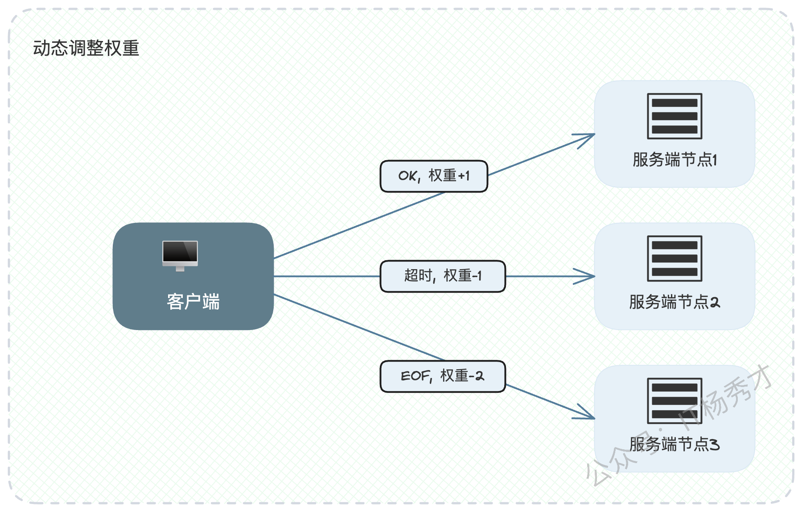

# 当面试官问题“负载均衡”，哪些点是核心？

负载均衡，这个话题在微服务架构里几乎无人不晓，也是面试中的"常客"。我们都知道，它在分布式系统中处于核心位置，任何一次服务调用，首先要面对的就是负载均衡该如何选择。这自然也让它成了面试中的必考题。

但可惜的是，即便我们都清楚这是个必考点，却很难在面试中聊出新意和亮点。多数候选人的回答，往往只是简单地罗列几种自己知道的负载均衡算法，稍微好一些的，会进一步探讨不同算法的优缺点。坦白说，这样的回答，并不足以让面试官在你身上贴上"技术专家"的标签。

所以今天，我想换个方式，带你深入那些算法背后微妙的细节，并给出一个结合本地缓存的实战案例。我的目标是，让你在下次面试中，能真正做到游刃有余，展现出超越大多数人的技术深度，给面试官留下深刻的印象。

## 1. 夯实基础 —— 负载均衡的核心算法

在深入探讨之前，我们必须先对负载均衡的基础算法有一个清晰的认识。从本质上讲，负载均衡就是要解决一个核心问题："当一个请求过来时，我应该把它交给集群中的哪一台服务器处理？"

理论上，你当然希望把请求精准地发送给那个能够最快返回响应的节点。但要做到这一点并不容易。你可能会有些困惑，因为我们常听到的轮询、随机、哈希等算法，似乎并没有在"试图判断哪个节点最合适"。

没错，这一类算法我们称之为静态负载均衡算法。它们并不实时感知后端服务的真实负载，而是依赖于统计学意义上的"最优"，即假设在大量请求下，按照既定规则分配，最终能够达到整体的均衡。

与之相对的，是动态负载均衡算法。这类算法会实时地、或者准实时地去探测所有候选节点的状态，并从中挑选出当前最合适的节点。典型的例子包括最少连接数、最少活跃请求数以及最快响应时间算法。

接下来，我们一个一个地来剖析它们。

### 1.1 静态负载均衡算法

#### 1.1.1 轮询（Round Robin）与加权轮询（Weighted Round Robin）

轮询是最简单、最直观的一种策略，用一句俗语讲，就是"排排坐，分果果"。有A、B、C三台服务器，第一个请求给A，第二个给B，第三个给C，第四个再回到A，如此循环往复，简单粗暴，主打一个"雨露均沾"。

但现实中，服务器的性能（CPU、内存等）往往并不相同。让一台"法拉利"和一台"拖拉机"处理同等数量的请求显然不合理。因此，加权轮询应运而生。我们可以根据服务器的性能配置赋予不同的"权重"，性能越好，权重越高，被分配到的请求就越多，实现"能者多劳"。

#### 1.1.2 深度思考：平滑加权轮询

普通的加权轮询虽然考虑了权重，但可能存在一个问题：它可能会在短时间内连续将请求发往同一高权重节点，造成流量突刺。例如，权重为{A:3, B:1, C:1}，那么可能会出现 A, A, A, B, C 这样的序列，对A的瞬时压力较大。

为了解决这个问题，Nginx等成熟的负载均衡器引入了更精妙的"平滑加权轮询算法"。

该算法的逻辑稍显复杂，它为每个节点维护两个权重：一个是固定的`weight`（初始权重），另一个是会动态变化的`current_weight`（当前权重）。每次选择节点时，执行以下步骤：

1. 遍历所有节点，将其`current_weight`的值增加各自的`weight`。

2. 在所有节点中，选择`current_weight`值最大的那个作为本次的目标节点。

3. 将选中节点的`current_weight`减去所有节点`weight`的总和。

通过这种方式，一个高权重节点在被选中后，它的"当前权重"会大幅下降，从而保证下一次轮到其他节点，使得流量分配在时间上更加平滑均匀，避免了流量的集中爆发。

#### 1.1.3 随机（Random）与加权随机（Weighted Random）

随机算法的逻辑同样简单：从可用节点列表中完全随机地抽取一个来处理请求。

而加权随机则是为每个节点设置一个被"抽中"的概率，这个概率通常与权重成正比。权重越大的节点，被选中的几率也越高。

在实践中，随机类算法和轮询类算法在宏观上的效果是相似的，但轮询的可控性相对更强一些，序列是确定的。在很多场景下，它们可以互为替代。

#### 1.1.4 哈希（Hash）与一致性哈希（Consistent Hashing）

哈希算法的思路是，根据请求里的某个固定参数（如用户ID、设备ID、订单号等）计算出一个哈希值，再用该值对服务器数量取模，从而将同一类请求固定地路由到某一台服务器上。

这种方式最大的优点是，对于同一标识的请求，总能命中同一台后端服务器，这对于需要利用本地缓存或者维持会话状态的场景来说，非常有用。但它的弊端也很明显：

* 哈希函数的选择：如果哈希函数设计不佳，导致计算出的哈希值分布不均，就会造成数据倾斜，某些节点负载过高。

* 集群伸缩的噩梦：当集群扩缩容，服务器数量`N`发生变化时，`mod N`的计算结果会剧烈变动，导致绝大多数缓存失效，引发缓存雪崩。

为了攻克这个难题，一致性哈希被设计出来，它也是面试中的高频考点。

你可以将其理解为一个0到2^32-1的闭环哈希环。它的工作流程如下：

1. 节点映射：将每个服务器节点的IP或主机名进行哈希计算，映射到哈希环上的某个具体位置。

2. 请求映射：当一个请求到来，根据其Key（如用户ID）计算哈希值，同样映射到环上的某个位置。

3. 节点查找：从请求映射的位置开始，沿着顺时针方向寻找，遇到的第一个服务器节点，就是该请求的目标处理节点。

打个比方，这就像一个钟表，朋友约你"下一个整点"在某地见面，你一看表是3:45，那么你自然知道下一个整点是4点。一致性哈希的查找过程与此类似。

它的精妙之处在于，当一个节点下线或上线时，它只会影响到其在哈希环上逆时针方向相邻的一小部分请求，而不会导致全局性的映射关系失效，从而极大地保证了集群伸缩时系统的稳定性。

### 1.2 动态负载均衡算法

与静态算法不同，动态算法会实时采集服务端的负载数据，并以此为依据进行"智能"的流量分配。

#### 1.2.1 最少连接数（Least Connections）

该算法的假设非常直观：连接数越少的服务器，其当前负载就越低。因此，它会选择当前活跃连接数最少的节点来处理新请求。

这个假设在很多场景下是成立的，但存在一个不容忽视的盲点：连接数不完全等同于负载压力。尤其在如今广泛采用连接多路复用的情况下，一个客户端可能通过一个连接，连续发送10个请求。此时，连接数并不能真实反映节点的繁忙程度。一个处理轻量级请求的节点可能维持着很多连接，但CPU空闲；而另一个节点可能只有一个连接，却在处理一个极其耗时的计算任务。

#### 1.2.2 最少活跃数（Least Active Requests）

这是对"最少连接数"的改进，它关注的是"活跃请求数"，即服务端已经接收但尚未处理完成返回响应的请求数量。客户端会统计每个节点的活跃请求数，并将新请求发往数量最少的那个节点。

这比看连接数更能反映节点的真实负载，但它同样无法区分请求本身的"重量"。一个处理大商家报表的请求，其对资源的消耗可能远超十个普通用户的简单查询请求。因此，即便活跃数相同，两个节点的实际负载也可能天差地别。

#### 1.2.3 最快响应时间（Fastest Response Time）

该算法认为，节点的响应时间是其综合处理能力的最佳体现，因为它综合了网络延迟、服务器负载、任务处理时长等多种因素。响应时间越短，说明节点当前状态越好。这里的响应时间可以是最近一段时间的平均响应时间，也可以是P99、P999等分位线指标，选择哪种具体看业务场景，效果不会有天壤之别。

这是一个更加精准和综合的动态指标。在实现时需要特别注意，统计的响应时间应具有"时效性"。也就是说，我们应该只统计近期请求的响应时间，并且越近的响应时间，其参考权重应该越高。这个"指标随时间衰减"的思想，在服务治理的很多领域（如熔断、限流）都会反复出现，是一个非常重要的概念。

#### 1.2.4 算法小结与共同挑战

最少连接数、最少活跃数和最快响应时间，都可以看作是选择了单一的指标来评估节点负载。这个思路可以启发我们，在特定场景下设计自己的负载均衡算法。比如说在CPU密集型的应用里，你可以设计一个负载均衡算法，每次筛选CPU负载最低的节点。当然，这里的难点就变成了你需要考虑怎么高效、低成本地采集到所有服务端节点的CPU负载数据。

这些动态算法还有一个共同的挑战：信息孤岛。因为负载数据通常是由客户端各自采集和决策的。客户端A并不知道客户端B向服务器发送了多少请求，这导致每个客户端都像一个"信息孤岛"，基于不完整的信息做出的决策可能是片面的，甚至是错误的。

如图所示，客户端1看到自己与服务端节点1的连接数最少，于是选择了它。但它并不知道，客户端2已经与节点1建立了大量的连接，导致节点1的实际负载非常高。此时，客户端1本应选择节点2。

要解决这个问题，需要建立全局的上帝视角，让服务端主动上报状态。思路有两种：

1. 响应时携带：服务端在返回业务数据时，通过HTTP Header或RPC的Metadata，将自己当前的CPU、内存等负载信息一并返回给客户端。这需要微服务框架的支持。

* 统一监控平台：所有服务端节点定期向一个中心化的监控系统（如Prometheus）上报自己的状态数据。客户端在决策前，先向监控系统查询全局最优节点。

不过，由于实现复杂，会引入额外的依赖和延迟，目前业界大规模采用的依旧是简单的静态算法，但这并不妨碍我们将这些深度思考作为面试的亮点。

## 2. 面试亮点与实战进阶

掌握了基础算法，你已经及格了。想拿到优秀，你需要展现出解决复杂问题的能力。在准备面试时，你必须搞清楚自己公司项目里，无论是Nginx网关还是客户端负载均衡，用的是什么算法，并准备一些相关的线上事故案例，这会非常有说服力。

### 2.1 巧妙应对"大请求"难题

你可以通过一个你亲身经历或精心准备的线上案例来引出这个话题：

"一般来说，加权类的算法都需要考虑权重的设置和调整。我们公司线上用的是轮询，虽然简单，但因为它没有实际查询服务端节点的负载，难免会出现偶发性的负载不均衡。"

"我们曾经遇到一个问题：线上服务大部分时间RT都很平稳，但会偶发性地出现尖锐的毛刺，且间隔和慢的程度都不固定，非常奇怪。后来经过深入排查，发现罪魁祸首是'大请求'——少数大客户的查询会消耗掉节点的大量CPU和内存。当其他普通用户的请求被轮询到这个'倒霉'的节点时，就会被严重拖慢。"

这个问题暴露了所有静态算法的通病：只关心请求数量的均衡，而忽略了请求本身的"重量"。

当面试官追问解决方案时，你可以从两个层面回答：

* 业务层面（治本）："这个大请求本质上是一个大的批量操作。后来我们与业务方协作，对接口进行了优化，限制了一次最多只能获取100条数据，通过产品层面的优化解决了这个问题。"

* 架构层面（治标）："我们对负载均衡算法做了一点改造。通过用户画像系统，每天计算出一批大客户列表，将他们的请求在负载均衡层通过特定的规则进行识别，并特殊处理，路由到专用的几个节点上。虽然大客户的请求依旧慢，但至少保证了广大普通用户不再受他们影响。这本质上是服务治理中'流量隔离'思想的应用。"

隔离的方案更显技术深度，可以顺势将话题引向服务治理。回答完后，可以再抛出一个引子："负载均衡有时还能巧妙地解决一些技术问题，比如缓存。"

### 2.2 动态权重调整的艺术

对于加权类算法，权重如何设定和调整，是另一个体现你思考深度的点。

#### 2.2.1 "成加败减"原则

权重不应是固定不变的，而应根据节点的实际服务质量动态调整。你可以抓住"成加败减"的关键词来展开。

* 调用成功：说明节点健康，可以适当增加其权重。这里的"成功"是指网络层面调用成功，即便是业务逻辑返回了失败码，也算是调用成功。

* 调用失败（如超时、网络错误）：说明节点可能存在问题，需要降低其权重，减少后续流量。可以进一步细化，例如网络类错误（如EOF）意味着问题更严重，降权的幅度也应该更大；而超时这类错误，可能是偶发性的，降权幅度可以小一些。

#### 2.2.2 别忘了设置"安全边界"

这是一个非常关键的工程实践经验，也是很多开发者容易忽略的坑：

"权重的动态调整必须有上下限。权重的绝对值不重要，不同节点间的比例才重要。但调整时必须考虑安全问题。下限不能为0，否则节点一旦权重归零，可能永远无法恢复流量，就'死'掉了。上限也不能无限高，比如不超过初始权重的两三倍，防止因某个节点表现持续良好而导致所有流量都涌向它，最终被压垮。很多公司都因为没有控制好权重的上下限而引发过线上故障。"

最后，你可以将这个话题再度升华："这种根据调用结果调整权重的方式，和在服务注册与发现中暂时剔除故障节点，本质上都是为了提高系统的可用性，是服务治理的重要一环。"

### 2.3 一致性哈希与本地缓存的化学反应

这是一个能充分展示你架构设计能力的微创新方案。

#### 2.3.1 方案的提出与优势

"在性能要求极致的场景，我们会使用本地缓存。但如果配合轮询等算法，同一个Key的请求会被分散到不同节点，这将导致几个严重的问题：严重的缓存未命中、多个节点缓存同样的数据导致内存浪费，以及极其棘手的数据一致性问题。"

"在这种情况下，一个很自然的想法就是，能否把同一类请求都让同一个节点来处理。于是，我们的解决方案是，将一致性哈希算法与本地缓存结合。例如，针对用户的缓存，我们使用用户ID作为哈希的Key，这样就可以确保同一个用户的请求都会被稳定地路由到同一节点上，这极大地提升了本地缓存的命中率，并降低了整体的内存消耗。"

#### 2.3.2 为什么说只能缓解，无法根治？

在抛出方案后，主动揭示其局限性，更能体现你的严谨和思考深度。

"需要强调的是，即便采用了一致性哈希，也只能'缓解'而不是'根治'数据一致性问题。"

当面试官追问时，你就可以给出最后的答案，关键词是"应用发布"：

"问题出在集群节点数量发生变化的瞬间，比如应用发布或服务器扩缩容时。当整个集群的节点数量发生变化时，就难免会导致同样的数据缓存在多个节点上。

想象这个时序：

1. 一个读请求A（查询user\_id为1的昵称）根据当时的哈希规则，命中老节点N1，但N1本地缓存没有数据，于是准备查询数据库。

2. 此时，集群发生变更（如上线了新节点N2），哈希环结构改变。

3. 紧接着，一个写请求B（将user\_id为1的昵称改为小刚）根据新的哈希规则，命中了新节点N2。N2更新数据库，并刷新了自己的本地缓存为"小刚"。

4. 随后，请求A在老节点N1上从数据库读到了旧数据"小明"，并写入了N1的本地缓存。

这就造成了数据不一致。虽然这个不一致的窗口期很短，但它确实存在。应用发布是节点数量变化最常见的原因，因为发布过程就可以看作是先下线一个老节点，再上线一个新节点。不过，也可以看出，这个方案已经将数据一致性的问题大大缓解了。"

通过这个方案，你已经主动将话题引向了更为复杂的缓存和数据一致性领域，可以为后续的讨论做足铺垫。

## 3. 总结：带着架构思维去面试

今天我们系统性地探讨了负载均衡。从基础的静态、动态算法，到平滑加权、一致性哈希的深度原理，再到结合线上案例的"大请求隔离"、"动态权重调整"和"一致性哈希+本地缓存"三大实战亮点。

记住这些关键词：大请求、成加败减、上下限、可用性、应用发布。将这些知识点内化，并结合自己的项目经验，形成一套属于你自己的、有深度、有亮点的回答体系，你一定能让面试官刮目相看。 