大家好，我是秀才，书接上回，在上一篇文章[高并发场景下，如何保证消息顺序消费](https://golangstar.cn/backend_series/advanced_interview/mq_order.html)我们分析了消息的顺序消费问题，这篇文章我们就来看消息队列的另一个典型问题：消息积压。

假设有这样一个场景，有个电商公司，他们公司在双11大促活动期间，随着零点钟声敲响，流量洪峰瞬间涌入。系统表面上看起来扛住了，但几分钟后，下游服务的告警开始此起彼伏，用户反馈“订单处理中”的状态迟迟不变。经过技术团队紧急排查，最终定位到问题的根源：核心业务的消息队列（Message Queue, MQ）积压了上百万条消息。这个时候应该怎么处理呢？

大多数人的第一反应就是“加机器，扩容消费者”。这个“三板斧”虽然暂时缓解了问题，但治标不治本。活动过后，这些为应对峰值而紧急增加的资源又闲置了。那除了简单粗暴地加机器，还有没有更优雅、更体系化的解决方案呢？

下面，我们就以面试为导向，从根源出发，深入聊聊消息队列积压的应对之道。

## **1. 为什么我们的消费者不能无限扩展？**

在探讨解决方案之前，我们必须先弄清楚一个根本性的制约因素：为什么我们不能像Web服务器那样，简单地通过无限增加消费者实例来解决问题？只要预算足够，加就对了。

答案在于消息队列的核心设计——**分区（Partition）模型**。以Kafka为例，它引入了分区的概念来提升并行处理能力。一个Topic可以被划分为多个分区，消息被分散存储在这些分区中。而在消费端，一个消费组（Consumer Group）内的消费者会与这些分区进行绑定。当有新的消费者加入或离开消费 "消费组" 时，会触发一次“再均衡（Rebalance）”，由消费组协调器（Group Coordinator）根据预设的分配策略（如Range或RoundRobin），重新分配分区与消费者的对应关系。

这里的关键规则是：**一个分区在同一时刻，只能被消费组内的一个消费者实例所消费。假设这里有N个分区，但是如果不足N 个消费者，那么就会有一些消费者同时从多个分区里面拉取数据，如下图所示：**

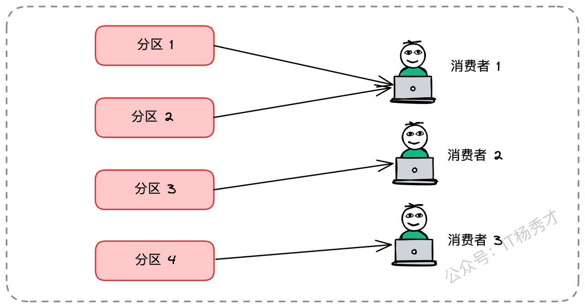

那如果消费者数量多于分区呢？多出的分区将处于空闲状态，无任务消费。这就意味着，消费者的并行度上限，被分区的数量牢牢锁定了。如果你有5个分区，那么部署超过5个消费者实例是毫无意义的，多出来的消费者将处于空闲（Idle）状态，永远拿不到任何消息。

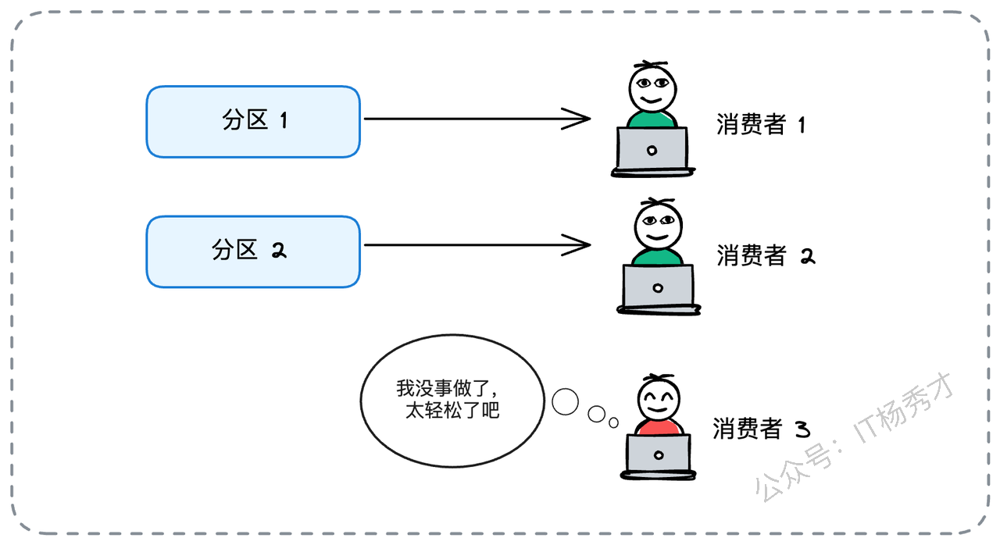

在面试中，清晰地解释分区与消费者的这种绑定关系，是展现你基础扎实的第一个关键点。当你解释完这个核心规则后，一个很好的加分项是主动阐述其背后的设计权衡。你可以这样补充：

“这种设计的背后，其实是一种权衡：它保证了在单个分区内，消息是被顺序消费的，这对于很多需要保证顺序性的业务场景（如订单状态变更、用户行为轨迹）至关重要。同时，它也简化了消费端的协调逻辑，避免了多个消费者同时处理一个分区数据时可能出现的复杂并发问题。”

这样的补充，能立刻让面试官感知到你思考的深度。

> “这种方案虽然简单，易实现，但他有很大的约束性，当消息积压发生时，如果我们已经将消费者数量扩展到了与分区数相等，那么“加机器”这条路就已经走到头了。我们必须寻找其他维度的突破口。

## **2. 如何为Topic规划合理的分区数？**

既然分区数是消费能力的天花板，那么在Topic创建之初，科学地规划分区数量就显得至关重要。这是一种主动防御，能有效避免未来的很多麻烦。

那么，这个“合理”的分区数，到底该如何确定呢？

业界并没有一个放之四海而皆准的公式。最严谨的方式，当然是利用MQ自带的压测脚本（如Kafka的`kafka-producer-perf-test.sh`），在测试环境中模拟生产环境的消息大小、吞吐量，通过不断调整分区数和消费者线程数来找到最佳值。但现实是，很多团队没有这样的测试条件，或者不敢轻易在生产环境进行压测。

在这种情况下，我在这里分享一个在实践中总结的、简单有效的估算方法：

1. **评估生产者峰值吞吐**：首先预估业务高峰期，所有生产者写入消息的总速率。这需要和业务方充分沟通，了解未来的增长预期和活动规划。数据来源可以是历史监控数据（如Prometheus/Grafana中的指标）、业务数据分析报表等。假设峰值为5000条/秒。

2. **评估单分区写入上限**：通过压测或咨询运维团队，了解当前MQ集群下单分区的写入性能极限。这个值受限于Broker的磁盘I/O、网络带宽、副本同步策略（`acks`参数）、消息压缩方式等多种因素。假设是250条/秒。

3. **评估单消费者处理能力**：在不考虑任何优化的情况下，评估单个消费者实例处理消息的平均速率。这个速率的瓶颈通常不在于消费者本身，而在于其处理逻辑中涉及的外部依赖，比如数据库写入、RPC调用等。可以通过对消费逻辑进行性能剖析（Profiling）来精确测量。假设是100条/秒。

基于以上数据，我们可以计算出两个所需的分区数：

* **满足生产需求的分区数** = 生产者峰值吞吐 / 单分区写入上限 = 5000 / 250 = 20个分区。

* **满足消费需求的分区数** = 生产者峰值吞吐 / 单消费者处理能力 = 5000 / 100 = 50个分区。

为了确保生产者不被阻塞，且消费者能及时处理，我们应该取两者中的**最大值**，即50个分区。在此基础上，再增加一些冗余（比如10%\~20%），最终确定为55或60个分区，以应对未来的业务增长和流量波动。

当你在面试中给出这个计算方法后，如果想让回答更上一层楼，就不能止步于此。面试官其实更想听到你对“权衡”的理解。你可以接着补充

> “不过，分区数也并非越多越好。过多的分区会增加Broker元数据管理的开销和客户端的内存消耗。更重要的是，过多的分区会显著延长消费者组发生再均衡（Rebalance）的时间，在此期间整个消费组是停止消费的，反而可能加剧消息积压。所以，这是一个需要在吞吐能力和系统开销之间寻找平衡的决策。”

## **3. 应对积压的快速解决方案**

尽管我们做了事前规划，但突发状况仍在所难免。当告警响起，消息积压已成事实，我们该如何快速应对？

首先，要冷静分析积压的类型或者是消息积压的原因

* **突发流量所致**：由于某个活动或突发事件导致的短暂流量高峰，消费者的处理能力本身是足够的。这种情况在电商领域是非常常见的，比如进行某个促销活动，往往都会伴随着短暂的流量高分，活动已过，流量又恢复正常。此时，我们可以通过监控指标（如消费滞后量`Consumer Lag`、生产速率、消费速率）来估算恢复时间。例如，积压了100万条，消费速率比生产速率快1000条/秒，那么大约需要 `1,000,000 / 1000 = 1000秒 ≈ 17分钟` 就能恢复。如果你的业务对17分钟的延迟完全可以接受，那么我们甚至可以不进行干预。如果持续时间相对较长，就可以考虑我们后续介绍的接种办法

* **消费者能力不足**：消费者的整体处理能力已经跟不上生产者的速度，积压量会持续增长，这时就必须采取行动了。这种情况往往可能是因为我们的业务代码有一些隐藏的故障，导致消费能力很弱，或者是随着时间的拉长，原本数据库里的表数据变得越来越大，此时在数据存储层的处理时间越来越久，拖慢了整个消费速度，这个时候就需要我们去进行一些慢SQL优化之类的工作了

接下来，我们就来看看，应对消费能力不足，并且在消费者数量已经等于分区数的前提下，要快速解决问题有哪些可行的方案？

### **3.1 方案一：扩容分区（最直接）**

最简单直接的方法就是增加Topic的分区数量。比如从50个分区扩容到80个，这样我们就能相应地将消费者实例也增加到80个，系统的总消费能力自然就提升了。

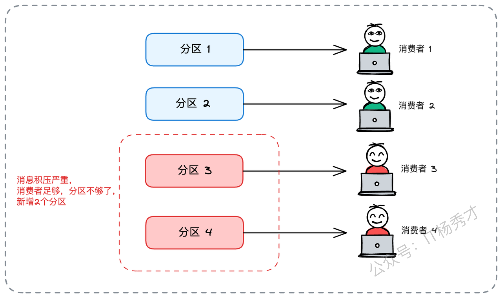

在面试中提出这个方案时，一个体现你经验丰富的小技巧是，主动说明其局限性。

> 你可以说：“当然，这个方案虽然直接，但在实际操作中可能会受限。比如，有些公司的中间件运维团队对线上Topic的变更管控非常严格，随意扩容分区可能会被禁止。而且，增加分区后，消息在分区间的分布可能会发生变化，如果业务逻辑依赖于特定的分区策略（比如基于某个ID的哈希），需要谨慎评估其影响。”

这表明你具备线上运维的风险意识，而不仅仅是纸上谈兵。

### **3.2 方案二：创建新Topic（曲线救国）**

很多时候线上消息队列的分区，是不允许随便添加的，因为这会牺牲掉Key的全局顺序性（仅保证增加之后的新消息按新规则路由）。并且这个操作需要和下游消费方充分沟通，确保他们的业务逻辑能够容忍这种变化，整体而言对整个系统的改动还是比较大的。所以一般我们可以采取“曲线救国”的策略，创建新的Topic，这种策略有两种具体的落地方案：

#### **3.2.1 并行消费**

1. 创建一个全新的Topic，例如`order_topic_v2`，并为其设置远超当前需求的分区数（比如100个）。

2. 让生产者将新的消息写入这个`order_topic_v2`。

3. 同时，部署两套消费组：一套继续消费旧Topic（`order_topic`）中的积压消息；另一套新的消费组，以足够多的消费者实例，开始消费新Topic中的消息。

4. 当旧Topic中的消息全部被消费完毕后，下线旧的消费组，整个系统平滑过渡到新的Topic。

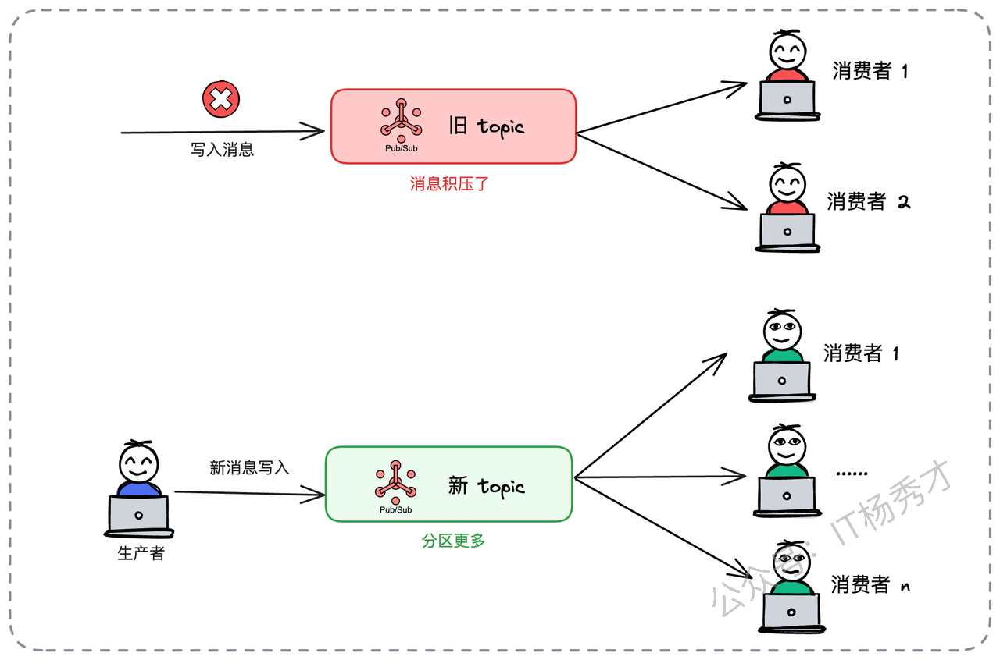

#### **3.2.2 消息转发**

这种方式主的核心思路是将旧的Topic的消息转发到我们创建的分区更多的新Toptic下，然后部署全新的消费者组来袭来消费新Toptic，由于新的Toptic分区多，所以可以部署更多的消费者，提升消费能力，具体步骤如下：

1. 创建一个分区数更多的新Topic `order_topic_v2`。

2. 生产者切换到新Topic。

3. 专门部署一个“搬运工”服务，它作为消费者从旧Topic中拉取积压数据，然后作为生产者，将这些数据转发到新Topic中。这个“搬运工”服务自身也需要保证高可用和高性能。

4. 主力消费组只需要专注于消费新Topic即可。

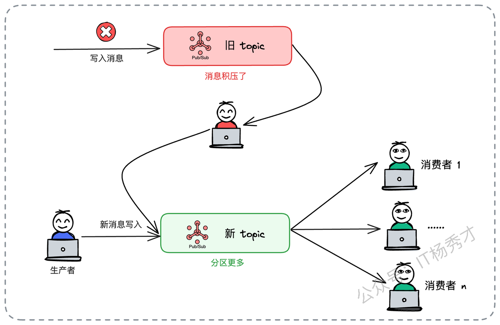

能清晰地分析出不同方案的trade-off，是架构师能力的重要体现。在介绍完这两种方式后，你可以主动进行对比：

> “方式A处理积压数据的速度更快，但需要在短期内维护两套消费逻辑，增加了部署和运维的复杂性。而方式B的消费逻辑统一，代码更易于维护，但增加了一个转发环节，可能会稍微降低处理积压数据的整体速度。选择哪种方案，取决于当时对恢复速度的要求和团队的运维能力。”

## **4. 消费者性能优化**

前面的增加分区或者是增加Topic只是一种比较粗力度的快速解决方案，应急过后，我们还需要向内求索，尤其是当外部扩容受限时，无法扩容的时候，更要通过通过优化消费者自身的处理逻辑来“提速”。这里主要介绍三种常用的方案

### **4.1 引入降级**

在某些业务场景下，消费逻辑并非“全有或全无”。我们可以借鉴微服务治理中的“降级”思想，在消息积压时，有策略地放弃一些非核心操作，以换取整体处理速度的提升。例如，一个用户动态（Feed）更新的消费者，其主要逻辑是：调用用户服务、调用内容服务、计算权重分、写入缓存。在消息积压时，我们可以引入降级策略：在处理消息前，先检查该动态的Feed缓存是否存在。如果缓存**已存在**，则跳过后续所有复杂的计算和调用，直接认为处理成功。这个逻辑的依据是：既然数据有10分钟的缓存，那么在积压的紧急情况下，用户暂时看到几分钟前的旧数据是可以接受的。

将微服务治理的思想灵活运用到消息消费场景，能向面试官展现你知识体系的广度和解决问题的灵活性。

### **4.2 分布式锁优化**

分布式锁优化主要是针对后台有多个消费者存在并发问题，需要抢锁单一消费的场景。比如一个订单处理系统，消费者在处理订单消息时，为了防止并发问题（例如同一个订单被不同消费者重复处理），引入了基于Redis的分布式锁。逻辑是：处理`order_id=888`的消息前，先获取`lock:order:888`的锁。这套机制在流量平稳时运行良好。但当消息积压时，大量消费者线程因为等待同一个订单的锁而被阻塞，消费速度大打折扣。每一次加锁解锁，都意味着一次网络往返，这在高吞吐场景下是巨大的性能损耗。

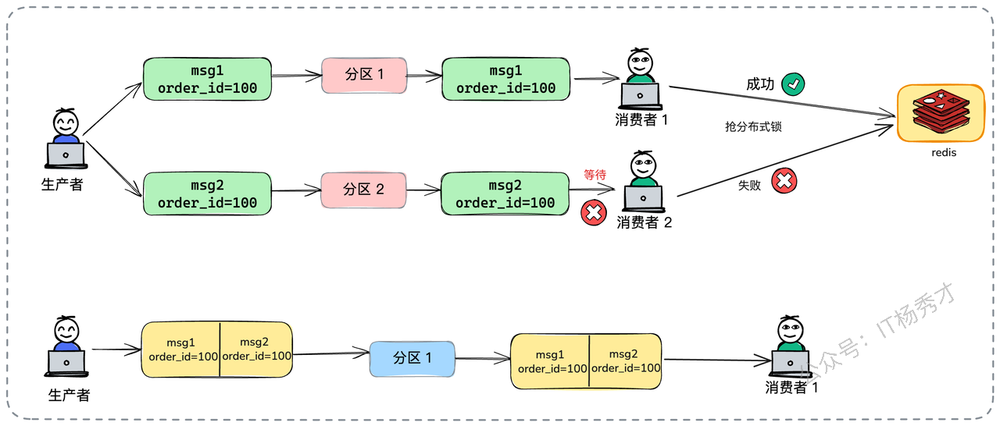

这里就可以用消息队列来优化：在生产者发送消息时，**指定订单ID（`order_id`）作为分区的Key**。消息队列的派发机制（通常是`hash(key) % numPartitions`）会保证，拥有相同Key的消息，总是被路由到同一个分区。如此一来，同一个订单的所有相关消息（如下单、支付、取消）都会进入同一个分区，进而被同一个消费者实例顺序处理。如此一来就不存在并发问题了，分布式锁就可以被彻底移除，消费者的性也会得到提升。

用消息队列的分区机制来优化分布式锁，是一个非常常见而且有效的方案，大家一定要熟练掌握，不仅是面试，在实际业务场景中也大有用处。

### **4.3 批处理**

观察生产者的行为，有时也能发现优化的契机。设想一个批量更新商品库存的场景。上游系统每当一个商品库存变更，就发送一条消息。当有成千上万的商品需要同时更新时，就会产生海量的单条消息。

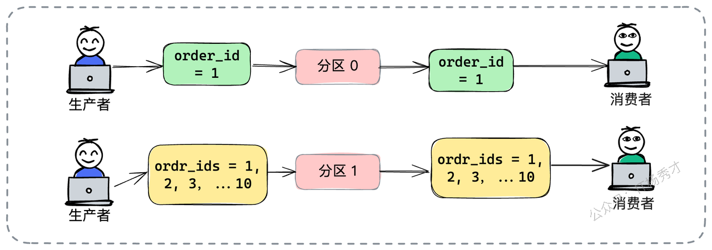

我们可以对生产者进行改造，让它将短时间内的多个库存变更**聚合**成一条消息再发送。相应地，消费者也改造为支持批量处理。一次数据库操作处理上百个商品的库存更新，其效率远高于执行上百次单独的更新操作。

> 在面试时，一个更能体现你主动性的说法是：“即使生产者无法改造，我们也可以只优化消费者。让消费者一次拉取一批消息（如100条），然后在内存中将这些消息构造成一个批量请求，再一次性提交给下游服务或数据库。这种‘消费侧聚合’同样能取得不错的效果，更能体现我们作为消费端负责人的担当和优化能力。”

## **5. 亮点方案：异步消费+批量提交**

如果说前面的方法是“术”，那么接下来要介绍的**异步消费模型**，则更接近于“道”，它是一种架构层面的重构，能最大程度地压榨消费端的处理能力。

标准消费模型是“拉取-处理-提交”的同步循环。消费者线程拉取一条消息，执行业务逻辑，完成后提交位点，再拉取下一条。这个过程的瓶颈在于，拉取消息的网络I/O和处理消息的业务逻辑是串行的，互相等待。

而异步消费模型则将其解耦：

* **一个专门的消费者线程**：它的唯一职责就是高效地从消息队列中拉取消息，然后迅速将消息放入一个内存队列（如Java中的`ArrayBlockingQueue`）中。

* **一个独立的线程池**：这个线程池中的工作线程，从内存队列中获取消息，并执行真正的业务逻辑。

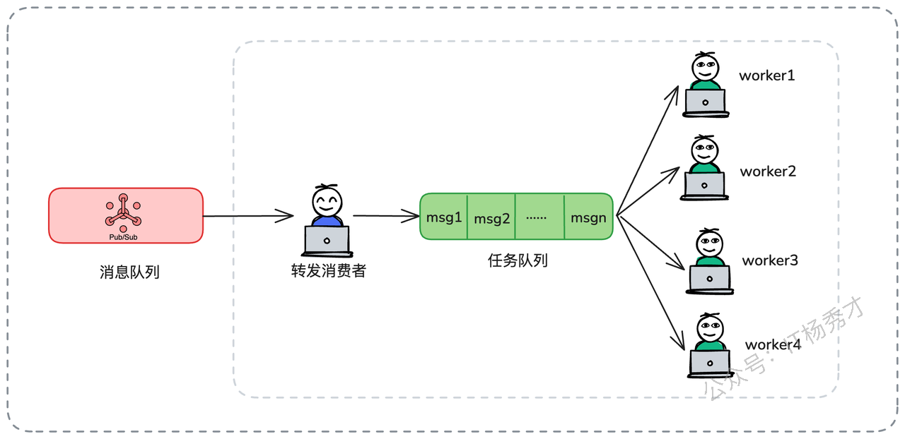

这样一来，拉取消息的I/O操作和处理消息的CPU/I/O密集型操作就完全分离开来，互不干扰，整体吞吐能力大大增强。

在介绍这个终极方案时，面试官一定会追问其复杂性。你需要主动、深入地探讨该模型带来的三大挑战及其解决方案，这才是体现你架构设计能力的关键。

### **5.1 挑战1：消息丢失风险**

这个方案确实可以极大提升消费能力，但是也有可能带来很多的问题，首先一点就是可能造成消息丢失。正常情况下，消息队列的消费是要消费完一条消息，提交成功之后，才会接着消费下一条。改成这种消费架构之后，这个转发消费者根本不关心消息是否被正确消费，只管把消息放入消息队列就完事了。这就可能出现消费者线程将消息放入任务队列后，worker线程还未处理完消息，应用就宕机了，worker重启之后会接着消费后续消息，刚才这条消息就永久丢失了。

应对这种情况我们就可以考虑**批量提交**。消费者线程一次性拉取一批消息（比如100条），分发给工作线程池。然后，它会**等待**这100条消息**全部**被工作线程处理完毕后，才一次性向MQ提交这批消息的最高位点。

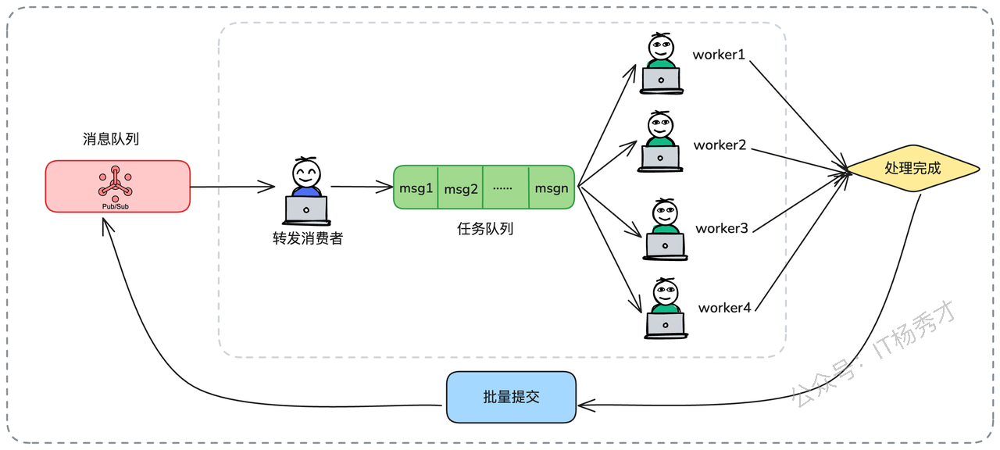

### **5.2 挑战2：重复消费问题**

批量提交虽然解决了消息丢失，但又引入了重复消费的可能。如果在100条消息处理完、但在批量提交前发生宕机，那么应用重启后，这100条消息会被再次拉取和处理。

这种情况最好的办法当然就是**保证消费逻辑的幂等性（Idempotence）**。这是解决重复消费问题的唯一正确途径。无论同一条消息被处理多少次，其最终产生的结果都应该是一致的。实现幂等性的常见方法包括：使用数据库唯一键约束、乐观锁（版本号机制）、或是在处理前查询状态等。

### **5.3 挑战3：批次内部分失败**

> 此时厉害的面试官，还可能会接着问一个更棘手的问题，假设一批100条消息中，有99条成功了，但有1条因为某种原因（如数据库连接超时）处理失败了。我们该怎么办？如果因为这1条失败就整个批次不提交，那么会造成所有99条成功的消息被不断重复处理，消费进度被阻塞。

应对这种情况这里有多种处理策略，每一种都体现了不同的健壮性设计思路。

1. **同步重试**：让失败的工作线程立即重试几次（例如，间隔100ms重试3次）。这种方法简单直接，但缺点是会拖慢整个批次的处理时间。因为当这个重复worker在重试的时候，其他worker必须要等它，所以要注意控制住重试的次数和重试的整体时间。

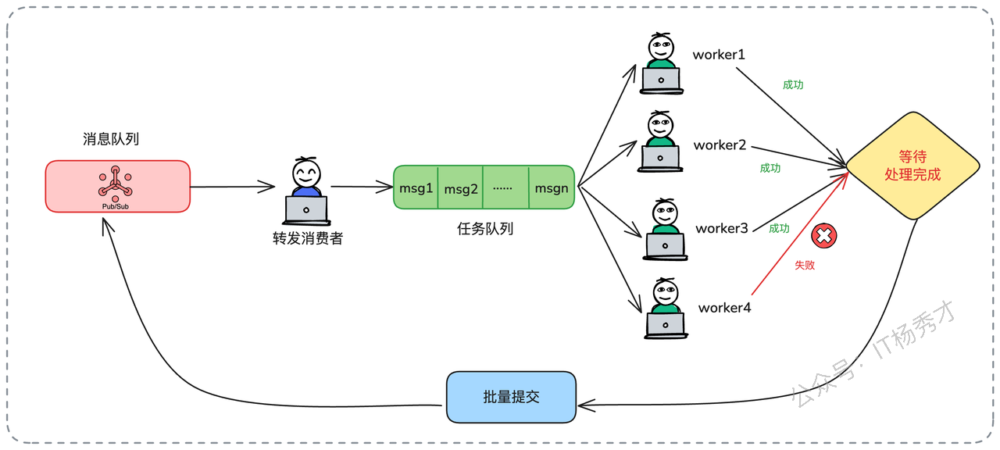

* **异步重试**：将失败的消息放入一个专门的重试线程中异步重试，让主流程继续。这种方式不会阻塞主流程，但会增加实现的复杂性。

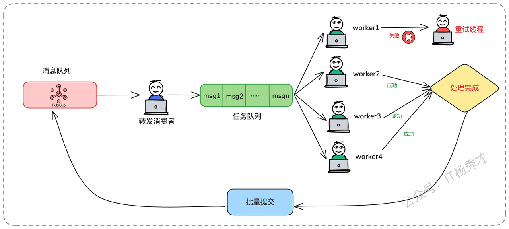

* **失败消息重入队列**：这是一种更优雅的做法。当工作线程处理某条消息失败后，它不抛出异常，而是将这条消息（可以附带上重试次数等信息）重新发送回**同一个Topic**。这样，这条失败的消息将会在稍后被再次消费，而当前批次可以顺利完成并提交位点。需要特别注意的是，必须在消息体中加入一个重试计数字段，当重试次数达到阈值（如3次）后，就不再重新投递，而是将消息记录到死信队列（Dead Letter Queue）或日志中，进行人工干预，以防止“毒丸消息”导致无限循环。

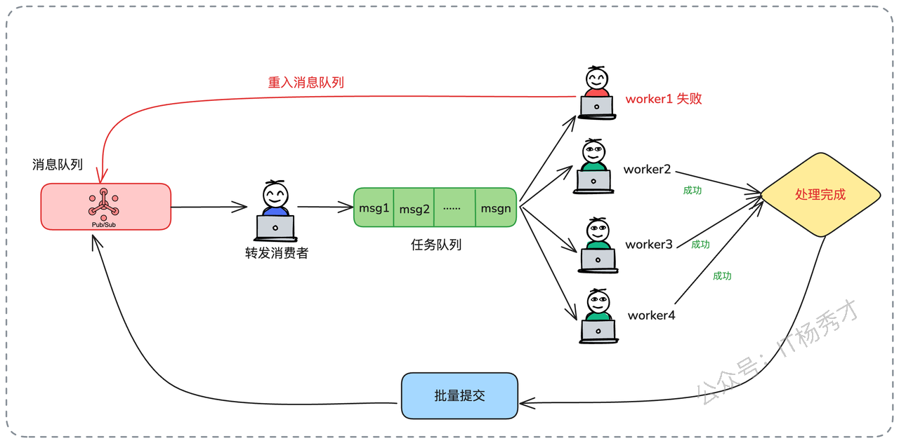

通过“批量提交 + 幂等保障 + 失败消息重入队列/死信队列”这一套组合拳，我们就可以构建一个既高效又健壮的异步消费体系。在面试的时候，这也是一套可以让面试官眼前一亮的消息积压优化方案

## **6. 小结**

消息积压几乎是每个后端工程师在系统发展到一定阶段后都会遇到的经典难题，它不仅考验着我们对中间件的理解深度，更考验着我们面对线上复杂问题的综合处理能力。当面试官问你如何解决消息积压问题时，一个结构清晰、层层递进的回答会大大加分。你可以按照以下思路来组织你的答案：

1. **定性问题**：首先，搞清楚消息积压的原因，区分是临时性积压还是永久性积压。表明你具备线上问题分类处理的思路。

2. **分析根源**：从消息队列的分区模型入手，解释为何不能无限增加消费者，点出问题的本质。

3. **分层解答**：

    * **架构层（事前）**：讨论如何进行容量规划，科学地预估和设置分区数。

    * **应急层（事中）**：提出快速见效的方案，如扩容分区和创建新Topic，并分析其利弊。

    * **优化层（事后）**：深入到消费者代码层面，通过案例（去锁、降级、批处理）展示你的代码优化和性能调优能力。

    * **进阶层（架构重构）**：最后，抛出异步消费这个“大招”，并深入探讨其背后的复杂性（消息丢失、重复消费、部分失败），展现你对复杂系统设计的驾驭能力。

这样一套组合拳打下来，不仅全面地回答了问题，更向面试官展示了你从原理到实践、从宏观到微观、从简单方案到复杂架构的完整知识体系和系统化思考能力。

