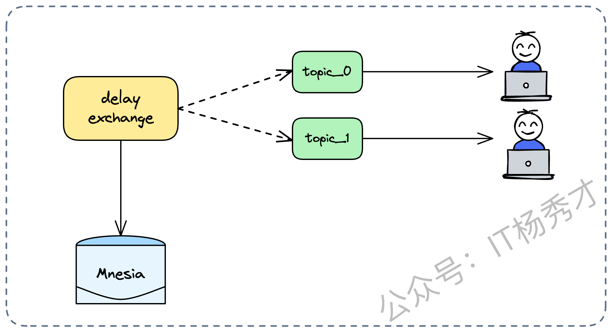
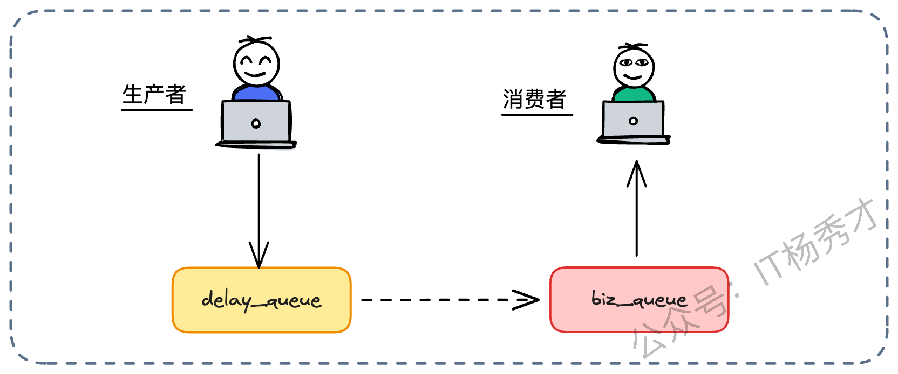
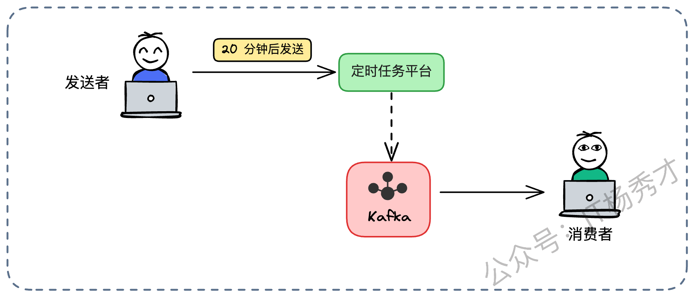
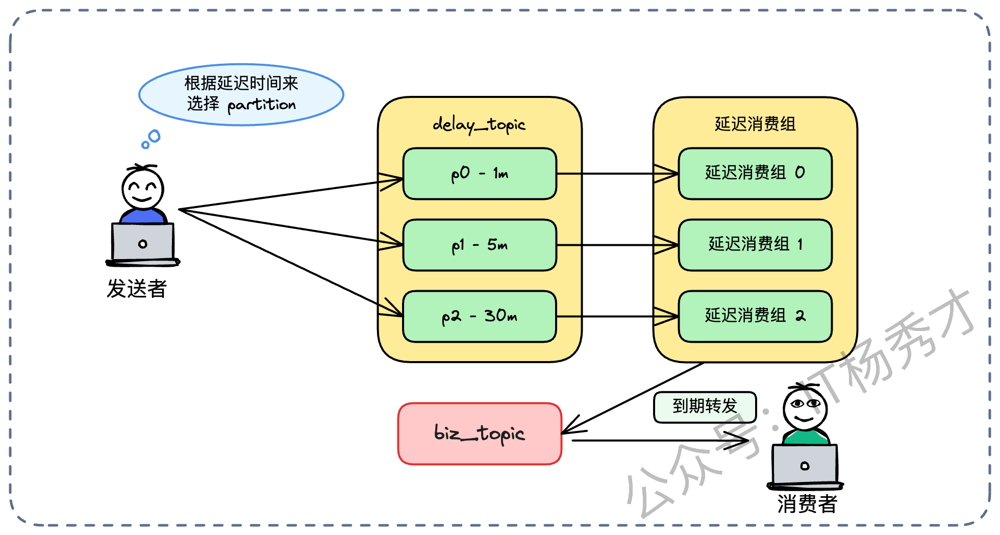
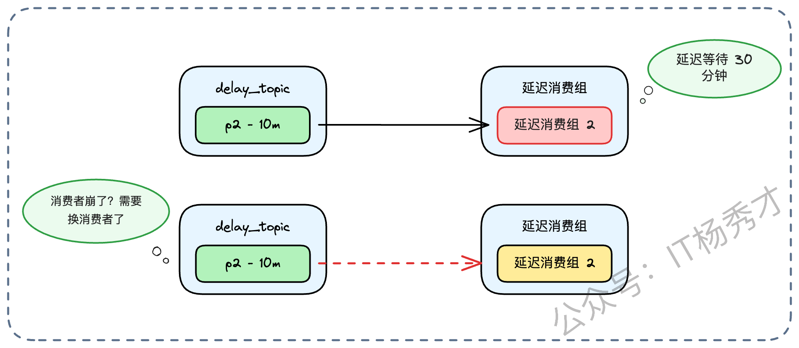
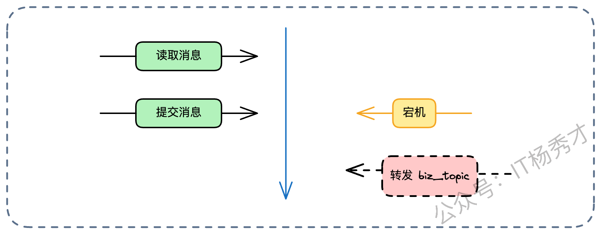
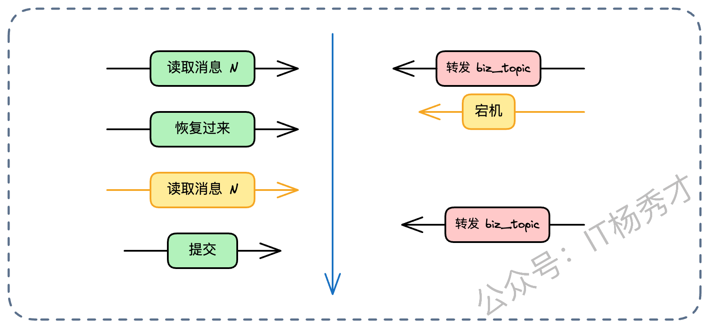
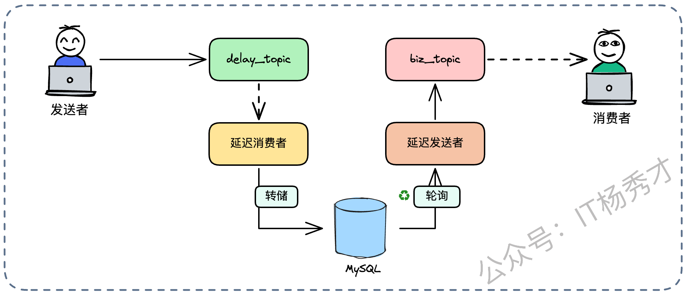
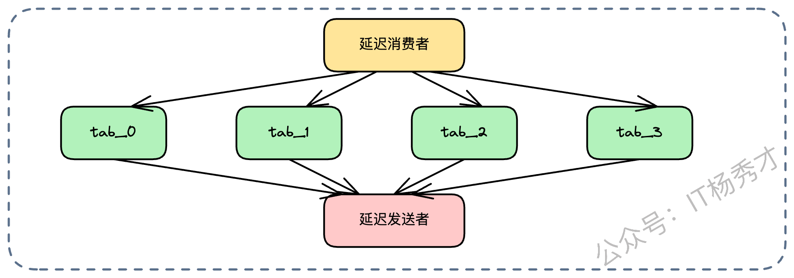
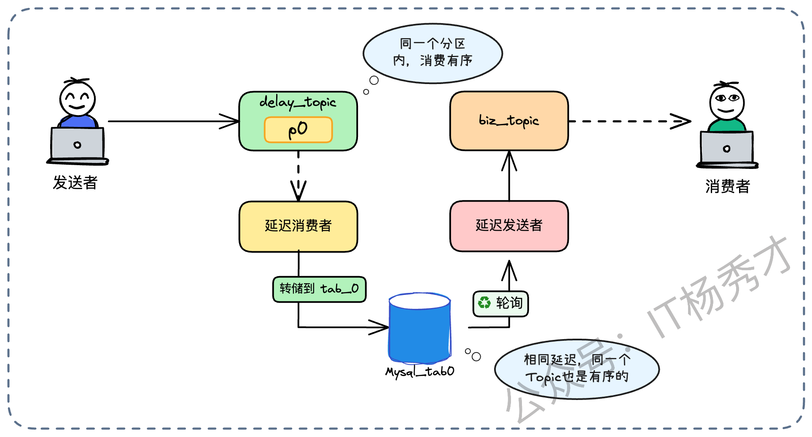

今天我们来聊一个消息队列问题，“如何在 Kafka 中实现延迟消息？”

这其实是一道非常见功底的题目。为什么这么说？因为 Kafka 原生并不支持延迟消息，这是它的基因决定的——它是一个追加写的日志系统（Append-only Log），设计之初就是为了追求极致的顺序读写和吞吐量，而不是为了灵活的随机读取。要在这样一个要求“实时性”和“顺序性”的系统上“魔改”出延迟功能，就如同给一辆 F1 赛车装上倒挡，考验的不仅仅是你对 Kafka 原理的理解，更是你面对业务痛点时的架构设计能力、方案权衡能力以及对分布式系统一致性、可用性的深度思考。

今天，我就不做简单的知识搬运工了。接下来我就结合我过往在电商交易核心系统的实战经验，带你把这个话题彻底拆解开来。我们要聊的，不仅仅是一个功能的实现，更是一场关于存储选型、分布式一致性、高并发优化的架构思维风暴。

## **1. 什么是延迟消息？**

在切入正题之前，我们必须先搞清楚一个核心问题：什么是延迟队列？

很多同学容易把“延迟队列”和“延迟消息”混为一谈。从数据结构的角度看，延迟队列（Delay Queue）是一种特殊的队列，里面的元素带有过期时间，时间未到，谁也拿不走。Java JDK 里的 `DelayQueue` 就是典型代表，它基于堆排序，保证队头永远是最先过期的元素。

但在分布式架构的语境下，我们讨论的“延迟消息”，通常是指基于消息中间件的一种特殊能力：**生产者把消息发出去后，不希望下游立刻消费，而是希望消息在中间件里“暂存”一段时间（比如 30 分钟），倒计时结束后，自动投递给消费者。**

最经典的场景，莫过于电商里&#x7684;**“订单超时取消”**。用户下单锁库存，但迟迟不支付。我们不能让库存一直被占着，也不能每秒钟去轮询数据库（那是对数据库的 DDoS 攻击）。最优解就是发一条 30 分钟的延迟消息，时间一到，消费者收到消息去检查订单状态，没付钱就直接关单回库。

## **2. 其他 MQ 是怎么解决的？**

在面试中，如果你上来就死磕 Kafka，可能会显得视野不够开阔。一个成熟的架构师，通常会先横向对比，看看业界其他方案是怎么做的。如果你的公司技术栈允许，选择原生支持延迟消息的 MQ 往往是成本最低的。

### **2.1 RabbitMQ 的“插件黑科技”**

RabbitMQ 社区提供了一个非常有名的插件：`rabbitmq_delayed_message_exchange`。很多中小厂喜欢用它，因为简单，开箱即用。



这个插件的实现思路非常“野路子”。它并没有修改队列的 FIFO 特性，而是自定义了一种特殊的 Exchange（交换机）。

当你把消息发给这个 Exchange 时，它并不会像普通交换机那样，查路由表、找队列、投递消息。相反，它会把消息“扣留”下来。它利用了 Erlang 语言内置的一个名为 **Mnesia** 的数据库。

**这里需要稍微展开一下 Mnesia 的机制**：你可以把 Mnesia 想象成一个轻量级的、嵌入式的数据库，它支持 RAM（内存）和 Disc（磁盘）两种存储模式。当消息带有 `x-delay` 头时，插件会将消息体序列化后存储在 Exchange 所在节点的 Mnesia 表中。

只有当消息上的延迟时间到了，这个插件的定时器触发，才会把消息从 Mnesia 里捞出来，正式投递到真正的队列中，这时候消费者才能看到。

但作为架构师，你必须看到它的**致命弱点**，这决定了它能不能上核心生产环境：

* **数据安全隐患**：消息在被投递前，是存在节点本地的 Mnesia 里的。RabbitMQ 的高可用队列（Mirrored Queues）保护的是队列里的数据，而不是 Exchange 里的数据。如果这个节点还没来得及把 Mnesia 的数据刷到磁盘就宕机了，或者磁盘损坏了，那这些还没到期的消息就彻底丢了。

* **性能天花板**：Mnesia 并不是为海量数据设计的。它在处理大量并发写入和过期扫描时，性能远不如专业的存储引擎。如果你的业务量巨大，延迟消息堆积成山，这个插件的性能会急剧下降，甚至拖垮整个 RabbitMQ 节点。所以，**高并发、大数据量场景下，严禁使用此方案。**

### **2.2 RabbitMQ 的“死信”玩法**

除了插件，RabbitMQ 还有一个经典的“土办法”，就是利用 TTL（生存时间）配合死信队列（DLX）。



这个逻辑其实是把“死信”变成了“活信”。我们创建一个没有任何消费者的队列，姑且叫它 `delay_queue`。我们给这个队列——或者给发到这个队列的消息——设置一个过期时间，比如 5 分钟。

消息进了这个队列，因为没人消费，只能干等着。5 分钟一到，消息“死”了。这时候，RabbitMQ 的死信机制（DLX）就会触发。它会把这条过期的消息，自动转发给一个预先配置好的死信交换机（Dead Letter Exchange），这个交换机再把消息路由到一个正常的业务队列 `biz_queue` 里。

消费者守在 `biz_queue` 这一头，拿到消息的时候，刚好过去了 5 分钟。

这个方案虽然避免了插件的单点风险，但它太**死板**了。TTL 通常是设置在队列上的。如果你既有 3 分钟的延迟，又有 10 分钟的延迟，你就得建两个队列。如果业务方说：“我要一个随机延迟时间，比如 3 分 25 秒”，那这个方案就直接宣告破产，因为你不可能为每一秒都建一个队列。

## **3. 面试前的战略准备**

在正式深入 Kafka 方案之前，我建议大家先梳理一下自己公司的业务背景。这一步至关重要，它决定了你选择方案的合理性。

你得搞清楚几个问题：

* 你们公司真的有延迟消息的刚需吗？

* 现有的中间件是 Kafka 吗？能不能换？

* 延迟消息的量级是多少？QPS 是几百还是几万？

* 延迟的时间跨度是固定的（如 15 分钟），还是随机的？

面试的时候，话术可以这样引导：

* “在介绍我的项目时，虽然我们用的是 Kafka，但涉及到订单超时这种业务，由于 Kafka 原生不支持，我们做了一套架构方案……”

* 或者反过来：“当时选型时，考虑到 Kafka 在延迟消息上的短板，而我们的业务又强依赖这个功能，所以我们权衡之后选了 RocketMQ……”

## **4.  基础方案：从简单到原生**

接下来，我们进入实战环节。针对 Kafka，我有几套不同维度的解决方案，丰俭由人。

### **4.1 基于定时任务**

这是最简单、最直观，也是最容易被忽视的方案。

既然 Kafka 存不住延迟消息，那我们就找个能存的地方。比如，业务方产生了一个“20 分钟后发送”的请求，我们不要直接发给 Kafka，而是把它注册到一个支持持久化的定时任务平台（比如 Quartz 集群，或者由 XXL-JOB 调度的服务）。



这个定时任务系统的逻辑很简单：它就是一个倒计时器。当 20 分钟时间一到，调度器触发任务，把这条消息作为普通的生产消息，发送给 Kafka。这时候，下游的消费者就能正常处理了。

怎么向面试官推销这个方案？

> 你可以坦诚地说：“在业务量不大、对延迟精度要求不苛刻的初期阶段，我们采用了最稳妥的定时任务方案。它的好处是架构简单，利用了现有的任务调度中间件，开发成本极低。”

然后话锋一转，指出缺点：

> “但这个方案的短板也很明显，那就是并发能力不足。绝大多数定时任务系统是为‘低频、批处理’设计的，比如每天凌晨跑报表。如果你让它去承载每秒几万单的实时延迟触发，数据库和调度线程池瞬间就会被打爆。所以，对于高并发场景，我们必须寻求更原生的解决方案。”

### **4.2 基于分区的“时间桶”策略**

如果不想依赖外部系统，想在 Kafka 内部闭环解决，我们可以利用 Kafka 的**分区（Partition）**&#x673A;制来做文章。



这个方案的核心思想是：**把不同的分区，当成不同的‘时间桶’来用。**

我们可以创建一个专门的 `delay_topic`。在这个 Topic 下，我们人为地约定分区的含义：

* **分区 0**：专门存放延迟 **1 分钟**的消息；

* **分区 1**：专门存放延迟 **5 分钟**的消息；

* **分区 2**：专门存放延迟 **30 分钟**的消息。

业务发送端在发消息时，需要根据业务逻辑（比如是短信提醒还是超时关单），判断需要的延迟时间，然后把消息路由到对应的分区里。

而在消费端，我们需要实现一个特殊的“转发服务”。这个服务组建一个消费者组，组内的每个消费者**只**负责一个特定的分区。

比如消费者 A，它被分配了分区 2（30 分钟延迟）。当它拉取到一条消息时，它会解析消息体，发现这是个 30 分钟延迟的消息。然后它会看一眼当前时间，如果还没到点，它就**原地等待**；如果时间到了，它就把这条消息转发给真正的业务 Topic。

思考发散：为什么是用“不同分区”而不是“不同 Topic”？

这是一个很好的架构思考题。除了分区方案，我们当然也可以创建 delay\_1m\_topic、delay\_5m\_topic。

用多 Topic 的好处是隔离性更好，消费者逻辑更简单，不需要手动分配分区。但缺点是，如果延迟档位很多，会产生大量的 Topic，增加 Kafka Controller 的元数据管理负担。而用单 Topic 多分区，管理起来更收敛，但消费者逻辑稍显复杂。通常为了运维方便，我们更倾向于单 Topic 多分区的模式。

这个方案听起来很完美，但在落地实施时，有两个巨大&#x7684;**“深坑”**，这也是面试中能体现你技术深度的关键点。

#### **4.2.1 难点 一：重平衡问题**

大家知道，Kafka 的消费者模型里有一个核心机制：心跳与活跃检测。

消费者需要定期向 Coordinator 发送心跳（heartbeat.interval.ms），证明自己还活着。更重要的是，消费者必须在 max.poll.interval.ms 配置的时间内完成消息的处理并再次发起 poll 请求。

在我们的场景里，消费者 A 拉到消息后，因为时间没到，它可能会选择休眠（Sleep）来等待。如果这个延迟时间是 30 分钟，而 Kafka 默认的 poll 间隔上限只有 5 分钟，问题就大了。



Coordinator 会认为这个消费者“死”了（因为迟迟没有发起下一次 poll），于是触发 **Rebalance**。它会把分区 2 剥夺，尝试分配给组里的其他消费者。而那个“假死”的消费者 A 醒来后，发现自己负责的分区已经没了，之前的等待全部白费，整个消费者组也会陷入不断的重平衡震荡中。

**Pause & Resume**

为了解决这个问题，我们在代码层面绝对不能傻傻地 `Thread.sleep`。我们需要利用 Kafka Consumer 提供的流控 API。

这里我给出一个简单的伪代码逻辑，大家可以感受一下：

```java
// 伪代码示例：安全的延迟消费循环
while (true) {
    // 1. 拉取消息
    ConsumerRecords<String, String> records = consumer.poll(Duration.ofMillis(100));
    
    for (ConsumerRecord record : records) {
        long delayTime = parseDelayTime(record);
        long waitTime = delayTime - System.currentTimeMillis();
        
        if (waitTime > 0) {
            // 2. 关键一步：暂停拉取
            // 告诉 Kafka 客户端：暂停这几个分区的 fetch，但心跳线程继续跑！
            // 这样 Coordinator 就不会认为我们“死”了
            consumer.pause(consumer.assignment());
            
            // 3. 安全休眠
            // 这里的 sleep 不会影响心跳发送，因为心跳通常由后台线程处理
            try {
                Thread.sleep(waitTime);
            } catch (InterruptedException e) {
                // 处理中断逻辑
            }
            
            // 4. 恢复拉取
            consumer.resume(consumer.assignment());
        }
        
        // 5. 转发消息
        forwardToBizTopic(record);
    }
}
```

这一步 `consumer.pause()` 非常关键。它仅仅是暂停了数据的获取，但后台的心跳线程依然在勤恳地工作，告诉 Coordinator “我还活着，别踢我”。这个知识点非常隐蔽，是区分普通开发者和高级玩家的分水岭。

#### **4.2.2 难点二：一致性问题**

第二个坑在于数据处理的顺序。我们的转发服务要做两件事：**转发消息**给业务 Topic，**提交 Offset** 给 Kafka。这中间存在一个原子性问题。



路径 A：先提交 Offset，再转发。

如果 Offset 提交成功了，但在转发的一瞬间，服务宕机了。重启后，因为 Offset 已经提交，这条消息就不会再被拉取。结果就是：消息丢了。这在金融或订单场景下是绝对不可接受的。



路径 B：先转发，再提交 Offset。

如果转发成功了，但在提交 Offset 之前宕机了。重启后，消费者会重新拉取这条消息，并再次转发。结果就是：消息重复。业务下游会收到两条一模一样的订单取消请求。

架构师的判断：

在分布式系统中，宁可重复，不可丢失（At Least Once）。所以我们必须选择路径 B。

这也引出了一个必须强调的结论：下游业务消费者必须实现幂等性。无论是为了应对这里的重复转发，还是应对网络抖动造成的重发，幂等设计都是系统健壮性的基石。

## **5. 高阶方案：基于 MySQL 的极致优化**

> 如果面试官继续追问：“我的业务场景很复杂，延迟时间是随机的（不支持固定分区），而且 QPS 极高，你这几套方案都扛不住，怎么办？”

这时候，前面的方案确实都捉襟见肘了。我们需要引入更强大的存储引擎——数据库，来构建一个通用的、企业级的延迟消息服务。



这个方案的架构更为宏大，我们引入了几个核心角色：

1. **Delay Topic（入口）**：这是所有延迟消息的蓄水池。业务方不管延迟多久，先把消息发到这里。

2. **Delay Consumer（搬运工）**：它负责从 Kafka 拉取消息，解析出元数据（尤其是执行时间），然后把消息写入到后端存储（MySQL）中。

3. **MySQL（持久化存储）**：这是整个方案的心脏，承载所有“未到期”的消息。

4. **Delay Sender（调度员）**：这是一个扫描服务，它不断轮询数据库，查找那些“执行时间 <= 当前时间”且状态为“未发送”的消息。一旦捞到，就把它发给真正的 `biz_topic`，并更新数据库状态。

这个架构的逻辑很清晰，但它的死穴也很明显：MySQL 的性能瓶颈。

在高并发场景下，海量的写入请求加上高频的轮询扫描，分分钟就能把 MySQL 打挂。所以，这个方案的成败，全在于如何对 MySQL 进行极致的性能压榨。这也是你展示架构功力的时刻。

### **5.1 分区表与“表轮转”策略**

延迟消息有一个非常鲜明的特点：**时效性极强**。我们只关心“未来”的数据，一旦消息被投递，它就成了毫无价值的“历史尘埃”。

针对这个特点，我们可以利用 MySQL 的**分区表**特性。我们可以按时间维度（比如按小时、按天）对表进行物理分区。这样，在扫描时，我们只需要扫当前时间片的分区，效率极高。而对于过期的历史分区，我们可以直接使用 `DROP PARTITION`，这比逐行 `DELETE` 快无数倍，还不会产生磁盘碎片。

更进一步，我们可以采用“**表轮转（Table Rotation）”**&#x7684;策略，或者&#x53EB;**“双 Buffer”**&#x7B56;略。


比如我们设定延迟不超过 24 小时。我们可以准备两张表：tab\_0 和 tab\_1。

* 今天（奇数日），所有的写操作都进 `tab_0`，调度员也只扫 `tab_0`。

* 明天（偶数日），立刻切换到 `tab_1`。

* 在切换的瞬间，`tab_0` 里的数据理论上都已经过期并发走了。我们可以直接对 `tab_0` 执行 **`TRUNCATE`** 操作。

为什么是 TRUNCATE 而不是 DELETE？

从数据库底层来看，DELETE 是 DML 操作，它会一行行删除数据，并且为了保证事务回滚，会产生大量的 Undo Log，同时还会造成索引碎片，甚至可能导致页分裂。而 TRUNCATE 是 DDL 操作，它直接丢弃表的数据文件重新创建一个新的，速度快，零负担。这是一把重剑，瞬间清空百万级数据，为后天做准备。

### **5.2 分库分表与“轮询写入”**

如果单表优化到了极致，还是扛不住每秒几万的并发写入，那就必须祭出分布式数据库的法宝——**分库分表**。

通常的分库分表，我们是按业务 ID（比如 OrderId）取模来路由的。但在延迟消息这个场景下，这样做有隐患。

想象一下，如果某个大客户（Big Key）发了海量延迟消息（比如双十一某个大主播的直播间订单），按 ID 取模会导致所有数据都压在某一张表上，造成严重的数据倾斜，这张表会成为整个系统的短板，导致 CPU 飙升。

在这里，我们要采用一种反常规的策略：轮询写入（Round-Robin）。

我们不关心消息属于哪个业务，只关心把数据库的 IO 打满且打匀。

假设我们分了 32 张表。

* 第 1 条消息，无脑写表 1；

* 第 2 条消息，无脑写表 2；

* ……

* 第 32 条消息，写表 32；

* 第 33 条消息，又回到表 1。



这样做的好处是惊人的：无论业务流量如何波动，这 32 张表的负载永远是绝对均匀的，没有任何热点。我们的扫描服务（Delay Sender）只需要开启多线程，并发地去扫这 32 张表，吞吐量直接翻倍。

### **5.3 消息有序性的回归**

采用了轮询写入后，虽然性能上去了，但带来了一个副作用：乱序。

同一个订单的“创建延迟”和“取消延迟”可能落到了不同的表里，扫描时可能会先扫到后面的消息。如果业务方强依赖消息顺序，这就不行了。

为了解决这个问题，我们需要在架构上做一点妥协。

我们可以在分库分表算法上做文章：确保同一个 biz\_topic 的消息，或者同一个 Partition Key 的消息，总是落到同一张物理表里。



虽然这可能会牺牲一点负载均衡（如果某个 Topic 特别热），但它保证了局部有序性。在写入 Kafka 的 delay\_topic 时，我们也按照同样的规则选择分区，这样就形成了一条从 Kafka 分区 -> 数据库表 -> 下游 Topic 的有序通道。

### **5.4 批量操作与并发控制**

最后，千万别忘了数据库操作的基本准则：**能批量，绝不单条**。

* **批量写入**：Delay Consumer 在拉取到 Kafka 消息后，不要来一条插一条。在内存里攒个几百毫秒，或者攒够 100 条，拼成一个巨大的 `INSERT INTO ... VALUES (...), (...)...` 语句一次性推给 MySQL。这能极大减少网络 RTT 和数据库事务开销。

* **批量更新与乐观锁**：Delay Sender 在扫描时，为了避免多个调度线程抢同一个任务，通常会使用**乐观锁**。

```sql
-- 调度员扫描时，先抢占任务
UPDATE delay_table 
SET status = 2, sender_ip = '192.168.1.1' 
WHERE execute_time <= NOW() AND status = 0 
LIMIT 100;

-- 然后查出刚刚抢到的任务进行发送
SELECT * FROM delay_table WHERE status = 2 AND sender_ip = '192.168.1.1';
```

* 这种方式利用了数据库的行锁，既保证了并发安全，又利用批量更新提升了性能。

## **6. 小结**

回顾我们的方案演进之路，我们从最简单的定时任务，聊到了 Kafka 原生的分区策略，最后演进到了基于 MySQL 分库分表的高可用架构。

你会发现，技术方案没有绝对的银弹。

* 如果你的业务是起步阶段，量小图快，**定时任务**就是最好的选择。

* 如果你的业务量中等，且延迟时间固定，**Kafka 分区方案**性价比最高，但一定要小心 Rebalance 和一致性的坑。

* 如果你面对的是海量并发、随机延迟的复杂场景，那么**基于 MySQL 的分库分表 + 轮询写入 + 表轮转**，才是你应该拿出来的架构利剑。

在面试中，能把这些方案的演进路径、取舍理由以及底层原理（如 Rebalance 机制、Truncate 原理）讲得头头是道，你给面试官留下的印象绝对是深刻的。

希望这篇文章能帮你把“延迟消息”这个知识点彻底吃透，下次在面试或架构设计时，能胸有成竹地打出这一套组合拳！

## **资料分享**
随着AI发展越来越快，AI编程能力越来越强大，现在很多基础的写接口，编码工作AI都能很好地完成了。并且现在的面试八股问题也在逐渐弱化，**面试更多的是查考候选人是不是具备一定的知识体系，有一定的架构设计能力，能解决一些场景问题**。所以，不管是校招还是社招，这都要求我们一定要具备架构能力了，不能再当一个纯八股选手或者是只会写接口的初级码农了。这里，秀才为大家精选了一些架构学习资料，学完后从实战，到面试再到晋升，都能很好的应付。**关注秀才公众号：IT杨秀才，回复：111，即可免费领取哦**


<div style="background-color: #f0f9eb; padding: 10px 15px; border-radius: 4px; border-left: 5px solid #67c23a; margin: 20px 0; color:rgb(64, 147, 255);">

## <span style="color: #006400;">**学习交流**</span>
<span style="color:rgb(4, 4, 4);">
> 如果您觉得文章有帮助，可以关注下秀才的<strong style="color: red;">公众号：IT杨秀才</strong>，后续更多优质的文章都会在公众号第一时间发布，不一定会及时同步到网站。点个关注👇，优质内容不错过
</span>


</div>
