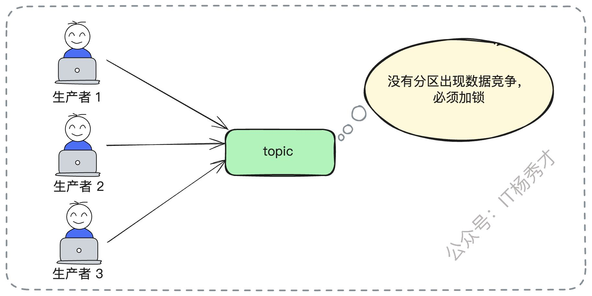
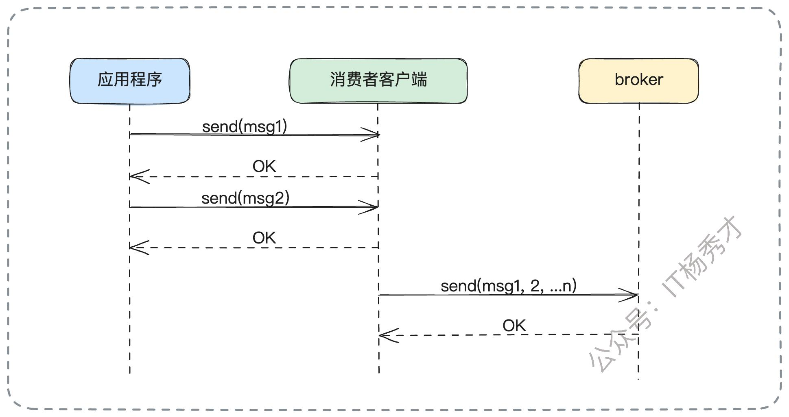
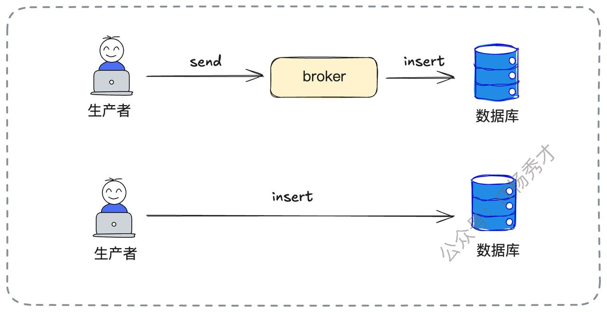
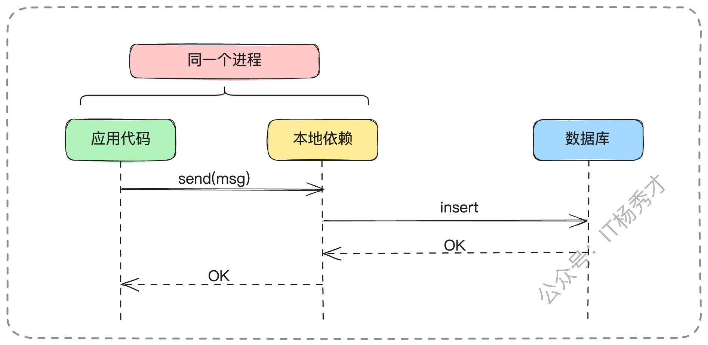
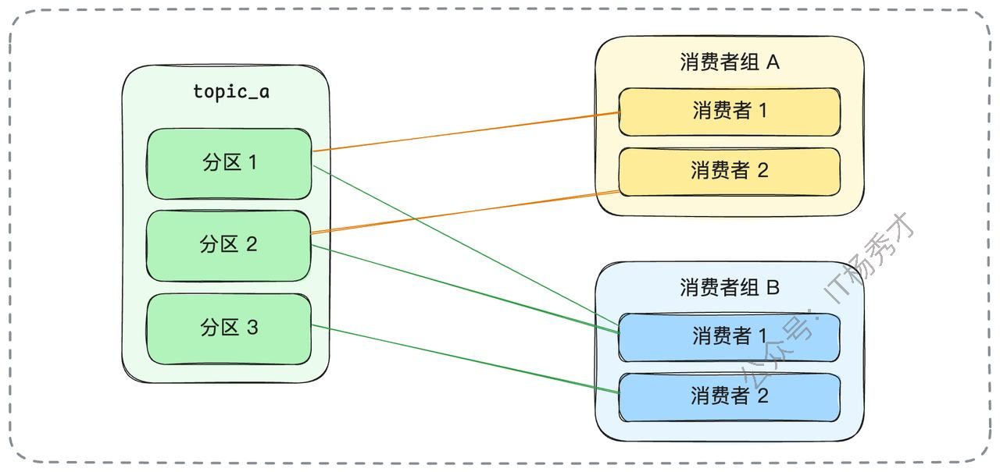
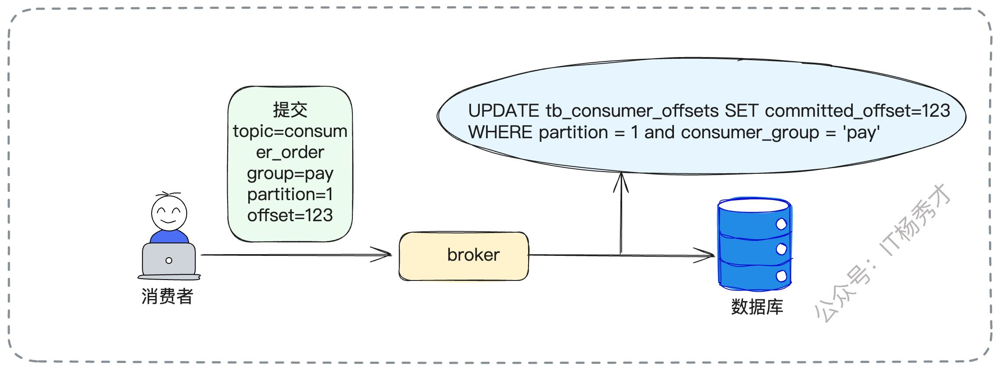
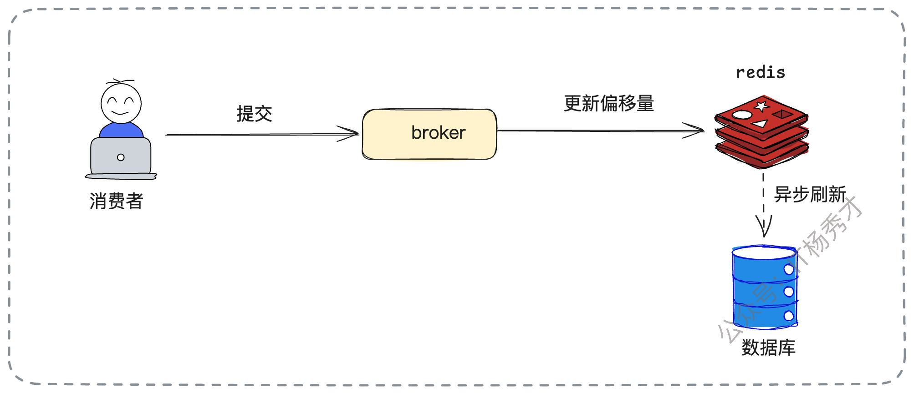
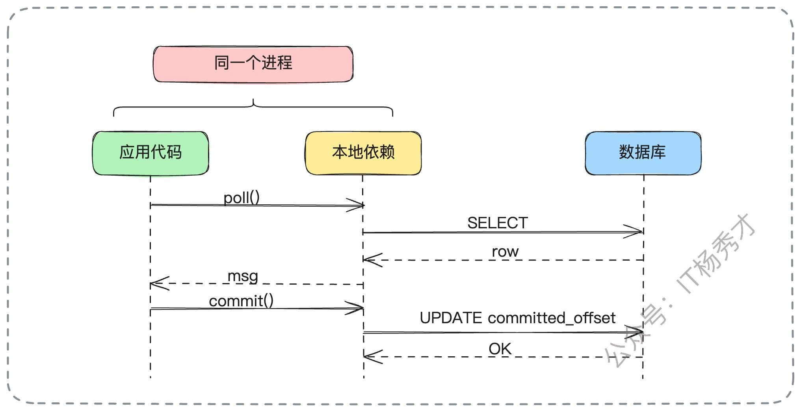
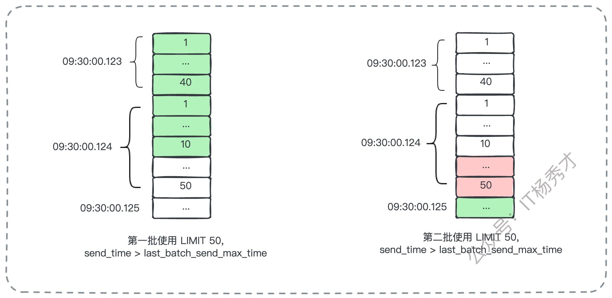
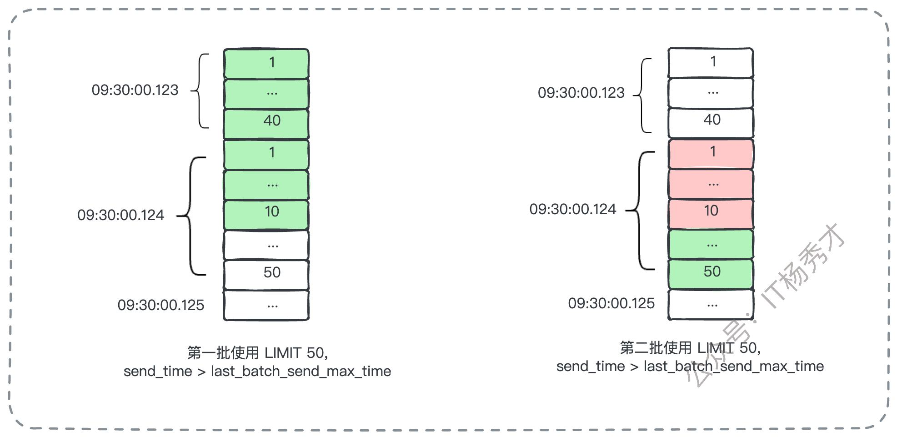

大家好，我是秀才。今天，我们来探讨一个在面试中非常高频的系统设计问题：**如果让你从零开始设计一个消息队列，你会如何设计它的架构？**

这是一个非常全面的系统设计类问题，我们就以Kafka来作为参照实现。这个问题它不仅考验你对 Kafka 这类成熟消息队列产品的理解深度，更深层次地，它考察的是你对分布式系统设计的宏观把握和细节认知。要在短短几分钟内清晰、系统地阐述清楚，确实是个不小的挑战。如果事先没有深入思考和准备，很可能只能泛泛而谈生产者、消费者的基本概念，难以形成一个有说服力的、成体系的回答。

因此，本文将结合坚实的理论与一个具体的落地实践方案，带你彻底梳理设计一个消息队列所需攻克的全部关键难题。通过这篇文章，我们不仅能回答“如何设计消息队列”，还能触类旁通，应对以下这些衍生问题：

* Kafka 为什么需要引入 Topic 的概念？

* 为什么 Topic 下还需要划分分区？只有 Topic 行不行？

* 将 Topic 的分区分散在不同 Broker 上，其背后的设计考量是什么？

* 消费者组（Consumer Group）这一概念的价值何在？

## **1. 面试准备**

在深入探讨设计之前，我们先要明确面试官的意图。他并非真的要你现场写出一个工业级的消息队列，而是希望通过这个问题，考察你作为设计者的全局观和技术洞察力。

如果你所在的公司并未使用任何主流的消息队列中间件，那么深入了解现有系统是如何实现“**解耦、异步、削峰**”这三大目标的，将是一个极佳的切入点。即便是一些历史悠久的系统，它们在 Kafka 等现代消息队列诞生之前所采用的解决方案，也同样蕴含着宝贵的设计智慧。

此外，你也可以扩展视野，研究以下几种常见的“准消息队列”实现，它们能极大地丰富你的知识体系：

1. **基于内存的队列**：这通常用于单进程内的事件驱动模型，或者在单元测试中作为真实消息队列的轻量级替代品（Mock）。

2. **基于TCP的直连模式**：这种模式下没有中心化的 Broker 节点，生产者直接与消费者建立长连接并推送消息，是一种去中心化的实现。

3. **基于本地文件的队列**：生产者将消息持久化到本地磁盘文件，消费者则从文件中顺序读取。这种方式在日志收集等场景中很常见。

这些实现虽然形态各异，但其核心都离不开“**发布-订阅**”这一经典模式。理解它们的优缺点，能让你对消息队列的设计有更全面的认识。

接下来，我将围绕 `Topic`、`Broker`、`生产者` 和 `消费者` 这四大核心要素，并以一个“**基于MySQL构建消息队列**”的方案为例，为你抽丝剥茧地展开整个设计过程。

## **2. Topic与分区设计**

几乎所有现代消息队列都离不开 Topic 和分区的概念，这套设计已经受了实践的千锤百炼，被证明是行之有效的。因此，我们的设计也将沿用这一经典模型。

首先，**Topic 的存在是绝对必要的，它在逻辑上为消息进行了分类，划分了不同的业务场景**。例如，“用户下单日志（create\_order）”和“支付成功通知（payment\_success）”就应该属于两个泾渭分明的 Topic。

接下来的关键问题是：Topic 内部是否需要进一步划分？答案是肯定的，这就是引入 **分区（Partition）** 的根本原因。

假设没有分区，一个 Topic 就对应一个单一的、线性的队列。这将带来致命的性能瓶颈：所有的生产者在发送消息时，都必须竞争同一把锁来向队列尾部写入数据；同理，所有消费者也需要竞争同一把锁来从队列头部读取数据。这种设计将导致严重的锁竞争和完全的串行化执行，系统的并发能力会大打折扣，完全无法满足互联网业务高吞吐量的需求。



因此，**引入分区是提升并发能力、实现水平扩展的关键**。一个 Topic 被划分为多个分区，每个分区都可以被视为一个独立的、有序的小队列。这样，多个生产者可以同时向不同的分区写入消息，实现了真正的并行处理，极大地提升了整个系统的写入吞吐量。

**那么，如何将这个模型落地到MySQL上呢？**

一个简单而有效的设计是：**一个 Topic 对应一张逻辑表，而 Topic 内的每个分区则对应一张物理表**。

举个具体的例子，我们有一个名为 `create_order` 的 Topic，它有3个分区。那么在数据库层面，我们就会创建三张物理表：`create_order_0`、`create_order_1` 和 `create_order_2`。在每一张物理表中，我们都可以利用MySQL的自增主键ID，这个ID便天然地、完美地对应了 Kafka 中的消息偏移量（Offset）。

此时，面试官很可能会追问：“这个设计听起来不错，但为什么不把所有 Topic 的消息都存放在一张大表里，然后额外增加一个 `topic_name` 字段来区分呢？这样不是更简单吗？”

你可以从 **性能** 和 **隔离性** 这两个核心维度来有力地回应：

* **性能瓶颈**：单一的大表在面对高并发、海量数据的冲击时，很快会成为整个系统的性能瓶颈。其索引维护成本、锁竞争的激烈程度都会急剧上升。即便对其进行分库分表，也可能需要拆分出成百上千张物理表，这在管理和维护上是一场灾难。

* **业务隔离**：Topic 天然代表了业务的逻辑边界。将不同 Topic 的数据存储在不同的物理表中，可以实现物理层面的彻底隔离。这样，任何一个业务（Topic）的流量洪峰或异常查询，都不会影响到其他业务的稳定运行，保证了系统的整体健壮性。

## **3. Broker与消息存储策略**

确定了 Topic 与分区的模型后，下一步就是如何规划和存储它们。Kafka 的一个核心设计思想是：将一个 Topic 的不同分区及其副本，尽可能地分散到不同的 Broker 节点上，以此来分散风险，实现高可用。我们的设计也应遵循此黄金原则。

为了最大化系统的可用性和容错能力，**同一个Topic的不同分区，应该被存储在不同的数据库实例上**。更进一步说，我们不仅要分表，还要实施“分库”——这里的“库”，更准确地讲，指的是独立的、物理隔离的**数据库集群（数据源）**。

沿用上面的例子，`create_order` Topic 的3个分区（`create_order_0`、`create_order_1`、`create_order_2`）可以分别部署在三个独立的MySQL主从集群上。这样做的好处显而易见：

1. **流量分散**：写入和读取的压力被均匀地分散到了多个数据库集群，避免了单点压力。

2. **故障隔离**：任何一个数据库集群的故障，最多只会影响该 Topic 三分之一的分区，保障了整体服务的可用性，不会导致整个业务中断。

此外，MySQL自身成熟的主从复制机制，天然地为我们实现了数据的冗余备份，其效果类似于 Kafka 的副本（Replica）机制。例如，我们采用一主两从的架构，就意味着每个分区都有一个主副本（Master）和两个从副本（Slave）。这让我们无需自己去实现复杂的、容易出错的主从选举（Leader Election）逻辑，大大降低了整个消息队列的实现复杂度和落地难度。

## **4. 生产者的实现与性能优化**

接下来，我们聚焦于生产者（Producer）如何将消息发送给 Broker。首先要确定的核心问题是采用“推模型”还是“拉模型”。在这个场景下，“**推模型**”无疑是更合适的选择。

**生产者应该主动将消息推送（Push）给 Broker**。原因很简单：消息的产生速率是由上游业务方决定的，Broker 无法预知何时有新消息、有多少新消息。如果让 Broker 主动去拉取（Pull），它将难以智能地控制拉取的频率和时机，不是拉取过慢导致延迟，就是拉取过频造成资源浪费，效率极其低下。

在确定了推模型后，我们可以进一步探讨如何对生产者的发送性能进行深度优化。

### **4.1 批量发送**

借鉴 Kafka 等所有成熟消息队列的成功经验，**批量发送** 是一个极其有效的优化手段。生产者可以在其内存中开辟一块缓冲区，将短时间内要发送的多条消息积累起来，然后将它们打包成一个批次（Batch），通过一次网络请求一次性发送给 Broker。



这种方式将多次零散的网络IO合并为一次大的网络IO，极大地减少了网络开销和系统调用次数，从而显著提升了发送吞吐量。

当然，我们还需要一个兜底策略：设置一个最长等待时间（类似于 Kafka 配置中的 `linger.ms`）。如果在指定时间内，缓冲区中的消息仍未凑满一个预设的批次大小，那么为了保证消息的及时性，也必须立即将当前已有的消息发送出去。这避免了消息因长时间无法凑满批次而滞留在生产者内存中，进而引发丢失的风险。

### **4.2 直连数据库写入**

在我们的MySQL方案中，消息的最终归宿是数据库。生产者发送消息存在两条可选路径：

1. 生产者 -> Broker服务 -> 数据库

2. 生产者 -> 数据库



为了追求极致的性能，我们可以设计一种更高性能的模式：让生产者**直接将消息插入（INSERT）到对应的数据库表中**。这通常通过在生产者应用中引入一个轻量级的本地SDK来实现。该SDK会封装所有底层细节：根据消息的 Topic、分区键等信息，动态解析出目标数据库集群的连接信息，获取连接，然后直接执行SQL插入操作。



这种方式省去了一次从生产者到Broker服务的网络转发开销，通信路径更短，延迟更低，性能也自然更高。同样，我们也可以在这种模式下结合SQL的**批量插入（Batch Insert）** 来进一步压榨性能，实现吞吐量的最大化。

## **5. 消费者设计与实现**

一个 Topic 的消息往往会被多个不同的下游业务所消费，例如，订单消息可能会被搜索、推荐、风控等多个系统订阅。因此，我们需要引入 **消费者组（Consumer Group）** 的概念。

一个独立的业务方就是一个消费者组，一个组内可以包含多个并行的消费者实例（Consumer）。在消费模型上，我们同样可以完全参考 Kafka 的经典设计：**在一个消费者组内，每个分区最多只能被一个消费者实例消费**。当然，一个消费者实例可以根据其负载能力，同时消费多个分区。



与生产者端相反，**消费者侧采用“拉模型（Pull）”更为合理**。因为只有消费者自己最清楚其业务处理能力和消费速率。由消费者根据自身节奏主动从 Broker 拉取消息，可以有效地进行流量控制，避免因消费能力不足导致消息在消费者内存中大量堆积，最终引发系统过载甚至崩溃。

那么，接下来的核心问题是：系统如何精确追踪每个消费者组对每个分区的消费进度呢？

### **5.1 消费进度的记录与管理**

既然我们以MySQL为基础，最直观的方式就是**用一张表来记录每个topic存储的数据，同时用一张独立的表来记录这个topic对应的消费偏移量，**&#x5373;我们可以为每个 Topic 创建一张对应的消费进度表。例如，对于`consumer_order`（消费订单） 这个 Topic，我们可以创建一张名为 `tb_consumer_offsets` 的表。

这张表的设计可以非常简洁，包含三个核心字段即可：`consumer_group`（消费者组名称）、`partition_id`（分区编号）和 `committed_offset`（已提交的偏移量）。

假设订单的消息被“支付系统（pay）”库存系统（Inventory）”两个业务方消费，那么这张 `tb_consumer_offsets` 表的数据可能如下所示：

| **consumer\_group** | **partition\_id** | **committed\_offset** |
| ------------------- | ----------------- | --------------------- |
| Pay                 | 1                 | 123                   |
| pay                 | 2                 | 456                   |
| Pay                 | 3                 | 323                   |
| Inventory           | 1                 | 723                   |
| Inventory           | 2                 | 479                   |
| Inventory           | 3                 | 987                   |

当消费者处理完一批消息并“提交（Commit）”进度时，对于 Broker 来说，其核心操作就是执行一条 `UPDATE` 语句来更新这张表中对应的 `committed_offset` 字段。



这个设计也天然地支持了**从指定偏移量开始消费**的强大功能。比如，业务方因为一次失败的上线需要回溯消费数据，只需由运维人员手动将特定分区的 `committed_offset` 更新为一个更早的值即可。

例如，将 Pay 组在分区2的消费进度重置到偏移量100：

```plain&#x20;text
-- 将消费进度重置到指定偏移量
UPDATE tb_consumer_offsets 
SET committed_offset = 100 
WHERE consumer_group = 'pay' AND partition_id = 2;
```

而消费者拉取消息的操作，则对应一条 `SELECT` 查询。例如，在重置偏移量后，拉取50条消息：

```plain&#x20;text
-- 从指定偏移量之后拉取一批消息
SELECT * FROM consumer_order 
WHERE id > 100 
LIMIT 50;
```

可以预见，每个Topic的消费者组数量是有限的，因此这张消费进度表的数据量不会很大。并且，更新操作基于主键或唯一索引，只会使用到行级锁，因此性能表现会非常好。

### **5.2 消费性能优化与权衡**

尽管直接操作数据库性能不错，但在提交操作极其频繁的场景下，仍有优化空间。一个常见的优化方案是：**使用 Redis 作为消费偏移量的一级缓存，并异步刷回数据库**。

消费者提交进度时，先快速地更新 Redis 中的值，然后由一个后台任务定期、批量地将 Redis 的数据持久化到 MySQL 中，变高频的随机写为低频的批量写。



当然，任何引入异步的设计都必须考虑其代价。这个方案的风险在于数据一致性：如果 Redis 在数据刷回 MySQL 之前突然宕机，那么最新的消费进度就会丢失。例如，数据库记录的偏移量是9500，而消费者实际已消费到10000，此时 Redis 故障，待其恢复后，消费者会从数据库中读取到旧的偏移量9500，导致从9501到10000的消息被重复消费。为了应对这种情况，**消费者业务端的逻辑必须被设计成幂等的**，这是使用该优化方案的强制前提。

和生产者一样，我们也可以为消费者提供**直连数据库拉取消息**的选项，通过本地SDK直接执行`SELECT`和`UPDATE`操作，减少网络跳数，以获得更好的性能。



## **6. 扩展功能：延迟消息实现**

我们这套基于MySQL的方案，还有一个非常大的、与生俱来的优势：**实现延迟消息功能非常简单且自然**。

我们只需在消息表中增加一个 `send_time` 字段（时间戳类型），用于记录消息的预期投递时间。消费者在拉取消息时，其查询逻辑会相应地变为：

```plain&#x20;text
-- 拉取所有到期的延迟消息
SELECT * FROM some_topic_partition
WHERE send_time <= NOW() -- 条件1: 拉取所有到期或已过期的消息
AND send_time > ?;       -- 条件2: ? 处传入上一批消息中最大的send_time，避免重复拉取
```

这里的关键在于，消费进度的凭证不再是自增ID（偏移量），而是 `send_time` 这个时间戳。消费者需要记录和提交的，是它所处理过的最后一批消息中的最大时间戳。

然而，这个看似简单的方案会引入一个新的、非常棘手的复杂问题：**时间戳冲突与分页问题**。设想一个场景：数据库中，在 `09:30:00.123` 这个精确的毫秒，有40条消息需要投递；而在紧接着的 `09:30:00.124`，有50条消息需要投递。如果消费者一次拉取的批次大小是50条（LIMIT 50），那么它第一次执行查询，会获取到 `09:30:00.123` 时刻的全部40条，以及 `09:30:00.124` 时刻的前10条。此时，这批消息的最大 `send_time` 是 `09:30:00.124`。

当它下一次拉取时，查询条件会变成 `WHERE send_time > '09:30:00.124'`，这会导致 `09:30:00.124` 时刻剩下的40条消息被永久地、错误地跳过，造成消息丢失。



那如果把查询条件改为 `>=` 呢？又会导致 `09:30:00.124` 时刻已经消费过的那10条消息被再次拉取，造成重复消费。



**这个问题的标准解决方案是什么呢？**

答案是**在应用层自己实现分页逻辑，而不是完全依赖数据库的 `LIMIT`**。消费者拉取数据时，可以先按条件查询出一个稍大的、不加 `LIMIT` 的结果集（或者一个远大于批次大小的 `LIMIT`），然后在内存中进行精细化处理：

1. 顺序读取查询结果，凑够预期的50条消息，并记录下第50条消息的 `send_time`。

2. 继续向后检查结果集，如果后续消息的 `send_time` 与第50条的完全相同，则将它们也一并纳入当前批次。

3. 这样，最终返回给业务逻辑的这一个批次，可能会超过50条，但它能确保同一投递时刻的消息被完整地、原子地消费掉。

这个算法得以有效运行，是基于一个基本假设：在同一个毫秒级别的时间精度内，需要投递的消息数量通常是有限的，不会无限多。

## **7. 小结**

这套基于数据库的方案，巧妙地利用了关系型数据库的成熟能力（如事务、索引、主从复制、高可用架构）来构建一个功能完备的消息队列，从而回避了自己从头开始操作文件IO、实现零拷贝、设计存储引擎等一系列极其复杂的技术难题。最后，我们来高度梳理一下这套设计方案的核心要点，这也是你在面试中需要清晰传达给面试官的结论：

* **Topic/分区映射**：一个Topic对应一张逻辑表，一个分区对应一张物理表，用自增ID作为偏移量。

* **高可用策略**：Topic 的不同分区部署在独立的数据库主从集群上，利用数据库自身能力实现容灾和数据冗余。

* **生产者模型**：采用推模型，并通过批量发送、直连数据库等方式进行性能优化。

* **消费者模型**：采用拉模型，并为每个Topic设立独立的消费进度表来精确记录各消费组的消费进度。

* **延迟消息实现**：通过增加时间戳字段来实现，并需在应用层妥善处理时间戳冲突导致的分页问题。

通过深入、完整的探讨，能让你对消息队列的架构设计有更深刻、更体系化的理解。在面试中，展现出这种结构化的、有深度、有取舍的思考能力，远比单纯罗列零散的知识点更能打动面试官。


## **资料分享**
随着AI发展越来越快，AI编程能力越来越强大，现在很多基础的写接口，编码工作AI都能很好地完成了。并且现在的面试八股问题也在逐渐弱化，**面试更多的是查考候选人是不是具备一定的知识体系，有一定的架构设计能力，能解决一些场景问题**。所以，不管是校招还是社招，这都要求我们一定要具备架构能力了，不能再当一个纯八股选手或者是只会写接口的初级码农了。这里，秀才为大家精选了一些架构学习资料，学完后从实战，到面试再到晋升，都能很好的应付。**关注秀才公众号：IT杨秀才，回复：111，即可免费领取哦**


<div style="background-color: #f0f9eb; padding: 10px 15px; border-radius: 4px; border-left: 5px solid #67c23a; margin: 20px 0; color:rgb(64, 147, 255);">

## <span style="color: #006400;">**学习交流**</span>
<span style="color:rgb(4, 4, 4);">
> 如果您觉得文章有帮助，可以关注下秀才的<strong style="color: red;">公众号：IT杨秀才</strong>，后续更多优质的文章都会在公众号第一时间发布，不一定会及时同步到网站。点个关注👇，优质内容不错过
</span>


</div>