在消息队列领域，尤其是聊到大数据和实时流处理，Kafka 几乎是是一个必聊的话题。它以超高的吞吐量和稳定性，成为了现代数据管道的基石。很多朋友在面试或者做技术选型时，都会被问到一个经典问题：“Kafka 为什么性能这么好？”

这个问题，看似常规。但部分人其实都回答不好这个问题，原因只有一个：Kafka 为了实现高性能，采用的组合拳太多、太细，以至于很难记得全面，更别说讲透彻。

秀才今天就带你彻底拆解 Kafka 的高性能秘籍。我们会先深入它的几个核心机制，然后再站在面试官的角度，告诉你该如何把这些知识点组织成一份无懈可击的答案。

## 1. **Kafka的核心机制**

在讨论为什么快之前，我们必须先搞清楚 Kafka 是如何存放和查找消息的。这套机制本身就是高性能的基础。

### **1.1 分段与索引**

我们知道，Kafka 的消息是按 Topic 组织，一个 Topic 又分为多个分区（Partition）。但你可能不知道的是，**在分区内部，Kafka 还做了一次分段**。

你可以把一个分区（Partition）想象成一个图书馆，这个图书馆只按顺序收藏书（消息）。如果把所有的书都放在一个巨大无比的房间里，找某本书就会非常慢。Kafka 的做法是分段（Segment）。它把一个分区的日志（Log）切分成多个分段日志文件（Segment Log）。每个 Segment 就像图书馆里的一个书架。

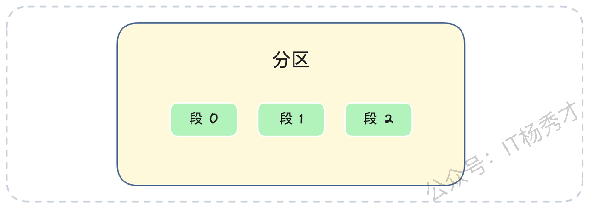

这些书架（Segment 文件）存放在以 `topic名称-分区号` 命名的房间（目录）里。更精妙的是，每个书架（Segment 文件）的命名规则。如果一个文件名为 `00000000000000050000.log`，这代表这个书架文件里存储的第一条消息，其全局偏移量（Offset）就是 50000。（在早期版本，文件名N.log代表第一条消息偏移量是N+1，现在新版本文件名就是起始偏移量）。

这个命名方式有什么好处呢？假设你要找偏移量为 65000 的消息，Kafka 根本不需要遍历，它直接使用二分查找就能迅速定位到 `...50000.log` 这个文件，因为 65000 大于 50000，但小于下一个文件的起始偏移量（比如 `...098800.log`）。

找到了书架，怎么快速找到书呢？每个 Segment 文件（`.log`）都有两个配套的索引卡片（索引文件），这两个索引文件是**必须被加载到内存中的**：

1. **偏移量索引（`.index`）**：它存储消息的相对偏移量到物理位置的映射，比如 `<15000, pos_Y>`。注意，这是个稀疏索引，它不记录每条消息，只记录部分消息。这能确保索引文件足够小，可以被完整加载到内存中。

2. **时间戳索引（`.timeindex`）**：同理，它存储时间戳到物理位置的映射，用于按时间查找。

我们来看一个实际的目录结构：

```plain&#x20;text
// 假设这是 topic-order, partition-0 的目录
00000000000000000000.log
00000000000000000000.index
00000000000000000000.timeindex
// ...
00000000000000050000.log
00000000000000050000.index
00000000000000050000.timeindex
// ...
00000000000000098800.log
00000000000000098800.index
00000000000000098800.timeindex
```

**我们来模拟一次查找，比如查找偏移量为 65000 的消息：**

1. **定位目录**：找到 `topic-order_0` 目录。

2. **定位文件**：通过二分查找文件名，确定 `65000` 落在 `...50000.log` 这个 Segment 中（因为它大于等于 50000，且小于 98800）。

3. **定位位置**：

   * 在内存中查询 `...50000.index` 文件（也是二分查找）。我们要找的相对偏移量是 `65000 - 50000 = 15000`。

   * **情况A（命中）**：如果索引里刚好有 `<15000, pos_Y>` 这条记录，太好了，直接去 `.log` 文件的 `pos_Y` 位置读取消息。

   * **情况B（未命中）**：如果没找到 15000，就找到比它小的、最接近的索引项，比如 `<14980, pos_Z>`。然后从 `.log` 文件的 `pos_Z` 位置开始，顺序扫描，直到找到偏移量为 65000 的消息。

这个“目录 -> 文件 -> 索引 -> 位置”的查找流程，利用了内存+二分查找，所以即使日志文件非常大，查找效率也极高。

### **1.2 零拷贝**

零拷贝是 Kafka 性能的一大杀器，也是中间件通用的优化手段。要理解零拷贝，我们先看传统的数据拷贝是怎么做的。假设一个程序（比如 Kafka）要把磁盘上的数据发送到网络上（比如给消费者）。

**传统I/O的四次拷贝与四次切换：**

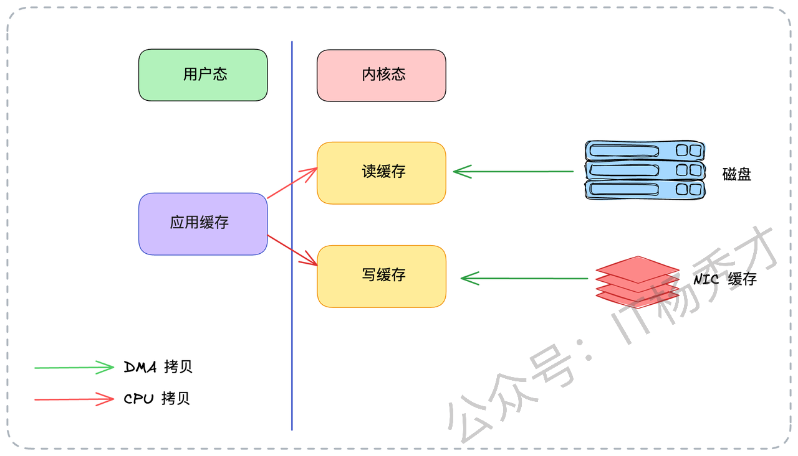

1. **第1次拷贝（DMA）**：应用程序发起 `read()` 系统调用，陷入内核态。操作系统发起 DMA（直接内存访问）拷贝，把数据从**磁盘**读到**内核态缓冲区**（Page Cache）。

2. **第2次拷贝（CPU）**：数据从**内核态缓冲区**拷贝到**用户态应用缓冲区**（比如 Kafka 程序的内存）。`read()` 返回，从内核态切换回用户态。

3. **第3次拷贝（CPU）**：应用程序发起 `write()` 系统调用，再次陷入内核态。CPU 再把数据从**用户态应用缓冲区**拷贝回**内核态的 Socket 缓冲区**。

4. **第4次拷贝（DMA）**：操作系统发起 DMA 拷贝，把数据从**Socket 缓冲区**发送到**网卡**。`write()` 返回，再次切换回用户态。

在这个过程中，数据在内核态和用户态之间来回切换，发生了 **2 次 CPU 拷贝**，以及 **4 次上下文切换**（用户态与内核态的切换）。

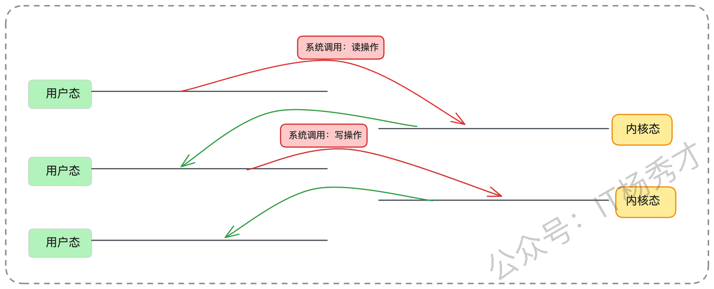

**Kafka 的零拷贝方案**

Kafka 巧妙地使用了 Linux 的 `sendfile` 系统调用，直接在内核态完成了数据传输。

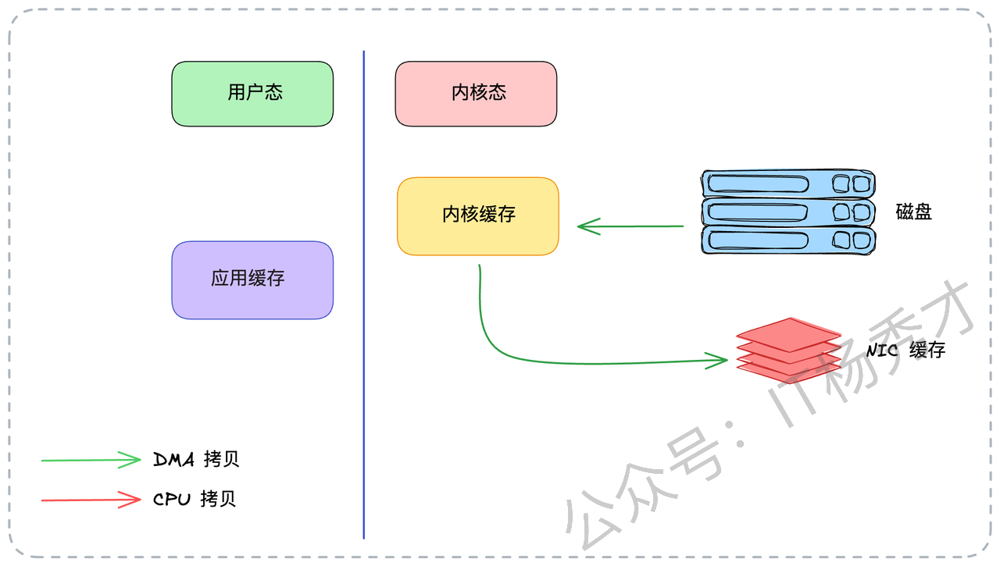

1. 应用程序发起 `sendfile()` 系统调用，陷入内核态。

2. **第1次拷贝（DMA）**：数据从**磁盘**读到**内核态缓冲区**（Page Cache）。

3. **第2次拷贝（DMA）**：数据**直接**从**内核态缓冲区**拷贝到**网卡**（NIC 缓存）。

4. `sendfile()` 返回，切换回用户态。

全程数据都没有进入用户态，CPU 也不再做搬运工的角色。

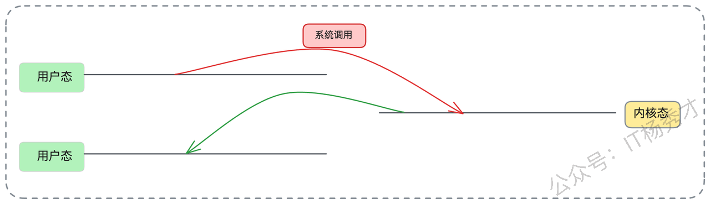

**效果立竿见影：** CPU 拷贝从 2 次降为 **0 次**，上下文切换从 4 次降为 **2 次**。对于 Kafka 这种I/O密集型、动不动就是几百MB/s 流量的系统，节省下来的 CPU 资源和切换开销是极其可观的。

### **1.3 批处理**

批量处理（Batching）是高性能系统的不二法门。生活里，我们去超市买 100 件商品，肯定是一次性结账带走，而不是一件一件地分开结账 100 次。

批处理为什么快？主要体现在两个方面：

1. **更少的系统调用**：假设你要发 100 条消息。如果一条一条发，即便用了零拷贝，你也需要调用 100 次 `sendfile()`，这对应着 100 次系统调用和 200 次上下文切换。但如果你把 100 条消息打包成一个批次，只需要 **1 次** `sendfile()` 调用，**2 次** 上下文切换。这个开销的降低是数量级的。

2. **高效利用网络带宽**：任何网络传输都有固定的协议头开销（如 TCP/IP 头、应用层协议头）。假设协议头固定是 50 字节，每条消息是 1KB。

   * 分 100 次发：(1KB + 50B) \* 100 = 100KB + 5000B 的总开销。

   * 打包 1 次发：(100KB + 50B) \* 1 = 100KB + 50B 的总开销。 后者显然快得多。

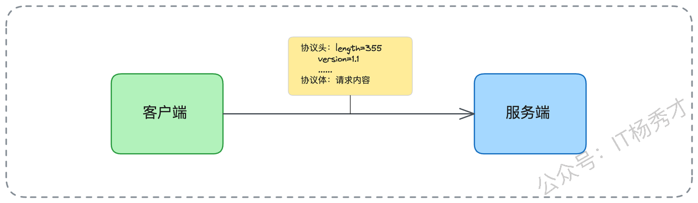

Kafka 就把这个打包的艺术运用到了极致，实现了端到端的批量处理，我们后面面试思路里会详谈。

## **2. 面试实战指南**

在准备面试之前，强烈建议你先在公司内部了解一些有关Kafka的使用信息。这些信息能让你的回答更有针对性，而不是纸上谈兵。

* **分区/Topic 数量问题**：咱们公司有没有因为分区或者 Topic 太多导致 Kafka 性能衰退的案例？如果有，当时是怎么发现和解决的？

* **硬件配置**：我们内部的 Kafka 集群用的是机械硬盘（HDD）还是固态硬盘（SSD）？这对你回答“顺序写”问题时的侧重点很有帮助。

* **性能基线**：公司内部的 Kafka 集群能撑住的并发量（或吞吐量）是多大？你负责的业务，其并发量和数据量大概占了多少？

* **技术横比**：公司内部还有没有别的中间件（比如 RocketMQ、Pulsar）也使用了类似（零拷贝、Page Cache）的优化技术？

* **业务实践**：你自己在业务开发中，有没有使用过“批量处理”来优化系统性能？（比如批量插入数据库、批量调用RPC）。如果有，具体是怎么做的？

带着这些问题的答案去面试，当聊到相关话题时，你就能自然地结合公司实践，这这样可信度更高，会非常加分。好了，万事俱备。如果面试官问你：“Kafka 为什么性能这么好？” 你就可以从以下几个方面，像剥洋葱一样，一层一层地给他讲明白。

> **请注意**：不要只是罗列零拷贝、顺序写这几个关键词，这谁都会背。你要做的是，把**每个点是什么**、**它解决了什么问题**、**它有什么代价**，都讲清楚。

### **2.1 核心一：零拷贝**

你可以先给一个定义：“Kafka 高性能的一大杀器是零拷贝（Zero Copy）技术，它指的是在数据传输过程中，CPU不参与任何数据拷贝操作。”

然后，你可以展开说明：“在 Kafka 中，消费数据（从磁盘读，发往网卡）的这个场景就完美应用了零拷贝。它通过 Linux 的 `sendfile` 系统调用实现。相比传统的I/O需要 4 次拷贝（2次DMA + 2次CPU）和 4 次上下文切换，`sendfile` 直接在内核态完成了数据传输。数据从磁盘通过 DMA 拷贝到内核的页缓存（Page Cache）后，不再拷贝到用户态，而是直接通过 DMA 从页缓存拷贝到网卡（NIC）缓存区，最后发送出去。”

最后，一定要做对比，突出优势：“这个过程，把 CPU 拷贝降为 0 次，上下文切换降为 2 次。这在 Kafka 这种高并发数据传输（消费者拉取）场景下，极大降低了 CPU 消耗和系统开销，把 CPU 资源让给了更需要的业务逻辑。”

### **2.2 核心二：操作系统页缓存**

紧接着零拷贝，你可以自然地引出 Page Cache。“Kafka 并非盲目地自己造轮子做缓存，而是非常聪明地利用了操作系统的 Page Cache（页缓存）。这至少带来两个巨大的好处：”

> “第一，**高性能写入**。生产者发送的消息，Broker 并不是立刻‘刷’（fsync）到磁盘上才返回ACK。它只是把数据写入到操作系统的 Page Cache 中，这个过程几乎等同于一次内存写入，速度快得惊人。而真正的‘落盘’操作，由操作系统在后台异步、批量地完成（flush）。这极大地提升了 Kafka 的写入吞吐量。”

> “第二，**避开JVM GC**。Kafka 是一个 Java 程序，跑在 JVM 上。如果 Kafka 自己在堆内存（Heap）中缓存大量数据，比如几十G的缓存，那么一旦触发 Full GC，系统将可能冻结几十秒甚至几分钟，这对一个高可用的中间件来说是灾难性的。而 Page Cache 是操作系统的内存（堆外内存），不受 JVM GC 的管辖，Kafka 借助它实现了高效、稳定的大内存缓存。像 MySQL、Redis 等很多I/O密集的中间件，都采用了类似的机制来利用 Page Cache。”

讲完好处，别忘了提一下它的取舍（trade-off），这会显得你思考很全面：

> “当然，这也带来一个权衡：如果数据刚写入 Page Cache，操作系统还没来得及刷盘，机器就宕机了，这部分数据会丢失。这就是性能与持久性之间的经典取舍。不过 Kafka 提供了多种ACK机制和副本同步策略来保证数据不丢。”

### **2.3 核心三： 顺序写**

大部分人对磁盘的印象是慢。我们通常说的磁盘很慢，指的是随机读写很慢，因为机械硬盘的磁头需要来回寻道。但是，磁盘的顺序写（Sequential Write）速度其实非常快，甚至可以逼近内存的写入速度。

Kafka 的设计就完美契合了这一点。它的消息存储（每个分区的日志文件）是只追加（Append-Only）的，采用了 WAL（Write-Ahead Log）思想，类似于 MySQL 的 binlog 或 Redis 的 AOF。新消息永远只在文件的末尾添加，这就是 100% 的顺序写。Broker 写入数据时，就是简单地把数据追加到文件末尾，磁头不需要移动，效率极高。

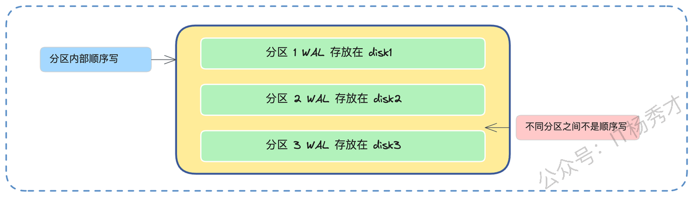

这就是为什么 Kafka 官方敢说，即使用普通的机械硬盘（HDD），也能获得极高的写入吞吐量。甚至在早期，业界做过实验，把 Kafka 的磁盘从机械硬盘换成固态硬盘（SSD），性能提升并不像预期的那么巨大。这反过来证明了顺序写对机械盘的优化有多么彻底。

### **2.4 核心四：分区过多问题（亮点）**

讲完顺序写的好处，你一定要主动抛出它的陷阱，这是一个非常漂亮的亮点。

> “不过，这个顺序写的好处是**针对单个分区**而言的。如果我们设计不当，比如在同一块磁盘上创建了 1000 个分区。当这 1000 个分区同时有数据写入时，对于操作系统和磁盘来说，它需要交替地在 1000 个不同的文件末尾写入。磁盘磁头将不得不来回跳跃，这实质上已经从顺序写退化成了随机写，导致性能急剧下降。”

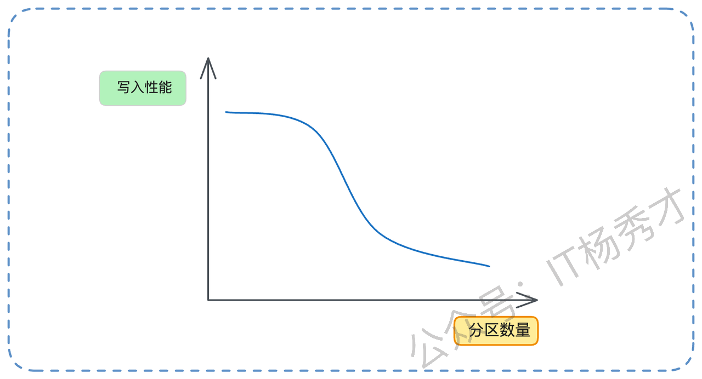

> “举个例子，假设要写入 100M 的数据。如果只有一个分区，那就是一次性顺序写入 100M。但如果有 100 个分区，每个分区写入 1M，它的性能会差很多。因为一个 Topic 至少有一个分区，所以 Topic 数量过多，同样会导致写入性能衰退。”

面试官很可能会追问：“那如果分区已经太多了怎么办？”，你可以从两个角度回答：

**如果是单个 Topic 分区过多**：比如一个 Topic 误创建了 64 个分区，但实际业务流量很小，只需要 8 个。一个临时的补救措施是，让生产者只往 0-7 号分区发送数据。当然，更彻底的方案是创建一个新的、分区合理的 Topic 来迁移。

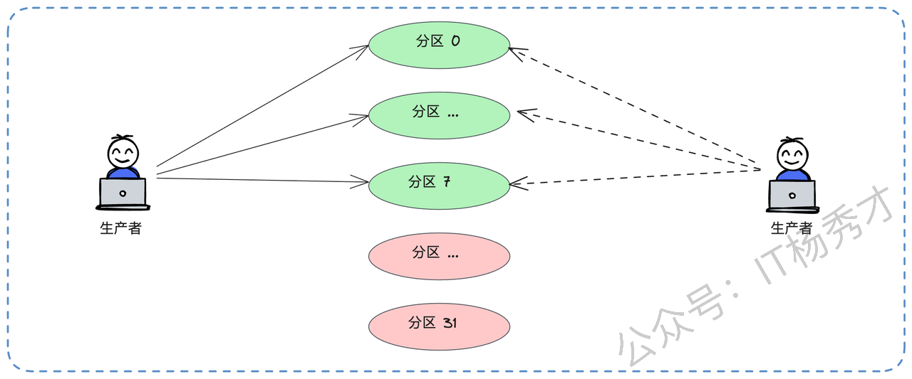

**如果是 Topic 总数过多**：比如早期设计失误，按业务线创建了 `svc_A_logs`, `svc_B_logs`, `svc_C_logs` 等上百个 Topic。可以考虑重构，合并为一个 `all_services_logs` Topic，然后在消息体内部增加一个 `serviceName` 字段来区分业务。

你还可以引用一些业界数据来佐证：“多少分区算多？这和业务有关。不过之前阿里云的团队测试过，在一个 Topic 八个分区的情况下，超过 64 个 Topic 之后，Kafka 性能就开始出现明显下降了。这可以作为一个参考。”

### **2.5 核心五：分区机制**

分区机制本身也是高性能的一个关键。它实现了缩小并发粒度。如果 Kafka 只有一个全局的 Topic，那所有的生产者写入、消费者拉取，都必须对这一个 Topic 加锁，并发度会非常低。引入分区后，并发的粒度从 Topic 级别降低到了分区级别。生产者可以同时向分区0、分区1、分区2写入，消费者也可以同时从不同分区拉取，它们之间互不干扰，极大地提升了系统的并发处理能力。

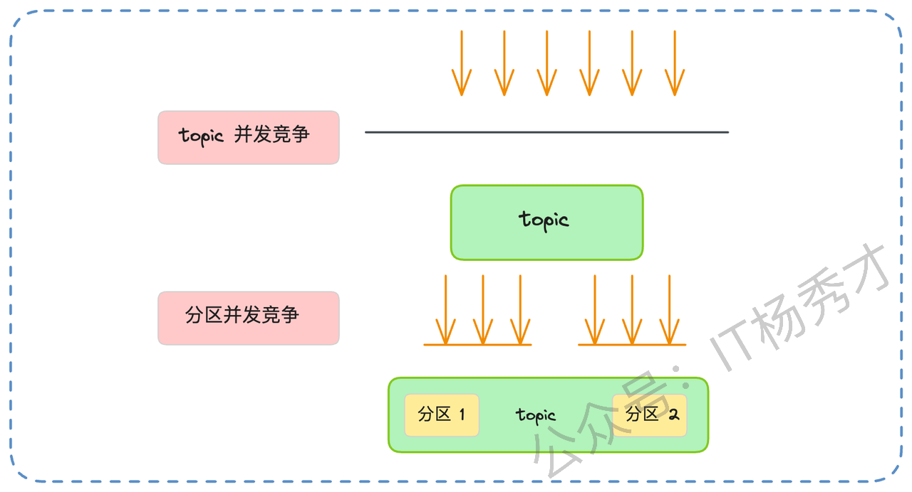

这个思想在并发优化中很常见，就是通过分片（Sharding）或者分段（Segmentation）来降低锁的粒度，提升并发能力。

### **2.6 核心六：分段与索引**

我们前面已经详细聊过了分段和索引的机制。在面试时，你不需要把所有细节都背出来，但你必须能清晰地讲出查找的流程，因为这个流程本身就是高性能的体现。

> “你可以这样概括：Kafka 的查找是一个层层递进、逐步缩小的过程。第一步，Kafka 根据 Topic 和分区号，直接定位到对应的磁盘目录。第二步，它利用段文件‘用起始偏移量命名’的特性，在目录内通过二分查找快速定位到消息所在的 Segment（.log）文件。第三步，它加载这个 Segment 对应的偏移量索引（.index）文件到内存中（这个索引是稀疏的），再次使用二分查找，快速找到离目标偏移量最近的那个索引项。”

最后一步是点睛之笔：如果索引项刚好精确命中，就直接去数据文件（.log）的对应物理位置读取。如果没有精确命中，比如要找 65000，索引里只有 64980，它会从 64980 的位置开始顺序扫描一小段数据，直到找到 65000。这个二分查找 + 局部顺序扫’的设计，非常像跳表（Skip List）的思想，在性能和索引文件大小之间取得了完美的平衡。

### **2.7 核心七：批量处理**

Kafka 把打包的艺术运用到了极致，实现了端到端的批量处理。在**生产者端**，客户端（Producer）并不会每条消息都立刻发送。它会在内存中开辟一个缓冲区，把消息攒成一个批次（Record Batch），比如攒够 16KB（`batch.size`），或者等待了 10ms（`linger.ms`），再一次性发给 Broker。

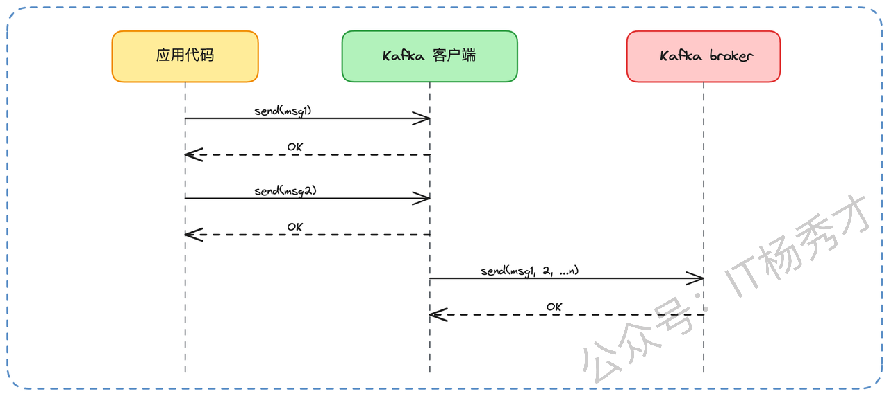

在**服务端（Broker）**，Broker 接收到这个批次后，也是**按批次**来处理和写入的。同样是顺序写，一次性写入 16KB 的数据，远比执行 100 次、每次写入几十字节的I/O操作要高效得多。

这种批量处理，为什么能极大提升性能？就像我们前面分析的，原因有两方面：

1. **大幅减少系统调用**：100条消息合并成1个批次，网络发送的 `send` 系统调用从 100 次降为 1 次，极大地减少了上下文切换开销。

2. **极大降低网络开销**：100 份网络协议头（如TCP/IP头）也减少为 1 份，节省了网络带宽。

不过，批次大小（`batch.size`）也不是越大越好。如果设置得太大，比如 10MB 一批，那生产者可能半天都凑不够一个批次，导致消息延迟很高。因此 Kafka 提供了 `linger.ms`（比如 10ms）作为**兜底技术**。它的意思是，即使批次没满，只要等待时间超过了 10ms，也会立刻发送。这就在高吞吐和低延迟之间做了一个精妙的平衡。

### **2.8 核心七：数据压缩**

最后，你可以提到压缩这个点。为了进一步降低网络传输和磁盘存储的压力，Kafka 还支持多种压缩算法（如 Gzip, Snappy, LZ4）。Kafka 的压缩机制非常聪明，它不是我们想象中‘生产者压缩 -> Broker解压 -> Broker压缩 -> 消费者解压’的模式，而是端到端的。

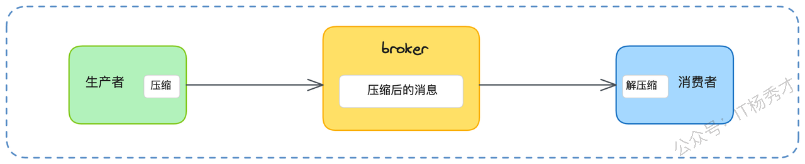

具体来说：

1\. **生产者**在**发送前**，对一个批次的数据进行压缩。

2\. **Broker** 接收到这个压缩后的批次，**直接把它原封不动地存储到磁盘上**，Broker 不会解压它

3\. **消费者**从 Broker 拉取到这个压缩后的批次，在**处理消息前**，自行解压。

这样做的好处是显而易见的：首先，数据在网络传输和磁盘存储中全程都是压缩形态，大大节省了I/O。其次，Broker 变成了甩手掌柜，压缩和解压这些消耗 CPU 的工作，被分散到了各个生产者和消费者上，极大地降低了 Broker 的 CPU 负载。

当然，代价是生产者和消费者的 CPU 消耗会增加。但在绝大多数数据密集型应用中，CPU 往往不是瓶颈，I/O（网络和磁盘）才是。不过，如果你的生产者或消费者本身就是 CPU 密集型应用，那启用压缩反而可能会加重它们的负担，这是技术选型时需要考量的。

## **3. 小结**

Kafka的高性能从来不是依靠某个单一的技术点，而是一整套自底向上、彼此协同的工程设计：零拷贝降低系统调用成本，Page Cache 绕开 JVM 带来极快写入，顺序写让磁盘变成准内存，分区与分段机制在并发与检索上实现精准切分，批处理与压缩进一步把网络与磁盘的每一分带宽榨干。理解这些设计背后的取舍，你才真正理解了 Kafka 的快，而不仅仅是记住几个名词。至此，我们不仅能回答Kafka 为什么快，也能看清它为什么值得成为现代数据系统的基石。

# 资料分享
随着AI发展越来越快，AI编程能力越来越强大，现在很多基础的写接口，编码工作AI都能很好地完成了。并且现在的面试八股问题也在逐渐弱化，**面试更多的是查考候选人是不是具备一定的知识体系，有一定的架构设计能力，能解决一些场景问题**。所以，不管是校招还是社招，这都要求我们一定要具备架构能力了，不能再当一个纯八股选手或者是只会写接口的初级码农了。这里，秀才为大家精选了一些架构学习资料，学完后从实战，到面试再到晋升，都能很好的应付。**关注秀才公众号：IT杨秀才，回复：111，即可免费领取哦**


<div style="background-color: #f0f9eb; padding: 10px 15px; border-radius: 4px; border-left: 5px solid #67c23a; margin: 20px 0; color:rgb(64, 147, 255);">

## <span style="color: #006400;">**学习交流**</span>
<span style="color:rgb(4, 4, 4);">
> 如果您觉得文章有帮助，可以关注下秀才的<strong style="color: red;">公众号：IT杨秀才</strong>，后续更多优质的文章都会在公众号第一时间发布，不一定会及时同步到网站。点个关注👇，优质内容不错过
</span>


</div>
