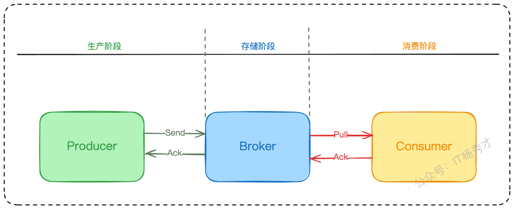

大家好，我是秀才，在上一篇文章我们聊了消息队列的消息积压问题，这篇文章我们接着剖析消息队列，来跟大家一起过一下另一个高频问题：**在使用 MQ 的时候，怎么确保消息 100% 不丢失？**

这个问题在实际工作中非常常见，既能考察候选者对于 MQ 中间件技术的掌握程度，又能很好地区分候选人的架构设计水平。接下来，我们以Kafka作为消息的队列选型，还是从面试视角出发，层层剖析这个问题。探讨你应该掌握的基础知识和答题思路，以及延伸的面试考点。

还是老规矩，应对场景题，一个优秀的工程师，在面试的时候不应该直接抛出解决方案，而应该先展现自己的分析思路层层递进。拿到这个问题我们脑海中首先应该想到的就是以下三个问题：

1. 哪些地方可能导致消息丢失？

2. 怎样检测有没有消息丢失

3. 怎样确保消息不丢失？

## **1. Kafka的消息存储机制**

在深入分析解决方案之前，我们必须对kafka的消息存储机制有所了解，这样才能解决我们上面分析的第一个问题，哪些地方可能丢失消息。

Kafka 是一个分布式的消息系统，它的数据都存储在 **Topic（主题）** 中。为了实现高吞吐和水平扩展，一个 Topic 又被划分为一个或多个 **Partition（分区）**。你可以把 Topic 理解为一个逻辑概念，而分区才是物理存储的单元。

为了保证高可用，防止单点故障，每个分区又可以配置多个 **Replica（副本）**。这些副本中，只有一个是 **Leader（主分区）**，负责处理所有的读写请求；其余的都是 **Follower（从分区）**，它们唯一的任务就是从 Leader 那里同步数据，保持和 Leader 的数据一致。

这些 Leader 和 Follower 副本会被分散地部署在不同的 **Broker（服务器节点）** 上，以此来规避单台服务器宕机带来的风险。


## **2. 哪些地方可能导致消息丢失？**

我们首先来看第一个问题，消息可能在哪里丢失？一条消息从产生到结束，会经历三个关键阶段：

1. **生产阶段**：从业务代码中被创建，然后通过网络发送给MQ Broker。

2. **存储阶段**：MQ Broker接收到消息，并将其持久化存储。

3. **消费阶段**：消费者从Broker拉取消息，并在本地完成业务逻辑处理。



在这三个阶段中，任何一个环节出现网络抖动、服务宕机或者代码Bug，都可能导致消息丢失。我们的任务，就是为这三个阶段分别设计出保险方案。

### **2.1 生产阶段消息丢失**

从上图可知，生产阶段包括生产者发送消息给Broker，然后Broker回复确认消息。由于kafka的消息发送机制有不同的模式，所以在这个发送和确认的过程中存在着多种情况都可能导致消息丢失

#### **2.1.1 Kafka的消息写入机制**

kafka的消息写入机制是由acks参数控制的，这个参数有三种不同的级别，对应了三种不同的可靠性承诺。

1. **`acks = 0`：“发送不管模式”** 这种模式下，生产者把消息发出去就不管了，就可以接着发送下一条消息。这种配置性能最高，但可靠性最差。


在这种模式下是最容易发生消息丢失的，因为没有确认响应嘛，只管发送，收没收到都不知道。所以一旦出现网络都懂，或者是Broker宕机，或者重启都会直接丢失消息

* **`acks = 1`（默认值）：“写入 Leader 即成功模式”** ，这是 Kafka 的默认配置。只要消息成功写入 Leader 分区，生产者就会收到成功的响应。这种模式在性能和可靠性之间取得了平衡。


这种模式牺牲了一定的性能，但是在性能和可靠性之间取得了一定的平衡，增加了消息可靠性，这也是kafka的默认消息发送机制。但是还是会出现消息丢失，比如 Leader 刚写完消息，还没来得及同步给任何一个 Follower 就宕机了，那么这条消息就会永久丢失。

* **`acks = all` (或 `-1`)：“写入所有 partion 副本才成功模式”，** 确保消息写入到leader分区、还确保消息写入到对应副本都成功后，接着发送下一条，性能是最差的，但最安全


这种模式就很安全了，它要等 partition集合中所有的 Follower 都同步完成，才会发送下一条数据。所以在消息生产阶段一般不会丢失消息。问题肯定没有这么简单，到这里面试官可能就会追问了

> 这样的话，那我们把消息发送模式的acks设置为-1，是否就能保证消息不再丢失了呢

### **2.2 存储阶段消息丢失**

这其实就引出了另一个阶段的消息丢失情况，存储阶段消息丢失。

和数据库一样，Kafka 在写入数据时，为了性能考虑，也是先写入操作系统的 Page Cache（页缓存），然后由操作系统在合适的时机异步地刷写到磁盘。

这意味着，即使 `acks = all`，所有 partition 副本都确认收到了消息，但这些消息可能都还静静地躺在各个 Broker 的内存里。如果此时整个机房突然断电，所有 Broker 同时宕机且无法恢复，那么这部分在内存中的数据就会全部丢失。


当然，这种情况极其罕见，但理论上确实存在。Kafka 提供了几个参数来控制刷盘策略：

```go
log.flush.interval.messages 消息达到多少条时刷盘
log.flush.interval.ms 距离上次刷盘超过多少毫秒就强制刷盘。
log.flush.scheduler.interval.ms  周期性检查，是否需要将信息刷盘
```

Broker要通过调用fsync函数完成刷盘动作，理论上，要完全让kafka保证单个broker不丢失消息是做不到的，只能通过调整刷盘机制的参数缓解该情况。比如，减少刷盘间隔，减少刷盘数据量大小。时间越短，性能越差，可靠性越好

不过，在实践中，我们很少会去主动调整这些参数。因为强制同步刷盘会极大地牺牲性能，我们更愿意依赖 Kafka 自身强大的副本机制来保证可靠性。

### **2.3 消费阶段消息丢失**

消费阶段的消息丢失往往就涉及到消息的异步消费了。有些业务会在并发量很大，消息量很大的情况下选择异步消费来提升消费能力

* **一个专门的消费者线程**：它的唯一职责就是高效地从消息队列中拉取消息，然后迅速将消息放入一个内存队列（如Java中的`ArrayBlockingQueue`）中，它完成这个动作之后就提交了，其实消息并没有被真正消费。

* **一个独立的线程池**：这个线程池中的工作线程，从内存队列中获取消息，并执行真正的业务逻辑。


这就可能出现消费者线程将消息放入任务队列后，worker线程还未处理完消息，应用就宕机了，worker重启之后会接着消费后续消息，刚才这条消息就永久丢失了。

### **2.4 消息丢失监测机制**

在明确了消息丢失场景之后，我们下面就需要思考，在业务中如何能检测到消息丢失呢？

如果公司有成熟的分布式链路追踪系统（比如SkyWalking、Jager），那自然是首选，每一条消息的生命周期都能被完整追踪。但如果没有，我们也可以自己动手，实现一个轻量级的检测方案。

核心思路是利用消息队列在单个分区内的有序性。我们可以在生产者（Producer）发送消息时，为每一条消息注入一个唯一且连续递增的序列号。消费者（Consumer）在接收到消息后，只需检查这个序列号是否连续，就能判断出是否有消息丢失。

举个例子，假设我们正在处理一个电商订单系统，生产者A负责发送订单创建消息到分区0。

* 第一条消息，我们给它一个ID：`ProducerA-Partition0-1`

* 第二条消息，ID就是：`ProducerA-Partition0-2`

* 以此类推...

消费者在处理时，只需要维护一个对`ProducerA-Partition0`的期望序列号。比如当前收到的是`...-2`，那么下一条期望的就是`...-3`。如果下一条收到的是`...-4`，那么我们就知道，第3条消息“失踪”了，需要立即告警，并根据ID进行追查。

在分布式环境下，这个方案需要注意几个细节：

1. **分区维度的有序性**：像Kafka、RocketMQ这类MQ，全局有序很难保证，但分区内是有序的。因此，序列号的生成和检测都必须在分区这个维度上进行。

2. **多生产者问题**：如果多个生产者实例同时向一个分区发送消息，协调全局序列号会非常复杂。更实际的做法是，每个生产者维护自己的序列号，并在消息中附带上自己的唯一标识（如IP地址或实例ID），消费者则需要为每个生产者分别维护一套序列号检测逻辑。

当你把这套监控方案清晰地阐述给面试官后，你已经成功了一半。这表明你不仅懂技术，更有系统化、产品化的设计思维。

## **3. 怎样确保消息不丢失？**

终于进入到最核心的地方，也是在面试的时候最能展现我们亮点的地方了，这里我们模拟一个面试场景来展开

> **面试官**：“OK。上面消息丢失的一些场景分析的不错，那么在你的项目中，是如何设计一套方案来确保消息从生产到消费的整个链路都绝对可靠呢？”

基于前面的分析，我们知道了消息的丢失可能出现在消息生产，消息存储，和消息消费三个阶段，那么在设计保障方案的时候，我们也要构建一套从生产端到消费端全链路的消息保障体系。

### **3.1 参数配置**

其实在前面分析消息丢失场景的时候，我们已经知道了大部分的消息生产端的消息丢失都是与acks参数设置相关。那么这里如果要保证消息100%不丢，这里我们自然要设置acks参数为all/-1。不过这也要依据业务场景来。一般只有在特别关键，并且性能要求不高的业务上才会这样去设置，而对于性能要求较高的业务是不合适的。具体可以做如下“极限”的配置：

1. `acks = all`**：确保消息写入所有 partition 副本。

2. `min.insync.replicas = 2`（或更高）：这个参数设定了 ISR 中最少需要有几个副本。比如，如果 Topic 的副本因子是 3，这里设置为 2，就意味着至少要有一个 Leader 和一个 Follower 存活，`acks=all` 的写入请求才能成功。这可以防止在 ISR 副本数不足时，数据写入的可靠性降级。

3. `unclean.leader.election.enable = false`：坚决杜绝“不干净”的 Leader 选举，防止数据丢失。设置为false之后，Kafka 不会从非ISR副本中选举新的Leader。由于非ISR副本可能含有不完整或滞后的数据，从它们中选择Leader会带来数据丢失或不一致的风险。

### **3.2 代码健壮性保证**

假设你的业务代码调用`send()`方法时，来发送消息。在编码时，我们必须对发送操作的结果进行处理：

* **同步发送**：这种方式下，`send()`方法会阻塞，直到收到Broker的响应或者超时。java代码的话我们可以用`try-catch`块来捕获可能出现的异常（如网络抖动、Broker无响应等）。一旦捕获到异常，就必须进行重试，或者将失败的消息记录下来，后续进行补偿。

```plain&#x20;text
// 以Kafka同步发送为例
try {
    // send方法返回一个Future，调用get()会阻塞等待结果
    RecordMetadata metadata = producer.send(record).get();
    // 收到metadata，说明发送成功，可以记录日志或继续业务
    System.out.println("消息发送成功，分区：" + metadata.partition() + ", 偏移量：" + metadata.offset());
} catch (Throwable e) {
    // 捕获到异常，说明发送失败
    System.out.println("消息发送失败，准备重试或记录日志！");
    // 在这里实现重试逻辑或将消息持久化到本地磁盘/数据库
    System.out.println(e);
}
```

* **异步发送**：为了追求更高的吞吐量，如果是用异步发送。这时，`send()`方法会立即返回，不会等待Broker的响应。因此，我们必须在提供的回调函数（Callback）中检查发送结果。**很多新手在这里“踩坑”，只管发不管结果，这是导致消息丢失的常见原因之一。**

```plain&#x20;text
// 以Kafka异步发送为例
producer.send(record, (metadata, exception) -> {
    // exception不为null，说明发送过程中出现了错误
    if (exception != null) {
        System.out.println("消息发送失败，进行处理！");
        // 打印异常信息，用于排查问题
        System.out.println(exception);
        // 在这里同样需要实现重试或补偿逻辑
    } else {
        // 发送成功，可以打印日志，方便追踪
        System.out.println("消息异步发送成功，分区：" + metadata.partition() + ", 偏移量：" + metadata.offset());
    }
});
```

### **3.3 消息消费确认**

消息在消费端的丢失，基本上都是消息消费后没来得及发送确认给生产者导，而导致这种情况一般都是异步消费引起的，所以这里可以参考消息积压这篇文章的异步消费优化情况来进行处理。

核心思想就是采用**批量提交**。异步消费的时候消费者线程一次性拉取一批消息（比如100条），分发给工作线程池。然后，它会**等待**这100条消息**全部**被工作线程处理完毕后，才一次性向MQ提交这批消息。提交完成之后才会发送下一批消息，这样来保证每一条消息都被消费了


### **3.4 亮点方案展示**

到这里消息队列层面的消息保障基本上就做到位了。但是厉害的面试官可能还会问一个消息发送的可靠性问题

> 面试官：消息队列层面分析的挺全面的，这里有个问题，我们在业务侧发送消息的时候一般是有业务场景需要，比如注册完用户之后要给用户加积分，那这里这个加积分的操作一般都是通过消息队列异步化来实现的，这里注册和发消息到消息队列加积分可以看作是两个操作，怎么保证这个注册完成之后，消息一定会发送成功呢

#### **3.4.1 消息事务**

这其实可以看作是个分布式的事务问题，业务操作和发送消息是两个独立的步骤，这里就是要保证这两个操作要么都成功，要么都失败，而如果这里业务操作成功，发消息失败，即发送消息的时候出现了消息丢失。这就会造成一致性问题了。所以这里就可以用消息事务来解决了

> 你可以这样回复，这里其实是个分布式的事务问题，我们要保证注册和发消息要么都成功，要么都失败，可以用消息事务来实现，具体方案我们可以选择业界用的比较多的本地消息表来实现

这个方案的核心思想是，将消息的发送封装进本地数据库事务中。具体流程如下：

1. **开启本地事务**：启动一个数据库事务。

2. **执行业务操作**：比如，在用户库里创建一条用户记录。

3. **记录消息**：在同一个事务中，向一张“本地消息表”里插入一条记录，状态为“待发送”。这条记录包含了完整的消息体、目标 Topic 等信息。

4. **提交本地事务**：提交数据库事务。

到这一步，即使应用立刻宕机，由于用户操作和“待发送”的消息记录在同一个事务里，数据的一致性得到了保证。用户创建成功了，那么要发送的消息也一定被记录下来了。

接下来，我们再处理真正的消息发送：

5. **尝试发送消息**：事务提交后，立即尝试将消息发送到 Kafka。

6. **更新状态**：如果发送成功，就更新本地消息表里对应记录的状态为“已发送”，或者直接删除。

7. **失败与补偿**：如果发送失败，也不用担心。我设计了一个**异步补偿任务**（比如一个定时任务），它会定期扫描本地消息表中那些“待发送”且超过一定时间（比如 5 分钟）的记录，然后进行重试发送。为了避免无限重试，表中还会记录重试次数，达到阈值后就告警，转由人工处理。


> 介绍完具体方案之后，面试官还可能接着追问：如果数据库事务提交了，但是服务器宕机了，消息还没发送出去怎么办？

> 这里其实不用担心，我们有补充机制，异步补偿任务会轮训扫描消息表中待发送的消息，找出这条消息进行补发

在讲完本地消息表方案之后，还可以适当引申一下你对这种方案的优缺点分析，突出你考察问题的全面性和一个架构师方案选型方面的能力

> 当然这种方案也有它的优缺。优点是实现逻辑简单，开发成本比较低。
>
> 缺点也比较突出：
>
> * 与业务场景绑定，高耦合，不通用。
>
> * 本地消息表与业务数据表在同一个库，占用业务系统资源，量大可能会影响数据库性能。
>
> 本地消息表的方案也并非最优选择，现在有很多的消息队列也支持事务了，比如RocketMQ这类消息在中间件，本身就支持事务消息，在选用上就更方便。如果在业务中已经选用了本身就不支持事务的消息队列，并且业务量也不是太大的话，可以考虑本地消息表方案。

通过“生产者保障 + 消费者保障 + 事务消息”的这一套组合拳，我们就可以构建出一套从生产端到消费端全链路的消息保障体系，这套方案更整个思考过程就是你在面试官前的一个亮点呈现

## **4. 小结**

回到我们最初的面试题：在使用 MQ 的时候，怎么确保消息 100% 不丢失？

要构建一个真正“不丢消息”的可靠性系统，关键在于建立一个从生产者到消费者的端到端保障闭环，而不是孤立地调整某个环节的参数。在生产者端，可以采用本地消息表实现消息事务，确保将业务操作和消息发送进行绑定。；在 Broker 端，则可以通过 `acks=all`、`min.insync.replicas > 1` 以及禁用 `unclean` 选举来定义一个严格的数据一致性模型；最后在消费端，务必坚持“先处理业务，后提交位移”的原则，在异步消费提升性能的前提下，采用批量提交策略，确保消息等到正确消费，在进行提交。

将这三者融为一体，而不是是零散的技术点堆砌。你的方案才显得完整可用，才能升级为一个复杂分布式环境中的消息可靠架构。这正是衡量一位架构师系统设计能力的试金石。

## **资料分享**
随着AI发展越来越快，AI编程能力越来越强大，现在很多基础的写接口，编码工作AI都能很好地完成了。并且现在的面试八股问题也在逐渐弱化，**面试更多的是查考候选人是不是具备一定的知识体系，有一定的架构设计能力，能解决一些场景问题**。所以，不管是校招还是社招，这都要求我们一定要具备架构能力了，不能再当一个纯八股选手或者是只会写接口的初级码农了。这里，秀才为大家精选了一些架构学习资料，学完后从实战，到面试再到晋升，都能很好的应付。**关注秀才公众号：IT杨秀才，回复：111，即可免费领取哦**


<div style="background-color: #f0f9eb; padding: 10px 15px; border-radius: 4px; border-left: 5px solid #67c23a; margin: 20px 0; color:rgb(64, 147, 255);">

## <span style="color: #006400;">**学习交流**</span>
<span style="color:rgb(4, 4, 4);">
> 如果您觉得文章有帮助，可以关注下秀才的<strong style="color: red;">公众号：IT杨秀才</strong>，后续更多优质的文章都会在公众号第一时间发布，不一定会及时同步到网站。点个关注👇，优质内容不错过
</span>


</div>


###
