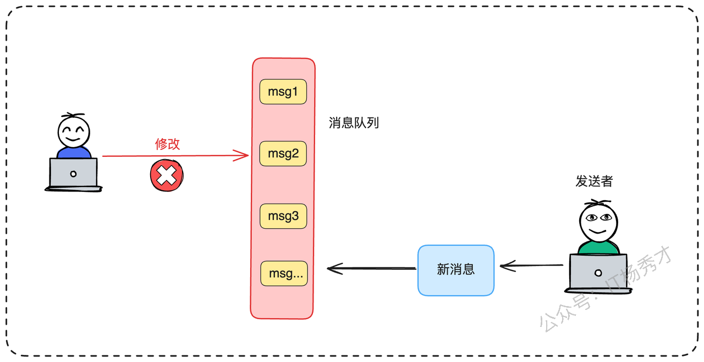
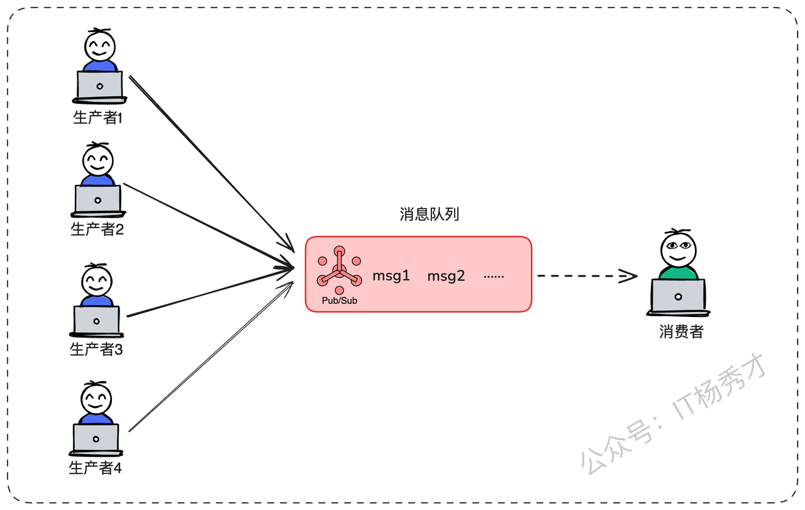

大家好，我是秀才。在如今的分布式系统设计中，消息队列（MQ）几乎是每一位后端工程师都必须打交道的组件。它以其出色的解耦、异步和削峰填谷能力，成为了现代架构的基石。然而，在享受MQ带来的便利时，我们常常会遇到一个棘手且在面试中频频出现的问题——如何保证消息的顺序性？这个问题与“消息不丢失”、“消息幂等性”并称为消息队列面试的三大高频考点。

很多朋友在面对这个问题时，第一反应往往是：“简单，把Topic设置为单分区不就行了？”。这个答案虽然不能算错，但如果在面试中仅止于此，恐怕很难让面试官满意。因为这个看似简单的方案背后，隐藏着巨大的性能陷阱。当面试官追问“这个方案有什么缺陷？”、“如何优化？”时，我们又该如何应对？

今天，我们就来深入地剖析“消息顺序性”这个话题，从最基础的概念辨析，到工业级的解决方案推演，再到方案背后的潜在问题与优化策略，带你彻底搞懂如何优雅保证消息顺序消费，在面试和实践中都能游刃有余。

## **1. 消息的核心概念**

在深入探讨解决方案之前，我们必须先对几个核心概念达成共识，后续讨论才有意义。

### **1.1 消息顺序究竟指什么？**

在消息队列的语境下，我们所说的“顺序”，是指**消费者处理消息的顺序，与生产者发送消息的顺序完全一致**。

这里有一个非常关键的细节需要理清：所谓的“发送顺序”，并非指在生产者客户端代码执行`send()`方法的先后，而是指**消息抵达Broker（消息队列服务器）的先后顺序**。在一个典型的分布式环境下，假设生产者A和生产者B，A在10:00:00.000时执行了发送动作，但由于网络抖动、GC停顿等原因，其消息`msg1`在10:00:00.500时才到达Broker；而生产者B在10:00:00.100时发送的`msg2`，却在10:00:00.300时就抵达了Broker。那么从Broker的视角看，`msg2`就是先于`msg1`的。


因此，我们讨论的顺序性，其裁判是Broker，而非生产者客户端。至于如何协调多个生产者节点严格按时序向Broker发送消息，这已经超出了消息队列的范畴，属于分布式锁或分布式事务协调的领域了。

### **1.2 Kafka是如何存储消息的？**

要理解顺序性的根源，必须了解Kafka这类主流MQ是如何组织消息的。在Kafka中，Topic是一个逻辑上的分类，消息数据实际上是存储在物理的**分区（Partition）**&#x4E2D;的。

每个分区都可以被看作一个**只能追加写入、不可修改的日志文件（Write-Ahead Log, WAL）**。新来的消息永远被添加到日志的末尾，一旦写入，就无法更改。分区内的每条消息都有一个唯一的、单调递增的偏移量（Offset），用来标记其在分区内的位置。



正是这种设计，决定了Kafka的一个核心特性：**它能严格保证在一个分区内部，消息是绝对有序的；但反过来说，它不提供任何跨分区的顺序保证**。理解了这一点，我们就抓住了解决顺序性问题的钥匙。

### **1.3 全局顺序 vs 局部顺序**

在实际业务中，对“顺序”的需求也分两种：

* **全局顺序（Global Order）**：要求整个Topic内的所有消息，都严格按照先进先出的顺序进行消费。这种场景相对较少，比如需要同步一个全局数据库的Binlog时。

* **局部顺序（Partial Order / Scoped Order）**：不要求全局有序，但要求某一个特定业务范畴内的消息是有序的。这在实际业务中**极为常见**。例如，对于同一笔电商订单，其“已创建”、“已付款”、“已发货”、“已签收”这几条消息必须按顺序处理；但订单A和订单B之间的消息，则完全可以并行处理，互不影响。

明确了“局部顺序”才是我们绝大多数场景下的真正诉求，这为我们后续的架构优化打开了广阔的想象空间。

### **1.4 不同Topic的消息有序性**

但有时候，我们还会遇到一种更复杂的场景：不同Topic的消息也要求保证顺序。比如，`topic-order`中的`order-created`消息，必须先于`topic-payment`中的`payment-success`消息被消费。这种情况在基于事件驱动架构（EDA）的复杂系统中可能出现，不同的Topic代表了不同的业务事件。

对于这类问题，我们必须清醒地认识到：**它不能依赖消息队列自身来解决**。任何单一的MQ产品都无法原生支持跨Topic的顺序性。要实现这个目标，必须引入一个外部的**协调者（Coordinator）**。这个协调者需要能够汇集来自不同Topic的消息，进行重排序。例如，当协调者收到了`payment-success`消息，但发现其关联的`order-created`消息尚未到达，它就需要有能力暂存`payment-success`消息，并让其消费者等待。直到`order-created`消息到达并被处理后，协调者再通知支付服务的消费者继续工作。这已经是一个全新的、复杂的分布式协调问题，在常规面试中较少涉及，我们稍微有所了解就可以了。

## **2. 顺序消费解决方案**

在了解完消息顺序的概念以及不同的消息顺序要求之后，接下来我们就来看看针对这些不同场景的顺序要求都有哪些技术方案，以及每种方案存在的问题，可以怎么去优化？

### **2.1 一个Toptic一个分区**

好了，概念铺垫完毕。现在，面对保证消息顺序的需求，最直观、最简单的方案自然浮出水面：**为一个Topic只创建一个分区**。



既然一个分区内是绝对有序的，那么让所有消息都进入这唯一的分区，不就实现了全局有序，自然也满足了局部有序吗？

没错，这个方案在逻辑上无懈可击，实现起来也极其简单，几乎不需要任何额外的开发工作。但它的“沉重代价”也随之而来——**严重的性能瓶颈**，这也是面试官紧接着会考察的要点。

* **对于生产者**：所有消息都涌向单一分区，这意味着所有写入流量都将压向该分区所在的单一Broker节点。该节点的网络带宽、CPU使用率、磁盘IO都会成为整个系统的瓶颈，极易被“打满”。

* **对于消费者**：由于只有一个分区，一个消费组（Consumer Group）内最多也只有一个消费者实例能够进行有效工作（其他消费者将处于空闲状态）。这就完全丧失了消息队列引以为傲的水平扩展和并行处理能力。一旦消息生产速率超过单个消费者的处理速率，消息积压将成为必然。


这种方案，就像是把一条八车道的高速公路，强制收敛到了一个只有一个窗口的人工收费亭，其拥堵程度可想而知。它只适用于那些对消息顺序要求极为严苛，且业务吞吐量非常低的场景。

### **2.2 单分区异步消费**

在单分区性能受限的情况下，如果瓶颈主要出在消费端业务逻辑处理过慢，导致消息积压，我们能否在消费端做一些优化呢？

一个自然的想法是引入**异步消费**模式。具体来说，我们可以让唯一的消费者线程不直接执行耗时的业务逻辑，而是扮演一个“二传手”的角色。它的唯一任务就是从消息队列（比如Kafka）分区中高速拉取消息，然后根据某个业务标识（例如`orderId`），将消息快速分发到不同的任务队列中。后台则启动一个工作线程池，每个线程负责消费一个或多个任务队列，并行地执行真正的业务处理。


这种方式，通过一种哈希策略，例如 `queueIndex = orderId.hashCode() % 4` （假设有4个工作线程），确保了同一订单的消息会被投递到同一个任务队列，并由同一个工作线程来顺序处理，从而在消费端内部保证了局部顺序性。

然而，这个方案看似巧妙，却带来了两大硬伤：

1. **增加了系统复杂性**：你需要自己管理内存队列、线程池、线程安全以及优雅停机等问题，使得消费端的逻辑变得复杂，容易出错。

2. **存在数据丢失风险**：消息从Kafka取出，成功提交Offset，然后放入任务队列后，如果此时消费者进程意外崩溃，那么内存中尚未被工作线程处理的消息就会**永久丢失**。

更重要的是，它**丝毫没有解决生产者端和Broker端的单点写入压力问题**。既然我们已经有了“按业务ID哈希分发”的思想，为什么不更进一步，直接利用消息队列自身成熟、可靠的分区机制，来实现一个更原生的方案呢？

### **2.3 多分区实现局部有序性**

这便引出了我们最终的、也是工业界最主流的解决方案：**利用多分区实现局部有序。**&#x524D;面的方案都是抛砖引玉，到这里可能才是面试官真正想和你深入探讨的地方了

这个方案的核心思想也非常清晰：

1. 为Topic创建多个分区（例如4个、8个），以支持高并发读写和水平扩展。

2. 生产者在发送消息时，不再随机发送，而是**根据业务键（Business Key，如`orderId`、`userId`等）来计算目标分区**。通过这种方式，确保具有相同业务键的消息，总是被稳定地发送到同一个分区。

最简单的分区选择策略就是取模哈希：`partition = hash(orderId) % partitionCount`。


这样一来，同一笔订单`SN20250823XYZ`的所有消息（`OrderCreated`, `PaymentSuccess`等）都会落入同一个分区，由Kafka保证其在该分区内的顺序。而不同订单的消息可以被均匀地分散到不同分区，由不同的消费者实例并行处理，系统的整体吞吐能力得到了极大的提升。

这个方案看似完美，解决了单分区的所有痛点。但在复杂的生产实践中，我们还是会遇到两个棘手的问题。能把这两个问题及其解决方案讲清楚，是体现你技术深度的关键，也会是你在面试过程中区别于其他候选人，能在面试官心中留下深刻印象的关键。

#### **2.3.1 数据倾斜**

简单的哈希取模策略，隐含了一个前提：业务键的哈希值是均匀分布的。但在真实世界中，数据往往是不平均的。

想象一个营销活动场景，某头部主播正在直播带货，几百万用户同时涌入，产生了大量的订单。如果我们的分区键是`activityId`，那么这场活动相关的所有消息都会涌入同一个分区，造成这个分区“热点”，消息严重积压；而其他分区则可能门可罗雀，资源闲置。


如何应对这种数据倾斜呢？这里有两种比较好的应对手段：

1. **一致性哈希（Consistent Hashing）**

一致性哈希算法是解决分布式系统中负载均衡问题的经典利器。我们可以将所有分区节点想象成分布在一个`0`到`2^32-1`的哈希环上。当一条消息到来时，计算其业务键的哈希值，然后在环上顺时针寻找第一个遇到的分区节点，作为其目标分区。


一致性哈希最大的优点在于，当增删分区节点时，只会影响到环上相邻的一小部分数据映射，变动范围小，稳定性好。同时，通过引入“虚拟节点”的机制（即一个物理分区在环上对应多个虚拟节点），当我们发现分区数据不是很均匀的时候，我们可以精细地控制每个物理分区在哈希环上的分布密度和权重，从而更有效地应对数据热点，实现负载的均匀分布。

* **虚拟槽映射**

受启发于一致性hash环，其实是增大了取模分母。同样我们可以引入一个中间层——虚拟槽。不再将业务键直接映射到物理分区，而是先映射到一个固定数量的虚拟槽上（例如Redis的16384个，但是一般情况下我们业务不会用到这么多的槽位，比如在业务中可以简化为2048个，整个数量其实已经足够多了）。

```go
slot = hash(businessKey) % 2048
```

然后，我们再独立维护一个从“槽”到“物理分区”的映射关系。这个映射关系是可配置、可动态调整的，通常存储在配置中心（如Nacos、Apollo）中。例如，初始时我们可以将2048个槽均匀分配给16个分区，每个分区负责128个槽。


当监控系统检测到某个物理分区（比如分区3）成为热点时，我们可以通过动态调整配置中心里的映射关系，将一部分原本映射到物理分区3的虚拟槽（比如槽300-315），迁移到其他负载较低的物理分区上（比如分区5）。这样，后续相关业务键的消息就会被路由到新的分区，从而实现动态的负载均衡。

这两种思路，无论是虚拟槽还是一致性哈希，其本质都是**引入一个间接层来解耦业务键和物理分区，从而获得动态调整负载的能力**，是解决各类数据分布不均问题的通用思想。

#### **2.3.2 扩容引发的顺序错乱**

解决了数据倾斜，我们再来看另一个在运维中可能遇到的问题。随着业务量的持续增长，我们可能需要为Topic增加分区数量以提升整体吞吐量，比如从5个分区扩容到8个。

这时，灾难可能悄然而至。

我们的分区策略是 `partition = hash(orderId) % partitionCount`。当`partitionCount`从5变为8时，对于同一个`orderId`，计算出的分区索引大概率会发生变化。

考虑以下极限场景：

* **时间点T1**：分区数为5，订单`SN20250823XYZ`的消息`M1(已创建)`根据`hash("SN20250823XYZ") % 5`被发送到了**分区2**。但此时分区2有些积压，`Msg1`正在排队等待消费。

* **时间点T2**：我们完成了扩容，分区数变为8。

* **时间点T3**：订单`SN20250823XYZ`的后续消息`M2(已付款)`到来，根据`hash("SN20250823XYZ") % 8`被发送到了**分区7**。分区7是新增的，非常空闲，消费者立刻就取到了`Msg2`并完成了处理。

最终的结果是，“已付款”事件先于“已创建”事件被处理，业务逻辑发生严重错乱！


如何化解这个难题？一个简单而有效的工程实践是：**为新分区的消费者设置一个“冷静期”**。

在为Topic增加分区后，我们让新加入的消费者实例（例如负责消费分区5、6、7的实例）先“暂停”工作一段时间，比如等待5分钟。这个等待时间需要根据经验评估，其核心目标是确保足够让旧分区中积压的、可能与新分区产生业务关联的消息被消费完毕。**这里有一个至关重要的前提：这个等待时间必须长于旧分区积压消息的最大消费时间**。如果旧分区积压的消息预计需要10分钟才能消费完，那么“冷静期”就至少要设置为10分钟以上。

通过这种短暂的延迟消费，我们就能极大概率上避免因扩容导致的顺序错乱问题。当然，这是一种基于概率的“最终一致”思想，并非100%的强保证。在分区扩容这种低频且高危的操作下，通常会结合完善的业务监控和告警，一旦发现异常，可以进行人工干预和数据修复。

## **3. 面试实战指南**

理论知识固然重要，但如何将这些知识有机地串联起来，以一个实际案例的形式在面试中展现出来，更能体现你的实战能力和思考深度。下面，我将以第一人称，模拟一次面试中的回答。

> 你在过往项目，有使用过消息队列吗，有没有遇到过消息顺序消费问题，你是如何解决这个问题的？

还是老规矩，切记一上来就抛出最优方案，像这类围绕项目展开的场景题，最好和面试官多沟通，层层递进，一步一步的从最初的方案开始聊起，然后讲明白各个方案的问题，最后一步步的优化到最终的方案。体现一个解决问题的路径，这样更具真实性和说服力

> “面试官您好，关于消息顺序性的问题，我之前在项目中确实有过一次比较深刻的实践。

> 在我刚加入上一家公司时，就遇到了一个由Kafka引发的线上问题。当时我们有一个核心的订单处理业务，为了保证订单状态流转的正确性，最初的设计者采用了最稳妥的方案：**为订单Topic只设置了一个分区**。在业务初期，这个方案运行得非常稳定。
>
> 但随着公司业务的快速增长，问题开始暴露。我们发现这个Topic的**消息积压越来越严重**，消费延迟从几秒钟增长到十几分钟，直接影响了下游履约、发货等环节的效率。同时，监控也显示，承载这个唯一分区的那个Broker节点，其CPU和磁盘IO负载远高于集群中的其他节点，时常出现性能抖动，成为了整个系统的性能瓶颈。

这个时候自然就勾起了面试官对于解决方案的兴趣

> 面试官：“单分区确实会出现这个问题，这个问题你们是怎么解决的呢”

> “接到这个优化任务后，我首先深入分析了业务场景。我发现，虽然我们需要保证**同一个订单**的‘创建’、‘支付’、‘发货’等消息的顺序，但**不同订单**之间的消息处理其实是完全独立的，并不存在顺序依赖。换句话说，我们的真实需求是**业务内的局部有序，而非全局有序**。”

这个发现是整个优化的关键。它意味着我们完全不必被‘单分区’的枷锁所束缚。于是，接下来就可以顺理成章的引出我们上面总结的档案了：**将单分区Topic改造为多分区Topic**。

> 具体的实施步骤是：
>
> 1. 我为Topic增加了7个分区，总数达到8个，并相应地将消费者应用的实例数也扩展到8个，实现了真正的并行消费。
>
> 2. 在生产者端，我们修改了发送逻辑，引入了基于`orderId`的分区策略。所有消息在发送时，都会根据其`orderId`的哈希值对8取模，来决定其目标分区。这样就确保了同一订单的所有消息始终会落入同一个分区。

当然，这个过程中还有一个非常关键的细节需要处理，那就是**从单分区切换到多分区（或者说，分区数量发生变化）时，如何避免消息乱序**。厉害的面试官会接着追问消息积压导致的消息顺序问题，但是前面我们早有准备，此刻根本丝毫不慌

> 当时确实遇到了**消息乱序的问题**。如果在切换过程中，一个旧订单的‘创建’消息还在原来的那个分区里积压着，而它后续的‘支付’消息，因为新的路由规则被发送到了一个空闲的新分区并被立刻消费，就会造成业务逻辑错误。
>
> 为了解决这个问题，我采用了一个简单而有效的策略：在部署完新的生产者和消费者代码后，我让**新的消费者应用启动后，先暂停消费5分钟**。这个‘静默期’的目的，就是为了给旧的、积压在唯一分区里的消息足够的时间被消费完毕。5分钟后，整个系统中的存量消息基本处理完成，此时再放开所有消费者进行消费，就能平滑地过渡到新的多分区模式，从而避免了潜在的乱序风险。

最后还可以顺带讲一下优化后的效果，优化上线后，效果立竿见影。消息积压问题彻底解决，消费延迟恢复到毫秒级。整个Kafka集群的负载也变得非常均衡。

## **4. 小结**

回顾我们探讨的路径，从一个看似简单的问题“如何保证消息有序”，我们经历了一场从朴素到精密的架构演进之旅：

1. **单分区方案**：最简单的全局有序方案，但以牺牲性能和可扩展性为巨大代价，是“能用但不好用”的典型。

2. **多分区方案**：主流的局部有序方案，通过业务键路由，在性能与顺序之间找到了绝佳的平衡点，体现了“抓主要矛盾”的设计思想。

3. **高级优化**：针对多分区方案在实践中可能遇到的数据倾斜和扩容错乱问题，我们进一步引入了虚拟槽、一致性哈希以及延迟消费等精细化控制手段，展现了架构设计的严谨性和前瞻性。

整个方案优化的过程，不仅是一份面试问题的优秀答案，更体现了一种宝贵的架构设计思维：**精准识别真实需求（全局 vs 局部），洞悉每个方案的利弊与权衡（Trade-off），并随着业务演进，不断迭代优化，准备好应对潜在的风险**。全局有序往往是“伪需求”，而为真正的核心诉求——局部有序，设计出可扩展、高可用的方案，才是架构师价值的真正体现。

## **资料分享**
随着AI发展越来越快，AI编程能力越来越强大，现在很多基础的写接口，编码工作AI都能很好地完成了。并且现在的面试八股问题也在逐渐弱化，**面试更多的是查考候选人是不是具备一定的知识体系，有一定的架构设计能力，能解决一些场景问题**。所以，不管是校招还是社招，这都要求我们一定要具备架构能力了，不能再当一个纯八股选手或者是只会写接口的初级码农了。这里，秀才为大家精选了一些架构学习资料，学完后从实战，到面试再到晋升，都能很好的应付。**关注秀才公众号：IT杨秀才，回复：111，即可免费领取哦**


<div style="background-color: #f0f9eb; padding: 10px 15px; border-radius: 4px; border-left: 5px solid #67c23a; margin: 20px 0; color:rgb(64, 147, 255);">

## <span style="color: #006400;">**学习交流**</span>
<span style="color:rgb(4, 4, 4);">
> 如果您觉得文章有帮助，可以关注下秀才的<strong style="color: red;">公众号：IT杨秀才</strong>，后续更多优质的文章都会在公众号第一时间发布，不一定会及时同步到网站。点个关注👇，优质内容不错过
</span>


</div>


