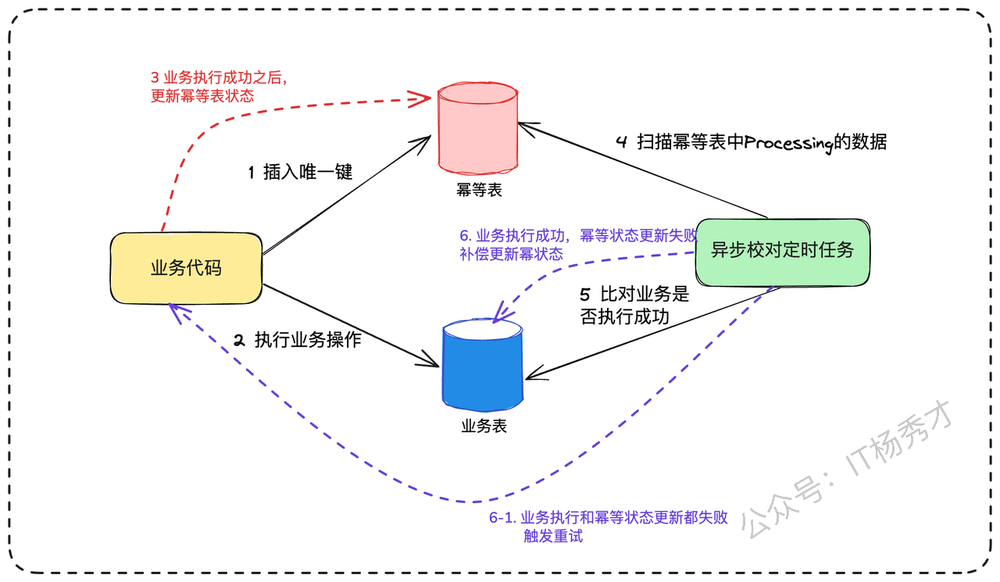

大家好，我是秀才，接着聊消息队列的最后一个高频问题——消息重复消费。只要是在后端架构中用到了消息中间件，无一例外，都会涉及到消息重复消费问题。

假设有这样一个场景：“在我们的电商系统中，订单创建后会发送一条消息，下游的优惠券兑换系统会订阅这个消息，然后发放优惠券。我们的系统需要确保每一张优惠券，无论网络如何波动、系统如何异常，都只能被成功兑换一次。你会如何设计呢？”

这个问题看似简单，但它背后考验的是工程师对分布式系统复杂性的理解，尤其是对“幂等性”这一核心概念的掌握程度。很多同学的第一反应可能是“消息队列不是有‘exactly-once’（精确一次）的保证吗？”。但事实上，绝对的“精确一次”在分布式系统中是一个难以达到的理想状态，都需要业务方配合于重试和幂等来达成。

下面，我们就从这个面试场景出发，层层递进，探讨如何构建一个从基础到高并发都稳如磐石的消费幂等方案。

# 1. 为什么消息会重复？

在分布式系统中，组件间的网络通信本质上是不可靠的，生产端和消费端都有导致重复消费的场景。

1. **生产者重复发送**：生产者发送消息后，因为网络超时等原因没收到 Broker 的确认，它无法判断消息是否发送成功，为了保证消息不丢失，通常会选择重试。这就可能导致同一条消息被发送了多次。


* **消费者侧的重复消费**：消费者拉取消息，业务逻辑处理完了，正准备提交消费位点（ACK）时，服务突然宕机或重启。当服务恢复后，它会从未提交的位点重新拉取消息，导致同一条消息被再次消费。


# 2. 面试实战指南

OK，在上面分析了消息重复的原因之后，下面就正式进入到我们的重头戏，面试的时候应对消息重复的场景问题，我们应该设计怎样的方案呢？

依然是老规矩，场景问题的回答从最基础的方案开始，层层递进，分析其不足和适用场景，然后再逐步优化，最终给出我们的亮点方案

首先我们要搞清楚，我们在设计方案的时候不是去追求一个完美的、永不重复的环境，而是要让我们的消费端服务具备幂等处理消息的能力。所谓幂等，就是无论一个请求被重复执行多少次，其对系统状态产生的影响都和第一次执行时完全相同

那么如何实现幂等操作呢？最好的方式就是，**从业务逻辑设计上入手，将消费的业务逻辑设计成具备幂等性的操作。**&#x4F46;是，不是所有的业务都能设计成天然幂等的，这里就需要一些方法和技巧来实现幂等

## 2.1 数据库唯一约束

这是最简单、最直接，也是最常用的一种方案。其核心思想是，利用数据库中“唯一索引”或“主键”的特性，来阻挡重复数据的插入。

假设我们有一个电商系统，用户下单后会发送一条消息，触发给用户增加积分的操作。消息内容可能包含`{ "order_id": "202508310001", "user_id": 58, "points_to_add": 100 }`。

这个“增加积分”的操作，天然是非幂等的。我们可以这样改造：

1. **建立一张积分流水表（points\_log）。**

2. 表中包含字段：`id` (自增主键), `order_id` (订单ID), `user_id` (用户ID), `points` (变更积分), `create_time`。

3. **关键一步：** 对 `order_id` 这个字段建立一个**唯一索引**。

```sql
-- 尝试插入积分流水记录
-- 假设 order_id 字段上有唯一索引
INSERT INTO points_log (order_id, user_id, points) VALUES ('202508310001', 58, 100);
```

* **第一次消费**：该订单ID首次出现，`INSERT`操作成功。然后我们可以安全地去更新用户的总积分。

* **重复消费**：MQ再次投递相同的消息，消费者尝试`INSERT`时，数据库会因为`order_id`的唯一索引冲突而直接报错。我们的代码捕获这个异常后，就可以知道这是重复操作，直接忽略并返回ACK即可。

这是一种最简单的实现情况，面试的时候，为了展现你的思考能力，还可以做一个适当延伸，说明下这种方案的优缺点，以及扩展性

> 这种方案的**优点是：** 实现简单，成本低，效果可靠。 **缺点也很明显：** 强依赖数据库特性，对于非数据库操作的场景无能为力。
>
> 基于这个思&#x8DEF;**，**&#x5982;果不用关系型数据库，Redis的`SETNX`命令（SET if Not eXists）也能达到异曲同工的效果，可以用`order_id`作为key，实现分布式锁或状态记录。

## 2.2 版本号机制

> 这个时候面试官可能会问：“上面的方案都是基于数据插入场景的，假设我们的业务操作不是数据插入，而是数据更新呢”

确实，如果我们的业务不是`INSERT`，而是`UPDATE`呢？比如，更新订单状态。这时，唯一约束就派不上用场了。我们可以引入“前置条件”或“版本号”机制，也就是常说的乐观锁。

假设有这样一个场景，订单支付成功后，需要将订单状态从“待支付”（`status=1`）更新为“待发货”（`status=2`）。消息内容为`{ "order_id": "202508310002", "target_status": 2 }`。

直接执行`UPDATE orders SET status = 2 WHERE order_id = '202508310002'`是非幂等的。如果因为某种原因，后续还有一个“取消订单”的操作把状态改回了1，这条重复的消息可能会错误地再次把订单改为“待发货”。

我们可以这样改造：

1. **在`orders`表中增加一个`version`字段**，默认为0或1。

2. 消费消息时，我们从消息中（或者先查询一次数据库）拿到当前的版本号。

3. 执行`UPDATE`时，带上版本号作为条件。

```sql
-- 更新订单状态，同时检查版本号
-- 假设当前数据库中该订单的 version 是 5
UPDATE orders 
SET status = 2, version = version + 1 
WHERE order_id = '202508310002' AND version = 5;
```

* **第一次消费**：`version`为5，条件满足，`UPDATE`成功。数据库中的`version`变为6。

* **重复消费**：MQ再次投递消息，消费者执行同样的SQL，但此时数据库中的`version`已经是6了，不满足`AND version = 5`的条件。`UPDATE`语句会执行失败，影响行数为0。我们就知道这是重复操作了。

> 同样在分析完这个方案之后，你可以做一个方案优缺点的补充。**优点：** 适用范围比唯一约束更广，能处理大部分更新操作。 **缺点：** 需要在业务表中增加额外字段（如`version`），有一定侵入性。

## 2.3 亮点方案

到这里，面试官还不满意，接着追问，如果我们的业务逻辑非常复杂，可能涉及多个表的更新，甚至是一些外部RPC调用，这个时候版本号已经不起作用了，此时应该怎么办呢？

这个时候就到了我们祭出我们第一个亮点方案的时候了：**全局唯一ID + 单独的防重表（或缓存）**

### 2.3.1 防重表

防重表也叫幂等记录表，这个方案的核心思想是，为每一次消息处理操作生成一个全局唯一的标识。在执行核心业务逻辑前，先将这个唯一标识插入一张“幂等记录表”或直接利用业务表中的唯一约束字段。如果插入成功，说明是首次处理，继续执行业务；如果插入失败（因为唯一键冲突），则说明这条消息已经被处理过了，直接丢弃即可。

在面试的时候你可以先介绍下这个方案的基本流程

> 如果业务复杂，我们可以采用防重表的方案，将业务逻辑和幂等逻辑解耦。单独建立一张防重表，具体的步骤如下：
>
> 1. **为每条消息生成一个全局唯一ID（GUID）**。这个ID可以在生产者发送时就放入消息体或Header中。
>
> 2. **建立一张“消费记录表”（consumed\_log）**，表结构很简单，核心就是一个字段`message_id`，并将其设为主键或唯一索引。
>
> 3. **消费者处理逻辑变为一个“三段式”**：
>
>    1. a.  **开启事务**。
>
>    2. &#x20;b.  `INSERT`消息的GUID到`consumed_log`表中。
>
>    3. &#x20;c.  执行真正的业务逻辑（更新数据库、调用RPC等）。
>
>    4. &#x20;d.  **提交事务**。
>
> 这样如果是重复消息的话，就会插入消费记录表失败，就不会执行后面的业务逻辑了


这里其实隐藏了一个问题，厉害的面试官可能会继续深挖

> “这里你的方案里提到了用事务，在一个数据库里确实没有问题，可以用本地事务来保证防重逻辑和业务逻辑的原子性，但是如果是分布式环境下，跨库要怎么处理呢？”

### 2.3.2 异步校对

这里如果你能把分布式环境下的跨库幂等性实现也讲清楚的话，其实就已经可以跟一般候选人拉开差距了。确实，在微服务架构下，业务操作往往是跨服务的，比如“扣减库存”和“创建物流单”可能分别由两个不同的服务实现。这时，本地事务就失效了。

此时，我们需要引入**最终一致性**的设计思想，并辅以一个**异步校对机制**。整个流程会演变成三步：

1. **预操作**：收到消息后，第一步是在幂等记录表中插入一条记录，但状态标记为“处理中（PROCESSING）”。例如，插入一条记录 `(order_id, 'PROCESSING')`。这一步是幂等性的关键防线。

2. **执行业务**：调用库存、物流等下游服务，执行核心业务逻辑。

3. **确认操作**：所有业务逻辑成功执行后，回来将幂等记录表中的状态更新为“已完成（COMPLETED）”。


这里由于没有事务保证，所以很可能出现第二步执行业务成功了，但第三步更新幂等表对应数据为已完成的时候失败了（比如网络问题或服务宕机）。这时，幂等记录表里会留下一条“处理中”的“记录。

这个时候就是异步校对机制发挥作用的时候了。它会定期扫描幂等记录表中那些长时间处于“处理中”状态的记录，然后反向查询各个业务系统（比如查询物流系统是否存在该订单的物流单），来判断业务是否真的执行成功。如果查询下来业务确实已经成功，校对任务就负责将幂等记录的状态更新为“已完成”。

> 这里面试官可能问一个问题：“如果查询下来业务也没有成功，会怎么样呢？”

这里其实就回到了我们的经典重试问题的处理方案了

> 你可以这样回答：“其实这个时候还是一致性的状态，就说明业务确实是没有执行成功，所以不会修改状态为已完成，这个时候可以直接重新再出发一次业务操作就可以了，可以设置一个重试次数，如果超过重试阈值，一致不成功，最后只能由人工介入”



到这里，你已经展示了在复杂分布式场景下的问题解决能力，但面试官可能还想继续了解你的技术深度，会继续施压：

> “这个方案很好，但所有请求，无论是首次还是重复的，最终都要访问数据库。在每秒几万甚至几十万请求的场景下，数据库很快就会成为瓶颈。你有什么优化思路？”

这正是引出我们第二板斧的绝佳时机。

### 2.3.3 缓存判重

很容易想到，数据库有读瓶颈的话，最好的优化方式就是加缓存，同样这里我们可以在防重表的上层加一个redis来缓存近期处理过的 key。你可以详细解释下这个方案

> 当一个新的消息进来的时候，我们先通过redis做一次判重校验，如果这个key存在，那么我们就认为这是重复的key，如果redis不存在，再通过数据库做一次兜底校验，如果key存在就认为是重复的消息，如果key不存在，就认为不是重复消息，没处理过

引入redis后的整个判重校验逻辑如下图


一旦引入缓存，就涉及到缓存和数据库的一致性问题了，这也是面试的时候，面试官最喜欢问的点，那这里我们每次处理一个新的消息之后，是先更新数据库（防重表）呢，还是先更新缓存redis呢？

这里一定是先更新数据库，因为它是最可靠的，也是我们的兜底方案，你可以这样回答

> 处理完业务逻辑之后，先更新数据库，把这个新的消息写入到防重表，在更新redis。这里即使redis更新失败，也没有关系，下一次这个重复的消息过来的时候，做重复性校验的时候，无非就是redis这里的拦截不起作用了，但是还会透穿到数据库层面去做校验， 还是能把重复消息拦截掉。保证消息幂等消费

> “那这里如何确定redis里key的过期时间呢？”

但凡涉及到redis的缓存问题，过期时间的确定也是一个高频考点。

> 关于redis的key过期时间其实没有一个严格的标准，一般是根据业务场景来定的，可以先观察具体消息队列接入的业务key的出现频率来设定，通过测试观察比如key的过期时间大概是5分钟出现一次的话，那我们比过期时间稍微设置长一点时间即可，比如六七分钟都是可以的。但是这里的key过期时间不宜设置过长，比如半小时，一小时。如果设置的太长，如果业务量大，并发量高的话，会造成redis的存储量暴涨，引起redis瓶颈

那假设这里重复的key出现间隔就是很久，比如一批一批的重复消息大量出现。redis用来做这一层隔离不合适，应该怎么办呢？这里就要祭出我们的终极亮点方案了

### 2.3.4 布隆过滤器

既然数据库是瓶颈，那么优化的核心思路就是：**尽可能地减少对数据库的直接访问**。redis缓存已访问的消息，又达不到性能要求，**那我们可以就在数据库前构建一个或多个高性能的过滤层，让绝大多数的重复请求在到达数据库之前就被拦截掉。**

思考一下，这里我们要的是什么，没有出现过的直接放行，出现过的拦截掉。这不正是布隆过滤器的用武之地吗。所以我们可以在数据库前面加一层布隆过滤器作为拦截层。

1. **这里我们首先来回顾下什么是布隆过滤器**

布隆过滤器是一种高效的概率性数据结构，用于判断一个元素是否可能在一个集合中。它由一个很长的二进制位数组（位数组）和一组哈希函数组成。工作原理如下：

> 1. 初始化时，布隆过滤器是一个长度为 `m` 的 **位数组（bit array）**，所有位都置为 0。
>
> 2. 插入元素时，会用 `k` 个哈希函数分别计算元素的哈希值，每个哈希函数对应一个数组下标，把对应的 bit 位置为 1。
>
> 3. 查询元素时，再用相同的 `k` 个哈希函数计算位置：
>
>    * 如果这些位置有任意一个是 0 → **元素一定不存在**。
>
>    * 如果这些位置全部是 1 → **元素可能存在**。


这里需要注意一点，布隆过滤器不会出现**漏判（False Negative）**，即如果它说不存在，那一定不存在。但是会出现**误判（False Positive）**，即可能说一个元素存在，但实际上却不存在。


比如上图，这里假设进来一个新的元素z，要判定z元素是否存在，对Z做hash映射，这里发现映射到的3个bit位都是1，会认为Z已经存在。但其实这里的bit位为1是前面的X和Y元素存在导致的

解释完布隆过滤器的原理之后，接下来就可以跟面试官说明下我们的设计方案了

> “为了增加性能，不让每一次判重逻辑都走数据库，我们可以在数据库前面加个布隆过滤器，每一个新的消息过来，先用布隆过滤器判重，如果不存在，我们就正常处理业务逻辑，然后再更新布隆过滤器和防重表。如果布隆过滤器存在这个key的话，由于布隆过滤器存在假阳性的问题，所以这里就可以透穿到数据库再做一次校验。就如果是重复消息，直接拒绝就可以了，如果不是重复消息，就正常处理消息”


到这一步其实防重方案已经很完善了。从上面的方案可以知道存在一个数据的一致性问题，面试官可能在这里深挖，如果防重表或者是布隆过滤器失败该怎么处理，这里其实很好解决了，复用前面版本号机制的思路，虽然用分布式事务可以来保障但是，会给系统带来很大的复杂性提升。这里我们同样可以用重试配合人工兜底来处理

### 2.3.5 扩展方案

**有没有比布隆过滤器更好的选择？**

在某些特定场景下，确实有。如果你的业务唯一标识本身就是连续或接近连续的整数（例如，订单系统分库分表后的数据库自增ID），那么使用**位图（Bit Array / Bitmap）**&#x4F1A;是比布隆过滤器更优的选择。


位图用每一个比特位来标记一个ID是否存在，`1`代表存在，`0`代表不存在。它不仅完全没有假阳性的问题，判断绝对精确，而且在数据密集的情况下，内存效率极高。我们甚至可以用一个很小的偏移量来映射业务ID，比如，业务ID从`8,800,000`开始，那么我们可以让位图的第0位对应ID `8,800,000`，第1位对应`8,800,001`，以此类推，极大地节省了存储空间。

但是这种方案有一个局限性，那就是我们的业务唯一ID必须是数值型的，且最好是自增的，这样用起来才比较方便。如果满足这种条件的话，**用位图来替换布隆过滤器是个绝佳选择**

在介绍完上面的布隆过滤器方案的时候，你可以主动引出这个位图的方案，分析下它的优劣势，说明其局限性和使用场景。到这里，你基本上已经可以打败90%的面试候选人了。

# 3. 小结

到这里，我们的消息幂等方案就介绍的差不多了。我们从一个简单的消息重复消费问题出发，从最基础的数据库唯一键约束，一路升级打怪，共同构建了一套由 Redis、布隆过滤器乃至位图组成的完整技术方案。

这些方案的设计思路其实都遵循着同一个核心原则：**让系统具备幂等处理能力**。无论是通过数据库约束阻挡重复数据，还是通过缓存和过滤器提升性能，本质上都是在解决"如何让重复的操作产生相同的结果"这个根本问题。

可以看到，在应对面试官关于消息重复消费的层层追问时，关键并不仅仅在于给出一个单一的“最优解”，而在于展现我们作为工程师解决问题的完整思考框架：从识别问题、到设计基础方案、再到分析瓶颈并层层优化。

最后，技术方案永远没有标准答案，关键是要能够根据具体的业务场景、并发量级、团队技术栈等因素，选择最合适的解决方案。这才是一个成熟工程师应该具备的核心素养。

## **资料分享**
随着AI发展越来越快，AI编程能力越来越强大，现在很多基础的写接口，编码工作AI都能很好地完成了。并且现在的面试八股问题也在逐渐弱化，**面试更多的是查考候选人是不是具备一定的知识体系，有一定的架构设计能力，能解决一些场景问题**。所以，不管是校招还是社招，这都要求我们一定要具备架构能力了，不能再当一个纯八股选手或者是只会写接口的初级码农了。这里，秀才为大家精选了一些架构学习资料，学完后从实战，到面试再到晋升，都能很好的应付。**关注秀才公众号：IT杨秀才，回复：111，即可免费领取哦**


<div style="background-color: #f0f9eb; padding: 10px 15px; border-radius: 4px; border-left: 5px solid #67c23a; margin: 20px 0; color:rgb(64, 147, 255);">

## <span style="color: #006400;">**学习交流**</span>
<span style="color:rgb(4, 4, 4);">
> 如果您觉得文章有帮助，可以关注下秀才的<strong style="color: red;">公众号：IT杨秀才</strong>，后续更多优质的文章都会在公众号第一时间发布，不一定会及时同步到网站。点个关注👇，优质内容不错过
</span>


</div>