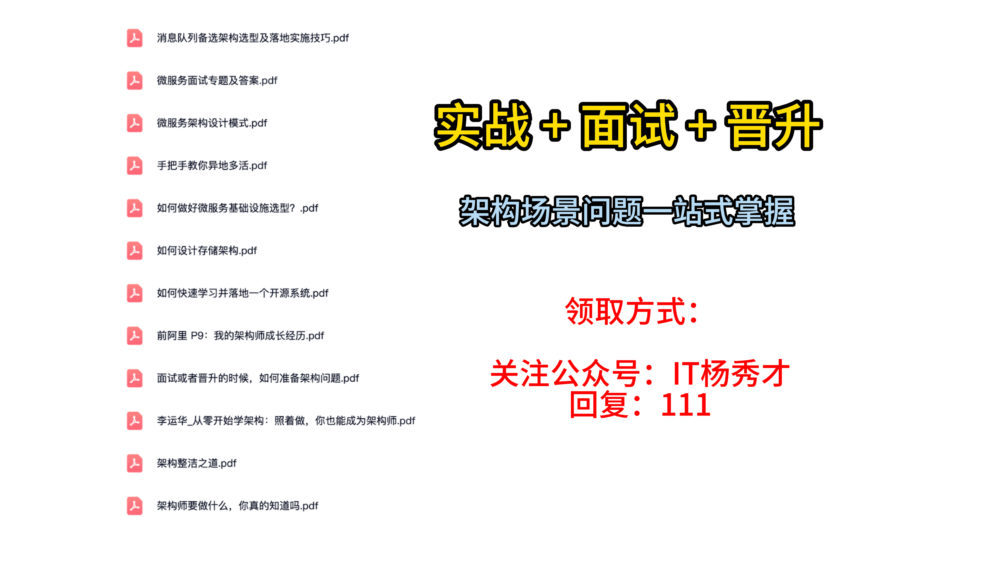

在现代分布式系统中，如果说数据库和缓存是支撑业务数据的两大基石，那么消息队列，无疑就是贯穿整个系统、确保其高并发与高可用的主动脉。无论是构建复杂的金融级应用，还是在简单的业务开发中提升系统的响应能力与健壮性，消息队列都扮演着不可或缺的角色。

在技术面试中，消息队列与数据库、缓存并列，是考察候选人系统设计能力的三个核心要点。消息队列本身的知识体系也很庞杂，理论与实践结合得异常紧密，也因此成为了面试中的难点与亮点。接下来，秀才会带你逐一攻克消息队列最热门、最核心的面试主题，助你在激烈的技术竞争中脱颖而出。这篇文章我们就先从最根本的问题入手：**消息队列，在架构设计中究竟能起到什么作用？**

## **1. 消息队列的三大应用场景**

当我们谈论消息队列时，有我们脑海中应该立马浮现出这三个词：**异步（Asynchrony）、解耦（Decoupling）、削峰（Peak Shaving）**。这三者，与其说是消息队列的使用场景，不如说是它与生俱来的三大核心特性，或者说是它赋予架构师的三种强大能力。我们所见到的几乎所有应用场景，都是这三种特性中一种或多种的组合体现。

例如，我们经常听到的**日志处理**场景。在一个大型系统中，成百上千个业务服务每时每刻都在产生海量的日志。如果让每个业务服务都直接将日志写入到集中的日志处理系统（如ELK），那么业务服务的主流程就必须等待日志写入成功，这会严重影响主流程性能（违背异步）；同时，业务服务与日志系统紧密绑定，一旦日志系统出现故障，可能会拖垮业务服务（违背解耦）；在业务高峰期，瞬间产生的日志洪流也可能直接冲垮日志系统（需要削峰）。

而引入消息队列后，整个架构就变得优雅而健壮。


业务方只管将日志消息“扔”进消息队列，这个动作快如闪电，然后继续执行自己的核心业务，这是**异步**；业务方根本不关心日志最终被谁处理、如何处理，它只与消息队列这个稳定的“契约”交互，这是**解耦**；无论上游产生多大的日志洪流，都会被消息队列这个巨大的“蓄水池”暂存下来，日志处理平台可以根据自己的处理能力，平稳地、从容地进行消费，这是**削峰**。

再比如**消息通讯**，如企业微信、钉钉这类即时通讯（IM）工具。其本质也是消息队列思想的体现。


发送者发出消息，这个动作本身是异步的，你不需要等待所有接收者都确认收到后才能发送下一条。发送者与接收者之间通过消息服务这个中间层实现了解耦，你不需要知道接收者当前是否在线，网络状况如何。如果一个群里有成千上万的人，你在群里发一条消息，这个行为本身也需要削峰，由消息系统将一条消息扩散成千上万条，而不是由你的客户端去逐一推送。

所以，请记住这三大核心基因。在你的架构设计中，一旦识别出需要异步、解耦、削峰的场景，那么引入消息队列，往往就是那个最正确、最专业的选择。

## **2. 面试实战指南**

### **2.1 消息队列案例回顾**

在准备关于消息队列的面试时，你需要仔细回顾你过往的项目经验，并从中提炼出有价值的点。

* **你们公司用消息队列了吗？** 具体用在哪些业务场景？是为了解决什么核心痛点？是为了实现订单的异步处理，还是为了缓冲秒杀的瞬时流量？

* **做一次思想实验**：如果当初在那个场景下，我们不使用消息队列，而是采用其他方案（比如直接的RPC同步调用），是否可行？对比使用消息队列的方案，二者在性能、可用性、开发效率、后期维护成本上，各有什么优劣？

* **你们的技术选型是什么？** 是Kafka，RocketMQ，还是RabbitMQ？你了解它的技术特性和优缺点吗？为什么当时会选择它，而不是其他的消息中间件？

这里秀才强烈建议你，针对异步、解耦、削峰这三个特性，分别从你的工作经验中找到至少一个典型的案例。虽然很多时候一个场景会同时体现这三个特性，但准备多个角度的案例，能让你在面试中游刃有余，展示出更宽广的技术视野。

在面试交流中，你要学会主动出击。当面试官抛出以下问题时，你都可以自信地用本节课的内容来回答，并顺势将话题引导到你准备最充分的领域：

* “你有没有用过消息队列？可以讲讲具体是怎么用的吗？”

* “你是否了解延时队列？它通常用来解决什么问题？如果要你设计一个，你会怎么做？”

* “如果要你来设计一个秒杀系统，你的整体架构思路是怎样的？”（在回答时，务必突出消息队列在其中的核心作用）

* “你对事件驱动架构（EDA）有什么理解？”

我个人有一个强烈的观点：**业务系统越是复杂，应用事件驱动架构的价值就越大**。如果你有机会在实际工作中，将一个复杂、棘手的业务流程，用事件驱动的思想去重构和优化，那将成为你简历上含金量极高的一笔。

### **2.2 核心应用场景剖析**

现在，让我们进入实战场景。面试的时候，尤其是作为社招，消息队列是你不得不会的一个专业技能。也是你必须写到简历上的一项技能。看到你的简历，面试官很自然地会问：“你说你用消息队列解决过一些复杂的业务问题，能展开讲讲吗”。下面，我为你准备了几个极具代表性且能引出深度话题的案例。

#### **2.2.1 高并发秒杀场景**

秒杀，是电商、抽奖等领域常见的一种营销活动，也是面试中关于高并发系统设计的必考题。在任何一个设计合理的秒杀架构中，消息队列都扮演着不可或缺的核心角色，它同时展现了异步、解耦和削峰三大能力。

一个典型的、简化的秒杀架构如下所示：


用户的秒杀请求到达后，并不会直接去操作数据库创建订单。而是先经过一个**轻量级的网关或服务**，这个服务只做几件非常快速的事情：

1. **初步过滤**：如限流、黑名单校验、用户资格判断（是否已秒杀过）等。

2. **库存预扣减**：这是最关键的一步。库存信息通常存储在像Redis这样的高速缓存中。服务会尝试在Redis中对库存进行原子性的减一操作（如`DECR`）。如果扣减成功，代表用户“抢到”了资格。

只有当库存预扣减成功后，这个包含了用户ID、商品ID等信息的秒杀请求，才会被封装成一条消息，投递到消息队列中。然后，前端就可以给用户一个友好的提示：“恭喜您抢到了，正在为您生成订单...”。

而消息队列的下游，才是真正处理订单创建的**重量级服务**。这个订单服务会按照自己的节奏，从队列中拉取消息，进行一系列复杂的操作，比如：再次校验业务规则、在数据库中创建订单记录、关联用户信息、生成支付链接等。这种设计的精髓，就在于**消息队列将业务中的重量级操作和轻量级操作隔离了。**

你可以这样向面试官介绍你的方案，并突出关键词“**轻重分离**”：

> “在秒杀场景中，消息队列的核心作用是作为一道防火墙，实现了业务流程的‘轻重分离’。秒杀的瓶颈在于数据库的写入能力有限，无法承受瞬时的高并发。因此，我们将整个流程拆分：
>
> * **轻量级操作**：在队列前端，我们只执行一些基于内存或Redis的高性能操作，如用户校验和库存预扣减。这部分可以扛住极高的QPS，其瓶颈通常取决于Redis的极限性能。
>
> * **重量级操作**：库存扣减成功后，我们将请求转化为消息，异步地发送到消息队列。队列后端的订单服务，则可以根据数据库的实际承载能力，以一个平稳的速率进行消费，执行创建订单等重量级的数据库写操作。
>
> 这样，消息队列就像一个巨大的缓冲水库，将前端瞬时的、尖锐的流量洪峰，‘削平’成了后端系统可以平稳处理的、持续的流量细流。这正是‘削峰填谷’思想的经典体现。”

当你说完这个场景，面试官很可能会追问：“如果在Redis里扣减了库存，但用户最终没有支付，那这个库存不就被白白占用了吗？” 这个问题，就自然地引出了我们的下一个经典场景。

#### **2.2.2 利用延时队列实现订单超时自动取消**

在电商业务中，这是一个非常普遍的需求：用户下单后，如果在指定时间内（比如30分钟）没有完成支付，系统需要自动取消该订单，并将预扣减的库存释放出来，还给库存池。

在业内，实现这个“定时任务”的方式有很多种，比如定时扫描数据库。但利用消息队列的**延时消息（Delayed Message）**&#x529F;能，是一种更为优雅、高效且对数据库友好的解决方案。

所谓延时消息，就是生产者发送一条消息后，这条消息并不会立即对消费者可见，而是会等待一个预设的延迟时间后，才被投递给消费者。


我们的方案可以这样设计：

> “当一个订单创建成功后，除了正常的业务逻辑外，我们会同时向一个**延时队列**发送一条‘订单取消’消息。这条消息的延迟时间，就设置为我们的订单支付超时时长，比如10分钟。
>
> 10分钟后，这条延时消息被消费者（我们称之为‘订单取消服务’）获取到。取消服务会根据消息内容，去检查对应订单的支付状态。如果订单此时仍然是‘未支付’状态，那么就执行取消操作，并释放库存。如果订单已经被支付了，那么这条取消消息就可以直接忽略。”

然而，这里潜藏着一个经典的并发问题（Race Condition）。

设想这个临界点：在第9分59秒，用户发起了支付请求；几乎在同一时刻，10分钟的延迟时间已到，订单取消服务也收到了那条延时消息。支付服务和取消服务，可能会同时去操作同一笔订单。


如何解决？你可以向面试官展示你对数据库并发控制的理解：

> “在消费这条超时消息时，必须处理支付与取消的并发冲突。解决方案有很多，比如可以使用分布式锁。但一个更轻量且常用的方法是**乐观锁**或利用数据库的行锁。比如，我们的取消服务在执行更新时，可以使用这样的SQL：”

```sql
-- 使用乐观锁思想，只有在订单状态仍为“未支付”时，才将其更新为“超时取消”
UPDATE order
SET status = "超时未支付"
WHERE id = 100 AND status = "未支付";
```

> “这条`UPDATE`语句的`WHERE`子句中，`status="未支付"`就是一个乐观锁。如果支付服务已经先一步将状态改为了‘已支付’，那么这条更新语句将不会匹配到任何行，`UPDATE`操作的影响行数为0，取消服务就知道无需再做任何操作。反之，支付服务在更新状态时，也需要做类似的判断。这样就保证了数据的一致性。”

这个场景的讨论，不仅展现了你对业务问题的解决能力，还能自然地引出对不同消息队列产品特性的讨论。例如，你可以补充道：“目前主流的消息队列中，RocketMQ原生就支持延时消息，而Kafka本身是不支持的，需要借助一些外部组件或巧妙的设计模式（如时间轮算法）来实现。因此，在技术选型时，如果业务有强烈的延时任务需求，这会是影响我们决策的一个重要因素。”

### **2.3 亮点方案展示**

#### **2.3.1 为什么需要消息队列**

到目前为止，我们讨论了消息队列能“做什么”。现在，让我们进入一个更深层次、更具思辨性的问题，这也是面试中的一个绝佳亮点：**在这些场景下，我们为什么“非用不可”？换句话说，不用消息队列，会怎么样？用了，又到底好在哪里？**

这个问题，实际上是在挑战我们对“耦合”这个软件工程核心问题的理解深度。很多人会简单地回答“因为不用就会导致系统耦合严重”，但这只是一个表象。面试官真正想听的，是“耦合严重”会带来哪些具体、致命的后果。

让我们回到那个最经典的“订单创建后，需要通知多个下游系统（如支付、库存、物流等）”的场景。

1. 合理做法，消息队列解藕


* **如果不用消息队列**，最直接的做法就是由“订单服务”去**同步调用**所有下游服务的RPC接口。


而这种同步调用方案，与引入消息队列的方案相比，存在三个维度的、不可忽视的缺陷：**性能差、可扩展性差、可用性差**。

#### **2.3.2 保证性能**

首先是性能问题，不是用消息队列的话系统的性能就会大打折扣。主要是因为主流程需要同步等待所有下游调用完成，整个业务请求链路才会结束


> “在同步串行调用的模式下，订单服务的总耗时，约等于三次RPC调用的时间总和。图中红色请求过程所有来回消耗时间的叠加。这意味着用户点击‘创建订单’后，需要等待支付、库存、物流三个系统全部处理完毕，才能收到‘创建成功’的响应。这个延迟对于用户体验来说是灾难性的。”

这时，面试官很可能会继续追问：“如果我并发调用呢？我可以在订单服务里开多个线程或协程，同时去调用这三个下游服务，这样性能不就好了吗？”


这是一个很好的追问，你需要正面回应它：

> “即使是并发调用，性能也依然劣于使用消息队列的方案。在并发调用的情况下，总耗时取决于**响应最慢的那个下游服务**。如果其中任何一个下游因为网络抖动、GC或者自身负载过高而出现延迟，整个订单创建流程都会被它‘拖后腿’。而对于消息队列方案，订单服务要做的，仅仅是将一条‘订单创建’消息可靠地发送到消息中间件。这个操作通常在毫秒级别就能完成，对于用户来说，响应几乎是瞬时的。真正的耗时操作，被异步地、透明地转移到了后端，与用户的交互主流程完全分离。”

#### **2.3.3 保证扩展性**

扩展性，其实本质上就是一个下游服务接入到系统的复杂程度。**如果一个新的下游业务方（比如新上线的大数据分析平台）也需要订单创建的数据，它接入的成本和复杂度有多高？而**在使用消息队列的方案中，这个过程就非常优雅高效，要自己去订阅消息就可以，不会得其他服务造成干扰。


> “订单服务作为生产者，它完全不关心、也不需要知道谁在消费它的消息。它只对消息的格式（Schema）负责。当一个新的会员服务需要接入时，它只需要向消息队列的管理员申请一个新的消费组，然后去订阅那个‘订单创建’的Topic即可。整个过程，订单服务团队的代码**一行都不用改**，甚至可能都不知道有新消费者的存在。这是一种真正的‘自主接入’，实现了组织和架构层面的解耦。”

而反观同步调用方案，每一次新下游的接入，都可能是一场小型的“灾难”。

> “在同步调用的世界里，每增加一个下游，订单服务就必须修改自己的代码，增加一次新的RPC调用。这意味着：你需要和下游团队沟通API接口定义、请求和响应的数据结构；你需要编写适配对方接口的代码；你需要进行繁琐的联调、集成测试；最后还要协调上线发布。整个过程充满了沟通成本、技术摩擦和潜在的Bug。这种‘侵入式’的修改，严重违背了软件设计的‘开闭原则’，使得系统的可扩展性极差。”

当然，在这里你还可以展示一个亮点，体现你的设计成熟度：

> “如果在某些特殊场景下，确实因为业务强一致性等原因不能使用消息队列，那么为了缓解这种扩展性问题，我们可以在订单服务和众多下游之间，引入一个统一的‘抽象屏障’，比如定义一个统一的`Notifier`接口或一个API网关。所有下游都来实现这个统一的接口规范。这样，订单服务就不再需要为每个下游写定制化的适配代码，从而在一定程度上改善扩展性。但这依然没有从根本上解决系统间的强依赖问题。”


#### **2.3.4 保证可用性**

可用性，关注的是系统在面临局部故障时的健壮性。

> “在使用消息队列的方案中，订单服务对可用性的要求，仅仅是‘消息队列本身是可用的’。只要能成功把消息发出去，它的任务就完成了。即使下游的推荐系统暂时宕机了，消息会积压在队列里，等推荐系统恢复后再进行消费，不会影响订单服务的正常运行，更不会影响用户创建订单。
>
> 而在同步调用方案中，可用性形成了一个‘短板效应’。订单服务必须确保**所有**下游服务都成功调用，才算整个操作成功。如果推荐服务调用成功，但审计服务因为网络问题调用失败了，此时系统就处于一个非常尴尬的‘部分成功’的中间状态。你需要编写大量复杂的重试和补偿逻辑来处理这种情况。任何一个下游的抖动或故障，都可能直接导致整个订单创建流程的失败。系统的整体可用性，受限于所有依赖中最不可靠的那一个。”

#### **2.3.5 事件驱动架构**

当我们把消息队列的应用推向极致，它就不再仅仅是一个用于异步、解耦、削峰的工具，而是成为了一种构建系统的全新范式——**事件驱动架构（Event-Driven Architecture, EDA）**。

EDA的核心思想是，将整个复杂的业务系统，看作是一系列**事件（Event）**&#x7684;产生、传递和响应的过程。在这里，**事件**是主角，它代表了“过去某个时间点发生的一件有意义的事情”（例如，“订单已创建”、“支付已成功”）。各个系统组件（或微服务）之间，不再通过直接的命令式调用来通信，而是通过发布和订阅事件来协作。


在EDA中，消息队列是事件传递的总线。A组完成自己的任务后，会发布一个事件到消息队列。B组订阅了这个事件，被动地被“驱动”执行它的任务，执行完毕后，它可能又会发布一个新的事件，进而驱动C组件……

这些事件消息，可能分布在不同的Topic，甚至不同的消息队列集群中。但它们通过事件这种“契约”，松散而有机地耦合在一起，共同完成一个复杂的业务流程。

**EDA的优点显而易见**：

* **低耦合**：组件只依赖于事件总线（消息队列）和事件的定义，它完全不需要知道是哪个组件产生了它所消费的事件，也不需要知道它的事件会被谁消费。

* **强扩展**：添加新的业务功能，通常只需要开发一个新的组件，让它去订阅感兴趣的事件，并发布自己的事件即可，对现有系统的侵入性极低。

* **高可用**：可以充分利用消息队列自身的可靠投递、持久化、可重复消费等特性，来保证事件流的可靠性，从而构建出非常健壮的系统。

事件驱动架构，尤其适合用来解决那些**业务流程复杂、步骤繁多、且涉及多个协作方**的业务问题。比如可以**使用事件驱动的模式来实现*Saga*分布式事务**。

*Saga*的核心思想是将一个长事务，拆分成多个本地子事务，每个子事务都有一个对应的补偿（Compensation）操作。在事件驱动的*Saga*中，每当一个子事务成功完成，它就会发布一个“成功事件”，来驱动下一个子事务的执行。


如果某个子事务执行失败，它就会发布一个“失败事件”，相关的补偿处理器会订阅这个失败事件，并执行反向的补偿操作，来撤销之前已成功的子事务造成的影响。


让我们用一个最简单的“更新数据库，再更新缓存”的分布式事务例子来直观感受一下（请注意，如此简单的场景在现实中并不需要*Saga*，这里仅为演示）：


1. **步骤1**：服务A执行本地事务，成功更新数据库。

2. **事件发布**：服务A向消息队列发布一条“DB更新成功”事件。

3. **步骤2**：服务B（缓存服务）订阅了该事件，被驱动执行“更新缓存”操作。

4. **失败与补偿**：假设服务B更新缓存失败。它会向消息队列发布一条“缓存更新失败”事件。

5. **补偿执行**：服务A中有一个补偿处理器，它订阅了“缓存更新失败”事件。收到该事件后，它会执行补偿操作，即用原始数据将数据库还原回去。

你可以这样向面试官介绍这个高级方案：

> “在我们之前的一个复杂项目中，为了解决跨多个微服务的长事务问题，我们采用了基于事件驱动的*Saga*分布式事务解决方案。在这种模式下，每个业务步骤完成其本地事务后，都会向消息队列发布相应的领域事件。后续的业务步骤，则通过订阅这些事件来被动触发。例如，在‘更新DB再更新缓存’的场景中……（如上所述）。与传统的刚性事务（如2PC）相比，这种基于事件的*Saga*模式，虽然牺牲了一定的数据一致性（最终一致性），但换来了极高的系统解耦度、可扩展性和可用性，非常适合互联网场景下的复杂业务流程。”

## **3. 小结**

消息队列最典型的三个应用场景就是**解耦、异步、削峰，**&#x5B83;们在**日志处理、消息通讯、秒杀、订单超时取消**等经典场景中都会使用到。我们在面试的时候，一定要通过深入的对比分析，回答“为什么一定要用消息队列”这个直击架构本质的问题。

最后，面试环节自然也少不了亮点方案的呈现，一定要仔细回顾，深挖我们过往项目中用得到消息队列的一些场景。从业务场景到方案选型，再到价值呈现，来展现我们的架构能力。最后还可以理解一种高级的架构范式——**事件驱动架构**，并展示它与*Saga*分布式事务结合的强大威力。事件驱动是解决复杂业务问题的神器，强烈建议大家在有机会的时候，在实践中去尝试和应用它，真的会让你受益匪浅

# 资料分享
随着AI发展越来越快，AI编程能力越来越强大，现在很多基础的写接口，编码工作AI都能很好地完成了。并且现在的面试八股问题也在逐渐弱化，**面试更多的是查考候选人是不是具备一定的知识体系，有一定的架构设计能力，能解决一些场景问题**。所以，不管是校招还是社招，这都要求我们一定要具备架构能力了，不能再当一个纯八股选手或者是只会写接口的初级码农了。这里，秀才为大家精选了一些架构学习资料，学完后从实战，到面试再到晋升，都能很好的应付。**关注秀才公众号：IT杨秀才，回复：111，即可免费领取哦**



<div style="background-color: #f0f9eb; padding: 10px 15px; border-radius: 4px; border-left: 5px solid #67c23a; margin: 20px 0; color:rgb(64, 147, 255);">

# **学习交流**
<span style="color:rgb(4, 4, 4);">
> 如果您觉得文章有帮助，可以关注下秀才的<strong style="color: red;">公众号：IT杨秀才</strong>，后续更多优质的文章都会在公众号第一时间发布，不一定会及时同步到网站。点个关注👇，优质内容不错过
</span>


</div>

