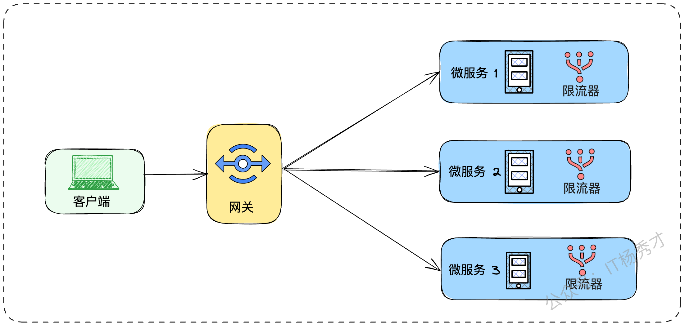
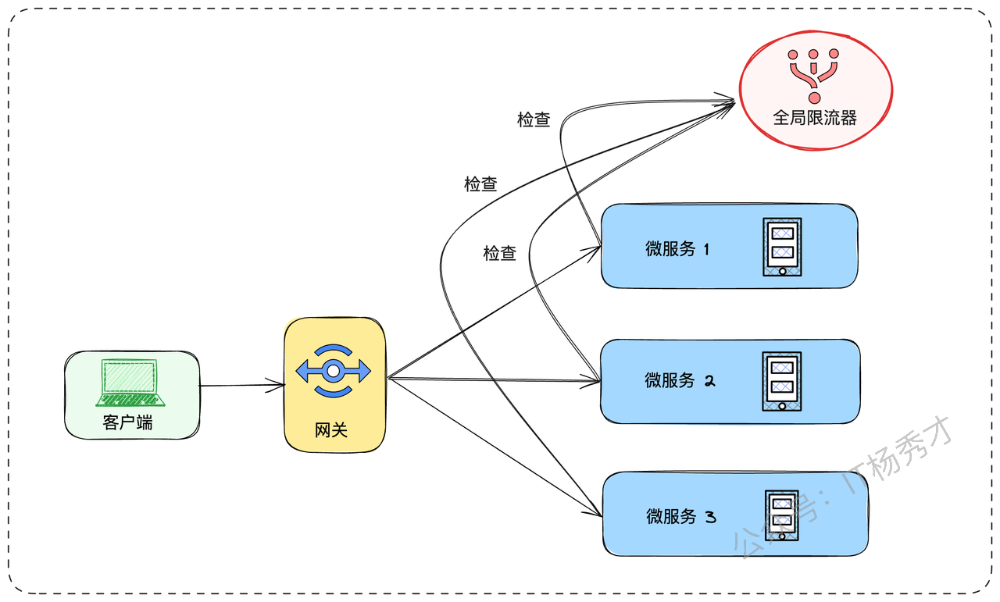
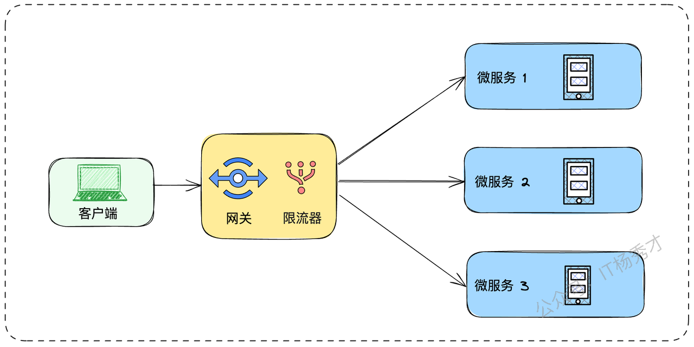
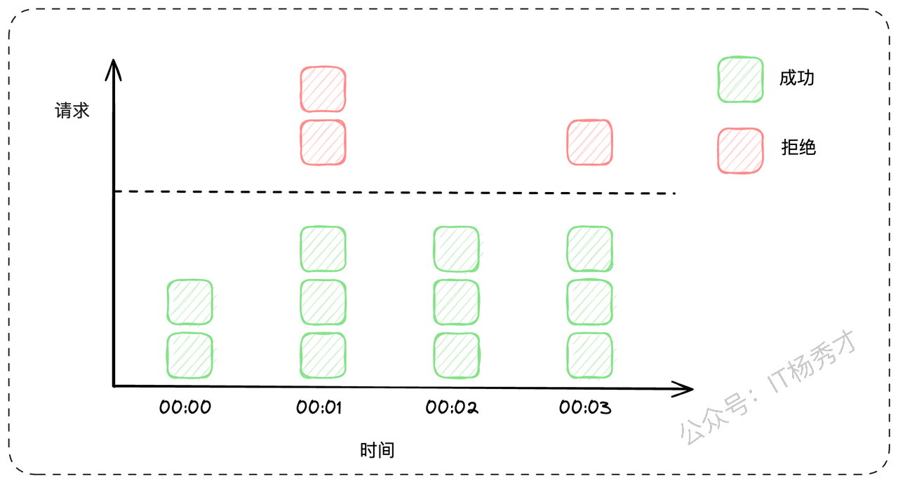
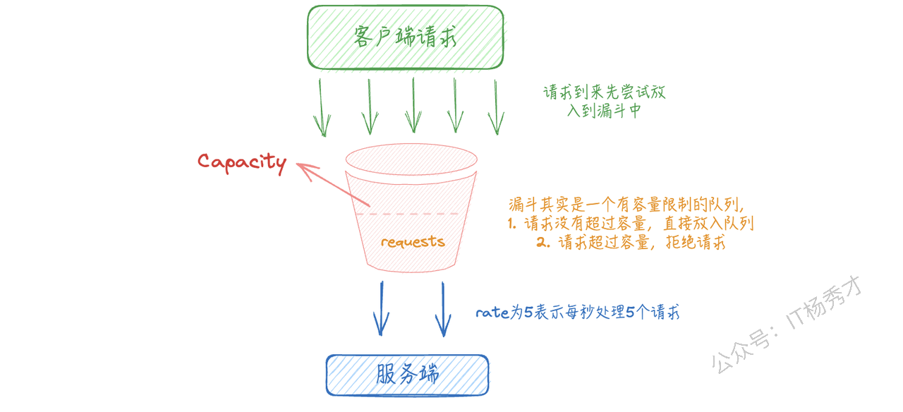
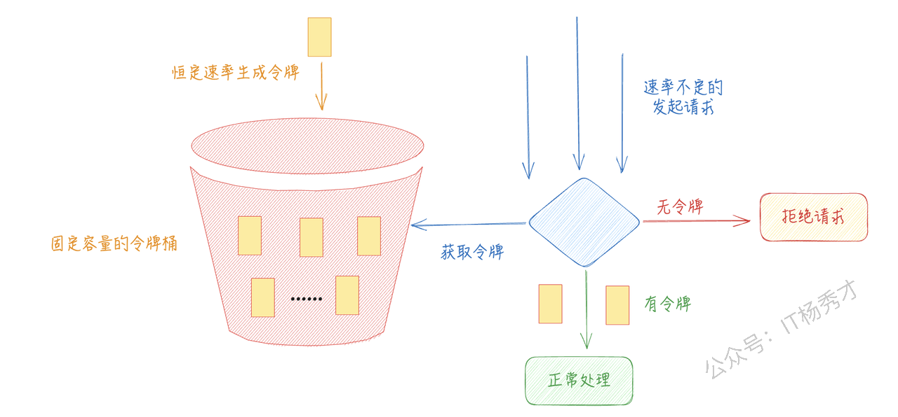
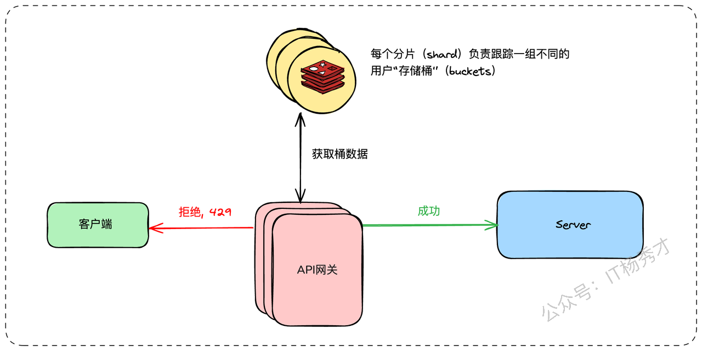
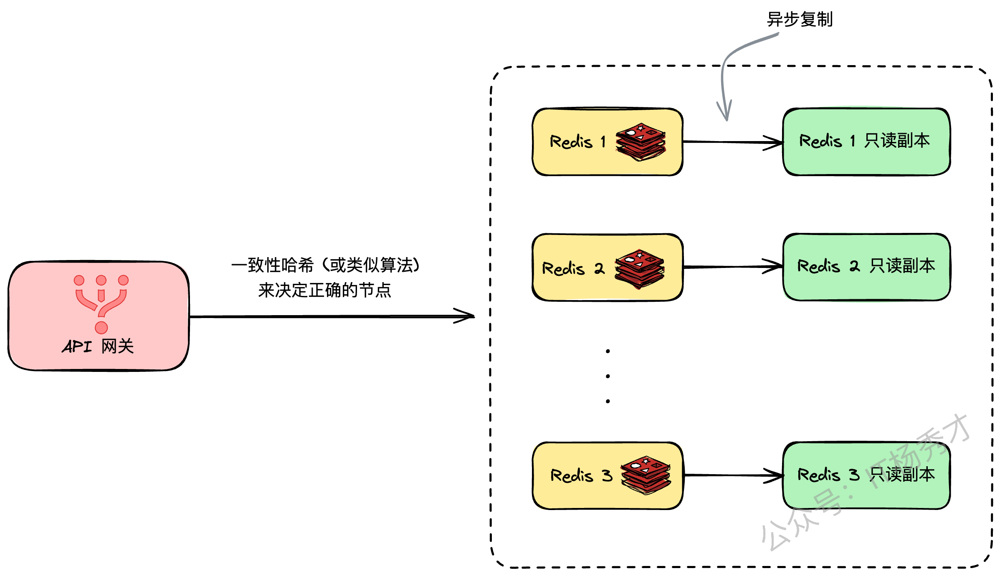
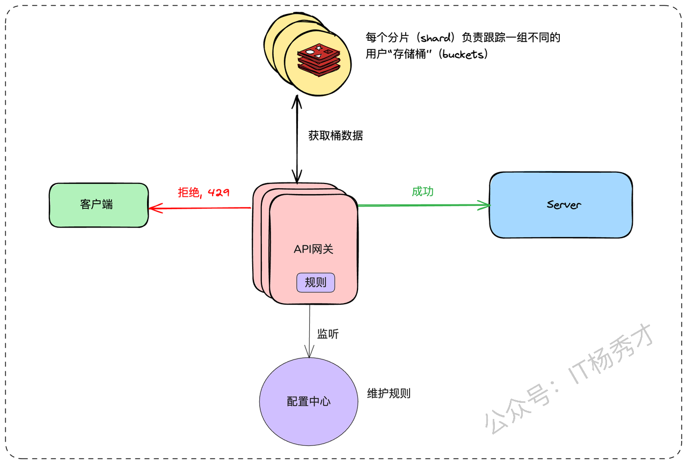

在[你的系统限流阈值是怎么设定的？](https://golangstar.cn/backend_series/advanced_interview/rate_limiting.html) 一文中，我们了解了限流在工作场景中的一些注意事项以及使用方式。这里如果要你零到一设计实现一个限流器，你会怎么设计呢

今天秀才就带大家来看另一个后端面试战场上的经典系统设计问题：设计实现一个限流器。“设计限流器”其实也跟“设计短链系统”一样，需要从多个维度出发，层层递进，抽丝剥茧。看似简单的功能背后，潜藏着分布式环境下的状态同步、高并发处理的性能挑战、不同业务场景的算法选型以及服务高可用等一系列复杂的工程难题。

下面秀才就带大家庖丁解牛，从一个核心需求出发，逐步构建出一个稳健、高效、可扩展的百万级QPS限流系统。让你在面试中游刃有余，尽显高手风范。

## **1. 什么是限流器**

拿到问题之后，还是老规矩，首先得搞明白面试官让我们设计的究竟是一个什么东西。限流器顾名思义，是一种**控制流量的机制**，用于在高并发系统中限制用户或服务的请求速率，避免系统因为过多请求而崩溃。比如允许用户每分钟发起 100 次请求，超出限额的请求将被拒绝响应

## **2. 需求梳理**

> **面试官**：“我们来聊聊系统设计吧。如果要你来实现一个高性能的限流器，你会怎么设计？”

系统设计是典型的开放性问题，我们要做的第一步永远是跟面试官对齐需求。

### **2.1 功能需求**

假设在本次面试中，面试官是让你为某社交媒体平台的 API 设计一个限流器。这就意味着我们限流器的功能是限制单个 HTTP 请求（如发布推文、获取时间线或上传照片），而不是更高层次的操作或业务功能。所以，我们要将重点讨论用于控制流量和保护系统的服务端实现方案。虽然客户端限流作为补充方案也有其价值，但这里不是我们讨论的重点

#### **2.1.1 核心需求**

1. 系统应通过用户 ID、IP 地址或 API 密钥识别客户端，以应用适当的限制。

2. 系统应根据可配置的规则限制 HTTP 请求（例如，每分钟每个用户 100 次 API 请求）。

3. 当超出限制时，系统应拒绝请求并返回 HTTP 429 状态码，并包含有用的头部信息（如剩余速率限制、重置时间）。

### **2.2 非功能需求**

明确系统功能之后，此时你应当向面试官确认规模预期。我们设计的这个系统，是为日请求量几千次的初创公司API设计的，还是为一个需要每秒处理数百万请求的大型平台设计的呢？系统的规模将直接决定我们的架构选型。

假设面试官给出的目标是：**每日1亿活跃用户，产生每秒100万次请求（1M QPS）**。

#### **2.2.1 核心需求**

这个量级，一下就将设计挑战拉满了。基于此，我们可以推导出具体的非功能性需求：

* **低延迟**：限流逻辑本身不能成为性能瓶颈，其引入的延迟开销应极小（例如，每次检查耗时 < 10ms）。

* **高可用**：限流系统作为核心基础设施，必须具备极高的可用性。在分布式环境下，可以接受最终一致性，因为节点间限流状态的微小延迟是可以容忍的。

* **高并发**：系统必须能够稳定处理每日1亿活跃用户带来的每秒100万次请求。

最后我们可以将需求整理出来，如果有白板呈现的话，我们可以在白板上做一个需求呈现


## **3. 底层设计**

需求明确之后，我们可以开始勾勒系统的内部结构了，先从核心实体和接口定义开始。

> “好的，根据刚才的需求，我们可以抽象出几个核心实体来构建我们的限流模型。”

### **3.1 核心实体定义**

尽管限流器听起来像个简单的基础设施，但其内部逻辑需要我们精确建模：

* **规则（Rule）**：定定义不同场景限制的速率限制策略。每条规则指定参数，如每个时间窗口的请求数、适用的客户端以及覆盖的端点。例如：“已认证用户每小时可请求 1000 次”或“搜索 API 每分钟每个 IP 允许 10 次请求。”

* **客户端（Client）**：被限流的对象实体。它可以是一个用户（通过UserID识别）、一个IP地址，或者一个API密钥。每个客户端都有一个关联的限流状态，用于实时追踪其当前是否符合规则。

* **请求（Request）**：进入系统的、需要被评估的API请求。每个请求都携带了上下文信息，如客户端身份、访问的端点和时间戳，这些信息是判断适用哪条规则的依据。

这三者协同工作：当一个**请求**到达时，系统首先识别出其对应的**客户端**，然后查找适用于该客户端的**规则**，最后检查其当前使用量是否超限，从而决定是放行还是拒绝。

### **3.2 系统接口设计**

限流器本质上是一个被其他业务服务调用的基础设施组件，其接口设计应当力求简洁直观。我们可以设计一个核心接口，供其他服务调用，以判断请求是否应该被允许。

```go
/**
 * 检查请求是否被允许
 * @param clientId 客户端唯一标识 (用户ID, IP地址, 或 API Key)
 * @param ruleId 规则唯一标识
 * @return 一个包含是否通过、剩余次数和重置时间的对象
 */
isRequestAllowed(clientId, ruleId) -> {
    passes: boolean,      // 是否允许通过
    remaining: number,    // 剩余请求次数
    resetTime: timestamp  // 计数器重置的时间戳
}
```

这个方法接收客户端ID和规则ID，返回一个布尔值表示是否允许请求。同时，它还会返回客户端需要知道的元数据，用于填充`X-RateLimit-Remaining`和`X-RateLimit-Reset`这两个HTTP响应头。

## **4. 高层架构设计**

我们首先得设计出一个满足核心功能需求的最小可行产品(MVP)。它不需要具备扩展性或完美无缺，只是为后续开发奠定基础。然后我们逐一检查每个功能需求，确保高层设计能满足所有要求。

### **4.1 限流器应该部署在什么位置？**

> **面试官**：“实体和接口定义清楚了。那么从架构层面看，你认为这个限流器应该部署在系统的哪个位置？”

这是一个关键的架构决策点，它直接决定了限流器能获取哪些上下文信息，以及它如何与系统的其他部分集成。你可以展示几种方案，并分析其优劣，最终给出你的选择。

> “关于部署位置，业界主要有三种方案，各有优劣。我们可以逐一分析。”

#### **4.1.1 进程内限流**

最直接的想法是，让每个应用服务或微服务自己内部实现限流逻辑。当请求进入服务时，服务检查自己内存中的计数器，更新并决定是否放行。这种方式非常快，因为一切都在内存中完成，没有网络开销。”



但这个方案有个致命缺陷：**状态不共享**。每个服务实例只知道自己接收到的流量，无法看到全局的流量情况。假设我们限制一个用户每分钟100个请求，如果有5个服务实例，请求被均匀分发，那么每个实例可能只看到20个请求，都会误认为‘远未达到阈值’，从而轻松放行。但从全局看，该用户实际上已经发起了100个请求。如果负载均衡策略变化，或者流量分布不均，限流效果就完全不可控了。所以，这种方案只适用于单体应用，或者能容忍限流精度严重偏差的场景。”

#### **4.1.2 专用服务限流**

第二种方案是限流器作为独立微服务部署在客户端与应用服务器之间。当应用服务收到请求后，先向这个限流服务发起一次RPC或HTTP调用，询问：‘用户A的这次请求是否允许？’限流服务维护着一个集中的计数器，返回‘允许’或‘拒绝’。”



这种架构非常灵活。应用服务可以传递丰富的业务上下文给限流服务，比如用户的会员等级、账户状态等，从而实现复杂的动态限流逻辑，比如“周五期间允许额外请求”这类复杂业务逻辑。还可以为系统不同部分配置独立的限流服务，各自针对特定需求进行调优。最总要的是，由于状态是集中管理的，限流的精度非常高。

不过，它的缺点也很明显。首先是**延迟**，每次业务请求都凭空增加了一次网络往返。即使限流服务响应很快（比如10ms），在高并发下，累积的延迟也是非常可观的。其次，我们引入了一个新的**单点故障风险**。如果限流服务挂了，我们必须做出选择：是‘故障开放’（fail-open），放行所有流量，可能压垮后端；还是‘故障关闭’（fail-closed），拒绝所有请求，导致整个API不可用？这两种选择都很难接受。最后，运维复杂度也增加了。”

#### **4.1.3 API网关/负载均衡器层**

“综合考虑，最优的方案是将限流逻辑前置，集成在系统的入口层，比如API网关或负载均衡器上。所有外部请求在到达任何应用服务之前，必须先经过这一层。网关根据请求信息（如IP、请求头、API密钥）应用限流规则，直接决定是转发给后端，还是立即返回HTTP 429。”

这种方法是生产系统中最主流的做法，因为它概念简单且提供了强大的保护。应用服务器永远不会看到被阻止的请求，因此它们可以完全专注于处理合法流量。



当然，它也有局限性，主要在于**上下文信息有限**。网关层通常只能获取到HTTP请求本身的信息，很难感知到深层次的业务逻辑。例如，要实现‘高级会员享受10倍限额’这样的规则，就需要会员状态信息能通过JWT令牌等方式传递到网关层。

另一个关键问题是限流状态的存储位置。网关需要快速访问计数器和时间戳，这通常意味着要使用 Redis 这类内存存储。但这样会引入外部依赖，还需要处理 Redis 响应缓慢或不可用的情况。

经过上面三种方案的分析，虽然各有其局限性，但是综合来看。我们还是要选择更优的第三种方案，在API网关/负载均衡器层实现限流。你可以这样回复面试官：

> “**面试官，综合以上分析，我选择方案三，在API网关层实现限流。** 这是业界最成熟的模式，既能实现集中控制，又避免了为每个请求增加额外的网络调用开销。”

### **4.2 如何识别客户端？**

在确定了限流器在架构中的位置之后，现在我们需要专注下一个问题：**如何识别客户端？**&#x8FD9;两个决策相互关联——部署位置的选择会影响你能轻松获取哪些客户端信息，而识别策略又会影响限流器的合理部署位置。

由于我们选择了 API 网关的方法，我们的限流器只能访问 HTTP 请求本身中的信息。这包括请求的 URL/路径、所有 HTTP 头（如 Authorization、User-Agent、X-API-Key 等）、查询参数以及客户端的 IP 地址。虽然我们理论上可以对外部数据库或其他服务进行调用，但这会增加我们希望避免的延迟，因此我们将坚持使用请求本身的信息。

我们首先需要确定什么使“客户端”具有唯一性。我们使用的键决定了如何应用限制。我们有三个主要选项：

* **用户 ID**：适用于经过身份验证的 API。每个登录用户都有自己的速率限制配额。这通常以 JWT 令牌的形式出现在 Authorization 头中。

* **IP 地址**：适用于公共 API 或没有用户账户的情况。但需注意 NAT 后或企业防火墙内的用户。IP 地址通常出现在 X-Forwarded-For 请求头中。

* **API 密钥**：开发者 API 常用方式。每个密钥持有者拥有独立限额。最常见的是通过 X-API-Key 请求头进行标识。

> 到了这一步，面试官很可能会提问：所有用户都经过身份验证吗？这是一个需要 API 密钥的开发者 API 吗？等等。

在实际应用中，你可能需要结合多种限制。也许已认证用户比匿名 IP 获得更高的限制，而高级用户可能获得更多。这反映了真实系统不仅执行全局限制，还叠加多层规则。例如：

* 每个用户的限制：“小明每小时可以发出 1000 次请求”

* 单 IP 限制:"该 IP 每分钟可发起 100 次请求"

* 全局限制:"我们的 API 每秒总共可处理 50,000 次请求"

* 端点特定限制：“搜索 API 限制为每分钟 10 次请求，但个人资料更新为每分钟 100 次”

你的限流器需要检查所有适用的规则，并执行最严格的那个。如果小明已经使用了他 1000 次请求中的 50 次，但他的 IP 地址已经达到了 100 次请求的限制，他就会被阻止。

### **4.3 限流算法选定**

> **面试官**：“OK，部署在API网关是个合理的选择。现在我们来聊聊最核心的部分：你打算用什么算法来决定一个请求是否应该被放行？”

这是设计的灵魂所在。你需要展示你对不同算法的理解，并能根据场景做出权衡。

> “限流算法主要有四种，它们在精度、资源消耗和实现复杂度上各有千秋。我们可以逐一分析。”

#### **4.3.1 固定窗口计数器**

最简单的方法是将时间划分为固定窗口（如 1 分钟的时间段），并在每个窗口中计数请求。对于每个用户，我们会维护一个在每个新窗口开始时重置为零的计数器。如果在某个窗口内计数器超过限制，则拒绝新的请求，直到窗口重置。

例如，在每分钟 100 次请求的限制下，时间窗口可能划分为 12:00:00-12:00:59、12:01:00-12:01:59 等。用户在每个窗口期内可以发起 100 次请求，之后必须等待下一个窗口开启。



实现起来非常简单。只需使用一个哈希表，将客户端 ID 映射到（计数器，窗口起始时间）这对值即可。

```plaintext
{
  "alice:12:00:00": 100,
  "alice:12:01:00": 5,
  "bob:12:00:00": 20,
  "charlie:12:00:00": 0,
  "dave:12:00:00": 54,
  "eve:12:00:00": 0,
  "frank:12:00:00": 12,
}
```

这种算法实现简单，但缺点在于**窗口边界的临界问题。**比如：限流阀值为每秒5个请求，单位时间窗口为1秒。如果在前0.5秒到1秒的时间内并发5个请求，接着在1秒到1.5秒的时间内又并发5个请求。虽然这两个时间段各自都没有超过限流阈值，但如果计算0.5秒到1.5秒的总请求数，则总共是10个请求，已经远远超过了1秒内不超过5个请求的限流标准。


#### **4.3.2 滑动窗口计数**

滑动窗口正是为了解决固定窗口的临界问题而生的。它将一个大的时间窗口（比如1分钟）分割成更小粒度的子窗口（比如60个1秒的子窗口）。每次请求到来，当前子窗口的计数器加一。当整个大窗口向右滑动时，它会丢弃掉最左边的子窗口的计数值，并纳入一个新的子窗口。整个大窗口的请求总数，就是所有子窗口计数器的总和。通过这种更平滑的窗口移动方式，滑动窗口避免了固定窗口在边界上的突刺问题，使得限流控制更加精确。

虽然滑动窗口可以一定程度上解决窗口临界流量已出问题，但是因为滑动窗口本质其实是将窗口粒度更小，但是        不管多小，仍然是以窗口来限制，所以总会存在流量不均导致的限流不准确问题

假设窗口以0.5s为小周期移动，如下图，在【0.5s，1.5s】，【1.5s，2.5s】间其实都是合理的，不会有流量超出，但是其实在【0.8s，1.8s】间就有10个请求了，并没有达到限流效果


#### **4.3.3 漏斗桶**

漏斗限流算法的核心思想是将请求存储在一个漏斗中，漏斗以固定的速率漏出请求。如果漏斗被填满，新到达的请求将被丢弃。请求可以以以不定的速率流入漏桶，而漏桶以固定的速率流出，所以漏斗算法可以将突发流量均匀地配，确保系统在稳定的负载下运行



但是这种方式同样存在以下两个问题

1. **无法动态调整流量**：漏斗的漏出速率是固定的，不够灵活，无法根据实际流量情况进行动态调整。

2. **突发流量处理有限**：在突发流量过大的情况下，漏斗可能很快被填满，大量请求将被拒绝，可能会导致服务质量下降。

#### **4.3.4 令牌桶（推荐）**

想象每个客户端都有一个桶，可以容纳一定数量的令牌（突发容量）。令牌以稳定的速率（补充速率）被添加到桶中。每个请求会消耗一个令牌。如果没有可用的令牌，请求就会被拒绝。

例如，一个桶可能容纳 100 个令牌（允许最多 100 个请求的突发），并以每分钟 10 个令牌的速度补充（稳定速率为每分钟 10 个请求）。客户端可以立即发出 100 个请求，然后必须等待令牌补充。

该算法既能处理持续负载（通过补充速率控制），又能应对临时突发流量（通过桶容量控制）。实现也很简单，只需为每个客户端记录（令牌数，最后补充时间）。难点在于选择合适的桶容量和补充速率，以及处理"冷启动"场景——闲置客户端重新激活时会拥有满桶令牌。



所以这里，选用令牌桶算法是最合适的。它在简洁性、内存效率和处理真实流量模式之间取得了最佳平衡，既能适应 API 流量的突发特性，又能严格执行整体速率限制。

这里面试官又可能会问了，“令牌桶确实是不错的选择。但我们有百万QPS，这么多用户的令牌桶状态，应该存放在哪里？如果存在各个网关实例的内存里，不又回到进程内限流的老问题了吗？”

此时你就可以从容的想面试官介绍接下来更深入的设计了，

> “您提到了关键。这个状态必须是**集中存储和共享的**。对于这种对性能要求极高、且数据结构简单的场景，**Redis** 是不二之选。它是一个高性能的内存数据库，所有API网关实例都可以访问它，作为我们令牌桶状态的唯一事实来源。”
>
> “具体实现上，我们可以为每个用户在Redis中维护一个Hash结构，存储两个关键信息：`tokens`（当前令牌数）和`last_refill_timestamp`（上次补充令牌的时间戳）。”
>
> “当请求到达网关时，流程如下：
>
> 1. 网关根据用户ID，用`HMGET`从Redis获取该用户的令牌桶状态。
>
> 2. 在网关内存中，根据当前时间与`last_refill_timestamp`的时间差，以及令牌生成速率，计算出这段时间应该补充多少新令牌，更新本地的令牌数（但不能超过桶容量）。
>
> 3. 判断更新后的令牌数是否大于等于1。如果是，则请求允许通过，并将令牌数减1；如果否，则拒绝请求。
>
> 4. 将更新后的令牌数和当前时间戳，用`HSET`写回Redis。”

厉害的面试官很容易发现这里还有问题，“等一下，你这个‘读-改-写’的流程，在分布式环境下不会有并发问题吗？比如两个请求同时到达不同的网关实例？”

确实存在**竞态条件（Race Condition）**。两个网关实例可能同时读取到还剩1个令牌，都认为可以放行，结果就是多放行了一个请求。虽然Redis的`MULTI/EXEC`事务可以保证写的原子性，但读操作在事务之外，无法解决这个问题。”

> “这里我们可以引入Lua脚本，最终的解决方案是，将整个‘读-计算-更新’的逻辑封装成一个**Lua脚本**，发送给Redis执行。Redis保证Lua脚本的执行是**原子**的。这样，整个限流决策过程就在Redis服务端一气呵成，彻底避免了竞态条件。”
>
> ```go
> MULTI
> HSET 小明:bucket tokens <new_token_count>
> HSET 小明:bucket last_refill <current_timestamp>
> EXPIRE 小明:bucket 3600
> EXEC
> ```

之后还可以在这里可以总结一下选择Redis的原因：

* **高性能**：基于内存，简单操作可达亚毫秒级响应。

* **原子操作**：通过Lua脚本保证了并发安全。

* **高可用**：支持主从复制和哨兵/集群模式。

* **自动过期**：可以利用`EXPIRE`命令，自动清理长时间不活跃用户的令牌桶数据，防止内存泄漏。”

到这里，一个基本可用的限流器就已经设计完了，最终结果是在所有网关实例中实现精确、一致的速率限制。无论小明的第 100 个请求发送到网关 A、B 还是 C，它们都能看到相同的令牌桶状态并执行相同的限制。

## **5. 扩展性设计：迈向百万QPS**

> **面试官**：“方案很完善。但我们最初的目标是百万QPS。单个Redis实例，即使性能再好，恐怕也扛不住这么大的流量吧？”

单个Redis实例的处理能力通常在10万QPS级别，无法满足100万QPS的目标。因此，我们必须对Redis进行**水平扩展**，也就是部署一个Redis集群。

### **5.1 如何扩展Redis？**

我们需要将海量的用户令牌桶数据，分散到多个Redis实例上。关键在于**分片（Sharding）**。

> “我们可以采用**一致性哈希**算法。当一个请求到来时，网关提取客户端标识（UserID、IP或API Key），这里，对于认证用户，我们对其用户 ID 进行哈希以确定存储其速率限制数据的 Redis 分片。对于匿名用户，我们对其 IP 地址进行哈希处理。对于 API 密钥请求，我们则对 API 密钥进行哈希。
>
> 通过一致性哈希算法计算出该标识应该路由到哪个Redis分片。这样可以保证同一个客户端的所有请求，始终命中同一个Redis实例，确保其限流状态的完整性。”



在生产环境中，我们通常会直接使用**Redis Cluster**方案。它内置了数据分片逻辑（通过16384个哈希槽），API网关只需要连接到集群，客户端库会自动处理请求到正确节点的路由，无需我们自己实现复杂的一致性哈希逻辑。假设我们部署10个Redis分片，每个分片承载10万QPS，理论上就能达到100万QPS的目标。

### **5.2 如何保证高可用？**

现在我们有了多个Redis分片，每个分片都成了系统的关键依赖。如果任何一个分片宕机，所有速率限制数据存储在该分片上的用户将失去速率限制功能。这会导致可用性问题，如果用户在无法获得正确的速率限制响应时开始积极重试，还可能引发级联故障。我们需要对故障模式做出根本性决策：关闭故障还是开放故障？

> **面试官**：“那当一个Redis分片不可用时，你选择故障开放还是故障关闭？”

这是一个经典的取舍问题。

* **故障关闭（Fail-Closed）**：当无法连接Redis时，拒绝所有未知状态的请求。这能最大限度地保护后端系统，但会牺牲可用性，可能在限流组件故障时导致API整体不可用。

* **故障开放（Fail-Open）**：当无法连接Redis时，放行所有请求。这能保证API的可用性，但牺牲了保护作用，可能在流量洪峰时因失去限流而导致整个后端系统雪崩。

对于我们这个社交媒体平台，限流失败往往和流量激增同时发生（比如热点事件）。在这种情况下，保护后端系统是第一要务。因此，我会选择**故障关闭**。短暂地拒绝一部分请求，远比整个平台崩溃的代价要小。”

当然，选择故障模式只是兜底策略。更重要的是通过高可用设计来**避免故障**。标准的做法是为每个Redis分片配置**主从复制（Master-Slave Replication）**。每个主节点都有一个或多个从节点实时同步数据。当主节点故障时，可以自动或手动进行故障转移（Failover），将一个从节点提升为新的主节点。Redis Sentinel或Redis Cluster本身就提供了强大的高可用和故障转移能力。”



### **5.3 如何最小化延迟？**

每次限速检查都需要与 Redis 进行一次网络往返，这会增加用户请求的延迟。尽管 Redis 操作通常在亚毫秒级别，但网络开销每请求可能增加几毫秒。在每秒 100 万次请求的情况下，这种延迟可能会成为一个问题。

这里我们主要有两种优化手段：

1. **连接池**：API网关与Redis之间维护一个持久的连接池，避免为每个请求都重新建立TCP连接，从而省去握手带来的开销。

2. **地理就近部署**：将API网关和Redis集群部署在同一个数据中心或可用区内，确保极低的网络延迟。对于全球化的服务，可以在全球多个Region部署多套限流设施，通过DNS等方式将用户路由到最近的接入点。

当然还有一种优化手段，那就是本地缓存的方式，但是这里可能会存在一个本地缓存和redis缓存的一致性问题。当出现不一致的时候，陈旧的缓存数据可能导致不正确的速率限制决策。通常来说，前两项优化基本上可以满足一般的业务需求了

### **5.4 如何处理热点问题？**

> **面试官**：“如果某个用户（比如一个爬虫或一个热门应用的后端服务）请求量特别大，把分配给它的那个Redis分片打满了，怎么办？”

这是一个典型的热点Key问题。单个客户端的请求压垮一个分片，这通常意味着滥用行为或设计不当的合法客户端。

* **针对滥用流量**：我们可以设计一个‘自动拉黑’机制。当一个客户端在短时间内持续触发限流（例如，一分钟内触发10次），就自动将其IP或API Key加入一个临时黑名单（也可以存在Redis里），在更上游的防火墙或网关层面直接拒绝其后续所有请求。

* **针对合法高流量客户**：可以提供更高等级的API套餐，为他们分配更高的限流阈值，甚至在物理上将他们路由到专用的、资源更丰富的限流集群。同时，也应该在API文档和SDK中，倡导客户端也实现合理的**客户端限流**和退避策略，从源头平滑请求。

### **5.5 动态调整规则配置**

* 锦上添花：动态配置

> **面试官**：“设计得非常全面了。最后一个问题，如果运营同学想临时调整某个API的限流规则，比如在大促期间提高下单接口的限制，我们总不能每次都去修改配置发版吧？”

这里就涉及到限流规则的动态配置了，这其实是一个锦上添花的设计，如果在面试的时候你能够考虑到，将是一个很大的加分项。

> 你可以这样回答，“当然不能。限流规则必须支持**动态配置**。我们可以将规则存储在一个外部的配置中心，比如Nacos、Apollo，或者简单的数据库表中。API网关实例会**订阅**这些配置的变更。

订阅的方式主要有以下两种：

* **拉（Pull）模式**：网关定时去配置中心拉取最新的规则，缓存在本地内存。这种方式的优点是实现简单，配置服务可以简单到只是一个数据库表。但配置更新有延迟，在更改规则和该规则在所有网关中生效之间总存在一个时间窗口。如果由于攻击需要紧急降低限制，您可能需要等待长达 30 秒才能使更改传播。对于大多数操作场景，这种延迟是可以接受的，但在紧急情况下可能会出现问题。

* **推（Push）-based**：网关与配置中心建立长连接。一旦配置发生变更，配置中心会主动将新规则推送给所有网关实例。这种方式实时性最好，但架构更复杂。需要额外处理连接故障、确保所有网关都能接收更新，并应对部分网关更新成功而其他网关失败的场景。当推送系统不可用时，还需要设计回退机制。



对于大多数场景，基于轮询的‘拉模式’（比如每30秒拉一次）已经足够。如果对实时性要求极高，可以选择基于推送的方案。”

## **6. 小结**

到这里，一个百万QPS限流系统的设计差不多就完成了。

回顾我们的整个设计过程，这个方案有什么特点？首先是需求驱动的设计思路，我们没有一上来就谈技术，而是先搞清楚要解决什么问题。其次是技术选型的权衡逻辑，每一个关键决策点都有充分的对比分析，比如为什么选API网关部署、为什么用令牌桶算法、为什么用Redis集群。最后是对非功能性需求的关注，不仅要功能正确，还要考虑性能、可用性、可运维性等工程实践问题。

面试官看重的是什么？不是你背了多少技术名词，而是你能不能把一个模糊的问题变成清晰的解决方案。当你展示出这种结构化思考和全局权衡的能力时，就证明了你具备处理复杂系统问题的潜质。

## **资料分享**

随着AI发展越来越快，AI编程能力越来越强大，现在很多基础的写接口，编码工作AI都能很好地完成了。并且现在的面试八股问题也在逐渐弱化，**面试更多的是查考候选人是不是具备一定的知识体系，有一定的架构设计能力，能解决一些场景问题**。所以，不管是校招还是社招，这都要求我们一定要具备架构能力了，不能再当一个纯八股选手或者是只会写接口的初级码农了。这里，秀才为大家精选了一些架构学习资料，学完后从实战，到面试再到晋升，都能很好的应付。**关注秀才公众号：IT杨秀才，回复：111，即可免费领取哦**


<div style="background-color: #f0f9eb; padding: 10px 15px; border-radius: 4px; border-left: 5px solid #67c23a; margin: 20px 0; color:rgb(64, 147, 255);">

## <span style="color: #006400;">**学习交流**</span>
<span style="color:rgb(4, 4, 4);">
> 如果您觉得文章有帮助，可以关注下秀才的<strong style="color: red;">公众号：IT杨秀才</strong>，后续更多优质的文章都会在公众号第一时间发布，不一定会及时同步到网站。点个关注👇，优质内容不错过
</span>


</div>