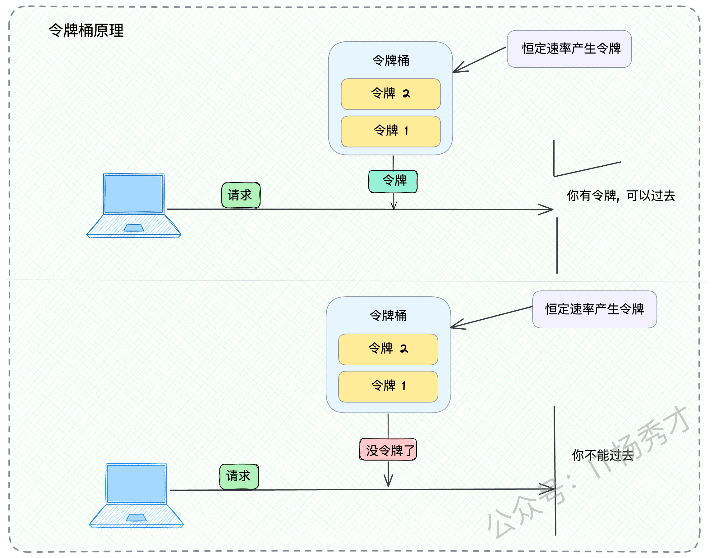
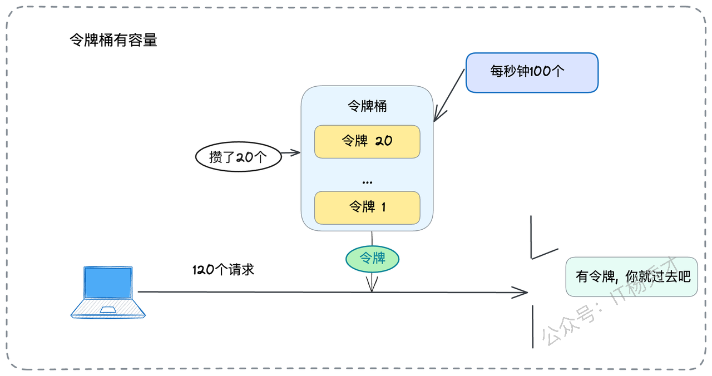

# 限流：从算法到阈值，一次性讲透

熔断、降级、限流，作为保障系统稳定性的三驾马车，想必大家已不陌生。但说实话，跟熔断、降级比起来，限流这东西，要复杂得多。在面试中，多数时候对限流的考察停留在算法层面，偶尔会深入到像BBR这样的动态算法。但有一个问题，堪称"照妖镜"，能立刻区分出候选人的深度，那就是："**你们系统限流的阈值是怎么定的？**"

这个问题，光懂算法是绝对不够的。它真正考验的是你从理论到实践的落地能力，以及对系统全貌的把控。今天，我就带你把这个问题彻底盘透，让你以后再遇到时，能给出一个让面试官眼前一亮的答案。

## 1. 基础夯实：限流的核心三要素

在直面"阈值计算"这个核心难题之前，我们必须确保基础知识的稳固。任何高阶的探讨都源于对基础的深刻理解。限流的知识体系，可以归纳为三个核心要素：**限流算法、限流对象、以及限流后的应对策略**。

简单来说，限流就是通过限制进入系统的流量大小来保护下游服务，它尤其擅长应对非预期的突发流量。无论是外部的恶意攻击，还是内部由于异常情况（如缓存失效）导致的流量放大，限流都是保护系统的第一道，也是至关重要的防线。

### 1.1 **核心限流算法**

限流算法五花八门，但从宏观上可以分为两大阵营：静态算法与动态算法。

* **静态算法**：这类算法的核心特点是阈值需要由研发人员预先设定。算法在运行期间，忠实地执行这个预设值，而不会主动关心服务器的真实负载是高是低。常见的静态算法包括**令牌桶、漏桶、固定窗口**和**滑动窗口**。

* **动态算法**：又称为自适应限流算法，其典型代表是 **BBR (Bottleneck Bandwidth and Round-trip propagation time) 算法**。这类算法借鉴了TCP拥塞控制的思想，通过实时监测系统的一系列关键指标（如RT、吞吐量），来动态地、智能地调整流量阈值，试图在"压榨系统性能"和"保证系统稳定"之间找到最佳平衡点。它控制的是业务请求，而TCP控制的是网络报文，但其背后的博弈思想是相通的。

当然，除了这些业界公认的算法，我们完全可以结合自身业务的特点，设计符合特定场景的限流策略。比如，如果你的业务是一个内存消耗巨大的服务，那么将"剩余可用内存"作为关键指标，当内存水位低于某个阈值时就触发限流，也是一种非常有效且合理的自定义算法。

下面，我们来快速回顾一下几种经典的静态算法。

#### 1.1.1 **令牌桶（Token Bucket）**

令牌桶算法是一个非常经典且应用广泛的模型。你可以把它想象成一个发号机：系统以一个恒定的速率（比如每秒100个）往一个有固定容量的桶里（比如容量200）投放令牌。每个外部请求到达时，都必须先尝试从桶里获取一个令牌。如果成功获取，请求就被放行，继续由后端业务逻辑处理；如果桶里已经没有令牌了，那么该请求就会被限流。

令牌桶最关键的一个特性是**允许一定程度的突发流量**。由于桶本身有容量，在流量低谷期，即使没有请求消耗，令牌也会持续生成并累积在桶里，直到装满为止。比如，桶的容量是200，生成速率是100个/秒。如果前几秒很空闲，桶里已经攒了200个令牌。那么在接下来的一秒内，系统最多可以应对 `100（本秒新生成） + 200（积攒的） = 300` 个请求。这种"削峰填谷"的能力，使得令牌桶非常适合那些平时流量平稳，但偶尔会有瞬时高峰的业务场景。

#### 1.1.2 **漏桶（Leaky Bucket）**

漏桶算法则提供了一种完全不同的思路。你可以把它想象成一个顶部开口、底部有孔的漏斗。无论上方的水流（请求）是多么汹涌或时断时续，从底部漏下去的水流（被处理的请求）速率永远是恒定且平滑的。

从某种意义上看，**漏桶可以被视为令牌桶的一个特例，即桶容量为0的令牌桶**。

在这种特例下，令牌一旦生成，就必须被立即消耗掉，没有任何积攒的可能。因此，漏桶对流量的"整形"效果非常极致，它保证了后端业务接收到的请求速率是绝对均匀的。这对于一些处理能力非常敏感，无法承受任何流量毛刺的下游系统来说，是一种很好的保护机制。

#### 1.1.3 **固定窗口与滑动窗口**

这两种算法是基于时间窗口的计数器实现，也比较容易理解。

* **固定窗口**：这种算法将时间轴粗暴地分割成一个个固定长度的区间（窗口），例如，每1秒一个窗口。然后在每个窗口内维护一个计数器。每当有请求进入，计数器加一。如果计数器的值超过了设定的阈值，那么该窗口内后续的所有请求都将被拒绝。当时间进入下一个窗口时，计数器被重置为0。这种算法实现简单，但缺点在于**窗口边界的临界问题。**&#x6BD4;如：限流阀值为每秒5个请求，单位时间窗口为1秒。如果在前0.5秒到1秒的时间内并发5个请求，接着在1秒到1.5秒的时间内又并发5个请求。虽然这两个时间段各自都没有超过限流阈值，但如果计算0.5秒到1.5秒的总请求数，则总共是10个请求，已经远远超过了1秒内不超过5个请求的限流标准。

* **滑动窗口**：滑动窗口正是为了解决固定窗口的临界问题而生的。它将一个大的时间窗口（比如1分钟）分割成更小粒度的子窗口（比如60个1秒的子窗口）。每次请求到来，当前子窗口的计数器加一。当整个大窗口向右滑动时，它会丢弃掉最左边的子窗口的计数值，并纳入一个新的子窗口。整个大窗口的请求总数，就是所有子窗口计数器的总和。通过这种更平滑的窗口移动方式，滑动窗口避免了固定窗口在边界上的突刺问题，使得限流控制更加精确。

虽然滑动窗口可以一定程度上解决窗口临界流量已出问题，但是因为滑动窗口本质其实是将窗口粒度更小，但是        不管多小，仍然是以窗口来限制，所以总会存在流量不均导致的限流不准确问题

假设窗口以0.5s为小周期移动，如下图，在【0.5s，1.5s】，【1.5s，2.5s】间其实都是合理的，不会有流量超出，但是其实在【0.8s，1.8s】间就有10个请求了，并没有达到限流效果

### 1.2 **限流对象**

明确了算法，我们还需要清晰地定义限流的**作用对象**。

从**部署维度**看，可以分为**单机限流**和**集群限流**。

* **单机限流**：限流逻辑仅在单个服务实例内部生效，实现简单，但无法对整个集群的总流量进行控制。

* **集群限流**：需要一个中心化的组件来统计整个集群的流量信息。**Redis** 因其高性能的原子操作（如 `INCR`）而成为实现集群限流的常用选择。当然，如果限流逻辑本身是实现在**网关层**（如 Nginx、Spring Cloud Gateway），那么网关节点自身就可以作为这个"中心节点"，从而摆脱对外部中间件的依赖。

从**业务维度**看，限流的对象就更加丰富多样了。

* **按用户身份**：例如，在提供增值服务时，可以对VIP用户不限流，而对普通用户的访问频率进行限制。

* **按IP地址**：这是防范DDoS攻击和恶意爬虫的经典手段。例如，对登录、注册、秒杀等关键接口，可以限制单个IP在单位时间内的请求次数。正常用户的"手速"是有限的，即便考虑到公共出口IP的情况，设置一个合理的阈值（如50次/秒）也能有效地将大部分机器行为挡在门外。

* **按业务ID**：例如，针对某个特定的`userId`、`orderId`或`productId`进行限流，以防止单个用户或针对单个业务实体的滥用行为，确保资源的公平使用。

### 1.3 **限流后的应对策略**

当一个请求不幸被限流策略"命中"时，我们并非只能简单粗暴地返回一个错误码。设计精巧的后续处理方案，同样是体现架构水平的地方。

* **同步阻塞等待**：如果只是偶发性地、轻微地超出了阈值（例如，限流100 QPS，却来了101个请求），让这多出来的1个请求短暂地阻塞等待一会儿，也许几十毫秒后就能获取到新的令牌。这种方式对用户几乎是无感的。但必须要注意，**等待必须设置超时时间**，不能让请求无限期地阻塞下去，否则可能会耗尽服务端的线程资源。

* **同步转异步**：这是一种非常优雅的"削峰填谷"手段。对于未被限流的请求，正常同步处理并返回结果；对于被限流的请求，我们可以将其信息持久化（例如，存入消息队列MQ），并立即给用户一个"排队中"或"稍后处理"的友好提示。然后由后台的消费者任务在业务低峰期，从MQ中拉取这些请求进行处理。这与服务降级中的"异步处理"思路如出一辙。

* **联动负载均衡**：当某个服务节点频繁触发限流时，这本身就是一个强烈的信号，表明该节点已经处于高负载或过载状态。这个信号可以被上游的负载均衡器捕获。负载均衡器可以据此**动态地降低该节点的权重**，从而减少后续分配给它的新请求流量。注意，这与熔断不同，熔断是彻底切断流量，而这里只是降低流量的概率，是一种更为柔和的保护性降级。

## 2. 直面"灵魂拷问"：阈值到底怎么算？

好了，经过前面的充分热身，现在让我们正式进入本文的核心战场：**当面试官问你"限流阈值怎么定"时，他到底想听到什么？**

他想听到的，绝不是"凭感觉"、"拍脑袋"或者"领导定的"。他想考察的是你是否具备一套科学的、体系化的方法论来解决这个至关重要的工程问题。

总体来说，确定阈值有四种主流思路，其可靠性依次递减：**压力测试、观测监控、参考借鉴和手动估算**。

### 2.1 **做压力测试（黄金标准）**

这是确定服务容量和限流阈值的**最佳实践**，是所有严谨的工程团队都应遵循的准则。

你可以这样展开你的回答：

> "要科学地确定限流阈值，最可靠的方法就是进行压力测试，精准地找到我们服务的'性能拐点'。如果公司的基建条件允许，**全链路压测**是首选，因为它能最真实地模拟线上环境的复杂调用关系和资源竞争，得出的数据也最具有参考价值。如果暂时不具备全链路压测的条件，那么退而求其次，也应该在预发布环境或者一个硬件配置与线上一致的独立测试环境中，对目标服务进行单节点的压力测试。"

接下来，是真正展现你技术功底的时刻了。你需要清晰地解释如何解读压测数据。你可以在白板上或者用语言生动地描述出下面这张经典的性能曲线图。

> "在压测过程中，我们会以QPS（每秒查询率）为横轴，不断增加施加的压力，同时密切观测三个核心的性能指标：**响应时间（Latency）、吞吐量（Throughput）和资源利用率（CPU/Memory Usage）**。通常，我们会得到类似图中所示的三条相互关联的曲线。"
>
> "从这张图中，我们至少可以识别出三个具有里程碑意义的关键点位："
>
> * "**A点：最佳性能点**。在A点之前，随着QPS的稳步增长，服务的响应时间几乎保持不变或仅有轻微上浮，系统处于'游刃有余'的健康状态。这个点可以为用户提供最佳的性能体验。"
>
> * "**C点：最大吞吐量点**。系统在这个点位达到了其能够处理的请求量的极限。如果继续增加压力，超过C点后，由于内部资源（如线程、锁、连接池）的过度争抢，系统的总吞吐量反而会不增反降。"
>
> * "**B点：系统崩溃临界点**。在这一点，服务的响应时间开始急剧恶化，系统处于极不稳定的状态，随时可能因资源耗尽而雪崩。很多时候，大家会把这个点对应的QPS视为服务的绝对容量极限。"
>
> "那么，限流的阈值到底应该设在哪一点呢？这并没有一个放之四海而皆准的答案，需要根据具体的业务场景和目标来进行权衡和取舍："
>
> * "如果这个服务对**用户体验（即低延迟）的要求极为苛刻**，例如一些实时的交易或交互场景，我可能会选择 **A 点**对应的QPS作为限流阈值，以牺牲一部分极限吞吐量为代价，换取最稳定、最快速的响应。"
>
> * "如果业务的核心目标是**最大化处理能力，追求极致的吞吐量**，例如一些后台的、异步的数据处理任务，对单次任务的延迟不敏感，那么我可能会选择 **C 点**对应的QPS作为阈值。"
>
> * "而对于大部分常规的在线业务，我们通常会在A点和C点之间寻找一个**平衡点**，或者更常见的做法是，以C点的QPS值乘以一个安全系数（例如80%或90%），以此作为最终的限流阈值，为系统预留出一定的缓冲空间。"

如果面试官提出质疑，比如"压测在很多公司难以落地"，你需要展现出专业坚持和务实的态度。

> "我非常理解在一些团队中，由于技术基建、流程规范或资源限制，推行标准化的压力测试确实存在挑战。但我仍然坚信，**压测是保障系统性能和可用性的关键基石**，是技术团队走向成熟的必经之路。没有精准的压测数据作为支撑，许多性能优化、容量规划和成本控制工作都将是'盲人摸象'，难以科学地开展。所以我认为，我们应该积极地推动和建设压测体系。"

### 2.2 **看监控数据（务实补充）**

在表明了对压测的专业立场后，你可以给出在无法压测时的次优选择。

> "当然，如果在项目初期或者某些紧急情况下，确实来不及进行充分的压测，我们也可以通过分析线上服务的历史性能数据来**初步估算**一个相对合理的阈值。我会拉取过去一段时间（比如一个月或一个季度）的监控数据，重点关注业务高峰期的各项核心指标。如果在历史峰值时刻，整个集群的总QPS都未曾超过1000，并且此时的CPU、内存、网络IO等资源利用率也都在一个非常健康的水平（比如CPU低于60%），那么我可能会考虑将集群的总阈值初步设定在1200，多出来的200作为安全余量（Buffer），以应对未来的业务增长和无法预见的流量波动。"

同时，也要主动指出这种方法的**固有缺陷**：

> "不过，这种方法有两个明显的局限性。第一，它依赖于服务已经上线并积累了足够的历史数据。第二，这样得出的阈值很可能是**显著偏低**的。因为业务的历史峰值，并不等同于系统的性能极限。可能我们的集群明明能扛住3000 QPS，但因为业务量一直没那么大，导致我们基于1000 QPS的观测数据定了一个非常保守的阈值，这在某种程度上造成了硬件资源的闲置和浪费。"

### 2.3 **参考与借鉴（经验之谈）**

如果连历史数据都没有，比如一个全新的业务，该怎么办？

> "如果是一个全新的业务，既没有压测数据，也没有历史监控数据，那么我们可以考虑第三种方法：**参考和借鉴**。我们可以寻找系统中与之业务逻辑类似、技术栈相同、或者存在上下游调用关系的服务。例如，如果服务A和服务B是紧密耦合的，通常调用了A就会调用B，那么我们可以参考A已经确定的限流阈值来设定B的阈值。又或者，我们可以根据**业务转化率**来推算。例如，我们知道从'创建订单'接口到'发起支付'接口，用户的转化率大约是90%。如果根据压测，'创建订单'的单机限流阈值是100 QPS，那么'支付'接口的单机阈值就可以初步设定为 90 QPS。"

### 2.4 **手动估算（无奈之举）**

这是在所有其他方法都不可行时的最后手段，准确度最差，但聊胜于无。

> "如果以上方法都行不通，那就只剩下最后一招，也是最不精确的一招了：**手动估算**。具体做法是，我们需要详细地分析单次请求的**核心处理路径**，把它拆解成若干个关键步骤，并估算每一步的平均耗时。例如，一次请求的核心路径包含："
>
> * 1次对下游微服务的RPC调用（根据经验或监控，平均耗时 20ms）
>
> * 2次对Redis的访问（平均每次 1ms）
>
> * 1次会回表的数据库查询（平均耗时 10ms）
>
> "将这些耗时相加，我们得到 `20 + 2*1 + 10 = 32ms`。再为CPU自身的计算、序列化/反序列化等逻辑处理预留一些时间，比如8ms。那么我们粗略估算出单次请求的总耗时大约是 40ms。基于这个耗时，我们可以估算理论QPS："
>
> * 一个CPU核心在1秒钟（1000ms）内，理论上能处理的请求数是 `1000ms / 40ms = 25` 个。
>
> * 如果我们的服务实例规格是 4 核 CPU，那么单机的理论QPS上限就是 `25 * 4 = 100`。
>
> "当然，我必须强调，这个估算模型**非常粗糙**。它忽略了太多现实世界中的复杂因素，比如JVM的GC停顿、IO等待、网络延迟、线程上下文切换、锁竞争等等。所以，通过这种方式计算出来的值，**必须再乘以一个比较大的折扣系数**（比如50%或60%），得出一个非常保守的初始阈值。这个值只能作为服务上线时的临时保护，后续必须尽快通过压测或监控数据来进行修正。"

最后，你可以用一个具有前瞻性的观点来升华你的整个回答：

> "总而言之，确定阈值是一个系统性的、迭代的工程活动，需要结合多种方法。我所推崇的最佳实践是，**以严谨的压力测试为基础，以实时的线上监控为佐证，并最终将限流阈值设计成可通过配置中心动态调整的**。这样，我们就可以在服务上线初期采用一个保守的策略，然后根据线上的实际表现，逐步、安全地将阈值上调，最终让系统的性能潜力得到充分而又安全的释放。"

## 3. 面试时的加分项与叙事技巧

除了正面回答核心问题，你还可以在面试中巧妙地穿插一些深入的思考，展现你的技术广度和深度。

### 3.1 **突发流量（Bursty Traffic）与算法选择**

在介绍令牌桶和漏桶时，可以主动引出这个话题，展现你对算法适用场景的理解：

> "在选择限流算法时，一个重要的考量点就是服务是否需要应对突发流量。漏桶算法的输出速率是绝对平滑的，它对偶发的突-发流量处理能力较差。相比之下，令牌桶通过其'可积攒令牌'的机制，能够很好地应对小规模的突发流量。例如，我们设置令牌生成速率是100个/秒，但桶的容量是50个。这意味着，如果前一秒系统比较空闲，攒下了50个令牌，那么下一秒最多可以处理 `100（本秒生成的） + 50（积攒的） = 150` 个请求。这在应对许多Web应用的瞬时高峰时非常有用。"
>
> "但凡事有利有弊。令牌桶的容量（Burst Size）也需要谨慎设置。如果容量过大，积攒的令牌过多，那么在真正的流量洪峰到来时，可能会在短时间内放入远超后端承受能力的请求，从而失去了限流的初衷，甚至成为压垮系统的'帮凶'。"

### 3.2 **请求大小（Request Size）的局限性**

这是一个经常被忽略但非常深刻的问题，能体现你对问题本质的思考：

> "另外，我们需要清醒地认识到，目前我们讨论的所有主流限流算法，无论是哪一种，其限流的维度基本都是'请求的个数'。这背后其实隐藏着一个重要的假设，即每个请求对系统资源的消耗是大致均等的。但在现实业务中，这个假设往往不成立。一个简单的'获取用户信息'的请求和一个复杂的'生成年度报表'的请求，其消耗的CPU和内存可能相差几个数量级。"
>
> "这就导致了一个固有的局限性：即使我们严格地将请求数限制在每秒100个，但如果某一秒涌入的恰好都是'重量级'的大请求，系统依然有因资源耗尽而崩溃的风险。动态限流算法通过监测响应时间等指标，在一定程度上能间接地感知到这种'大请求'带来的压力，从而进行收缩，但也很难从根本上解决问题。这是一个在做限流设计时必须意识到的、理论层面的挑战。"

### 3.3 **打造你的"故事线"**

在面试中，最高级的沟通不是干巴巴地背诵知识点，而是将这些知识点有机地融入到你的项目故事中。

* **准备翔实的案例**：面试前，务必深入复盘你参与过的项目。限流具体用在了哪个场景？是对外的HTTP API做了IP限流，还是核心服务之间做了RPC限流？阈值是多少？当时是如何确定这个值的？被限流的请求是直接拒绝，还是排队处理？把这些细节梳理清楚，它们是你最有力的"弹药"。

* **建立知识的关联**：展现你结构化的知识体系。在聊到系统设计、服务治理、API网关，甚至在聊到TCP拥塞控制时，都可以自然而然地把话题引到限流上，让面试官看到你知识的广度和连贯性。

* **用行动证明能力**：如果你有时间和精力，可以尝试为一些知名的开源框架（比如gRPC、Dubbo、Spring Cloud）贡献一个限流相关的PR。这不一定要求代码被合并，关键在于，这个过程本身就是一个强有力的证据，它能向面试官雄辩地证明：你不仅懂理论，还能动手实现，并且拥有拥抱开源的技术热情。

## 4. 总结

限流，这个看似简单的技术点，实则深潜着从算法理论到复杂工程实践的诸多细节与权衡。希望今天这篇文章，能帮你把这些散落的知识点串联起来，形成一套属于你自己的、体系化的认知。

记住，下次再被问到限流时，不要只停留在背诵算法的层面。主动将话题引向**阈值的科学计算方法论**，向面试官展示你如何结合**监控、压测、业务分析**等多种手段来解决一个复杂的、现实的工程问题。这，才是让你在众多候选人中脱颖而出的关键所在。

# 资料分享
随着AI发展越来越快，AI编程能力越来越强大，现在很多基础的写接口，编码工作AI都能很好地完成了。并且现在的面试八股问题也在逐渐弱化，**面试更多的是查考候选人是不是具备一定的知识体系，有一定的架构设计能力，能解决一些场景问题**。所以，不管是校招还是社招，这都要求我们一定要具备架构能力了，不能再当一个纯八股选手或者是只会写接口的初级码农了。这里，秀才为大家精选了一些架构学习资料，学完后从实战，到面试再到晋升，都能很好的应付。**关注秀才公众号：IT杨秀才，回复：111，即可免费领取哦**

## **学习交流**

> 如果您觉得文章有帮助，可以关注下秀才的<strong style="color: red;">公众号：IT杨秀才</strong>，后续更多优质的文章都会在公众号第一时间发布，不一定会及时同步到网站。点个关注👇，优质内容不错过

