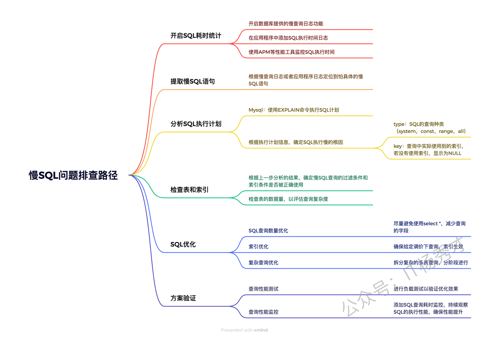
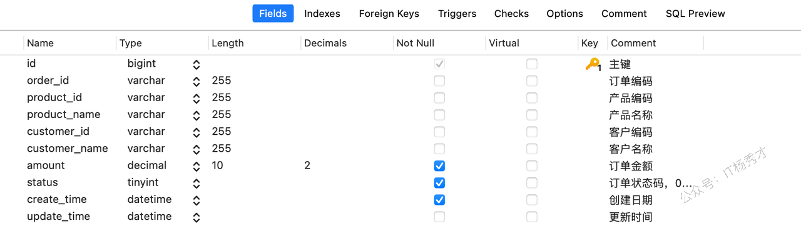
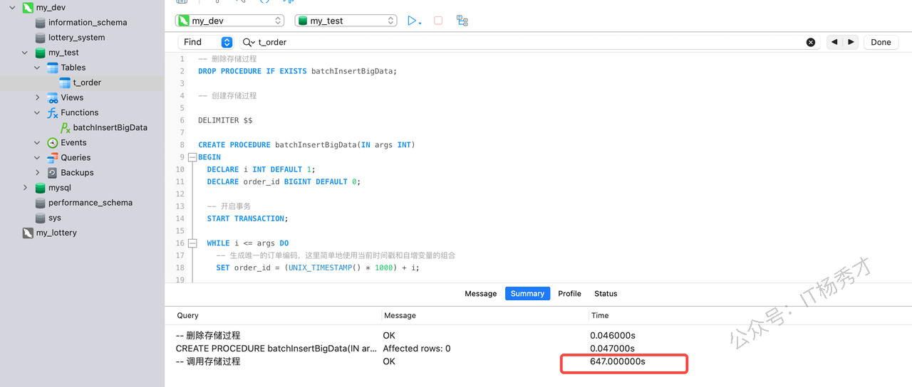
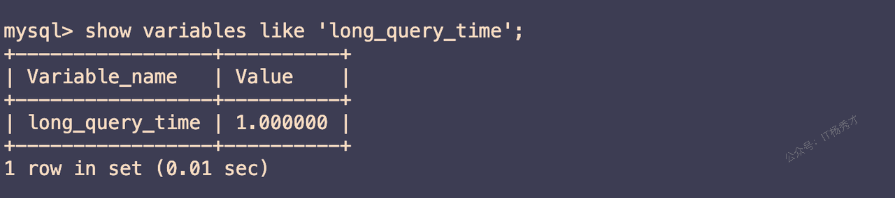
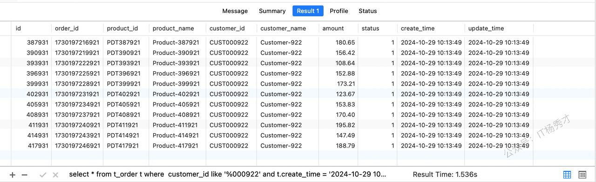
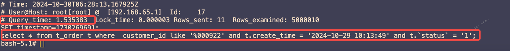
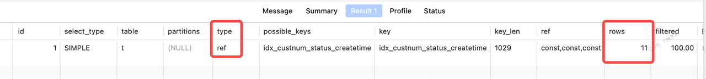
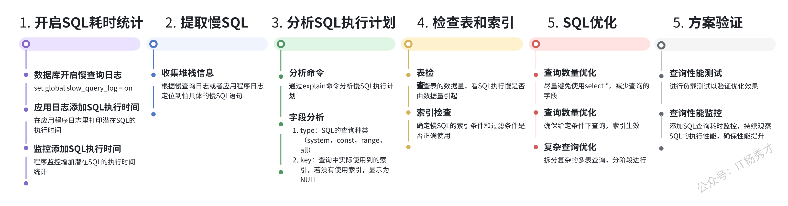

在系统开发中，慢SQL查询经常会遇到，尤其是数据量大的业务场景下，慢SQL查询是一个非常常⻅的性能瓶颈，可能导致应用响应缓慢，严重影响用户体验。这就需要开发者能够有效地排查慢SQL问题，慢SQL问题的排查也是有一个比较系统的路径，从识别问题到优化解决



## **1. 案例分析**

我们以一张订单表，插入一些数据，来模拟一次慢sql的整体优化路径

### **1.1 测试环境**

Linux服务器：2G运行内存


Mysql版本：MySQL 8.0.37


### **1.2 创建表**

执行以下sql创建一张订单表t\_order，

```sql
DROP TABLE IF EXISTS `t_order`;
CREATE TABLE `t_order`  (
  `id` bigint NOT NULL AUTO_INCREMENT COMMENT '主键',
  `order_id` varchar(255) CHARACTER SET utf8mb4 COLLATE utf8mb4_0900_ai_ci NULL DEFAULT NULL COMMENT '订单编码',
  `product_id` varchar(255) CHARACTER SET utf8mb4 COLLATE utf8mb4_0900_ai_ci NULL DEFAULT NULL COMMENT '产品编码',
  `product_name` varchar(255) CHARACTER SET utf8mb4 COLLATE utf8mb4_0900_ai_ci NULL DEFAULT NULL COMMENT '产品名称',
  `customer_id` varchar(255) CHARACTER SET utf8mb4 COLLATE utf8mb4_0900_ai_ci NULL DEFAULT NULL COMMENT '客户编码',
  `customer_name` varchar(255) CHARACTER SET utf8mb4 COLLATE utf8mb4_0900_ai_ci NULL DEFAULT NULL COMMENT '客户名称',
  `amount` decimal(10, 2) NOT NULL COMMENT '订单金额',
  `status` tinyint NOT NULL COMMENT '订单状态码，0：待付款 1：已付款，待发货 2：已发货 3：已完成 4：已取消',
  `create_time` datetime NOT NULL COMMENT '创建日期',
  `update_time` datetime NULL DEFAULT NULL COMMENT '更新时间',
  PRIMARY KEY (`id`) USING BTREE,
  INDEX `idx_custnum_status_createtime`(`customer_id` ASC, `status` ASC, `create_time` ASC) USING BTREE,
  INDEX `idx_order_id`(`order_id` ASC) USING BTREE
) ENGINE = InnoDB AUTO_INCREMENT = 1 CHARACTER SET = utf8mb4 COLLATE = utf8mb4_0900_ai_ci COMMENT = '订单表' ROW_FORMAT = DYNAMIC;
```

表建好以后，看一下表设计：



### **1.3 数据插入**

通过存储过程，向表里插入500w条数据

```sql
-- 如果存在该存储过程，则删除存储过程
DROP PROCEDURE IF EXISTS batchInsertBigData;

-- 创建存储过程

DELIMITER $$

CREATE PROCEDURE batchInsertBigData(IN args INT)
BEGIN
  DECLARE i INT DEFAULT 1;
  DECLARE order_id BIGINT DEFAULT 0;

  -- 开启事务
  START TRANSACTION;
  
  WHILE i <= args DO
    -- 用时间戳*1000 +i 来生成生成唯一的订单编号
    SET order_id = (UNIX_TIMESTAMP() * 1000) + i;

    -- 插入数据
    INSERT INTO t_order (
      `order_id`, 
      `product_id`, 
      `product_name`, 
      `customer_id`, 
      `customer_name`, 
      `amount`, 
      `status`, 
      `create_time`, 
      `update_time`
    ) VALUES (
      order_id, -- 前面生成的唯一订单编号
      CONCAT('PDT', LPAD(i, 6, '0')), -- 产品编号，左填充为6位数字
      CONCAT('Product-', i), -- 产品名称
      CONCAT('CUST', LPAD((i % 1000) + 1, 6, '0')), -- 假设有1000个客户编号循环使用
      CONCAT('Customer-', (i % 1000) + 1), -- 客户名称
      ROUND((RAND() * 100) + 100, 2), -- 随机生成100到200的订单金额
      CASE WHEN i % 5 = 0 THEN 0 WHEN i % 3 = 0 THEN 1 ELSE 2 END, -- 随机分配几种状态
      NOW(), -- 创建时间
      NOW() -- 更新时间
    );
    SET i = i + 1;
  END WHILE;
  
  COMMIT;
END$$

DELIMITER ;


-- 调用存储过程

CALL  batchInsertBigData(5000000);
```



执行完所有的数据插入，大约耗时10分钟

### **1.4 开启慢查询日志**

* 查看Mysql慢查询日志是否开启

```sql
show variables like'%slow_query_log%';           
```


结果显示`OFF`，表示未开启慢查询日志

* 接下来开启慢查询日志

```sql
set global slow_query_log = on
```

* 修改慢查询sql的限制时间，为了方便测试，这里把时间调整为1s，也就是说超过1s的sql都会被记录到这个慢查询日志文件中

```sql
set global long_query_time=1;
```

注意：在修改上述几个配置之后需要退出Mysql，重新登录，才会生效


* 验证修改配置是否生效


慢查询日志已经开启，慢查询日志会记录到文件/var/lib/mysql/fd2f83b86d9b-slow.log中



慢查询sql的时长限制已经修改为1s

### **1.5 联合索引优化**

#### **1.5.1 原始sql查询**

现有如下sql语句，想要查询`customer_id` 最后编号为“000922”且`create_time = '2024-10-29 10:13:49'`以及`` `status` = '1'  ``的所有记录

```sql
select * from t_order t where  customer_id like '%000922' and t.create_time = '2024-10-29 10:13:49' and t.`status` = '1';
```

查询结果如下，耗时1.536s：



#### **1.5.2 提取慢查询sql**

1. 分析慢查询日志文件

```sql
cat fd2f83b86d9b-slow.log  
```



通过分析这个文件，可以找到所有的慢查询sql。我们刚刚执行的sql也在其中，查询耗时1.535383s。

#### **1.5.3 分析sql执行计划**

##### **1.5.3.1 Explain字段分析**

sql的执行计划主要是用Mysql提供的explain工具命令来分析，首先来看一下explain分析sql的结果重点需要关注哪些字段

1. **select\_type：**&#x67E5;询类型，主要用来分辨查询的类型是普通查询还是联合查询还是子查询。

   * SIMPLE（简单的查询，不包含子查询和 union）

   * PRIMARY（查询中若包含任何复杂的子查询，最外层查询则被标记为 primary）

   * SUBQUERY（在 select 或者 where 列表中包含子查询，不在from子句中），

   * DERIVED（复杂查询的FROM子句中的查询标记为DERIVED，MySql会将结果放在一个临时表中、也称为派生表）

   * UNION（复杂查询中出现在UNION后面的查询标记为UNION）

2. **type（重要）**&#x8BBF;问类型，表示以何种方式去访问数据库，从这个子段可以看出是否走索引，还是全表扫描，查询效率从高到低为：

   1. NULL：表示在优化阶段就可以分解语句，此时在执行分段都不需要扫描表和索引，直接就可以拿到结果。如：查询主键id的最小值（select min(id) from table ），这里不需要扫描就可以从索引中直接拿到第一个id就是最小id

   2. system/const: 表示在优化阶段可以直接优化为常量，比如：select \* from table where id = 5 这个查询可以优化为 select 5 as id , name,... from table where id =5 ,这时id列的值其实已经确定了

   3. eq\_ref：表示使用了唯一索引或者主键索引时，如：select \* from table where id =3 ,因为id是主键索引，已经可以确定结果就只可能最多为一个数据。

   4. ref：表示使用了某个索引与一个具体的值比较，如：select \* from table where name='tom' 这时不能确定结果的数量，但是这种查询可以扫描索引来得到结果，且结果在索引中一定是连续的

   5. rang：表示使用索引时是一个范围扫描，select \* from table where id > 50 or id<10 ,这里就需要对索引进行范围扫描。

   6. index：索引扫描，直接扫描一个二级索引拿到结果，一般为覆盖索引查询。

   7. all：全表扫描

3. **key（重要）**：这一列显示 Mysql 实际采用哪个索引来优化对该表的访问，即实际使用的索引，如果为 null ，则表示没有使用索引

4. **rows** **（重要）**：查询所需要读取数据的行数，这个参数很重要，直接反映 sql 查找了多少数据，在完成目的的情况下越少越好

5. **extra：**&#x989D;外信息

   1. using index : 查询使用了覆盖索引

   2. using where：表示储存引擎会把结果返回的Mysql查询服务器，然后使用where条件进行过滤

   3. using temporary： 对查询结果进行排序或者去重等操作时使用了临时表来保存中间结果，查询完成之后删除

   4. using filesort：说明 mysql 无法利用索引进行排序，只能利用外部文件排序算法进行排序，会消耗额外的位置

##### **1.5.3.2 explain分析原始sql**

对慢sql执行以下语句进行分析

```sql
explain select * from t_order t where  customer_id like '%000922' and t.create_time = '2024-10-29 10:13:49' and t.`status` = '1';
```

执行结果如下：


从结果可以看到，查询语句是一个简单查询语句， 但是`type`字段显示为`ALL`，表明这个sql查询并没有走索引，并且`rows`字段显示查询了4831176行数据，查询的数据量大，所以查询效率很低。

#### **1.5.4 检查表和索引**

从上一步分析来看这个查询并没有走索引，所以会很慢。而我们是要查询`customer_id` 最后编号为“000922”且`create_time = '2024-10-29 10:13:49'`以及`` `status` = '1' ``的记录，回顾我们刚才所建的表，其实我们是在`customer_id`，`status`，以及`create_time`字段建立了联合索引

```sql
INDEX `idx_custnum_status_createtime`(`customer_id` ASC, `status` ASC, `create_time` ASC) USING BTREE
```

而这里说明查询条件导致了这个联合索引没有生效，进一步分析，sql语句中的`customer_id like '%000922'`条件出现了问题，`like`语句导致了联合索引不遵从最左匹配原则，导致索引失效。进一步分析表数据的特点，这里的`customer_id`后面的编号是递增的，且唯一的，但是前缀都是一样的。这里我们完全可以用`=`查询来代替`like`语句查询，让联合索引符合最左匹配原则

#### **1.5.5 sql优化**

将原始sql的where条件中的`customer_id like '%000922'`改为`customer_id = 'CUST000922'`，修改完以后，sql如下：

```sql
select * from t_order t where  customer_id = 'CUST000922' and t.create_time = '2024-10-29 10:13:49' and t.`status` = '1';
```

#### **1.5.6 方案验证**

执行优化后的查询sql，查询结果如下：


查询耗时0.003s，整体查询性能了500多倍

进一步分析sql的执行计划：

```sql
explain select * from t_order t where  customer_id = 'CUST000922' and t.create_time = '2024-10-29 10:13:49' and t.`status` = '1';
```

分析结果如下：



优化之后，可以看到但是`type`字段显示为`ref`，走了索引，并且`rows`字段为11，不再是使用的全表扫描，检索的行数大量减少，很大程度提升了效率

## **2. 小结**

慢SQL是业务场景中非常常见且很重要的一个问题，掌握系统化的慢SQL排查方法非常关键。以下是一个体系化的排查路径图



总的来说，我们首先要开启慢查询日志，然后通过慢查询日志定位到慢的sql语句，最后通过explain工具分析出慢sql的根因，最后再针对性的来优化sql语句，如果是对于表数据量太大的情况，还需要结合一些其他的策略，比如分库分表。总之，有了体系的方法之后，就可以有效解决业务场景下的慢SQL问题。

## **资料分享**
随着AI发展越来越快，AI编程能力越来越强大，现在很多基础的写接口，编码工作AI都能很好地完成了。并且现在的面试八股问题也在逐渐弱化，**面试更多的是查考候选人是不是具备一定的知识体系，有一定的架构设计能力，能解决一些场景问题**。所以，不管是校招还是社招，这都要求我们一定要具备架构能力了，不能再当一个纯八股选手或者是只会写接口的初级码农了。这里，秀才为大家精选了一些架构学习资料，学完后从实战，到面试再到晋升，都能很好的应付。**关注秀才公众号：IT杨秀才，回复：111，即可免费领取哦**


<div style="background-color: #f0f9eb; padding: 10px 15px; border-radius: 4px; border-left: 5px solid #67c23a; margin: 20px 0; color:rgb(64, 147, 255);">

## <span style="color: #006400;">**学习交流**</span>
<span style="color:rgb(4, 4, 4);">
> 如果您觉得文章有帮助，可以关注下秀才的<strong style="color: red;">公众号：IT杨秀才</strong>，后续更多优质的文章都会在公众号第一时间发布，不一定会及时同步到网站。点个关注👇，优质内容不错过
</span>


</div>