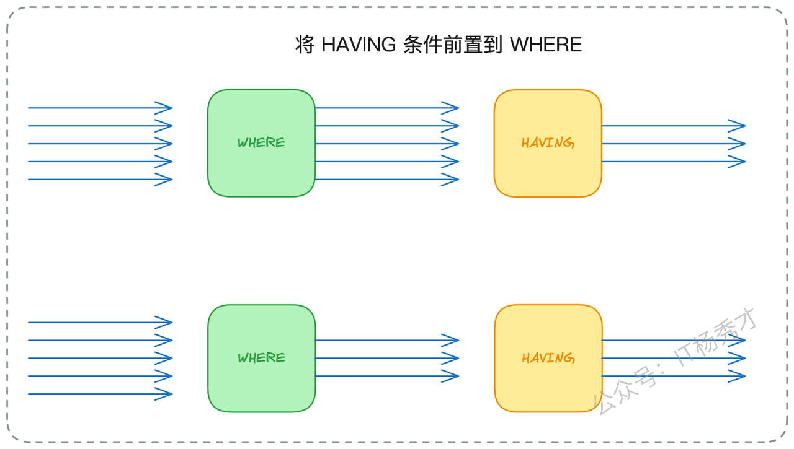

今天想和大家深入聊聊数据库性能优化中一个绕不开的话题——SQL优化。秀才在后端架构领域深耕多年，发现无论技术潮流如何演变，对系统性能的极致追求始终是衡量一位工程师技术深度与广度的核心标准。在面试中，如果你能展现出对性能优化的深刻理解和实践经验，无疑会是一个巨大的加分项。高并发项目的经验或许不是人人都有机会接触。相比之下，性能优化，尤其是数据库层面的性能优化，是一项我们能主动学习、实践并能创造巨大价值的硬核技能。

在众多性能优化手段中，SQL优化是最直接、最常见的切入点。一个微小的改动，可能带来数十甚至上百倍的性能提升。那么，如何系统地进行SQL优化呢？我们一步步来看

## 1. **数据库性能优化核心要点**

在着手优化具体的SQL语句之前，我们必须先建立一个全局视野，明确SQL优化在整个数据库性能体系中所处的位置。我们可以将数据库优化想象成一个层级分明的金字塔结构：

* **硬件层优化**：位于金字塔的基座，也是最基础的优化手段。它涉及提升物理资源的规格，例如采用更高主频的CPU、扩展内存容量、或用NVMe SSD替换传统硬盘。

* **系统层优化**：在硬件之上，是操作系统的调优。这包括调整内核参数，如网络缓冲区大小、文件句柄限制等，为数据库软件的运行提供一个更理想的宿主环境。

* **数据库软件层优化**：这一层聚焦于数据库管理系统（DBMS）本身的配置。以MySQL为例，这可能涉及到调整事务隔离级别、修改InnoDB存储引擎的特定参数（如`innodb_flush_log_at_trx_commit`来平衡数据安全性与性能）。

* **应用层SQL优化**：位于金字塔的顶端，这是我们作为应用开发者最常接触、也最能发挥主观能动性的层面。它直接针对业务逻辑产生的SQL查询语句进行分析与重构。


这个模型告诉我们，越底层的优化，其影响范围越广，但通常也需要更专业的知识和更高的操作权限。而顶层的SQL优化，虽然需要针对具体业务场景，但其精确性和带来的性能回报率往往是最高的。

从数据库内部工作原理的视角来看，所有SQL优化的努力，最终都指向两个根本目标：

1. **最小化磁盘I/O**：磁盘访问是数据库最昂贵的操作之一。优化的核心在于尽可能避免全表扫描这种地毯式搜索，确保查询请求能够精准地命中索引，最理想的情况是实现“覆盖索引”，让查询所需的数据完全在索引结构中得到满足，无需回表访问主数据。

2. **最小化CPU与内存开销**：数据库不仅是存储系统，也是计算系统。复杂的排序（`ORDER BY`）、分组聚合（`GROUP BY`）和去重（`DISTINCT`）等操作会大量消耗CPU和内存资源。优化的目标就是将这些计算压力尽可能地消除或前置处理。

掌握这些理论框架是基础。但在真实的面试或工作场景中，空谈理论价值有限，真正的挑战在于实践。而实践的第一步，就是要学会使用诊断性能问题的“听诊器”——`EXPLAIN`命令。

### 1.1 **洞察**`EXPLAIN`**执行计划**

可以断言，任何不熟悉`EXPLAIN`的后端工程师，其数据库技能都是不完整的。`EXPLAIN`的用法极其简单，只需在你的`SELECT`语句前加上它，MySQL就会返回一份详细的“执行计划”，这份计划揭示了优化器将如何处理你的查询请求。

```sql
-- 示例：分析一条排序分页查询的执行计划
EXPLAIN select * from tx_user.user order by uid desc limit 5;
```

执行计划的输出结果包含了丰富的信息，对于初学者可能有些望而生畏。但在面试和日常工作中，我们只需要重点关注并理解以下几个关键列：

1. `type`：访问类型。这是评估查询效率的核心指标，它揭示了MySQL查找数据所采用的方式。性能从最优到最差的顺序为：`system` > `const` > `eq_ref` > `ref` > `range` > `index` > `ALL`。

   * `system`、`const`：常量级别查找，意味着查询瞬间就能定位到唯一的一行记录。

   * `eq_ref`、`ref`：基于索引的等值查询，效率非常高。

   * `range`：索引范围扫描，例如 `WHERE id BETWEEN 100 AND 200`。

   * `index`：索引全扫描。它虽然使用了索引，但需要遍历整个索引树，当索引本身很大时，开销也不小。

   * `ALL`：全表扫描。这是性能的“红灯”，意味着MySQL将放弃索引，从头到尾读取整张表，是优化的首要对象。

2. `possible_keys`：候选索引。列出了MySQL认为可能适用于此查询的索引。

3. `key`：实际使用的索引。这是优化器在综合评估后，最终选择的索引。如果为`NULL`，则表示没有使用任何索引。

4. `rows`：预估扫描行数。优化器预测为了满足查询，需要检查的记录数量。这个数字越小越好。

5. `filtered`：行过滤百分比。表示在`rows`预估扫描的行中，有多少百分比的记录能够满足`WHERE`子句的条件。此值越高，说明索引的过滤效果越精准。

我们不必强行背诵所有字段的含义。SQL优化的实践过程，本就是一个“**分析-假设-验证**”的迭代循环。通过`EXPLAIN`分析出现状，提出优化假设（如改写SQL、调整索引），实施后再次用`EXPLAIN`验证效果，直至性能达标。


### 1.2 **索引设计**

既然SQL优化的核心在于索引，那么如何设计出高效的索引就成了一门艺术。这并非有固定的标准答案，而是在理解业务和数据分布基础上的权衡。以下是几条被广泛认可的最佳实践：

* **为高频过滤条件的谓词列建立索引**：这是最基本的原则。那些在`WHERE`子句中频繁出现的、用于筛选数据的列，是创建索引的首选。

* **为排序操作的排序列建立索引**：`ORDER BY`子句背后的`filesort`（文件排序）是常见的性能瓶颈。为排序列建立索引，可以利用索引B+树的天然有序性，直接免去排序步骤。

* **为外键及关联列建立索引**：在进行表连接（`JOIN`）时，关联字段必须有索引，否则会导致嵌套循环连接的性能灾难。

* **优先选择高基数（高区分度）的列**：列中唯一值的数量越多，其“基数”就越高，索引的选择性就越好，查询时能更快地定位数据。在创建联合索引时，也应将基数最高的列放在最左侧。

### 1.3 **大表DDL操作的风险与规避**

在优化过程中，新增或修改索引是常规操作。然而，对一张数据量巨大的表执行DDL（数据定义语言）操作，隐藏着巨大的风险。

其核心症结在于，DDL操作（如`ALTER TABLE`）可能会请求一个排他性的元数据锁（MDL），这个锁会阻塞该表上的所有后续读写请求，直到DDL操作完成。对于一张千万级甚至亿级的大表，加索引可能耗时数分钟到数小时，长时间的锁表对线上业务而言是不可接受的。


因此，针对大表的结构变更，必须采用更精细化的方案来规避风险。业界主流的方案有以下三种：

1. **计划内停机变更**：在业务低峰期或维护窗口，暂停相关服务，然后执行DDL操作。这是最简单直接的方案，但对用户体验有影响。

2. **利用业务低谷期变更**：在凌晨等流量最低的时间段进行操作。此方案的风险在于，如果操作耗时超出预期，可能会影响到次日白天的业务高峰。

3. “影子表”方案（在线DDL）：这是在不中断服务的前提下完成变更的最佳实践。其核心思想是“金蝉脱壳”：

4. a. 创建一张与原表结构相同的新表（影子表），并在这张新表上提前执行DDL，例如加上新索引。

5. b. 将原表的全量数据通过工具拷贝到影子表。

6. c. 在拷贝过程中，通过某种机制（如触发器或订阅binlog）将原表的增量数据实时同步到影子表。

7. d. 待数据完全同步后，在一个原子性的操作中，将原表重命名为备份表，将影子表重命名为原表，完成线上流量的切换。


## 2. **面试场景下的应对策略**

要在面试中充分展现你的SQL优化能力，你需要准备几个有深度、有细节的实战案例。这些案例应能反映出你对数据库底层原理的理解。你可以从以下几方面着手准备：

* **盘点项目经验**：梳理你负责过的核心业务表结构，分析其索引设计是否合理。找出执行最频繁的几条SQL，用`EXPLAIN`审视它们是否都运行在最佳状态。

* **复盘真实案例**：回顾团队内部处理过的慢SQL问题。关键是要弄清楚问题的发现、分析、解决和验证的全过程，并用优化前后的性能数据（如响应时间、CPU使用率）来量化你的成果。

* **预演深度追问**：对你准备的每个案例，都要换位思考，模拟面试官可能提出的深入问题。例如，“为什么优化器没有选择你认为最优的索引？”，“你这个方案在并发场景下有没有数据一致性的问题？”

总的来说，SQL优化的知识点繁多且琐碎，但面试中你无需面面俱到。关键是掌握主动权，通过你精心准备的案例，将面试官的提问引导到你最擅长的领域。

当面试官抛出“你做过哪些性能优化？”或“如何降低接口响应时间？”这类开放性问题时，你完全可以主动将话题引向SQL优化：

> “在我之前负责的XX核心系统中，性能是一个关键的非功能性指标，我们要求核心接口的P99响应时间在100ms以内。为了达成这一目标，我主导了一系列优化工作，其中SQL层面的调优是见效最快、收效最大的一环。”

如果面试官追问具体如何做，你可以这样展开：

> “我们的排查流程通常始于慢查询监控系统。一旦发现接口超时告警，我们会定位到具体的慢SQL。接着，核心的诊断工具就是`EXPLAIN`，通过它来分析执行计划，判断是否存在全表扫描、索引选择是否合理、有无不必要的`filesort`等问题。定位根因后，我们会提出优化假设，可能是改写SQL，也可能是调整或新增索引。方案实施后，我们会再次通过`EXPLAIN`和压力测试来验证优化效果，形成一个完整的PDCA闭环。”

此时，便是引出你准备的实战案例的最佳时机。以下是我整理的一些在生产环境中非常典型的优化案例，建议你亲手实践，加深理解。

### 2.1 **利用覆盖索引消除回表**

**问题背景**：一个高频查询最初为了方便写成了`SELECT *`，但业务逻辑实际只关心A、B、C三列。`WHERE`条件也主要围绕这三列。通过`EXPLAIN`发现，即使查询走了索引，也存在大量的回表操作。

优化思路与实践：回表（Table Access by Index Rowid）是指在通过二级索引找到主键ID后，还需再次根据主键ID去聚簇索引中查找整行数据的过程。这个过程增加了额外的I/O开销。

我的解决方案是，创建一个包含了查询所需全部列（A、B、C）的联合索引。然后，将SQL语句从SELECT \*精简为SELECT A, B, C。

这样，查询所需的所有数据都可以直接从这个联合索引的叶子节点中获取，MySQL无需再回到主键索引去拉取数据，这便是“覆盖索引”。优化后，查询耗时从百毫秒级别骤降至1毫秒以内。

**核心洞察**：对于读密集型的高频查询，设计恰当的覆盖索引是性价比最高的优化手段之一。

### 2.2 **借助索引有序性优化排序**

**问题背景**：一个查询用户操作历史的接口，SQL为`SELECT ... FROM ... WHERE uid = ? ORDER BY create_time DESC`。随着单个用户数据量的增长，查询因`filesort`（文件排序）而变得缓慢。

优化思路与实践：filesort是数据库在无法利用索引顺序时，在内存或磁盘中进行的额外排序操作，成本高昂。我的解决方案是，创建一个(uid, create\_time)的联合索引。

根据B+树索引的结构特性，当uid相同时，索引项本身就是按照create\_time有序排列的。因此，当WHERE子句确定了uid后，数据库可以直接按索引顺序读取数据，从而完全避免了排序步骤。这个改动将查询耗时从秒级优化到了几十毫秒。

**核心洞察**：任何`ORDER BY`、`GROUP BY`或`DISTINCT`操作，都应首先思考能否通过调整索引来利用其天然的有序性，这是消除数据库排序开销的根本方法。

### 2.3 `COUNT(*)`**的优化路径**

**问题背景**：在InnoDB存储引擎中，`SELECT COUNT(*)`会触发全表扫描，因为InnoDB为了支持MVCC，没有像MyISAM那样维护一个实时的总行数。

**优化思路与实践**：针对此问题，需要根据业务对精确性的要求来选择方案。

1. **近似值方案**：如果业务能容忍一个估算值（例如，显示“约有N条”），那么可以通过`EXPLAIN`一条不带`COUNT`的查询，直接取其返回的`rows`字段作为近似结果。

2. **精确值方案（外部计数）**：如果必须是精确值，更优的架构方案是在外部系统（如Redis）中维护一个计数器。当业务代码执行`INSERT`或`DELETE`操作时，同步去更新这个计数器。

**延伸探讨**：采用外部计数方案，必须考虑数据一致性问题。如果在更新数据库后，更新Redis失败了怎么办？这引入了分布式事务的复杂性。一个更优雅的解耦方案是，应用层只管操作数据库，然后通过订阅数据库的binlog日志（例如使用Canal组件），由一个独立的同步服务来异步地、可靠地更新Redis中的计数值，保证最终一致性。


### 2.4 **审慎使用索引提示**

**问题背景**：在极少数情况下，MySQL的查询优化器可能会因为统计信息不准等原因，做出错误的判断，选择了一个性能较差的执行计划。

**优化思路与实践**：当通过`EXPLAIN`确认优化器选错了索引，且通过其他方式（如改写SQL）无法纠正时，可以考虑使用索引提示（如`FORCE INDEX`）来强制优化器使用我们指定的索引。我曾在一个案例中，通过`FORCE INDEX`强制查询走了正确的索引，性能获得了数量级的提升。

**核心洞察**：索引提示是赋予开发者的“最终手段”，它相当于绕过了优化器的自主决策。这会降低代码的可维护性，因为当数据分布或表结构变化后，曾经最优的索引可能不再是最佳选择。因此，非到万不得已，不应使用。

### 2.5 `WHERE`**与**`HAVING`**的正确分工**

**问题背景**：在维护一个遗留系统时，发现有SQL将一个普通的字段等值过滤条件写在了`HAVING`子句中，而非`WHERE`子句。

**优化思路与实践**：必须清晰地理解SQL的逻辑执行顺序：`FROM` -> `WHERE` -> `GROUP BY` -> `HAVING` -> `SELECT` -> `ORDER BY`。`WHERE`子句在分组聚合前对原始数据行进行过滤，而`HAVING`在分组聚合后对结果集进行过滤。将过滤条件尽可能地前置到`WHERE`阶段，可以极大地减少参与后续聚合计算的数据量。我将那个条件从`HAVING`迁移到`WHERE`后，查询性能提升了40%。



**核心洞察**：`HAVING`的专属职责是用于对聚合函数（如`SUM() > 100`）的结果进行过滤。所有针对原始表字段的过滤，都应无一例外地放在`WHERE`子句中。

### 2.6 **破解深度分页的性能陷阱**

**问题背景**：采用`LIMIT offset, count`进行分页查询时，当`offset`值非常大时（即深度分页），性能会急剧恶化。因为数据库需要先扫描`offset + count`行数据，然后抛弃前面的`offset`行，这个过程的成本与`offset`成正比。

优化思路与实践：优化的核心思想是避免大偏移量扫描，转而使用“游标”或“键集分页”（Keyset Pagination）的方式。我的实践是，在查询条件中，利用上一页结果的最后一条记录的ID（或一个有序且唯一的键）来进行定位。例如，查询下一页的SQL变为 WHERE id > \[last\_page\_max\_id] ORDER BY id ASC LIMIT \[page\_size]。

这样，无论翻到第几页，LIMIT的偏移量始终为0，查询性能可以保持稳定在毫秒级。

**核心洞察**：深度分页的性能问题在数据量小的测试环境中极易被忽略。在设计任何分页接口时，都应默认采用基于游标的查询方式，从根源上杜绝此问题。

## 3. **核心要点回顾**

今天我们系统性地探讨了SQL优化的三个关键前置知识：`EXPLAIN`工具、索引列选择和在线DDL方案，并结合六个贴近生产的案例进行了深入剖析。

最后需要强调一点：技术的海洋浩瀚无垠，你不可能掌握所有细枝末节。在面试中，关键是掌握对话的主导权。通过你精心准备的、有深度、有细节的案例，将面试官的思路引导到你最熟悉的领域。这样，即便表面上是他在提问，实际上整个交流的节奏已在你的掌控之中。

反之，如果无法主导节奏，被动地接受面试官天马行空的提问，那么触及到你的知识盲区也就在所难免了。


