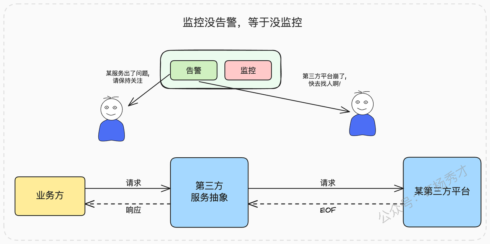
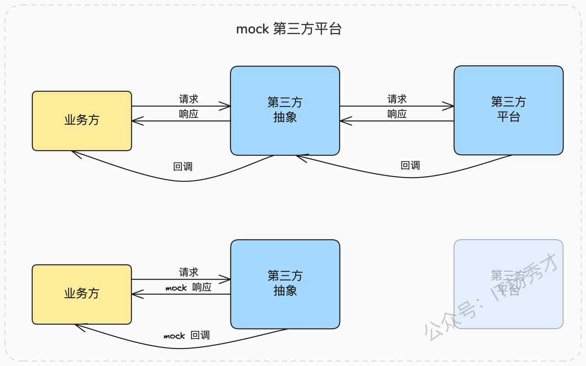
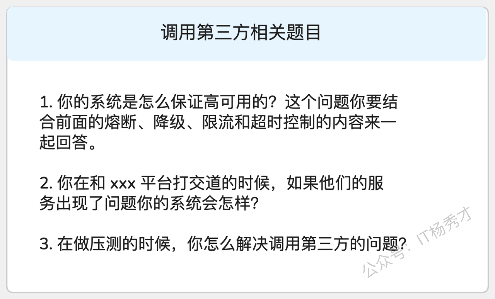
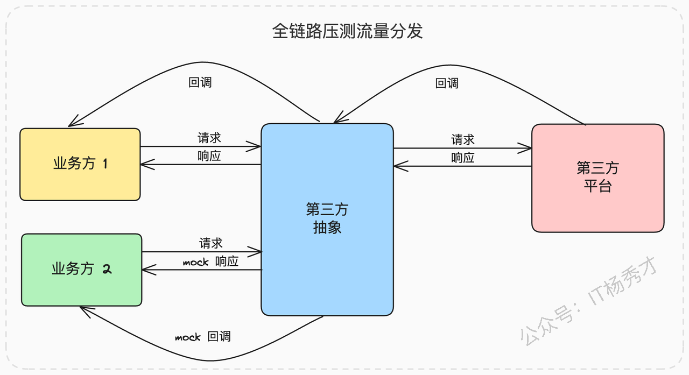

今天，我们来聊一个与微服务架构紧密相关，且在日常开发中极其普遍的话题：当我们的系统需要调用第三方接口，而这些下游接口既不稳定、性能又差时，我们该如何应对，以确保自身系统的高可用性？

放眼望去，当今的互联网系统中，几乎没有哪个可以完全脱离第三方而独立存在。我们的业务或多或少都需要与外部服务打交道：

* **用户登录**：需要接入微信开放平台、QQ互联等，实现便捷的扫码登录功能。

* **金融支付**：需要对接银行的清结算接口，或是支付宝、微信支付等主流支付渠道。

* **消息通知**：发送短信验证码、App推送等，都离不开专业的短信或推送服务商。

* **专业能力**：像人脸识别、身份认证、天气查询等，更需要依赖于专业的供应商提供服务。

我评审过很多工程师的简历，发现一个普遍现象：很多人都写了自己有丰富的第三方API对接经验。但当我深入追问时，往往发现大部分人的工作仅仅停留在“调通接口、实现功能”的层面。对于如何处理接口超时、服务不可用、性能瓶颈等一系列容错和高可用问题，却考虑甚少，甚至完全没有概念。

实际上，**调用第三方接口是一个绝佳的面试场景**。首先，这个场景非常普遍，面试官自己大概率也踩过类似的坑，所以他能快速理解其中的复杂性和痛点，从而与你产生共鸣。更重要的是，你可以借此机会，将熔断、降级、限流、超时控制等一系列微服务治理的最佳实践融会贯通，全面地展现你的架构设计能力和思考深度。

所以今天，我就和大家深入探讨一下，当我们作为调用方，难以推动第三方进行优化时，有哪些“看家本领”可以用来保障自身系统的高可用。

## 1. **架构定位：构建坚固的防卫层**

在深入技术细节之前，我们首先要明确一件事：在我们的系统中，负责与第三方交互的部分，其架构定位是什么？

无论你的系统是传统的单体应用，还是流行的微服务架构，这部分逻辑都应该被明确地隔离开，形成一个独立的“第三方模块”或“第三方服务”。

这个我们称之为“防卫层”的模块或服务，它的核心职责并非只是简单地转发请求，而是要解决一系列至关重要的问题：

* **提供统一的抽象**：这是它的首要任务。它必须构建一个统一、稳定的接口，对上层业务屏蔽掉不同第三方API之间的实现差异。

* **实施客户端治理**：它必须是高可用策略的执行者，负责实现针对第三方调用的重试、限流、熔断等关键功能。

* **保障充分的可观测性**：它必须提供完善的日志、监控和告警，确保任何风吹草动都能被快速发现和定位。

* **简化整体的测试流程**：它必须提供强大的Mock能力，方便业务方在没有真实第三方环境的情况下，进行功能测试和性能压测。

接下来，我们逐一展开，看看如何将这些职责落地。

### 1.1 **统一接口：屏蔽底层实现的复杂性**

提供一致性的抽象，可以说是这个“防卫层”最基础，也是最重要的目标。

举个最常见的例子：支付。假设我们的电商平台需要同时支持微信支付和支付宝支付。对于上游的订单服务或者业务方来说，他们不应该关心这两种支付方式在API层面有何不同。他们理想的调用方式是，调用一个统一的`pay`接口，传入订单号、金额、支付方式（`WeChat`或`Alipay`）等标准化的业务参数即可。

我们的第三方服务抽象层，则负责根据传入的支付方式，在内部路由到具体的支付渠道处理器，完成与微信或支付宝的复杂交互。业务方完全不需要关心其中的任何实现细节。

一个设计良好的一致性抽象层，需要消化掉所有与具体实现相关的“脏活累活”，例如：

* **通信协议的差异**：HTTP、RPC或是其他私有协议。

* **数据格式的差异**：请求和响应是JSON、XML还是form-data。

* **加解密算法的差异**：签名是用MD5、SHA256，还是RSA。

* **身份认证机制的差异**：是通过AppID/Secret，还是OAuth2.0。

* **回调处理逻辑的差异**：是同步返回结果，还是异步回调通知。

将这些差异封装起来，至少能带来两大核心价值：

1. **研发效率的巨大提升**：对于业务开发者来说，对接一个新的支付渠道不再需要去阅读冗长的第三方API文档，学习各种复杂的协议和规范。他们只需要调用一个早已熟悉的、标准化的内部接口，接入成本极低，效率自然就高。

2. **无与伦比的高扩展性**：未来如果需要接入新的支付方式，比如PayPal或者银联支付。我们只需要在防卫层内部，遵循统一的接口规范，增加一个新的实现即可。整个过程对已有的上游业务完全透明，无需任何改动，真正做到了“对修改关闭，对扩展开放”。

当这个坚实的抽象层建立起来后，我们就可以在这之上，从容不迫地实施各种客户端治理手段了。

### 1.2 **客户端治理：在调用方实施限流与重试**

我们通常谈论的熔断、降级、限流，大多是在服务端或网关层面实施的。但当我们的角色转换为服务调用方时，我们也必须在客户端（即我们的“防卫层”）进行相应的治理。其中，最关键的两个手段就是**限流**和**重试**。

**客户端限流**

绝大多数第三方平台，出于自我保护的目的，都会对API的调用频率进行限制。例如，某个银行接口可能明确规定，单个IP每秒最多发送10次请求，超出部分将直接拒绝服务。

如果我们对此一无所知，任由上游业务的流量直接打过去，那么超出限制的那些请求注定会失败。这不仅浪费了我们系统的网络和计算资源，也给下游的第三方服务带来了不必要的压力。明智的做法是，在我们的防卫层中，提前根据第三方的限流规则，配置一个与之匹配的客户端限流器（如使用Guava RateLimiter或Sentinel）。这样，在发起调用之前就主动拦截掉超额的请求，既能快速失败，又能省去一次必然无效的网络调用。

**超时与重试**

当调用第三方平台发生网络超时或偶发性错误时，业务方显然不希望直接收到一个冷冰冰的超时响应。因为如果这样，就意味着每个业务方都需要自己去处理超时，实现一套自己的重试逻辑。这不仅极大地增加了业务方的开发负担，也会导致重试策略在整个系统中泛滥且不一致，难以维护。

因此，一个健壮的第三方服务模块，理应内置一套对业务方透明的重试机制。当发生可重试的错误时（如网络超时、5xx服务端错误），由防卫层自动发起重试。

但这里有一个至关重要的前提，你必须反复确认和强调：**只有在确认第三方接口是幂等（Idempotent）的情况下，才能进行重试**。对于非幂等的写操作（如没有唯一请求ID的创建订单接口），冒然重试可能会导致数据重复创建等严重后果。

完成了客户端治理，大部分问题都能被有效控制。但“百密一疏”，一旦线上真的出现问题，快速定位和划分责任（甩锅）就显得至关重要了。这就需要我们具备强大的可观测性。

### 1.3 **可观测性：让一切尽在掌握**

由于第三方服务的运行状况完全不受我们控制，因此建立完善的可观测性体系，是我们保护自己的最后一道，也是最重要的一道防线。你需要将Prometheus、SkyWalking等业界主流工具全面接入到你的防卫层中。

你需要监控的关键指标包括但不限于：

* 每次调用的**耗时**（平均值、P95、P99）。

* 调用的**成功率**和**错误率**。

* 各种**业务错误码**和**系统错误码**的分布。

* 客户端**限流**和**熔断**的触发次数。

同时，**没有告警的监控，等于没有监控**。告警机制是必不可少的，并且需要进行精细化分层：

* **一类告警发给技术团队**：当监控系统侦测到第三方服务出现异常（如错误率在1分钟内飙升超过20%，或P99响应时间连续3分钟高于阈值）时，立即通过电话、短信等方式通知负责该模块的工程师，以便快速介入排查。

* **另一类告警通知业务方**：当确认第三方服务大面积不可用时，可以通过邮件、内部通讯工具等方式，向依赖该服务的上游业务方发出通知，让他们能够及时评估对自身业务的影响范围，并根据情况启动业务层面的降级或应急预案。

有了完善的可观测性，问题定位将变得轻而易举。但我们还能不能更进一步，从源头上减少问题的发生概率呢？答案是肯定的，那就是做好测试支持，让你的业务方在上线前就把问题都暴露出来。

### 1.4 **测试支持：Mock是核心，压测是关键**

测试支持的核心，在于提供一个功能强大、使用便捷的**Mock服务**。

在开发和测试环境中，当业务方调用你的接口时，你不应该真的去请求昂贵或不稳定的第三方API。相反，你的防卫层应该能够识别出测试流量，并根据预设的规则，返回一个模拟的（Mock）响应。

如果第三方服务还包含回调机制（例如，微信支付成功后会异步回调我们的一个接口），那么你的Mock服务也需要能够模拟这个回调行为，向业务方的回调接口发送模拟通知，从而形成一个完整的、自洽的测试闭环。

提供Mock服务的好处是多方面的：

* **节约真金白银**：对于像短信发送、身份认证这类按次收费的服务，Mock可以避免在测试过程中产生不必要的开销。

* **摆脱环境依赖**：第三方平台的测试环境可能极其不稳定，甚至根本不存在。使用Mock可以让我们完全独立、高效地进行开发和测试。

* **丰富的场景模拟**：你可以让业务方随心所欲地模拟各种场景，包括成功、特定的业务失败（如“余额不足”）、网络超时、返回异常报文等，从而充分验证业务方的各种正常及异常处理逻辑。

当涉及到性能压测时，Mock功能更是不可或缺。因为任何第三方都不可能开放他们的生产环境来配合你进行压测。

## 2. **面试攻略：如何生动地展现你的能力**

在面试中，调用第三方服务是一个极佳的切入点，它能让你系统地展示自己在高可用架构设计方面的思考深度和实践经验。

很多时候，面试官未必会主动深入这个话题，所以你需要学会主动出击，引导对话。比如在介绍项目时，可以这样埋下伏笔：

> “我负责的这个系统对可用性要求非常高，为了达成目标，我综合运用了熔断、限流、降级、超时控制等多种手段。其中一个关键的挑战就是，系统需要和多个外部的、我们无法控制的第三方平台进行交互。因此，如何保障这部分调用的高可用，就成了整个系统可用性的基石，我在这方面做了大量的工作。”

这样的表述，几乎必然会引导面试官对高可用性进行深入提问，从而将话题引入你最熟悉、准备最充分的领域。

当聊到具体实现时，强烈建议采用“**前后对比**”的话术来凸显你的个人贡献和方案价值：

> “在我刚接手这个项目的时候，第三方调用这块的设计和实现是比较混乱的。总体来说，可扩展性、可用性、可观测性和可测试性都非常差。为了解决这些痛点，我主导进行了一次比较大的重构。”
>
> 1. **在设计和扩展性上**，我重新设计了接口，提供了一个统一的抽象层。（这里可以补充你设计的接口细节）重构之后效果很明显，以前A业务组接入一个新的短信渠道，从开发到测试联调，大概需要一个星期。重构后，B业务组再接入，两天就搞定了，而且稳定性更高，线上Bug也更少。
>
> 2. **在可用性上**，我引入了客户端的限流和重试机制，并且针对一些特殊的、非幂等的第三方接口，我还设计了一些特殊的容错方案来防止数据不一致。
>
> 3. **在可观测性上**，我全面接入了公司的Prometheus和Skywalking平台，并配置了精细化的告警。以前的情况是，我们总是等用户投诉或者业务方反馈了才知道第三方出了问题。现在，我们能在第三方服务异常的几分钟内就收到告警，并且能快速启动应急预案，通知到所有相关的业务方。
>
> 4. **在测试上**，我提供了完善的Mock工具，业务方可以根据自己的测试用例，定制返回任意响应，包括成功、失败以及模拟接口超时。这极大地提升了他们的测试效率和代码覆盖率。

请注意，在介绍每一点时，都尽可能用具体的例子或可以量化的数据（哪怕是估算）来佐证你的成果，这样才能让面试官信服，体现出你是一个有规划、有体系、能产出实际业务价值的工程师。

最后，你可以这样总结并再次抛出引子，引导面试官继续深入：

> “总的来说，我认为，任何与第三方服务交互的场景，都必须把对方随时可能崩溃作为前提来设计我们自己的容错方案。因为内部服务出问题，我们还可以找到对应的同事，推动他们快速修复。但是第三方的服务，我们是推不动的，唯一的出路就是做好自身的防护。关于具体的容错方案，我也有一些更深入的思考和实践……”

这句话其实又埋下了一个绝佳的伏笔，就等着面试官来问：“哦？你有哪些更深入的容错方案？” 这时，你就可以从容地抛出下面精心准备的进阶方案了。

### 2.1 **进阶方案：让你的设计脱颖而出的亮点**

这里提供三个可以让你在面试中大放异彩的亮点方案，你可以根据自己的业务场景和面试情况，选择性地使用。

#### 2.1.1 **同步调用优雅降级为异步处理**

对于一些非核心、对实时性要求不高的场景（比如业务数据上报、日志记录等），当发现第三方服务已经崩溃或响应极慢时，我们可以不立即返回失败，而是将业务方的请求数据临时存储起来（比如快速存入数据库或Redis），然后立即给业务方一个“已接收”的成功响应。

之后，再通过一个后台的异步任务（比如定时任务或独立的Worker），不断地从存储中捞取这些暂存的数据，重新尝试调用第三方接口进行处理。这种方案，就是典型的用异步处理来换取核心链路高可用的思想。

你可以这样向面试官介绍你的容错方案，关键词就是**同步转异步**：

> “正常情况下，我们推送数据都是尽可能实时推送到第三方。但是，我们监控到，有些时候业务方推送过来的数据量会突增，或者第三方服务会偶发性崩溃。为了防止这些情况影响到我们主业务的稳定性，我设计了一套自动降级机制。当检测到下游异常时，接口会自动将同步推送切换为异步模式，先把数据快速地存到我们自己的数据库里，保证上游调用方不受任何影响。等第三方恢复过来了，再由后台任务逐步将数据同步过去。”

更进一步，你可以阐述对这个做法的架构级改进，关键词是**消息队列解耦**：

> “其实，我们这种容错机制完全可以做成一种更为通用和彻底的解耦形式，那就是利用消息队列。在这种解耦的架构下，业务方不再是同步调用一个HTTP接口，而是把需要处理的数据作为一条消息，丢到消息队列里面。然后，我们的防卫层服务作为一个独立的消费者，不断地从队列里消费消息，再去调用第三方接口处理业务。这种架构天然地具备了削峰填谷和异步重试的能力，极大地提升了整个系统的弹性和鲁棒性。可以说，在我们的设计范式里，但凡能用异步解耦的场景，就绝不采用同步调用。”

#### 2.1.2 **供应商故障自动替换与转移**

这种策略和我们在负载均衡里提到的思想有些类似。当调用一个第三方的接口持续失败时，你可以考虑自动切换到另一个备用的、功能相同的第三方。

举例来说，你们公司为了保障短信发送的成功率，同时采购了A、B、C三家短信供应商。现在你在选择使用A的时候，通过监控发现A的接口在短时间内错误率飙升，或者响应时间变得极长，那么你的防卫层就可以自动将后续的短信发送请求，无缝地切换到备用的B供应商上。

当然，这种策略受制于公司是否有多个可替换的供应商。但即便没有，你也可以将其作为你的架构思考来展示。你可以这样介绍你的方案，关键词是**自动替换**：

> “为了进一步提高核心业务（如发送验证码）的可用性，降低因单一供应商故障引发事故的概率，我在调用第三方的防卫层中，引入了供应商自动替换机制。我们本来就有多个功能可以互换的第三方短信供应商，于是我基于监控指标，做了一个简单的自动切换策略。当我通过监控发现某个供应商接口出现故障时（比如错误率超过20%），系统就会在几秒钟内自动将流量切换到一个健康的备用供应商上。”

这里，经验丰富的面试官可能会追问两个点：

1. **“你怎么知道第三方出问题了？”** 这个问题正中下怀。你可以从容地回答，可以参考我们之前讲过的判断服务健康与否的多种方式，比如用响应时间、错误率、超时率等核心指标来综合判断。那么自然就可以将话题引导到你熟悉的熔断、降级、限流等知识体系上。

2. **“如果所有可用的第三方都崩溃了怎么办？”** 这种问题直接认怂就可以。因为一家出故障是小概率，多家同时出故障那就是小概率中的小概率事件了。在这种情况下，你除了做好告警、通知业务方启动人工应急预案之外，确实没有别的办法了。这也就是所谓的“尽人事，听天命”，体现了你作为架构师的务实和对边界的清晰认知。

#### 2.1.3 **面向性能压测的精细化支持**

每当你想对自己的系统搞一次全链路压测时，你就会发现，所有的第三方接口都是压测路上的拦路虎。

正常来说，你不能指望任何第三方会配合你的压测。你可以设想，类似于微信、支付宝之类的开放平台，是不可能为你一家公司开放压测通道的。所以，你只能考虑通过一个高度仿真的Mock系统来提供压测支持。和正常的测试支持比起来，面向压测的Mock，你需要做到三件更精细化的事：

* **模拟第三方的真实响应时间**：简单的`Thread.sleep()`是不够的。你需要能够模拟第三方接口在不同负载下的响应时间分布，比如模拟其平均响应时间，并加上一个符合正态分布的随机偏移量。

* **模拟触发你的容错机制**：你需要确保在压测的大流量下，你设计的容错机制确实被触发了。如果你采用了同步转异步，那么你需要验证数据确实被写入了临时存储；如果你采用的是自动切换第三方，那你也要验证流量真的切换到了备用供应商。

* **压测流量的识别与分发**：在全链路压测的场景下，压测流量通常会带上特殊的标记（如`Trace-ID`或`Header`）。你的防卫层需要能够识别这些标记，并将压测流量精确地分发到Mock逻辑上；而对于真实的用户请求，则依然真实地调用第三方。

那么，在介绍你的测试支持时，你可以这样强调这个高级特性：

> “早期为了摸清我们核心服务的吞吐量和响应时间瓶颈，我主导过一些压测。但很快就发现，这些压测流量不能真的打到第三方。为了解决这个问题，我专门对我们的Mock服务做了两项关键设计。第一是模拟第三方的真实响应时间，我通过分析线上监控数据，让Mock的响应耗时能够模拟线上真实接口的平均耗时加上一个随机偏移量。第二是在并发非常高的情况下，能够主动触发我的容错机制，以验证系统在高压下的表现。而且，我的设计里已经预留好了全链路压测的扩展点，未来公司只要推行全链路压测，我这边就可以根据链路元数据，将压测流量无缝地转发到Mock逻辑，而真实业务请求则会发起真实调用。”

最后一段话术，巧妙地展示了你即使没有亲身做过全链路压测，也具备这方面的架构设计前瞻性。

## 3. **总结与回顾**

我们系统性地讨论了当调用第三方平台接口时，如何从架构层面保证自身系统可用性的问题。核心的思路，是构建一个职责清晰的“防卫层”，并在这个层面上，扎实地做好**一致性抽象**、**客户端治理**、**可观测性支持**和**测试支持**这四大基本措施。在此基础上，为了让你在面试中脱颖而出，我们进一步提供了**同步转异步**、**自动替换第三方**和**精细化压测支持**这三个可以展现你架构思考深度的亮点方案。

这里所讨论的应对第三方依赖的方案也可以看作是我们前面讲的熔断、限流、降级和超时控制等微服务治理思想，在一个具体业务场景下的综合运用和深化，在日常工作中一定要多加思考和实践。同时，如果你在面试的时候有效率方面的提升作为两点来描述，那么一定要注意用例子来描述和衡量，因为研发效率是一个比较难量化的东西，所以要学会用具体的、生动的例子来说服面试官，让他相信你确实通过技术手段，为团队和业务带来了实实在在的价值。

# **学习交流**

> 如果您觉得文章有帮助，可以关注下秀才的<strong style="color: red;">公众号：IT杨秀才</strong>，后续更多优质的文章都会在公众号第一时间发布，不一定会及时同步到网站。点个关注👇，优质内容不错过

