今天和大家分享一个在分布式系统中经常被低估的关键技术——请求超时管理。在构建稳定可靠的分布式架构时，我们通常会重点关注熔断器、流量控制、服务降级等保护机制。然而，有一个同样重要的技术往往被忽略，那就是请求超时管理。这项技术不仅能够保障用户体验，更是系统资源高效利用的重要保障。

在我多年的面试经历中，当问到候选人关于接口调用超时设置的问题时，大多数人都能给出一个大概的数值。但真正能够深入分析超时策略设计、讨论全链路超时传播机制的候选人却寥寥无几。如果你能在这个话题上展现出深度思考，必然会让面试官眼前一亮。

今天就从实战角度出发，为大家详细解析请求超时管理的核心要点，并重点介绍全链路超时传播的设计方案，帮助大家在技术面试中展现更强的竞争力。

## 1. **超时控制的核心概念**

请求超时管理的基本原理并不复杂：为每个操作设定一个时间上限，超过这个时间就主动终止等待并返回错误信息。要深入理解请求超时管理，需要重点关注以下几个核心问题：

* 实施超时管理的根本目的是什么？

* 超时管理有哪些不同的实现模式？

* 如何科学地制定超时时间策略？这是面试中的高频考点。

* 当超时发生时，业务逻辑是否会被真正中断？

* 超时检测的责任应该由谁来承担？

下面我们来逐个深入分析这些问题。

### 1.1 **超时管理的根本目的**

超时管理在分布式系统中具有两个关键价值。首先，它能确保终端用户获得及时的反馈。这体现了一个重要的用户体验原则："明确的失败反馈优于无限期的等待"。

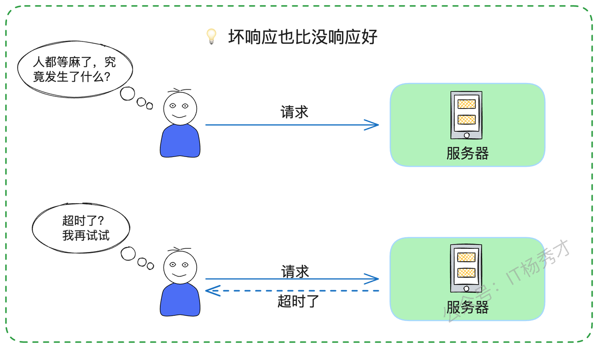

其次，也是更为关键的，超时管理能有效防止系统资源被无效占用。这主要涉及两类核心资源：

1. **计算资源保护**：当请求超时后，处理线程可以立即释放并投入到其他任务中。在没有超时保护的情况下，这些线程可能会被长时间甚至永久占用。在Go语言环境中，这同样适用于协程资源的保护。

2. **连接资源保护**：无论是微服务间的RPC连接还是与数据存储层的连接，都是宝贵且有限的资源。超时机制确保这些连接不会因为单个请求的异常而被长期占用。

在我参与的多个大型项目中，系统崩溃的根源往往不是因为请求量过大，而是因为缺乏有效的超时保护导致的资源耗尽。这种故障模式在高并发场景下尤为常见。

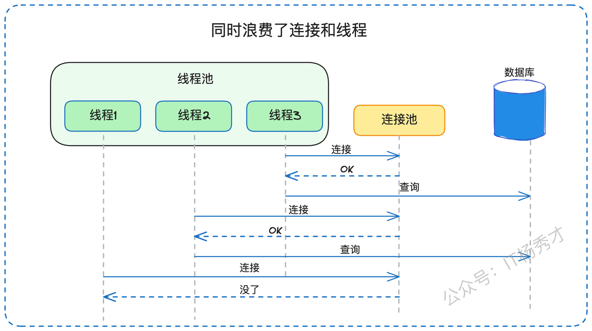

### 1.2 **超时管理的两种模式**

从架构设计角度看，超时管理主要有两种实现模式：

1. **单点超时模式**：这是最基础的形式，每个服务调用单独设置超时阈值。例如，当服务A调用服务B时，为这次调用单独设置一个超时限制。

2. **全链路超时模式**：这是一种更先进的模式，整个调用链共享一个总体超时预算。例如，在A→B→C的调用链中，如果总体超时预算是800ms，且A调用B已经消耗了300ms，那么B调用C的超时上限就自动调整为500ms。

全链路超时模式在现代微服务架构中越来越受到重视，特别是在那些对响应时间有严格要求的核心业务流程中。


以电商平台为例，用户下单流程的API响应时间被严格限制在300ms以内。这意味着无论后端涉及多少微服务调用，整个链路的总耗时都不能超过这个阈值。这种严格的时间预算管理，是保障用户体验的关键所在。

### 1.3 **超时阈值的科学制定**

超时阈值的制定是一门平衡艺术，需要在用户体验和系统稳定性之间找到最佳平衡点。在我的实践中，总结出了四种行之有效的制定策略：业务需求驱动法、性能数据分析法、压力测试验证法、以及代码复杂度评估法。

合理的超时设置至关重要：设置过宽松会导致系统资源被无效占用，最终可能引发雪崩；设置过严格则会导致正常请求被误杀，影响业务可用性。

#### 1.3.1 **业务需求驱动法**

这种方法以业务场景的实际需求为出发点。例如，产品团队基于用户行为分析得出结论：用户在商品详情页的等待容忍度不超过500ms，那么相关API的超时阈值就应该控制在这个范围内。

然而，纯粹依赖业务需求来制定技术参数往往不够现实。当产品团队无法给出明确指导时，我们就需要转向更技术化的方法。

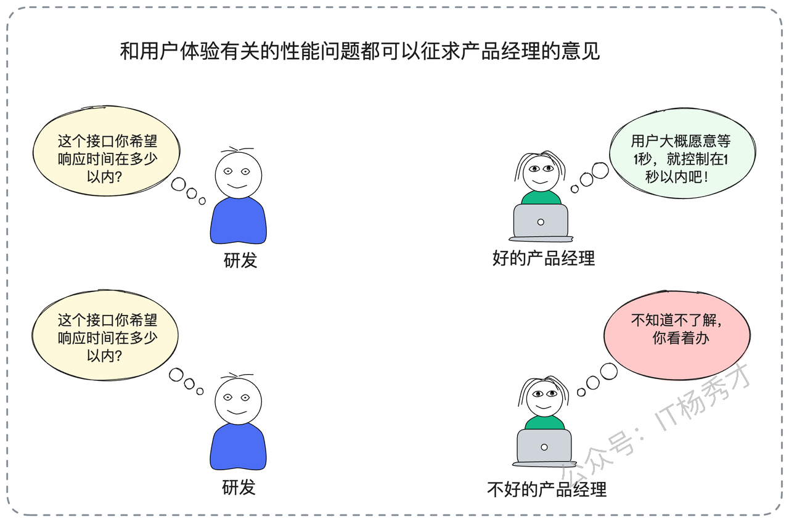

#### 1.3.2 **性能数据分析法**

这是工程实践中最常用的方法。通过分析目标服务的历史性能数据，选择合适的百分位数作为超时基准。P99（99百分位）表示99%的请求响应时间都在该值以下，P999（99.9百分位）则表示99.9%的请求都能在该时间内完成。选择P99还是P999，需要根据业务的可用性要求来决定。

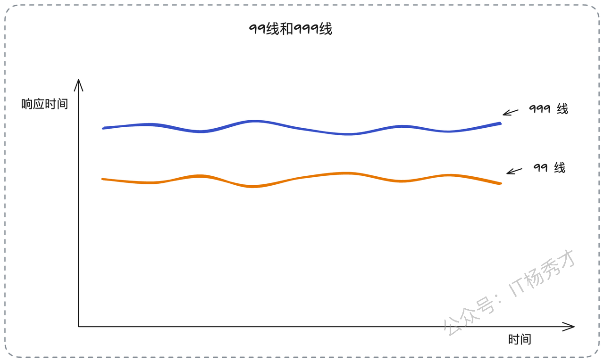

这种方法的前提是目标服务已经部署了完善的监控体系，如Prometheus、Grafana等。对于全新的服务，由于缺乏历史数据，我们需要采用其他方法。

#### 1.3.3 **压力测试验证法**

当缺乏历史性能数据时，压力测试是获取性能基线的有效手段。通过在接近生产环境的条件下进行负载测试，可以获得服务在不同压力下的响应时间分布。

不过，压力测试的成本相对较高，需要专门的测试环境和时间投入。在快速迭代的开发环境中，这种方法的可行性往往受到限制。

#### 1.3.4 **代码复杂度评估法**

当其他方法都不可行时，我们可以通过分析代码的执行路径来估算响应时间。以一个典型的业务接口为例，如果它包含：3次数据库查询、1次Redis访问、1次消息发送操作，那么总响应时间可以这样估算：

```plain&#x20;text
总响应时间 = 数据库查询时间 × 3 + Redis访问时间 + 消息发送时间
```

为了增加安全边际，通常会在计算结果基础上增加20%-50%的缓冲时间。例如，如果理论计算值为200ms，那么实际超时设置可能会是250ms-300ms。

### 1.4 **超时与业务中断的复杂关系**

在技术面试中，有一个经常被忽视但非常重要的话题：当超时发生时，服务端的业务逻辑是否会真正停止执行？

这个问题的答案可能会让很多人意外：在大多数情况下，即使客户端已经超时，服务端的业务逻辑仍然会继续执行，直到自然结束。只有在服务端主动实现了超时检测机制的情况下，业务逻辑才可能被提前终止。

让我用一个具体场景来说明这个问题。假设某个业务流程包含三个连续步骤：数据验证(A)、业务处理(B)、结果存储(C)。如果在执行步骤B时发生了超时，而代码中没有超时检测逻辑，那么步骤C仍然会被执行。只有当代码中明确加入了超时状态检查，才能在步骤B完成后立即返回。

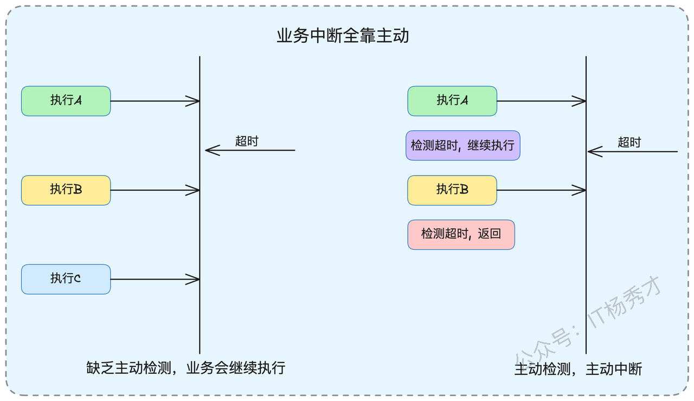

然而，在实际的工程实践中，很少有团队会在业务代码中手动添加这种超时检测逻辑，因为这会显著增加代码的复杂性。这就导致了一个常见的问题：客户端收到超时错误，但服务端实际上已经成功完成了操作。

一个典型的例子是用户注册场景。用户提交注册请求后，由于网络延迟或服务处理缓慢，客户端收到了超时响应。但实际上，服务端已经成功将用户信息写入数据库。当用户重新尝试注册时，系统会提示"手机号已存在"，这让用户感到困惑。


不过，如果系统的中间件层设计得当，可以在一定程度上缓解这个问题。

### 1.5 **超时监控的责任分配**

在分布式系统架构中，超时监控的责任分配是一个关键的设计决策。根据我的经验，主流的微服务框架通常将超时监控的主要责任分配给客户端，而在某些高级框架中，服务端也会参与超时监控。

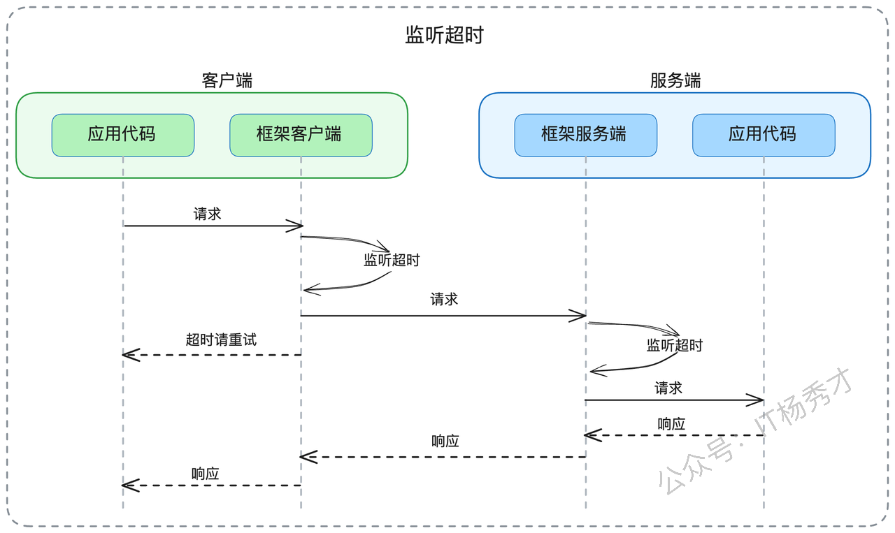

当客户端负责超时监控时，会出现几种典型场景：

1. 第一种情况是"提前超时"。如果在客户端准备发送请求时，发现已经超过了预设的超时时间（例如因为之前的处理耗时过长），客户端框架会直接返回超时错误，甚至不会发出实际请求。这种机制有效避免了无谓的网络传输和服务端资源消耗。


* 第二种情况是"请求中超时"。客户端发出请求后，在等待响应的过程中达到了超时阈值。此时客户端框架会立即向应用层返回超时错误，同时在后台维护一个"孤儿请求"的处理机制——当服务端最终返回响应时，这些响应会被客户端框架静默丢弃。

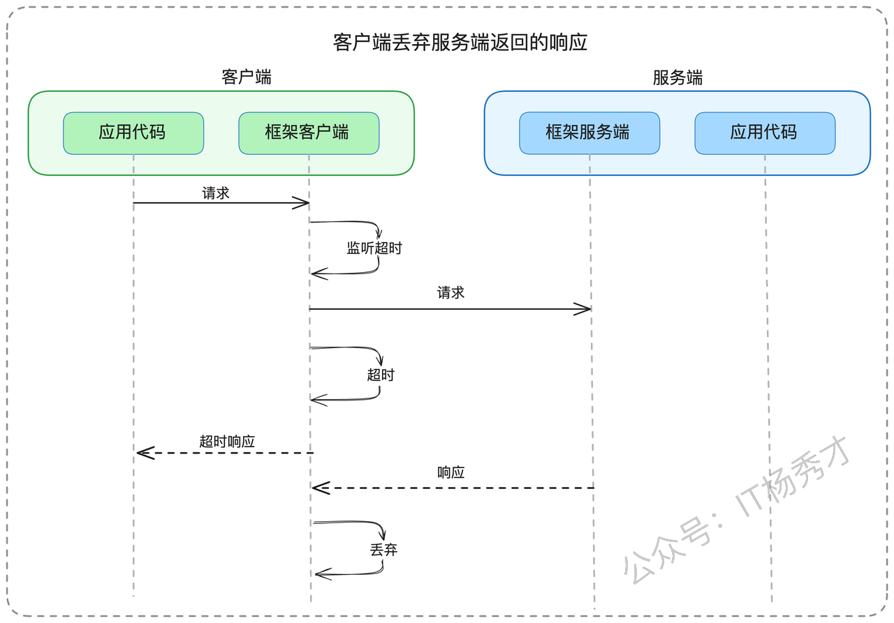

在支持服务端超时监控的框架中，也存在两种典型场景：

1. 首先是"请求到达即超时"。当请求抵达服务端时，服务端框架会检查请求是否已经超时。如果发现请求已经超时，服务端框架会直接返回超时响应，而不会将请求转发给实际的业务处理逻辑。

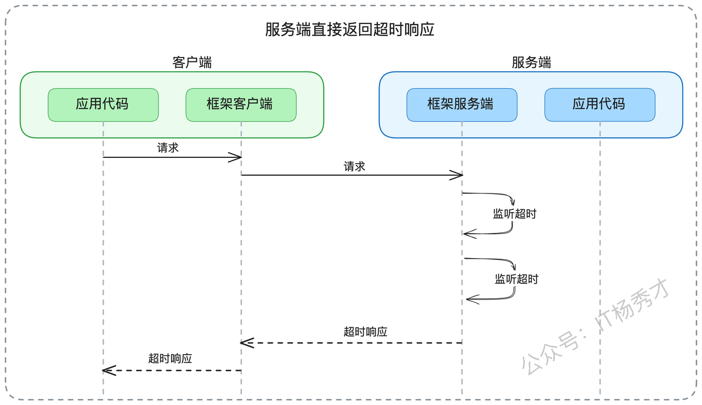

* 其次是"处理过程中超时"。服务端在执行业务逻辑的过程中，框架层会持续监控是否达到超时阈值。一旦超时，框架会立即释放网络连接，转而处理下一个请求。当业务逻辑最终完成时，其结果会被框架层丢弃，不会返回给已经断开连接的客户端。


这些超时监控机制的核心价值在于防止系统资源被无效占用。一旦客户端收到超时响应，用户界面通常已经显示了错误信息或触发了重试逻辑，此时继续处理原请求往往是徒劳的。

在技术面试中，深入讨论超时监控责任分配的细节，能够展示你对分布式系统设计的深刻理解，这往往是区分高级工程师和普通开发者的关键点之一。

## 2. **面试策略与准备**

掌握了前面的理论知识后，接下来需要做好充分的面试准备。除了理解超时管理的核心概念、实现模式和阈值制定策略外，你还需要结合自己的实际工作经验进行深度思考。

建议你从以下几个维度收集和整理相关材料：

1. **业务层面的性能标准**：了解公司核心产品（如移动App主要功能、Web端关键流程）的性能指标要求。这些指标通常由产品或运营团队制定，例如"首页加载时间不超过2秒"。同时调研公司是否在关键业务中实施了全链路超时管理。

2. **技术实现的现状梳理**：审查你负责维护的服务中超时配置的现状，包括对下游服务的调用超时、数据库操作超时等具体数值，以及这些数值的制定依据。

3. **基础设施的超时配置**：检查与各类中间件的交互是否设置了合理的超时参数，如缓存查询（Redis）、消息队列操作（Kafka、RabbitMQ）、搜索引擎调用（Elasticsearch）等。

4. **故障案例的积累**：收集和分析与超时配置相关的生产事故，特别是因超时设置不当导致的连接池耗尽、线程堆积等问题。这些真实案例在面试中能够有力证明你的实战经验和问题解决能力。

为了更好地应对面试，建议提前梳理超时管理相关的常见问题。这些问题通常围绕实际应用场景展开，考查你的理论理解和实践能力。


如果发现当前项目中存在超时配置的空白点，建议主动进行优化。这不仅能加深你对相关技术的理解，也为面试提供了具体的实践案例。

### 2.1 **面试应答策略**

在实际面试中，关于超时管理的问题通常会从基础概念开始，然后逐步深入到具体的实现细节。下面我分享一套经过实战验证的应答策略。

> 当面试官询问你在服务调用中是否设置超时时间时，你可以从超时管理的核心价值开始回答。  
>     
> "我在所有的外部调用中都会设置超时参数，这主要基于两个考虑：保障用户体验和保护系统资源。以我们的商品推荐接口为例，由于它直接影响用户的购物体验，我们将整个接口的响应时间严格控制在150ms以内。这个时间标准是产品团队基于用户行为分析确定的。"  
>
> 通过这个回答，你展示了对超时管理价值的理解，同时给出了具体的业务场景。面试官很可能会继续追问："如果没有明确的业务要求，你如何确定合适的超时时间？"
>
> "在缺乏明确业务指导的情况下，我通常采用数据驱动的方法。首选方案是分析目标服务的历史性能数据，选择P99或P999作为超时基准。比如，如果某个服务的P999响应时间是300ms，我会将调用超时设置为300ms左右。对于新服务，我会通过压力测试获取性能基线。如果条件不允许，我会通过代码分析来估算，然后增加适当的安全边际。"
>
> 这个回答展示了你的技术深度和实践经验。面试官可能会进一步询问P99和P999的选择标准。
>
> "选择P99还是P999主要取决于系统的可用性要求。如果系统要求99.9%的可用性，那么使用P999更合适；如果是99%的可用性要求，P99就足够了。另外，我也会考虑两者的数值差异，如果P99是100ms而P999是500ms，这种巨大差异通常意味着系统存在性能问题，需要优先解决根本问题而不是简单地调整超时参数。"

此时，面试官可能会将话题转向相关的技术领域，如流量控制或服务治理，你需要做好相应的准备。

接下来，你可以主动分享一个超时配置不当导致的生产故障案例，这能有效展示你的实战经验：

"在我的实践中，超时配置对系统稳定性至关重要。我曾经遇到过一个典型案例：团队中有同事将数据库查询的超时时间设置为30秒，在数据库出现性能波动时，大量请求被长时间阻塞，最终导致应用服务器的连接池被耗尽，整个服务不可用。这个事故让我深刻认识到，合理的超时配置不仅是性能优化的手段，更是系统稳定性的重要保障。"

通过这个案例，你可以自然地引出更高级的话题："为了更系统地解决超时管理问题，我们后来引入了全链路超时传播机制。这种方案能够在复杂的微服务调用链中实现更精确的时间预算管理，显著提升了用户体验。"

### 2.2 **全链路超时传播机制**

> 全链路超时传播是今天要重点讨论的高级话题，这个技术点具有很强的延展性，可以从多个角度深入探讨。当面试官询问全链路超时传播的原理时，你可以从其核心特征开始介绍。
>
> "全链路超时传播与传统的单点超时最大的区别在于，它将整个调用链视为一个统一的时间预算单元。举个例子，在用户下单的业务流程中，假设总体时间预算是1秒，包含订单服务→库存服务→支付服务的调用链。如果订单服务调用库存服务耗费了300ms，那么库存服务调用支付服务的可用时间就自动调整为700ms。这种机制的核心在于超时信息在整个调用链中的动态传递。"
>
> 通过这个回答，你巧妙地留下了一个技术细节的"钩子"——超时信息如何传递。面试官很可能会追问具体的实现方式。
>
> "超时信息的传递主要通过协议头部实现。具体的载体取决于使用的通信协议：对于传统的RPC框架（如Apache Dubbo），超时信息会封装在RPC协议的元数据中；对于HTTP协议，则通过自定义的HTTP头部传递；而对于gRPC这种基于HTTP/2的RPC协议，由于它复用了HTTP的头部机制，所以超时信息同样通过HTTP头部传递。不同框架在具体实现上会有差异，但基本原理是一致的。"

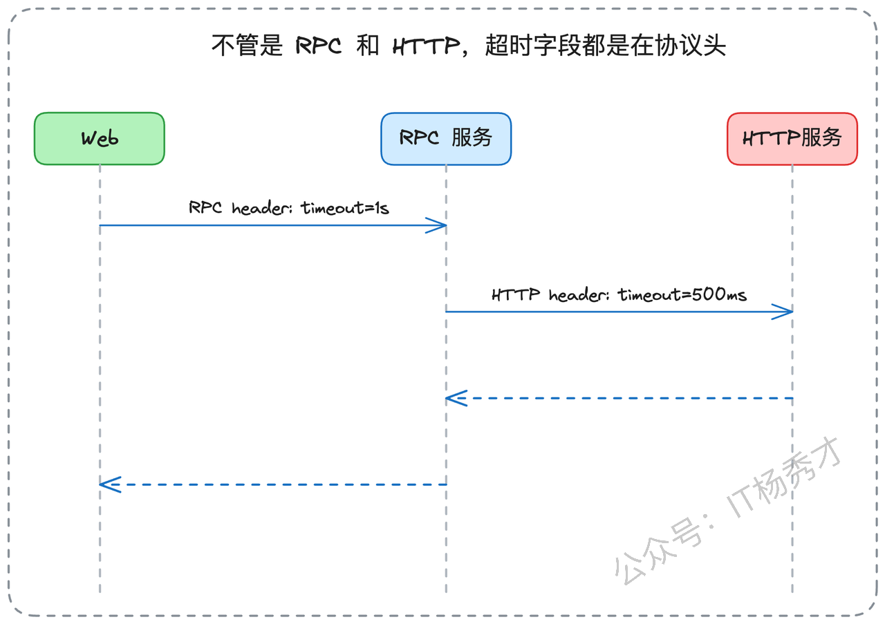

你的回答再次留下了一个技术细节的"钩子"——传递的具体内容是什么。这为面试官提供了继续深入的机会。在链路中传递的超时信息主要有两种形式：剩余时间预算和绝对截止时间戳。

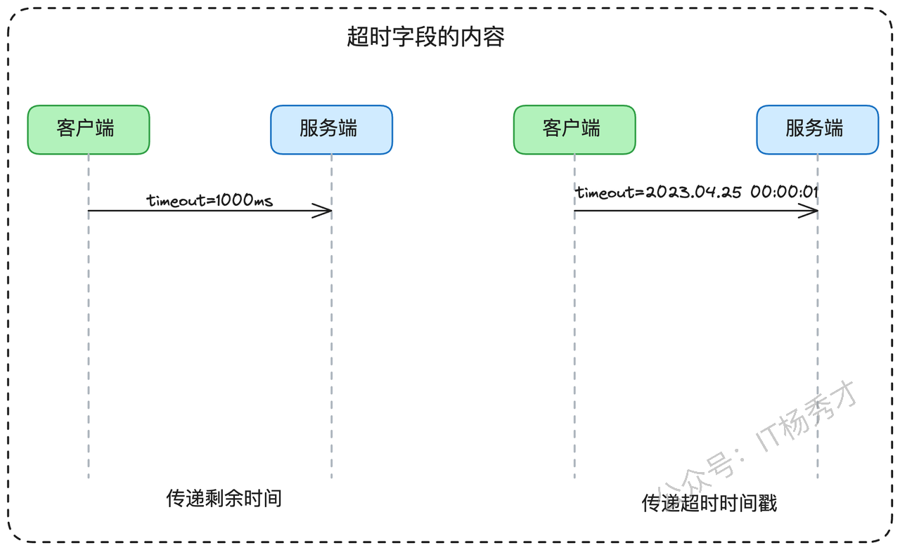

> "这两种方式各有利弊，需要根据具体场景选择。剩余时间预算是目前更常见的做法，通常以毫秒为单位传递一个数值。但这种方式有个技术挑战：接收方需要考虑网络传输延迟的影响。
>  
> 绝对截止时间戳的方式则面临时钟同步的挑战，不过在现代数据中心环境中，服务器间的时钟偏差通常很小，相对于几百毫秒的超时时间来说可以忽略不计。让我详细解释这两种方式的技术细节。  
>
> 剩余时间预算方式：假设当前剩余1秒，系统会传递数值1000（毫秒）。接收方收到请求后，理论上应该扣除网络传输时间来计算真实的剩余时间。比如，如果服务C收到剩余时间500ms，而B到C的网络传输耗时10ms，那么C的实际可用时间应该是490ms。但在实践中，准确测量网络传输时间是个技术难题。
>  
> 绝对截止时间戳方式：系统传递一个具体的时间点，如'2024-01-01 12:00:01.500'。这种方式的风险在于时钟同步问题。假设服务A的时钟显示12:00:00，而服务B的时钟显示12:00:01（快了1秒），如果A传递的截止时间是12:00:01，B收到请求时会立即认为已经超时。
>  
> 不过，现代云环境中的时钟同步技术已经相当成熟，偏差通常控制在毫秒级别。但在跨云厂商或者发生时钟回拨的极端情况下，仍然需要特别注意。"

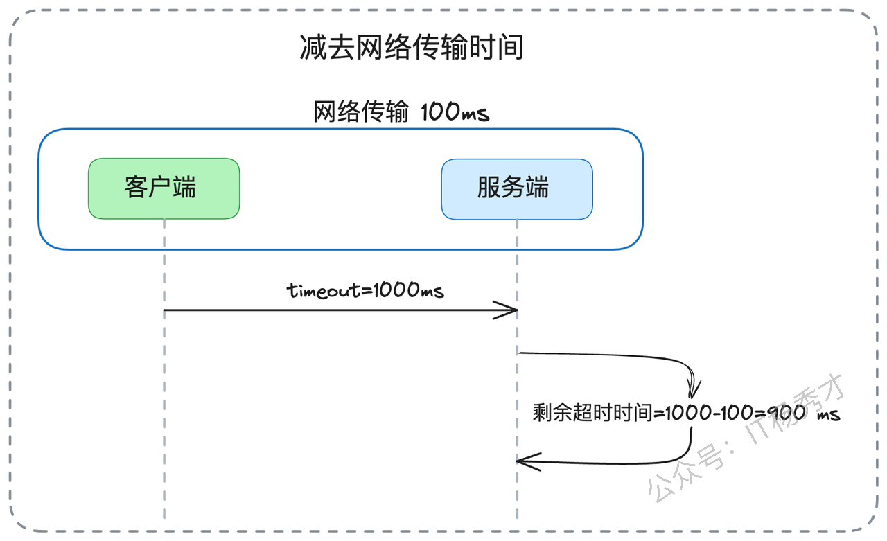

> 你提到了网络传输时间测量的难题，面试官很可能会追问具体的解决方案。这时你可以从技术和实践两个角度来回答：
>
> "网络传输时间的测量确实是个技术挑战。最可靠的方法是通过基准测试来建立传输时间模型。我们会在接近生产环境的条件下，使用典型大小的请求进行大量测试，统计网络传输的平均耗时和分布情况。
>
> 不过在实际工程中，我们通常会采用更实用的策略。对于同机房内的服务调用，网络延迟通常在1ms以内，相对于几百毫秒的业务超时时间来说可以忽略。但对于跨机房特别是跨地域的调用，网络延迟就不能忽视了，可能达到几十毫秒甚至更多。
>
> 另外，基准测试必须尽可能还原生产环境的复杂性，包括负载均衡器、API网关、防火墙等中间件的影响，这些组件都会对网络传输时间产生影响。"
>
> 接下来，面试官可能会提出一个更具挑战性的问题：如果某个服务声称无法在规定时间内完成处理，应该如何处理？
>
> "这是全链路超时管理中经常遇到的问题。我的原则是优先从技术角度解决问题。如果业务需求明确要求整个链路在1秒内完成，那么每个环节都应该配合这个目标进行性能优化，而不是简单地要求放宽时间限制。
>
> 当然，如果经过技术评估确实存在客观限制，我们也需要在业务需求和技术现实之间找到平衡。这时可能需要调整整体的时间预算，或者考虑通过异步处理、缓存预热等方式来优化性能。
>
> 在推动跨团队协作时，我通常会先通过技术交流的方式寻求解决方案，比如一起分析性能瓶颈、探讨优化策略。如果技术层面无法达成一致，再通过项目管理流程来协调资源和优先级。"
>
> 这种回答既展示了你的技术判断力，也体现了良好的沟通协作能力，这对于高级工程师职位来说都是重要的素质。

## 3. **核心要点回顾**

通过今天的深入分析，相信你已经对请求超时管理有了全面的理解。让我们回到最初的问题：如何确保用户能在1秒内获得响应？

这正是请求超时管理要解决的核心问题之一——在保障用户体验的同时，通过合理的超时策略保护系统资源。无论是客户端还是服务端的超时监控，都能有效防止系统资源被无效占用，从而维护整体系统的稳定性。

关于超时阈值的制定，我们探讨了四种主要方法：业务需求驱动、性能数据分析、压力测试验证和代码复杂度评估。每种方法都有其适用场景，关键是要在用户体验和系统稳定性之间找到最佳平衡点。

在现代微服务架构中，全链路超时传播机制正在成为主流趋势。我们重点分析了这种机制的实现原理，包括超时信息的传递方式、剩余时间预算与绝对截止时间戳的选择等技术细节。掌握这些知识点，能够让你在面试中展现出对分布式系统设计的深刻理解。

记住几个关键技术概念：全链路传播、协议头封装、时间预算管理、超时监控责任分配。这些都是构建你技术回答的重要支撑点。

# 资料分享
随着AI发展越来越快，AI编程能力越来越强大，现在很多基础的写接口，编码工作AI都能很好地完成了。并且现在的面试八股问题也在逐渐弱化，**面试更多的是查考候选人是不是具备一定的知识体系，有一定的架构设计能力，能解决一些场景问题**。所以，不管是校招还是社招，这都要求我们一定要具备架构能力了，不能再当一个纯八股选手或者是只会写接口的初级码农了。这里，秀才为大家精选了一些架构学习资料，学完后从实战，到面试再到晋升，都能很好的应付。**关注秀才公众号：IT杨秀才，回复：111，即可免费领取哦**


<div style="background-color: #f0f9eb; padding: 10px 15px; border-radius: 4px; border-left: 5px solid #67c23a; margin: 20px 0; color:rgb(64, 147, 255);">

## <span style="color: #006400;">**学习交流**</span>
<span style="color:rgb(4, 4, 4);">
> 如果您觉得文章有帮助，可以关注下秀才的<strong style="color: red;">公众号：IT杨秀才</strong>，后续更多优质的文章都会在公众号第一时间发布，不一定会及时同步到网站。点个关注👇，优质内容不错过
</span>


</div>