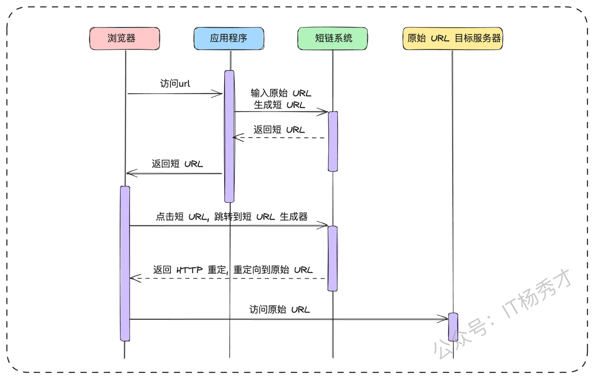
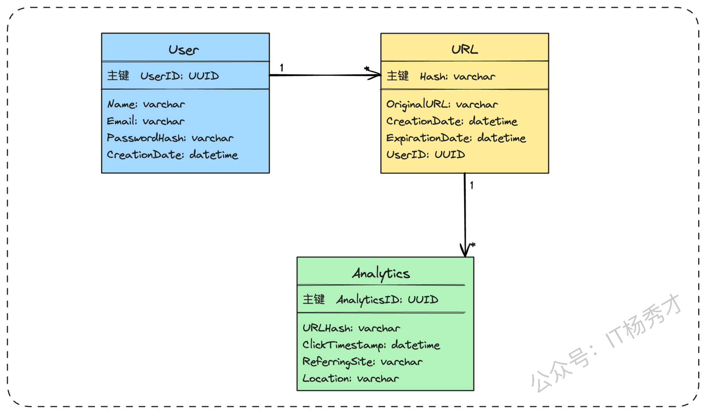
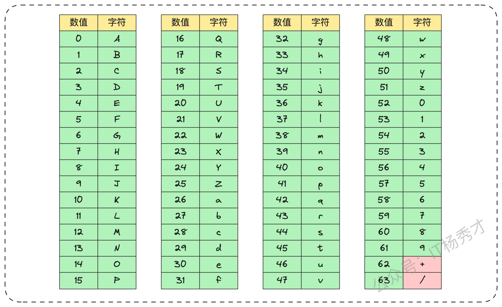
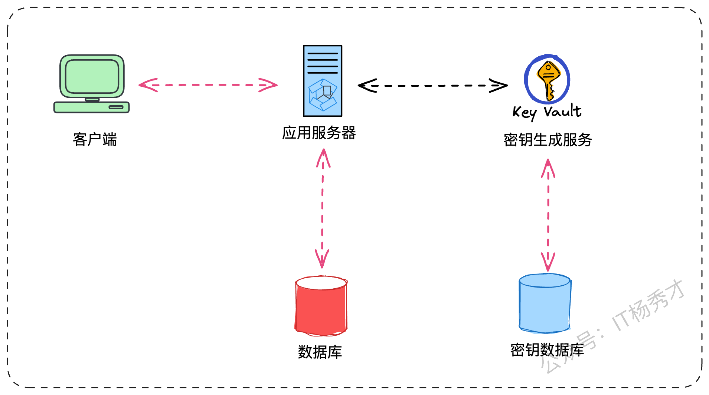
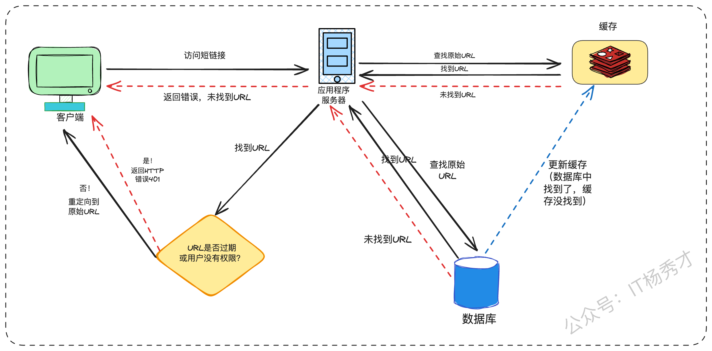
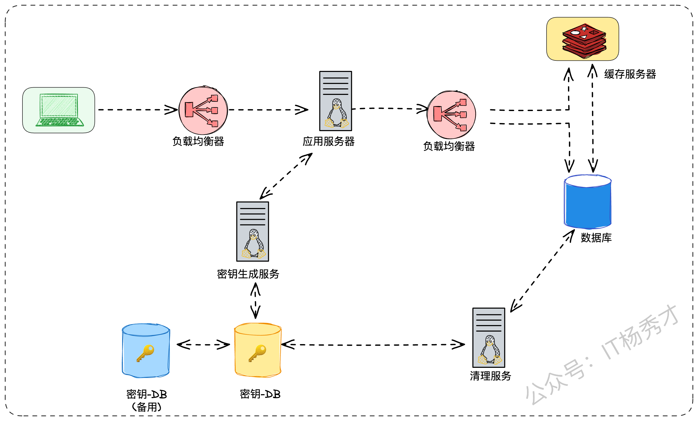

在后端面试中，系统设计题是检验一位工程师架构思维和技术深度的试金石。其中，“设计一个短链系统”可以说是最高频的题目之一。

这个问题看似简单——不就是把长网址变短吗？但如果你真的这么认为，那可能就危险了。一个看似基础的功能背后，隐藏着海量数据存储、高并发处理、服务高可用等一系列复杂的工程挑战。面试官抛出这个问题，正是想看看你如何抽丝剥茧，从一个简单的需求出发，逐步构建出一个稳健、高效、可扩展的十亿级系统。

今天，秀才就带大家来模拟一次真实的面试过程，一步步剖析如何完美地回答这个问题，让你在面试中脱颖而出。

## **1. 什么是短链系统？**

首先，我们得确保和面试官在同一个“频道”上。短链系统，顾名思义，就是将一个冗长的URL（例如一篇新闻的链接）转换成一个非常短的URL。当用户访问这个短链接时，系统会自动将他重定向到原始的长链接地址。

这个过程的核心在于“生成”和“重定向”。

上图清晰地展示了整个交互流程：

1. **生成**：应用程序将原始长URL发送给短链系统。

2. **返回**：短链系统生成一个唯一的短URL，并返回给应用程序。

3. **访问**：用户点击短URL。

4. **重定向**：浏览器访问短链系统，系统查询到原始长URL后，返回一个HTTP 302重定向响应，浏览器随即访问原始的URL目标服务器。

## **2. 为什么我们需要URL短链系统？**

明确了“是什么”，接下来就要理解“为什么”。在面试中，能清晰地阐述一个技术的业务价值，是体现你商业思考和产品思维的加分项。

URL短链系统的价值主要体现在以下几个方面：

* **美观与便捷**：在社交媒体（如微博）、短信、二维码等对字符长度有限制的场景下，短链接是刚需。它更易于分享、打印和口头传播，用户也更不容易输错。

* **数据追踪与分析**：这是短链接一个非常核心的商业价值。通过在短链接的重定向上增加统计逻辑，我们可以追踪到链接的点击次数、点击来源、用户地域分布、设备信息等，为运营决策和广告效果衡量提供精准的数据支持。

* **功能扩展**：短链接可以作为一层中间代理，在这层代理上我们可以实现很多高级功能，比如链接的有效期控制、访问密码保护、设备跳转控制（移动端和PC端访问跳转到不同页面）等。

* **隐藏原始链接**：在某些推广场景下，可以隐藏真实的、带有复杂参数的原始URL。

比如，一个很长的商品链接：

https://www.designgurus.org/course/grokking-the-system-design-interview

可以被缩短为：

https://tinyurl.com/vzet59pa

长度缩短了近三分之二，无论是在哪个场景下使用，都显得清爽利落。

## **3. 面试实战指南**

好了，背景知识铺垫完毕，现在正式进入面试环节。系统设计题的回答，切忌一上来就抛出最终方案。一个优秀的回答过程，应该像一次与面试官共同探索的旅程，充满互动和逐步深入的思考。

### **3.1 需求分析：一切设计的起点**

**面试官**：“我们来聊聊系统设计吧。如果要你设计一个高性能的短链系统，你会怎么入手？”

这是一个开放性问题，千万不要直接回答：“我会用Redis、用哈希算法……”。正确的起手式是**确认需求**。这能体现你严谨的工程素养。

你可以这样回应：

> “在开始设计之前，我想先和您明确一下系统的具体需求和目标范围，这样我们的讨论会更有针对性。比如，我们需要支持哪些核心功能？对系统的性能和可用性有什么样的要求？”

通过这样的提问，你就把问题抛给了面试官，也展示了你的专业性。并且更重要的是，可以从面试官那里确认出这个系统的一个大概的需求范围。假设经过沟通，你们明确了以下需求：

1. **功能性需求：**

   * **生成短链**：输入一个长URL，系统能生成一个唯一的、更短的别名（短链接）。

   * **支持自定义**：用户可以选择性地为他们的URL指定一个有意义的自定义短链接。

   * **重定向**：访问短链接时，系统必须能准确、快速地重定向到原始的长链接。

   * **过期机制**：链接可以设置过期时间，过期后失效。

2. **非功能性需求：**

   * **高可用**：系统必须7x24小时可用。因为一旦服务宕机，所有短链接都将失效，这在很多场景下是灾难性的。

   * **高性能**：重定向过程必须延迟极低，用户几乎无感知。

   * **唯一且不可预测**：生成的短链接必须是唯一的，并且不能被轻易地猜到规律，以防被恶意遍历。

3. **扩展性需求：**

   * **数据分析**：需要支持统计短链接的访问数据。

   * **开放API**：系统应提供REST API，方便其他服务接入。

### **3.2 容量预估：用数据指导架构**

需求明确了，下一步就要进行一个容量预估了。对于后端设计者而言，必须要做一个容量的估算，这样才方便我们选定合适的方案。

> **你**：“需求很清晰了。接下来，我想做一个简单的容量预估，这有助于我们判断系统的量级，从而选择合适的技术方案。”

这是展示你架构设计能力的关键一步。没有数据支撑的设计都是空中楼阁。

1. **流量估算**：假设我们是一个快速发展的业务，预计每月新增5亿个短链接。短链系统的读写比通常非常悬殊，读取（重定向）远多于写入（生成）。我们假设读写比例为 **100:1**。

   * **写入QPS**：每月5亿次写入，那么每秒的写入请求大约是 `5亿 / (30天 * 24小时 * 3600秒) ≈ 200次/秒`。

   * **读取QPS**：根据100:1的读写比，读取请求大约是 `200 * 100 = 2万次/秒`。这个并发量已经不低了。

2. **存储估算**：假设每个短链接数据（包括长URL、短URL、创建时间、用户ID等）我们存储5年。

   * **总记录数**：`5亿/月 * 12个月/年 * 5年 = 300亿`。这是一个非常庞大的数字。

   * **单条记录大小**：我们粗略估计每条记录为500字节。

   * **总存储空间**：`300亿 * 500字节 ≈ 15TB`。这个存储需求对于单机数据库来说是无法承受的。

3. **带宽估算**：

   * **入口带宽（写）**：`200次/秒 * 500字节/次 ≈ 100 KB/s`。

   * **出口带宽（读）**：`2万次/秒 * 500字节/次 ≈ 10 MB/s`。

4. **缓存估算**：为了提升读取性能，缓存是必不可少的。根据二八原则，80%的访问量集中在20%的热点链接上。

   * **每日总请求数**：`2万次/秒 * 3600秒/小时 * 24小时/天 ≈ 17亿次`。

   * **缓存目标**：我们需要缓存这17亿次请求中的20%。

   * **所需内存**：`17亿 * 20% * 500字节 ≈ 170GB`。

将这些估算结果汇总成一个表格，展示给面试官，会显得非常专业：

> **你**：“通过估算，我们可以看到，这个系统面临的是**高并发读取**和**海量数据存储**两大挑战。这将是我们后续架构设计的核心出发点。”

### **3.3 系统接口定义（API Design）**

在宏观设计之前，先定义微观的接口，是一种自底向上的优秀设计习惯。这有助于我们厘清系统的边界和能力。、

> “接下来我们可以设计一套RESTful API来暴露服务能力。主要包括以下几个接口：”

#### **3.3.1 创建短链 API**

请求路由：`GET /{shortened_url}`

请求参数：

| 参数               | 释义                                  |
| ---------------- | ----------------------------------- |
| original\_url    |  需要缩短的原始长网址(字符串，必填)                 |
| custom\_alias    | 用户希望指定的短网址自定义别名(字符串，可选)             |
| expiration\_date | 短网址应过期的日期和时间(时间戳，可选)                |
| user\_id         | 创建缩短 URL 的用户 ID（如果支持用户账户功能）(字符串，可选) |

响应参数：

| 参数               | 释义                  |
| ---------------- | ------------------- |
| shortened\_url   |  由服务生成的缩短后 URL(字符串) |
| creation\_date   | URL 被缩短时的日期和时间(时间戳) |
| expiration\_date | 短网址的过期日期（时间戳，如提供）   |

#### **3.3.2 重定向 API**

> 将用户从短链接重定向至原始长网址

请求路由：`GET /{shortened_url}`

请求参数：

| 参数              | 释义                    |
| --------------- | --------------------- |
| `shortened_url` | 需要解析为原始网址的短链接（字符串，必填） |

响应：**重定向至 `original_url`**

#### **3.3.3 数据分析接口**

> 提供短链接的详细分析数据，包括点击次数和用户人口统计信息

请求路由：`GET /analytics/{shortened_url}`

请求参数：

| 参数             | 释义                    |
| -------------- | --------------------- |
| shortened\_url | 需要获取分析数据的短链接(字符串，必填)  |
| start\_date    | 用于筛选分析数据的开始日期(时间戳，可选) |
| end\_date      | 用于筛选分析数据的结束日期(时间戳，可选) |

响应参数：

| 参数               | 释义                               |
| ---------------- | -------------------------------- |
| click\_count     |  该短链接被点击的总次数(整数)                 |
| unique\_clicks   | 点击该短链接的唯一用户数(整数)                 |
| referring\_sites | 为该短链接带来流量的来源网站(列表)               |
| location\_data   | 点击该网址的用户地理分布(地图)                 |
| device\_data     | 点击 URL 所使用的设备（移动设备、桌面设备等）的细分（映射） |

#### **3.3.4 网址管理 API**

请求路由： `GET /user/urls`

请求参数：

| 参数         | 释义                    |
| ---------- | --------------------- |
| user\_id   | 请求其短网址的用户 ID(字符串, 必需) |
| page       | 分页结果的页码(整数, 可选)       |
| page\_size | 每页的结果数量(整数，可选)        |

响应参数：

| 参数   | 释义                               |
| ---- | -------------------------------- |
| urls | 用户缩短的 URL 列表，包括创建日期和过期日期等元数据(列表) |

#### **3.3.5 删除短链接 API**

请求路由： `DELETE /{shortened_url}`

请求参数：

| 参数             | 释义                 |
| -------------- | ------------------ |
| shortened\_url | 需要删除的短链接(字符串，必填)   |
| user\_id       | 请求删除的用户 ID(字符串，必填) |

响应参数：

| 参数       | 释义                     |
| -------- | ---------------------- |
| `status` | 删除确认信息或操作失败时的错误提示(字符串) |

**面试官**：“接口设计得不错。但有个问题，如果恶意用户疯狂调用创建接口，把我们生成的短码耗尽了怎么办？”。这是一个很好的追问，考察你对系统安全性的思考。

> **你**：“如果不加限制，面对恶意调用，短url肯定很快会被耗尽。所以我们需要加入防滥用机制。核心手段是**API速率限制**。我们可以基于用户ID或IP地址进行限流，比如，限制每个IP每分钟只能创建10个短链接。对于未登录的匿名用户，这个限制可以更严格。”

### **3.4 数据库设计**

基于前面的需求和接口，我们可以设计出数据库的表结构。

> “考虑到300亿的记录量和高并发读取的需求，关系型数据库可能不是最佳选择。因为分库分表会非常复杂，而且我们数据之间的关系很简单。我更倾向于使用NoSQL数据库，比如AWS的DynamoDB、阿里云的Table Store (OTS) 或者开源的Riak，它们的水平扩展能力更强。”

我们可以设计以下几张表（以NoSQL的宽表模型为例）：

* **URL表 (url\_mapping)**

  * `Hash (Partition Key)`: 短链码，例如 `vzet59pa`。这是我们的主键，用于快速查找。

  * `OriginalURL`: 原始长链接。

  * `CreationDate`: 创建时间。

  * `ExpirationDate`: 过期时间。

  * `UserID`: 创建者ID。

* **用户表 (users)**

  * `UserID (Partition Key)`: 用户ID。

  * `Name`, `Email`, `PasswordHash`, ...

* **分析表 (analytics)**

  * `AnalyticsID (Partition Key)`: 唯一分析记录ID。

  * `URLHash`: 关联的短链码。

  * `ClickTimestamp`: 点击时间。

  * `ReferringSite`: 来源网站。

  * `Location`: 地理位置。

### **3.5 核心算法：如何生成短链码？**

**面试官**：“数据库选型和表结构设计都比较合理。现在我们来聊聊最核心的部分，这个短链码（比如 `vzet59pa`）到底该怎么生成呢？”

这是整个设计的灵魂。你可以提出几种方案，并分析优劣，展示你的技术广度和深度。

#### **3.5.1 方案一：哈希编码**

最直接的想法是对原始长URL进行哈希，然后取一部分作为短链码。

**你**：“一个直接的思路是对原始URL进行哈希，比如用MD5生成一个128位的哈希值，然后通过Base64编码将其转换为字符串。编码方式有很多种，比如base36 (`a-z`, `0-9`) 或 base62 (`A-Z`, `a-z`, `0-9`)，如果加上 `+` 和 `/` 就是标准的Base64编码。”

标准的Base64编码表如下：

> “在使用标准Base64时，我们需要考虑一个问题：短链码的长度应该设为多少？6位、8位还是10位？”

* 使用Base64编码，一个6位长度的短码，可以产生 `64^6 ≈ 687亿` 个可能的组合。

* 使用Base64编码，一个8位长度的短码，可以产生 `64^8 ≈ 281万亿` 个可能的组合。

**你**：“假设6位长度的短码（687亿）已经足够满足我们的系统需求。如果我们使用MD5算法，它会生成一个128位的哈希值，经过Base64编码后会得到一个超过21个字符的字符串。我们只取前6位或8位作为短码，这可能会导致冲突。为了解决这个问题，我们可以采取一些策略，比如当发现冲突时，换取哈希值的其他部分，或者对原始URL加盐后重新哈希。”

**你**：“不过，这个方案还有几个更麻烦的问题。第一，标准Base64中的 `+` 和 `/` 字符在URL中是特殊保留字符，其中“+”和“/”在URL中会被编码为`“%2B”`以及`“%2F”`，⽽`“%”`在写⼊数据库的时候⼜和SQL编码规则冲突，需要进⾏再编码，因此直接使⽤标准Base64编码进⾏短URL编码并不合适，直接使用会导致问题。URL保留字符编码表如下。

> “所以，我们需要对Base64编码进行改造，使其对URL友好。一个常见的做法是将 `+` 替换为 `-`，将 `/` 替换为 `_`。这样改造后的字符集就完全可以在URL中安全使用了。”

> “第二，如果多个用户输入同一个URL，他们会得到相同的短链接，这在某些需要独立追踪的场景下是不可接受的。
>
> 第三，URL的部分内容如果经过编码，例如 `.../?id=design` 和 `.../%3Fid%3Ddesign`，本质上是同一个URL，但哈希值却完全不同。针对这些问题，我们可以为每个输入URL附加一个递增的序列号或者唯一的用户ID来确保唯一性，不过这个序列号无需存入数据库。这种方法可能带来的问题是序列号会无限增长——是否存在溢出风险？同时附加递增序列号也会影响服务性能，引入新的复杂度。”

#### **3.5.2 方案二：自增ID转码（推荐）**

我们可以有一个独立的密钥生成服务（KGS），它预先生成随机的六字母字符串并将其存储在数据库中（我们称之为 key-DB）。每当我们想要缩短一个 URL 时，我们会取一个已经生成的密钥并使用它。这种方法就简单了，我们不仅不需要对 URL 进行编码，而且也不必担心重复或冲突。KGS 将确保所有插入到 key-DB 中的密钥都是唯一的。生成六字母字符串的方式这里我们可以用**自增ID转码的方式来实现**

> “考虑到哈希方案的种种复杂性，我更推荐另一种方案：**发号器 + 进制转换**。我们可以使用一个全局唯一的ID生成服务（类似Snowflake算法或数据库自增ID），每当有新的短链生成请求时，就获取一个唯一的十进制ID。”

比如，我们获取到了ID `10086`。然后，我们将这个ID从十进制转换为62进制（`a-z`, `A-Z`, `0-9`）。

`10086 (10进制) = 2Bi (62进制)`

这样，`2Bi` 就是我们的短链码。这个方案的优点非常突出：

* **绝对唯一**：每个ID都是唯一的，所以转换后的短链码也绝对不会冲突。

* **长度可控**：生成的短链码长度是递增的，可以从很短开始，有效利用了码空间。

* **性能高效**：转换过程是纯计算，速度极快。

**面试官**：“这个方案听起来不错。但这个全局ID生成器不就成了系统的单点了吗？如果它挂了，整个服务就不可用了。”

> “您提到了关键点。这个方案通常被称为**密钥生成服务 (Key Generation Service, KGS)**。为了解决单点问题，KGS本身需要设计成高可用的集群。我们可以为KGS设置备用副本，当主服务器宕机时，备用服务器就能接管。同时，KGS可以预先生成大量的唯一短码，并存入一个专用的数据库（Key-DB）。为了提升性能和可用性，我们可以设计两张表：一张存未使用的密钥，一张存已使用的。当KGS分配密钥给应用服务器时，就将其从未用表移动到已用表。KGS还可以在内存中缓存一批密钥，以便快速响应。为了避免多个应用服务器同时请求到同一个密钥，KGS在分配密钥时需要加锁同步。”

> **你**：“关于这个密钥数据库的大小，我们也可以估算一下。采用62进制，6位长度的短码，大约有 `62^6 ≈ 568亿` 种组合。如果每个字符占1字节，那么存储所有密钥需要 `6 * 568亿 ≈ 340GB` 的空间。”

我们如何进行密钥查找？我们可以在数据库中查找该密钥以获取完整的 URL。如果该密钥存在于数据库中，则向浏览器返回一个“HTTP 302 重定向”状态，并在请求的“Location”字段中传递存储的 URL。如果该密钥不在我们的系统中，则返回一个“HTTP 404 未找到”状态或将用户重定向回主页。

### **3.6 数据分区与复制**

> “前面我们估算出有15TB的数据，单机数据库肯定扛不住，所以必须进行数据分区（Sharding）。”

**面试官**：“具体说说你会怎么分区？”

> “主要有两种思路：”
>
> 1. **基于范围的分区**：我们可以根据短链码的首字母来分区。比如所有以'a'开头的存一个分片，'b'开头的存另一个。以此类推。这种策略称为基于范围的分区。我们甚至可以将某些出现频率较低的字母组合存入同一个数据库分区。

这种方式实现简单，但很容易导致数据倾斜和热点问题。例如，我们决定将所有以字母'E'开头的 URL 存入某个数据库分区，但后来发现以'E'开头的 URL 数量过多。

> 2. **基于哈希的分区**：这是更优的选择。我们对短链码（`Hash`）进行哈希计算，然后对分片总数取模，决定这条记录应该存储在哪个数据库分片上。例如 `hash(short_code) % 256`。这种方式能让数据均匀分布。

> 为了更好地处理增删节点带来的数据迁移问题，我们还可以引入**一致性哈希**算法。同时，为了保证数据的高可用，每个数据库分片都应该有主从副本，实现读写分离和故障转移。

### **3.7 缓存策略**

> “为了应对每秒2万次的读取请求，缓存是必不可少的一环。我们可以在应用服务器和数据库之间加入分布式缓存层，比如Redis或Memcached。”

> 我们可以对高频访问的 URL 进行缓存。采用 redis 等现成解决方案即可存储完整 URL 及其对应哈希值。这样应用服务器在访问后端存储前，能快速检查缓存中是否存在目标 URL。

* **缓存内容**：缓存 `短链码 -> 原始长URL` 的映射关系。

* **工作流程**：

  1. 当请求到达时，应用服务器首先查询缓存。

  2. 如果缓存命中（Cache Hit），直接从缓存中获取原始URL并返回重定向。

  3. 如果缓存未命中（Cache Miss），则查询后端的数据库。

  4. 从数据库查到数据后，先将其写入缓存，然后再返回给用户。这样后续相同的请求就能直接命中缓存了。

面试官：那需要配置多大的缓存内存呢？

> 我们可以从每日流量的 20%开始，根据客户端使用模式动态调整所需缓存服务器的数量。根据前文估算，缓存 20%的日流量需要 170GB 内存。由于现代服务器可配备 256GB 内存，我们完全可以用单台机器承载全部缓存。当然，也可以选择用多台配置较低的服务器来存储这些热门 URL。

哪种缓存淘汰策略最适合我们的需求？

> 可以使用 **LRU (Least Recently Used)** 策略。因为热点链接会经常被访问，而冷门链接则会逐渐被淘汰出缓存，这符合我们的业务场景。

> 同时，为了进一步提升效率，我们可以部署缓存集群。当发生缓存未命中并从数据库取回数据后，应用服务器需要将这个新条目写入所有缓存副本，以保证数据一致性。

### **3.8 负载均衡**

十亿级别的短链存储，在业务上访问量应该不低，所以服务实例基本上都要采用多节点部署。因此我们可以在系统中的三个位置添加负载均衡层。

> “我们的应用服务、缓存服务、数据库服务都会是集群部署，所以在系统的关键节点都需要部署负载均衡器（Load Balancer）。”

* **客户端 -> 应用服务器**

* **应用服务器 -> 数据库集群**

* **应用服务器 -> 缓存集群**

> “最初，我们可以采用简单的**轮询**策略。但这种策略不关心服务器的实际负载。如果某台服务器因为某些原因响应变慢，轮询策略依然会给它分配新请求，可能导致问题恶化。因此，更智能的方案是采用**最少连接**或**基于响应时间的加权轮询**等策略，负载均衡器会定期探测后端服务器的健康状况和负载，动态地调整流量分配。”

### **3.9 系统的"小细节"：过期链接清理**

**面试官**：“设计得差不多了。最后一个问题，那些设置了过期时间的链接，你们是怎么处理的？会有一个定时任务去扫描数据库删除吗？”

这是一个考察系统维护和资源优化的好问题。

> “主动扫描整个庞大的数据库去删除过期链接，成本太高，会对数据库造成不必要的压力。我们可以采用更优雅的**惰性删除（Lazy Deletion）和异步清理**结合的策略。”

* **设置默认过期时间：**&#x6211;们可以为每个链接设置默认有效期（例如两年）

* **访问时删除**：当一个用户访问某个短链接时，我们在查询到数据后，会检查其是否过期。如果已过期，我们不会返回重定向，而是直接删除该记录，并向用户返回一个“链接已失效”的页面。

* **异步清理**：同时，我们还会有一个低优先级的后台清理服务，它会在系统负载较低的时候（比如凌晨），慢慢地、分批地去清理那些已经过期但长时间未被访问的“僵尸”链接。这个服务必须被设计成轻量级的，避免影响核心业务。

* **密钥复用**：在删除了过期链接后，我们可以将它对应的短链码回收，放回到KGS的未使用密钥库中，实现循环利用。

## **4. 小结**

至此，一个相对完整、考虑周全的十亿级短链系统设计方案就展现在面试官面前了。我们再来回顾一下整体架构。

从一个简单的需求出发，我们通过**需求分析**、**容量预估**，明确了系统的核心挑战。然后，我们定义了清晰的**API接口**，设计了可扩展的**数据库模型**，并深入探讨了最核心的**短码生成算法**。为了应对高性能和高可用的要求，我们引入了**数据分区**、**缓存**和**负载均衡**等关键组件。最后，我们还考虑到了**过期数据清理**这样的维护性细节。

整个回答过程，不仅展示了你的技术深度和广度，更重要的是，体现了你作为一名架构师，那种从全局出发、层层递-进、权衡利弊的系统化思维方式。这，才是面试官最想看到的。

# 资料分享
随着AI发展越来越快，AI编程能力越来越强大，现在很多基础的写接口，编码工作AI都能很好地完成了。并且现在的面试八股问题也在逐渐弱化，**面试更多的是查考候选人是不是具备一定的知识体系，有一定的架构设计能力，能解决一些场景问题**。所以，不管是校招还是社招，这都要求我们一定要具备架构能力了，不能再当一个纯八股选手或者是只会写接口的初级码农了。这里，秀才为大家精选了一些架构学习资料，学完后从实战，到面试再到晋升，都能很好的应付。**关注秀才公众号：IT杨秀才，回复：111，即可免费领取哦**

## **学习交流**

> 如果您觉得文章有帮助，可以关注下秀才的<strong style="color: red;">公众号：IT杨秀才</strong>，后续更多优质的文章都会在公众号第一时间发布，不一定会及时同步到网站。点个关注👇，优质内容不错过

