大家好，我是秀才。今天我们又来拆解一个系统设计面试里经常出现的高频题：如果要实现一个类似抖音的热门视频榜单，该怎么设计？

乍一看，这似乎没什么难度，直觉上就是按照播放量排个序而已。但一旦把场景放大到抖音这种量级，再加上**实时更新**、**多时间窗口统计**等限制，问题就会变得极具挑战。不仅要求我们理解基础的数据结构（比如堆、排序），还会牵涉到**海量数据流处理、系统水平扩展、故障恢复以及成本权衡** 等方方面面。

接下来秀才以面试维度展开，带大家把思路打开，从最简单的单机实现切入，逐步暴露瓶颈、逐一化解，最后演进出一个可以抗住亿级数据冲击、同时保证稳定和实时性的排行榜架构。

## **1. 需求梳理**

> 假设现在有一个数据量很大的抖音视频观看数据流（本质上就是源源不断的 VideoID 记录）。在任意时间点，要求我们要能够准确统计出某个时间窗口内（比如过去 1 小时、1 天、1 个月，或者整个历史周期）播放次数最多的前 K 个视频，并拿到它们的计数。这里我们对性能再极致夸张一点，假设这里面试官明确给视频的播放量计，B站某些短视频每天的播放量高达**700 亿次**，并且每秒都会有超过 1 小时的新视频被上传。在这种情况下，我们如何设计这个排行榜来实现前面的要求呢？

对于系统设计问题，第一步还是老规矩，根据面试官的要求梳理出功能需求和非功能需求

### **1.1 功能需求**

1. **核心需求**

   * 客户端能够查询指定时间周期内，排名前K（比如最多1000个）的视频榜单。

   * 支持的时间周期是固定的，比如：最近1小时、最近1天、最近1个月，以及全时段总榜。

2. **非核心需求（本次设计暂不考虑）**

   * 不支持查询任意起止时间段的榜单。

   * 所有查询都默认是从当前时刻向前回溯。

### **1.2 非功能需求**

1. **核心需求**

   * **数据延迟**：从用户观看行为发生，到这个行为被统计进排行榜，延迟不能超过1分钟。

   * **精确性**：结果必须是精确的，不允许使用近似计算。

   * **高吞吐**：系统需要能够处理海量的视频观看事件。

   * **海量视频**：系统需要支持海量的视频总数。

   * **低延迟**：查询排行榜接口的响应时间，需要在几十毫秒（比如10-100ms）内。

   * **成本可控**：系统应当是经济高效的，不能依赖无限堆砌机器来解决问题。

这里我们主要是要梳理出主要的一些性能需求，在非功能性需求中明确这些量化指标，对后续的技术决策至关重要。特别是**几十毫秒内返回结果**，这个要求基本排除了所有查询时实时计算的方案，我们必须优先考虑预计算的方案。最后，我们可以将需求整理成一个清晰的表格

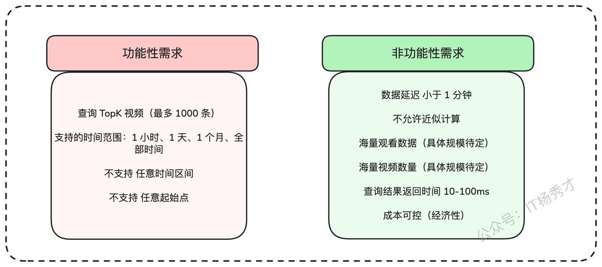

### **1.3 规模估算**

现在，我们来估算两个对设计至关重要的量：每秒的观看次数（TPS/QPS）和系统的总视频数量。前者可以帮助我们理解系统的写入吞吐量，后者则决定了存储空间的量级。

首先来看**吞吐量**：

```shell
# 700亿次日播放 / (约10万秒/天)
70B views/day / (100k seconds/day) = 700k tps
```

70万TPS！这个量级非常巨大，我们从一开始就必须考虑将流量分片到多台机器上处理。接下来估算**存储**。首先要确定视频总量：

```shell
# (每秒上传1小时内容 / 平均每个视频6分钟) * 每天约10万秒 = 每天100万新视频
Videos/Day = 1 hour content/second / (6 minutes content/video) * (100k seconds/day) = 1M videos/day

# 每天100万 * 每年365天 * 假设平台运营10年 = 约36亿视频
Total Videos = 1M videos/day * 365 days/year * 10 years ≈ 3.6B videos
```

基于这个视频总量，我们可以估算一下，如果只是简单地存储每个视频ID和它的计数值，需要多大的空间：

```shell
# 约40亿视频 * (每个ID 8字节 + 每个计数值 8字节) = 64 GB
Naive Storage = 4B videos * (8 bytes/ID + 8 bytes/count) = 64 GB
```

64GB的数据量，如果设计得当，完全可以放在内存中进行处理，特别是当我们采用多机分布式部署时。通过一些数据量的估算，我们就对设计方案的可行性做出判断。比如，哪些架构因此成为可能，哪些又被直接排除，这才是系统设计中最关键的思考。

## **2. 底层设计**

> 梳理完需求之后，我们就可以跟面试官介绍接下来的底层设计了。

### **2.1 核心实体定义**

在这个排行榜系统中，核心的业务实体非常清晰：

1. **视频 (Video)**：被排行统计的主体。

2. **观看 (View)**：用户的观看行为事件。

3. **时间窗口 (Time Window)**：我们统计排行榜的时间范围，如1小时、1天等。

从概念层面看，这个问题非常直接，我们甚至可以跳过这部分，把更多时间留给更有挑战的架构设计部分。

### **2.2 系统接口设计**

API的设计将引导我们后续的讨论。在这个场景下，API也相当基础，我们只需要一个接口来获取Top K视频榜单。

```json
// 发起GET请求，查询指定时间窗口(window)的Top K(k)视频
GET /views/top?window={WINDOW}&k={K}

// 响应体
Response:
{
  "videos": [
    {
      "videoId": "...", // 视频ID
      "views": "..."   // 观看次数
    }
    // ... more videos
  ]
}
```

> 这个部分其实没有过多的点好设计，都是一些常规操作。在面试的时候，也不必跟面试官过多的讨论这个环节。我们可以简单介绍下即可。然后重点跟面试官讨论接下来的上层设计部分

## **3. 上层设计**

> **面试官**：“实体和接口定义清楚了。那么从架构层面看，你会如何着手解决这个问题？”

这个时候常规的设计思路是这样，先设计一个最小可行性系统，满足最基本的功能需求，然后再逐步优化到性能，最终满足我们前面分析的非功能需求。你可以这样回复

> 1. 首先，为最简单的‘全时段总榜’设计一个基础但不可扩展的单机解决方案。
>
> 2. 然后，分析这个基础方案存在的核心问题，并逐步解决它们，比如单点故障和写入扩展性问题。
>
> 3. 接着，在可扩展的架构之上，增加对‘滑动时间窗口’（如1小时、1天）的支持。
>
> 4. 最后，深入探讨剩余的瓶颈，直到时间耗尽。

### **3.1 基础解决方案（单机版）**

我们先从一个简单的、运行在单个服务器上的全时段总榜解决方案开始。我们可以在内存中维护两个核心数据结构：

1. 一个巨大的哈希表（`HashMap`），`Key`是`VideoID`，`Value`是它的观看次数。

2. 一个最小堆（`Min-Heap`），容量为K（比如1000），用来实时维护当前观看次数最多的Top K个视频。

遍历40亿个视频来找出最大值是不可行的，所以维护一个Top-K堆至关重要。绝大多数观看事件都不会触及这个堆，因为它们的计数值会远低于Top 1000的门槛。处理流程如下：

1. 观看事件（View）从数据流（如Kafka）中被消费。

2. 对于每一个`VideoID`，我们以原子方式在哈希表中将其计数值加一。

3. 获取更新后的计数值，并与堆顶元素（即Top K中的最小值）进行比较。

4. 如果新计数值大于堆顶元素，就将堆顶元素移除，并将当前视频ID和新计数值插入堆中，然后调整堆结构。

5. 客户端查询时，直接从这个堆中获取数据。

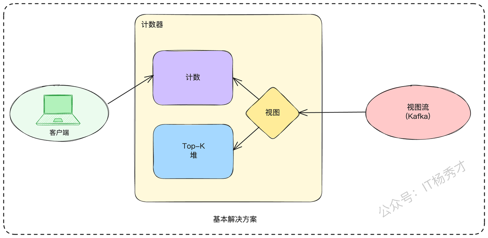

上面这个基础版本的方案在单机上实现非常简单。但它存在两个致命问题：

1. **吞吐量瓶颈**：单机处理能力远低于我们估算的70万TPS。

2. **单点故障**：如果这台主机宕机，整个服务就不可用了，所有内存数据都会丢失

下面我们来逐一分析，看看可以如何优化

### **3.2 解决单点故障问题**

为了让系统可靠，我们需要优雅地处理节点故障。这里主要有以下三种方案

#### **3.2.1 数据库计数**

我们可以将哈希表和堆的状态持久化到数据库中。这样，我们的计算服务就变成了无状态的，如果主机故障，可以简单地启动一个新实例，从数据库加载状态并继续处理。

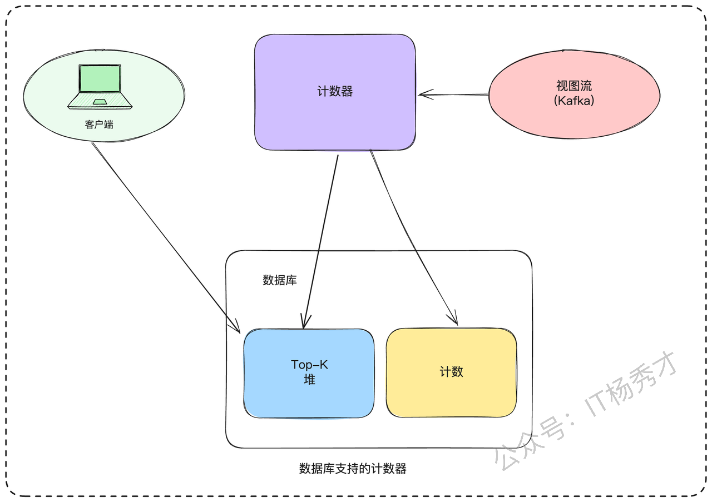

这个方案看似简单，但是仍然没有完全解决问题，只是把问题转移到了数据库。

* **性能瓶含**：每次计数更新都需要至少一次数据库往返，这对于70万TPS的场景是完全不可接受的。

* **并发问题**：更新计数值和更新堆这两个操作，在数据库层面很难做到高效的原子性，很容易出现数据竞争。

* **索引开销**：为了快速找到Top K，我们需要在数据库的40亿条记录上维护一个基于计数值的索引，每次写入都需要更新它，开销巨大。

这个方案因为性能问题，基本可以排除。

#### **3.2.2 **多副本策略****

针对上面的问题，一个简单的思路就是我们可以为计数器服务维护多个副本。每个副本都消费完整的数据流，独立计算和维护自己的哈希表与堆。

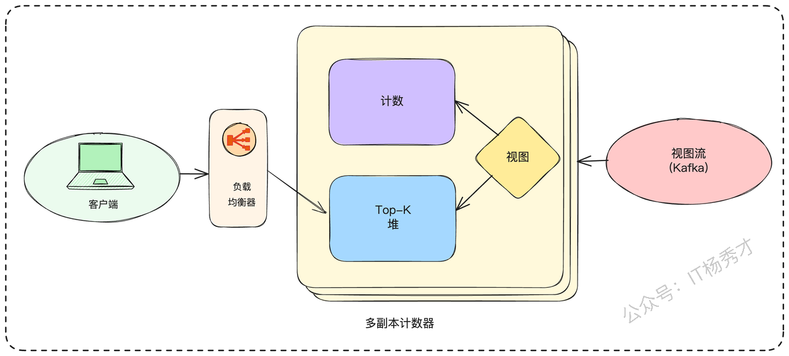

老规矩，在介绍完方案之后，最好对比分析下方案的优缺点，突出思考的全面性

> **优点：**
>
> * **读取可扩展**：客户端可以从任意一个副本读取数据，分担读取压力。
>
> * **高可用**：当一个副本故障时，可以将其从负载均衡器中移除，服务不中断。
>
> **缺点：**
>
> * **资源浪费**：每个副本都处理全量数据，硬件成本成倍增加。
>
> * **恢复困难**：如果一个实例彻底宕机，我们需要启动一个新实例，并让它从数据流的**最开始**进行消费，才能追上进度，这个“追赶”过程可能会非常漫长。

#### **3.2.3 带快照的副本**

这是方案二的优化版。我们依然维护多个副本，但会定期对每个副本的内存状态（哈希表和堆）进行快照，并存储到持久化的对象存储中。

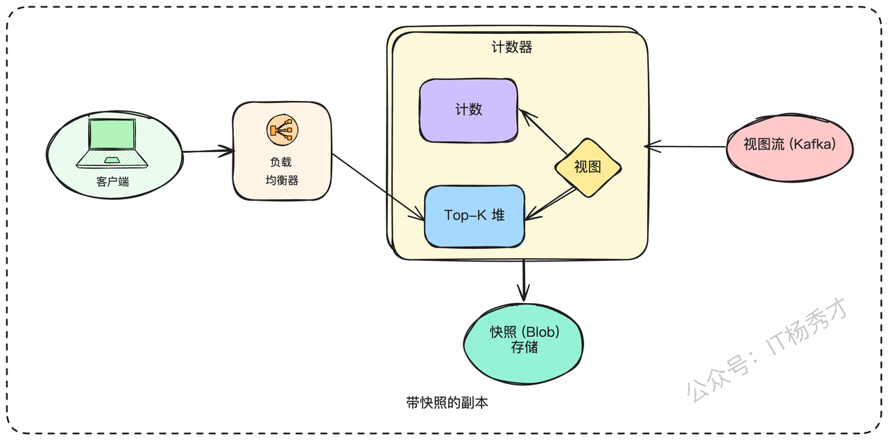

这样的话当一个新实例启动时，它首先从对象存储加载最新的快照到内存，然后从Kafka中该快照对应的时间点开始消费数据流，直到追上实时进度。

虽然快照极大地缩短了恢复时间，但我们依然需要关注“追赶”期间的吞吐量。如果系统处理能力是140万TPS，而实时流入是70万TPS，那么每积压1秒的数据，就需要1秒的时间来恢复。此外，快照本身可能是非常大的文件（数GB），执行快照操作的开销，以及保证快照内部数据的一致性，也是需要考虑的技术细节。

**副本+快照**的机制，已经使我们的系统容错能力大大提升了。接下来，要解决写入吞吐量的问题了。

### **3.3 扩展写入吞吐量**

> **面试官**：“副本解决了高可用的问题，但每个副本依然在处理全量的70万TPS数据，这在单机上还是不现实。写入瓶颈该如何突破？”

写入扩展，其实首选的方案就是**分片或分区**

#### **3.3.1 **按ID固定分区****

最基础的思路是，我们创建P个分片（Shard），每个分片只负责处理一部分视频的数据。我们可以用一个简单的哈希函数，比如 `shard_index = hash(video_id) % P`，来决定一个观看事件应该被路由到哪个分片处理。

这样，每个分片都只处理 `700k / P` 的流量。每个分片内部，还是我们之前设计的“哈希表+堆”的结构，并且也采用“副本+快照”的模式来保证高可用。

但是，现在我们有了P个独立的Top-K堆，客户端该如何获取全局的Top-K呢？我们需要引入一个新的**聚合服务（Top-K Service）**。这个服务负责查询所有P个分片的Top-K堆，然后在内存中进行合并排序，最后返回全局的Top-K结果给客户端。

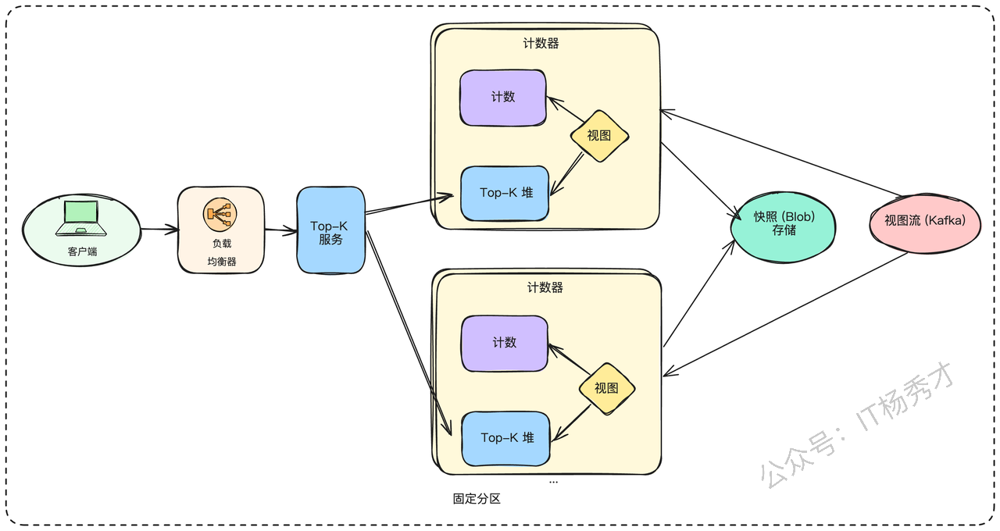

这种方案仍然存在以下两个问题

> * **扩展性受限**：由于分区是固定的（`% P`），如果我们想增加分片的数量（比如从10个增加到20个），就需要进行大规模的数据迁移，非常复杂。
>
> * **聚合开销**：如果P值很大，聚合服务需要进行大量的RPC调用，这本身可能成为瓶颈。

#### **3.3.2 **弹性分区（推荐）****

为了支持动态扩缩容，我们可以使用**一致性哈希**来代替简单的取模运算。每个分片在一致性哈希环上负责一个区段。不同于固定分区参数，我们可以将其设为可变参数以实现弹性扩缩容。当需要增加容量时，新分片会启动并从两个不同的快照（在一致性哈希环中左右相邻）读取数据，过滤出属于自己的那部分数据来完成初始化。

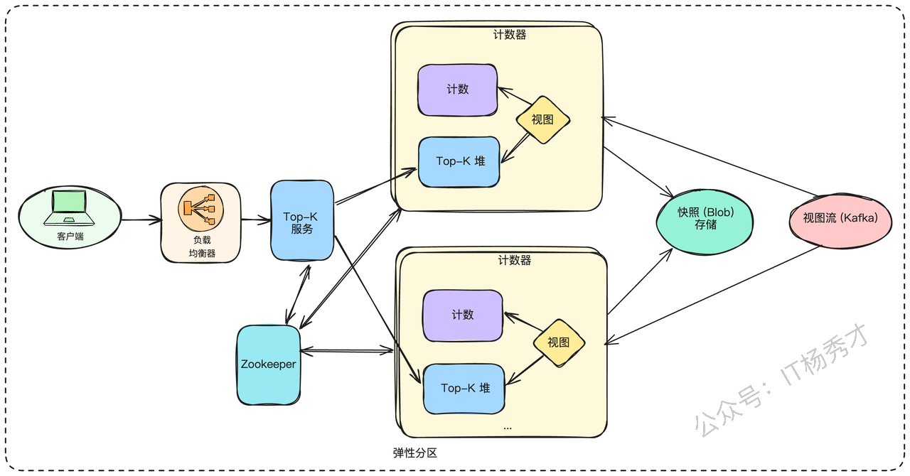

这个方案的问题在于需要一个服务注册与发现中心（比如 ZooKeeper 或 etcd），来维护分片与哈希环的映射关系，以便聚合服务和数据流消费者知道该查询哪些分片。增减分片时也需要相应的协调机制。

到这里，我们其实已经设计出了一个具备容错能力和可扩展性的**全时段总榜**解决方案。但我们还没有满足所有的功能需求。

## **4. 扩展性设计：**

### **4.1 处理时间窗口**

> **面试官**：“OK。现在我们有了一个可扩展的总榜方案。但是最终我们还需要支持最近1小时、1天、1个月的榜单。这种滑动时间窗口的需求，你打算如何实现？”

滑动窗口确实是这类系统里最麻烦的点过。对于全时段总榜，我们只需要不断累加计数。但对于时间窗口，我们还需要在数据过期时，将它的计数减掉。这个问题比较复杂，最佳方案是从一个基础但可能不够完善的方案入手，分析其问题，再逐步优化。

#### **4.1.1 微桶策略**

我们可以为每个视频，维护以分钟为单位的计数桶。比如，一个`Map<[VideoID, MinuteTimestamp], Count>`。

当需要计算最近1小时的榜单时，我们就将这个视频在过去60个分钟桶的计数值相加。然后，我们为每个时间窗口（1小时、1天、1个月）都维护一个独立的Top-K堆。

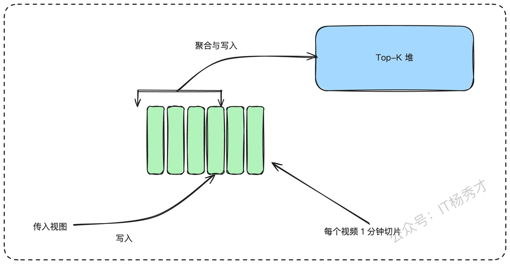

但是仔细思考一下，这个方案显然是行不通的，问题太多：

1. **堆数据陈旧**：一个视频可能在上个小时是Top K，但这个小时没有任何观看了。它会一直占据着堆的位置，除非有新的、计数值更高的视频把它挤出去。

2. **计算成本高昂**：为了计算一个视频一个月的观看量，我们需要累加 `30 * 24 * 60 = 43200` 个分钟桶的数据，开销巨大。

3. **内存爆炸**：为每个视频存储过去一个月的所有分钟桶，内存消耗会急剧膨胀。

#### **4.1.2 刷新堆数据**

我们可以尝试修正上面微桶方案的缺陷。

* **解决堆数据陈旧**：我们可以在查询前，先刷新堆里的数据。遍历堆里的K个元素，重新计算它们在当前时间窗口内的准确计数值，并根据新值调整堆。这个方案非常笨重，读取性能会很差。

* **解决计算成本**：我们可以维护多种时间粒度的数据。除了分钟桶，我们再额外存储小时桶、天桶。当计算月榜时，我们就可以用天桶来聚合，大大减少需要累加的数据量。

* **解决内存膨胀**：我们可以定期清理掉那些非常古老的数据（比如超过1个月的分钟桶）

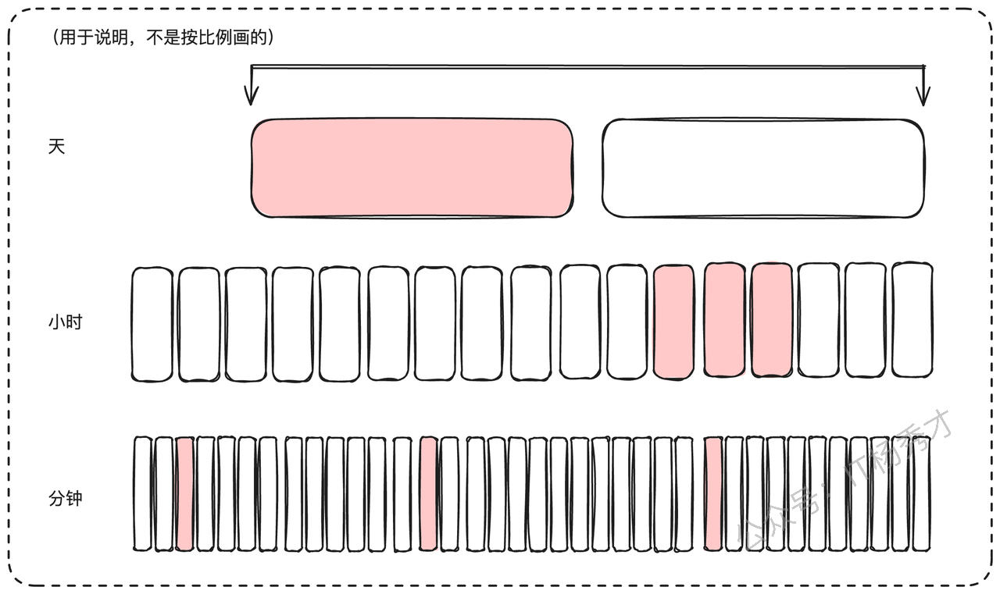

但是这样一来，这个优化方案变得异常复杂。虽然我们引入了多层数据聚合，但在读取时可能仍需重建其大部分内容，并且仍然需维持整月内每分钟的粒度，并不是一个较优的方案。

#### **4.1.3 双指针法（推荐）**

> **面试官**：“你说的这个方法确实可以一定程度解决堆数据陈旧问题，但是过于复杂了。有没有更简洁、更贴合我们需求的方案？”

既然我们的数据源是像Kafka这样可以持久化、并支持从任意偏移量（Offset）消费的流，我们可以巧妙地利用这个特性。我们可以为每个时间窗口（1小时、1天、1个月）都维护独立的计数值哈希表和Top-K堆。对于每一个时间窗口，我们都启动两组消费者（或者说两个指针）：

1. **上升沿指针（Leading Edge）**：消费**实时**的数据流。每消费一条观看记录，就将对应视频在**所有**时间窗口（1小时、1天、1个月、总榜）的计数值**加一**。

2. **下降沿指针（Trailing Edge）**：对于“1小时”榜，这个指针消费的是**1小时前**的数据流；对于“1天”榜，它消费的是**1天前**的数据流，以此类推。每消费一条记录，就将对应视频在**相应**时间窗口的计数值**减一**。

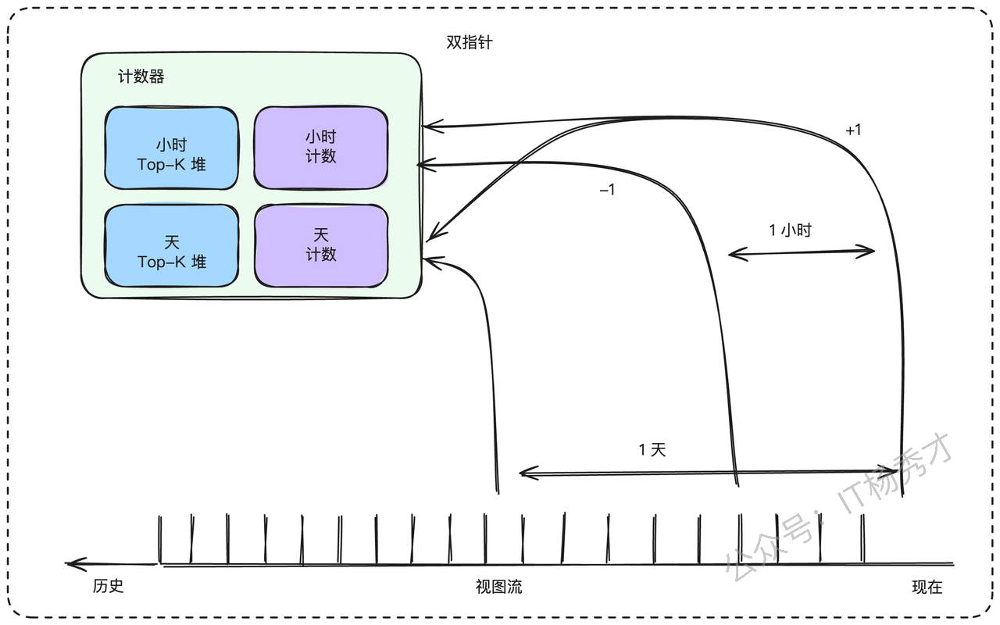

通过这种一加一的方式，每个时间窗口的计数值哈希表里，永远都精确地存储着该窗口内的总观看次数。Top-K堆的数据也永远不会陈旧。假设有如下观看序列：

> * `00:05`: 视频A被观看
>
> * `00:20`: 视频B被观看
>
> * `00:40`: 视频B再次被观看

我们来看1小时榜的计数值变化：

> * `00:05`，`{A:1}`。（上升沿处理）
>
> * `00:20`，`{A:1, B:1}`。（上升沿处理）
>
> * `00:40`，`{A:1, B:2}`。（上升沿处理）
>
> * `01:05`，此时，**下降沿指针**正好消费到`00:05`那条A的观看记录，于是它执行减一操作。计数值变为`{A:0, B:2}`，即`{B:2}`。
>
> * `01:20`，下降沿指针消费到`00:20`那条B的记录，计数值变为`{B:1}`。
>
> * `01:40`，下降沿指针消费到`00:40`那条B的记录，计数值变为`{B:0}`，即`{}`（空）。

这个过程完美地维护了滑动窗口内的精确计数。存在的问题主要有以下几点

* **存储成本**：这个方案要求我们在Kafka中至少保留1个月的数据。这会显著增加Kafka集群的存储成本。

* **消费负载**：我们的总消费负载增加了（1个上升沿 + 3个下降沿 = 4倍读取）。

* **堆容量**：由于视频计数值有增有减，一个视频可能会频繁地进入和离开Top-K。为了防止频繁的堆调整，我们需要将堆的实际容量设置得比K更大一些（比如2K），查询时只返回前K个。

虽然这种方案也存在一些问题，但是综合考量，其仍然是一个可行性较高的方案

### **4.2 海量读请求处理**

目前我们主要讨论了如何处理大量浏览/写入操作，但读取操作呢？考虑到从浏览发生到统计完成有 1 分钟间隔，最自然的解决方案是添加缓存。我们可以为缓存设置 1 分钟的 TTL（生存时间），确保结果永远不会比我们的要求更陈旧。当请求到达时，我们可以直接从缓存中提供服务，或者查询该请求对应堆的所有计数器，然后将合并后的值重新存储到缓存中。

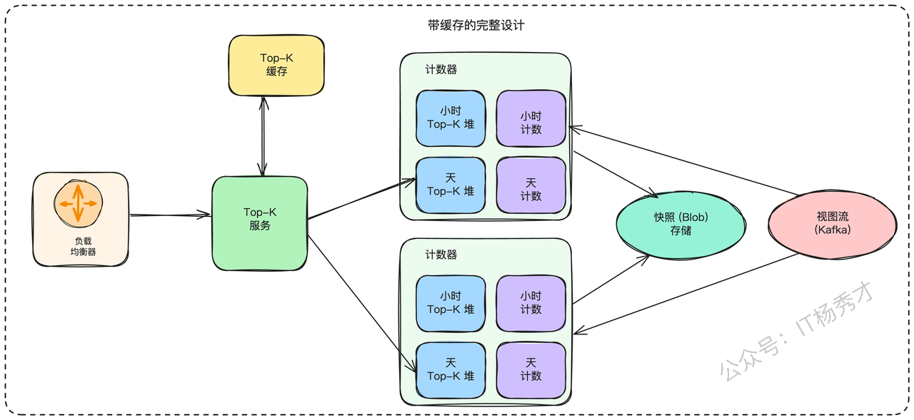

## **5. 小结**

回顾我们的整个设计方案，从最初直观的单机方案，到多副本快照解决容灾，再到分片架构支撑高吞吐，最后利用双指针法精确维护滑动时间窗口，并且加上缓存层来优化读取性能。可以看到，一个看似播放量排序的小问题，放到亿级视频量这样的的场景下，要设计出一个可行性方法，需要**数据结构、分布式扩展、流式处理、缓存机制和系统容错**等多方面的综合考量。它不仅是对技术细节的考察，更是对架构思维和权衡能力的全面检验。

### **资料分享**

随着AI发展越来越快，AI编程能力越来越强大，现在很多基础的写接口，编码工作AI都能很好地完成了。并且现在的面试八股问题也在逐渐弱化，**面试更多的是查考候选人是不是具备一定的知识体系，有一定的架构设计能力，能解决一些场景问题**。所以，不管是校招还是社招，这都要求我们一定要具备架构能力了，不能再当一个纯八股选手或者是只会写接口的初级码农了。这里，秀才为大家精选了一些架构学习资料，学完后从实战，到面试再到晋升，都能很好的应付。**关注秀才公众号：IT杨秀才，回复：111，即可免费领取哦**


<div style="background-color: #f0f9eb; padding: 10px 15px; border-radius: 4px; border-left: 5px solid #67c23a; margin: 20px 0; color:rgb(64, 147, 255);">

### <span style="color: #006400;">**学习交流**</span>
<span style="color:rgb(4, 4, 4);">
> 如果您觉得文章有帮助，可以关注下秀才的<strong style="color: red;">公众号：IT杨秀才</strong>，后续更多优质的文章都会在公众号第一时间发布，不一定会及时同步到网站。点个关注👇，优质内容不错过
</span>


</div>
