

<h2><strong>关注秀才公众号：</strong><strong>IT杨秀才</strong><strong>，回复：</strong><strong>面试</strong></h2>

<strong>领取后端/AI面试题库PDF</strong>

 

## **1. 分布式理论**

### **1.1 什么是分布式系统？**

**知识点分析：**

> 分布式系统的核心思想是"化整为零"——当单台机器扛不住业务压力时，把任务分散到多台机器上协同完成。理解它要抓住三个关键词：**多节点**（不止一台机器）、**网络协同**（通过网络通信配合）、**对外透明**（用户感知不到背后有多台机器）。
>
> 引入分布式的根本动力有两个：一是**高并发高性能**，单机CPU和内存有天花板，必须水平扩展；二是**高可用**，单机宕机就全崩，多节点可以互相兜底。但代价是引入了网络不可靠带来的**数据一致性**问题，这也是分布式领域最核心的挑战。

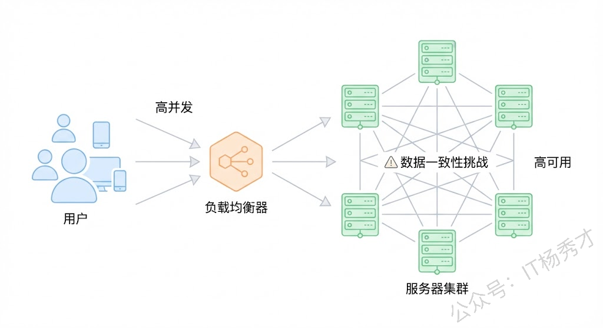

**参考回答：**

分布式系统简单来说就是把多台独立的计算机通过网络连接起来，让它们协同工作完成同一个任务，对用户来说感觉就像在使用一台机器。我们之所以要用分布式，主要两个原因：第一是为了**高并发和高性能**，单机的CPU和内存总有天花板，像双十一这种流量必须分散到多台机器上；第二是为了**高可用**，单机一旦宕机整个服务就挂了，而分布式系统里部分节点挂掉不影响整体。当然，分布式也不是没有代价，最大的挑战就是**数据一致性问题**——因为节点之间通过网络通信，而网络是不可靠的，可能出现一个节点写成功了另一个没收到的情况，所以才会有分布式事务、分布式锁、CAP定理这些技术来解决这些问题。

***

### **1.2 分布式和微服务有什么区别？**

**知识点分析：**

> &#x20;这道题考的是对两个概念的本质理解，很多人容易混淆。核心区别在于看问题的视角不同：
>
> **分布式是物理部署层面的概念**，关注的是"多台机器怎么协同干活"，解决的是单机性能不够的问题；
>
> **微服务是软件架构层面的概念**，关注的是"一个大系统怎么按业务边界拆小"，解决的是代码耦合维护困难的问题。一个常见误区是：把单体应用部署10份做集群，这是分布式但不是微服务；反过来，微服务拆分后的几十个服务天然需要分布式部署。两者是不同维度的东西，但微服务架构天然依赖分布式部署方式。

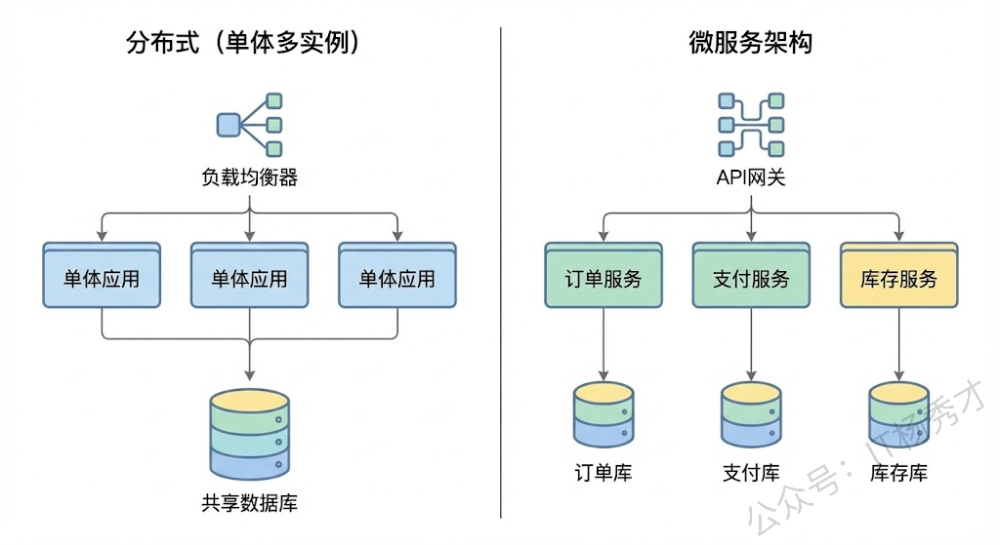

**参考回答：**

一句话概括就是：**分布式是"物理部署方式"，微服务是"软件架构设计思想"**。分布式从物理层面出发，解决的是单台机器扛不住的问题，只要多台机器通过网络协同工作就是分布式。微服务从软件工程层面出发，解决的是代码堆在一起维护困难的问题，把一个大单体按业务边界拆成订单服务、支付服务、库存服务这样的独立小服务。这里有个常见误区：把一个单体项目复制10份部署在10台机器上做集群，这是分布式，但绝对不是微服务，因为内部还是一个大单体。反过来，一旦拆成了几十个微服务，一台机器肯定跑不了，所以**微服务天然需要分布式来部署**。总结下来，分布式的核心是"机器的拆分和协同"，微服务的核心是"业务逻辑的拆分"，微服务其实就是分布式发展到一定阶段后的一种具体架构风格。

***

### **1.3 介绍一下 CAP 理论？**

**知识点分析：**

> &#x20;CAP是分布式系统的基础定理，面试必考。它说的是分布式系统中，**一致性（Consistency）**、**可用性（Availability）**、**分区容错性（Partition tolerance）** 三者不可兼得，最多只能同时满足两个。理解的关键在于：网络分区（P）在分布式环境中是无法避免的（网络总会出问题），所以P必须保证，实际选择只能在C和A之间做取舍。选CP就是宁可暂时不可用也要保证数据一致（比如ZooKeeper）；选AP就是宁可数据短暂不一致也要保证服务可用（比如Eureka）。

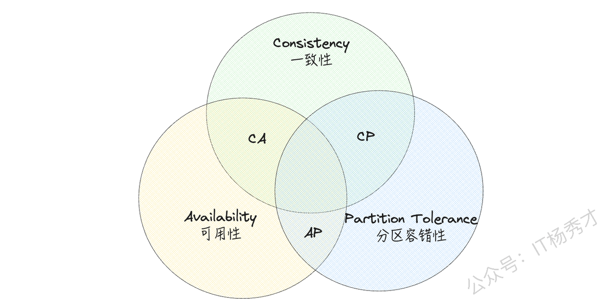

**参考回答：**

CAP定理说的是在分布式系统中，**一致性、可用性、分区容错性**三者不可兼得。一致性是指所有节点在同一时刻看到的数据是一样的；可用性是指集群部分节点故障后仍然能响应请求；分区容错性是指系统在出现网络分区（节点之间通信中断）时仍能继续运作。因为在分布式环境中网络分区是不可避免的，所以P是必须保证的，实际上我们只能在C和A之间做选择。选CP的典型代表是ZooKeeper，它宁可暂时拒绝服务也要保证数据一致；选AP的典型代表是Eureka，它宁可返回旧数据也要保证服务可用。在实际业务中，大多数互联网系统选的是AP，然后通过BASE理论的最终一致性来弥补一致性的妥协。

***

### **1.4 怎么理解 BASE 理论？**

**知识点分析：**

> &#x20;BASE理论是对CAP中AP方案的进一步阐释，是互联网高并发架构的核心设计哲学。它的核心思想就一句话：**既然强一致性代价太大，那就退而求其次，允许短暂不一致，只要最终数据对齐就行**。BASE是三个概念的缩写：Basically Available（基本可用）——系统遇到故障允许降级，比如双十一非核心功能暂停；Soft State（软状态）——允许数据存在中间过渡状态，比如转账中的"处理中"状态；Eventually Consistent（最终一致性）——经过一段时间后所有节点数据最终一致，比如银行转账"2小时内到账"。

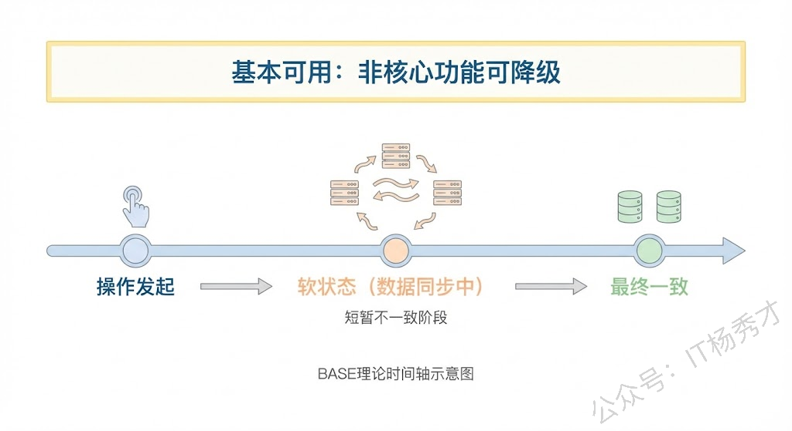

**参考回答：**

BASE理论其实就是对强一致性的一种**降级妥协**，是分布式系统中非常务实的架构指导思想。我们知道CAP定理里，为了保证高可用往往很难做到强一致性，而BASE理论就是说：没关系，允许短暂的不一致，只要最终结果是对的就行。它包含三层含义：第一是**基本可用**，系统遇到故障时允许损失部分非核心功能来保住核心业务，比如双十一大促时把查看历史评价这类功能暂时停掉，但下单付款不受影响；第二是**软状态**，允许数据存在中间过渡态，比如跨行转账时的"处理中"状态，钱扣了对方还没收到，这就是一种软状态；第三是**最终一致性**，这是整个理论的灵魂，经过一段时间的同步和重试，所有节点的数据最终一定会一致，就像那笔转账最终一定会到账。实际开发中，除了涉及金钱的核心场景需要死磕强一致性，绝大部分互联网高并发架构用的都是BASE理论——牺牲短暂一致性，换取高可用和高性能。

***

## **2. 分布式锁**

### **2.1 用 Redis 怎么实现分布式锁？**

**知识点分析：**

> &#x20;Redis分布式锁的核心原理是利用Redis的`SET key value NX PX`命令。NX保证只有key不存在时才能设置成功（互斥加锁），PX设置过期时间（防止死锁），value存唯一标识（防止误删别人的锁）。解锁时需要先判断value是否是自己的再删除，这两步必须用Lua脚本保证原子性。这三个要素缺一不可：没有NX就不互斥，没有过期时间可能死锁，没有唯一标识可能误释放。

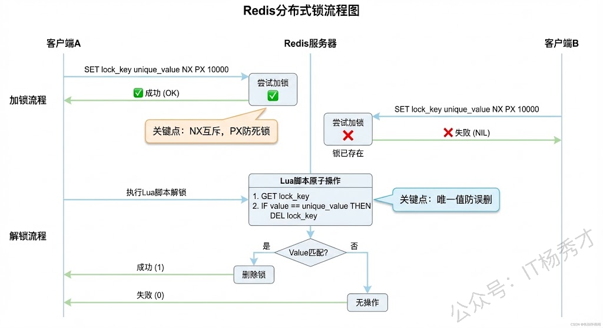

**参考回答：**

Redis实现分布式锁主要是利用`SET key value NX PX`这个命令。加锁的时候，`NX`参数保证只有key不存在时才能设置成功，相当于只有第一个请求能拿到锁；`PX`设置过期时间，防止客户端拿到锁后挂掉导致锁永远不释放；value设置为客户端的唯一标识，是为了释放锁时能区分是不是自己加的锁。解锁的时候不能直接`DEL key`，需要先判断key的value是不是自己设置的那个，是的话才删除，这两步必须用Lua脚本来保证原子性，因为Redis执行Lua脚本是原子的。如果不用Lua脚本，在判断和删除之间可能有其他客户端加了新锁，直接删就把别人的锁删了。

***

### **2.2 Redis 分布式锁需要满足哪些条件？**

**知识点分析：**&#x20;

> 这道题考的是对分布式锁核心要求的理解。一个合格的分布式锁需要满足：互斥性（同一时刻只有一个客户端持有锁）、不能死锁（持有锁的客户端崩溃后锁要能自动释放）、加锁解锁必须是同一客户端（不能误释放别人的锁）。这三个条件分别对应了SET NX、过期时间、唯一值这三个设计要素。

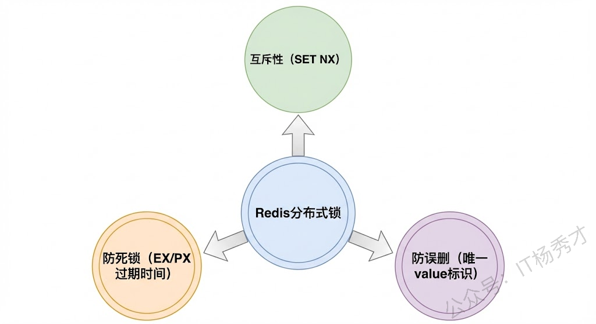

**参考回答：**

Redis分布式锁需要满足三个核心条件。第一是**互斥性**，同一时刻只能有一个客户端拿到锁，这通过SET命令的NX参数实现，key不存在才能设置成功。第二是**不能死锁**，如果持有锁的客户端宕机了，锁必须能自动释放，所以加锁时要通过EX或PX设置过期时间。第三是**加锁和解锁必须是同一个客户端**，不能出现A加的锁被B释放的情况，所以value要设置成每个客户端唯一的标识，释放锁时先比较value再删除。

***

### **2.3 Redis 分布式锁为什么需要唯一值？**

**知识点分析：**

> &#x20;这道题考的是对"误释放"场景的理解。设想这个场景：客户端A加锁后开始处理业务，但处理时间超过了锁的过期时间，锁自动过期了。此时客户端B成功加锁开始处理，但A业务处理完后执行了释放锁操作——如果没有唯一值校验，A就会把B的锁给删掉，导致锁失效。所以每个客户端必须用唯一值标识自己，释放时只删自己的锁。

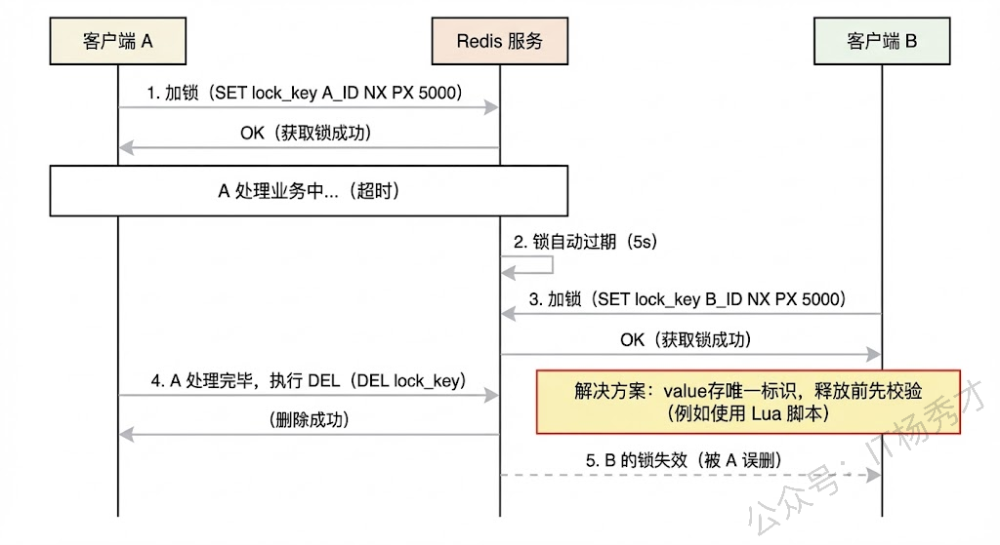

**参考回答：**

设想一个场景：客户端A拿到锁后开始处理业务，但业务处理时间比较长，超过了锁的过期时间，锁就自动过期释放了。这时候客户端B过来加锁成功，正在处理自己的业务。然后A处理完了去释放锁，如果直接DEL key，就把B的锁给删了，这样就出现了严重的并发问题。所以必须在value里存一个每个客户端唯一的标识（比如UUID），释放锁的时候先GET出来比对一下是不是自己的，是自己的才删除，这样就不会误删别人的锁了。

***

### **2.4 Redis 分布式锁为什么要设置过期时间？**

**知识点分析：**

> &#x20;过期时间解决的是"死锁"问题。如果不设置过期时间，客户端加锁后因为宕机、网络断开等原因没有执行释放锁的操作，这把锁就会永远存在Redis中，其他客户端永远拿不到锁，业务就卡死了。设置过期时间相当于给锁加了一个"兜底机制"。

**参考回答：**

设置过期时间主要是为了防止死锁。如果客户端拿到锁之后突然宕机了或者发生了异常，没来得及执行释放锁的操作，那这把锁就会一直存在Redis里，其他所有客户端都拿不到锁，业务就彻底卡死了。所以在加锁时通过PX或者EX设置一个过期时间，即使持有锁的客户端出了问题，锁到期后也会自动释放，相当于一个兜底的安全机制。

***

### **2.5 Redis 分布式锁如何保证解锁的原子性？**

**知识点分析：**

> &#x20;释放锁需要两步操作：先GET判断value是不是自己的，是的话再DEL删除。如果这两步不是原子的，中间可能发生锁过期、其他客户端加锁等情况，导致误删。Redis的Lua脚本在执行期间不会被其他命令插入，天然保证原子性，所以用Lua脚本把判断和删除封装在一起就解决了这个问题。

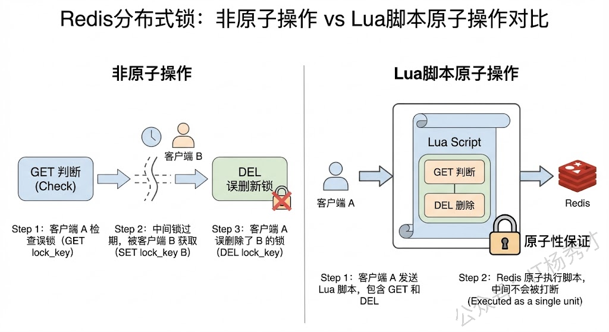

**参考回答：**

释放锁需要先判断value是不是自己的，再执行删除，这是两步操作。如果分开执行，可能出现这种情况：我GET到value确认是自己的，正准备DEL，这时候锁恰好过期了，另一个客户端加了新锁，然后我的DEL就把新锁删掉了。所以必须用**Lua脚本**把判断和删除封装成一个原子操作。Redis执行Lua脚本时是单线程串行执行的，中间不会被其他命令插入，这样就保证了解锁的原子性。具体Lua脚本就是：先`GET`比对value，相等就`DEL`，不等就返回0。

***

### **2.6 还有没有其他方法实现分布式锁，ZooKeeper实现分布式锁了解吗？**

**知识点分析：**

> &#x20;除了Redis，业界常用的还有ZooKeeper实现分布式锁。ZK利用**临时顺序节点**和**Watcher监听机制**两大特性实现。每个客户端在指定路径下创建临时顺序节点，序号最小的获得锁；释放锁时删除节点（或客户端断开连接节点自动删除），后一个节点收到Watcher通知后尝试获取锁。ZK的分布式锁是强一致性的（ZAB协议天然满足CP），但性能不如Redis。选择上，Redis适合高并发场景，ZK适合对一致性要求高的场景。

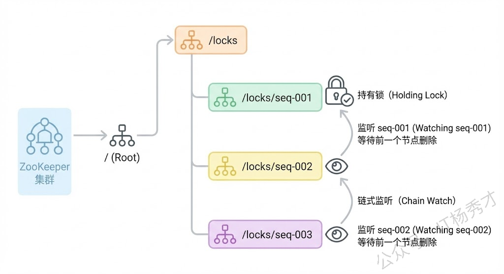

**参考回答：**

了解的，还可以用**ZooKeeper**来实现分布式锁。ZK有两个特性非常适合做这件事：临时顺序节点和Watcher监听机制。具体流程是这样的：首先有一个持久节点`/locks`作为锁的根路径，每个请求进来时在这个路径下创建一个临时顺序节点，比如`seq-001`、`seq-002`。然后判断自己创建的节点是不是序号最小的，如果是就获得锁；如果不是就设置Watcher监听前一个节点。拿到锁处理完业务后删除自己的节点，后一个节点收到通知就能获取锁了。ZK因为底层ZAB协议天然满足CP，所以它的分布式锁是**强一致性**的，但性能比Redis差一些。实际选型的话，如果项目已经在用Redis而且对一致性要求不是特别极端，用Redis就够了；如果业务场景不能容忍任何锁丢失的情况，就用ZooKeeper。

***

## **3. 分布式 ID**

### **3.1 什么情况需要用分布式 ID？**

**知识点分析：**

> 分布式ID解决的核心问题是"在多节点、多数据库环境下生成全局唯一且有序的标识"。单体架构用数据库自增主键就够了，但一旦涉及**分库分表**（各子表自增ID会冲突）、**微服务多节点并发写入**（UUID无序导致B+树页分裂性能极差）、**多系统数据合并**（各系统自增ID重叠），就必须引入分布式ID方案。

**参考回答：**

需要用分布式ID的场景主要有三种。

第一种也是最刚需的就是**分库分表**，一旦把一张表拆成多张，各子表的自增主键就不能用了，因为表A的ID可能是1、2、3，表B也是1、2、3，ID就冲突了，必须有一个独立的全局发号器来保证唯一。

第二种是**微服务高并发写入场景**，你可能会想用UUID，它确实全局唯一，但UUID是无序的长字符串，拿来做MySQL主键会导致B+树索引频繁页分裂，写入性能非常差，所以需要一种既唯一又趋势递增的ID方案。

第三种是**多系统数据合并**，比如公司收购了竞品要合并数据，如果各自用的都是自增ID，合在一起必然大量冲突。所以凡是涉及到分库分表、多节点高并发写入、或者未来可能合并数据的核心业务表，都应该用分布式ID。

***

### **3.2 分布式 ID 有哪些生成方案？**

**知识点分析：**

> &#x20;业界主流的分布式ID方案有四种，各有适用场景：
>
> **UUID**——本地生成全球唯一，但无序且长，不适合做MySQL主键；
>
> **数据库号段模式**——批量从数据库获取ID缓存在本地，兼顾有序和性能（美团Leaf）；
>
> **Redis INCR**——利用Redis原子自增生成纯数字递增ID，但重度依赖Redis；
>
> **雪花算法**——本地纯计算生成64位ID，由时间戳+机器号+序列号组成，高性能且趋势递增，是高并发场景首选，但存在时钟回拨问题。

**参考回答：**

主流的分布式ID方案有四种。

**UUID**最简单，本地一行代码就能生成，全球唯一，但它是32位的无序字符串，做MySQL主键会导致B+树页分裂，性能极差，只适合日志追踪这种非核心场景。

**数据库号段模式**是一次从数据库批量获取一段ID（比如一次拿1000个），缓存在本地内存里慢慢分配，用完再去取下一批，性能比每次查库好很多，美团的Leaf就有这种模式，适合大部分普通公司。

**Redis INCR**是利用Redis的原子自增操作生成纯数字递增ID，速度快，但重度依赖Redis的高可用和持久化，运维成本不低。

**雪花算法**是目前高并发场景最主流的方案，它在本地纯计算生成一个64位的长整型ID，由时间戳、机器标识和自增序列号拼接而成。因为时间戳在高位所以天然趋势递增，机器标识保证不同节点不会碰撞，性能极高且不依赖任何外部服务。不过它有个软肋就是时钟回拨，如果机器时间被往回调了可能生成重复ID，实际中需要做时间校验来防范。选型的话，追求稳定低成本用号段模式，追求极致性能用雪花算法。

***

### **3.3 UUID 作为分布式 ID 的优缺点是什么？**

**知识点分析：**

> &#x20;UUID是最简单的分布式ID方案，核心优点是本地生成不依赖任何外部服务，且保证全球唯一。但在MySQL场景下缺点非常致命：一是无序导致B+树索引频繁页分裂影响写入性能，二是32位字符串存储空间大，三是没有业务含义无法从ID中提取时间等信息。

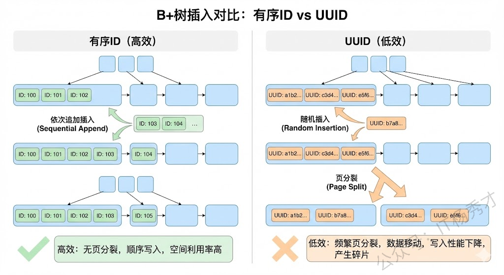

**参考回答：**

UUID的优点很明显：本地一行代码就能生成，不需要依赖数据库也不需要Redis，完全没有网络开销，而且全球唯一不会碰撞。但缺点在MySQL场景下非常致命，主要两点：

第一是**无序**，MySQL的InnoDB引擎用B+树组织数据，最喜欢递增的主键，这样数据可以顺序追加到末尾，效率很高。UUID是完全随机的，每次插入都可能插到B+树中间去，会频繁触发页分裂，写入性能大打折扣。

第二是**占用空间大**，UUID是36位的字符串，比一个8字节的long类型大好几倍，索引占的空间也更大。所以UUID只适合用在日志跟踪、请求追踪这类非核心场景，核心业务表的主键基本不会用它。

***

### **3.4 数据库号段模式是什么？**

**知识点分析：**

> &#x20;号段模式的核心思想是"批发而不是零售"。不是每次需要ID都去查数据库，而是一次从数据库取一批（比如1000个）ID缓存在本地，本地发完了再去数据库取下一批。这样大幅减少了数据库访问次数，即使数据库短暂宕机，本地还有库存可以顶一会儿。美团的Leaf框架就采用了这种模式，并做了双Buffer优化。

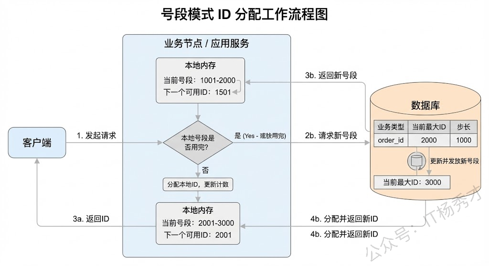

**参考回答：**

数据库号段模式的思路很好理解，就像去批发市场进货一样。业务节点不是每次需要一个ID就去数据库查一次，而是一次性从数据库申请一个号段，比如1000个ID（从1001到2000），拿到本地内存里缓存起来慢慢分配。等这1000个快发完了，再回数据库申请下一个号段。这样做最大的好处是大幅减少了数据库的访问压力，而且就算数据库短暂宕机，本地还有剩余的ID库存可以继续支撑业务。美团开源的Leaf框架就实现了这种模式，还做了双Buffer优化——当前号段快用完时提前异步加载下一个号段，做到无缝切换。这个方案适合大部分公司，实现简单、稳定可靠、ID有序。

***

### **3.5 Redis 生成分布式 ID 的原理是什么？**

**知识点分析：**

> &#x20;Redis生成分布式ID利用的是`INCR`命令的原子性。Redis是单线程执行命令的，INCR操作天然不会有并发冲突，每次调用都返回一个递增的数字。优点是全内存操作速度快、生成的ID纯数字且绝对递增。缺点是强依赖Redis的可用性和持久化，如果Redis宕机重启后数据丢失，可能生成重复ID。

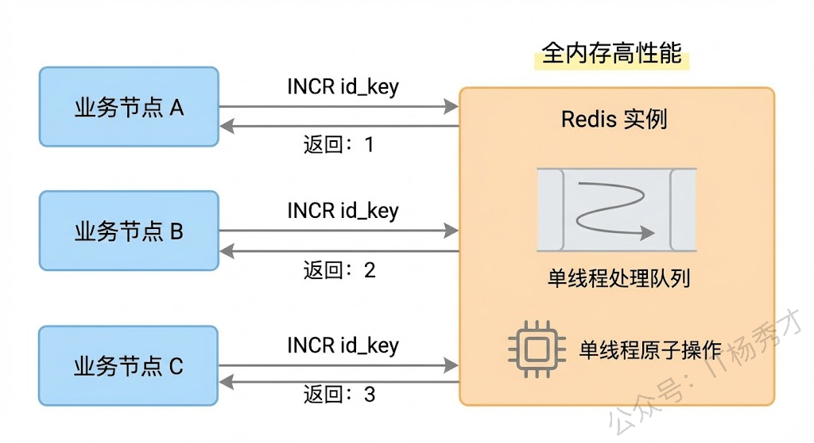

**参考回答：**

原理很简单，就是利用Redis的`INCR`命令做原子自增。Redis本身是单线程执行命令的，所以INCR操作天然不存在并发冲突，每次调用都会返回一个比上一次大1的数字，保证全局唯一且严格递增。优点是全内存操作，速度远比数据库快，生成的ID也是纯数字递增的，对MySQL很友好。但缺点也明显，就是**强依赖Redis**——如果Redis集群出了问题，ID就生成不了了；而且如果Redis使用的是RDB持久化策略，宕机重启后可能会丢失最近的自增值，导致生成重复ID，所以需要做好持久化配置和高可用保障。

***

### **3.6 什么是雪花算法（Snowflake）？**

**知识点分析：**

> &#x20;雪花算法是Twitter开源的分布式ID生成算法，核心思想是把一个64位的long型ID拆成几段：1位符号位（固定0）+ 41位时间戳（毫秒级，可用约69年）+ 10位机器标识（支持1024个节点）+ 12位序列号（每毫秒内支持4096个ID）。时间戳在高位保证趋势递增，机器标识保证不同节点不碰撞，序列号保证同一毫秒内不重复。最大的优势是完全本地计算，不依赖任何外部服务，性能极高。主要风险是时钟回拨问题。

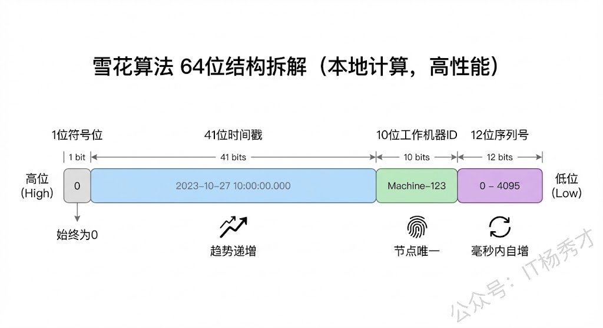

**参考回答：**

雪花算法是Twitter开源的一种分布式ID生成算法，它的巧妙之处在于完全在本地纯计算生成ID，不需要依赖任何外部服务。具体来说，它把一个64位的长整型数字拆成了几段来拼接：最高1位是符号位固定为0，接着41位是毫秒级时间戳，然后10位是机器标识（可以拆成数据中心ID和机器ID），最后12位是毫秒内的自增序列号。这样设计的精妙之处在于：时间戳在高位保证了ID随时间推移是趋势递增的，完美适配MySQL的B+树索引；机器标识保证了不同节点各自生成不会碰撞；序列号保证了同一毫秒内同一节点也不会重复，每毫秒可以生成4096个ID。不过雪花算法有个公认的软肋就是**时钟回拨**问题——因为严重依赖机器当前时间，如果操作系统的时间被往回调了，就可能生成跟之前重复的ID，实际使用中需要加入时间校验逻辑来防范。

***

## **4. 分布式事务**

### **4.1 什么情况下需要使用分布式事务？**

**知识点分析：**

> &#x20;分布式事务解决的是"跨多个数据库或服务的操作，需要保证要么全部成功要么全部回滚"的问题。两种典型场景：一是**微服务跨服务调用**（订单服务、库存服务、账户服务各有独立数据库，需要保证三个操作的一致性）；二是**分库分表后跨库操作**（同一个方法操作两个物理数据库，本地事务管不了两条连接）。但分布式事务代价很高，实际中能用最终一致性方案就尽量不用强一致性方案。

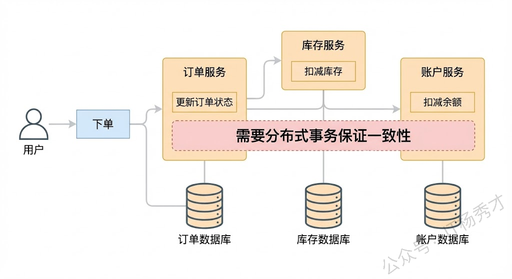

**参考回答：**

主要两种场景。

第一种是**微服务架构下的跨服务协同**，比如电商下单，订单服务更新订单状态、库存服务扣减库存、账户服务扣减余额，三个操作分布在三个独立的服务和三个独立的数据库里。如果库存扣成功了但扣款时账户服务宕机了，传统的本地事务根本管不到其他服务的数据库，就会导致数据不一致。

第二种是**分库分表后的跨库操作**，即使没做微服务，只要底层数据库拆了库，一个方法里同时操作两个库就走了两条数据库连接，Spring的本地事务无法同时管理，也会出问题。不过我要补充一点，分布式事务在实际中代价是很高的，强一致性方案比如2PC会让数据库互相等锁、严重拖慢性能。

所以业界的做法通常是**能用最终一致性就不用强一致性**，比如通过消息队列加本地消息表实现最终一致，只有银行转账这种涉及资金的场景才咬牙上强一致方案。

***

### **4.2 分布式事务的解决方案有哪些？**

**知识点分析：**

> &#x20;分布式事务方案按一致性强度可以分为两类：**强一致性方案**（2PC、3PC）和**最终一致性方案**（TCC、Saga、可靠消息、本地消息表）。2PC通过协调者两阶段协调所有参与者，简单但有单点故障和锁等待问题；3PC在2PC基础上加了询问阶段和超时机制减少阻塞；TCC把业务拆成Try/Confirm/Cancel三步，性能高但开发成本大；Saga将长事务拆成多个短事务加补偿；消息队列方案通过MQ异步解耦实现最终一致；本地消息表用本地事务保证消息和业务的一致性。实际中最常用的是TCC（高并发业务）和消息队列方案（事件驱动架构）。

**参考回答：**

分布式事务的解决方案主要有六种，按一致性强弱可以分两大类。

强一致性方案有**2PC（两阶段提交）和3PC（三阶段提交）**。2PC由协调者统一控制，先让所有参与者准备，全部准备好了再一起提交，否则全部回滚，实现简单但协调者是单点，而且准备阶段要锁资源，性能很低。3PC在2PC基础上多加了一个询问阶段并引入了超时机制，减少了参与者的阻塞时间，但极端网络情况下仍可能不一致。

最终一致性方案有**TCC**、**Saga**、**可靠消息**和**本地消息表**。TCC把业务拆成Try预留资源、Confirm确认、Cancel回滚三步，性能高但每个服务都要写三个方法，开发成本大，适合支付库存这种高并发场景。Saga把长事务拆成多个短事务，每个短事务有对应的补偿操作，失败了反向补偿回滚，适合流程长的业务。可靠消息方案通过消息队列异步通知下游，解耦度高，需要处理消息幂等。本地消息表是把消息和业务写在同一个本地事务里，后台轮询发MQ，简单可靠。实际中电商金融高并发场景多用TCC，事件驱动的异步场景用消息队列方案。

***

### **4.3 两阶段提交（2PC）是什么？**

**知识点分析：**

> &#x20;2PC是最经典的分布式事务协议，角色有**协调者**和**参与者**。第一阶段（准备）：协调者向所有参与者发送准备请求，参与者执行事务但不提交，向协调者反馈yes/no。第二阶段（提交/回滚）：如果所有参与者都回复yes，协调者发送提交指令；只要有一个no就发送回滚指令。问题：协调者单点故障、准备阶段资源锁定时间长导致性能差、网络异常时可能数据不一致。

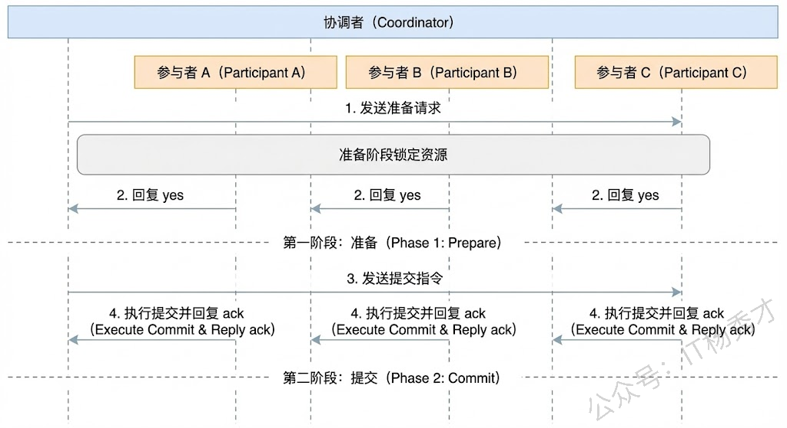

**参考回答：**

两阶段提交就是把分布式事务分成**准备阶段和提交阶段**两步来执行，有一个协调者来统一调度所有参与者。准备阶段，协调者向所有参与者发送准备请求，参与者收到后执行事务操作（写日志、锁资源），但先不提交，然后把执行结果反馈给协调者。提交阶段，如果所有参与者都反馈"准备就绪"，协调者就下发提交指令，大家一起提交；只要有一个参与者反馈失败，协调者就下发回滚指令，全部回滚。

2PC能保证强一致性，实现也比较简单，但问题也很明显：一是协调者是单点，它挂了整个事务流程就卡住了；二是准备阶段所有参与者都要锁定资源等待，资源占用时间长，并发性能很差；三是如果提交阶段网络出问题，部分参与者收到了提交指令部分没收到，就会数据不一致。适合并发度低但对一致性要求高的场景，比如传统金融系统。

***

### **4.4 三阶段提交（3PC）是什么？**

**知识点分析：**

> &#x20;3PC是对2PC的改进，把2PC的准备阶段拆成了**询问阶段**和**预提交阶段**，变成三步：询问→预提交→提交。询问阶段只问参与者"你能不能做"，不实际锁资源，这样可以提前筛掉不可用的参与者。并且引入了**超时机制**，参与者如果超时没收到协调者指令会自动执行默认操作，一定程度缓解了协调者单点故障导致的阻塞问题。但极端网络分区下仍可能出现部分提交部分回滚的不一致。

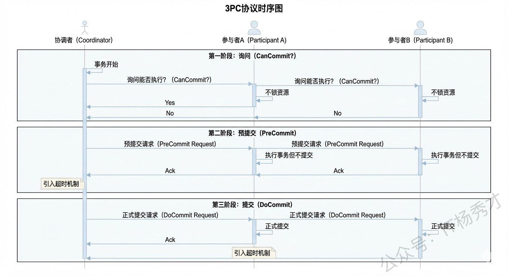

**参考回答：**

3PC是在2PC基础上的改进，把准备阶段拆成了询问和预提交两步，总共变成三个阶段。

第一阶段是**询问**，协调者只是问参与者"你能不能执行这个事务"，参与者根据自身状态回复yes或no，这一步不会锁定任何资源，可以提前发现不可用的参与者。

第二阶段是**预提交**，如果所有参与者都回复能执行，协调者才发送预提交请求，参与者这时候才真正执行事务并锁定资源，但还不提交。

第三阶段是**正式提交**，所有参与者预提交成功后，协调者下发提交指令。

3PC相比2PC最大的改进是**引入了超时机制**，如果参与者在超时时间内没收到协调者的指令，会自动执行默认操作，这样就不会因为协调者挂了而一直阻塞。但3PC也不完美，在极端网络分区情况下还是可能出现部分提交部分回滚的不一致问题，所以实际工程中用得不多。

***

### **4.5 什么是 TCC 模式？**

**知识点分析：**

> &#x20;TCC是一种业务层面的分布式事务方案，把每个业务操作拆成三个方法：**Try**（预留资源）、**Confirm**（确认提交）、**Cancel**（取消回滚）。比如扣库存：Try阶段冻结10个库存，Confirm阶段真正扣掉冻结的10个，Cancel阶段把冻结的10个还回去。TCC的优势是不需要长时间锁数据库资源，性能高；劣势是每个服务都要实现三个方法，开发成本大，而且要处理空回滚、悬挂等异常问题。

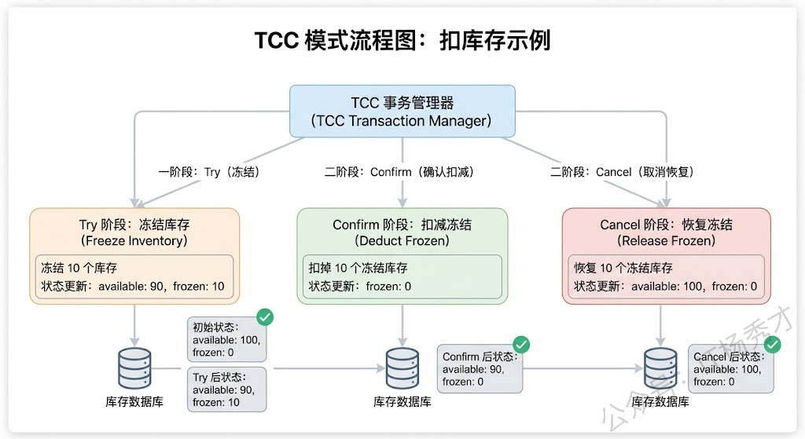

**参考回答：**

TCC是把每个服务的业务操作拆成**Try、Confirm、Cancel**三个步骤来实现分布式事务。以电商扣库存为例：

Try阶段不是直接扣库存，而是冻结10个库存，相当于预留资源；如果所有服务的Try都成功了，就进入Confirm阶段，把冻结的10个库存真正扣掉；如果中间有任何一个服务Try失败了，就走Cancel阶段，把冻结的库存恢复回去。TCC最大的优势是资源锁定时间短，Try阶段只做预留不会长时间锁表，性能远高于2PC。但劣势也很明显，就是**开发成本非常高**，每个服务每个操作都要写Try、Confirm、Cancel三个方法，而且还要处理异常场景比如空回滚（Try没执行就收到Cancel）、幂等（Confirm或Cancel被重复调用）等。适合支付、库存这种高并发且对一致性有要求的核心业务。

***

### **4.6 什么是 Saga 模式？**

**知识点分析：**

> &#x20;Saga模式的核心思想是把一个长事务拆成多个本地短事务，每个短事务都有一个对应的**补偿事务**。正向执行时依次执行各个短事务；如果某一步失败了，就按相反顺序执行前面所有步骤的补偿事务来回滚。比较TCC，Saga不需要Try预留资源这一步，实现简单一些，但只能保证最终一致性，中间状态对外可见。适合流程长、步骤多的业务场景。

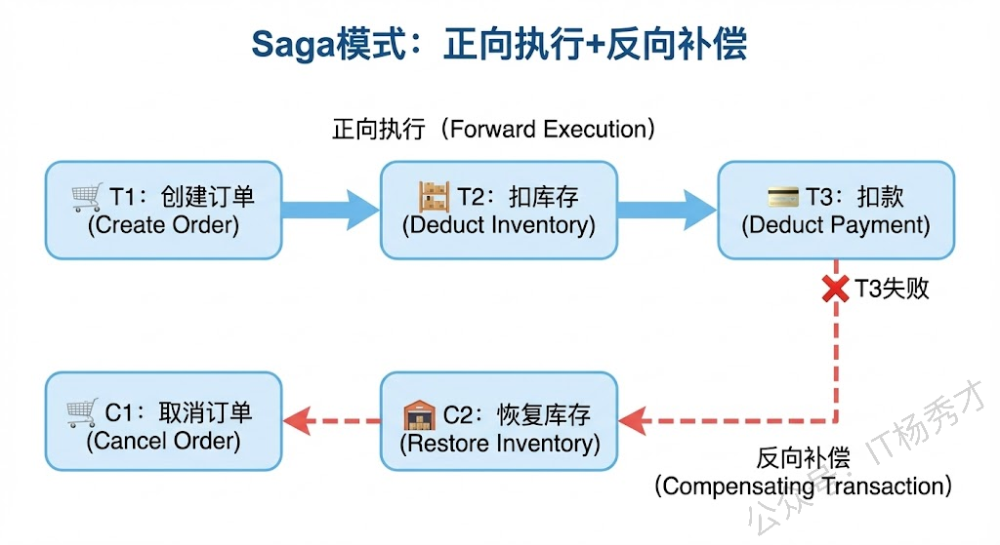

**参考回答：**

Saga模式是把一个大的分布式事务拆成多个本地短事务串联执行，每个短事务都对应一个**补偿事务**用来回滚。比如下单流程有三个步骤：T1创建订单、T2扣库存、T3扣款。正常情况依次执行T1→T2→T3就完成了。如果执行到T3扣款时失败了，就按相反顺序触发补偿：先执行C2恢复库存，再执行C1取消订单。

跟TCC相比，Saga不需要Try预留资源这一步，对业务的侵入性更小，实现相对简单，短事务之间也可以并行执行提高性能。但它只能保证**最终一致性**，中间状态是对外可见的，比如库存已经扣了但还没扣款，这个中间态其他请求能看到。适合业务流程比较长、步骤多的场景，比如旅游系统里同时预订航班、酒店、租车这种跨多个服务的长流程。

***

### **4.7 什么是可靠消息最终一致性方案？**

**知识点分析：**

> &#x20;这个方案的核心是借助消息队列来实现跨服务的最终一致性。上游服务执行本地事务时把消息发到MQ，下游服务消费消息执行对应操作。关键点是要保证"本地事务成功"和"消息发送成功"的一致性——要么都成功要么都失败。解决方案包括RocketMQ的事务消息（半消息机制）和本地消息表。下游消费失败则由MQ重试，需要保证消费端幂等。

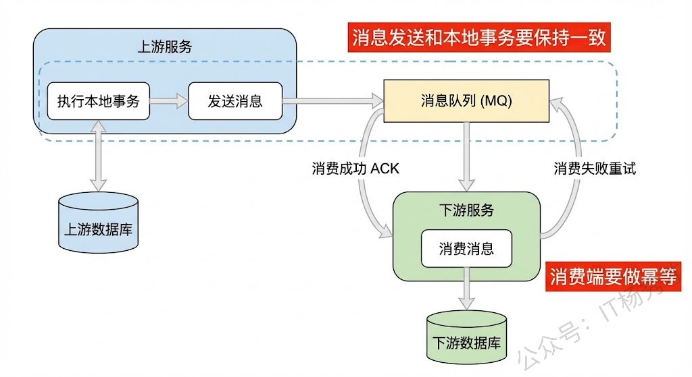

**参考回答：**

可靠消息最终一致性方案就是借助消息队列来实现跨服务的数据一致性。核心思路是上游服务在执行完自己的本地事务后，把需要通知下游的操作封装成消息发到MQ，下游服务消费这条消息并执行对应操作。如果消费失败，MQ会自动重试。

这个方案最关键的一点是要保证**本地事务和消息发送的一致性**——不能出现事务提交了但消息没发出去、或者消息发了但事务回滚了的情况。RocketMQ的事务消息就是专门解决这个问题的，它有一套半消息机制来保证两者的一致。另外因为MQ会重试，下游消费端必须做好**幂等设计**，保证同一条消息消费多次结果一样。这个方案实现相对简单，系统耦合度低，适合异步通知类的业务场景。

***

### **4.8 什么是本地消息表方案？**

**知识点分析：**

> &#x20;本地消息表是可靠消息方案的一种具体实现，核心思想是把"业务操作"和"消息写入"放在**同一个本地事务**中。上游服务在执行业务SQL的同时，往本地的消息表中插入一条消息记录，利用数据库本地事务保证两者同时成功或同时失败。然后有一个后台定时任务扫描消息表，把未发送的消息通过MQ发送给下游，下游消费成功后回调确认，消息表标记已完成。简单可靠，不依赖MQ的事务消息特性。

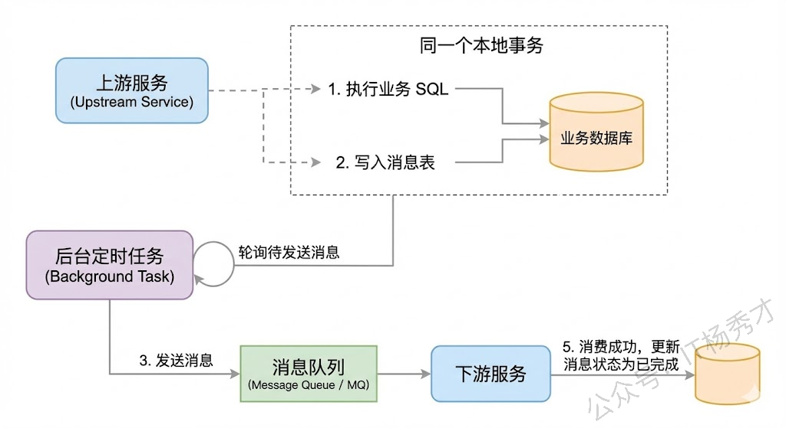

**参考回答：**

本地消息表方案的思路很朴素但非常实用。上游服务在执行业务操作时，同时在**同一个数据库事务**里往一张消息表中插入一条待发送的消息记录，因为是本地事务所以要么业务数据和消息记录一起写成功，要么一起回滚，保证了一致性。然后有一个后台定时任务不断轮询这张消息表，把状态为"待发送"的消息通过MQ发给下游服务。下游服务消费成功后通知上游，上游把消息表中对应记录标记为"已完成"。如果下游消费失败或者没有反馈，定时任务会不断重试发送。这个方案最大的优点是**简单可靠、不依赖任何外部特性**，任何MQ都能用。缺点是消息可能重复发送，所以下游必须做好幂等设计。适合异步通知类的场景，比如订单创建后通知积分服务加积分。

***

### **4.9 阿里的 Seata 框架了解吗？**

**知识点分析：**

> &#x20;Seata是阿里开源的分布式事务解决方案，支持多种事务模式。**AT模式**是默认模式，基于关系型数据库，自动生成回滚日志（undo log），在业务SQL前后记录数据快照，需要回滚时自动恢复，对业务代码零侵入。**TCC模式**需要手动编写Try/Confirm/Cancel三个方法。**Saga模式**将长事务拆成短事务加补偿。AT模式最常用因为侵入性最低，开发成本最小。

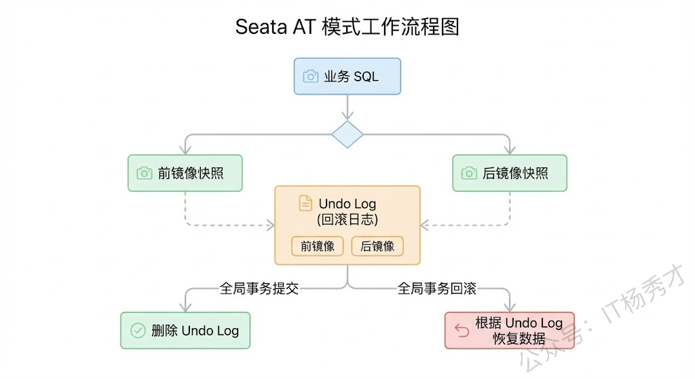

**参考回答：**

Seata是阿里开源的分布式事务框架，支持AT、TCC和Saga三种模式。

用得最多的是**AT模式**，也是它的默认模式，对业务代码几乎零侵入。AT模式的原理是这样的：Seata会在业务SQL执行前后自动记录数据的快照（前镜像和后镜像），生成回滚日志保存下来。如果全局事务正常提交，就把回滚日志删掉；如果全局事务需要回滚，就根据回滚日志把数据恢复到事务开始前的状态。整个过程对开发者来说是透明的，只需要加个注解就行。**TCC模式**需要自己手动编写Try、Confirm、Cancel三个方法，灵活性更高但开发成本也更高。**Saga模式**用于长事务场景，拆成多个短事务加补偿事务。实际项目中如果团队是Java技术栈，Seata的AT模式是成本最低的分布式事务方案。

***

## **5. 分布式组件**

### **5.1 RPC 的概念是什么？**

**知识点分析：**

> &#x20;RPC（Remote Procedure Call）即远程过程调用，核心目标是让调用远程服务像调用本地方法一样简单透明。开发者只需要关心"调什么方法、传什么参数"，网络通信、序列化反序列化这些底层细节全由RPC框架封装。关键组件是**Stub（存根）**——客户端的代理对象，看起来是本地方法实际上负责网络通信。

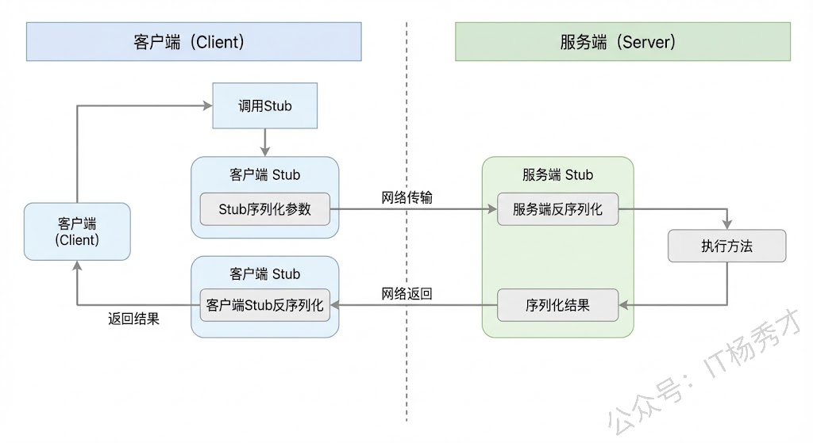

**参考回答：**

RPC就是**远程过程调用**，简单说就是让你调用远程服务器上的方法像调用本地方法一样方便，感觉不到网络通信的存在。整个调用过程是这样的：客户端调用一个看起来是普通方法的Stub（存根/代理），Stub把方法名和参数序列化后通过网络发给服务端，服务端反序列化后找到对应的方法执行，再把执行结果序列化返回给客户端，客户端Stub反序列化后拿到结果。网络通信、序列化这些复杂的底层细节全部被RPC框架封装了，对开发者来说就像调了一个本地方法。

***

### **5.2 RPC 调用流程是什么？**

**知识点分析：**&#x20;

> RPC调用流程可以分为五步：1）客户端调用本地Stub并传入参数；2）Stub将调用信息（方法名、参数等）序列化成二进制数据通过网络发送；3）服务端接收并反序列化，找到对应方法执行；4）服务端将执行结果序列化后通过网络返回；5）客户端接收并反序列化得到结果。理解关键是序列化/反序列化（数据编解码）和网络传输两个环节。

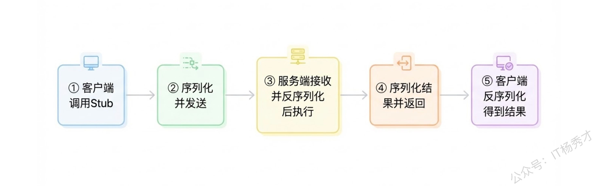

**参考回答：**

RPC调用流程分五步。

第一步，客户端程序调用本地的一个Stub方法并传入参数，这个Stub看起来跟普通方法一样，但它其实是一个代理。第二步，Stub把调用信息（包括要调用的方法名、参数等）序列化成网络可传输的二进制数据，通过网络发送到服务端。

第三步，服务端接收到数据后反序列化，根据方法名找到对应的实现并执行。

第四步，服务端把执行结果序列化后通过网络返回给客户端。

第五步，客户端收到返回数据后反序列化，得到最终结果返回给调用者。整个过程中最核心的就是序列化反序列化和网络传输，RPC框架帮我们把这些全封装了。

***

### **5.3 常见的 RPC 框架有哪些？**

**知识点分析：**

> &#x20;三大主流RPC框架各有特色：
>
> **gRPC**是Google开发的，使用Protocol Buffers做序列化，基于HTTP/2协议，支持多语言，性能优秀；
>
> **Thrift**是Facebook开发的跨语言RPC框架，支持多种传输协议和序列化格式；
>
> **Dubbo**是阿里开源的Java RPC框架，提供完善的服务治理能力（负载均衡、集群容错、服务注册发现等），在国内Java生态中使用极广。

**参考回答：**

主流的RPC框架有三个。

**gRPC**是Google开发的，用Protocol Buffers做序列化，基于HTTP/2协议，支持多种编程语言，性能非常好，适合多语言微服务之间的通信。

**Thrift**是Facebook开发的，也是跨语言的RPC框架，支持多种传输协议和序列化格式，可扩展性强。

**Dubbo**是阿里开源的，专注Java生态，最大的特点不只是RPC通信，还内置了一整套服务治理能力，包括服务注册发现、负载均衡、集群容错、链路追踪等，在国内互联网公司用得非常广泛。

如果团队是Java技术栈做微服务，Dubbo基本是首选；如果是多语言环境或者需要跟外部系统对接，gRPC更合适。

***

### **5.4 ZooKeeper 可以用来做什么？**

**知识点分析：**&#x20;

> ZooKeeper是一个**分布式协调服务**，它本身不直接处理业务，而是为分布式应用提供底层的协调能力。三大核心应用场景：**配置管理**（集中存储配置，配置变更时通过Watcher通知所有节点）；**服务注册与发现**（服务提供者注册到ZK，消费者从ZK获取服务列表，服务上下线时实时通知）；**分布式锁**（利用临时顺序节点和Watcher机制实现）。

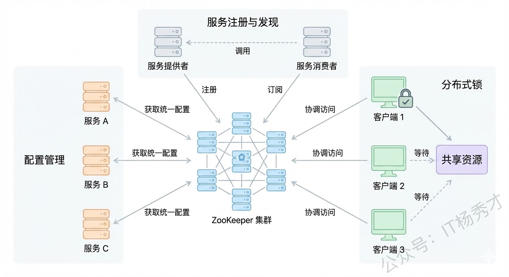

**参考回答：**

ZooKeeper是一个分布式协调服务，核心就是为分布式系统提供底层的协调能力，主要有三个应用场景。

第一是**配置管理**，在分布式系统中多个节点需要相同的配置信息，把配置集中存在ZK上，配置变更时ZK通过Watcher机制通知所有节点重新加载，不用逐个修改。

第二是**服务注册与发现**，服务提供者启动时把自己的地址信息注册到ZK，消费者从ZK获取可用的服务列表，服务上下线时ZK实时通知消费者更新列表，Dubbo就是用ZK来做服务注册发现的。

第三是**分布式锁**，利用ZK的临时顺序节点和Watcher监听机制实现，前面已经详细讲过了。

***

### **5.5 ZooKeeper 的核心原理是什么？**

**知识点分析：**

> &#x20;ZK的核心原理要从两个维度理解：**数据模型**和**一致性协议**。数据模型是类似文件系统的树形结构，每个节点叫ZNode，有持久节点、临时节点、顺序节点三种类型。一致性靠**ZAB协议**保证，基于主从架构（Leader+Follower），写请求统一由Leader处理，通过消息广播同步到Follower，超过半数确认才提交。Leader挂了会进入崩溃恢复模式选举新Leader。注意ZK保证的是**顺序一致性**而不是强一致性。

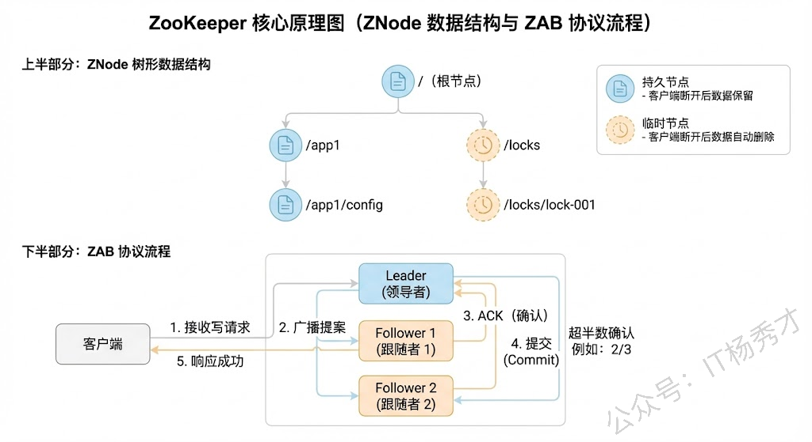

**参考回答：**

ZooKeeper的核心原理分两块来讲。

第一是**数据模型**，ZK的数据结构类似文件系统的树形结构，每个节点叫ZNode，可以存数据也可以有子节点。ZNode有三种类型：持久节点创建后一直存在除非主动删除，临时节点与客户端会话绑定、会话结束自动删除，顺序节点创建时ZK自动加递增序号。

第二是**ZAB一致性协议**，ZK集群是主从架构，只有一个Leader，其他是Follower。所有写请求都由Leader处理，Leader把写操作封装成事务提案广播给所有Follower，Follower写入本地日志后回复确认，Leader收到超过半数确认后才正式提交，再通知Follower一起提交，这就保证了数据一致。如果Leader挂了，集群进入崩溃恢复模式，Follower投票选出新Leader，新Leader先同步所有节点的日志，然后切换回正常的广播模式继续工作。需要注意的是ZK保证的是**顺序一致性**，不是强一致性。

***

## **6. 分布式场景**

### **6.1 常见的限流算法有哪些？**

**知识点分析：**&#x20;

> 限流是保护系统的重要手段，四种主流算法各有特点：**固定窗口**——最简单，按时间窗口计数，但有边界突刺问题；**滑动窗口**——把窗口细分并滑动，解决了固定窗口的突刺问题；**漏桶**——请求进桶后以固定速率流出，能平滑流量但不能应对突发；**令牌桶**——以固定速率往桶里放令牌，请求来了取令牌才能处理，桶满时可以积累令牌应对突发流量，综合效果最好。

**参考回答：**

常见的限流算法有四种。

**固定窗口**最简单，就是在一段固定时间内计数，超过阈值就拒绝，但有个问题：两个窗口交界处可能放过双倍流量。**滑动窗口**是对固定窗口的改进，把大窗口切成多个小时间片并在时间轴上滑动，这样任何一个滑动窗口内的请求总量都不会超标，解决了边界突刺问题。

**漏桶**算法是请求先进桶里排队，然后以固定速率从桶底流出处理，能把不规则的流量整形成平稳的速率，但缺点是即使系统很空闲也只能按固定速率处理，无法应对合理的流量突发。

**令牌桶**是漏桶的改进版，以固定速率往桶里放令牌，请求来了必须取到令牌才能处理。当桶里有积累的令牌时，突发流量可以一次性取走多个令牌被快速处理，这样既能限流又能应对一定程度的突发，综合效果最好，实际中用得最多。

***

### **6.2 什么是固定窗口限流算法？**

**知识点分析：**

> &#x20;固定窗口算法的原理是把时间划分成固定长度的窗口（比如1秒），在每个窗口内维护一个计数器，请求到来时计数器加1，超过阈值就拒绝，窗口结束时计数器归零。优点是实现极其简单。致命缺点是"窗口边界突刺"——比如阈值100/秒，第一个窗口的最后10ms来了100个请求，第二个窗口的前10ms又来了100个请求，实际在20ms内通过了200个请求，是阈值的两倍。

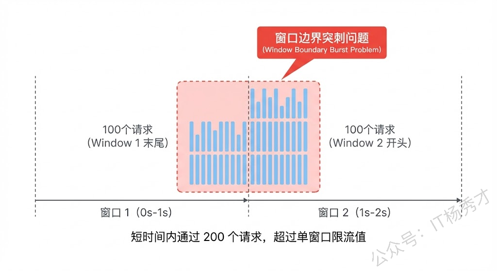

**参考回答：**

固定窗口限流就是把时间切成固定的段，比如每1秒一个窗口，窗口内维护一个计数器，每来一个请求计数器加1，超过阈值就拒绝请求，窗口时间到了计数器归零重新开始。实现非常简单，但有一个明显的缺陷叫**窗口边界突刺**。比如阈值设的是每秒100个请求，恰好在某个窗口的最后几毫秒来了100个请求，全部通过了；紧接着下一个窗口刚开始的前几毫秒又来了100个请求，也全部通过了。也就是说在两个窗口交界的很短时间内实际通过了200个请求，是我们设定阈值的两倍，这对系统造成的压力可能是很大的。

***

### **6.3 什么是滑动窗口限流算法？**

**知识点分析：**

> &#x20;滑动窗口是对固定窗口的改进。核心思路是把限流窗口内部细分成更小的时间片，然后窗口在时间轴上滑动，每滑过一个小时间片就形成一个新的窗口。因为任何一个短时间内的请求必然落在某一个滑动窗口内，所以不会出现固定窗口那种边界处放过双倍流量的问题。时间片划分得越细，限流精度越高，但资源消耗也越大。

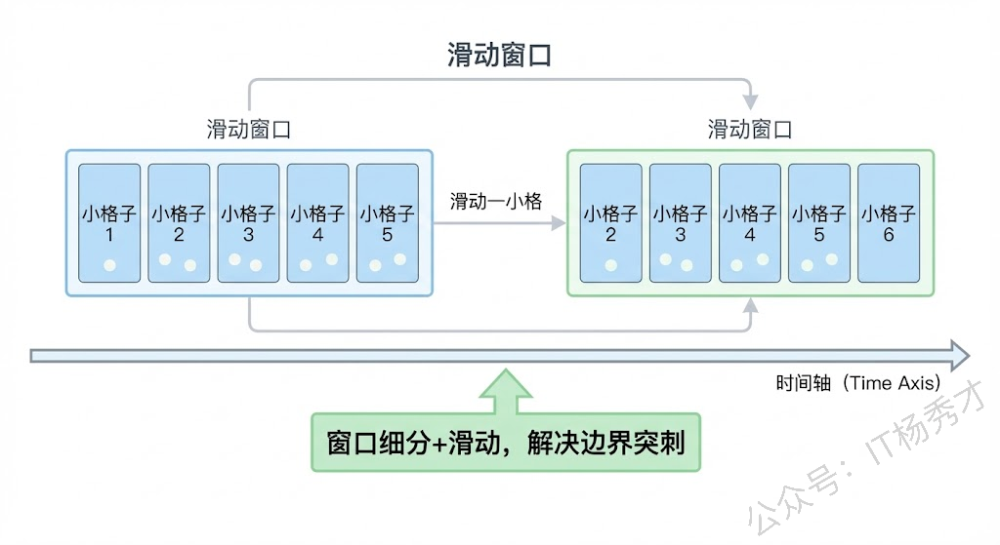

滑动窗口算法本质上是固定窗口算法的细化版本，它能够在一定程度上提高限流的精度和实时性，但不能彻底解决请求分布不均匀的问题。该算法依赖于窗口的大小和时间间隔，特别是在突发流量过大或请求分布极度不均匀的极端情况下，仍可能导致限流不准确。因此，在实际应用中，需要引入更复杂的算法或策略来进一步优化限流效果。

假设窗口以0.5s为小周期移动，如下图，在【0.5s，1.5s】，【1.5s，2.5s】间其实都是合理的，不会有流量超出，但是其实在【0.8s，1.8s】间就有10个请求了，并没有达到限流效果

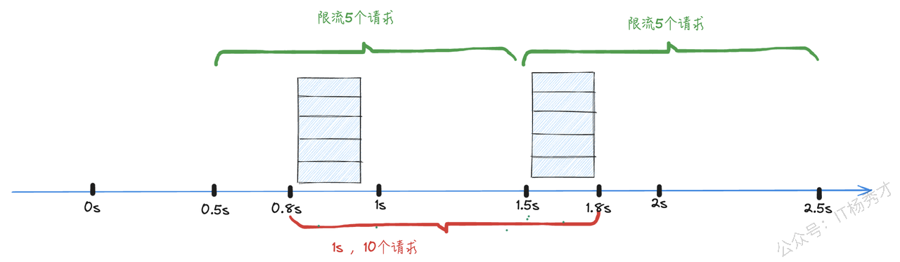

因为滑动窗口本质其实是将窗口粒度更小，但是不管多小，仍然是以窗口来限制，所以总会存在流量不均导致的限流不准确问题

**参考回答：**

滑动窗口是对固定窗口的改进，核心就是把限流的时间窗口**切分成更小的时间片**，然后在时间轴上滑动。比如1秒的窗口切成10个100毫秒的小格子，每过100毫秒窗口就滑动一格，丢掉最老的一格，加上最新的一格，形成一个新的统计窗口。这样做的好处是，不管请求密集出现在什么时间点，它们都可能被某一个滑动窗口覆盖，从而不会出现固定窗口那种在窗口交界处放过双倍流量的问题。时间片分得越细限流越精确，当然内存占用也越大，实际中根据业务精度需求来选择合适的粒度。

**还有一点需要注意：滑动窗口本质其实是将窗口粒度更小，但是不管多小，仍然是以窗口来限制，所以总会存在流量不均导致的限流不准确问题**

***

### **6.4 什么是漏桶限流算法？**

**知识点分析：**

> &#x20;漏桶算法模拟的是一个有固定出口速率的桶。请求就是流入的水，桶有容量上限，水满溢出就拒绝；桶底有个固定大小的洞，水以恒定速率流出处理。核心作用是**整流**——不管上游流量多不规则，经过漏桶后都变成恒定速率输出。缺点是太"死板"：即使系统很闲桶里有很多请求，也只能以固定速率处理，无法利用空闲资源应对突发流量。

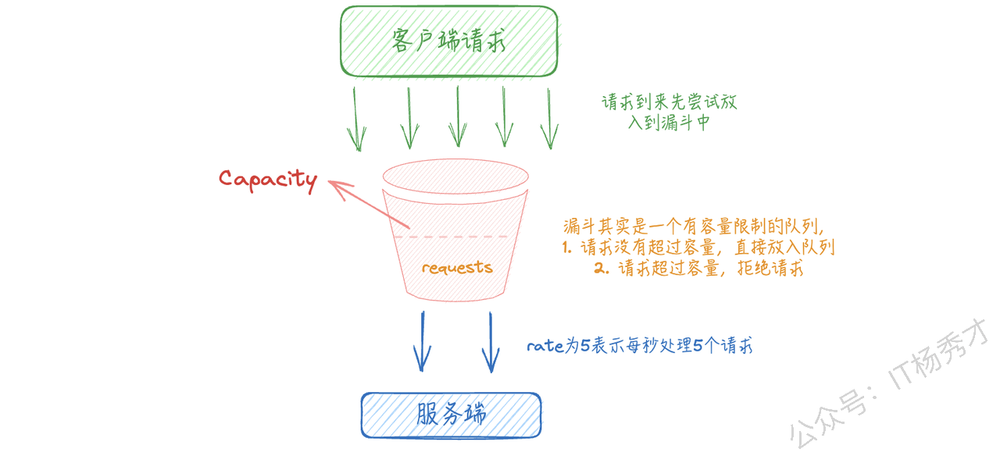

**参考回答：**

漏桶算法就是模拟一个有固定出口速率的桶。请求进来就像水流入桶里，桶有容量上限，满了就溢出拒绝；桶底有一个固定大小的洞，水以**恒定的速率**从洞里流出去处理。这样不管上游的请求多么不规则、多么有突发性，经过漏桶之后输出到系统的流量永远是平稳的，起到了**整流**的作用。

但漏桶有两个缺点：一是即使系统资源很空闲，桶里堆了很多请求也只能按固定速率慢慢处理，浪费了计算资源；二是无法应对合理的流量突发，比如突然来了10个请求，桶一次只能放出2个，有些请求就得等很久或被丢弃。

***

### **6.5 什么是令牌桶限流算法？**

**知识点分析：**&#x20;

> 令牌桶是漏桶的改进版，也是实践中用得最多的限流算法。核心机制是：系统以固定速率往桶里放令牌，桶满了令牌溢出丢弃；请求到来时必须从桶中取一个令牌才能被处理，取不到就等待或拒绝。关键优势：当流量低谷时令牌不断积累，桶中可能存满令牌；当突发流量到来时，可以一次性取走多个积累的令牌进行处理，**允许一定程度的突发**，比漏桶灵活得多。Google的Guava RateLimiter就是令牌桶实现。

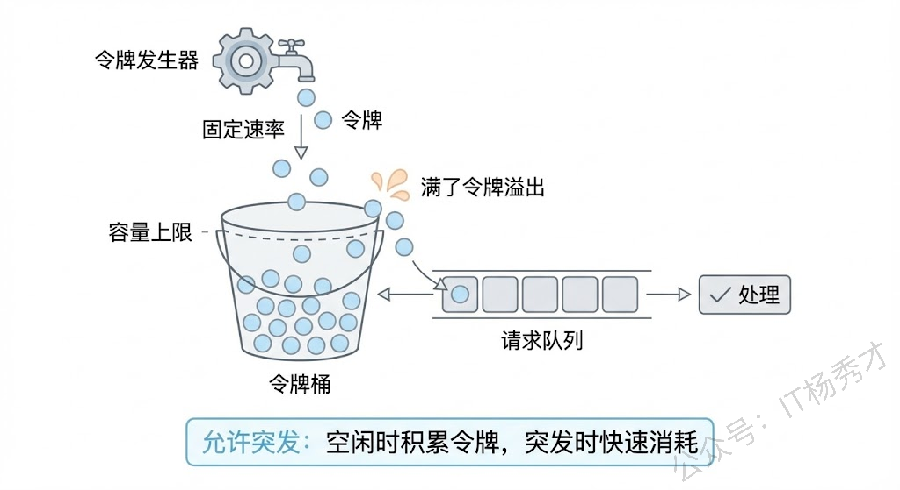

**参考回答：**

令牌桶是漏桶的升级版，也是目前实际中用得最多的限流算法。它的机制是系统以固定速率往桶里放令牌，桶有容量上限，放满了多余的令牌就丢掉。请求来的时候必须从桶里取到一个令牌才能被处理，取不到就排队等或者直接拒绝。令牌桶相比漏桶最大的优势在于**能应对合理的突发流量**——在流量低谷时令牌会不断积累，桶可能存了很多令牌。当突发流量来了，比如瞬间来了100个请求，如果桶里恰好有100个积累的令牌，那这100个请求可以一下子全部通过。但从长期看，令牌生成速率是固定的，所以平均处理速率还是受控的。这样既能限制总体速率，又不浪费系统空闲时的处理能力。Google的Guava库里的RateLimiter就是令牌桶的实现，实际项目中推荐优先使用令牌桶算法。

***

## **7. 分布式一致性算法**

### **7.1 说下 Raft 算法？**

**知识点分析：**

> &#x20;Raft是目前工业界最常用的分布式一致性算法，比Paxos好理解好实现。它把一致性问题拆成三个子问题：**选主**（Leader Election）、**日志复制**（Log Replication）、**安全性**（Safety）。节点只有三种角色：Leader、Follower、Candidate。正常时Leader接收所有请求并同步到Follower；Leader挂了Follower变成Candidate发起选举；日志复制通过"超过半数确认"来保证一致性。etcd、K8s都用Raft。

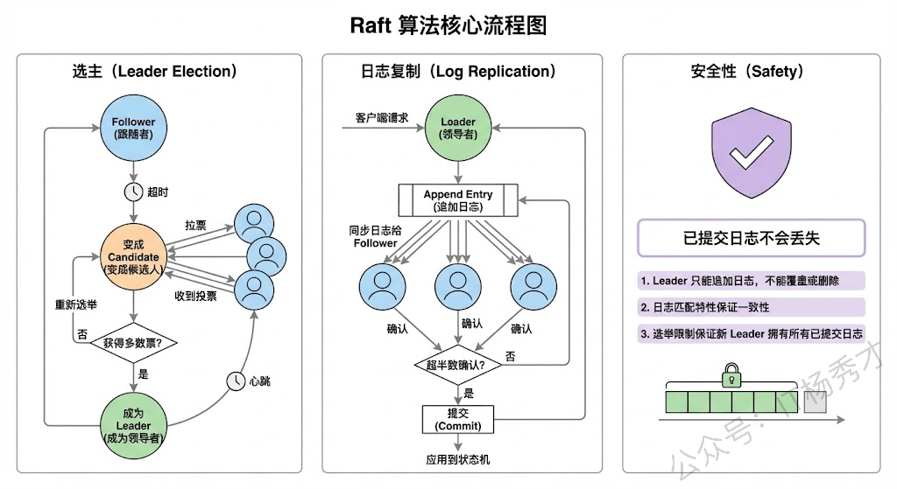

**参考回答：**

Raft是目前工业界非常常用的分布式一致性算法，设计上比Paxos简单很多，它把一致性问题拆成了三个清晰的部分：**选主、日志复制、安全性**。集群里的节点只有三种角色：Leader、Follower和Candidate。

正常情况下只有一个Leader负责处理所有请求，其他都是Follower被动接收同步。如果Follower一段时间没收到Leader心跳，就认为Leader挂了，自己变成Candidate发起选举，给自己投票然后向其他节点拉票，拿到**超过半数的票**就成为新Leader。

日志复制是最核心的部分，客户端的写请求都发给Leader，Leader把操作写成一条日志先不提交，而是同步给所有Follower，等超过半数节点确认收到了，Leader才提交这条日志，再通知大家一起提交。

安全性保证的是已经提交过的日志永远不会被覆盖或丢失，新选出来的Leader一定拥有最全的已提交日志。像etcd、Kubernetes底层都是用的Raft来保证数据一致性。

***

### **7.2 说一下 Paxos 协议？**

**知识点分析：**

> &#x20;Paxos是分布式一致性领域的奠基性算法，由Lamport提出。它解决的核心问题是"多个节点如何就一个值达成一致"。三个角色：**Proposer**（提议者，发起提案）、**Acceptor**（接受者，投票决定）、**Learner**（学习者，同步最终结果）。核心流程分两阶段：Prepare阶段发送提案编号试探，Accept阶段发送具体提案值请求接受。关键机制是"唯一递增提案编号 + 超过半数同意"。Paxos理论性强但实现复杂，工程中多用它的简化版Raft。

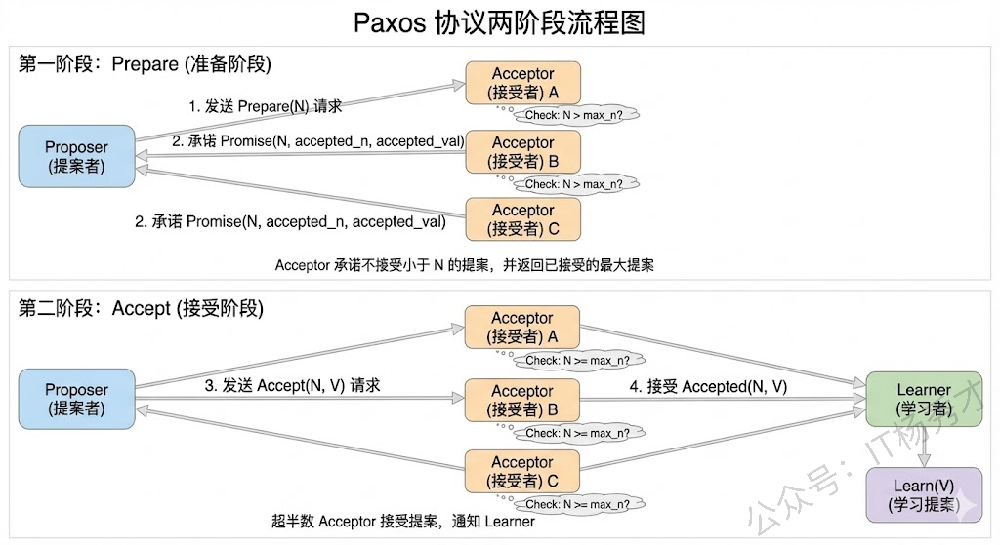

**参考回答：**

Paxos是分布式一致性领域最经典的协议，解决的是多个节点如何就同一个值达成一致的问题。它有三个角色：**Proposer**负责发起提案，**Acceptor**负责投票，**Learner**只同步最终结果不参与投票。核心流程分两个阶段：

第一阶段是**准备阶段**，Proposer选一个全局唯一且递增的提案编号发给所有Acceptor，Acceptor如果没见过比这个更大的编号，就承诺不再接受更小编号的提案，并把自己之前接受过的最大编号提案返回给Proposer。

第二阶段是**接受阶段**，Proposer收到超过半数Acceptor的回复后，把具体的提案值（如果之前有人提过就选编号最大的那个值，没有就用自己的值）发给Acceptor请求接受。Acceptor只要没收到更大编号的准备请求就接受，Proposer收到超过半数的接受回复，提案就达成共识了，再通知Learner同步。Paxos靠**唯一递增编号加半数机制**保证最终只有一个提案被通过，但理论性太强实现复杂，实际工程中大家更多用它的简化版Raft。

***

### **7.3 Raft 协议和 Paxos 协议的原理是什么？**

**知识点分析：**&#x20;

> 这道题要求对比两个协议的原理。Raft的核心是**强Leader模型**——所有请求由Leader统一处理，通过日志复制+半数确认保证一致性，选举机制保证Leader唯一。Paxos是**对等模型**——任何节点都可以发起提案，通过两阶段的编号竞争+半数同意来达成共识。两者本质目标相同（多节点数据一致），但Raft通过引入Leader简化了流程，牺牲了一些灵活性换取了易理解性和易实现性。

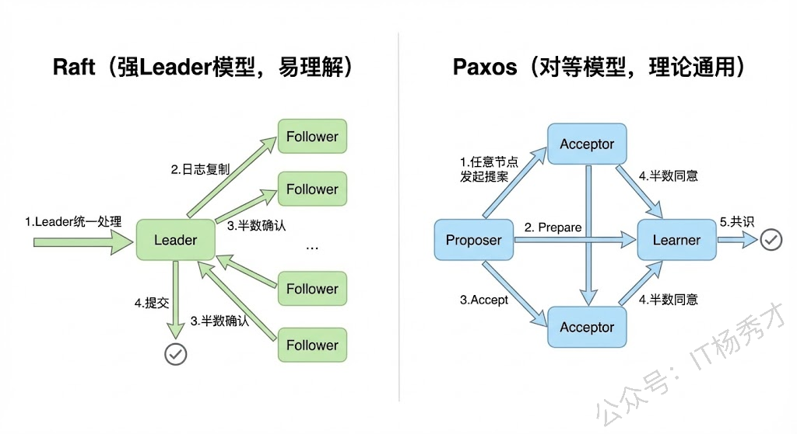

**参考回答：**

两个协议目标相同，都是保证分布式系统多节点数据一致，但设计思路不一样。

**Raft采用强Leader模型**，集群必须选出一个Leader，所有客户端请求都由Leader接收处理，Leader把操作写成日志同步给Follower，超过半数确认后提交。整个过程围绕Leader展开，分为选主和日志复制两个子问题，逻辑清晰易实现。

**Paxos是对等模型**，没有固定的Leader，任何节点都可以作为Proposer发起提案。通过两阶段流程——先发编号试探（Prepare），再发具体值请求接受（Accept），靠唯一递增编号和超过半数同意的机制来达成共识。Paxos更通用更灵活，但因为没有Leader的约束，多个Proposer同时提案时可能互相冲突导致活锁，理解和实现都比较困难。

简单来说，**Raft是Paxos的工程化简化版**，通过引入Leader角色降低了复杂度，牺牲一些灵活性换取了易理解和易实现。工程中大部分场景用Raft就够了。

***

### **7.4 有什么框架或技术用了 Raft 协议？**

**知识点分析：**

> &#x20;Raft协议在工业界应用非常广泛，最典型的两个是：**etcd**——分布式键值存储系统，Kubernetes用它来存储集群配置和状态数据，底层用Raft保证数据一致性；**Consul**——HashiCorp开发的服务发现和配置管理工具，也用Raft来管理集群状态和数据复制。此外还有TiKV（TiDB的存储引擎）等也使用了Raft。

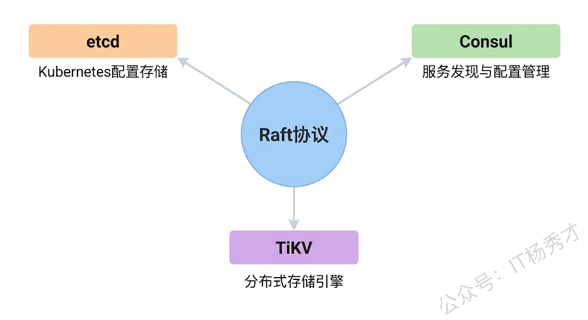

**参考回答：**

用了Raft协议的典型框架有两个。

**etcd**是一个开源的分布式键值存储系统，用Raft来保证多节点之间数据的一致性，最知名的应用就是作为Kubernetes的底层存储，K8s集群的所有配置信息和状态数据都存在etcd里。

**Consul**是HashiCorp开发的分布式服务发现和配置管理工具，它也用Raft来管理集群状态和做数据复制，保证服务注册信息在多节点间的一致性，常用于微服务架构中。

除了这两个，像TiDB的存储引擎TiKV也是基于Raft实现的分布式存储。可以说Raft在分布式存储和配置管理领域的应用是非常广泛的。

***

### **7.5 描述一下 ZAB 协议？**

**知识点分析：**

> &#x20;ZAB（ZooKeeper Atomic Broadcast）是ZooKeeper专属的分布式一致性协议。核心理解三点：**角色**——Leader、Follower、Observer（Observer不参与投票只同步数据提升读性能）；**广播模式**——正常工作时Leader接收写请求，封装成事务提案（带唯一zxid）广播给Follower，超过半数确认后提交；**崩溃恢复模式**——Leader挂了后选举新Leader，新Leader先同步所有节点日志保证一致，再切回广播模式。ZAB和Raft思想类似但ZAB是为ZK量身定制的。

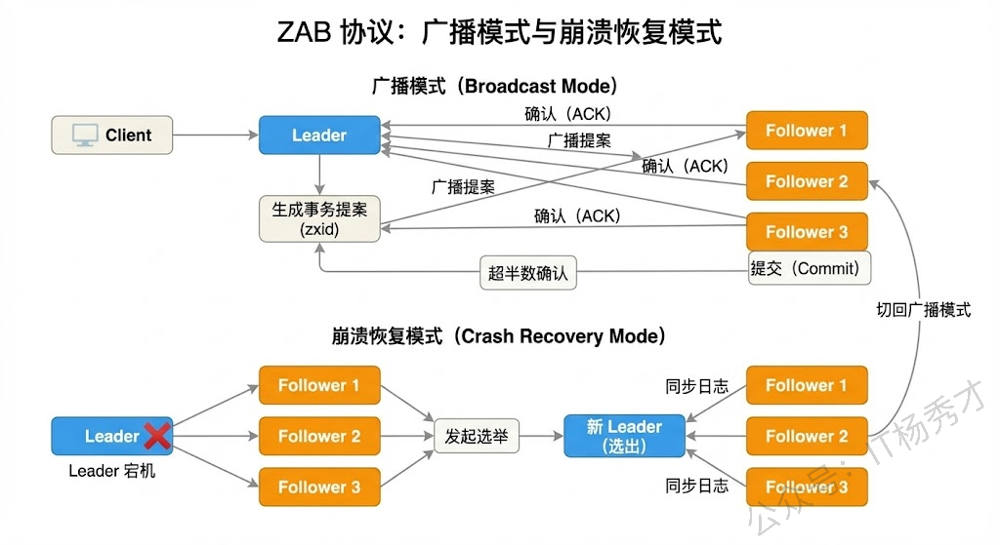

**参考回答：**

ZAB是ZooKeeper专属的分布式一致性协议，核心就是保证ZK集群所有节点的数据一致。集群有三种角色：**Leader**负责处理所有写请求和发指令，**Follower**跟着Leader同步数据、参与投票、处理读请求，**Observer**不参与投票只同步数据处理读请求，是为了提升读性能。

ZAB有两种工作模式。正常情况下是**广播模式**：客户端的写请求发给Leader，Leader把请求封装成事务提案并分配一个唯一的zxid（事务ID，保证全局有序），然后广播给所有Follower。Follower收到后先写本地日志再回复确认，Leader收到**超过半数**确认后广播提交指令，大家一起正式执行，数据就一致了。如果Leader挂了就进入**崩溃恢复模式**，Follower发现收不到心跳就发起选举，投票选出拥有最新最全日志的节点作为新Leader，新Leader先同步所有Follower的日志使其完全一致，然后切回广播模式继续工作。ZAB和Raft思想类似，但ZAB是专门为ZK的工作场景量身设计的。
