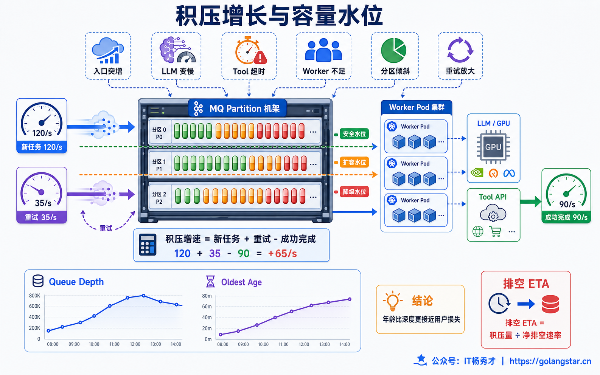
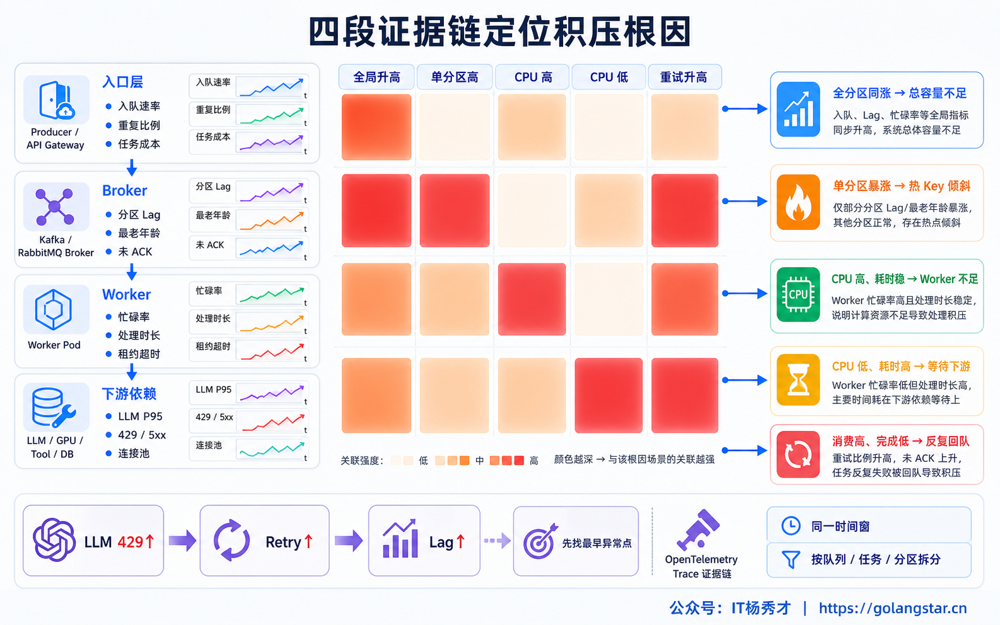
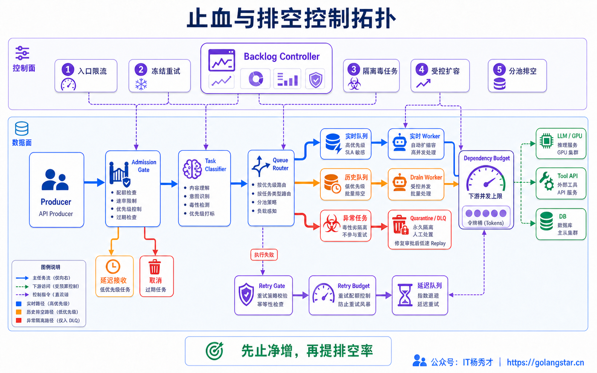
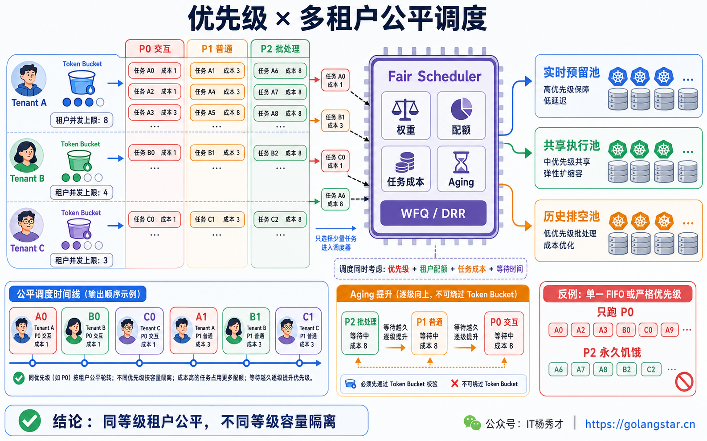
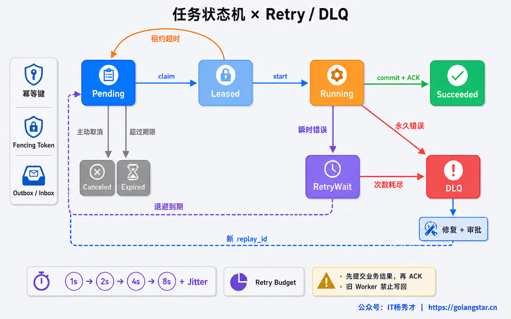
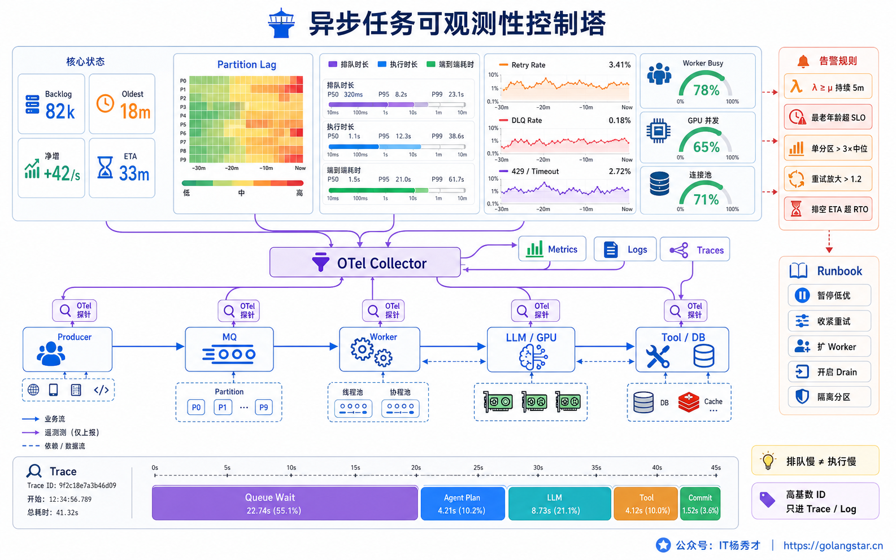

## **1. 题目分析**

生产告警里出现一条“异步队列积压 8 万”的消息，看起来像是 Worker 数量不够，但直接把副本从 20 扩到 100，情况反而可能更糟：LLM 接口开始大量返回 429，数据库连接池被打满，超时任务重新入队，半小时后 Retry Queue 又翻了一倍。队列长度上涨只是结果，真正的原因可能是入口流量突增、单任务耗时变长、热点分区、毒任务阻塞，也可能是多层重试把一次故障放大成了任务风暴。

因此，处理异步任务堆积的第一反应不应是扩容，而是回答三个问题：任务究竟堆在哪个状态；任务债务为什么还在增长；下游当前能够承受多快的排空速度。完整处置顺序应该是先止血，再定位，再把库存分成有效、过期、重复、毒任务和副作用未知五类，最后在安全容量内有序清债。



### **1.1 先确认任务到底堆在哪里**

“任务堆积”不是一个单一指标。**Ready** 持续上涨，说明可消费任务的进入速度长期高于完成速度；**Unacked 或 In-flight** 持续上涨，通常表示 Worker 卡在 LLM、Tool、锁或数据库上，任务已经取走却迟迟不能提交；**Delayed 或 Retry** 上涨，说明依赖异常正在触发重试放大；**DLQ** 上涨，意味着 Schema 不兼容、参数错误或毒任务已经超过重试上限；Broker 看起来正常但进程里的 Pending Task 持续上涨，则更像取消失效、Fire-and-forget 或协程生命周期泄漏。

这几种状态的处理方法完全不同。Ready 高可以控制入口并增加安全消费能力；In-flight 高时继续增加预取和并发，只会让更多任务卡在 Worker 内；Retry 高要先限制重试；DLQ 高需要修复任务或消费者代码；进程 Pending 高则要沿 Future、回调和连接的生命周期排查，不能靠消息队列扩容解决。

队列深度也不能单独代表用户影响。1 万个几十毫秒的小任务，可能比 500 个已经等待 40 分钟的复杂 Agent 任务更容易恢复。至少要同时观察最老有效任务年龄、排队时间 P95/P99、每个分区和租户的积压、任务成本分布以及任务是否还在 Deadline 内。单个毒任务可能把最老年龄拉高，因此还要对照安静分区与正常任务的年龄，避免被异常样本误导。

### **1.2 用任务守恒关系定位增长来源**

积压变化可以先用一条守恒关系理解：

```text
backlog_slope =
  admitted_rate + retry_rate + fanout_rate
  - unique_completion_rate - expire_drop_rate
```

只要右侧结果持续大于零，队列就会增长。Agent 场景还不能只数任务个数，因为一次简单问答和一次 3 万 Token、多工具、多轮推理的任务成本差异极大。更合理的做法是给任务估算 Work Unit，把预估输入输出 Token、最大步骤数、Tool 扇出和历史执行时长纳入权重，再比较单位时间进入和完成的工作量。

有效处理能力也不是 `Worker 数 × 单 Worker 并发`。它受最窄下游约束，可以近似理解为：

```text
safe_completion_rate = min(
  Worker 处理能力,
  LLM RPM/TPM 容量,
  Tool 配额,
  DB/Redis 连接容量,
  Broker 分区吞吐
)

drain_eta ≈ valid_backlog /
            (safe_completion_rate - new_admitted_rate)
```

只有安全完成速率高于新的准入速率，积压才会真正下降。完成速率应取任务账本里首次进入成功终态的数量，不能直接拿 Broker 的 Receive 或 Delete 计数代替，因为重复投递和重复删除都可能把吞吐算高。若入口速率稳定但唯一完成速率下降，同时任务执行时长、LLM 429 或 Tool 超时上升，根因在消费链路；若 Retry 占比和 Redelivery 突升，根因是重试放大；若总体 Worker 仍有空闲但单分区最老年龄快速上涨，多半是热点租户、分区倾斜或队头阻塞。



### **1.3 事故止血要先阻止债务继续增长**

处置开始后，第一目标不是立刻清空队列，而是先让 `backlog_slope` 不再扩大。入口对低优先级批处理和离线任务暂停受理，对交互任务启用租户级准入、并发上限和有界队列；必要时返回明确的繁忙状态与 `Retry-After`，不能假装已经受理一个根本无法在 SLA 内开始执行的任务。Multi-Agent 的并行扇出、反思、二次检索等非关键步骤也可临时收紧，减少每个新任务产生的内部工作量。

如果某个模型或 Tool 持续异常，应先熔断或限流对应依赖，把可恢复错误送入独立的延迟重试队列。重试权只保留在一个层级，采用指数退避、Jitter、最大次数和全局 Retry Budget；立即放回主队列会让失败任务抢占正常任务，形成没有空隙的重试风暴。参数、权限和 Schema 错误属于确定性失败，不能重试。

队列中的任务还要检查 Deadline、取消状态和业务版本。用户已经取消、结果已经过时或数据版本已淘汰的任务，应原子地标记为 expired 并停止后续执行，而不是继续消耗模型 Token。清理必须保留审计记录和最终状态，不能直接在 Broker 中按时间范围批量删除，否则可能破坏同会话顺序、任务状态机和副作用对账。



### **1.4 清库存前先给任务分级**

止住新增债务后，历史库存要先分类再排空。已过期或已取消任务直接终止；相同幂等键的重复任务合并并复用已有结果；存在 Checkpoint 的可恢复任务从最后一个可靠步骤继续，避免重新做 Embedding、检索和模型推理；连续失败且错误稳定复现的毒任务进入 DLQ；涉及发消息、建工单、支付或写外部系统且执行结果未知的任务，必须先查询外部状态并对账，不能盲目重做。

仍然有效的任务也不应全部塞回一个 FIFO。在线交互、普通异步、离线批处理、Retry 和 DLQ Replay 使用不同 Lane 与资源预算；短任务和长任务分池，避免一个超长 Agent 占住队首；租户之间通过 Weighted Fair Queue 或 Deficit Round Robin 按成本公平调度，配合租户配额防止热点客户长期挤占容量。低优先级任务可以 Aging，但不能绕过 Deadline。

需要保证会话顺序的任务继续用 `tenant_id + conversation_id` 作为分区键，同一会话串行、不同会话并行。跳过一个过期步骤时也要写入明确的终止事件或 Tombstone，让后续步骤知道它被有意取消，而不是误以为消息丢失。



### **1.5 只在下游安全容量内提高消费速度**

扩 Worker 之前要逐项确认 LLM 的 RPM、TPM 与并发槽位，第三方 Tool 配额，数据库和 Redis 连接池，Broker 分区数以及自部署模型的 GPU、KV Cache 水位。瓶颈若在 LLM TPM，扩十倍 Worker 只会制造更多 429；Kafka 消费副本已经达到有效分区数后，继续增加副本通常只会产生空闲消费者；数据库连接池没有余量时，提高并发还会放大锁等待和超时。

确认下游有余量后，采用阶梯式扩容和 Slow Start，每次提高一档并发后观察 Ack Rate、最老任务年龄、下游错误和 Retry 比例。Worker 自动扩缩容可使用 Queue Depth、Consumer Lag 或 Pending Entries 作为触发信号，但最大副本数必须受下游并发预算约束，不能只按 CPU。恢复期间还应设置 Drain Rate Limiter，把库存释放速度限制在各依赖的安全水位内，避免积压瞬间涌出造成第二次雪崩。

预取参数也会影响排空公平性。单个 Worker 预取过多长任务，会让 Broker 显示 Ready 降低，却把大量任务藏进 Unacked，并让其他 Worker 无法分担。长任务采用较小预取和租约心跳，短任务可适度批量获取；Embedding、Rerank 等纯计算步骤可以批处理提高吞吐，有外部副作用的工具调用则不能为了速度随意合并。

### **1.6 ACK、租约和副作用必须守住正确性**

多数任务队列采用至少一次投递，Worker 崩溃、网络中断或 Visibility Timeout 到期后都可能重新投递。因此 `TaskEnvelope` 至少需要携带 `tenant_id`、`conversation_id`、`run_id`、`task_id`、`idempotency_key`、Deadline、Attempt、状态版本和 Trace Context。ACK 必须发生在结果与状态可靠提交之后；提前 ACK 可能丢任务，延迟 ACK 则要靠幂等抵御重复执行。

Visibility Timeout 或 Lease 需要覆盖正常执行时间，并允许长任务通过心跳续租。时间过短会让原 Worker 尚未完成时另一个 Worker 又拿到同一任务；时间过长则会延迟故障恢复。即使有租约，旧 Worker 也可能在租约过期后继续运行，因此写回时还要校验版本号或 Fencing Token，拒绝僵尸 Worker 覆盖新状态。

外部副作用必须使用稳定的幂等键并持久化调用状态。模型或 Tool 超时只说明调用方没有拿到结果，不等于对方一定没有成功；处于 Unknown 的任务要先查询外部 Reference 或进行业务对账。Transactional Outbox 用于保证本地状态和待发布事件同事务落盘，消费端通过 Inbox 或幂等表去重，但 Outbox 本身不能让远程副作用原子化。



### **1.7 恢复过程要按 Runbook 有序推进**

一个可执行的恢复顺序通常是：冻结高风险变更并保存现场指标；暂停低价值入口和多余扇出；稳定故障依赖并限制重试；按过期、重复、可恢复、毒任务和副作用未知分类库存；在下游安全容量内阶梯扩 Worker；观察积压斜率和最老任务年龄持续下降；最后逐步恢复新流量，待故障修复并验证后再单独 Replay DLQ。

恢复不能只看 Queue Depth 接近零。若最老任务年龄仍在上升，可能只是新任务被优先处理，旧任务已经饥饿；若 Retry Rate 仍然很高，主队列下降也可能只是任务被转移；若下游 429、连接池等待和任务 P99 持续抬升，排空速度已经超过安全水位。真正的恢复标准是有效积压斜率为负、最老有效任务年龄下降、重试和过期比例回归基线、下游资源稳定，并且 Drain ETA 持续收敛。

### **1.8 用队列 SLO 和故障演练防止复发**

长期监控至少要按任务类型、优先级、租户和分区拆分 Enqueue Rate、Unique Completion Rate、Ready、Unacked、Retry、DLQ、Redelivery、最老有效任务年龄、排队 P95/P99、执行耗时、过期率和 Drain ETA；同时关联 LLM 429、Token 吞吐、Tool 错误、连接池等待、Worker 利用率和租约续期失败。`task_id`、`run_id` 等高基数字段放 Trace 与日志，不要作为时序指标标签。

告警应组合“最老任务年龄超过 SLO”和“积压斜率连续为正”，不能只在任务数越过固定阈值时触发。容量评审使用真实的长短任务比例、Token 分布和 Tool 扇出，故障演练主动注入模型变慢、毒任务、热点分区、Worker 崩溃、租约过期、重复投递和重试风暴，并验证入口背压、任务过期、DLQ、幂等和排空限速是否按设计生效。



处理异步任务堆积的本质不是把任务从一个队列快速搬到另一个地方，而是先停止债务增长，再识别哪些工作仍然值得执行，最后用可证明安全的速率完成它。只要入口没有受控、重试仍在放大、下游容量没有核算，任何扩容都可能只是把事故向后推一层。

***

## **2. 参考回答**

生产环境遇到异步任务堆积，我不会先盲目扩 Worker，而是先区分 Ready、In-flight、Retry、DLQ 和进程 Pending，结合 Enqueue/Unique Completion Rate、最老任务年龄、执行时长、下游 429 与分区 Lag 判断是入口突增、消费变慢、热点分区、毒任务还是重试风暴。先暂停低优先级入口和非关键扇出，熔断异常依赖，限制重试并淘汰已过 Deadline 的任务，让积压斜率先停止增长。

随后把库存分成过期、重复、可从 Checkpoint 恢复、毒任务和副作用未知几类；在线、离线、Retry 与 DLQ 分 Lane 公平调度。确认 LLM 配额、Tool、数据库、Broker 分区和 GPU 都有余量后，再阶梯扩 Worker，并用 Drain Rate Limiter 防止二次冲击。任务按至少一次投递设计，ACK 在可靠提交后执行，配合幂等键、租约心跳、Fencing Token、Outbox/Inbox 和 DLQ Replay 保证恢复正确。最终以最老任务年龄下降、Retry 回归基线和 Drain ETA 收敛作为恢复标准。

<div style="background-color: #f0f9eb; padding: 10px 15px; border-radius: 4px; border-left: 5px solid #67c23a; margin: 20px 0; color:rgb(64, 147, 255);">

## <span style="color: #006400;">**学习交流**</span>
<span style="color:rgb(4, 4, 4);">
> 如果您觉得文章有帮助，可以关注下秀才的<strong style="color: red;">公众号：IT杨秀才</strong>，后续更多优质的文章都会在公众号第一时间发布，不一定会及时同步到网站。点个关注👇，优质内容不错过
</span>


<div style="text-align: center; margin-top: 22px; padding-top: 20px; border-top: 1px solid #c2e7b0;">
<div style="color: #006400; font-size: 20px; font-weight: bold;">🔥 配套实战项目，拆得开、跑得起、能写进简历</div>
<div style="color: red; font-size: 16px; font-weight: bold; margin-top: 8px;">多 Agent 编排 + RAG 混合检索 · 31 篇深度教程 + 50+ 面试题</div>
<a href="/projects/dev-support.html" style="display: inline-block; margin-top: 14px; background: #ff7a18; color: #fff; font-size: 18px; font-weight: bold; padding: 10px 28px; border-radius: 24px; text-decoration: none;">点击查看 DevSupport AI 实战项目 →</a>
</div>
</div>
