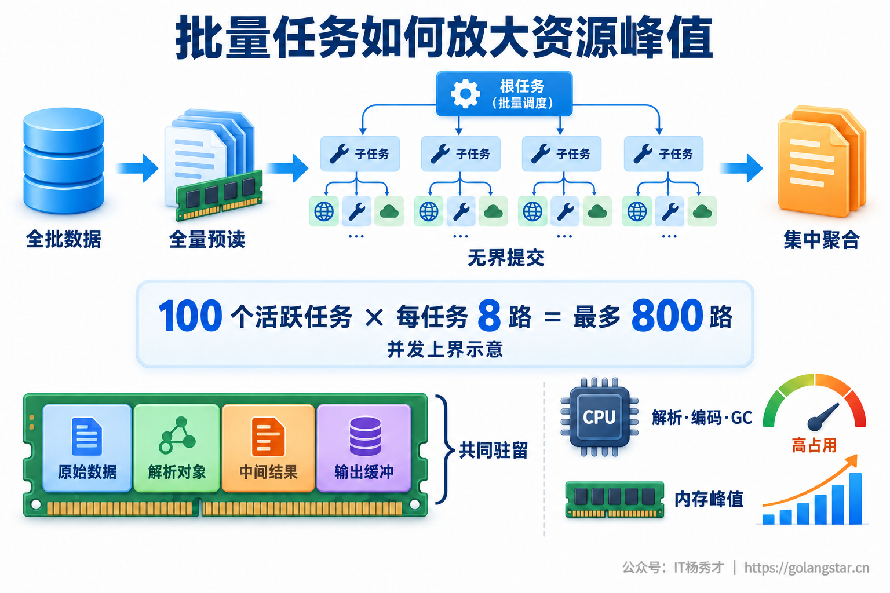
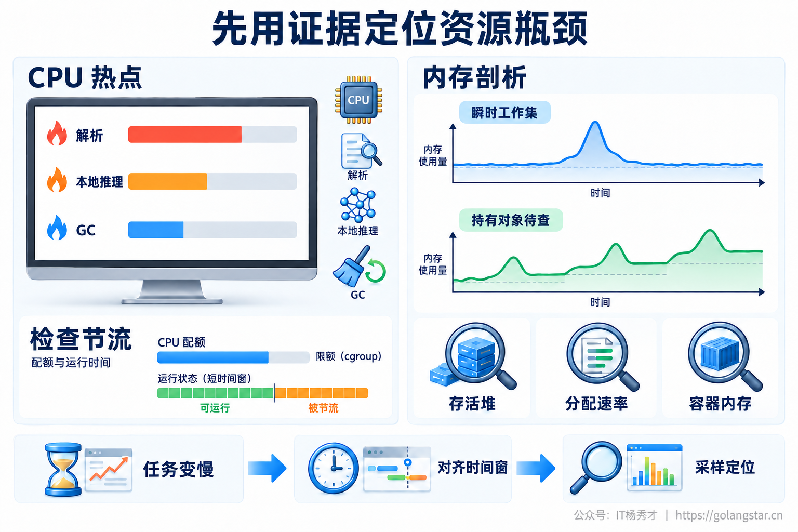
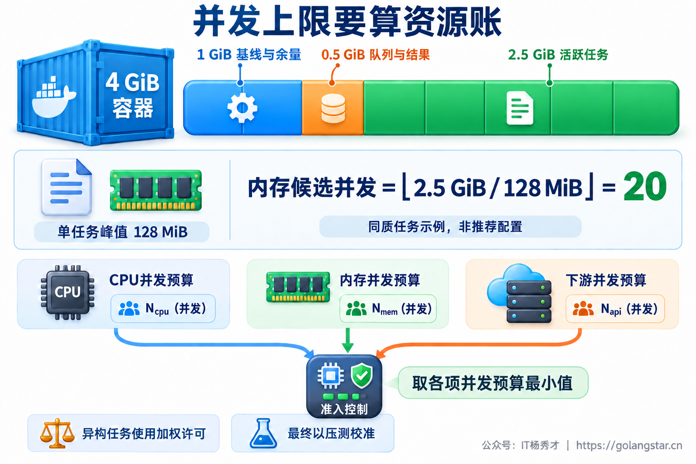
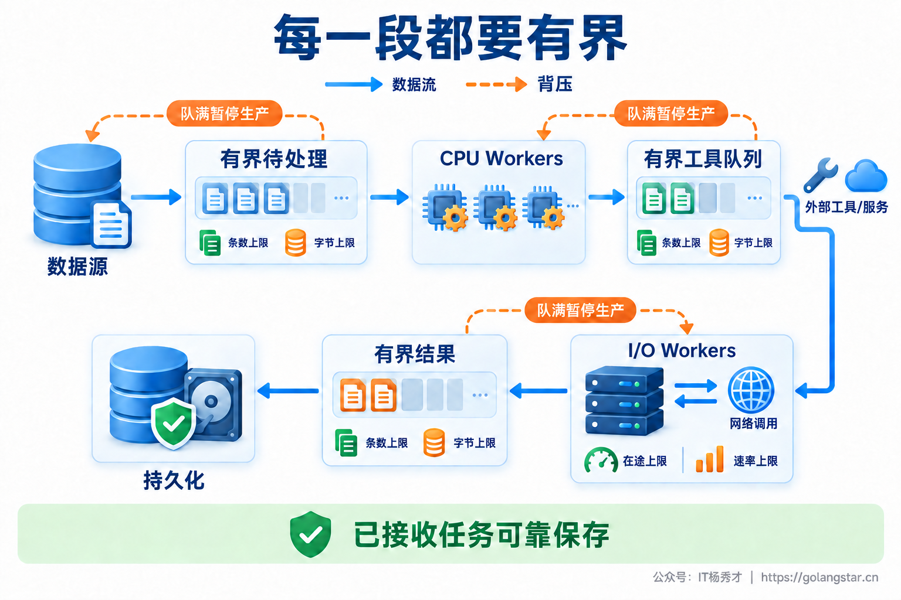
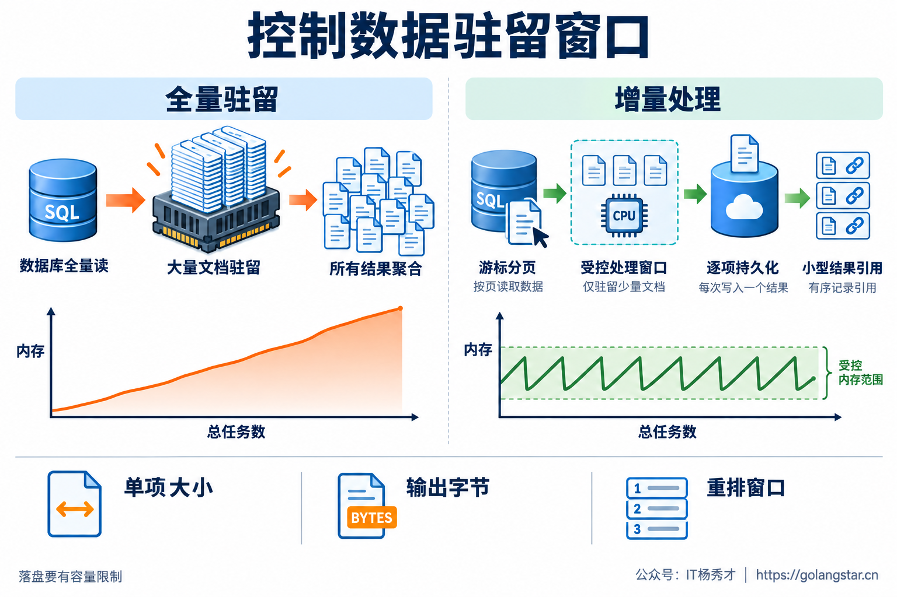
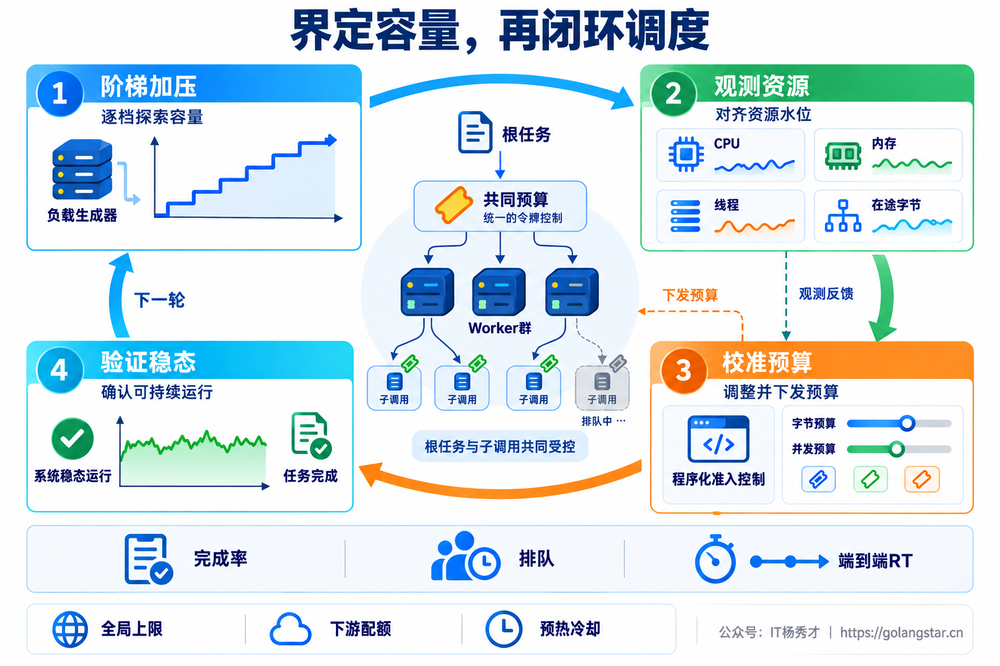

## **1. 题目分析**

同一个 Agent，逐条处理文档时运行正常，换成一次导入十万份文档，CPU 很快升高，内存接近上限，随后容器被 OOM 杀掉。把模型调用并发从 100 改成 10，再执行，内存依旧猛涨。

问题可能发生在调用模型之前：文档已经全部读进内存，十万个异步任务已经创建，每个任务还引用着原文、解析结果和待拼接的 Prompt。模型接口的限流器只管住了一小段执行过程，根本没有管住整批数据的生命周期。

这类问题的关键不是单独调一个线程数，而是让系统明确：**一次允许多少任务展开，每个阶段允许持有多少数据，处理不及时的时候，上游在哪里停下来。**

### **1.1 先控制正在扩大的工作集**

批量执行的风险来自同时存活的对象过多，不一定来自内存泄漏。一份文件可能先以压缩字节存在，解压后形成文本，再被解析成对象树、切成 Chunk、编码成向量，最后保留工具结果。多个表示同时存在，单任务工作集就可能远大于原始文件大小。

Agent 还会继续展开任务。假设 100 个活跃任务各自并行调用 8 个工具，理论上最多形成 800 个子调用。入口限制 100，并不代表整个系统只有 100 个在途操作。每个子调用的响应体、日志和重试状态都可能增加驻留内存。



生产止血首先收紧新批次准入、Broker 预取和任务派发，让已经运行的工作逐步排空；在线请求与离线批量任务使用独立资源池，避免批任务拖垮交互服务。已经接收的任务保留在可靠队列或任务表中，不能为了降内存直接丢弃。取消也需要沿调用链传播，确认执行退出、许可释放后才能恢复派发。

如果服务尚可采样，应保留峰值期间的性能证据。只重启进程往往会清掉现场；恢复消费后，同一批任务再次同时展开，故障仍然会回来。

### **1.2 区分计算热点和资源等待**

离线计算充分使用 CPU 本身不等于故障，关键要看完成吞吐是否继续增长、时延与可靠性目标是否被破坏。CPU 百分比还要注明相对单核、整机还是容器配额，避免把不同分母的监控值混在一起比较。

CPU 高需要先回答时间花在哪里。CPU Profile 可以定位文档解析、JSON 编解码、Tokenizer、本地 Embedding 或排序等计算热点；如果 GC 占比明显增加，则要同时检查对象分配速率和存活堆，判断是否在持续创建、复制和回收大量临时对象。

容器还存在另一种情况：进程需要继续计算，却已经耗尽 CPU 配额。此时要看 cgroup 的 throttling 指标，不能指望 CPU 火焰图显示未获得的 CPU 时间。Kubernetes 的 CPU limit 主要通过节流限制使用量，memory limit 则可能导致 OOM 终止，两者不是同一种保护方式。[Kubernetes 资源管理文档](https://kubernetes.io/docs/concepts/configuration/manage-resources-containers/)解释了这一区别。



图中的热点条和内存曲线仅用于解释诊断方向，不是实测数据。

内存诊断需要对齐任务变慢、队列增长和资源峰值的时间窗。Go 的 `inuse_space` 关注存活堆对象，`alloc_space` 是累计分配量，应通过时间差分判断分配压力；两者都不能直接等同于进程 RSS 或容器内存。具体采样口径可参见 [Go pprof 文档](https://pkg.go.dev/runtime/pprof)。

批次结束后回落，通常说明瞬时工作集过大；多轮相同负载之后基线持续抬高，则需要继续检查缓存、引用链、goroutine 残留和 native 分配，而不是仅凭一条曲线就认定泄漏。堆下降但 RSS 没立即下降，也可能与运行时保留内存有关。

这些因素会相互放大：CPU 节流让处理变慢，对象被持有更久；在途数据增多又提高 GC 压力，进一步挤占业务计算时间。因此，排查不能把 CPU 和内存当成互不相关的两张看板。

### **1.3 按资源预算决定并发**

Worker 数不能只按任务条数决定。容量规划至少需要拆出基线、执行工作集和缓冲区：

```text
峰值内存预算 ≈ 基线模型与缓存
             + Σ各阶段活跃任务数 × 对应单任务峰值工作集
             + Σ队列及未落盘结果的驻留字节
             + 运行时等其他开销与安全余量
```

每一份驻留数据只记一次，CPU 阶段结束但仍交给下游持有的对象，也不能从总账中提前扣掉。估计值需要来自代表性样本压测，并结合单项大小硬限制兜底，不能直接用平均文件大小代替。

例如一个 4 GiB 容器，扣除 1 GiB 基线及余量、0.5 GiB 队列和结果预算，还剩 2.5 GiB 可用于活跃任务。假设同质任务的峰值工作集为 128 MiB，内存侧候选并发就是 `floor(2560 / 128) = 20`。这里的数字只用于解释计算，并不是推荐配置，也不是已经验证过的容量。



20 还要受 CPU 与下游容量约束。对于同一类任务、同一执行阶段，可以把各项约束换算成并发预算后取最小值；不能直接把 CPU 核数、GiB 和 RPM 放进一个 `min`。CPU 侧可先用单位任务消耗的 CPU 秒估算持续处理能力，再通过压测确定并行度。可用核数乘以目标利用率，给出了每秒可支出的 CPU 秒预算，而不是瞬时并发数。

任务大小差异明显时，使用加权许可或大小任务分池。大文档占更多内存额度，小文本占更少，并限制单租户与单批次份额。权重大于整个池容量的任务必须提前拆分或分流，否则可能永远等不到许可。仅靠估计权重仍不够，实际读取和解压过程中也要执行字节上限。

### **1.4 让背压贯穿输入到输出**

一个常见错误是先创建所有 goroutine，再在 goroutine 内获取信号量。即使只有 10 个真正执行，其余 goroutine 的栈、闭包和引用对象也已经存在。正确的控制点应位于创建重任务、加载大对象之前，或者直接采用固定 Worker 从有界队列拉取任务。

Python 的异步写法也有类似陷阱：把全量协程交给 `asyncio.gather`，再在协程内部套 Semaphore，只限制执行区间，没有限制已创建 Task 的数量和最终结果集合。`TaskGroup` 提供结构化生命周期管理，也不自动限制任务数量。[Python asyncio 文档](https://docs.python.org/3/library/asyncio-task.html)说明了这些调度与结果收集行为。

输入端因此要使用游标、分页或惰性迭代，队列优先传任务 ID、对象存储引用和轻量元数据。仅把接口换成 Reader 还不够，如果解析器随后构建完整对象树，峰值依然存在。



整条链路可以拆成有界待处理队列、CPU 处理池、工具调用池、有界结果队列和持久化阶段。下游队列满了，上游必须暂停生产，不能换成另一个无限增长的临时 List。每层同时限制条数和字节，并核算所有层的总驻留量。

Broker 预取也属于这个边界。RabbitMQ 的 prefetch 限制未确认消息数量，常见配置作用于每个消费者，多个消费者的驻留量会叠加；并且它不是消息字节上限。Worker 只有 16 个，却提前拉取几千条大消息，仍然可能占满内存。[RabbitMQ prefetch 文档](https://www.rabbitmq.com/docs/consumer-prefetch)给出了具体语义。

任务展开的预算需要覆盖根任务、工具分支与重试，并同时约束实例和集群总量。父任务等待子任务时，不应持有子任务完成所必需的全部许可；可以分阶段释放额度，或由协调器统一派发。否则满池父任务等待无法启动的子任务，会把限并发做成死锁。

### **1.5 单独治理计算密集阶段**

远程模型与工具调用多数时间在等待网络，本地解析、向量计算和压缩却会持续占用 CPU。把两者塞进一个统一的高并发池，容易让计算阶段短时间内集中抢占处理器。因此应分别设置 CPU 并行度和 I/O 在途上限，按阶段传递结果并释放不再需要的数据。

还要检查隐藏的二次并行。外层开 8 个 Worker，内部推理库每个 Session 又开多个线程，操作系统面对的是多层线程池的叠加。ONNX Runtime 的内部算子线程、跨算子并行和 spinning 都会影响 CPU 消耗，需要结合 Session 复用与实际压测配置，不能只数语言层 Worker。[ONNX Runtime 线程管理文档](https://onnxruntime.ai/docs/performance/tune-performance/threading.html)提供了这些调节入口。

Go 的 `GOMAXPROCS` 控制同时执行 Go 代码的并行度，不限制 goroutine 总数，也不能限制所有 native 线程。Go 1.25 起默认值可感知 Linux cgroup CPU 配额，但实际行为仍受 Go 版本、模块兼容设置和显式配置影响，不能假设它始终等于容器 CPU limit。[Go runtime 文档](https://pkg.go.dev/runtime#GOMAXPROCS)明确说明了这些边界。

热点确认后，再做有针对性的优化，例如减少同一文档的重复解析、去掉不必要的 JSON 往返转换、复用只读模型实例。合并 Embedding 请求可以摊薄开销，但微批次仍要受条数、Token 和字节预算约束；批次更大不一定更快。

### **1.6 缩短数据驻留窗口**

输入流式化只是完成一半。如果每处理完一项都把完整结果追加到内存数组，最后统一生成报告，内存仍会随着任务总数增长。更稳妥的方式是逐项持久化，仅在有界窗口保留结果 ID 和状态，历史索引进入任务表，内存只留必要的小型统计；最终报告按需读取，或者分段生成。结果引用虽然小，全量积攒也不是常量内存。

结果必须有序时，还会遇到慢任务挡住后续结果的问题。第一项迟迟不完成，后面已经完成的几千项都滞留在排序缓冲区。有序输出需要有界重排窗口，或者按序号外部持久化后再读取，不能无限缓存等待。



单个任务超过容量时，并发降到 1 也无济于事。原始文件字节、解压后字节、页数或像素、Chunk 数、工具输出和执行时间都需要上限，在高开销处理前分片或转入专用大任务池。分片同时保留必要的上下文与汇总逻辑，避免省下内存却破坏答案完整性。

临时文件或对象存储可以承接大结果，但要设置配额、清理周期和失败回收机制。内存型 `emptyDir` 使用的是 tmpfs，并不能靠写入它释放容器内存压力。[Kubernetes 文档](https://kubernetes.io/docs/concepts/configuration/manage-resources-containers/#considerations-for-memory-backed-emptydir-volumes)对此有明确提醒。

最后检查日志、Trace 导出队列、HTTP 响应体和异常对象，避免它们再次引用整份文档。大缓冲区也不应无限塞进复用池，否则为了减少分配建立的缓存，反而抬高长期基线。

### **1.7 运行时参数只能辅助兜底**

Go 的 `GOMEMLIMIT` 是运行时内存软限制，不等于进程 RSS 或容器硬上限，也不覆盖全部 native 内存。它无法回收仍被任务引用的数据，设置得过低还可能造成频繁 GC。`GOGC` 同样是在内存与 GC CPU 之间做权衡，而不是同时降低两者的开关。应先减少工作集和分配，再调参数。[Go GC 指南](https://go.dev/doc/gc-guide)解释了这些取舍。

扩容需要在单实例工作集受控之后进行。新增副本会加载模型、填充缓存并开始预取，也会共同消耗下游配额；副本数增加不代表模型服务额度跟着增加。恢复时逐档提升入口和预取，保留全局并发与重试预算，重试采用退避和抖动，副作用操作保持幂等。

### **1.8 验证总量增长不再推高峰值**

最有说服力的测试，是固定在途预算，把任务总数从一万增加到十万。处理时间可以增长，但内存峰值应被驻留窗口约束，而不是随总条数线性增长。这能直接发现全量预读、提前创建任务和结果集中聚合。

再逐档增加在途量，观察有效完成吞吐、排队时间、端到端 P95、CPU 节流、GC、存活堆和容器内存。并发增加但完成吞吐不再上升、延迟却持续变差，说明已经接近或超过容量拐点，应留下安全余量，而不是继续把 CPU 利用率推高。



验收还要混入超大文档、高解压倍率输入、多工具扇出、慢写入、观测后端故障以及取消重试。检查各队列字节、结果重排窗口和线程数是否受控；恢复后任务不能丢失、重复产生副作用或一直占着许可。最终标准是质量与完成率不退化，资源维持可接受稳态，而不仅仅是监控曲线变低。

***

## **2. 参考回答**

我会先限制新批次、预取和任务派发，隔离在线与离线资源池，保住已接收任务，避免反复重启后又把同一批工作同时放进来。然后对齐峰值时间窗，用 CPU Profile 看解析、本地推理和 GC，用堆与分配数据查工作集，同时检查容器 CPU 节流和 native 线程。瞬时内存上涨不一定是泄漏，可能只是同时存活的数据太多。

核心改造是把输入、执行、输出做成有界流水线：游标分页读取，先拿许可再创建重任务，固定 Worker 处理，队列按条数和字节双限额，队满就向上游传递背压。并发根据内存工作集、CPU 和下游容量确定，并覆盖工具扇出与重试；CPU 密集阶段和 I/O 阶段分池，内部推理线程也要一起控制。结果逐项持久化，大对象提前限大小或分片，有序输出限制重排窗口。GOMEMLIMIT 和扩容只作为辅助。最后固定在途预算扩大任务总数，验证内存不再随总量线性增长，再通过突发、慢下游和取消重试压测确定安全容量，保证任务不丢、质量不降。

<div style="background-color: #f0f9eb; padding: 10px 15px; border-radius: 4px; border-left: 5px solid #67c23a; margin: 20px 0; color:rgb(64, 147, 255);">

## <span style="color: #006400;">**学习交流**</span>
<span style="color:rgb(4, 4, 4);">
> 如果您觉得文章有帮助，可以关注下秀才的<strong style="color: red;">公众号：IT杨秀才</strong>，后续更多优质的文章都会在公众号第一时间发布，不一定会及时同步到网站。点个关注👇，优质内容不错过
</span>


<div style="text-align: center; margin-top: 22px; padding-top: 20px; border-top: 1px solid #c2e7b0;">
<div style="color: #006400; font-size: 20px; font-weight: bold;">🔥 配套实战项目，拆得开、跑得起、能写进简历</div>
<div style="color: red; font-size: 16px; font-weight: bold; margin-top: 8px;">多 Agent 编排 + RAG 混合检索 · 31 篇深度教程 + 50+ 面试题</div>
<a href="/projects/dev-support.html" style="display: inline-block; margin-top: 14px; background: #ff7a18; color: #fff; font-size: 18px; font-weight: bold; padding: 10px 28px; border-radius: 24px; text-decoration: none;">点击查看 DevSupport AI 实战项目 →</a>
</div>
</div>
